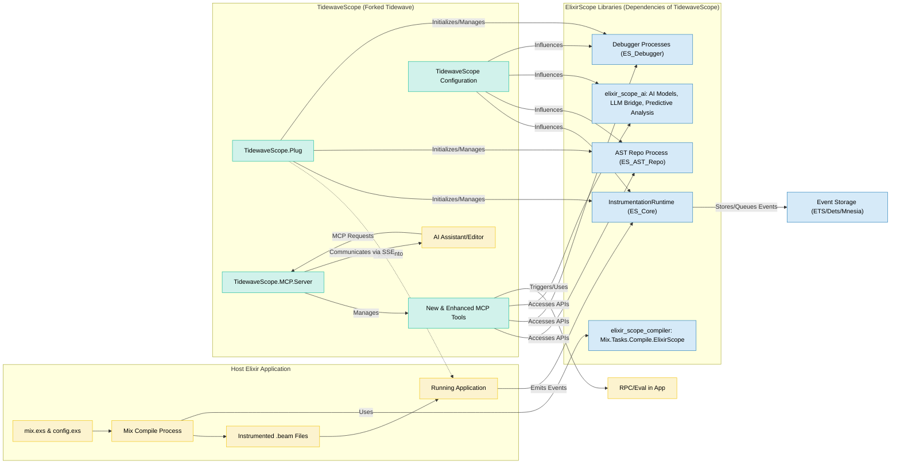
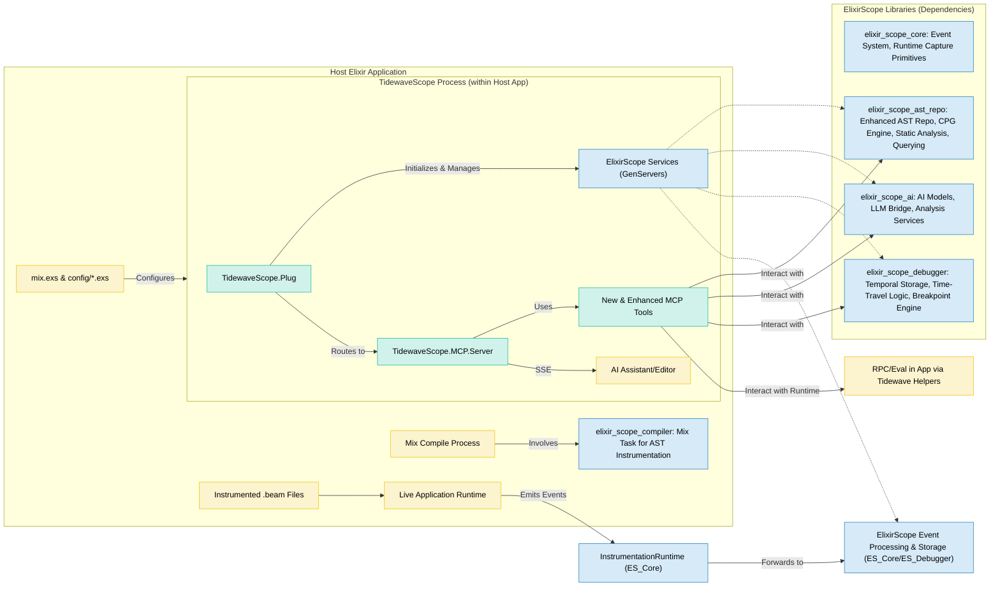

Okay, this is an ambitious and exciting direction! Forking Tidewave to integrate the deep static and dynamic analysis capabilities of ElixirScope, especially its CPG-centric approach and AI integration, could create a truly powerful debugging and development assistance tool.

Let's break down what this refactor entails.

## Deep Analysis: Merging ElixirScope's Vision with Tidewave's Framework

**ElixirScope's Core Strengths & Goals:**
1.  **Deep Code Understanding:** Through AST, CFG, DFG, and ultimately CPG, providing a rich, multi-faceted representation of the code.
2.  **Runtime-AST Correlation:** Precisely linking dynamic runtime events back to static code structures using stable AST Node IDs.
3.  **Advanced Debugging:** Time-travel, structural breakpoints, data flow breakpoints, semantic watchpoints.
4.  **AI-Powered Insights:** Leveraging the CPG and correlated data for predictive debugging, semantic search, refactoring suggestions, and complex pattern recognition.
5.  **Performance Monitoring:** Granular, AST-correlated performance data.
6.  **Compile-Time Instrumentation:** Modifying AST to inject capture points.

**Tidewave's Core Strengths & Framework:**
1.  **MCP Server:** An established Model Context Protocol server for AI assistants to interact with.
2.  **Runtime Bridge:** Connects an AI assistant to a live web application (Phoenix focus).
3.  **Tool-Based Interaction:** Exposes capabilities (evaluating code, reading logs, accessing DB) as "tools" via MCP.
4.  **Phoenix Integration:** Plugs into Phoenix, understands its runtime environment (Endpoint, Ecto).
5.  **Existing Dev Tool Philosophy:** Aims to speed up development by giving AI an understanding of the application.

**Synergies & Opportunities:**
*   **MCP as ElixirScope's Interface:** Tidewave's MCP server becomes the primary way for AI assistants (and potentially other developer tools) to access ElixirScope's powerful analysis and debugging capabilities.
*   **Enhanced Context for AI:** ElixirScope provides vastly richer context (CPG, semantic analysis, runtime traces) than Tidewave's current tools.
*   **Actionable Insights:** ElixirScope's analysis can be surfaced as actionable suggestions or data points through new MCP tools.
*   **Runtime Environment for ElixirScope:** Tidewave provides the "host" environment for ElixirScope's runtime components to live within, already integrated with the target application.

**Key Challenges:**
1.  **Architectural Integration:** Merging two distinct systems. ElixirScope is envisioned as a comprehensive platform; Tidewave is more of a focused bridge. The refactor needs to make Tidewave the "shell" or "host" for ElixirScope's intelligence.
2.  **Compile-Time vs. Runtime:** Tidewave is primarily a runtime plug. ElixirScope has a significant compile-time instrumentation aspect. This needs to be seamlessly integrated into the host application's build process when using the forked Tidewave.
3.  **Performance Overhead:** ElixirScope's deep analysis and event capture can be resource-intensive. This needs to be manageable and configurable within the Tidewave context, especially for a tool meant to speed up development.
4.  **Complexity Management:** Both systems have inherent complexity. Combining them must be done carefully to maintain clarity and usability.
5.  **Tool Proliferation:** Deciding which ElixirScope features become MCP tools and how they complement/replace existing Tidewave tools.
6.  **Data Storage:** ElixirScope implies significant data storage (ASTs, CPGs, events). Tidewave currently doesn't manage large-scale persistent storage beyond log buffers.

## Technical Refactoring Document: Integrating ElixirScope into Tidewave

**Project Title:** TidewaveScope (or similar, representing the merge)

**1. Vision & Goals**

*   **Goal:** To create an unparalleled AI-powered development assistant for Elixir applications by integrating ElixirScope's deep static and dynamic analysis (AST, CPG, runtime correlation, AI insights) into a forked Tidewave, leveraging Tidewave's MCP server and runtime bridge capabilities.
*   **Core Principle:** Tidewave provides the MCP interface and runtime integration; ElixirScope provides the underlying code intelligence, analysis, and debugging engine.

**2. Proposed Architecture**

The forked Tidewave will act as the primary interface and host. ElixirScope's components will be organized into distinct libraries/applications that the Tidewave fork depends on.

**Component Breakdown:**

*   **TidewaveScope (Fork):**
    *   **`TidewaveScope.Plug`:**
        *   Initializes and supervises core ElixirScope processes (AST Repository, Event Manager, Debugger components).
        *   Handles Tidewave's original responsibilities (routing to MCP).
        *   Manages configuration for both Tidewave and ElixirScope features.
    *   **`TidewaveScope.MCP.Server`:**
        *   Registers and manages a new suite of MCP tools powered by ElixirScope.
        *   May refactor existing tools to leverage ElixirScope's deeper context.
    *   **`TidewaveScope.MCP.Connection`:**
        *   The `assigns` map within a connection's state will be enriched with access to ElixirScope's APIs or repository references, allowing tools to efficiently query data.
*   **ElixirScope Libraries (as Hex packages or git dependencies):**
    *   **`elixir_scope_compiler`**:
        *   Contains `Mix.Tasks.Compile.ElixirScope`.
        *   This task is responsible for AST instrumentation (parsing, Node ID assignment, injecting calls to `ElixirScope.Capture.InstrumentationRuntime`).
        *   It will be invoked during the host application's compilation.
    *   **`elixir_scope_core`**:
        *   `ElixirScope.Capture.InstrumentationRuntime`: The functions called by instrumented code.
        *   Event definitions, Ingestor, RingBuffer, basic event persistence (e.g., to ETS, potentially with async writers to more durable storage).
        *   Core configuration management.
    *   **`elixir_scope_ast_repo`**:
        *   The `EnhancedASTRepository` (GenServer), including storage for ASTs, CFGs, DFGs, CPGs.
        *   All static analysis logic: `ASTAnalyzer`, `CFGGenerator`, `DFGGenerator`, `CPGBuilder`, `CPGMath`, `CPGSemantics`.
        *   `ProjectPopulator`, `FileWatcher`, `Synchronizer`.
        *   `QueryBuilder`, `QueryExecutor` (or direct Repository APIs).
        *   `PatternMatcher`.
        *   `MemoryManager`.
    *   **`elixir_scope_ai`**:
        *   AI Bridge, LLM Clients, IntelligentCodeAnalyzer, PredictiveAnalyzer, etc.
        *   These will consume data from `elixir_scope_ast_repo` and the runtime event stream.
    *   **`elixir_scope_debugger`**:
        *   `TemporalStorage`, `TemporalBridge`, `TemporalBridgeEnhancement`.
        *   `EnhancedInstrumentation` (for structural breakpoints, etc.).
        *   Logic for state reconstruction, time-travel queries.

**3. Key Integration Points & Refactoring Details**

*   **3.1. Compile-Time Instrumentation:**
    *   The host application using `TidewaveScope` will need to add `elixir_scope_compiler` to its `compilers` list in `mix.exs` (e.g., `compilers: Mix.compilers() ++ [:elixir_scope]`).
    *   The `Mix.Tasks.Compile.ElixirScope` task will perform AST transformation, embedding `ast_node_id`s and calls to `ElixirScope.Capture.InstrumentationRuntime` functions (from `elixir_scope_core`).
    *   Configuration for what to instrument will be managed by `TidewaveScope.Plug` and passed to the compiler (e.g., via application env or a config file).

*   **3.2. Runtime Event Capture & Processing:**
    *   Instrumented code calls `ElixirScope.Capture.InstrumentationRuntime` (from `elixir_scope_core`).
    *   These events are ingested (e.g., into a RingBuffer).
    *   Async processes write events to a configurable storage backend (ETS for hot data, potentially Dets/Mnesia or external DB for historical/cold data). This storage is managed by `elixir_scope_core` or `elixir_scope_debugger` (for temporal storage).
    *   The `TidewaveScope.Plug` will ensure these capture components are started and configured.

*   **3.3. Enhanced AST Repository Management:**
    *   The `TidewaveScope.Plug` starts and supervises the `ElixirScope.ASTRepository.Enhanced.Repository` GenServer.
    *   `ProjectPopulator` (triggered by the Plug on startup or on-demand via an MCP tool) populates the repository.
    *   `FileWatcher` and `Synchronizer` keep the repository updated.

*   **3.4. New MCP Tools:**
    *   A new suite of MCP tools will be created, likely in a `TidewaveScope.MCP.Tools.ElixirScope` namespace or similar. These tools will be the primary interface to ElixirScope's capabilities.
    *   Examples:
        *   **Static Analysis Tools:**
            *   `elixir_scope_get_cpg_node(ast_node_id)`: Get detailed CPG node info.
            *   `elixir_scope_query_ast_repo(query_spec)`: Execute complex queries using `QueryBuilder` syntax against the AST/CPG repo.
            *   `elixir_scope_get_function_complexity(module, function, arity)`
            *   `elixir_scope_detect_smell(module, function, smell_type)`: Leverage `PatternMatcher` with CPG rules.
            *   `elixir_scope_get_dependencies(module, function, arity, type: :call | :data)`
            *   `elixir_scope_get_impact_analysis(module, function, arity)`
        *   **Runtime/Dynamic Analysis Tools:**
            *   `elixir_scope_get_correlated_events(ast_node_id, time_window_ms)`: Get runtime events linked to a specific AST node.
            *   `elixir_scope_get_execution_trace(correlation_id)`: Get an AST-aware execution trace.
            *   `elixir_scope_reconstruct_state_at_event(event_id)`: Uses `TemporalBridgeEnhancement`.
            *   `elixir_scope_get_live_process_cpg_context(pid)`: Show what CPG node a live process is currently "in" or recently executed (requires very tight correlation).
        *   **Debugging Tools:**
            *   `elixir_scope_set_structural_breakpoint(pattern_spec)`
            *   `elixir_scope_list_breakpoints()`
            *   `elixir_scope_get_watchpoint_value(watchpoint_id)`
        *   **AI-Powered Tools:**
            *   `elixir_scope_ai_explain_node(ast_node_id)`
            *   `elixir_scope_ai_suggest_refactor(ast_node_id)`
            *   `elixir_scope_ai_predict_issue(ast_node_id)`

*   **3.5. Refactoring Existing Tidewave Tools:**
    *   **`project_eval` (`Tidewave.MCP.Tools.Eval`):**
        *   Can remain for simple evaluations.
        *   Could be enhanced: After evaluation, the *result* or any *output* could be fed into ElixirScope's AI for analysis or explanation.
        *   The code being evaluated could itself be (temporarily) instrumented by ElixirScope for fine-grained tracing during that specific eval.
    *   **`get_source_location` (`Tidewave.MCP.Tools.Source`):**
        *   Can be significantly enhanced by querying ElixirScope's AST Repository, which has precise `ast_node_id` to line/column mappings.
    *   **`get_logs` (`Tidewave.MCP.Tools.Logs`):**
        *   Standard application logs remain useful.
        *   `elixir_scope_get_correlated_events` will provide a much richer, structured alternative for debugging.
    *   **`execute_sql_query` (`Tidewave.MCP.Tools.Ecto`):**
        *   Remains useful.
        *   ElixirScope could provide tools to analyze the Ecto queries themselves (statically from CPG) or trace their runtime execution paths if Ecto calls are instrumented.
    *   **Filesystem Tools (`Tidewave.MCP.Tools.FS`):**
        *   These are general FS tools. ElixirScope's `ProjectPopulator` and `FileWatcher` are more specialized for Elixir code files and their analysis. They are complementary.
        *   `write_project_file` could trigger ElixirScope's `Synchronizer` to re-analyze the changed file. Tidewave's `autoformat` could be a pre-commit hook to this.

*   **3.6. Configuration (`config/config.exs` and TidewaveScope Plug options):**
    *   A new top-level config key, e.g., `config :my_app, TidewaveScope, ...`.
    *   Sub-configurations for ElixirScope components:
        *   `ast_repo: [populator_opts: [...], memory_manager_opts: [...]]`
        *   `event_capture: [storage_backend: ..., sampling_rate: ...] `
        *   `ai: [llm_provider: ..., prediction_model_path: ...]`
        *   `debugger: [temporal_storage_opts: ...]`
    *   Ability to enable/disable major ElixirScope features (static analysis, runtime capture, AI) to manage performance.
    *   Tidewave's existing options (`allowed_origins`, `allow_remote_access`, `autoformat`, `inspect_opts`) will be preserved and work alongside.

*   **3.7. Data Storage Strategy:**
    *   **AST Repository Data (CPGs, etc.):** Primarily ETS, managed by `elixir_scope_ast_repo.MemoryManager`. Consider Dets for persistence across restarts for faster cold starts (optional).
    *   **Runtime Events:**
        *   Hot/Recent Events: ETS RingBuffer (from `elixir_scope_core`).
        *   Temporal Storage (for debugger): ETS, potentially with Dets for larger history, managed by `elixir_scope_debugger.TemporalStorage`.
        *   Long-term/Cold Storage (optional): Could be an external database or file-based, written by async writers from the RingBuffer. TidewaveScope would not manage this directly but provide hooks.

**4. Impact on Tidewave's Existing Features/Files**

*   **`README.md`:** Will need a major overhaul to describe the new capabilities, architecture, and ElixirScope integration.
*   **`mix.exs`:** Dependencies will change significantly to include ElixirScope libraries.
*   **`lib/tidewave.ex` (Plug):** Will manage ElixirScope component lifecycle.
*   **`lib/tidewave/mcp.ex` & `lib/tidewave/mcp/server.ex`:** The `raw_tools` list will be expanded. Connection state might include ElixirScope context.
*   **`lib/tidewave/application.ex`:** Will supervise the TidewaveScope Plug and potentially other top-level ElixirScope managers if not handled by the Plug.
*   **Tool Modules (`lib/tidewave/mcp/tools/*.ex`):** Some will be refactored; new ones will be added.
*   **Documentation (`pages/*`):** Will need extensive updates and new sections for ElixirScope features, setup, and usage. Security page needs updating for new risks/mitigations. Tips and tricks will expand greatly.

**5. Development Phases (High-Level)**

*   **Phase 1: Core Integration & Static Analysis Tools.**
    1.  Fork Tidewave.
    2.  Structure ElixirScope into basic libraries (`core`, `ast_repo`, `compiler`).
    3.  Integrate `elixir_scope_compiler` into the build process.
    4.  Start `EnhancedASTRepository` via the `TidewaveScope.Plug`.
    5.  Implement `ProjectPopulator` integration.
    6.  Develop initial MCP tools for querying the AST Repository (e.g., `elixir_scope_get_function_info`, `elixir_scope_get_dependencies`).
*   **Phase 2: Runtime Event Capture & Basic Correlation Tools.**
    1.  Implement basic event capture pipeline (`InstrumentationRuntime`, Ingestor, RingBuffer, ETS storage).
    2.  Correlate runtime events with AST Node IDs.
    3.  Develop MCP tools to view captured events, possibly filtered by AST node (e.g., `elixir_scope_get_events_for_node`).
*   **Phase 3: Advanced Debugging Features & Tools.**
    1.  Implement `TemporalStorage` and `TemporalBridge`.
    2.  Develop `EnhancedInstrumentation` for structural breakpoints.
    3.  Create MCP tools for time-travel debugging and advanced breakpoint management.
*   **Phase 4: CPG Algorithm Integration & Semantic Analysis Tools.**
    1.  Integrate `CPGMath` and `CPGSemantics` into `elixir_scope_ast_repo`.
    2.  Enhance MCP tools to expose CPG-based analysis (centrality, paths, smells).
    3.  Refine `PatternMatcher` with CPG rules.
*   **Phase 5: AI Integration.**
    1.  Integrate `elixir_scope_ai` libraries.
    2.  Develop MCP tools that expose AI insights (explanations, suggestions, predictions).
*   **Phase 6: "Cinema Debugger" UI/API (Separate Project).**
    1.  Develop a UI (web or editor extension) that consumes data from `TidewaveScope`'s MCP or dedicated API endpoints.

**6. Key Considerations for ElixirScope `lib/elixir_scope/ast_repository/enhanced/cfg_generator/expression_processors.ex`**

This specific file from ElixirScope, which delegates expression processing, will reside within the `elixir_scope_ast_repo` library. It's part of the static analysis pipeline that populates the CPG. Its direct integration into Tidewave is indirect:
*   The `TidewaveScope.Plug` would ensure the `EnhancedASTRepository` process is running.
*   When `ProjectPopulator` analyzes a file, it would use `ASTAnalyzer`, which in turn would use `CFGGenerator`, which then uses `ExpressionProcessors` to build the CFG part of the CPG.
*   The MCP tools in `TidewaveScope` would then query the fully built CPG, benefiting from the detailed analysis this file (and others like it) contributed to.

**7. Security Implications**

The power of ElixirScope (evaluating code, deep introspection, file system access via `ProjectPopulator` during analysis) significantly increases the potential security risks if TidewaveScope is exposed. Tidewave's existing security measures (localhost binding by default, remote IP checks, origin checks) become even more critical. Clear warnings and documentation about running this in trusted development environments only are paramount.

This refactor represents a substantial undertaking but has the potential to create a best-in-class Elixir development and debugging tool. The modular library approach for ElixirScope components will be key to managing complexity.Okay, this is a significant undertaking, but also a very powerful vision! You're essentially proposing to use Tidewave as the **runtime bridge and MCP interface** for the advanced static and dynamic analysis capabilities of ElixirScope.

Here's a deep analysis of what this refactor entails and a technical document outline.

## Deep Analysis: Merging ElixirScope's Vision with Tidewave's Framework

**ElixirScope's Core Strengths & Goals (as understood from your docs):**
1.  **Deep Code Understanding:** Through AST, CFG, DFG, and ultimately CPG, providing a rich, multi-faceted representation of the code.
2.  **Runtime-AST Correlation:** Precisely linking dynamic runtime events back to static code structures using stable AST Node IDs.
3.  **Advanced Debugging:** Time-travel, structural breakpoints, data flow breakpoints, semantic watchpoints.
4.  **AI-Powered Insights:** Leveraging the CPG and correlated data for predictive debugging, semantic search, refactoring suggestions, and complex pattern recognition.
5.  **Performance Monitoring:** Granular, AST-correlated performance data.
6.  **Compile-Time Instrumentation:** Modifying AST to inject capture points.

**Tidewave's Core Strengths & Framework (as understood from provided files):**
1.  **MCP Server:** An established Model Context Protocol server for AI assistants to interact with.
2.  **Runtime Bridge:** Connects an AI assistant to a live web application (Phoenix focus).
3.  **Tool-Based Interaction:** Exposes capabilities (evaluating code, reading logs, accessing DB) as "tools" via MCP.
4.  **Phoenix Integration:** Plugs into Phoenix, understands its runtime environment (Endpoint, Ecto).
5.  **Existing Dev Tool Philosophy:** Aims to speed up development by giving AI an understanding of the application.

**Synergies & Opportunities:**
*   **MCP as ElixirScope's Interface:** Tidewave's MCP server becomes the primary way for AI assistants (and potentially other developer tools) to access ElixirScope's powerful analysis and debugging capabilities.
*   **Enhanced Context for AI:** ElixirScope provides vastly richer context (CPG, semantic analysis, runtime traces) than Tidewave's current tools.
*   **Actionable Insights:** ElixirScope's analysis can be surfaced as actionable suggestions or data points through new MCP tools.
*   **Runtime Environment for ElixirScope:** Tidewave provides the "host" environment for ElixirScope's runtime components to live within, already integrated with the target application.

**Key Challenges & Refactoring Areas:**
1.  **Architectural Integration:**
    *   Tidewave is primarily a runtime plug with an MCP server.
    *   ElixirScope has significant compile-time (AST instrumentation, CPG generation) and runtime (event capture, AST repository, AI analysis) components.
    *   The refactor will involve making the Tidewave fork the "host" or "shell" that initializes, manages, and exposes ElixirScope's capabilities.
2.  **Compile-Time Instrumentation:**
    *   Tidewave itself doesn't do AST transformation. ElixirScope's `Mix.Tasks.Compile.ElixirScope` (or similar) will need to be integrated into the build process of the *host application* that uses the forked Tidewave.
    *   The forked Tidewave's setup/installation process needs to guide users on this.
3.  **Runtime Components & Lifecycle:**
    *   ElixirScope's GenServers (Enhanced AST Repository, Event Manager, AI Analyzers, Debugger components) need to be started, supervised, and managed by the forked Tidewave application/plug.
4.  **MCP Tool Redesign/Augmentation:**
    *   Existing Tidewave tools (`project_eval`, `get_source_location`, etc.) can be significantly enhanced by ElixirScope's deep context.
    *   Many new MCP tools will be needed to expose ElixirScope's unique features (CPG queries, semantic analysis, time-travel debugging commands).
5.  **Data Management & Storage:**
    *   ElixirScope implies storage for ASTs, CPGs, runtime events, and analysis results. Tidewave currently has minimal state (log buffer).
    *   The forked Tidewave will need to manage or configure this storage (e.g., ETS for hot data, Dets/Mnesia or even external DBs for larger/persistent data, as envisioned by ElixirScope's `Storage.DataAccess`).
6.  **Configuration:**
    *   A unified configuration system will be needed for both Tidewave-specific settings and the extensive ElixirScope component settings.
7.  **Performance & Overhead:**
    *   ElixirScope's comprehensive analysis and capture can be resource-intensive. This must be configurable and manageable within the Tidewave context to ensure it remains a development *accelerator*.
8.  **Modularity:**
    *   ElixirScope's components (AST repo, CPG logic, AI, debugger) should be developed as modular libraries that the Tidewave fork depends on. This promotes maintainability and potential reuse.

---

## Technical Refactoring Document: Integrating ElixirScope into Tidewave

**Project Title:** `TidewaveScope` (Illustrative name for the forked project)

**1. Vision & Goals**

*   To create a next-generation AI-powered development assistant for Elixir by embedding ElixirScope's deep static and dynamic analysis capabilities (AST, CPG, runtime correlation, AI insights) within a forked Tidewave framework.
*   Tidewave's MCP server will serve as the primary interface for AI assistants to leverage ElixirScope's intelligence.
*   The goal is to provide AI with an unparalleled understanding of the application's code structure, runtime behavior, and potential issues, enabling highly effective debugging, refactoring, and code generation assistance.

**2. Proposed Architecture**

The `TidewaveScope` fork will integrate ElixirScope functionalities as a set of underlying services and libraries.

**Core Components of `TidewaveScope` Fork:**

*   **`TidewaveScope.Plug` (Modified `Tidewave` Plug):**
    *   Original Tidewave plug functionality (MCP request handling).
    *   **NEW:** Initializes and supervises core ElixirScope GenServers:
        *   `ElixirScope.ASTRepository.Enhanced.Repository` (from `elixir_scope_ast_repo`).
        *   `ElixirScope.Capture.PipelineManager` (or similar top-level event manager from `elixir_scope_core`).
        *   `ElixirScope.Capture.TemporalBridgeEnhancement` (from `elixir_scope_debugger`).
        *   Relevant AI service managers (from `elixir_scope_ai`).
    *   Handles configuration parsing for both Tidewave and all ElixirScope components.
    *   May trigger initial `ProjectPopulator` run for the AST repository.

*   **`TidewaveScope.MCP.Server` (Modified `Tidewave.MCP.Server`):**
    *   The `raw_tools/0` function will be significantly expanded to include tools powered by ElixirScope.
    *   Existing tools will be reviewed and potentially refactored to use ElixirScope's richer context.

*   **`TidewaveScope.MCP.Connection` (Modified `Tidewave.MCP.Connection`):**
    *   The `assigns` map (or `config` within the connection state) will be enhanced to provide MCP tools with efficient access to:
        *   The `ElixirScope.ASTRepository.Enhanced.Repository` PID or an API module.
        *   APIs for querying runtime events and debugger states.
        *   APIs for invoking AI analyses.

**ElixirScope Libraries (To be organized as separate Hex packages or git dependencies):**

*   **`elixir_scope_compiler`:**
    *   Contains `Mix.Tasks.Compile.ElixirScope`. This task will:
        *   Integrate `ElixirScope.ASTRepository.Parser` and `NodeIdentifier` for AST pre-processing.
        *   Use `ElixirScope.AST.EnhancedTransformer` to inject calls to `ElixirScope.Capture.InstrumentationRuntime`.
    *   **Integration:** Host applications using `TidewaveScope` will add this compiler to `mix.exs`: `compilers: Mix.compilers() ++ [:elixir_scope]`.

*   **`elixir_scope_core`:**
    *   Defines `ElixirScope.Events` and core event structures.
    *   `ElixirScope.Capture.InstrumentationRuntime`: The actual functions called by instrumented code at runtime.
    *   `ElixirScope.Capture.Ingestor`, `RingBuffer`, `AsyncWriterPool`, `PipelineManager`: For efficient, non-blocking event capture and initial processing.
    *   `ElixirScope.Storage.DataAccess` (or a similar ETS-based event store): For short-term/hot event storage.

*   **`elixir_scope_ast_repo`:**
    *   `ElixirScope.ASTRepository.Enhanced.Repository` (GenServer): Central manager for all static analysis data.
    *   All AST, CFG, DFG, CPG related modules (`Parser`, `NodeIdentifier`, `ASTAnalyzer`, `CFGGenerator`, `DFGGenerator`, `CPGBuilder`, data structures like `EnhancedModuleData`, `CPGData`).
    *   Graph algorithms (`CPGMath`, `CPGSemantics`).
    *   Project analysis and sync (`ProjectPopulator`, `FileWatcher`, `Synchronizer`).
    *   Querying (`QueryBuilder`, `QueryExecutor`).
    *   `PatternMatcher` and `MemoryManager`.

*   **`elixir_scope_ai`:**
    *   `ElixirScope.AI.Bridge`: Facade for AI components.
    *   `ElixirScope.AI.LLM.*`: LLM client and provider logic.
    *   Specific analyzers (`IntelligentCodeAnalyzer`, `ComplexityAnalyzer`, `Predictive.ExecutionPredictor`).

*   **`elixir_scope_debugger`:**
    *   `ElixirScope.Capture.TemporalStorage`: Specialized event storage for time-travel.
    *   `ElixirScope.Capture.TemporalBridge`, `TemporalBridgeEnhancement`: Logic for state reconstruction and AST-aware temporal queries.
    *   `ElixirScope.Capture.EnhancedInstrumentation`: Engine for structural breakpoints, data flow breakpoints, semantic watchpoints.

**3. Key Integration Steps & Refactoring Details**

*   **3.1. Configuration System:**
    *   Define a comprehensive configuration schema under a `TidewaveScope` key in `config.exs`.
    *   This will include sub-sections for `ast_repository`, `event_capture`, `debugger`, `ai_analysis`, alongside existing Tidewave options.
    *   The `TidewaveScope.Plug` will be responsible for loading and distributing this configuration to the relevant ElixirScope components.

*   **3.2. Application Lifecycle Integration:**
    *   The `TidewaveScope.Plug`'s `init/1` and supervision tree will start and manage all necessary ElixirScope GenServers.
    *   Graceful shutdown procedures for ElixirScope services will be integrated.

*   **3.3. New MCP Tools Suite:**
    *   **Static Analysis & CPG Tools:**
        *   `es_get_ast_node_details(ast_node_id)`: Returns `EnhancedFunctionData` or CPG node details.
        *   `es_query_cpg(cpg_query_spec)`: Executes a `QueryBuilder`-like query on the CPG.
        *   `es_get_cfg(module, function, arity)`, `es_get_dfg(...)`, `es_get_cpg(...)`.
        *   `es_get_semantic_path(start_node, end_node, opts)`: Uses `CPGSemantics`.
        *   `es_get_impact_analysis(node_id, opts)`: Uses `CPGSemantics`.
        *   `es_detect_smells(target_node_id_or_module, smell_types, opts)`: Uses `PatternMatcher` and `CPGSemantics`.
    *   **Runtime & Correlation Tools:**
        *   `es_get_runtime_events_for_ast_node(ast_node_id, time_window_ns, filters)`
        *   `es_get_correlated_execution_trace(correlation_id_or_event_id)`
    *   **Debugger Control Tools:**
        *   `es_reconstruct_state_at_timestamp(pid, timestamp_ns)`
        *   `es_reconstruct_state_with_ast(session_id, timestamp_ns)` (from `TemporalBridgeEnhancement`)
        *   `es_set_structural_breakpoint(pattern_spec)`
        *   `es_set_dataflow_breakpoint(spec)`
        *   `es_list_active_breakpoints()`
    *   **AI-Powered Tools:**
        *   `es_ai_explain_code(ast_node_id_or_code_snippet)`
        *   `es_ai_suggest_refactoring(ast_node_id)`
        *   `es_ai_predict_performance_bottleneck(function_signature)`
    *   **Repository Management Tools:**
        *   `es_repo_populate_project()`
        *   `es_repo_get_status()`
        *   `es_repo_get_memory_stats()`

*   **3.4. Refactoring Existing Tidewave Tools:**
    *   **`project_eval` (Tidewave.MCP.Tools.Eval):**
        *   Can be augmented. Before evaluation, the code string could be sent to `elixir_scope_ast_repo` for temporary analysis, providing context *to the LLM about the code it's about to ask to be evaluated*.
        *   The output/result of the evaluation can be sent to `elixir_scope_ai` for explanation.
    *   **`get_source_location` (Tidewave.MCP.Tools.Source):**
        *   Will be significantly enhanced by querying `elixir_scope_ast_repo` which has precise `ast_node_id` to line/column mappings.
    *   **`get_logs` (Tidewave.MCP.Tools.Logs):**
        *   This will remain for standard Phoenix/application logs.
        *   A new `es_get_elixirscope_events` tool will provide access to the richer, structured event stream from ElixirScope.
    *   **`list_liveview_pages` (Tidewave.MCP.Tools.Phoenix):**
        *   If LiveView processes are instrumented, ElixirScope can provide much richer context about their internal state and recent CPG execution paths. This tool can be enhanced to fetch this data.
    *   **Filesystem Tools (Tidewave.MCP.Tools.FS):**
        *   `write_project_file`: After writing, it should notify `elixir_scope_ast_repo.Synchronizer` to re-analyze the file.
        *   Tidewave's `autoformat` could be enhanced by `elixir_scope_ai` to suggest more semantic improvements beyond syntax.

*   **3.5. ElixirScope File (`lib/elixir_scope/ast_repository/enhanced/cfg_generator/expression_processors.ex`):**
    *   This file, and the entire CPG generation logic, will reside in the `elixir_scope_ast_repo` library.
    *   It's invoked by `CFGGenerator` when `ProjectPopulator` (managed by `TidewaveScope.Plug`) processes source files.
    *   The results (CFG data embedded in CPG) become queryable via the new MCP tools.

*   **3.6. Data Flow and State:**
    *   **Compile-Time:** `UserApp -> ES_Compiler -> InstrumentedBeam`.
    *   **Runtime Initialization:** `TidewaveScope.Plug` starts `ES_Services`. `ProjectPopulator` populates `ES_AST_Repo`.
    *   **Runtime Event Flow:** `RunningApp (Instrumented) -> ES_Core_Runtime -> EventProcessing (ETS/TemporalStorage)`.
    *   **MCP Request Flow:** `AI_Assistant -> TS_MCP_Server -> TS_MCP_Tools -> (ES_AST_Repo | ES_AI | ES_Debugger | RunningAppRpc)`.
    *   The `assigns` in `TidewaveScope.MCP.Connection` will hold references or APIs to interact with `ES_AST_Repo`, event stores, and debugger services for efficient tool execution.

**4. Impact on Tidewave Structure (File-Level)**

*   **`mix.exs`:**
    *   Add dependencies on `elixir_scope_compiler`, `elixir_scope_core`, `elixir_scope_ast_repo`, `elixir_scope_ai`, `elixir_scope_debugger`.
    *   Potentially update project metadata.
*   **`lib/tidewave.ex` (Plug):**
    *   Modify `init/1` to load ElixirScope configurations.
    *   Add ElixirScope services to its supervision strategy or ensure they are started by `TidewaveScope.Application`.
    *   May add logic to trigger `ProjectPopulator`.
*   **`lib/tidewave/application.ex`:**
    *   Ensure all necessary ElixirScope top-level supervisors are included in its child list.
*   **`lib/tidewave/mcp.ex`, `lib/tidewave/mcp/server.ex`:**
    *   The `raw_tools/0` function in `Server` will be the main place to add new ElixirScope tools.
    *   `Connection` state will be modified as described above.
*   **`lib/tidewave/mcp/tools/` directory:**
    *   Existing tool modules will be refactored.
    *   New modules for ElixirScope tools will be added (e.g., `lib/tidewave/mcp/tools/static_analysis.ex`, `lib/tidewave/mcp/tools/debugger.ex`).
*   **`config/config.exs`:**
    *   Will need extensive additions for ElixirScope component configuration.
*   **Documentation (`README.md`, `pages/`):**
    *   Major overhaul required. New installation steps (compiler integration), feature descriptions, security considerations for very powerful new tools, new configuration options, advanced usage guides.

**5. "Cinema Debugger" UI**

The Cinema Debugger UI, as envisioned by ElixirScope, is not part of Tidewave itself. `TidewaveScope` (the fork) will provide the **backend and MCP API** that a separate Cinema Debugger UI (e.g., a web application or an editor extension) would consume. This UI would make MCP calls to `TidewaveScope` to fetch temporal data, CPG visualizations, state reconstructions, etc.

**6. Development & Refactoring Strategy**

1.  **Modularize ElixirScope:** First, ensure ElixirScope's components are well-defined, independent libraries with clear APIs.
2.  **Fork Tidewave:** Create the `TidewaveScope` fork.
3.  **Core Service Integration:** Integrate the lifecycle management of key ElixirScope GenServers (`EnhancedASTRepository`, `PipelineManager`) into `TidewaveScope.Plug` and `Application`.
4.  **Compiler Integration:** Document and test the integration of `elixir_scope_compiler` into a host app using `TidewaveScope`.
5.  **Static Analysis Tools:** Implement the first set of MCP tools that query the `EnhancedASTRepository`.
6.  **Runtime Capture & Correlation:** Integrate the event capture pipeline and basic runtime-AST correlation. Implement MCP tools to view these events.
7.  **CPG & Semantic Tools:** Layer in CPG generation and the more advanced semantic analysis tools.
8.  **Debugger Tools:** Integrate `elixir_scope_debugger` and expose its features via MCP.
9.  **AI Tools:** Finally, layer in the AI analysis tools.
10. **Documentation & Testing:** Iterate on these throughout the process.

**Conclusion:**

This refactoring will transform Tidewave from a useful AI assistant bridge into a deeply powerful, intelligent development platform. The key is modular design of ElixirScope components and a well-thought-out integration strategy that leverages Tidewave's existing MCP framework while significantly expanding its capabilities. The focus will be on making ElixirScope's rich analytical data accessible and actionable through the MCP interface.
