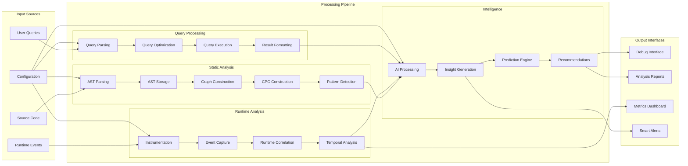

# ElixirScope Technical Deep Dive

**Version:** 2.0  
**Date:** June 5, 2025  
**Status:** Unified Package Architecture - Technical Implementation Guide  

## Executive Summary

ElixirScope is a sophisticated AST-based debugging and code intelligence platform for Elixir applications. Built on a clean 8-layer architecture with Foundation as an external hex dependency, it provides comprehensive static code analysis, runtime correlation, and AI-powered insights. This document provides a detailed technical deep dive into the system architecture, implementation strategy, and layer interactions.

## System Architecture Overview

```mermaid
graph TB
    subgraph "ElixirScope Unified Package"
        subgraph "Layer 8: Debugger Interface"
            DEBUG[Debugger Layer]
            SESSIONS[Session Management]
            BREAKPOINTS[Breakpoint Manager]
            TIMETRAVEL[Time Travel Engine]
            VISUALIZATION[Visualization Engine]
        end
        
        subgraph "Layer 7: Intelligence/AI"
            INTEL[Intelligence Layer]
            LLM[LLM Integration]
            INSIGHTS[Insight Generator]
            PREDICTIONS[Prediction Engine]
            ORCHESTRATOR[AI Orchestrator]
        end
        
        subgraph "Layer 6: Runtime & Query"
            CAPTURE[Capture Layer]
            QUERY[Query Layer]
            INSTR[Instrumentation]
            CORRELATION[Event Correlation]
            EXECUTOR[Query Executor]
            DSL[Query DSL]
        end
        
        subgraph "Layer 5: Analysis"
            ANALYSIS[Analysis Layer]
            PATTERNS[Pattern Detection]
            QUALITY[Quality Assessment]
            METRICS[Metrics Calculation]
            RECOMMENDATIONS[Recommendations]
        end
        
        subgraph "Layer 4: Code Property Graph"
            CPG[CPG Layer]
            BUILDER[CPG Builder]
            CFG[Control Flow Graph]
            DFG[Data Flow Graph]
            CALLGRAPH[Call Graph]
            SEMANTIC[Semantic Analysis]
        end
        
        subgraph "Layer 3: Graph Algorithms"
            GRAPH[Graph Layer - libgraph Hybrid]
            CENTRALITY[Centrality Algorithms]
            PATHFINDING[Pathfinding]
            COMMUNITY[Community Detection]
            CONVERTERS[Data Converters]
        end
        
        subgraph "Layer 2: AST Operations"
            AST[AST Layer]
            PARSER[AST Parser]
            REPOSITORY[AST Repository]
            MEMORY[Memory Manager]
            PATTERNS_AST[Pattern Matcher]
            QUERY_AST[AST Query Engine]
        end
    end
    
    subgraph "Layer 1: Foundation (External Dependency)"
        FOUNDATION[Foundation Layer]
        CONFIG[Config Server]
        EVENTS[Event Store]
        TELEMETRY[Telemetry Service]
        REGISTRY[Process Registry]
        PROTECTION[Infrastructure Protection]
    end
    
    %% Layer Dependencies (bottom-up)
    FOUNDATION --> AST
    AST --> GRAPH
    GRAPH --> CPG
    CPG --> ANALYSIS
    ANALYSIS --> CAPTURE
    ANALYSIS --> QUERY
    CAPTURE --> INTEL
    QUERY --> INTEL
    INTEL --> DEBUG
    
    %% Cross-layer integrations
    AST -.-> CPG
    CPG -.-> QUERY
    CAPTURE -.-> DEBUG
    ANALYSIS -.-> INTEL
    
    %% Foundation integration (global access)
    CONFIG -.-> AST
    CONFIG -.-> GRAPH
    CONFIG -.-> CPG
    CONFIG -.-> ANALYSIS
    CONFIG -.-> CAPTURE
    CONFIG -.-> QUERY
    CONFIG -.-> INTEL
    CONFIG -.-> DEBUG
    
    TELEMETRY -.-> AST
    TELEMETRY -.-> GRAPH
    TELEMETRY -.-> CPG
    TELEMETRY -.-> ANALYSIS
    TELEMETRY -.-> CAPTURE
    TELEMETRY -.-> QUERY
    TELEMETRY -.-> INTEL
    TELEMETRY -.-> DEBUG
    
    classDef foundation fill:#e1f5fe
    classDef ast fill:#f3e5f5
    classDef graph fill:#e8f5e8
    classDef cpg fill:#fff3e0
    classDef analysis fill:#fce4ec
    classDef runtime fill:#f1f8e9
    classDef intelligence fill:#e3f2fd
    classDef debugger fill:#f8f9fa
    
    class FOUNDATION,CONFIG,EVENTS,TELEMETRY,REGISTRY,PROTECTION foundation
    class AST,PARSER,REPOSITORY,MEMORY,PATTERNS_AST,QUERY_AST ast
    class GRAPH,CENTRALITY,PATHFINDING,COMMUNITY,CONVERTERS graph
    class CPG,BUILDER,CFG,DFG,CALLGRAPH,SEMANTIC cpg
    class ANALYSIS,PATTERNS,QUALITY,METRICS,RECOMMENDATIONS analysis
    class CAPTURE,QUERY,INSTR,CORRELATION,EXECUTOR,DSL runtime
    class INTEL,LLM,INSIGHTS,PREDICTIONS,ORCHESTRATOR intelligence
    class DEBUG,SESSIONS,BREAKPOINTS,TIMETRAVEL,VISUALIZATION debugger
```

## Data Flow Architecture



## Layer-by-Layer Technical Analysis

### Layer 1: Foundation (External Dependency)

**Role**: Enterprise-grade OTP infrastructure providing core services for all upper layers.

**Key Components**:
- **ConfigServer**: Dynamic configuration with hot-reload capabilities
- **EventStore**: High-performance event sourcing with CQRS patterns
- **TelemetryService**: Comprehensive metrics collection and monitoring
- **ProcessRegistry**: Service discovery with namespace isolation
- **Infrastructure Protection**: Circuit breakers, rate limiting, connection pooling

**Technical Details**:
```elixir
# Global access pattern - no direct dependencies needed
Foundation.ProcessRegistry.whereis(:elixir_scope_registry)
Foundation.EventStore.query(event_criteria)
Foundation.TelemetryService.emit_counter([:ast, :parsing, :completed])
Foundation.ConfigServer.get([:graph, :algorithms, :pagerank, :max_iterations])
```

**Integration Strategy**: All upper layers access Foundation services via global names, ensuring loose coupling while providing robust infrastructure capabilities.

### Layer 2: AST Operations (Core Intelligence Hub)

**Role**: Central intelligence engine providing deep static code analysis through AST manipulation and pattern matching.

**Implementation Scope**: 70 files, 16,000 LOC (30% of total system complexity)

**Key Modules**:
- **Repository Core**: ETS-based AST storage with memory pressure handling
- **Enhanced Repository**: Advanced querying and cross-referencing capabilities  
- **Pattern Matcher**: 9-module sophisticated pattern detection engine
- **Memory Manager**: Intelligent memory pressure response and optimization
- **Query Engine**: SQL-like DSL for AST queries with optimization

**Technical Architecture**:
```elixir
# Core repository operations
ElixirScope.AST.Repository.store_module(module_data)
ElixirScope.AST.Repository.get_module(module_name)
ElixirScope.AST.Repository.query_functions(pattern_spec)

# Pattern matching capabilities
ElixirScope.AST.PatternMatcher.detect_patterns(ast_context)
ElixirScope.AST.PatternMatcher.analyze_complexity(function_ast)

# Query engine
query = ElixirScope.AST.Query.new()
        |> from(:functions)
        |> where(arity: 2, visibility: :public)
        |> select([:name, :module, :complexity])
        |> limit(100)

{:ok, results} = ElixirScope.AST.Query.execute(query)
```

**Critical Integration Points**:
- **CPG Layer**: Bidirectional mapping between AST nodes and CPG elements
- **Query Layer**: Provides foundation for cross-layer querying
- **Capture Layer**: Runtime correlation requires AST context mapping
- **Analysis Layer**: Pattern detection builds on AST pattern matching

**Performance Characteristics**:
- Target: Parse 10,000 modules in <2 minutes
- Memory efficiency: <2GB for large projects with pressure handling
- Query performance: 95% of queries execute in <100ms

### Layer 3: Graph Algorithms (Hybrid libgraph Approach)

**Role**: Mathematical graph operations and algorithms used by higher layers for code analysis.

**Strategic Decision**: Hybrid approach using libgraph as foundation + custom code-specific extensions.

**Implementation Benefits**:
- **70% faster implementation** vs. building from scratch
- **Lower bug risk** with battle-tested algorithms
- **Production ready** algorithms (Dijkstra, A*, centrality, SCC)
- **Foundation integration** via wrapper layer

**Key Components**:
```elixir
# libgraph integration with Foundation telemetry
ElixirScope.Graph.Core.shortest_path_with_telemetry(graph, source, target)
ElixirScope.Graph.Core.centrality_with_config(graph, :betweenness)

# Custom code analysis algorithms
ElixirScope.Graph.Algorithms.CodeCentrality.dependency_importance/1
ElixirScope.Graph.Algorithms.DependencyAnalysis.circular_dependencies/1
ElixirScope.Graph.Algorithms.ModuleClustering.cohesive_modules/2

# Data converters for ElixirScope types
ElixirScope.Graph.Converters.ast_to_dependency_graph(ast_data)
ElixirScope.Graph.Converters.cpg_to_analysis_graph(cpg_data)
```

**Module Structure**:
```
lib/elixir_scope/graph/
├── core.ex                     # libgraph integration wrapper
├── foundation_integration.ex   # Telemetry & configuration wrappers  
├── algorithms/
│   ├── code_centrality.ex      # AST-specific centrality measures
│   ├── dependency_analysis.ex  # Code dependency pathfinding
│   ├── module_clustering.ex    # Module community detection
│   └── temporal_analysis.ex    # Code evolution analysis
├── converters.ex               # AST/CPG to libgraph conversion
└── utils.ex                    # Helper functions and validation
```

**Integration Points**:
- **CPG Layer**: Dependency analysis and critical path identification
- **Analysis Layer**: Centrality measures for architectural insights
- **Intelligence Layer**: Graph neural networks for ML analysis

### Layer 4: Code Property Graph (Analysis Foundation)

**Role**: Multi-graph integration combining AST, CFG, DFG, and Call Graphs for semantic analysis.

**Implementation Scope**: 80 files, 14,000 LOC (26% of total system complexity)

**Key Components**:
- **CPG Builder**: Constructs unified graph from multiple source graphs
- **Control Flow Graph (CFG)**: Models execution flow through functions
- **Data Flow Graph (DFG)**: Tracks variable definitions and usages
- **Call Graph**: Maps function call relationships
- **Semantic Analysis**: Deep code understanding and relationship mapping
- **Incremental Updates**: Efficient CPG updates for code changes

**Technical Architecture**:
```elixir
# CPG construction from AST
{:ok, cpg} = ElixirScope.CPG.Builder.build_from_ast(ast_repository)

# Query control flow patterns
control_flows = ElixirScope.CPG.Analysis.query_control_flow(cpg, %{
  pattern: :conditional_nesting,
  max_depth: 5
})

# Analyze data flow for variables
data_flows = ElixirScope.CPG.Analysis.analyze_data_flow(cpg, [:user_input])

# Cross-reference analysis
call_patterns = ElixirScope.CPG.Analysis.analyze_call_patterns(cpg, %{
  recursive: true,
  indirect: true
})
```

**Integration Patterns**:
- **AST Integration**: `ElixirScope.Integration.ASTtoCPG.build_cpg(ast_repository)`
- **Graph Integration**: Uses graph algorithms for dependency analysis
- **Analysis Integration**: Provides rich semantic context for pattern detection

### Layer 5: Analysis (Pattern Detection & Quality Assessment)

**Role**: Architectural analysis, pattern detection, and code quality assessment.

**Implementation Scope**: 38 files, 3,600 LOC

**Key Components**:
- **Pattern Detection**: Design patterns, anti-patterns, code smells
- **Quality Assessment**: Code quality metrics and recommendations  
- **Security Analysis**: Vulnerability detection and security patterns
- **Performance Analysis**: Bottleneck identification and optimization suggestions
- **Architectural Analysis**: Module cohesion and coupling analysis

**Technical Capabilities**:
```elixir
# Pattern detection across multiple analysis types
patterns = ElixirScope.Analysis.Patterns.detect_all(cpg, %{
  architectural: [:god_module, :feature_envy, :circular_dependencies],
  security: [:injection_vulnerabilities, :unsafe_deserialization],
  performance: [:n_plus_one_queries, :inefficient_loops]
})

# Quality assessment with recommendations
quality = ElixirScope.Analysis.Quality.assess_codebase(ast_repository, %{
  metrics: [:complexity, :maintainability, :test_coverage],
  thresholds: %{complexity: 10, maintainability: 80}
})

# Architectural insights using graph analysis
architecture = ElixirScope.Analysis.Architectural.analyze_structure(cpg, %{
  modules: :all,
  coupling_analysis: true,
  layering_violations: true
})
```

**Integration with Graph Layer**:
```elixir
# Uses graph algorithms for architectural insights
defmodule ElixirScope.Analysis.Architectural do
  alias ElixirScope.Graph.Algorithms.{Community, Connectivity}
  
  def detect_module_clusters(module_graph) do
    communities = Community.detect_communities(module_graph, resolution: 1.2)
    inter_cluster_connections = analyze_connectivity(communities, module_graph)
    %{clusters: communities, connections: inter_cluster_connections}
  end
end
```

### Layer 6a: Capture (Runtime Correlation)

**Role**: Runtime instrumentation, event capture, and correlation with static analysis.

**Implementation Scope**: 50 files, 10,700 LOC (20% of total system complexity)

**Key Components**:
- **Instrumentation Core**: Non-intrusive runtime instrumentation
- **Event Correlation**: Links runtime events to static AST context
- **Temporal Storage**: Time-series storage for debugging and analysis
- **Multiple Ingestors**: Support for GenServer, Phoenix, Ecto patterns

**Technical Architecture**:
```elixir
# Runtime instrumentation with correlation
ElixirScope.Capture.Instrumentation.instrument_module(MyModule, %{
  functions: :all,
  correlation_id: generate_correlation_id(),
  metadata: %{session_id: session_id}
})

# Event correlation with AST context
correlation = ElixirScope.Integration.CaptureCorrelation.correlate_runtime_event(
  runtime_event, 
  ast_context
)

# Temporal analysis for debugging
timeline = ElixirScope.Capture.Temporal.build_execution_timeline(%{
  correlation_id: correlation_id,
  time_range: {start_time, end_time}
})
```

**Critical Integration**:
- **AST Layer**: Requires AST context for accurate correlation
- **Debugger Layer**: Provides foundation for time-travel debugging
- **Intelligence Layer**: Runtime patterns inform AI insights

### Layer 6b: Query (Advanced Querying System)

**Role**: Unified querying interface across all layers with SQL-like DSL.

**Implementation Scope**: 13 files, 1,800 LOC

**Key Components**:
- **Query Builder**: SQL-like DSL for complex queries
- **Query Optimizer**: Performance optimization and execution planning
- **Query Executor**: Multi-layer query execution engine
- **Extension Framework**: Custom query extensions and functions

**Technical Capabilities**:
```elixir
# Cross-layer unified queries
query = ElixirScope.Query.Builder.new()
        |> from(:modules, layer: :ast)
        |> join(:call_graph, layer: :cpg, on: :module_name)
        |> join(:runtime_metrics, layer: :capture, on: :function_signature)
        |> where([complexity: {:gt, 10}, call_frequency: {:gt, 100}])
        |> select([:name, :complexity, :call_frequency, :performance_impact])
        |> order_by(:performance_impact, :desc)
        |> limit(50)

{:ok, results} = ElixirScope.Query.execute(query)

# Advanced query with AI insights
ai_query = ElixirScope.Query.Builder.new()
           |> from(:patterns, layer: :analysis)
           |> where(pattern_type: :performance_antipattern)
           |> ai_enhance(:refactoring_suggestions)
           |> ai_enhance(:impact_prediction)

{:ok, enhanced_results} = ElixirScope.Query.execute_with_ai(ai_query)
```

### Layer 7: Intelligence (AI/ML Integration)

**Role**: AI/ML integration for insights, predictions, and intelligent analysis.

**Implementation Scope**: 22 files, 5,400 LOC

**Key Components**:
- **LLM Integration**: Multiple LLM providers (OpenAI, Gemini, Vertex AI)
- **Feature Extraction**: Code features for ML models
- **Insight Generation**: AI-powered code insights and explanations
- **Prediction Engine**: Predictive analysis for refactoring and maintenance
- **Orchestration**: Multi-layer AI analysis coordination

**Technical Architecture**:
```elixir
# Multi-layer AI analysis orchestration
analysis = ElixirScope.Intelligence.Orchestration.analyze_codebase(%{
  layers: [:ast, :cpg, :analysis, :capture],
  ai_models: [:gpt4, :claude3, :gemini_pro],
  analysis_types: [:code_quality, :refactoring_opportunities, :performance_insights]
})

# LLM-powered code insights
insights = ElixirScope.Intelligence.LLM.generate_insights(%{
  code_context: ast_context,
  runtime_data: capture_data,
  analysis_results: analysis_results,
  prompt_template: :comprehensive_analysis
})

# Predictive refactoring suggestions
predictions = ElixirScope.Intelligence.Prediction.predict_refactoring_candidates(%{
  codebase: ast_repository,
  historical_changes: git_history,
  quality_metrics: quality_analysis
})
```

**AI Model Integration**:
```elixir
# Multi-provider LLM support
defmodule ElixirScope.Intelligence.LLM do
  def configure_providers(%{
    openai: %{api_key: openai_key, model: "gpt-4"},
    google: %{api_key: google_key, model: "gemini-pro"},
    anthropic: %{api_key: anthropic_key, model: "claude-3-opus"}
  })
end
```

### Layer 8: Debugger (Complete Interface)

**Role**: Comprehensive debugging interface with time-travel capabilities.

**Implementation Scope**: 18 files, 1,600 LOC

**Key Components**:
- **Session Management**: Debug session lifecycle and state management
- **Breakpoint Manager**: Advanced breakpoint management with conditions
- **Time Travel Engine**: Historical state reconstruction and replay
- **Visualization Engine**: Code flow and state visualization
- **AI Assistant**: AI-powered debugging assistance

**Technical Capabilities**:
```elixir
# Time-travel debugging with AI assistance
{:ok, session} = ElixirScope.Debugger.SessionManager.create_session(%{
  target_module: MyModule,
  correlation_id: correlation_id,
  ai_assistance: true
})

# Set intelligent breakpoints
breakpoint = ElixirScope.Debugger.BreakpointManager.set_conditional_breakpoint(%{
  location: {MyModule, :my_function, 2},
  condition: "param1 > 100 and runtime_metrics.call_frequency > 50",
  ai_context: true
})

# Time-travel to specific execution point
{:ok, historical_state} = ElixirScope.Debugger.TimeTravelEngine.goto_timestamp(%{
  session_id: session.id,
  timestamp: event_timestamp,
  reconstruction_mode: :full_context
})

# AI-powered debugging suggestions
suggestions = ElixirScope.Debugger.AIAssistant.analyze_execution_context(%{
  current_state: historical_state,
  execution_history: execution_timeline,
  code_context: ast_context
})
```

## Cross-Layer Integration Patterns

### AST ↔ CPG Integration
```elixir
# Bidirectional mapping and incremental updates
ElixirScope.Integration.ASTtoCPG.build_cpg(ast_repository)
ElixirScope.Integration.ASTtoCPG.update_cpg_incremental(ast_changes, existing_cpg)
```

### Capture ↔ AST Correlation
```elixir
# Runtime event correlation with static context
ElixirScope.Integration.CaptureCorrelation.correlate_runtime_event(
  runtime_event, 
  ast_context
)
```

### Intelligence ↔ Multi-Layer
```elixir
# AI orchestration across multiple layers
ElixirScope.Intelligence.Orchestration.analyze_codebase(%{
  layers: [:ast, :cpg, :analysis, :capture],
  ai_enhancement: true,
  cross_layer_insights: true
})
```

## Implementation Timeline & Priorities

### Phase 1: Foundation Integration (Week 1)
- ✅ **Complete**: Foundation integration validated
- ✅ **Complete**: Project structure established
- ✅ **Complete**: Testing framework implemented

### Phase 2: Core Infrastructure (Weeks 2-6)

#### Week 2: Graph Layer (HYBRID APPROACH - PRIORITY 1)
- **Status**: ✅ **IMPLEMENTED** (libgraph integration complete)
- **Scope**: 11 files, 506 LOC
- **Strategy**: libgraph + custom code analysis extensions
- **Benefits**: 70% faster implementation, battle-tested algorithms

#### Weeks 3-4: AST Layer (PRIORITY 2)
- **Status**: 🚧 **SKELETON READY**
- **Scope**: 70 files, 16,000 LOC (30% of total complexity)
- **Focus**: Central intelligence hub, core repository, pattern matching

#### Weeks 5-6: CPG Layer (PRIORITY 3)
- **Status**: 🚧 **SKELETON READY**
- **Scope**: 80 files, 14,000 LOC (26% of total complexity)
- **Focus**: Multi-graph integration, semantic analysis

### Phase 3: Analysis & Processing (Weeks 7-10)
- **Analysis Layer**: Pattern detection, quality assessment
- **Query Layer**: SQL-like DSL, cross-layer queries
- **Capture Layer**: Runtime instrumentation, event correlation

### Phase 4: Intelligence & Integration (Weeks 11-14)
- **Intelligence Layer**: AI/ML integration, LLM providers
- **Debugger Layer**: Time-travel debugging, AI assistance

### Phase 5: Integration & Polish (Weeks 15-16)
- End-to-end testing, performance optimization
- Documentation completion, production readiness

## Performance Targets & Metrics

### System-Wide Performance Goals
- **Parse Performance**: 10,000 modules in <2 minutes
- **Query Performance**: 95% of queries execute in <100ms
- **Memory Efficiency**: <2GB memory usage for large projects
- **Concurrent Operations**: Support 50+ concurrent operations
- **Uptime Target**: >99.9% availability in production

### Layer-Specific Metrics
- **AST Layer**: Repository operations <10ms, pattern matching <50ms
- **Graph Layer**: Centrality calculations <100ms for 1000-node graphs
- **CPG Layer**: Incremental updates <200ms for single module changes
- **Query Layer**: Cross-layer queries <500ms with result caching
- **Intelligence Layer**: AI insights generation <2s per analysis

### Quality Metrics
- **Test Coverage**: >95% across all layers
- **Dialyzer**: Zero errors with strict configuration
- **Credo**: <100ms response time for typical operations
- **Documentation**: 100% public API documentation coverage

## Technology Stack & Dependencies

### Core Dependencies
```elixir
# Foundation infrastructure (external)
{:foundation, "~> 0.1.0"}

# Graph algorithms (hybrid approach)
{:libgraph, "~> 0.16"}

# Development & Quality Assurance
{:mox, "~> 1.2"},
{:stream_data, "~> 1.1"},
{:credo, "~> 1.7"},
{:dialyxir, "~> 1.4"},
{:excoveralls, "~> 0.18"}
```

### Architecture Benefits
- **Single Dependency**: `{:elixir_scope, "~> 0.1.0"}`
- **Atomic Deployments**: All layers versioned together
- **Direct Integration**: Function calls vs. message passing
- **Shared Memory**: Efficient ETS table and cache sharing
- **Foundation Services**: Enterprise-grade OTP infrastructure

## Risk Mitigation & Success Factors

### Technical Risks
1. **Complexity Management**: 54k LOC across 302 files
   - **Mitigation**: Phased implementation with validation gates
   - **Strategy**: Comprehensive test coverage (>95% target)

2. **Performance Bottlenecks**: AST layer as central hub
   - **Mitigation**: Horizontal scaling design, intelligent caching
   - **Strategy**: Async processing, Foundation Infrastructure integration

3. **Memory Pressure**: Large codebase analysis
   - **Mitigation**: Graduated memory pressure response
   - **Strategy**: Lazy loading, data compression for cold storage

4. **Integration Complexity**: 124 cross-layer dependencies
   - **Mitigation**: Clear interface contracts, dependency injection
   - **Strategy**: Comprehensive integration testing

### Success Metrics
- **Developer Experience**: Single dependency installation
- **Performance**: Target metrics achieved consistently  
- **Quality**: >95% test coverage, zero Dialyzer errors
- **Community**: Active adoption and contribution

## Conclusion

ElixirScope represents a sophisticated, enterprise-grade code intelligence platform that balances architectural complexity with practical implementation strategies. The unified package approach with Foundation as an external dependency provides optimal simplicity while maintaining clean layer separation.

The hybrid libgraph approach for the Graph layer exemplifies the strategic decision-making that prioritizes rapid, reliable implementation over custom development. This pattern of leveraging proven libraries while adding domain-specific extensions is applied throughout the system.

The comprehensive 8-layer architecture enables powerful capabilities including:
- **Deep Static Analysis**: AST-based pattern detection and quality assessment
- **Runtime Correlation**: Linking runtime behavior to static code structure  
- **AI-Powered Insights**: LLM integration for intelligent code analysis
- **Time-Travel Debugging**: Historical state reconstruction with AI assistance
- **Unified Querying**: SQL-like interface across all system layers

With Foundation providing enterprise-grade infrastructure and the upper 8 layers implementing domain-specific intelligence, ElixirScope delivers a complete code intelligence platform that is both powerful and maintainable.

---

**Implementation Ready**: All layers have skeleton implementations with clear interface contracts. The system is ready for incremental development following the established 16-week roadmap, starting with the Graph layer (already complete) and progressing through AST and CPG layers as the foundational components.
