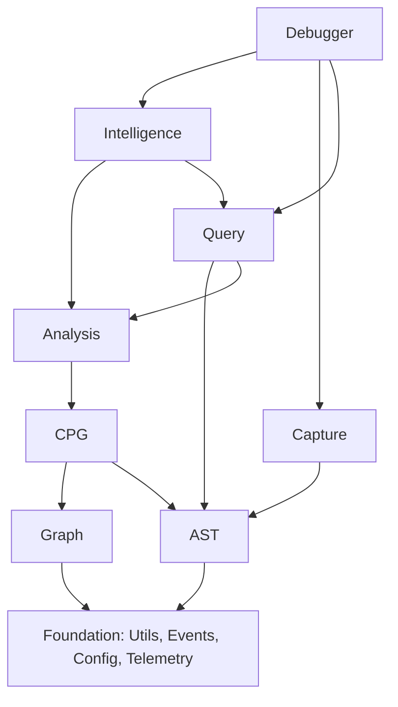

# DEV.md - ElixirScope Technical Development Guide

> **Internal technical documentation for developers and AI assistants**  
> This document contains architectural decisions, implementation details, and development context for ElixirScope.

## 🏗️ Architecture Deep Dive

### Layer Dependency Graph



### Critical Design Decisions

#### 1. **Why 9 Layers Instead of Microservices?**
- **Single Process Space**: Enables efficient data sharing between components
- **Elixir OTP**: Leverages supervisor trees for fault tolerance within single application
- **Performance**: Eliminates network overhead between closely coupled components
- **Development**: Simpler development and testing compared to distributed system
- **Memory Sharing**: CPG and AST data can be shared efficiently between layers

#### 2. **Graph Layer Separation from CPG**
- **Reusability**: Graph algorithms can be used independently
- **Testing**: Mathematical graph operations can be tested in isolation
- **Performance**: Pure functions without side effects enable better optimization
- **Academic Compliance**: Follows computer science separation of concerns

#### 3. **Intelligence Layer Above Analysis**
- **Data Flow**: Analysis provides structured data that Intelligence enhances
- **AI Provider Abstraction**: Multiple AI providers can enhance any analysis results
- **Caching**: Analysis results can be cached and enhanced on-demand
- **Optional Enhancement**: Core analysis works without AI providers

## 📁 Directory Structure & File Organization

### Current Structure After Migration

```
lib/elixir_scope/
├── foundation/                     # Layer 1: Core Infrastructure
│   ├── application.ex             # OTP Application
│   ├── config.ex                  # Configuration management
│   ├── events.ex                  # Event system
│   ├── utils.ex                   # Core utilities
│   ├── telemetry.ex               # Metrics and monitoring
│   ├── core/                      # Core management
│   └── distributed/               # Distributed coordination
│
├── ast/                           # Layer 2: AST Operations
│   ├── parser.ex                  # Main AST parser
│   ├── repository/                # AST storage and retrieval
│   │   ├── core.ex               # Core repository
│   │   └── enhanced.ex           # Enhanced repository features
│   ├── data/                      # AST data structures
│   │   ├── function_data.ex      # Function metadata
│   │   ├── module_data.ex        # Module metadata
│   │   └── module_analysis/      # Module analysis components
│   ├── memory_manager/            # Memory optimization
│   ├── performance_optimizer/     # AST performance optimization
│   ├── pattern_matcher/           # AST pattern matching
│   ├── query_builder/             # AST querying
│   ├── enhanced/                  # Enhanced AST features
│   ├── compiler/                  # AST transformation (old ast/)
│   └── compile_time/              # Compile-time orchestration
│
├── graph/                         # Layer 3: Graph Algorithms
│   ├── algorithms/                # Pure mathematical algorithms
│   │   ├── centrality.ex         # Centrality measures
│   │   ├── pathfinding.ex        # Path algorithms
│   │   ├── connectivity.ex       # Connectivity analysis
│   │   ├── community.ex          # Community detection
│   │   ├── advanced_centrality.ex # Advanced centrality
│   │   ├── temporal_analysis.ex  # Temporal graph analysis
│   │   └── machine_learning.ex   # ML on graphs
│   ├── data_structures.ex         # Graph data structures
│   ├── utils.ex                   # Graph utilities
│   └── math.ex                    # Graph mathematics
│
├── cpg/                           # Layer 4: Code Property Graph
│   ├── builder.ex                 # Main CPG builder
│   ├── builder/                   # CPG construction components
│   │   ├── cfg.ex                # Control Flow Graph
│   │   ├── dfg.ex                # Data Flow Graph
│   │   ├── call_graph.ex         # Call Graph
│   │   ├── core/                 # CPG builder core (old cpg_builder/)
│   │   ├── cfg/                  # CFG components (old cfg_generator/)
│   │   ├── dfg/                  # DFG components (old dfg_generator/)
│   │   ├── project_populator.ex  # Project population
│   │   └── project_analysis/     # Project analysis (old project_populator/)
│   ├── data/                      # CPG data structures
│   │   ├── cpg_data.ex           # Main CPG data
│   │   ├── cfg_data.ex           # CFG data
│   │   ├── dfg_data.ex           # DFG data
│   │   ├── variable_data.ex      # Variable data
│   │   ├── shared_structures.ex  # Shared data structures
│   │   └── supporting_structures.ex # Supporting structures
│   ├── semantics.ex               # Semantic analysis
│   ├── optimization.ex            # CPG optimization
│   ├── analysis/                  # CPG analysis
│   │   └── complexity_metrics.ex # Complexity analysis
│   ├── synchronizer.ex            # CPG synchronization
│   ├── file_watcher.ex            # File watching
│   └── enhanced/                  # Enhanced CPG features
│
├── analysis/                      # Layer 5: Architectural Analysis
│   ├── patterns/                  # Pattern detection
│   │   ├── smells.ex             # Architectural smells
│   │   ├── design.ex             # Design patterns
│   │   ├── anti_patterns.ex      # Anti-patterns
│   │   ├── elixir_specific.ex    # Elixir-specific patterns
│   │   └── otp_patterns.ex       # OTP patterns
│   ├── quality.ex                 # Quality assessment
│   ├── metrics.ex                 # Metrics calculation
│   ├── recommendations.ex         # Improvement recommendations
│   ├── architectural.ex           # Architectural analysis
│   ├── performance.ex             # Performance analysis
│   └── security.ex                # Security analysis
│
├── query/                         # Layer 6: Advanced Querying
│   ├── builder.ex                 # Query builder
│   ├── executor.ex                # Query executor
│   ├── optimizer.ex               # Query optimizer
│   ├── extensions/                # Query extensions
│   │   ├── cpg.ex                # CPG queries
│   │   ├── analysis.ex           # Analysis queries
│   │   ├── temporal.ex           # Temporal queries
│   │   ├── ml_queries.ex         # ML-powered queries
│   │   ├── pattern_queries.ex    # Pattern queries
│   │   └── security_queries.ex   # Security queries
│   ├── dsl.ex                     # Query DSL
│   ├── cache.ex                   # Query caching
│   └── legacy/                    # Legacy query engine (old query/)
│
├── capture/                       # Layer 7: Runtime Capture
│   ├── instrumentation.ex         # Main instrumentation
│   ├── correlation.ex             # Event correlation
│   ├── storage.ex                 # Event storage
│   ├── ingestors.ex               # Data ingestors
│   ├── temporal.ex                # Temporal event handling
│   ├── runtime/                   # Runtime capture (old capture/)
│   ├── correlation/               # Correlation components
│   │   ├── runtime_correlator.ex # Runtime correlator
│   │   └── runtime/              # Runtime correlation (old runtime_correlator/)
│   ├── storage/                   # Storage components (old storage/)
│   └── enhanced/                  # Enhanced capture features
│
├── intelligence/                  # Layer 8: AI/ML Integration
│   ├── ai/                        # AI integration (old ai/)
│   │   ├── llm/                  # LLM integration
│   │   │   ├── client.ex         # LLM client
│   │   │   ├── provider.ex       # Provider interface
│   │   │   ├── response.ex       # Response structure
│   │   │   ├── config.ex         # LLM configuration
│   │   │   └── providers/        # LLM providers
│   │   │       ├── mock.ex       # Mock provider
│   │   │       ├── openai.ex     # OpenAI provider
│   │   │       ├── anthropic.ex  # Anthropic provider
│   │   │       └── gemini.ex     # Gemini provider
│   │   ├── ml.ex                 # ML integration
│   │   └── providers.ex          # AI providers
│   ├── features.ex                # Feature extraction
│   ├── models/                    # ML models
│   │   ├── complexity_predictor.ex # Complexity prediction
│   │   ├── bug_predictor.ex      # Bug prediction
│   │   └── performance_predictor.ex # Performance prediction
│   ├── insights.ex                # Insight generation
│   ├── predictions.ex             # Prediction engine
│   └── orchestration.ex           # AI orchestration
│
├── debugger/                      # Layer 9: Debugging Interface
│   ├── core.ex                    # Core debugging
│   ├── interface.ex               # User interface
│   ├── session.ex                 # Debug sessions
│   ├── breakpoints.ex             # Breakpoint management
│   ├── time_travel.ex             # Time-travel debugging
│   ├── visualization.ex           # Execution visualization
│   ├── ai_assistant.ex            # AI debugging assistant
│   └── enhanced/                  # Enhanced debugging
│       ├── session.ex            # Enhanced sessions
│       ├── breakpoints.ex        # Enhanced breakpoints
│       ├── visualization.ex      # Enhanced visualization
│       └── instrumentation/      # Enhanced instrumentation (old capture/enhanced_instrumentation/)
│
├── integration/                   # Cross-layer integration
│   ├── ast_cpg.ex                # AST-CPG integration
│   ├── cpg_analysis.ex           # CPG-Analysis integration
│   ├── analysis_intelligence.ex  # Analysis-Intelligence integration
│   ├── capture_debugger.ex       # Capture-Debugger integration
│   └── phoenix/                  # Phoenix integration (old phoenix/)
│
├── shared/                        # Shared utilities
│   ├── types.ex                  # Common types
│   ├── protocols.ex              # Shared protocols
│   ├── behaviours.ex             # Shared behaviours
│   └── constants.ex              # Constants
│
├── testing/                       # Testing utilities
│   ├── helpers.ex                # Test helpers
│   ├── fixtures.ex               # Test fixtures
│   └── mocks.ex                  # Test mocks
│
├── migration_helpers.ex           # Migration compatibility
├── layer_integration.ex           # Layer coordination
└── [layer].ex                    # Main layer modules (foundation.ex, ast.ex, etc.)
```

## 🔧 Technical Implementation Details

### Module Naming Conventions

```elixir
# Layer modules follow this pattern:
ElixirScope.[Layer].[Component].[SubComponent]

# Examples:
ElixirScope.Foundation.Utils
ElixirScope.AST.Repository.Enhanced
ElixirScope.Graph.Algorithms.Centrality
ElixirScope.CPG.Builder.CFG
ElixirScope.Analysis.Patterns.Smells
ElixirScope.Query.Extensions.CPG
ElixirScope.Capture.Runtime.Instrumentation
ElixirScope.Intelligence.AI.LLM.Client
ElixirScope.Debugger.Enhanced.Session
```

### Data Flow Architecture

```elixir
# Typical analysis workflow:
Source Code 
  → AST.Parser 
  → AST.Repository 
  → CPG.Builder 
  → Analysis.Patterns 
  → Intelligence.AI 
  → Debugger.Interface

# Runtime correlation workflow:
Runtime Events 
  → Capture.Instrumentation 
  → Capture.Correlation 
  → Analysis.Performance 
  → Intelligence.Insights 
  → Debugger.TimeTravel
```

### Critical Dependencies

#### External Dependencies
```elixir
# Required for core functionality
{:jason, "~> 1.4"},           # JSON parsing
{:ets, "~> 0.9"},             # Enhanced ETS operations
{:libgraph, "~> 0.16"},       # Graph data structures

# AI/ML dependencies
{:req, "~> 0.4"},             # HTTP client for AI APIs
{:nx, "~> 0.6"},              # Numerical computing
{:explorer, "~> 0.7"},        # Data analysis

# Optional dependencies
{:phoenix, "~> 1.7", optional: true},     # Phoenix integration
{:ecto, "~> 3.10", optional: true},       # Database integration
{:telemetry, "~> 1.2"},                   # Metrics
```

#### Internal Dependencies (Layer Order)
```elixir
# Each layer can only depend on lower layers
debugger: [:intelligence, :capture, :query, :analysis, :cpg, :graph, :ast, :foundation]
intelligence: [:query, :analysis, :cpg, :graph, :ast, :foundation]
capture: [:ast, :foundation]
query: [:analysis, :ast, :foundation]
analysis: [:cpg, :graph, :ast, :foundation]
cpg: [:graph, :ast, :foundation]
graph: [:foundation]
ast: [:foundation]
foundation: []
```

## 🧪 Testing Strategy Deep Dive

### Test Organization

```
test/
├── unit/                          # Layer isolation tests
│   ├── foundation/               # Foundation layer tests
│   ├── ast/                      # AST layer tests
│   ├── graph/                    # Graph algorithm tests
│   ├── cpg/                      # CPG construction tests
│   ├── analysis/                 # Analysis layer tests
│   ├── query/                    # Query engine tests
│   ├── capture/                  # Capture layer tests
│   ├── intelligence/             # Intelligence layer tests
│   └── debugger/                 # Debugger layer tests
│
├── functional/                    # Feature-level tests
│   ├── ast_parsing/              # End-to-end parsing tests
│   ├── cpg_construction/         # CPG building workflows
│   ├── pattern_detection/        # Pattern detection workflows
│   ├── ai_integration/           # AI integration workflows
│   └── debugging_workflow/       # Debugging feature tests
│
├── integration/                   # Cross-layer tests
│   ├── ast_cpg/                  # AST → CPG integration
│   ├── cpg_analysis/             # CPG → Analysis integration
│   ├── analysis_intelligence/    # Analysis → Intelligence integration
│   └── capture_debugger/         # Capture → Debugger integration
│
├── end_to_end/                    # Complete workflow tests
│   ├── phoenix_project_analysis/ # Phoenix app analysis
│   ├── genserver_debugging/      # GenServer debugging
│   ├── otp_supervision_analysis/ # OTP analysis
│   └── ai_assisted_debugging/    # AI debugging workflows
│
├── performance/                   # Performance validation
│   ├── benchmarks/               # Algorithm benchmarks
│   ├── memory_usage/             # Memory profiling
│   ├── scalability/              # Scalability tests
│   └── regression_tests/         # Performance regression
│
├── property/                      # Property-based testing
│   ├── graph_algorithms/         # Graph algorithm properties
│   ├── cpg_construction/         # CPG construction invariants
│   └── data_transformations/     # Data transformation properties
│
├── contract/                      # API contract tests
│   ├── layer_apis/               # Layer interface contracts
│   ├── external_apis/            # External API contracts
│   └── protocol_compliance/      # Protocol implementation tests
│
├── fixtures/                      # Test data
│   ├── sample_projects/          # Sample Elixir projects
│   ├── ast_data/                 # Pre-generated AST data
│   ├── cpg_data/                 # Pre-generated CPG data
│   └── ai_responses/             # Mock AI responses
│
├── mocks/                         # Mock implementations
│   ├── ai_providers/             # AI provider mocks
│   ├── external_services/        # External service mocks
│   └── instrumentation/          # Instrumentation mocks
│
├── support/                       # Test utilities
│   ├── helpers/                  # Test helper functions
│   ├── generators/               # Data generators
│   ├── assertions/               # Custom assertions
│   └── setup/                    # Test environment setup
│
└── scenarios/                     # Real-world scenarios
    ├── debugging_workflows/      # Realistic debugging scenarios
    ├── code_analysis_workflows/  # Code analysis scenarios
    └── performance_optimization/ # Performance optimization scenarios
```

### Test Tags and Execution

```bash
# Test execution patterns
mix test                          # Unit tests only (fast)
mix test --include integration    # Include integration tests
mix test --include end_to_end     # Include E2E tests
mix test --include slow           # Include slow tests
mix test --include ai             # Include AI-dependent tests
mix test --include capture        # Include capture tests
mix test --include phoenix        # Include Phoenix tests

# Performance testing
mix test --include benchmark      # Benchmark tests
mix test --include memory         # Memory usage tests
mix test --include stress         # Stress tests

# Property testing
mix test --include property       # Property-based tests

# Contract testing
mix test --include contract       # API contract tests

# Scenario testing
mix test --include scenario       # Real-world scenarios
```

## 🔀 Migration Context

### Original → New Structure Mapping

```elixir
# Critical migrations that occurred:
"ElixirScope.ASTRepository.Enhanced.CPGMath" 
  → "ElixirScope.Graph.Algorithms"

"ElixirScope.ASTRepository.Enhanced.CPGBuilder" 
  → "ElixirScope.CPG.Builder"

"ElixirScope.ASTRepository.Enhanced.CPGSemantics" 
  → "ElixirScope.CPG.Semantics"

"ElixirScope.AI" 
  → "ElixirScope.Intelligence.AI"

"ElixirScope.Capture" 
  → "ElixirScope.Capture.Runtime"

"ElixirScope.Query.Engine" 
  → "ElixirScope.Query.Legacy"
```

### Files That Need Manual Extraction

1. **Graph Algorithms from CPG Code**
   ```
   Source: cpg/builder/core/core.ex
   Extract: Centrality calculations, pathfinding, community detection
   Target: graph/algorithms/
   ```

2. **Semantic Analysis from CPG Builder**
   ```
   Source: cpg/builder/core/
   Extract: Semantic analysis logic
   Target: cpg/semantics.ex
   ```

3. **Optimization Logic from Various Files**
   ```
   Source: Multiple CPG files
   Extract: Optimization algorithms
   Target: cpg/optimization.ex
   ```

### Post-Migration Tasks Status

```bash
# Completed:
✅ Directory structure created
✅ Files moved to new locations
✅ Integration modules created
✅ Test structure created
✅ Missing AI files created

# TODO:
⏳ Update module namespace references
⏳ Extract graph algorithms from CPG code
⏳ Implement missing semantic analysis modules
⏳ Update import/alias statements
⏳ Test compilation and fix errors
⏳ Run comprehensive test suite
```

## 💡 Development Tips

### Adding New Features

1. **Identify the appropriate layer** based on functionality
2. **Follow naming conventions** for modules and files
3. **Add tests at multiple levels** (unit, functional, integration)
4. **Update documentation** including this DEV.md
5. **Consider performance implications** and add benchmarks if needed

### Debugging Layer Integration

```elixir
# Use the layer integration module for debugging:
ElixirScope.LayerIntegration.initialize_layers()

# Check layer dependencies:
ElixirScope.LayerIntegration.validate_dependencies()

# Test cross-layer workflows:
ElixirScope.LayerIntegration.full_analysis_workflow(some_module)
```

### Performance Monitoring

```elixir
# Built-in performance monitoring:
ElixirScope.Foundation.Telemetry.start_monitoring()

# Memory usage tracking:
ElixirScope.AST.MemoryManager.get_usage_stats()

# Query performance:
ElixirScope.Query.Cache.get_performance_stats()
```

## 🚨 Known Issues & Gotchas

### 1. Module Loading Order
- Foundation must be loaded first
- Some modules have circular dependency potential
- Use `ElixirScope.LayerIntegration.initialize_layers/1` for proper startup

### 2. Memory Management
- AST data can grow large for big projects
- Use `ElixirScope.AST.MemoryManager` for cleanup
- Monitor memory usage in production

### 3. AI Provider Rate Limits
- Implement exponential backoff
- Use mock providers for testing
- Cache AI responses when possible

### 4. Graph Algorithm Performance
- Large graphs (>10k nodes) may be slow
- Consider sampling for very large codebases
- Use incremental analysis when possible

### 5. Test Environment Setup
- AI tests require API keys or mocks
- Capture tests may require instrumentation setup
- Phoenix tests need Phoenix app context

## 🔍 Debugging ElixirScope Itself

### Common Debug Scenarios

```elixir
# Debug AST parsing issues:
ElixirScope.AST.Parser.debug_parse("path/to/file.ex")

# Debug CPG construction:
ElixirScope.CPG.Builder.debug_build(ast_data, verbose: true)

# Debug AI integration:
ElixirScope.Intelligence.AI.LLM.Client.debug_call(provider, prompt)

# Debug query execution:
ElixirScope.Query.Executor.debug_execute(query, trace: true)
```

### Logging Configuration

```elixir
# Development logging configuration:
config :logger, level: :debug

config :elixir_scope, :logging,
  ast_parsing: :debug,
  cpg_construction: :info,
  graph_algorithms: :info,
  ai_integration: :debug,
  query_execution: :debug
```

## 📚 Additional Resources

### Academic References
- "Static Program Analysis" by Møller & Schwartzbach
- "Code Property Graphs for Program Analysis" by Yamaguchi et al.
- "Graph Algorithms" by Sedgewick & Wayne

### Elixir/OTP Resources
- "Designing for Scalability with Erlang/OTP" by Cesarini & Thompson
- "Elixir in Action" by Šašo Jurić
- "The Little Elixir & OTP Guidebook" by Benjamin Tan Wei Hao

### AI/ML Integration
- OpenAI API Documentation
- Anthropic Claude API Documentation
- "Hands-On Machine Learning" by Aurélien Géron

---

**Last Updated**: May 2025
**Maintainer**: ElixirScope Development Team
