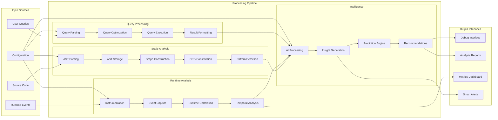
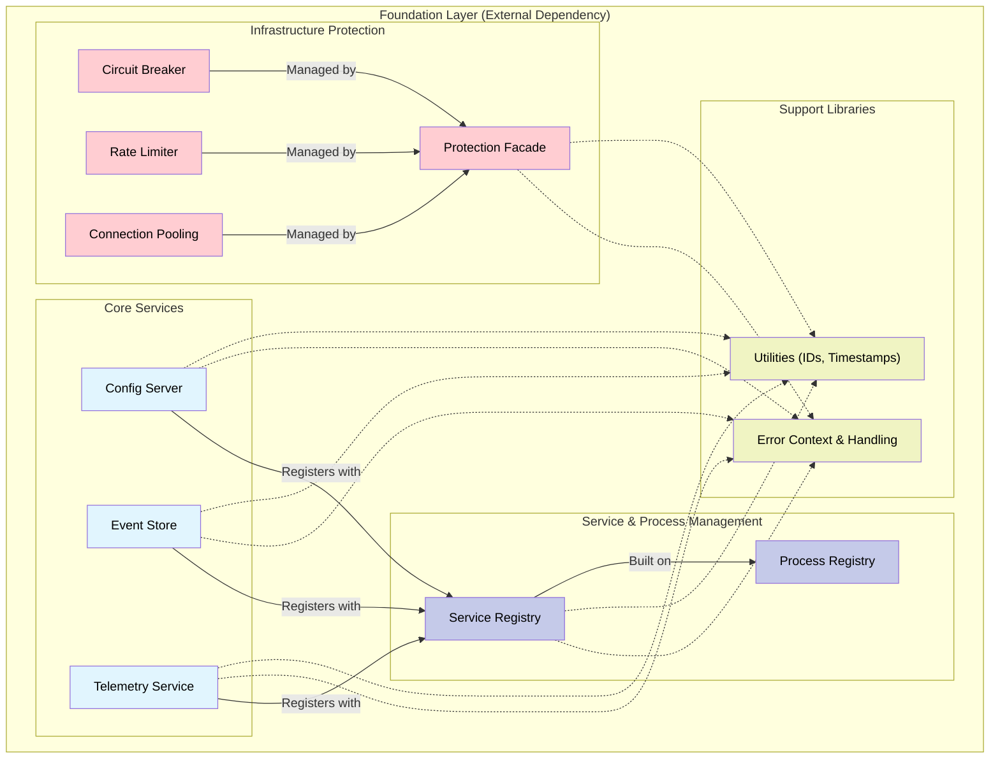
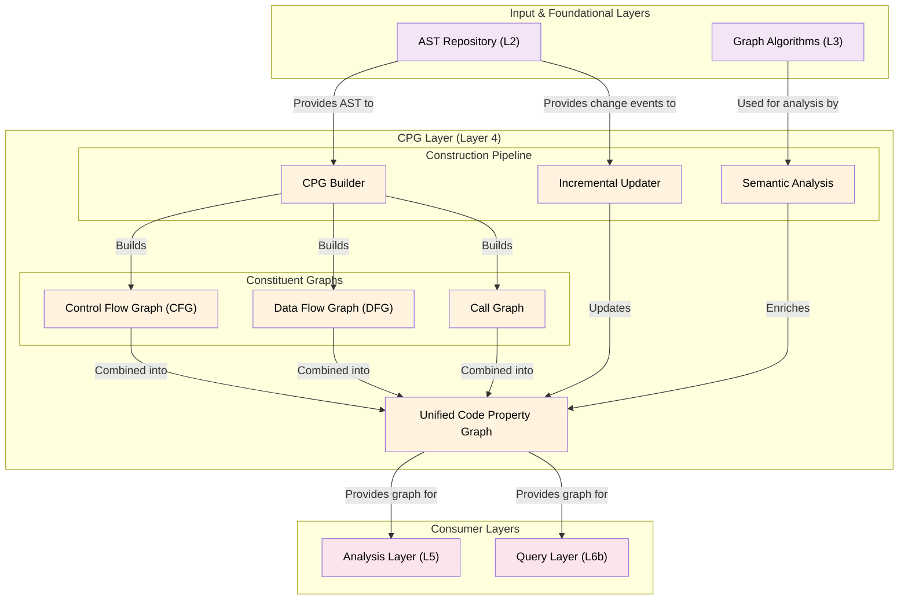
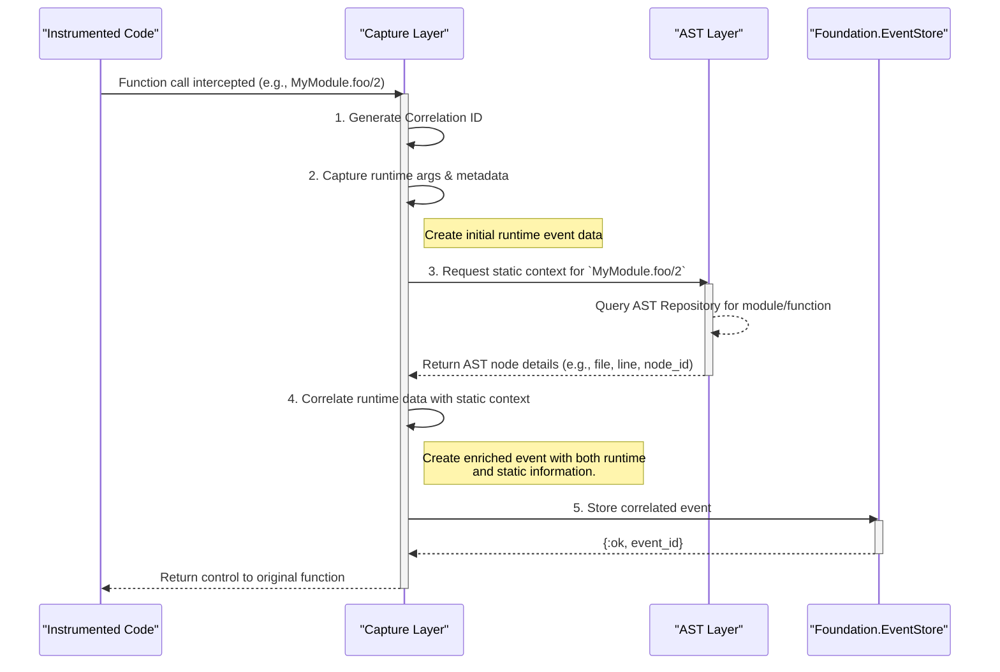
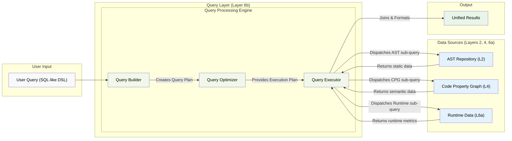
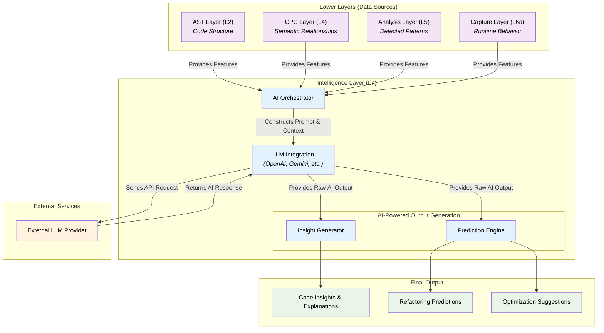
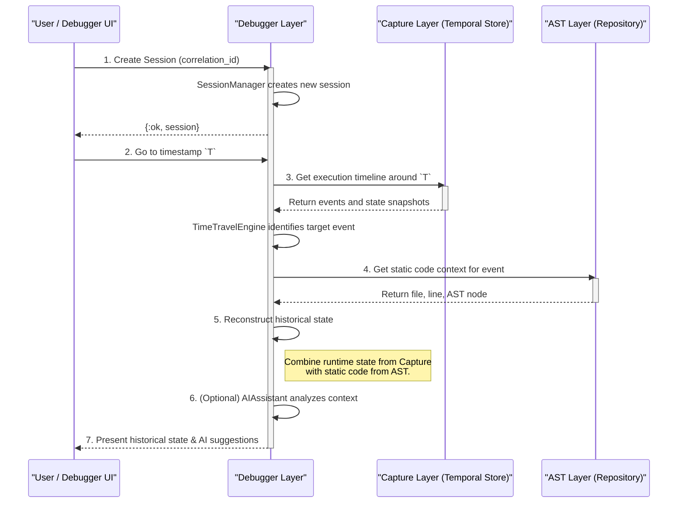

### 1. System Architecture Overview

This diagram provides a high-level view of the entire 8-layer ElixirScope architecture, with Foundation as the base layer. It shows the components within each layer and their primary dependencies.

```mermaid
graph TB
    subgraph "ElixirScope Unified Package"
        subgraph "Layer 8: Debugger Interface"
            DEBUG["Debugger Layer"]
            SESSIONS["Session Management"]
            BREAKPOINTS["Breakpoint Manager"]
            TIMETRAVEL["Time Travel Engine"]
            VISUALIZATION["Visualization Engine"]
        end
        
        subgraph "Layer 7: Intelligence/AI"
            INTEL["Intelligence Layer"]
            LLM["LLM Integration"]
            INSIGHTS["Insight Generator"]
            PREDICTIONS["Prediction Engine"]
            ORCHESTRATOR["AI Orchestrator"]
        end
        
        subgraph "Layer 6: Runtime & Query"
            CAPTURE["Capture Layer"]
            QUERY["Query Layer"]
            INSTR["Instrumentation"]
            CORRELATION["Event Correlation"]
            EXECUTOR["Query Executor"]
            DSL["Query DSL"]
        end
        
        subgraph "Layer 5: Analysis"
            ANALYSIS["Analysis Layer"]
            PATTERNS["Pattern Detection"]
            QUALITY["Quality Assessment"]
            METRICS["Metrics Calculation"]
            RECOMMENDATIONS["Recommendations"]
        end
        
        subgraph "Layer 4: Code Property Graph"
            CPG["CPG Layer"]
            BUILDER["CPG Builder"]
            CFG["Control Flow Graph"]
            DFG["Data Flow Graph"]
            CALLGRAPH["Call Graph"]
            SEMANTIC["Semantic Analysis"]
        end
        
        subgraph "Layer 3: Graph Algorithms"
            GRAPH["Graph Layer - libgraph Hybrid"]
            CENTRALITY["Centrality Algorithms"]
            PATHFINDING["Pathfinding"]
            COMMUNITY["Community Detection"]
            CONVERTERS["Data Converters"]
        end
        
        subgraph "Layer 2: AST Operations"
            AST["AST Layer"]
            PARSER["AST Parser"]
            REPOSITORY["AST Repository"]
            MEMORY["Memory Manager"]
            PATTERNS_AST["Pattern Matcher"]
            QUERY_AST["AST Query Engine"]
        end
    end
    
    subgraph "Layer 1: Foundation (External Dependency)"
        FOUNDATION["Foundation Layer"]
        CONFIG["Config Server"]
        EVENTS["Event Store"]
        TELEMETRY["Telemetry Service"]
        REGISTRY["Process Registry"]
        PROTECTION["Infrastructure Protection"]
    end
    
    %% Layer Dependencies (bottom-up)
    FOUNDATION --> AST
    AST --> GRAPH
    GRAPH --> CPG
    CPG --> ANALYSIS
    ANALYSIS --> CAPTURE
    ANALYSIS --> QUERY
    CAPTURE --> INTEL
    QUERY --> INTEL
    INTEL --> DEBUG
    
    %% Cross-layer integrations
    AST -.-> CPG
    CPG -.-> QUERY
    CAPTURE -.-> DEBUG
    ANALYSIS -.-> INTEL
    
    %% Foundation integration (global access)
    CONFIG -.-> AST
    CONFIG -.-> GRAPH
    CONFIG -.-> CPG
    CONFIG -.-> ANALYSIS
    CONFIG -.-> CAPTURE
    CONFIG -.-> QUERY
    CONFIG -.-> INTEL
    CONFIG -.-> DEBUG
    
    TELEMETRY -.-> AST
    TELEMETRY -.-> GRAPH
    TELEMETRY -.-> CPG
    TELEMETRY -.-> ANALYSIS
    TELEMETRY -.-> CAPTURE
    TELEMETRY -.-> QUERY
    TELEMETRY -.-> INTEL
    TELEMETRY -.-> DEBUG
    
    classDef foundation fill:#e1f5fe,color:#000
    classDef ast fill:#f3e5f5,color:#000
    classDef graph fill:#e8f5e8,color:#000
    classDef cpg fill:#fff3e0,color:#000
    classDef analysis fill:#fce4ec,color:#000
    classDef runtime fill:#f1f8e9,color:#000
    classDef intelligence fill:#e3f2fd,color:#000
    classDef debugger fill:#f8f9fa,color:#000
    
    class FOUNDATION,CONFIG,EVENTS,TELEMETRY,REGISTRY,PROTECTION foundation
    class AST,PARSER,REPOSITORY,MEMORY,PATTERNS_AST,QUERY_AST ast
    class GRAPH,CENTRALITY,PATHFINDING,COMMUNITY,CONVERTERS graph
    class CPG,BUILDER,CFG,DFG,CALLGRAPH,SEMANTIC cpg
    class ANALYSIS,PATTERNS,QUALITY,METRICS,RECOMMENDATIONS analysis
    class CAPTURE,QUERY,INSTR,CORRELATION,EXECUTOR,DSL runtime
    class INTEL,LLM,INSIGHTS,PREDICTIONS,ORCHESTRATOR intelligence
    class DEBUG,SESSIONS,BREAKPOINTS,TIMETRAVEL,VISUALIZATION debugger
```

### 2. Data Flow Architecture

This flowchart visualizes how data moves through the ElixirScope system, from input sources through the various processing pipelines to the final output interfaces.



### 3. Foundation Layer API Architecture

This diagram details the internal components of the `Foundation` external dependency, illustrating the relationship between its core services, registries, and support utilities.



### 4. AST Layer Internal Architecture

This diagram breaks down the internal structure of the AST Layer (Layer 2), showing its main functional components, their interactions, and dependencies on the Foundation layer.

```mermaid
graph TD
    subgraph "External Inputs & Consumers"
        direction TB
        subgraph "Input Sources"
            direction LR
            SourceCode["Source Code Files"]
            FS["File System Events"]
        end
        subgraph "Consumer Layers"
            direction LR
            CPG_Layer["CPG Layer (L4)"]
            Analysis_Layer["Analysis Layer (L5)"]
            Query_Layer["Query Layer (L6b)"]
        end
    end

    subgraph "AST Layer (Layer 2)"
        direction TB
        subgraph "Parsing & Synchronization"
            Parser["Parsing (parser.ex)"]
            Sync["Synchronization (synchronization/)"]
        end

        subgraph "Core Storage"
            Repo["Repository (core.ex, enhanced.ex)"]
            MemMan["Memory Manager (memory_manager/)"]
        end

        subgraph "Analysis & Querying"
            PatternMatcher["Pattern Matcher (pattern_matcher/)"]
            QueryEngine["Query Engine (querying/)"]
        end
        
        subgraph "Data & Transformation"
            DataStructs["Data Structures (data/)"]
            Transformer["Code Transformation (transformation/)"]
        end
    end

    subgraph "Foundation Services (Layer 1)"
        direction LR
        F_Config["Foundation.Config"]
        F_Events["Foundation.Events"]
        F_Telemetry["Foundation.Telemetry"]
        F_Registry["Foundation.ProcessRegistry"]
    end

    %% Data Flow within AST Layer
    SourceCode --> Parser
    FS --> Sync
    Parser --> Repo
    Sync --> Repo
    MemMan -- "Manages" --> Repo
    Repo -- "AST Data" --> PatternMatcher
    Repo -- "AST Data" --> QueryEngine
    Repo -- "AST Data" --> Transformer
    DataStructs -- "Used by all components" -.-> Parser
    DataStructs -.-> Repo
    DataStructs -.-> PatternMatcher
    
    %% Integration with Foundation
    Repo -- "Registers via" --> F_Registry
    Parser -- "Emits Telemetry" --> F_Telemetry
    MemMan -- "Emits Telemetry" --> F_Telemetry
    QueryEngine -- "Uses Config" --> F_Config
    Parser -- "Stores Events" --> F_Events

    %% Integration with Upper Layers
    Repo -- "Provides AST for" --> CPG_Layer
    PatternMatcher -- "Provides patterns for" --> Analysis_Layer
    QueryEngine -- "Executes queries for" --> Query_Layer
    
    %% Styling
    classDef ast fill:#f3e5f5,color:#000
    classDef foundation fill:#e1f5fe,color:#000
    classDef consumer fill:#e8f5e8,color:#000
    classDef input fill:#fffde7,color:#000

    class Parser,Sync,Repo,MemMan,PatternMatcher,QueryEngine,DataStructs,Transformer ast
    class F_Config,F_Events,F_Telemetry,F_Registry foundation
    class CPG_Layer,Analysis_Layer,Query_Layer consumer
    class SourceCode,FS input
```

### 5. Graph Layer Hybrid Architecture

This diagram illustrates the hybrid implementation strategy for the Graph Layer (Layer 3), which combines the external `libgraph` library with custom wrappers, algorithms, and integration with the Foundation layer.

```mermaid
graph TD
    subgraph "Consumer Layers"
        CPG["CPG Layer (L4)"]
        Analysis["Analysis Layer (L5)"]
    end

    subgraph "Graph Layer (Layer 3) - Hybrid Approach"
        subgraph "Custom ElixirScope Logic"
            direction LR
            Converters["Converters (converters.ex)"]
            CustomAlgos["Custom Algorithms (algorithms/)"]
        end

        subgraph "Integration & Core Wrappers"
            direction LR
            CoreWrapper["Core libgraph Wrapper (core.ex)"]
            FoundationIntegration["Foundation Integration (foundation_integration.ex)"]
        end
    end

    subgraph "External & Foundation Dependencies"
        direction LR
        Libgraph["libgraph (External Hex.pm Library)"]
        Foundation["Foundation Layer (L1)"]
    end

    %% Flow and Dependencies
    CPG -- "Uses Graph Algorithms" --> CustomAlgos
    Analysis -- "Uses Graph Algorithms" --> CustomAlgos
    CPG -- "Uses Converters" --> Converters
    
    Converters -- "Uses" --> CoreWrapper
    CustomAlgos -- "Uses" --> CoreWrapper
    CustomAlgos -- "Integrates with" --> FoundationIntegration

    CoreWrapper -- "Wraps and uses" --> Libgraph
    FoundationIntegration -- "Calls" --> Foundation

    %% Styling
    classDef graph fill:#e8f5e8,color:#000
    classDef consumer fill:#fff3e0,color:#000
    classDef dependency fill:#e1f5fe,color:#000
    
    class Converters,CustomAlgos,CoreWrapper,FoundationIntegration graph
    class CPG,Analysis consumer
    class Libgraph,Foundation dependency
```

### 6. CPG Layer Construction Architecture (Layer 4)

This diagram shows how the Code Property Graph (CPG) Layer constructs its unified graph. It visualizes the process of taking the AST as input, building individual graphs like the Control Flow Graph (CFG) and Data Flow Graph (DFG), and combining them into a single, semantically-rich CPG.



### 7. Runtime Correlation Sequence Diagram (Layer 6a)

This sequence diagram details the process of correlating a runtime event with its static code context. It shows the interaction between instrumented code, the Capture Layer, the AST Layer, and the Foundation Event Store.



### 8. Unified Query System Architecture (Layer 6b)

This diagram illustrates how the unified Query Layer works. It shows the query lifecycle from parsing a DSL string to executing sub-queries against multiple underlying data layers (AST, CPG, Capture) and returning a single, consolidated result.



### 9. AI Orchestration Architecture (Layer 7)

This diagram visualizes the AI/Intelligence Layer, showing how the AI Orchestrator gathers data from multiple lower layers, uses it to construct a prompt for an LLM, and then processes the response to generate insights and predictions.



### 10. Time-Travel Debugging Sequence Diagram (Layer 8)

This sequence diagram illustrates the workflow for a time-travel debugging session. It shows how the Debugger Layer components interact with the Capture and AST layers to reconstruct and present a historical execution state to the user.



### 11. Implementation Timeline Gantt Chart

This Gantt chart visualizes the 16-week implementation plan described in the documentation, breaking it down by phase and key deliverables.

```mermaid
gantt
    title ElixirScope Implementation Timeline
    dateFormat W
    axisFormat %W
    
    section Phase 1: Foundation (Week 1)
    Foundation Integration     :done, W1, 1w
    Project & Test Setup       :done, W1, 1w
    
    section Phase 2: Core Infrastructure (Weeks 2-6)
    Graph Layer (Hybrid)       :active, W2, 1w
    AST Layer (Core)           :W3, 2w
    CPG Layer (Core)           :W5, 2w
    
    section Phase 3: Analysis & Processing (Weeks 7-10)
    Analysis Layer             :W7, 2w
    Capture Layer              :W8, 2w
    Query Layer                :W10, 1w

    section Phase 4: Intelligence & UI (Weeks 11-14)
    Intelligence Layer (AI/ML) :W11, 2w
    Debugger Layer             :W13, 2w
    
    section Phase 5: Polish & Release (Weeks 15-16)
    End-to-End Testing         :W15, 1w
    Performance & Polish       :W15, 2w
    Documentation & Release    :W16, 1w
```
