# 🚀 ElixirScope Startup Architecture

Understanding the Foundation Layer Initialization Flow

## 1. 🔄 Application Startup Flow

This shows the complete startup sequence from OTP Application boot to ready state.

### 🎯 Key Insights

- **Sequential Dependency:** Config must start first as other components depend on it
- **Fail-Fast Design:** If Config validation fails, entire application stops
- **Stateless Strategy:** Events & Telemetry are stateless - no supervision needed
- **Two-Phase Init:** Supervision tree first, then stateless components

---

## 2. 🏗️ Module Hierarchy & Responsibilities

Shows the layered architecture and how modules delegate responsibilities.

```mermaid
graph TD
    subgraph "User API Layer"
        ES["ElixirScope<br/>📱 Main API"]
    end
    
    subgraph "Foundation Orchestration"
        FND["Foundation<br/>🎯 Coordinator"]
    end
    
    subgraph "OTP Application Layer"
        APP["Foundation.Application<br/>🚀 OTP Bootstrap"]
        SUP["Foundation.Supervisor<br/>👥 Process Management"]
    end
    
    subgraph "Core Services"
        CFG["Config<br/>⚙️ GenServer State"]
        EVT["Events<br/>📨 Stateless Utils"]
        TEL["Telemetry<br/>📊 Metrics Collection"]
    end
    
    subgraph "Support Systems"
        ERR["Error & ErrorContext<br/>🚨 Error Management"]
        UTL["Utils<br/>🔧 Common Utilities"]
        TYP["Types<br/>📝 Type Definitions"]
    end
    
    ES -->|"initialize(opts)"| FND
    ES -->|"Direct API calls"| CFG
    ES -->|"Direct API calls"| EVT
    
    FND -->|"orchestrates"| CFG
    FND -->|"orchestrates"| EVT
    FND -->|"orchestrates"| TEL
    
    APP -->|"supervises"| SUP
    SUP -->|"starts & monitors"| CFG
    APP -->|"initializes"| EVT
    APP -->|"initializes"| TEL
    
    CFG -->|"uses"| ERR
    EVT -->|"uses"| UTL
    TEL -->|"uses"| UTL
    
    classDef userAPI fill:#e1f5fe,color:#000
    classDef foundation fill:#f3e5f5,color:#000
    classDef otp fill:#e8f5e8,color:#000
    classDef services fill:#fff3e0,color:#000
    classDef support fill:#fce4ec,color:#000
    
    class ES userAPI
    class FND foundation
    class APP,SUP otp
    class CFG,EVT,TEL services
    class ERR,UTL,TYP support
```

### 🎯 Architectural Principles

- **Separation of Concerns:** Each module has a single, clear responsibility
- **Dependency Injection:** Foundation orchestrates without tight coupling
- **OTP Compliance:** Proper supervision tree with restart strategies
- **Support Layer:** Common utilities shared across all components

---

## 3. ⚙️ Config Service Lifecycle

Deep dive into Config GenServer lifecycle, validation, and error handling.

### 🎯 Config Service Features

- **Validation-First:** Config must pass validation before becoming active
- **Runtime Updates:** Only specific paths can be updated at runtime
- **Graceful Degradation:** ETS cache provides fallback during restarts
- **Fail-Fast Init:** Invalid config causes supervised restart

---

## 4. 🚨 Error Handling & Recovery

How errors propagate through the system and recovery mechanisms.

### 🎯 Error Handling Strategy

- **Context Preservation:** ErrorContext tracks operation breadcrumbs
- **Structured Errors:** Hierarchical error codes with severity levels
- **Intelligent Retry:** Different retry strategies based on error type
- **Graceful Degradation:** Fallback mechanisms maintain service availability

---

## 5. 🔗 Service Dependencies & Communication

How services communicate and depend on each other during runtime.

```mermaid
graph TD
    subgraph "Client Layer"
        CLI["Client Code"]
    end
    
    subgraph "API Layer"
        ES["ElixirScope API"]
    end
    
    subgraph "Foundation Layer"
        FND["Foundation Coordinator"]
    end
    
    subgraph "Service Layer"
        CFG["Config Service<br/>🟢 GenServer"]
        EVT["Events<br/>🔵 Stateless"]
        TEL["Telemetry<br/>🔵 Stateless"]
    end
    
    subgraph "Fallback Layer"
        ETS[("ETS Cache")]
        DEF["Default Config"]
        RET["Retry Queue"]
    end
    
    CLI -->|"1. ElixirScope.start()"| ES
    ES -->|"2. Foundation.initialize()"| FND
    
    FND -->|"3a. Config.initialize()"| CFG
    FND -->|"3b. Events.initialize()"| EVT
    FND -->|"3c. Telemetry.initialize()"| TEL
    
    CFG -.->|"Cache updates"| ETS
    CFG -.->|"Failed updates"| RET
    
    EVT -->|"Uses for IDs"| UTL["Utils"]
    TEL -->|"Uses for stats"| UTL
    
    ES -.->|"Direct calls"| CFG
    ES -.->|"Direct calls"| EVT
    
    CFG -->|"Service down"| ETS
    ETS -->|"Fallback values"| CLI
    
    RET -->|"Retry updates"| CFG
    DEF -->|"Emergency config"| CLI
    
    classDef client fill:#e3f2fd,color:#000
    classDef api fill:#f3e5f5,color:#000
    classDef foundation fill:#e8f5e8,color:#000
    classDef services fill:#fff3e0,color:#000
    classDef fallback fill:#fce4ec,color:#000
    
    class CLI client
    class ES api
    class FND foundation
    class CFG,EVT,TEL services
    class ETS,DEF,RET fallback
```

### 🎯 Communication Patterns

- **Orchestrated Startup:** Foundation coordinates initialization sequence
- **Direct Access:** Main API can call services directly for performance
- **Graceful Degradation:** Multiple fallback layers for high availability
- **Async Recovery:** Background processes handle retry and recovery

---

## Key Architectural Insights Summary

1. **Foundation as Orchestrator**: The Foundation module coordinates initialization but doesn't tightly couple services

2. **Config-First Strategy**: Configuration service starts first and must be valid before the system is operational

3. **Graceful Degradation**: Multiple layers of fallback ensure system availability even during service restarts

4. **Error Context Propagation**: Sophisticated error handling preserves debugging context across the call stack

5. **Mixed Service Types**: Combination of stateful (Config GenServer) and stateless (Events, Telemetry) services

6. **Supervision Strategy**: Uses `:one_for_one` restart strategy where only failed processes restart

7. **Validation-First Design**: All configuration must pass validation before becoming active

8. **Emergency Fallback**: ETS-based caching provides service continuity during GenServer restarts