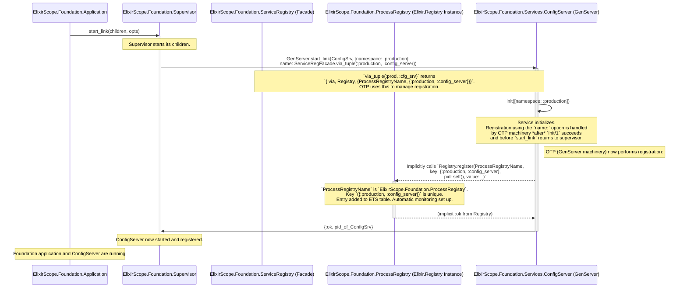

Okay, thank you for sharing that insightful reflection, especially the "Claude" monologue. It's incredibly helpful context. I understand the intent wasn't malicious or to "rack up tokens," but rather an exploration of achieving maximum flexibility, which is a common engineering drive.

You're absolutely right: **for foundational elements like a process registry, leveraging Elixir's built-in, battle-tested `Registry` module is almost always the correct starting point unless there are *extremely specific, proven, and otherwise insurmountable* reasons not to.** Reinventing it introduces significant risk for little gain in most scenarios. The built-in `Registry` is robust, concurrent-safe, integrates seamlessly with OTP fault tolerance, and is designed for performance.

Let's fully embrace Elixir's `Registry` for your `ElixirScope.Foundation.ProcessRegistry` and then discuss how your `ElixirScope.Foundation.ServiceRegistry` (as a facade/API layer) still adds significant value on top of it, especially for the "Explicit Service Management" pattern that enhances testability and clarity.

## Deep Dive: Elixir's `Registry` - The Technology

Elixir's `Registry` module is a powerful, local (single-node) key-value process registry optimized for concurrency and integrated with OTP.

**Key Technological Aspects & Benefits:**

1.  **ETS-Backed:**
    *   Under the hood, `Registry` uses Erlang's Term Storage (ETS) tables. ETS tables are in-memory tables that provide highly concurrent read access (often lock-free for lookups, depending on the table type used by `Registry`) and efficient write access. This is crucial for performance in a system where many processes might be looking up or registering services.
    *   The choice of ETS table types (`:set`, `:ordered_set`, `:bag`, `:duplicate_bag`) and options (`read_concurrency`, `write_concurrency`) within `Registry`'s implementation are optimized for its use case.

2.  **Concurrency & Race Condition Prevention:**
    *   It's designed from the ground up for concurrent access without developers needing to implement their own locking mechanisms for basic registration and lookup. Operations are typically atomic.

3.  **Fault Tolerance (OTP Integration):**
    *   **Automatic Cleanup:** This is a massive win. When a process registered in a `Registry` crashes, `Registry` (through OTP's monitoring/linking mechanisms) automatically removes the entry for that dead process. You don't need to write custom code to monitor registered processes and clean up stale entries.
    *   This prevents a common class of bugs where lookups might return PIDs of dead processes.

4.  **Simplicity of Use:**
    *   Provides a straightforward API: `start_link/1`, `register/3`, `unregister/2`, `lookup/2`, `dispatch/3`, `match/2`, etc.
    *   Reduces the boilerplate of managing process names and lifecycles manually.

5.  **Scalability (Partitioning):**
    *   For very large numbers of registered processes or extremely high contention, `Registry` supports partitioning (`partitions: N` option during `start_link`). This creates multiple underlying ETS tables, distributing the load and improving concurrency. For most applications, the default (1 partition) is fine, but it's a powerful scaling option if needed.

6.  **Unique vs. Duplicate Keys (`keys: :unique | :duplicate`):**
    *   **`keys: :unique` (Most Common for Service Naming):** Ensures that only one process can be registered under a given key. Attempts to register another process with the same key will fail. This is typically what you want for named services like `:config_server`.
    *   `keys: :duplicate`: Allows multiple processes to be registered under the same key. This can be useful for pub/sub patterns or grouping workers by a common role where you want to find *all* processes associated with that role.

7.  **`{:via, Registry, {RegistryName, Key}}` Mechanism:**
    *   This is a cornerstone of `Registry`'s integration with `GenServer`, `Agent`, etc.
    *   When you start a process like a `GenServer` with `name: {:via, Registry, {MyRegistry, some_key}}`, the OTP machinery automatically:
        1.  Checks if `some_key` is already registered in `MyRegistry`.
        2.  If not, it starts the new process.
        3.  Once the process is started, it registers the new PID under `some_key` in `MyRegistry`.
        4.  If `some_key` was already registered, `start_link` typically returns `{:error, {:already_started, pid}}`.
    *   This makes process startup and registration atomic and declarative.
    *   It also means that `GenServer.call({:via, Registry, {MyRegistry, some_key}}, :message)` will automatically look up the PID via the registry.

**Example from "Claude's" text, slightly adapted for your context:**

```elixir
# lib/elixir_scope/foundation/application.ex
defmodule ElixirScope.Foundation.Application do
  use Application

  def start(_type, _args) do
    children = [
      # This is your core, actual Registry instance
      {Registry, keys: :unique, name: ElixirScope.Foundation.ProcessRegistry}
      # ... other foundation children like ConfigServer, EventStore supervisor, etc.
    ]
    # ...
  end
end
```

This starts a unique-keyed `Registry` named `ElixirScope.Foundation.ProcessRegistry`. This name is how other parts of your system will refer to *this specific registry instance*.

## Your `ElixirScope.Foundation.ServiceRegistry` Facade - Adding Value

Even with the power of the built-in `Registry`, your `ElixirScope.Foundation.ServiceRegistry` module (as a facade or API layer) is still **highly valuable and recommended**. It's not about *replacing* `Registry`'s core logic, but *enhancing* its use within your application's specific patterns.

**Why the Facade is Still a Good Idea:**

1.  **Abstraction & Centralization:**
    *   It provides a single, application-specific entry point for all service registration and lookup logic. Consumers call `ElixirScope.Foundation.ServiceRegistry.lookup(...)` instead of `Registry.lookup(ElixirScope.Foundation.ProcessRegistry, ...)`.
    *   If you ever needed to add telemetry, advanced logging, or even (in a very extreme, unlikely future) swap out the underlying registry mechanism for some parts, the facade gives you one place to make that change.

2.  **Enforcing Namespacing Logic:**
    *   This is a key benefit. Elixir's `Registry` stores keys. Your `ServiceRegistry` facade is where you implement the logic for constructing and interpreting your namespaced keys (e.g., `{{namespace, service_role}, value}`).
    *   Your `via_tuple(namespace, service_role)` helper function encapsulates this namespacing convention.

3.  **Tailored API & Convenience:**
    *   You can provide functions that are more semantically aligned with your application's concept of "services."
    *   For example, `ServiceRegistry.lookup/2` can return `{:ok, pid} | {:error, :not_found}`, which might be a cleaner interface for your consumers than dealing directly with `Registry.lookup/2`'s `[{pid, value}] | []` list format.
    *   Error handling and logging can be standardized within the facade.

4.  **Clearer Intent:**
    *   When another developer sees `ServiceRegistry.register_service(...)`, the intent is clearer than a raw `Registry.register(...)` call, especially regarding your application's specific conventions.

5.  **Testability of the Facade Itself:**
    *   You can test that your `ServiceRegistry` facade correctly interacts with the underlying `Registry` and implements your namespacing and error handling as expected.

**Your `ServiceRegistry` Facade (Conceptual):**

```elixir
# lib/elixir_scope/foundation/service_registry.ex
defmodule ElixirScope.Foundation.ServiceRegistry do
  @doc """
  The official name of the Foundation's ProcessRegistry instance.
  """
  def process_registry_name, do: ElixirScope.Foundation.ProcessRegistry

  @doc """
  Generates a via tuple for registering/looking up a namespaced service.
  Example:
    GenServer.start_link(MyService, [], name: ServiceRegistry.via_tuple(:production, :config_server))
  """
  def via_tuple(namespace, service_role) do
    key = {namespace, service_role}
    {:via, Registry, {process_registry_name(), key}}
  end

  @doc """
  Registers a pid under a namespaced service role.
  Typically used if not using the :via tuple mechanism directly in start_link,
  or for more complex registration scenarios.
  """
  def register(namespace, service_role, pid \\ self(), value \\ nil) do
    key = {namespace, service_role}
    # Add logging, telemetry, or custom logic here if needed
    Registry.register(process_registry_name(), key, value)
    # Consider returning a more application-specific result, e.g., :ok or {:error, reason}
  end

  @doc """
  Looks up a service by namespace and role.
  Returns {:ok, pid} | {:error, :not_found}.
  """
  def lookup(namespace, service_role) do
    key = {namespace, service_role}
    case Registry.lookup(process_registry_name(), key) do
      [{pid, _value}] -> {:ok, pid}
      [] -> {:error, :not_found}
      _ -> {:error, :unexpected_result} # Or handle multiple results if keys != :unique
    end
  end

  @doc """
  Unregisters a service.
  """
  def unregister(namespace, service_role) do
    key = {namespace, service_role}
    Registry.unregister(process_registry_name(), key)
  end

  # ... other convenience functions, e.g., for health checks, listing services in a namespace
end
```

## Mermaid Diagrams for OTP Architecture with "Explicit Service Management" (Using `Registry`)

Here are the diagrams redone in Mermaid, greatly expanding on the technology and flows, reflecting the use of Elixir's `Registry` and your `ServiceRegistry` facade.

**Diagram 1: Service Startup & Registration (Production Namespace)**

This diagram illustrates how a service (e.g., `ConfigServer`) is started by the main application supervisor and registers itself using the `ServiceRegistry` facade, which in turn uses the `ElixirScope.Foundation.ProcessRegistry` (an instance of Elixir's `Registry`).



**Explanation of Diagram 1:**

1.  **Application Start**: `ElixirScope.Foundation.Application` starts its main `ElixirScope.Foundation.Supervisor`.
2.  **Supervisor Starts Service**: The `RootSup` starts the `ConfigServer` GenServer.
    *   **Crucial Part**: The `name:` option for `GenServer.start_link/3` uses `ServiceRegFacade.via_tuple(:production, :config_server)`.
    *   This `via_tuple` expands to `{:via, Registry, {ElixirScope.Foundation.ProcessRegistry, {:production, :config_server}}}`.
3.  **GenServer Initialization**: `ConfigServer.init/1` is called.
4.  **Automatic Registration (OTP Magic)**:
    *   If `init/1` succeeds, the `GenServer` machinery, due to the `{:via, Registry, ...}` tuple, automatically calls `Registry.register/3` on `ElixirScope.Foundation.ProcessRegistry`.
    *   The key used is `{:production, :config_server}`.
    *   The `ActualRegistry` (the Elixir `Registry` instance) stores this mapping in its ETS table and sets up monitoring for fault tolerance.
5.  **Successful Start**: `start_link` returns `{:ok, pid}` to the `RootSup`. The `ConfigServer` is now running and globally addressable (on this node) via the `ActualRegistry` using the namespaced key.

**Diagram 2: Test Process Acquiring an Isolated Service (Test Namespace)**

This diagram illustrates how the `TestSupervisor` enables test isolation by starting services in unique namespaces, and how a test process uses the `ServiceRegistry` facade to interact with *its* isolated service instance.

```mermaid
sequenceDiagram
    participant TestProc as ExUnit Test Process
    participant TestHelper as Test Setup Helper (e.g., in test_helper.exs or test module)
    participant TestSup as ElixirScope.Foundation.TestSupervisor (DynamicSupervisor)
    participant ServiceRegFacade as ElixirScope.Foundation.ServiceRegistry (Facade)
    participant ActualRegistry as ElixirScope.Foundation.ProcessRegistry (Elixir.Registry Instance)
    participant IsolatedConfigSrv as Isolated ElixirScope.Foundation.Services.ConfigServer (GenServer Instance for Test)

    TestProc->>TestHelper: test_ref = make_ref()
    Note over TestProc: Generates a unique reference for this test run.

    TestProc->>TestHelper: start_foundation_services_for_test(test_ref)
    activate TestHelper
    TestHelper->>TestSup: ElixirScope.Foundation.TestSupervisor.start_isolated_services(test_ref)
    activate TestSup
    Note over TestSup: TestSupervisor will start necessary foundation services <br/> (ConfigServer, EventStore, etc.) for this specific `test_ref`.

    TestSup->>IsolatedConfigSrv: GenServer.start_link(ConfigSrv, [namespace: {:test, test_ref}], <br/> name: ServiceRegFacade.via_tuple({:test, test_ref}, :config_server))
    activate IsolatedConfigSrv
    Note over ServiceRegFacade,IsolatedConfigSrv: `via_tuple({:test, test_ref}, :cfg_srv)` creates a unique name <br/> for this test's ConfigServer instance.

    IsolatedConfigSrv->>IsolatedConfigSrv: init([namespace: {:test, test_ref}])
    Note right of IsolatedConfigSrv: OTP (GenServer machinery) performs registration:
    IsolatedConfigSrv-->>ActualRegistry: Implicitly calls `Registry.register(ProcessRegistryName, <br/> key: {{:test, test_ref}, :config_server}, <br/> pid: self(), value: _)`
    activate ActualRegistry
    Note over ActualRegistry: Key is now namespaced with the unique `test_ref`. <br/> This instance is isolated from production or other tests.
    ActualRegistry-->>IsolatedConfigSrv: (implicit :ok)
    deactivate ActualRegistry

    IsolatedConfigSrv->>TestSup: {:ok, pid_of_IsolatedConfigSrv}
    deactivate IsolatedConfigSrv
    TestSup->>TestHelper: {:ok, pids_map}
    deactivate TestSup
    TestHelper->>TestProc: {:ok, pids_map}
    deactivate TestHelper
    Note over TestProc: Isolated ConfigServer for this test is now running and registered.

    TestProc->>ServiceRegFacade: lookup({:test, test_ref}, :config_server)
    activate ServiceRegFacade
    Note over ServiceRegFacade: Facade constructs the key: `{{:test, test_ref}, :config_server}`.
    ServiceRegFacade->>ActualRegistry: Registry.lookup(ProcessRegistryName, <br/> key: {{:test, test_ref}, :config_server})
    activate ActualRegistry
    ActualRegistry->>ServiceRegFacade: [{pid_of_IsolatedConfigSrv, _value}]
    deactivate ActualRegistry
    ServiceRegFacade->>TestProc: {:ok, pid_of_IsolatedConfigSrv}
    deactivate ServiceRegFacade

    TestProc->>IsolatedConfigSrv: GenServer.call(pid_of_IsolatedConfigSrv, :some_test_specific_message)
    activate IsolatedConfigSrv
    IsolatedConfigSrv->>TestProc: :reply_value
    deactivate IsolatedConfigSrv

    Note over TestProc: After test completion...
    TestProc->>TestHelper: cleanup_foundation_services_for_test(test_ref)
    activate TestHelper
    TestHelper->>TestSup: ElixirScope.Foundation.TestSupervisor.cleanup_namespace(test_ref)
    activate TestSup
    TestSup->>IsolatedConfigSrv: Supervisor terminates the child.
    activate IsolatedConfigSrv
    Note right of IsolatedConfigSrv: Upon termination, OTP automatically ensures its entry <br/> is removed from `ActualRegistry` due to monitoring.
    IsolatedConfigSrv-->>ActualRegistry: (implicit unregistration)
    deactivate IsolatedConfigSrv
    deactivate ActualRegistry
    deactivate TestSup
    deactivate TestHelper
```

**Explanation of Diagram 2:**

1.  **Test Setup**: A test process (`TestProc`) gets a unique `test_ref` and calls a helper to start isolated services via the `TestSupervisor`.
2.  **TestSupervisor Action**: `TestSupervisor.start_isolated_services(test_ref)` starts a *new instance* of `ConfigServer` (and other foundation services).
    *   Crucially, it passes `namespace: {:test, test_ref}` and uses `ServiceRegFacade.via_tuple({:test, test_ref}, :config_server)` for the `name:`.
3.  **Isolated Registration**: This specific `IsolatedConfigSrv` instance registers in the `ActualRegistry` under a key that includes the unique `test_ref` (e.g., `{{:test, #Reference<0.123...>}, :config_server}`). This ensures it doesn't clash with the production `ConfigServer` or `ConfigServer` instances from other concurrently running tests.
4.  **Test Interaction**:
    *   The `TestProc` uses `ServiceRegFacade.lookup/2` with *its own* `test_ref` and the service role (`:config_server`).
    *   The facade correctly translates this to a lookup in the `ActualRegistry` for the key namespaced to that specific test.
    *   The test then interacts with its dedicated, isolated service instance.
5.  **Cleanup**: After the test, `TestSupervisor.cleanup_namespace(test_ref)` is called. This terminates the processes started for that `test_ref`.
    *   **Automatic Unregistration**: Because the `ActualRegistry` (Elixir's `Registry`) monitors registered processes, when `IsolatedConfigSrv` terminates, its entry is automatically removed from the registry. No manual unregistration call is strictly needed in this flow if processes are terminated cleanly by their supervisor.

**Benefits of this Approach ("Explicit Service Management" with `Registry` + Facade):**

*   **Leverages OTP Strength**: You get the full power, reliability, and fault tolerance of Elixir's `Registry`.
*   **Clear Namespacing**: Your `ServiceRegistry` facade makes the namespacing strategy explicit and easy to manage.
*   **Superb Test Isolation**: As shown in Diagram 2, tests can run concurrently without interfering with each other's service states, which is critical for a reliable and fast test suite (`async: true`).
*   **Flexibility for Different Environments**: The same `ServiceRegistry` API can be used to access services in `:production`, `{:test, ref}`, or any other namespace you define.
*   **Reduced Boilerplate**: The `via` tuple mechanism significantly reduces the manual code needed to name, register, and look up GenServers.
*   **Maintainability**: The logic is clear and follows established OTP patterns.

This detailed explanation and the Mermaid diagrams should provide a solid foundation for implementing your core service registration and lookup mechanisms in a robust, testable, and idiomatic Elixir/OTP way. This approach makes reasoning about your OTP application significantly easier, especially as it grows in complexity or for your "enterprise dream" of a distributed system where clear service identification becomes paramount.
