# ElixirScope L1-L2 Concurrency Architecture: Foundation-AST Layer Integration

**Version**: 1.0  
**Date**: June 2025  
**Scope**: Layers 1-2 Concurrency Design  
**Purpose**: Formal concurrency architecture for Foundation-AST layer integration

## Executive Summary

This document provides a comprehensive analysis of the concurrency architecture between ElixirScope's Foundation Layer (L1) and AST Layer (L2), addressing critical design patterns, supervision hierarchies, and inter-layer communication protocols. The focus is on establishing robust BEAM/OTP patterns that ensure fault tolerance, performance, and scalability while addressing the identified concurrency issues in the current implementation.

## Table of Contents

1. [Current State Analysis](#1-current-state-analysis)
2. [Concurrency Architecture Design](#2-concurrency-architecture-design)
3. [Inter-Layer Communication Patterns](#3-inter-layer-communication-patterns)
4. [Supervision Tree Integration](#4-supervision-tree-integration)
5. [Process Lifecycle Management](#5-process-lifecycle-management)
6. [Fault Tolerance & Recovery](#6-fault-tolerance--recovery)
7. [Performance Optimization Strategies](#7-performance-optimization-strategies)
8. [Implementation Roadmap](#8-implementation-roadmap)

---

## 1. Current State Analysis

### 1.1 Critical Concurrency Issues Identified

Based on the comprehensive analysis of the Foundation layer, several critical concurrency flaws have been identified that directly impact the AST layer integration:

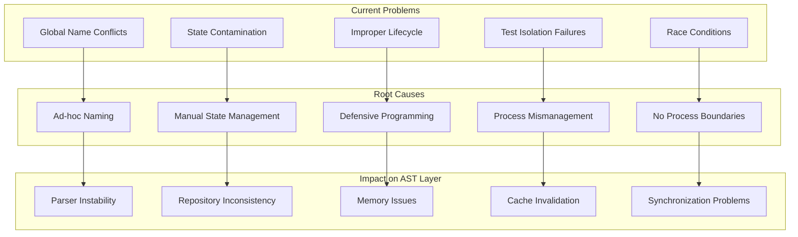

### 1.2 Foundation Layer Concurrency Model

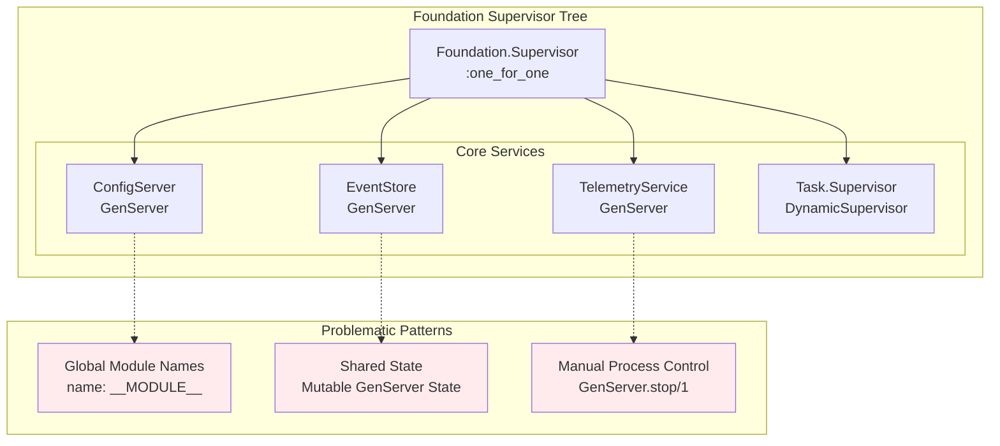

### 1.3 AST Layer Requirements

The AST Layer introduces additional complexity with its multi-component architecture:

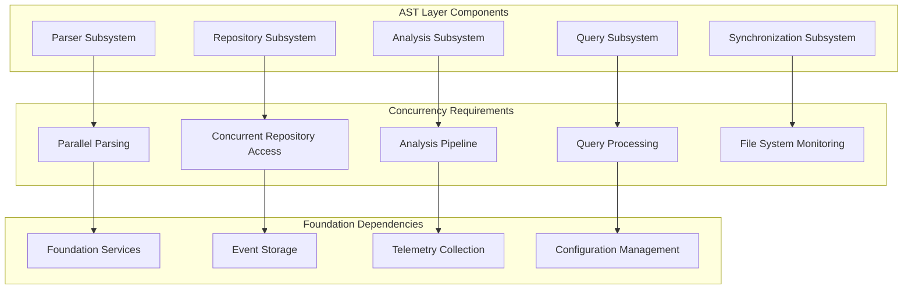

---

## 2. Concurrency Architecture Design

### 2.1 System-Wide Supervision Hierarchy

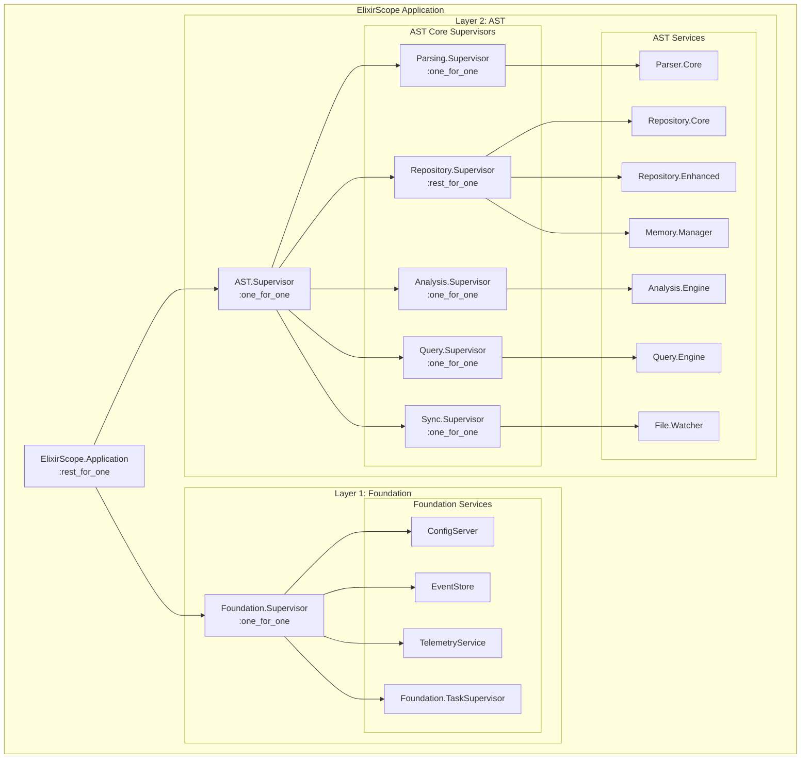

### 2.2 Process Registration Strategy

#### Current Anti-Pattern:
```elixir
# ❌ PROBLEMATIC: Global name registration
def start_link(opts) do
  GenServer.start_link(__MODULE__, opts, name: __MODULE__)
end
```

#### Proposed Solution:
```elixir
# ✅ PROPER: Registry-based naming with dynamic supervisors
defmodule ElixirScope.ProcessRegistry do
  @moduledoc """
  Centralized process registry for dynamic service discovery.
  """
  
  def child_spec(_) do
    Registry.child_spec(keys: :unique, name: __MODULE__)
  end
  
  def via_tuple(service_name, instance_id \\ :default) do
    {:via, Registry, {__MODULE__, {service_name, instance_id}}}
  end
  
  def lookup(service_name, instance_id \\ :default) do
    case Registry.lookup(__MODULE__, {service_name, instance_id}) do
      [{pid, _}] -> {:ok, pid}
      [] -> {:error, :not_found}
    end
  end
end
```

### 2.3 Enhanced Service Architecture

```mermaid
graph TB
    subgraph "Enhanced Foundation Services"
        subgraph "ConfigServer Cluster"
            CS1[ConfigServer.Primary<br/>via: {:config, :primary}]
            CS2[ConfigServer.Replica<br/>via: {:config, :replica}]
            CSC[ConfigServer.Cache<br/>ETS-backed]
        end
        
        subgraph "EventStore Cluster"
            ES1[EventStore.Writer<br/>via: {:events, :writer}]
            ES2[EventStore.Reader<br/>via: {:events, :reader}]
            ESI[EventStore.Index<br/>via: {:events, :index}]
        end
        
        subgraph "TelemetryService Pool"
            TS1[TelemetryCollector.1<br/>via: {:telemetry, 1}]
            TS2[TelemetryCollector.2<br/>via: {:telemetry, 2}]
            TSA[TelemetryAggregator<br/>via: {:telemetry, :aggregator}]
        end
    end
    
    subgraph "AST Layer Integration"
        API[AST Public API]
        APS[AST Private Services]
    end
    
    API --> CS1
    API --> ES2
    API --> TS1
    
    APS --> CS2
    APS --> ES1
    APS --> TSA
```

---

## 3. Inter-Layer Communication Patterns

### 3.1 Message Flow Architecture

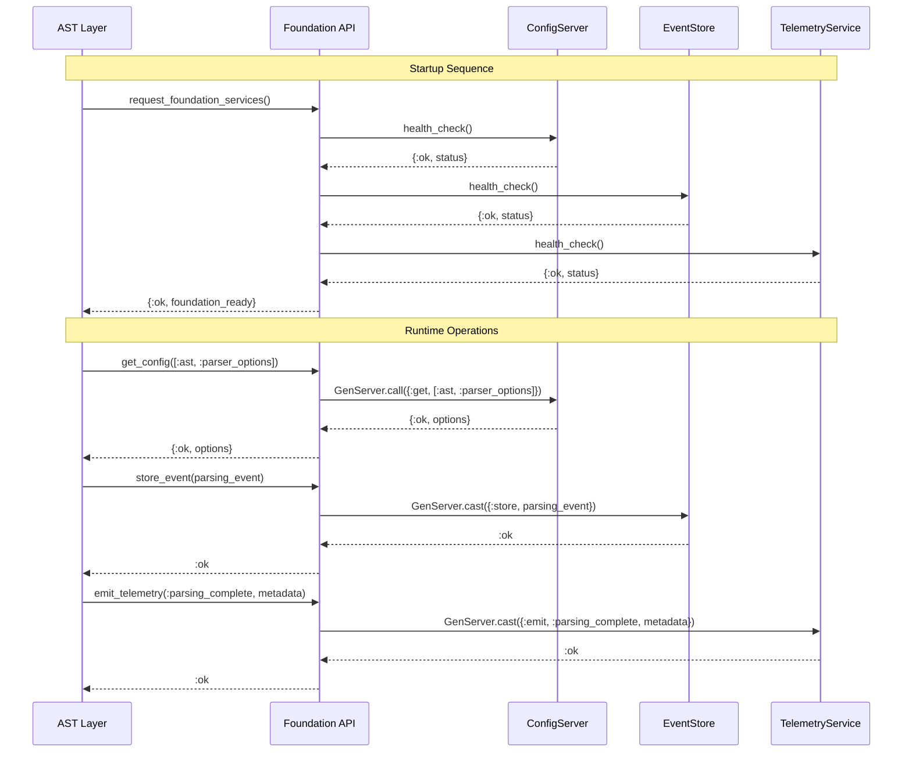

### 3.2 Communication Protocols

#### Synchronous Operations (High Priority, Low Latency)
```elixir
defmodule ElixirScope.Foundation.SyncAPI do
  @moduledoc """
  Synchronous API for critical operations requiring immediate response.
  """
  
  @spec get_config(path :: [atom()], timeout :: pos_integer()) :: 
    {:ok, term()} | {:error, term()}
  def get_config(path, timeout \\ 5_000) do
    with {:ok, pid} <- ProcessRegistry.lookup(:config, :primary) do
      GenServer.call(pid, {:get, path}, timeout)
    end
  end
  
  @spec health_check(service :: atom()) :: {:ok, map()} | {:error, term()}
  def health_check(service) do
    with {:ok, pid} <- ProcessRegistry.lookup(service, :primary) do
      GenServer.call(pid, :health_check, 1_000)
    end
  end
end
```

#### Asynchronous Operations (Fire-and-Forget)
```elixir
defmodule ElixirScope.Foundation.AsyncAPI do
  @moduledoc """
  Asynchronous API for non-critical operations with eventual consistency.
  """
  
  @spec store_event(event :: Event.t()) :: :ok
  def store_event(%Event{} = event) do
    case ProcessRegistry.lookup(:events, :writer) do
      {:ok, pid} -> GenServer.cast(pid, {:store, event})
      {:error, _} -> Logger.warn("EventStore writer unavailable")
    end
    :ok
  end
  
  @spec emit_telemetry(event :: atom(), metadata :: map()) :: :ok
  def emit_telemetry(event, metadata) when is_atom(event) and is_map(metadata) do
    telemetry_data = %{
      event: event,
      metadata: metadata,
      timestamp: System.system_time(:microsecond),
      layer: :ast
    }
    
    # Load-balanced distribution to telemetry collectors
    collector_id = :erlang.phash2(event, 4) + 1
    case ProcessRegistry.lookup(:telemetry, collector_id) do
      {:ok, pid} -> GenServer.cast(pid, {:collect, telemetry_data})
      {:error, _} -> Logger.warn("Telemetry collector #{collector_id} unavailable")
    end
    :ok
  end
end
```

### 3.3 Backpressure Management

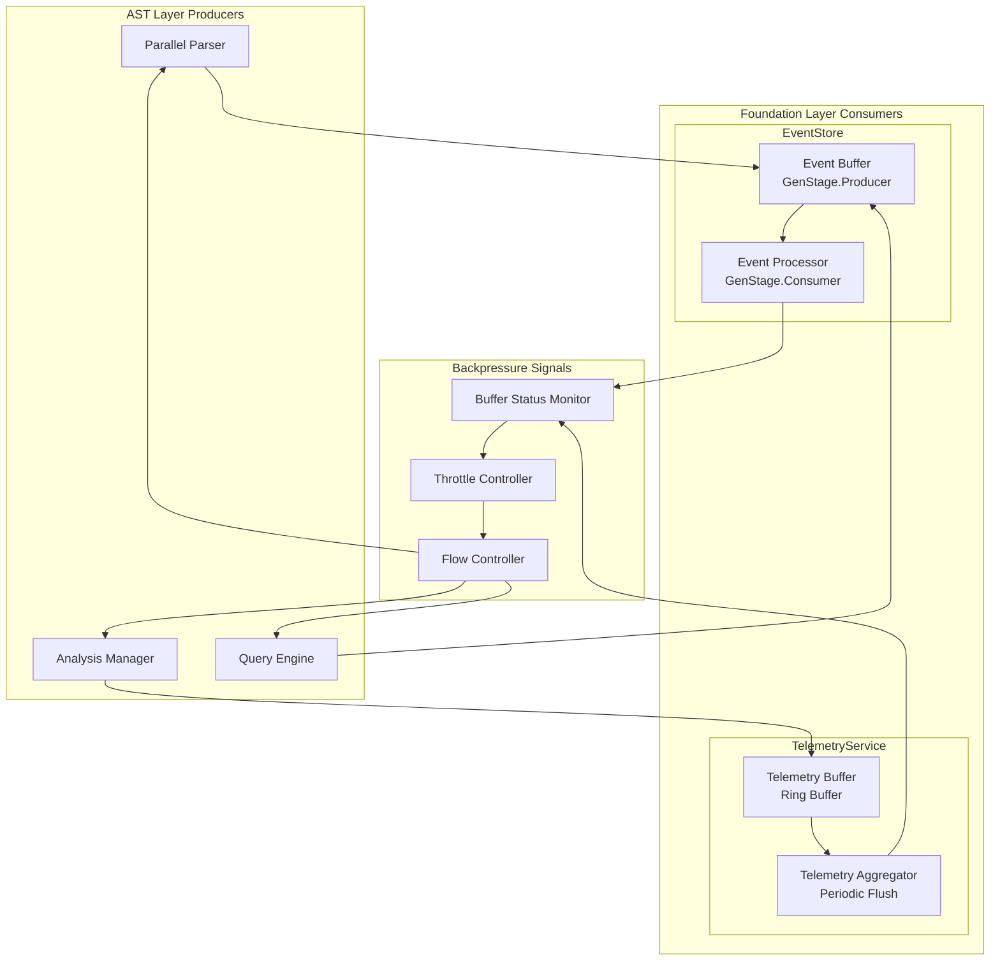

---

## 4. Supervision Tree Integration

### 4.1 Restart Strategies

#### Foundation Layer Strategy
```elixir
defmodule ElixirScope.Foundation.Supervisor do
  use Supervisor
  
  def start_link(init_arg) do
    Supervisor.start_link(__MODULE__, init_arg, name: __MODULE__)
  end
  
  @impl Supervisor
  def init(_init_arg) do
    children = [
      # Process Registry first (dependency for all services)
      {ProcessRegistry, []},
      
      # Core services with proper via tuples
      {ConfigServer, [name: ProcessRegistry.via_tuple(:config, :primary)]},
      {EventStore.Writer, [name: ProcessRegistry.via_tuple(:events, :writer)]},
      {EventStore.Reader, [name: ProcessRegistry.via_tuple(:events, :reader)]},
      {TelemetryService.Supervisor, []}, # Pool of collectors
      
      # Task supervisor for background work
      {Task.Supervisor, [name: Foundation.TaskSupervisor]}
    ]
    
    # one_for_one: Independent services, isolated failures
    Supervisor.init(children, strategy: :one_for_one)
  end
end
```

#### AST Layer Strategy
```elixir
defmodule ElixirScope.AST.Supervisor do
  use Supervisor
  
  def start_link(init_arg) do
    Supervisor.start_link(__MODULE__, init_arg, name: __MODULE__)
  end
  
  @impl Supervisor
  def init(_init_arg) do
    children = [
      # Repository services (critical path)
      {AST.Repository.Supervisor, []},
      
      # Parsing services (depends on repository)
      {AST.Parsing.Supervisor, []},
      
      # Analysis services (depends on repository and parsing)
      {AST.Analysis.Supervisor, []},
      
      # Query services (depends on repository)
      {AST.Query.Supervisor, []},
      
      # File synchronization (depends on all above)
      {AST.Sync.Supervisor, []}
    ]
    
    # rest_for_one: Ordered dependencies, cascade restarts
    Supervisor.init(children, strategy: :rest_for_one)
  end
end
```

### 4.2 Process Dependencies

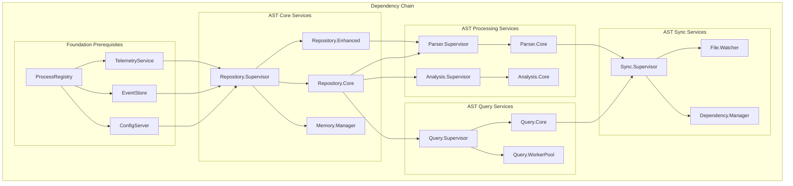

### 4.3 Health Check Integration

```elixir
defmodule ElixirScope.HealthMonitor do
  use GenServer
  require Logger
  
  @check_interval 30_000  # 30 seconds
  
  def start_link(_opts) do
    GenServer.start_link(__MODULE__, [], name: __MODULE__)
  end
  
  @impl GenServer
  def init(_) do
    schedule_check()
    {:ok, %{last_check: nil, status: %{}}}
  end
  
  @impl GenServer
  def handle_info(:health_check, state) do
    new_status = perform_health_checks()
    
    case analyze_health_status(new_status, state.status) do
      :healthy -> 
        Logger.debug("System health check: all services healthy")
        
      {:degraded, issues} ->
        Logger.warn("System health check: degraded performance - #{inspect(issues)}")
        
      {:critical, failures} ->
        Logger.error("System health check: critical failures - #{inspect(failures)}")
        # Potentially trigger graceful degradation
        trigger_graceful_degradation(failures)
    end
    
    schedule_check()
    {:noreply, %{state | last_check: System.system_time(), status: new_status}}
  end
  
  defp perform_health_checks do
    foundation_status = check_foundation_services()
    ast_status = check_ast_services()
    
    %{
      foundation: foundation_status,
      ast: ast_status,
      timestamp: System.system_time()
    }
  end
  
  defp check_foundation_services do
    services = [:config, :events, :telemetry]
    
    Enum.map(services, fn service ->
      case ProcessRegistry.lookup(service, :primary) do
        {:ok, pid} ->
          case GenServer.call(pid, :health_check, 1_000) do
            {:ok, status} -> {service, :healthy, status}
            {:error, reason} -> {service, :unhealthy, reason}
          end
        {:error, :not_found} ->
          {service, :not_found, nil}
      end
    rescue
      error -> {service, :error, error}
    end)
  end
  
  defp schedule_check do
    Process.send_after(self(), :health_check, @check_interval)
  end
end
```

---

## 5. Process Lifecycle Management

### 5.1 Graceful Startup Sequence

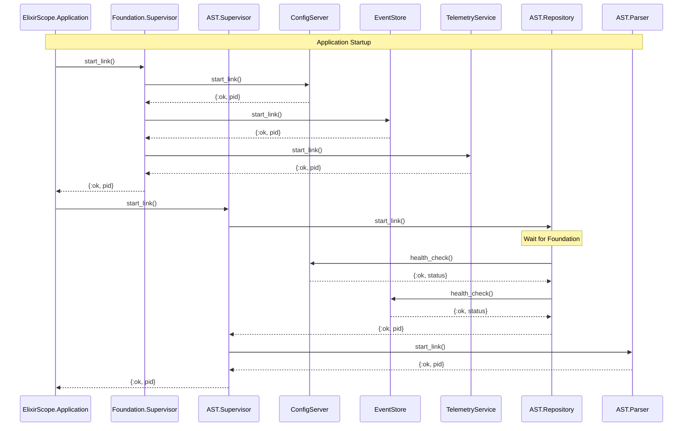

### 5.2 Graceful Shutdown Sequence

```elixir
defmodule ElixirScope.GracefulShutdown do
  @moduledoc """
  Coordinates graceful shutdown of the entire ElixirScope system.
  """
  
  def shutdown(reason \\ :normal) do
    Logger.info("Initiating graceful shutdown: #{inspect(reason)}")
    
    # Phase 1: Stop accepting new work
    :ok = stop_external_interfaces()
    
    # Phase 2: Complete in-flight operations (with timeout)
    :ok = wait_for_operations_completion(timeout: 30_000)
    
    # Phase 3: Shutdown AST layer (reverse dependency order)
    :ok = shutdown_ast_layer()
    
    # Phase 4: Shutdown Foundation layer
    :ok = shutdown_foundation_layer()
    
    Logger.info("Graceful shutdown completed")
  end
  
  defp stop_external_interfaces do
    # Stop file watchers
    case ProcessRegistry.lookup(:file_watcher, :primary) do
      {:ok, pid} -> GenServer.call(pid, :stop_watching)
      _ -> :ok
    end
    
    # Stop API endpoints
    # Stop CLI interfaces
    :ok
  end
  
  defp wait_for_operations_completion(timeout: timeout) do
    start_time = System.monotonic_time(:millisecond)
    wait_for_completion_recursive(start_time, timeout)
  end
  
  defp wait_for_completion_recursive(start_time, timeout) do
    elapsed = System.monotonic_time(:millisecond) - start_time
    
    if elapsed >= timeout do
      Logger.warn("Shutdown timeout reached, forcing termination")
      :timeout
    else
      case check_active_operations() do
        [] -> :ok
        operations ->
          Logger.info("Waiting for operations: #{inspect(operations)}")
          :timer.sleep(1000)
          wait_for_completion_recursive(start_time, timeout)
      end
    end
  end
  
  defp shutdown_ast_layer do
    # Shutdown in reverse dependency order
    supervisors = [
      ElixirScope.AST.Sync.Supervisor,
      ElixirScope.AST.Query.Supervisor,
      ElixirScope.AST.Analysis.Supervisor,
      ElixirScope.AST.Parsing.Supervisor,
      ElixirScope.AST.Repository.Supervisor
    ]
    
    Enum.each(supervisors, fn supervisor ->
      case Process.whereis(supervisor) do
        nil -> :ok
        pid -> 
          Logger.info("Shutting down #{supervisor}")
          Supervisor.stop(pid, :normal, 10_000)
      end
    end)
    :ok
  end
  
  defp shutdown_foundation_layer do
    case Process.whereis(ElixirScope.Foundation.Supervisor) do
      nil -> :ok
      pid ->
        Logger.info("Shutting down Foundation layer")
        Supervisor.stop(pid, :normal, 10_000)
    end
    :ok
  end
end
```

---

## 6. Fault Tolerance & Recovery

### 6.1 Error Classification and Handling

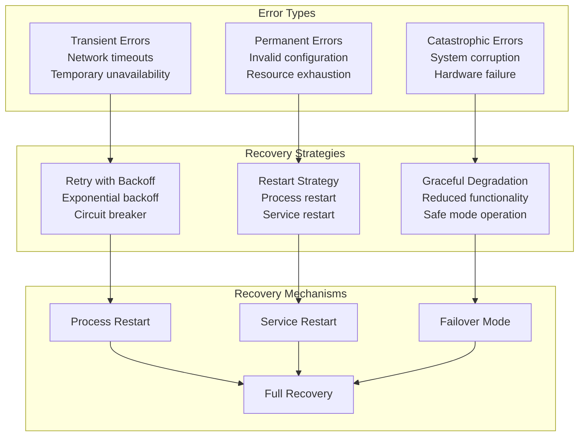

### 6.2 Circuit Breaker Pattern

```elixir
defmodule ElixirScope.CircuitBreaker do
  @moduledoc """
  Circuit breaker implementation for protecting against cascading failures.
  """
  
  use GenServer
  
  defstruct [
    :name,
    :failure_threshold,
    :recovery_time,
    :timeout,
    state: :closed,
    failure_count: 0,
    last_failure_time: nil
  ]
  
  def start_link(opts) do
    name = Keyword.fetch!(opts, :name)
    GenServer.start_link(__MODULE__, opts, name: {:via, Registry, {ProcessRegistry, {:circuit_breaker, name}}})
  end
  
  def call(name, fun, timeout \\ 5_000) when is_function(fun, 0) do
    breaker_name = {:via, Registry, {ProcessRegistry, {:circuit_breaker, name}}}
    GenServer.call(breaker_name, {:call, fun}, timeout)
  end
  
  @impl GenServer
  def init(opts) do
    circuit = %__MODULE__{
      name: Keyword.fetch!(opts, :name),
      failure_threshold: Keyword.get(opts, :failure_threshold, 5),
      recovery_time: Keyword.get(opts, :recovery_time, 60_000),
      timeout: Keyword.get(opts, :timeout, 5_000)
    }
    {:ok, circuit}
  end
  
  @impl GenServer
  def handle_call({:call, fun}, _from, circuit) do
    case circuit.state do
      :closed ->
        execute_call(fun, circuit)
      
      :open ->
        if should_attempt_reset?(circuit) do
          execute_call(fun, %{circuit | state: :half_open})
        else
          {:reply, {:error, :circuit_open}, circuit}
        end
      
      :half_open ->
        execute_call(fun, circuit)
    end
  end
  
  defp execute_call(fun, circuit) do
    try do
      result = fun.()
      # Success - reset failure count
      new_circuit = %{circuit | 
        state: :closed, 
        failure_count: 0, 
        last_failure_time: nil
      }
      {:reply, {:ok, result}, new_circuit}
    catch
      :exit, reason -> handle_failure(reason, circuit)
      :error, reason -> handle_failure(reason, circuit)
    end
  end
  
  defp handle_failure(reason, circuit) do
    new_failure_count = circuit.failure_count + 1
    new_state = if new_failure_count >= circuit.failure_threshold do
      :open
    else
      circuit.state
    end
    
    new_circuit = %{circuit |
      failure_count: new_failure_count,
      state: new_state,
      last_failure_time: System.monotonic_time(:millisecond)
    }
    
    {:reply, {:error, reason}, new_circuit}
  end
  
  defp should_attempt_reset?(circuit) do
    case circuit.last_failure_time do
      nil -> true
      last_failure ->
        System.monotonic_time(:millisecond) - last_failure > circuit.recovery_time
    end
  end
end
```

### 6.3 Graceful Degradation Strategies

```elixir
defmodule ElixirScope.GracefulDegradation do
  @moduledoc """
  Manages graceful degradation when services become unavailable.
  """
  
  def handle_service_unavailable(:config, operation, args) do
    case operation do
      :get ->
        # Fallback to cached config or defaults
        get_cached_config(args) || get_default_config(args)
      
      :update ->
        # Queue update for when service recovers
        queue_config_update(args)
        {:ok, :queued}
    end
  end
  
  def handle_service_unavailable(:events, operation, args) do
    case operation do
      :store ->
        # Store in temporary buffer or discard non-critical events
        store_in_buffer(args) || discard_event(args)
      
      :query ->
        # Return cached results or empty results
        get_cached_events(args) || {:ok, []}
    end
  end
  
  def handle_service_unavailable(:telemetry, operation, args) do
    case operation do
      :emit ->
        # Log to file or discard
        log_telemetry_to_file(args) || :ok
      
      :get_metrics ->
        # Return stale metrics or empty metrics
        get_stale_metrics() || {:ok, %{}}
    end
  end
  
  defp get_cached_config([path]) do
    case :ets.lookup(:config_cache, path) do
      [{^path, value, _timestamp}] -> {:ok, value}
      [] -> nil
    end
  end
  
  defp queue_config_update({path, value}) do
    :ets.insert(:config_update_queue, {path, value, System.system_time()})
  end
  
  defp store_in_buffer(event) do
    case :ets.info(:event_buffer, :size) do
      size when size < 10_000 ->
        :ets.insert(:event_buffer, {System.system_time(), event})
        {:ok, :buffered}
      _ ->
        nil  # Buffer full, will be discarded
    end
  end
end
```

---

## 7. Performance Optimization Strategies

### 7.1 Memory Management

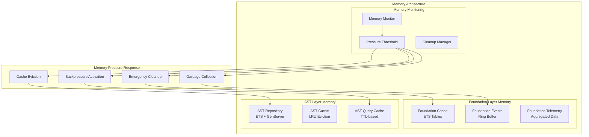

### 7.2 Concurrent Access Optimization

```elixir
defmodule ElixirScope.ConcurrencyOptimizer do
  @moduledoc """
  Optimizes concurrent access patterns across L1-L2 integration.
  """
  
  # Read-optimized configuration access
  def get_config_fast(path) do
    case :ets.lookup(:config_cache, path) do
      [{^path, value, timestamp}] ->
        if fresh_enough?(timestamp, ttl: 30_000) do
          {:ok, value}
        else
          refresh_config_cache(path)
        end
      [] ->
        load_config_cache(path)
    end
  end
  
  # Batch event operations to reduce GenServer calls
  def store_events_batch(events) when is_list(events) do
    case ProcessRegistry.lookup(:events, :writer) do
      {:ok, pid} ->
        GenServer.call(pid, {:store_batch, events}, 10_000)
      {:error, _} ->
        # Fallback to individual storage
        Enum.map(events, &store_event_fallback/1)
    end
  end
  
  # Parallel AST processing with controlled concurrency
  def parse_files_parallel(file_paths, opts \\ []) do
    max_concurrency = Keyword.get(opts, :max_concurrency, System.schedulers_online() * 2)
    timeout = Keyword.get(opts, :timeout, 30_000)
    
    file_paths
    |> Task.async_stream(
      &parse_single_file/1,
      max_concurrency: max_concurrency,
      timeout: timeout,
      on_timeout: :kill_task
    )
    |> Enum.reduce({[], []}, fn
      {:ok, result}, {successes, failures} ->
        {[result | successes], failures}
      {:exit, reason}, {successes, failures} ->
        {successes, [{:error, reason} | failures]}
    end)
  end
  
  # Non-blocking telemetry emission
  def emit_telemetry_async(event, metadata) do
    Task.start(fn ->
      ElixirScope.Foundation.AsyncAPI.emit_telemetry(event, metadata)
    end)
  end
  
  defp fresh_enough?(timestamp, ttl: ttl) do
    System.system_time(:millisecond) - timestamp < ttl
  end
  
  defp refresh_config_cache(path) do
    case ElixirScope.Foundation.SyncAPI.get_config(path) do
      {:ok, value} ->
        :ets.insert(:config_cache, {path, value, System.system_time(:millisecond)})
        {:ok, value}
      error ->
        error
    end
  end
end
```

### 7.3 Query Optimization

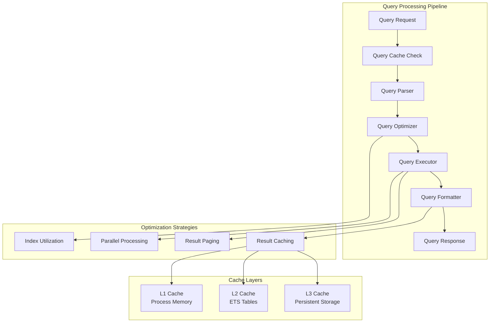

---

## 8. Implementation Roadmap

### 8.1 Phase 1: Foundation Layer Refactoring (Weeks 1-2)

```mermaid
gantt
    title Foundation Layer Concurrency Refactoring
    dateFormat  X
    axisFormat %d
    
    section Process Registry
    Implement ProcessRegistry     :done, reg, 0, 3
    Update service registration   :done, srv, 3, 5
    
    section Service Refactoring
    ConfigServer enhancement      :active, cfg, 5, 10
    EventStore optimization      :evt, 8, 13
    TelemetryService pooling     :tel, 11, 16
    
    section Testing
    Unit test updates            :test1, 14, 18
    Integration testing          :test2, 17, 21
    Performance testing          :perf, 20, 24
```

#### Key Deliverables:
1. **ProcessRegistry Implementation**
   - Registry-based service discovery
   - Dynamic process naming
   - Health monitoring integration

2. **Enhanced Service Architecture**
   - ConfigServer with caching
   - EventStore with reader/writer separation
   - TelemetryService pooling

3. **Test Infrastructure**
   - Supervision-based test isolation
   - Concurrent test scenarios
   - Performance benchmarks

### 8.2 Phase 2: AST Layer Integration (Weeks 3-4)

```mermaid
gantt
    title AST Layer Concurrency Implementation
    dateFormat  X
    axisFormat %d
    
    section Repository Layer
    Repository supervisor setup  :repo, 0, 5
    Memory manager integration   :mem, 3, 8
    
    section Processing Layer
    Parser concurrency design   :parse, 5, 10
    Analysis pipeline setup     :analysis, 8, 13
    
    section Query Layer
    Query engine optimization   :query, 10, 15
    Cache integration          :cache, 13, 18
    
    section Integration
    L1-L2 communication setup  :comm, 15, 20
    End-to-end testing         :e2e, 18, 22
```

#### Key Deliverables:
1. **AST Supervision Tree**
   - Hierarchical supervision strategy
   - Dependency management
   - Restart coordination

2. **Concurrency Patterns**
   - Parallel parsing implementation
   - Concurrent repository access
   - Query processing optimization

3. **Integration Layer**
   - Foundation-AST communication protocols
   - Backpressure management
   - Error handling coordination

### 8.3 Phase 3: Performance Optimization (Weeks 5-6)

#### Key Focus Areas:
1. **Memory Optimization**
   - Cache hierarchy implementation
   - Memory pressure handling
   - Garbage collection tuning

2. **Throughput Optimization**
   - Batch processing implementation
   - Parallel query execution
   - Pipeline optimization

3. **Latency Optimization**
   - Hot path identification
   - Critical section minimization
   - Response time monitoring

### 8.4 Phase 4: Production Readiness (Weeks 7-8)

#### Key Deliverables:
1. **Monitoring & Observability**
   - Health check implementation
   - Performance metrics collection
   - Error tracking integration

2. **Graceful Degradation**
   - Circuit breaker implementation
   - Fallback mechanisms
   - Service recovery automation

3. **Documentation & Training**
   - Architecture documentation
   - Operational runbooks
   - Developer training materials

---

## Conclusion

The L1-L2 concurrency architecture represents a critical foundation for ElixirScope's reliability and performance. By implementing proper BEAM/OTP patterns, establishing robust supervision hierarchies, and ensuring fault tolerance, this design provides:

1. **Reliability**: Process isolation and supervision ensure system stability
2. **Performance**: Optimized concurrency patterns maximize throughput
3. **Scalability**: Resource management and backpressure enable growth
4. **Maintainability**: Clear architectural boundaries simplify development

The phased implementation approach ensures gradual migration from the current problematic patterns to a robust, production-ready architecture that can support ElixirScope's ambitious goals for code analysis and debugging capabilities.
