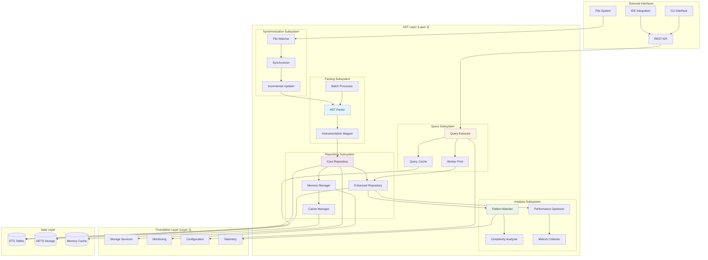
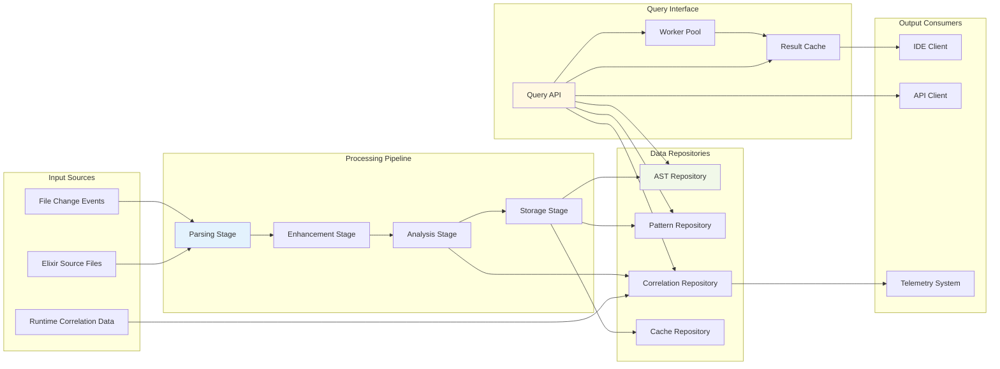

# AST Layer Architecture Overview

**Version**: 1.0  
**Date**: June 2025  
**Layer**: AST Layer (Layer 2)  
**Purpose**: Comprehensive architectural analysis and implementation guidance

## Executive Summary

The AST Layer represents the core intelligence engine of ElixirScope, transforming Elixir source code into structured, queryable data representations. This document provides a high-level architectural overview with detailed mermaid diagrams to guide implementation.

## System Architecture Overview

## Core Design Principles

### 1. Performance-First Architecture
- **O(1) Lookups**: Module and function data retrieval
- **O(log n) Complex Queries**: Pattern matching and correlation
- **Memory Efficiency**: Hierarchical caching with LRU eviction
- **Concurrent Processing**: Non-blocking read operations

### 2. Runtime Correlation
- **Bidirectional Mapping**: Static analysis ↔ Dynamic events
- **Instrumentation Points**: Strategic code insertion markers
- **Temporal Correlation**: Time-based event association
- **Performance Tracking**: Static predictions vs runtime metrics

### 3. Incremental Processing
- **File-Change Driven**: Only process modified files
- **Dependency Tracking**: Cascade updates to dependent modules
- **Atomic Updates**: Consistent state during batch operations
- **Rollback Capability**: Error recovery with previous state

## Data Flow Architecture

## Component Responsibilities

### Parsing Subsystem
- **Primary Responsibility**: Transform Elixir source code into enhanced AST structures
- **Key Functions**: 
  - Lexical and syntax analysis
  - AST node creation and validation
  - Instrumentation point detection
  - Error recovery and partial parsing

### Repository Subsystem
- **Primary Responsibility**: High-performance storage and retrieval of AST data
- **Key Functions**:
  - ETS-based storage with concurrent access
  - Memory management and pressure handling
  - Cache optimization and eviction policies
  - Data consistency and atomic operations

### Analysis Subsystem
- **Primary Responsibility**: Pattern recognition and code quality assessment
- **Key Functions**:
  - Pattern matching against AST structures
  - Complexity analysis and scoring
  - Performance optimization recommendations
  - Anti-pattern detection

### Query Subsystem
- **Primary Responsibility**: Flexible querying interface for AST data
- **Key Functions**:
  - Query parsing and optimization
  - Result caching and pagination
  - Concurrent query execution
  - Response formatting and serialization

### Synchronization Subsystem
- **Primary Responsibility**: Real-time file monitoring and incremental updates
- **Key Functions**:
  - File system event monitoring
  - Change detection and impact analysis
  - Incremental parsing and updates
  - Dependency cascade management

## Performance Specifications

### Response Time Requirements
- **Module Lookup**: < 1ms (99th percentile)
- **Function Query**: < 5ms (99th percentile)
- **Pattern Matching**: < 100ms (95th percentile)
- **Complex Queries**: < 500ms (95th percentile)

### Throughput Requirements
- **File Processing**: 1000+ files/minute
- **Concurrent Queries**: 100+ queries/second
- **Memory Usage**: < 500MB for 100k LOC project
- **Update Latency**: < 2 seconds for file changes

## Integration Points

### Foundation Layer Dependencies
- **Storage Services**: Data persistence and retrieval patterns
- **Monitoring**: Health checks and performance metrics
- **Configuration**: Runtime configuration management
- **Telemetry**: Event emission and correlation

### External Integrations
- **File System**: Direct file monitoring and access
- **IDE Clients**: Language server protocol compliance
- **API Consumers**: REST API for external tools
- **Telemetry Systems**: Runtime correlation data ingestion

## Implementation Phases

### Phase 1: Core Repository (Weeks 1-3)
Focus on fundamental data storage and retrieval capabilities.

### Phase 2: Parsing & Instrumentation (Weeks 4-6)
Implement AST parsing with instrumentation point detection.

### Phase 3: Pattern Matching (Weeks 7-9)
Build sophisticated pattern recognition capabilities.

### Phase 4: Advanced Features (Weeks 10-12)
Add performance optimization and complex query support.

### Phase 5: Incremental Sync (Weeks 13-15)
Implement real-time file monitoring and updates.

## Next Steps

1. **Review Repository Design**: Examine detailed repository architecture in `02_ast_repository_deep_dive.md`
2. **Study Parsing Pipeline**: Understand parsing implementation in `03_ast_parsing_pipeline.md`
3. **Explore Pattern Matching**: Learn pattern analysis in `04_ast_pattern_matching.md`
4. **Understand Synchronization**: Review file monitoring in `05_ast_synchronization.md`
5. **Examine Performance**: Study optimization strategies in `06_ast_performance_optimization.md`
