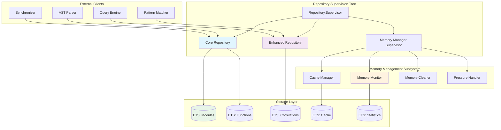
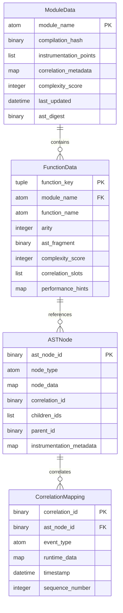
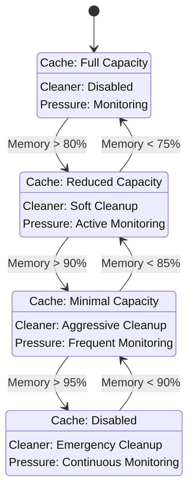
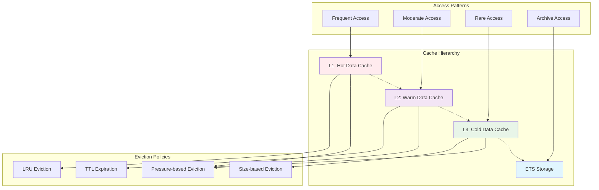
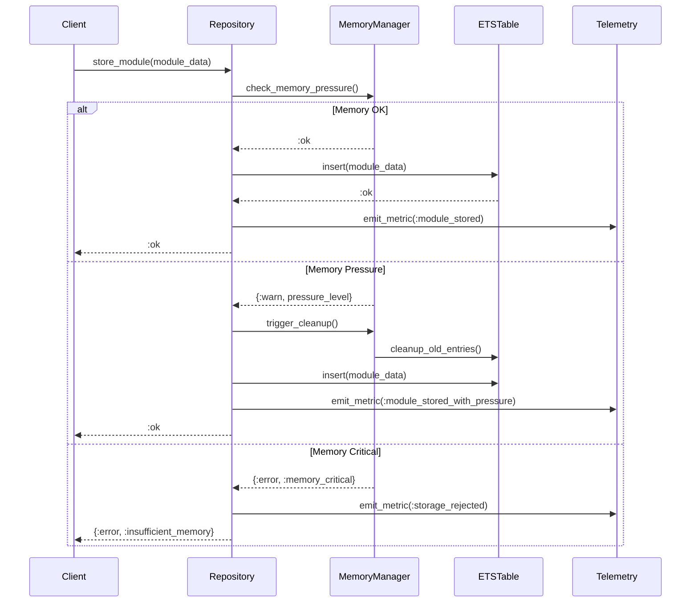
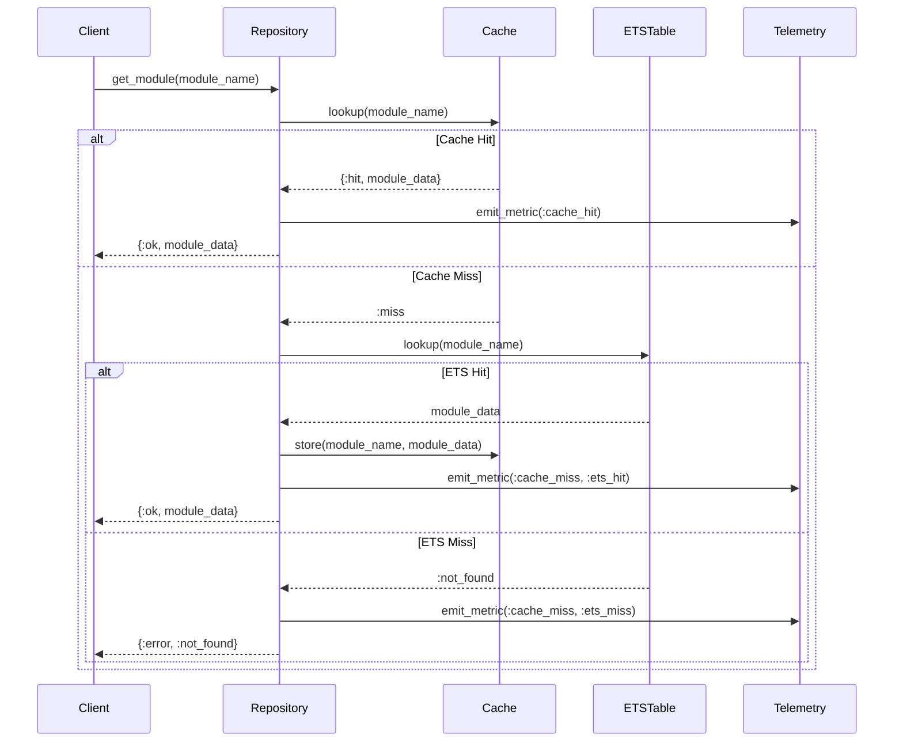
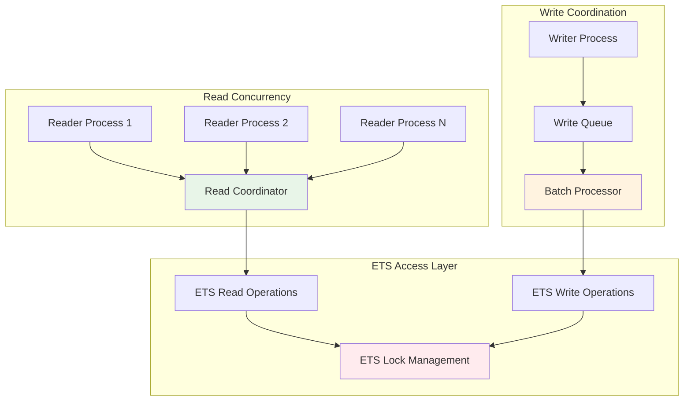
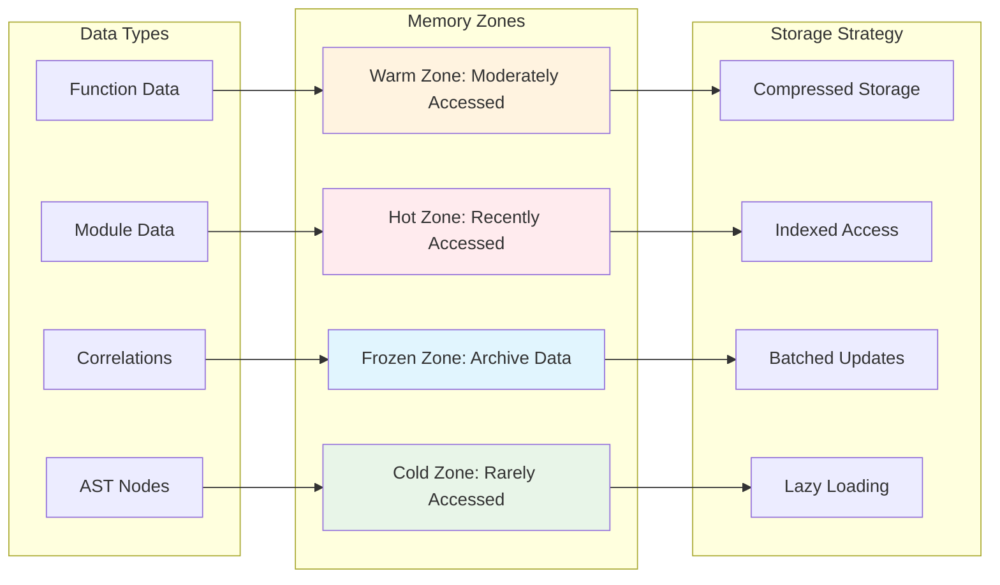

# AST Repository Deep Dive

**Version**: 1.0  
**Date**: June 2025  
**Component**: Repository Subsystem  
**Purpose**: Detailed repository architecture and implementation guidance

## Repository Architecture Overview

The AST Repository subsystem serves as the high-performance data backbone for the AST Layer, providing efficient storage, retrieval, and management of parsed AST data with runtime correlation capabilities.

## Repository Component Architecture



## Core Repository Design

### Data Structure Specifications



### ETS Table Specifications

```mermaid
graph LR
    subgraph "ETS Table Design"
        subgraph "Modules Table"
            MOD_TABLE[modules_table]
            MOD_KEY[Key: module_name]
            MOD_VAL[Value: ModuleData.t()]
            MOD_OPT[Options: named_table, public, read_concurrency]
        end

        subgraph "Functions Table"
            FUNC_TABLE[functions_table]
            FUNC_KEY[Key: {module, function, arity}]
            FUNC_VAL[Value: FunctionData.t()]
            FUNC_OPT[Options: named_table, public, read_concurrency]
        end

        subgraph "AST Nodes Table"
            AST_TABLE[ast_nodes_table]
            AST_KEY[Key: ast_node_id]
            AST_VAL[Value: ASTNode.t()]
            AST_OPT[Options: named_table, public, read_concurrency]
        end

        subgraph "Correlations Table"
            CORR_TABLE[correlations_table]
            CORR_KEY[Key: correlation_id]
            CORR_VAL[Value: CorrelationMapping.t()]
            CORR_OPT[Options: named_table, public, read_concurrency]
        end

        subgraph "Cache Table"
            CACHE_TABLE[cache_table]
            CACHE_KEY[Key: cache_key]
            CACHE_VAL[Value: {data, timestamp, access_count}]
            CACHE_OPT[Options: named_table, private, write_concurrency]
        end
    end

    MOD_KEY --> MOD_VAL
    FUNC_KEY --> FUNC_VAL
    AST_KEY --> AST_VAL
    CORR_KEY --> CORR_VAL
    CACHE_KEY --> CACHE_VAL

    style MOD_TABLE fill:#e1f5fe
    style FUNC_TABLE fill:#f3e5f5
    style AST_TABLE fill:#e8f5e8
    style CORR_TABLE fill:#fff3e0
    style CACHE_TABLE fill:#fce4ec
```

## Memory Management Architecture

### Memory Pressure Handling



### Cache Management Strategy



## Repository API Specifications

### Core Repository Interface

```elixir
defmodule ElixirScope.AST.Repository.Core do
  @moduledoc """
  Core repository for AST data storage and retrieval.
  
  Performance Targets:
  - Module lookup: < 1ms (99th percentile)
  - Function lookup: < 2ms (99th percentile)
  - Batch operations: < 100ms for 1000 items
  """

  # Public API
  @spec store_module(ModuleData.t()) :: :ok | {:error, term()}
  @spec get_module(atom()) :: {:ok, ModuleData.t()} | {:error, :not_found}
  @spec store_function(FunctionData.t()) :: :ok | {:error, term()}
  @spec get_function(function_key()) :: {:ok, FunctionData.t()} | {:error, :not_found}
  @spec batch_store([ModuleData.t() | FunctionData.t()]) :: :ok | {:error, term()}
  @spec list_modules() :: [atom()]
  @spec cleanup_module(atom()) :: :ok
end
```

### Enhanced Repository Interface

```elixir
defmodule ElixirScope.AST.Repository.Enhanced do
  @moduledoc """
  Enhanced repository with correlation and analysis capabilities.
  
  Performance Targets:
  - Correlation lookup: < 5ms (95th percentile)
  - Pattern queries: < 50ms (95th percentile)
  - Complex analysis: < 200ms (90th percentile)
  """

  # Public API
  @spec store_correlation(CorrelationMapping.t()) :: :ok | {:error, term()}
  @spec get_correlations(binary()) :: [CorrelationMapping.t()]
  @spec find_patterns(pattern_spec()) :: {:ok, [match_result()]} | {:error, term()}
  @spec analyze_complexity(atom()) :: {:ok, complexity_analysis()} | {:error, term()}
  @spec get_instrumentation_points(atom()) :: [instrumentation_point()]
end
```

## Data Persistence Strategy

### Write Operations Flow



### Read Operations Flow



## Performance Optimization Strategies

### Concurrent Access Patterns



### Memory Layout Optimization



## Implementation Guidelines

### Repository Initialization

1. **ETS Table Creation**: Configure tables with appropriate options
2. **Memory Manager Setup**: Initialize monitoring and cleanup processes
3. **Cache Warming**: Pre-load frequently accessed data
4. **Telemetry Integration**: Set up performance metrics collection

### Error Handling Strategy

1. **Graceful Degradation**: Continue operation with reduced functionality
2. **Recovery Mechanisms**: Automatic restart and data restoration
3. **Data Integrity**: Validate data consistency during operations
4. **Performance Monitoring**: Track and alert on performance degradation

### Testing Strategy

1. **Unit Tests**: Individual component functionality
2. **Integration Tests**: Cross-component interactions
3. **Performance Tests**: Load and stress testing
4. **Chaos Engineering**: Fault injection and recovery testing

## Next Steps

1. **Examine Parsing Pipeline**: Review `03_ast_parsing_pipeline.md` for parser integration
2. **Study Memory Management**: Deep dive into memory optimization strategies
3. **Implement Core Repository**: Start with basic storage and retrieval
4. **Add Enhanced Features**: Extend with correlation and analysis capabilities
5. **Performance Tuning**: Optimize based on real-world usage patterns
