# AST Synchronization System

**Version**: 1.0  
**Date**: June 2025  
**Component**: Synchronization Subsystem  
**Purpose**: Real-time file monitoring and incremental AST updates

## Synchronization Overview

The AST Synchronization System provides real-time file system monitoring, change detection, and incremental AST updates to maintain data consistency while minimizing processing overhead and system resource usage.

## Synchronization Architecture

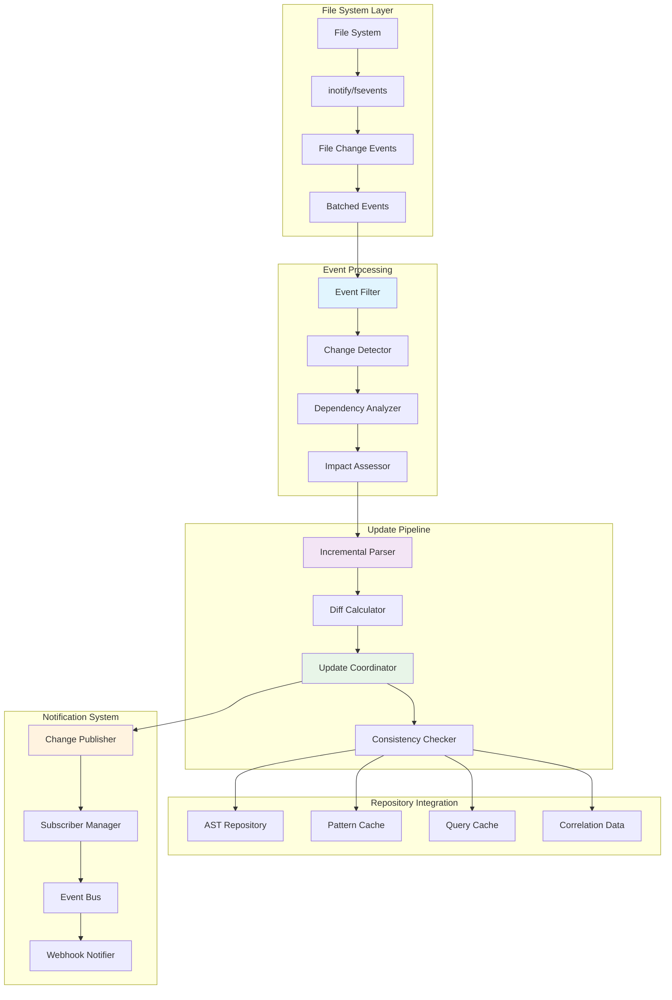

## File System Monitoring

### File Watcher Architecture

```mermaid
graph TB
    subgraph "Platform Abstraction"
        FS_WATCHER[File System Watcher]
        LINUX_IMPL[Linux: inotify]
        MACOS_IMPL[macOS: fsevents]
        WINDOWS_IMPL[Windows: ReadDirectoryChangesW]
        FALLBACK_IMPL[Fallback: Polling]
    end

    subgraph "Event Types"
        CREATE[File Created]
        MODIFY[File Modified]
        DELETE[File Deleted]
        MOVE[File Moved/Renamed]
        ATTR[Attributes Changed]
    end

    subgraph "Filtering Logic"
        EXTENSION_FILTER[Extension Filter (.ex, .exs)]
        PATH_FILTER[Path Filter (exclude _build, deps)]
        SIZE_FILTER[Size Filter (ignore large files)]
        TEMP_FILTER[Temporary File Filter]
    end

    subgraph "Event Batching"
        EVENT_BUFFER[Event Buffer]
        BATCH_TIMER[Batch Timer]
        DEBOUNCE[Debounce Logic]
        RATE_LIMITER[Rate Limiter]
    end

    FS_WATCHER --> LINUX_IMPL
    FS_WATCHER --> MACOS_IMPL
    FS_WATCHER --> WINDOWS_IMPL
    FS_WATCHER --> FALLBACK_IMPL

    LINUX_IMPL --> CREATE
    MACOS_IMPL --> MODIFY
    WINDOWS_IMPL --> DELETE
    FALLBACK_IMPL --> MOVE
    FS_WATCHER --> ATTR

    CREATE --> EXTENSION_FILTER
    MODIFY --> PATH_FILTER
    DELETE --> SIZE_FILTER
    MOVE --> TEMP_FILTER

    EXTENSION_FILTER --> EVENT_BUFFER
    PATH_FILTER --> BATCH_TIMER
    SIZE_FILTER --> DEBOUNCE
    TEMP_FILTER --> RATE_LIMITER

    style FS_WATCHER fill:#e1f5fe
    style CREATE fill:#f3e5f5
    style EXTENSION_FILTER fill:#e8f5e8
    style EVENT_BUFFER fill:#fff3e0
```

### Event Processing State Machine

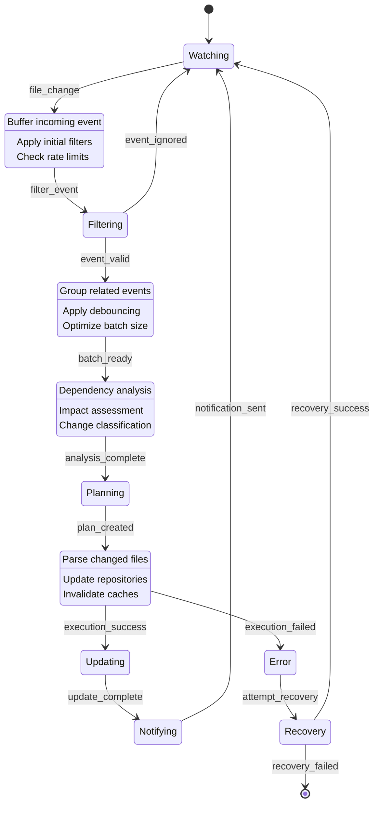

## Change Detection and Analysis

### Dependency Graph Management

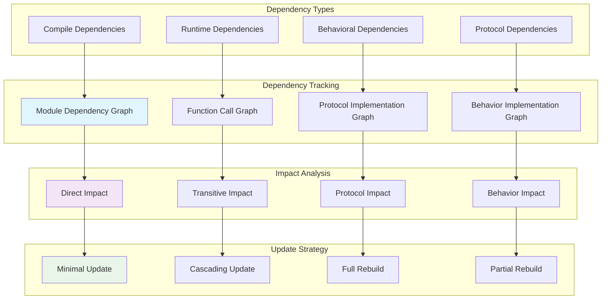

### Change Classification

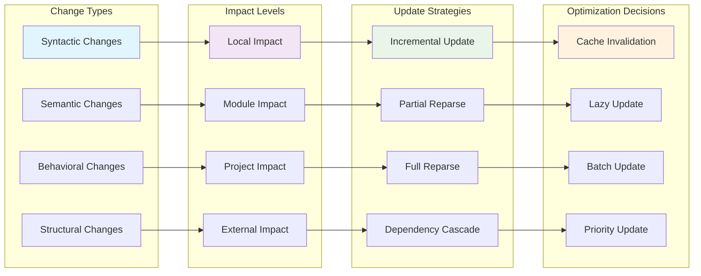

## Incremental Update Pipeline

### Incremental Parsing Strategy

```mermaid
flowchart TD
    START[File Change Detected]
    LOAD_PREVIOUS[Load Previous AST]
    PARSE_NEW[Parse New Content]
    
    subgraph "Diff Calculation"
        TREE_DIFF[Calculate Tree Diff]
        NODE_DIFF[Calculate Node Diff]
        SEMANTIC_DIFF[Calculate Semantic Diff]
        METADATA_DIFF[Calculate Metadata Diff]
    end
    
    subgraph "Update Generation"
        CREATE_UPDATES[Generate Create Operations]
        MODIFY_UPDATES[Generate Modify Operations]
        DELETE_UPDATES[Generate Delete Operations]
        REORDER_UPDATES[Generate Reorder Operations]
    end
    
    subgraph "Validation"
        CONSISTENCY_CHECK[Consistency Check]
        REFERENCE_CHECK[Reference Validation]
        CONSTRAINT_CHECK[Constraint Validation]
        ROLLBACK_PREP[Rollback Preparation]
    end
    
    APPLY_UPDATES[Apply Updates]
    UPDATE_INDEXES[Update Indexes]
    INVALIDATE_CACHE[Invalidate Caches]
    NOTIFY_SUBSCRIBERS[Notify Subscribers]
    END[Update Complete]

    START --> LOAD_PREVIOUS
    LOAD_PREVIOUS --> PARSE_NEW
    PARSE_NEW --> TREE_DIFF
    
    TREE_DIFF --> NODE_DIFF
    NODE_DIFF --> SEMANTIC_DIFF
    SEMANTIC_DIFF --> METADATA_DIFF
    
    METADATA_DIFF --> CREATE_UPDATES
    CREATE_UPDATES --> MODIFY_UPDATES
    MODIFY_UPDATES --> DELETE_UPDATES
    DELETE_UPDATES --> REORDER_UPDATES
    
    REORDER_UPDATES --> CONSISTENCY_CHECK
    CONSISTENCY_CHECK --> REFERENCE_CHECK
    REFERENCE_CHECK --> CONSTRAINT_CHECK
    CONSTRAINT_CHECK --> ROLLBACK_PREP
    
    ROLLBACK_PREP --> APPLY_UPDATES
    APPLY_UPDATES --> UPDATE_INDEXES
    UPDATE_INDEXES --> INVALIDATE_CACHE
    INVALIDATE_CACHE --> NOTIFY_SUBSCRIBERS
    NOTIFY_SUBSCRIBERS --> END

    style TREE_DIFF fill:#e1f5fe
    style CREATE_UPDATES fill:#f3e5f5
    style CONSISTENCY_CHECK fill:#e8f5e8
    style APPLY_UPDATES fill:#fff3e0
```

### AST Diff Algorithm

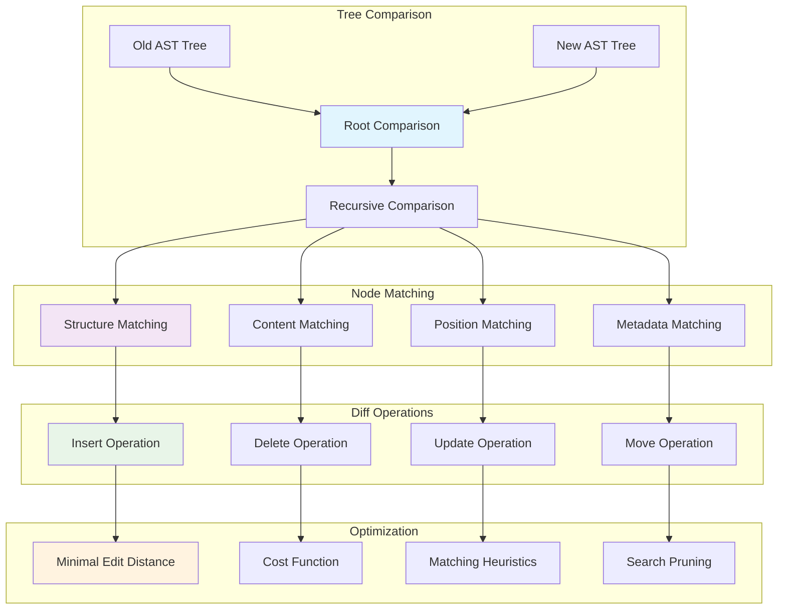

## Consistency and Rollback

### Consistency Management

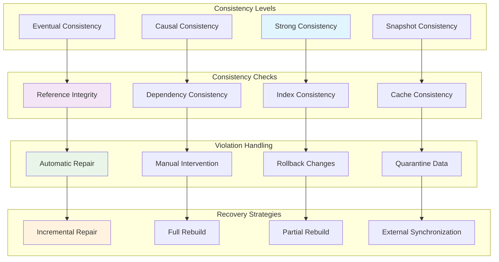

### Transaction Management

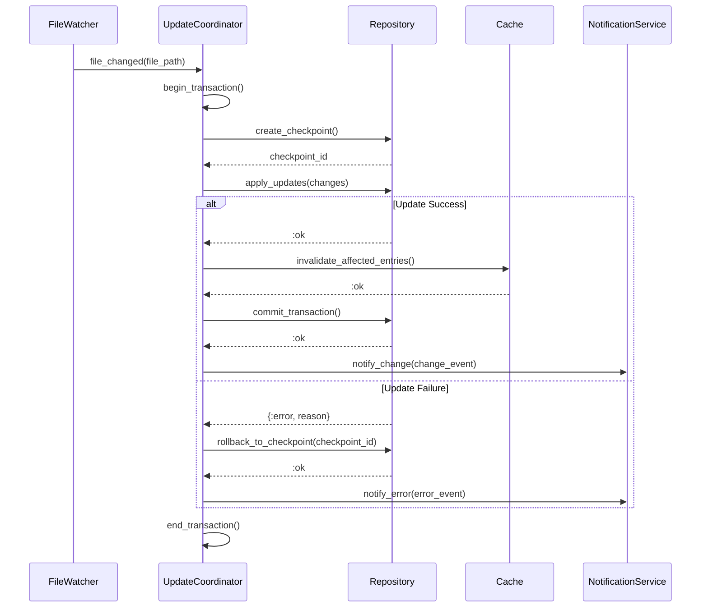

## Performance Optimization

### Batching and Debouncing

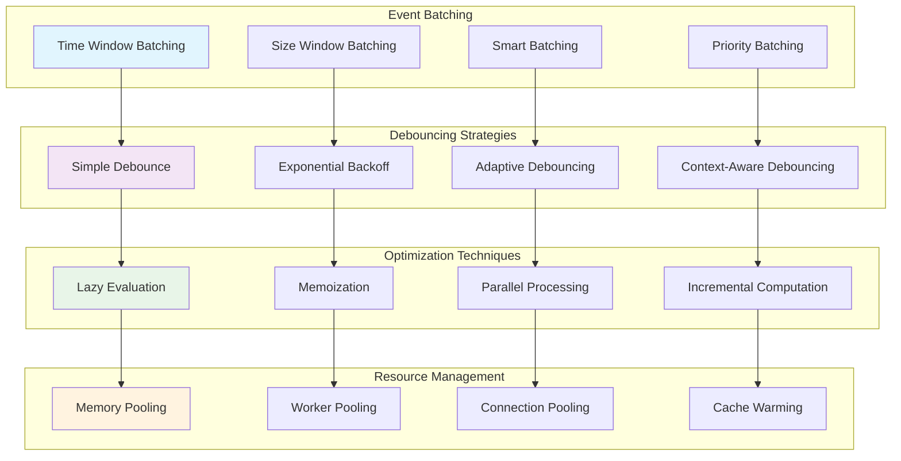

### Memory Management

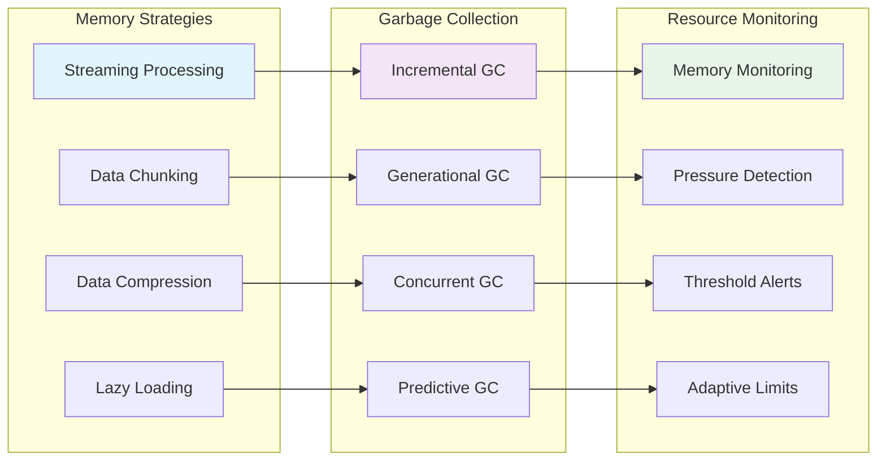

## API Specifications

### Synchronization Interface

```elixir
defmodule ElixirScope.AST.Synchronizer do
  @moduledoc """
  Main synchronization service for real-time AST updates.
  
  Performance Targets:
  - Event processing: < 10ms per event
  - Batch processing: < 100ms per batch
  - Update propagation: < 500ms end-to-end
  """

  @type sync_options :: %{
    watch_patterns: [String.t()],
    ignore_patterns: [String.t()],
    batch_size: pos_integer(),
    debounce_ms: pos_integer(),
    max_concurrent_updates: pos_integer()
  }

  @spec start_watching(Path.t(), sync_options()) :: 
    {:ok, watcher_id()} | {:error, term()}
  @spec stop_watching(watcher_id()) :: :ok
  @spec force_sync(Path.t()) :: :ok | {:error, term()}
  @spec get_sync_status() :: sync_status()
end
```

### Change Notification Interface

```elixir
defmodule ElixirScope.AST.ChangeNotifier do
  @moduledoc """
  Change notification and subscription service.
  """

  @type change_event :: %{
    type: :file_changed | :module_updated | :pattern_detected,
    source: Path.t() | atom(),
    timestamp: DateTime.t(),
    changes: [change_detail()],
    metadata: map()
  }

  @spec subscribe(change_pattern(), callback()) :: 
    {:ok, subscription_id()} | {:error, term()}
  @spec unsubscribe(subscription_id()) :: :ok
  @spec notify_change(change_event()) :: :ok
  @spec get_change_history(time_range()) :: [change_event()]
end
```

### Incremental Update Interface

```elixir
defmodule ElixirScope.AST.IncrementalUpdater do
  @moduledoc """
  Incremental AST update management.
  """

  @type update_operation :: :insert | :update | :delete | :move
  @type ast_diff :: %{
    operation: update_operation(),
    path: ast_path(),
    old_value: ast_node() | nil,
    new_value: ast_node() | nil
  }

  @spec calculate_diff(old_ast(), new_ast()) :: [ast_diff()]
  @spec apply_diff([ast_diff()]) :: :ok | {:error, term()}
  @spec validate_consistency() :: :ok | {:error, [consistency_error()]}
  @spec create_checkpoint() :: checkpoint_id()
  @spec rollback_to_checkpoint(checkpoint_id()) :: :ok | {:error, term()}
end
```

## Testing Strategy

### Synchronization Testing

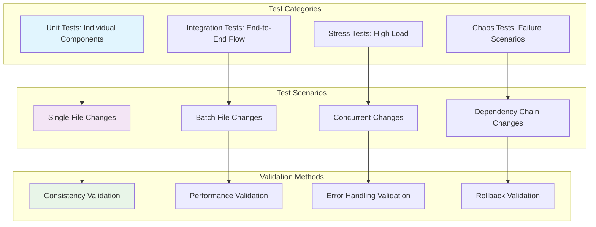

## Implementation Guidelines

### Development Phases

1. **Phase 1**: Basic file watching and event processing
2. **Phase 2**: Incremental parsing and diff calculation
3. **Phase 3**: Dependency analysis and impact assessment
4. **Phase 4**: Consistency management and rollback
5. **Phase 5**: Performance optimization and monitoring

### Quality Metrics

- **Event Processing Latency**: < 10ms per event
- **Update Propagation Time**: < 500ms end-to-end
- **Consistency Guarantee**: 99.9% accuracy
- **Memory Usage**: < 50MB for file watcher
- **Error Recovery Rate**: > 99% successful recoveries

## Next Steps

1. **Study Performance Optimization**: Review `07_ast_performance_optimization.md`
2. **Examine Testing Strategy**: Review `08_ast_testing_framework.md`
3. **Implement File Watcher**: Build cross-platform file monitoring
4. **Create Diff Algorithm**: Implement AST diff calculation
5. **Add Consistency Checks**: Implement validation and rollback
