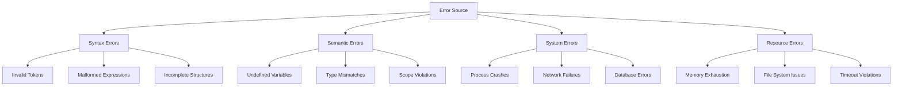
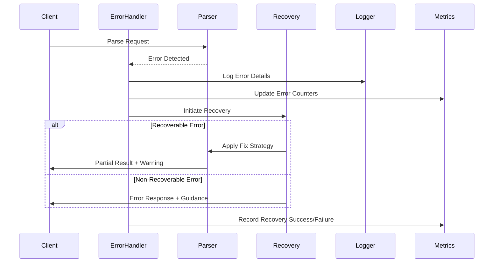
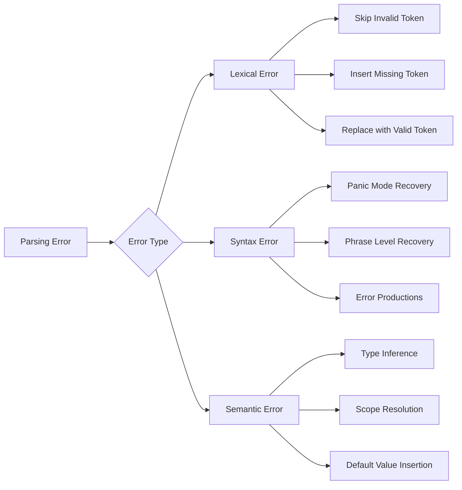
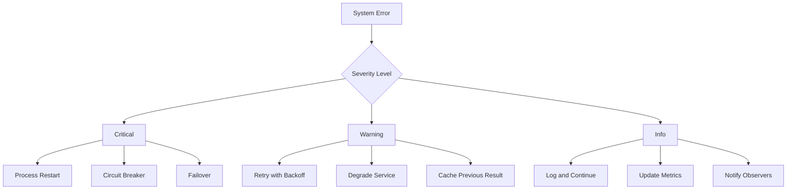
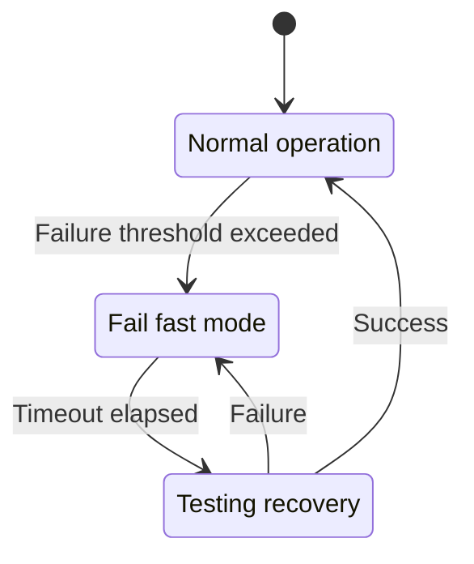
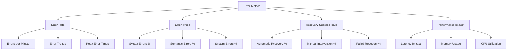
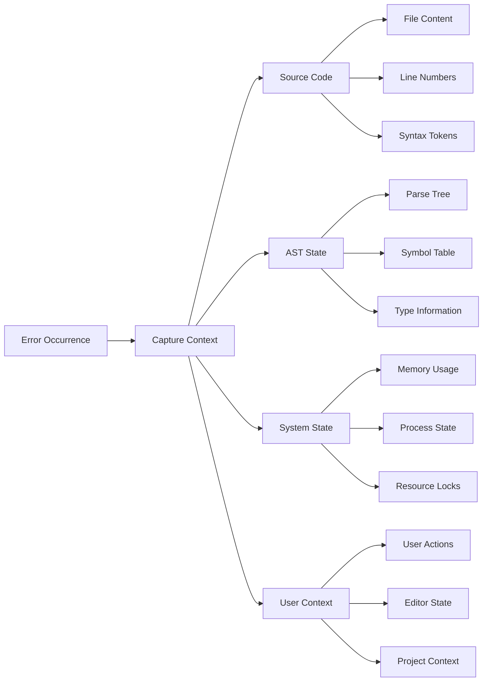
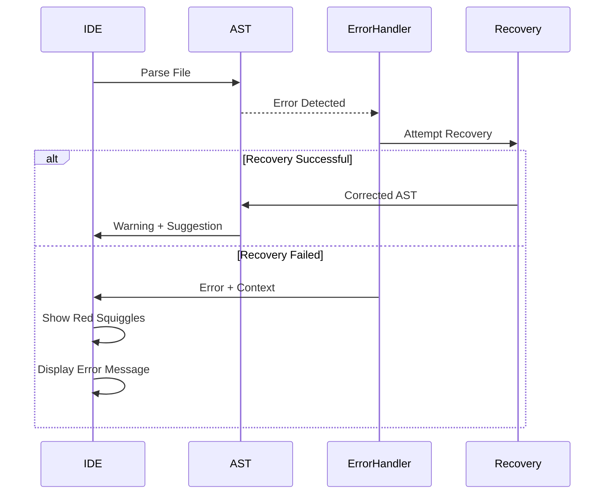
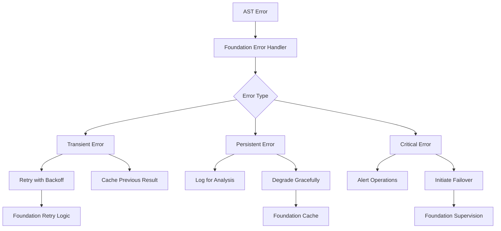

# AST Error Handling & Recovery System

## Executive Summary

This document outlines the comprehensive error handling and recovery strategies for the AST layer, ensuring robust operation under various failure scenarios. The design emphasizes graceful degradation, automatic recovery, and detailed error reporting to maintain system stability and developer productivity.

## Error Classification Framework



## Error Recovery Architecture



## Error Types and Recovery Strategies

### 1. Parsing Errors



### 2. System Error Handling



## Error Handling Implementation

### Core Error Types

```elixir
defmodule TideScope.AST.Error do
  @type error_category :: :syntax | :semantic | :system | :resource
  @type severity :: :critical | :warning | :info
  
  @type ast_error :: %{
    category: error_category(),
    severity: severity(),
    message: String.t(),
    location: location(),
    context: map(),
    recovery_hint: String.t() | nil,
    timestamp: DateTime.t()
  }
  
  @type location :: %{
    file: String.t(),
    line: non_neg_integer(),
    column: non_neg_integer(),
    length: non_neg_integer()
  }
end
```

### Error Handler GenServer

```elixir
defmodule TideScope.AST.ErrorHandler do
  use GenServer
  alias TideScope.AST.Error
  
  @max_errors_per_minute 100
  @recovery_timeout 5000
  
  def start_link(opts \\ []) do
    GenServer.start_link(__MODULE__, opts, name: __MODULE__)
  end
  
  def handle_error(error, context \\ %{}) do
    GenServer.call(__MODULE__, {:handle_error, error, context})
  end
  
  def init(_opts) do
    state = %{
      error_count: 0,
      last_reset: System.monotonic_time(:second),
      circuit_breaker: :closed,
      recovery_strategies: load_recovery_strategies()
    }
    {:ok, state}
  end
  
  def handle_call({:handle_error, error, context}, _from, state) do
    {response, new_state} = process_error(error, context, state)
    {:reply, response, new_state}
  end
  
  defp process_error(error, context, state) do
    state = update_error_metrics(state)
    
    case should_handle_error?(error, state) do
      true ->
        recovery_result = attempt_recovery(error, context, state)
        {recovery_result, state}
      false ->
        {{:error, :rate_limited}, state}
    end
  end
end
```

### Recovery Strategy Implementation

```elixir
defmodule TideScope.AST.RecoveryStrategy do
  alias TideScope.AST.Error
  
  @behaviour TideScope.AST.RecoveryBehaviour
  
  def recover_syntax_error(%Error{category: :syntax} = error, context) do
    case error.message do
      "unexpected token" <> _ ->
        attempt_token_recovery(error, context)
      "missing" <> _ ->
        attempt_insertion_recovery(error, context)
      _ ->
        attempt_panic_mode_recovery(error, context)
    end
  end
  
  def recover_semantic_error(%Error{category: :semantic} = error, context) do
    case error.message do
      "undefined variable" <> _ ->
        suggest_variable_candidates(error, context)
      "type mismatch" <> _ ->
        attempt_type_coercion(error, context)
      _ ->
        {:error, :no_recovery_available}
    end
  end
  
  defp attempt_token_recovery(error, context) do
    # Implementation for token-level recovery
    case find_synchronization_point(error.location, context) do
      {:ok, sync_point} ->
        {:partial_recovery, sync_point}
      :error ->
        {:error, :no_sync_point}
    end
  end
end
```

## Circuit Breaker Pattern



### Circuit Breaker Implementation

```elixir
defmodule TideScope.AST.CircuitBreaker do
  use GenServer
  
  @failure_threshold 5
  @timeout_duration 30_000
  @half_open_timeout 10_000
  
  defstruct state: :closed,
            failure_count: 0,
            last_failure_time: nil,
            success_count: 0
  
  def call(module, function, args, timeout \\ 5000) do
    case get_state() do
      :closed -> execute_call(module, function, args, timeout)
      :open -> {:error, :circuit_open}
      :half_open -> test_call(module, function, args, timeout)
    end
  end
  
  defp execute_call(module, function, args, timeout) do
    try do
      result = apply(module, function, args)
      record_success()
      {:ok, result}
    catch
      kind, error ->
        record_failure()
        {:error, {kind, error}}
    end
  end
end
```

## Error Reporting and Metrics

### Error Metrics Dashboard



### Telemetry Integration

```elixir
defmodule TideScope.AST.ErrorTelemetry do
  def handle_event([:tide_scope, :ast, :error], measurements, metadata, _config) do
    %{duration: duration, memory: memory} = measurements
    %{error: error, context: context} = metadata
    
    # Record error metrics
    :telemetry.execute(
      [:tide_scope, :ast, :error, :recorded],
      %{count: 1, duration: duration},
      %{
        category: error.category,
        severity: error.severity,
        recovery_attempted: Map.has_key?(context, :recovery_strategy)
      }
    )
    
    # Update dashboards
    TideScope.Metrics.increment("ast.errors.total", tags: [
      category: error.category,
      severity: error.severity
    ])
  end
end
```

## Error Context Preservation

### Context Capture Strategy



### Context Storage Implementation

```elixir
defmodule TideScope.AST.ErrorContext do
  @type context :: %{
    source: source_context(),
    ast: ast_context(),
    system: system_context(),
    user: user_context()
  }
  
  @type source_context :: %{
    file_path: String.t(),
    content: String.t(),
    cursor_position: {integer(), integer()},
    selection: {integer(), integer()} | nil
  }
  
  def capture_context(error_location, additional_context \\ %{}) do
    %{
      source: capture_source_context(error_location),
      ast: capture_ast_context(error_location),
      system: capture_system_context(),
      user: capture_user_context(),
      additional: additional_context,
      timestamp: DateTime.utc_now()
    }
  end
  
  defp capture_source_context(location) do
    %{
      file_path: location.file,
      content: read_file_content(location.file),
      line_content: get_line_content(location.file, location.line),
      surrounding_lines: get_surrounding_lines(location.file, location.line, 3)
    }
  end
end
```

## Development Error Handling

### IDE Integration for Error Display



### Error Message Quality

```elixir
defmodule TideScope.AST.ErrorFormatter do
  def format_error(%Error{} = error, context) do
    base_message = format_base_message(error)
    location_info = format_location(error.location)
    suggestion = generate_suggestion(error, context)
    
    """
    #{base_message}
    
    #{location_info}
    
    #{format_code_snippet(error.location, context)}
    
    #{suggestion}
    """
  end
  
  defp generate_suggestion(error, context) do
    case error.category do
      :syntax ->
        generate_syntax_suggestion(error, context)
      :semantic ->
        generate_semantic_suggestion(error, context)
      _ ->
        "Please check the documentation for more information."
    end
  end
  
  defp generate_syntax_suggestion(error, context) do
    cond do
      String.contains?(error.message, "unexpected") ->
        "Try removing or replacing the unexpected token."
      String.contains?(error.message, "missing") ->
        suggest_missing_token(error, context)
      true ->
        "Check the syntax around this location."
    end
  end
end
```

## Quality Metrics and Targets

### Error Handling Performance Targets

| Metric | Target | Measurement |
|--------|--------|-------------|
| Error Detection Time | < 50ms | Time from error occurrence to detection |
| Recovery Attempt Time | < 200ms | Time to attempt automatic recovery |
| Error Reporting Latency | < 100ms | Time to display error to user |
| Recovery Success Rate | > 80% | Percentage of automatically recovered errors |
| False Positive Rate | < 5% | Percentage of incorrectly flagged errors |

### Error Rate Monitoring

```elixir
defmodule TideScope.AST.ErrorMonitor do
  use GenServer
  
  @check_interval 60_000  # 1 minute
  @error_rate_threshold 10  # errors per minute
  
  def start_link(opts \\ []) do
    GenServer.start_link(__MODULE__, opts, name: __MODULE__)
  end
  
  def init(_opts) do
    schedule_check()
    {:ok, %{error_counts: %{}, alerts_sent: MapSet.new()}}
  end
  
  def handle_info(:check_error_rates, state) do
    current_minute = current_minute_bucket()
    error_rate = Map.get(state.error_counts, current_minute, 0)
    
    if error_rate > @error_rate_threshold do
      send_alert_if_needed(error_rate, state)
    end
    
    schedule_check()
    {:noreply, cleanup_old_buckets(state)}
  end
  
  defp send_alert_if_needed(error_rate, state) do
    alert_key = "high_error_rate_#{current_minute_bucket()}"
    
    unless MapSet.member?(state.alerts_sent, alert_key) do
      TideScope.Alerts.send_alert(:high_error_rate, %{
        rate: error_rate,
        threshold: @error_rate_threshold,
        timestamp: DateTime.utc_now()
      })
    end
  end
end
```

## Integration with Foundation Layer

### Error Propagation Strategy



## Implementation Phases

### Phase 1: Core Error Handling (Weeks 1-2)
- Implement basic error types and classification
- Create error handler GenServer
- Develop recovery strategies for common errors
- Integrate with telemetry system

### Phase 2: Advanced Recovery (Weeks 3-4)
- Implement circuit breaker pattern
- Add context capture and preservation
- Develop intelligent error suggestions
- Create error rate monitoring

### Phase 3: Integration & Optimization (Weeks 5-6)
- Integrate with IDE for error display
- Optimize error message quality
- Add performance monitoring
- Conduct comprehensive testing

This error handling system ensures the AST layer remains robust and provides excellent developer experience even when encountering various types of errors and failure scenarios.
