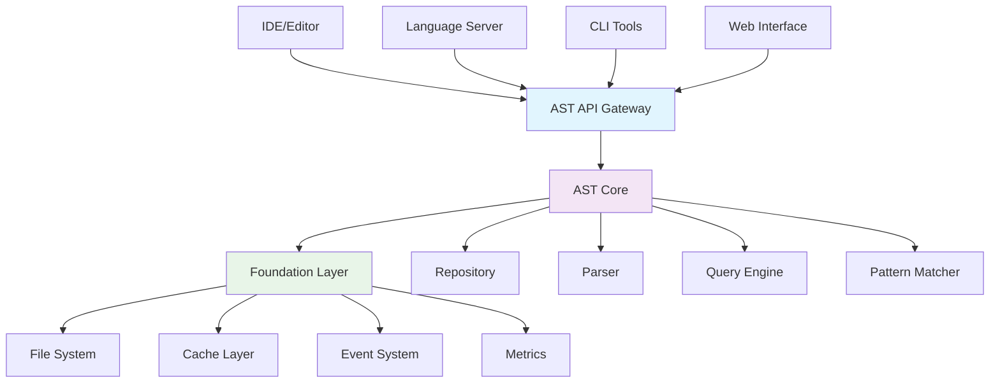
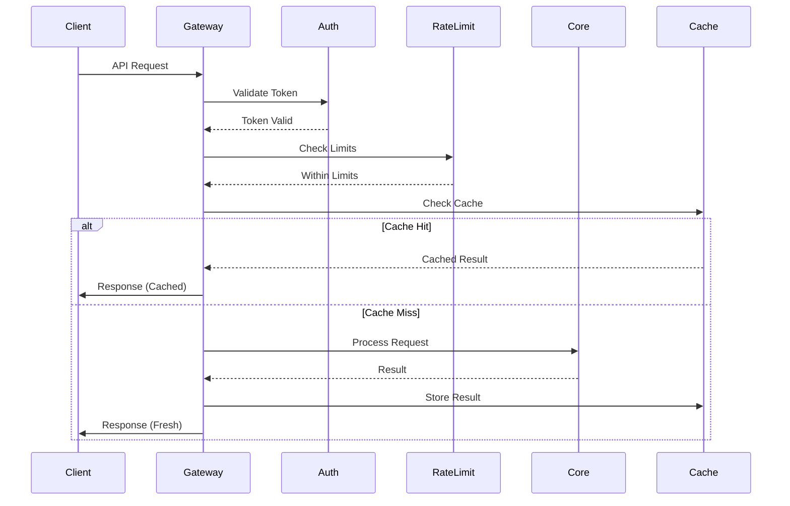
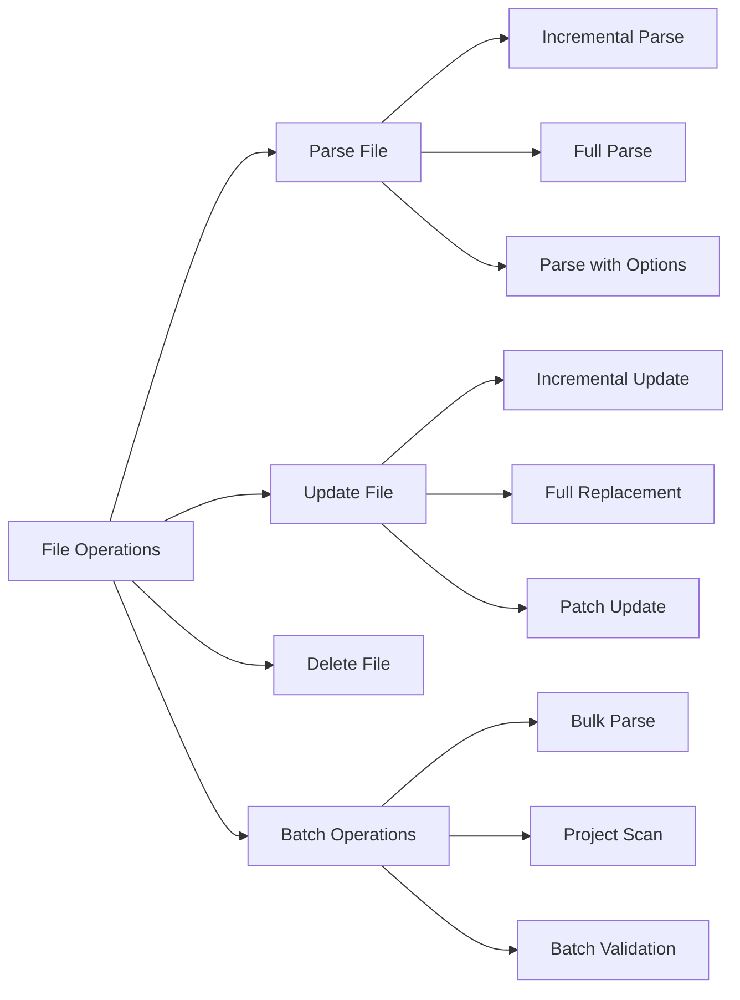
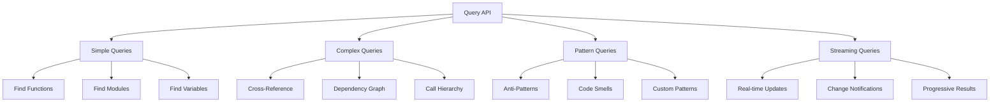
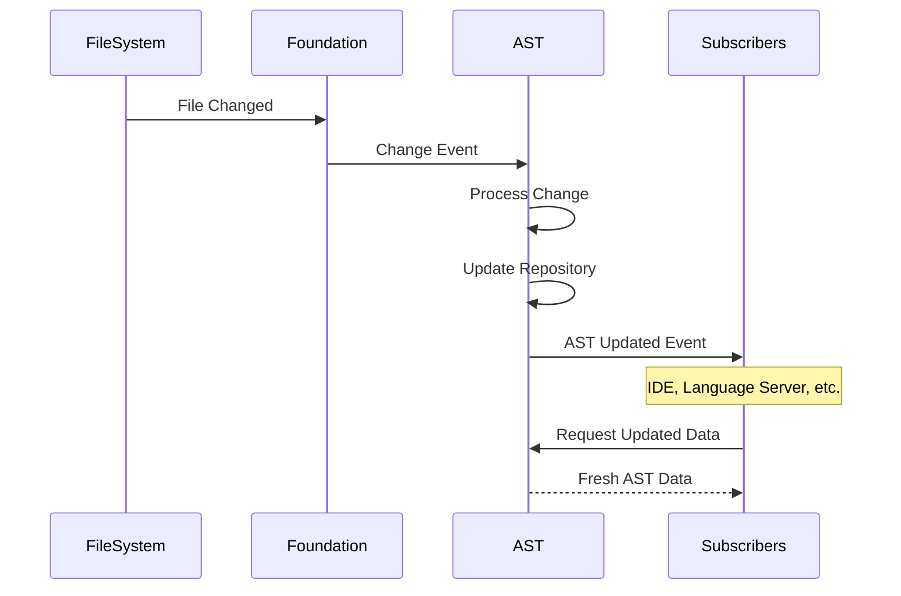
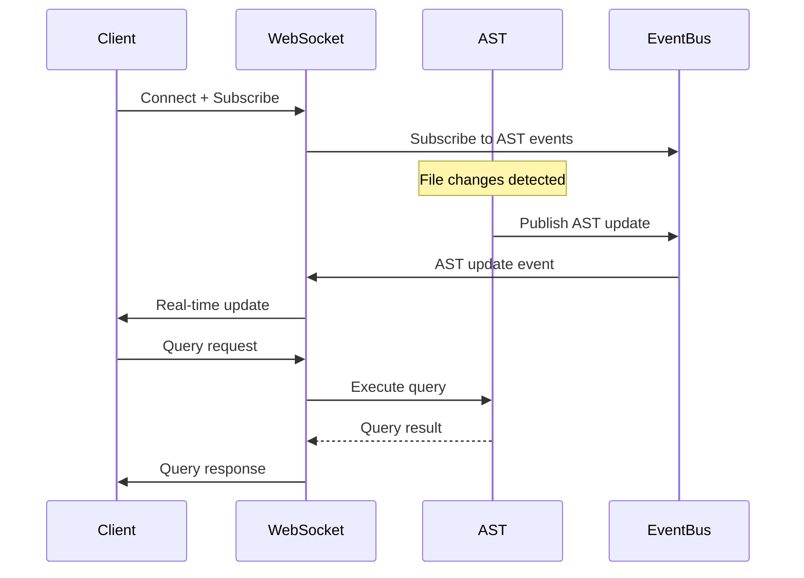
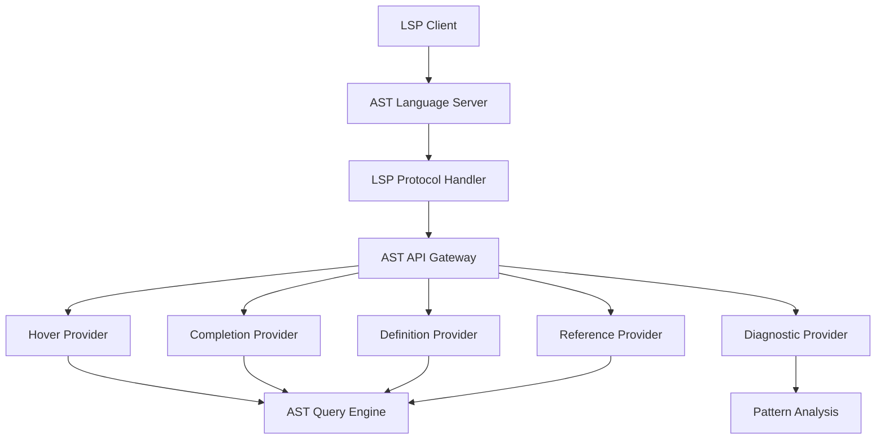
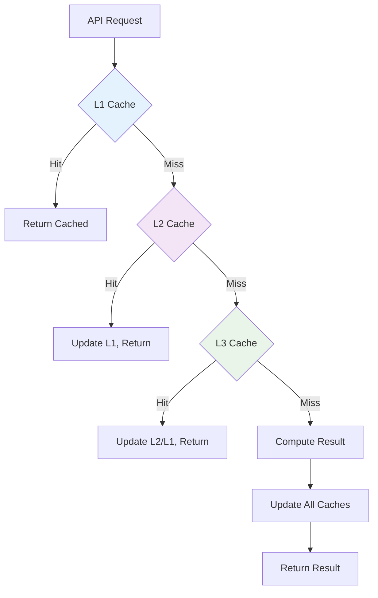

# AST Integration Patterns & API Design

## Executive Summary

This document defines the integration patterns, API design principles, and inter-layer communication strategies for the AST layer. It establishes how the AST layer interfaces with the Foundation layer, IDE components, and external tools while maintaining clean boundaries and efficient data flow.

## Integration Architecture Overview



## API Gateway Design



### API Gateway Implementation

```elixir
defmodule TideScope.AST.Gateway do
  use GenServer
  alias TideScope.AST.{Auth, RateLimit, Cache, Core}
  
  @api_version "v1"
  @default_timeout 30_000
  
  def start_link(opts \\ []) do
    GenServer.start_link(__MODULE__, opts, name: __MODULE__)
  end
  
  def handle_request(request, context \\ %{}) do
    GenServer.call(__MODULE__, {:handle_request, request, context}, @default_timeout)
  end
  
  def init(opts) do
    state = %{
      rate_limiters: %{},
      active_requests: %{},
      metrics: init_metrics(),
      config: Keyword.get(opts, :config, default_config())
    }
    {:ok, state}
  end
  
  def handle_call({:handle_request, request, context}, from, state) do
    request_id = generate_request_id()
    
    Task.start(fn ->
      result = process_request_pipeline(request, context, state)
      GenServer.reply(from, result)
    end)
    
    new_state = track_request(request_id, from, state)
    {:noreply, new_state}
  end
  
  defp process_request_pipeline(request, context, state) do
    with {:ok, request} <- validate_request(request),
         {:ok, context} <- authenticate_request(request, context),
         {:ok, _} <- check_rate_limits(request, context, state),
         {:ok, result} <- execute_request(request, context),
         {:ok, response} <- format_response(result, request) do
      {:ok, response}
    else
      {:error, reason} -> {:error, reason}
    end
  end
end
```

## Core API Endpoints

### 1. File Operations API



```elixir
defmodule TideScope.AST.API.FileOperations do
  @behaviour TideScope.AST.API.Behaviour
  
  @doc """
  Parse a single file and return AST representation
  """
  def parse_file(file_path, opts \\ []) do
    request = %{
      operation: :parse_file,
      file_path: file_path,
      options: %{
        incremental: Keyword.get(opts, :incremental, true),
        include_comments: Keyword.get(opts, :include_comments, false),
        error_recovery: Keyword.get(opts, :error_recovery, true)
      }
    }
    
    TideScope.AST.Gateway.handle_request(request)
  end
  
  @doc """
  Update file content and re-parse affected sections
  """
  def update_file(file_path, changes, opts \\ []) do
    request = %{
      operation: :update_file,
      file_path: file_path,
      changes: changes,
      options: %{
        incremental: Keyword.get(opts, :incremental, true),
        validate: Keyword.get(opts, :validate, true)
      }
    }
    
    TideScope.AST.Gateway.handle_request(request)
  end
  
  @doc """
  Batch parse multiple files
  """
  def batch_parse(file_paths, opts \\ []) do
    request = %{
      operation: :batch_parse,
      file_paths: file_paths,
      options: %{
        parallel: Keyword.get(opts, :parallel, true),
        max_concurrency: Keyword.get(opts, :max_concurrency, 10)
      }
    }
    
    TideScope.AST.Gateway.handle_request(request)
  end
end
```

### 2. Query API



```elixir
defmodule TideScope.AST.API.Query do
  @type query_result :: {:ok, [result()]} | {:error, term()}
  @type query_options :: %{
    limit: pos_integer(),
    offset: non_neg_integer(),
    timeout: pos_integer(),
    include_metadata: boolean()
  }
  
  @doc """
  Execute a structured query against the AST
  """
  def execute_query(query, opts \\ %{}) do
    request = %{
      operation: :execute_query,
      query: normalize_query(query),
      options: merge_default_options(opts)
    }
    
    TideScope.AST.Gateway.handle_request(request)
  end
  
  @doc """
  Find all functions matching criteria
  """
  def find_functions(criteria, opts \\ %{}) do
    query = %{
      type: :function,
      filters: criteria,
      return_format: :detailed
    }
    
    execute_query(query, opts)
  end
  
  @doc """
  Find references to a symbol
  """
  def find_references(symbol, scope \\ :project, opts \\ %{}) do
    query = %{
      type: :references,
      symbol: symbol,
      scope: scope,
      include_definitions: Keyword.get(opts, :include_definitions, false)
    }
    
    execute_query(query, opts)
  end
  
  @doc """
  Stream query results for large result sets
  """
  def stream_query(query, opts \\ %{}) do
    request = %{
      operation: :stream_query,
      query: normalize_query(query),
      options: Map.merge(opts, %{streaming: true})
    }
    
    TideScope.AST.Gateway.handle_request(request)
  end
end
```

### 3. Pattern Analysis API

```elixir
defmodule TideScope.AST.API.PatternAnalysis do
  @doc """
  Analyze code for known patterns and anti-patterns
  """
  def analyze_patterns(file_path_or_content, opts \\ []) do
    request = %{
      operation: :analyze_patterns,
      target: file_path_or_content,
      options: %{
        pattern_types: Keyword.get(opts, :pattern_types, [:all]),
        severity_threshold: Keyword.get(opts, :severity_threshold, :info),
        custom_patterns: Keyword.get(opts, :custom_patterns, [])
      }
    }
    
    TideScope.AST.Gateway.handle_request(request)
  end
  
  @doc """
  Register a custom pattern for analysis
  """
  def register_pattern(pattern_definition) do
    request = %{
      operation: :register_pattern,
      pattern: validate_pattern(pattern_definition)
    }
    
    TideScope.AST.Gateway.handle_request(request)
  end
  
  @doc """
  Get pattern analysis statistics for a project
  """
  def get_pattern_statistics(project_path, opts \\ []) do
    request = %{
      operation: :pattern_statistics,
      project_path: project_path,
      options: %{
        group_by: Keyword.get(opts, :group_by, :pattern_type),
        time_range: Keyword.get(opts, :time_range, :all_time)
      }
    }
    
    TideScope.AST.Gateway.handle_request(request)
  end
end
```

## Event-Driven Integration



### Event System Integration

```elixir
defmodule TideScope.AST.EventIntegration do
  use GenServer
  alias TideScope.Foundation.EventBus
  
  @subscribed_events [
    "file.created",
    "file.updated", 
    "file.deleted",
    "project.opened",
    "project.closed"
  ]
  
  def start_link(opts \\ []) do
    GenServer.start_link(__MODULE__, opts, name: __MODULE__)
  end
  
  def init(_opts) do
    # Subscribe to Foundation events
    Enum.each(@subscribed_events, &EventBus.subscribe/1)
    
    {:ok, %{
      event_handlers: load_event_handlers(),
      processing_queue: :queue.new(),
      metrics: init_event_metrics()
    }}
  end
  
  def handle_info({:event, event_type, event_data}, state) do
    handle_foundation_event(event_type, event_data, state)
  end
  
  defp handle_foundation_event("file.updated", %{path: path, changes: changes}, state) do
    # Process file update incrementally
    Task.start(fn ->
      case TideScope.AST.Core.update_file_incremental(path, changes) do
        {:ok, updated_ast} ->
          publish_ast_event("ast.file.updated", %{
            path: path,
            ast: updated_ast,
            timestamp: DateTime.utc_now()
          })
        {:error, reason} ->
          publish_ast_event("ast.file.error", %{
            path: path,
            reason: reason,
            timestamp: DateTime.utc_now()
          })
      end
    end)
    
    {:noreply, state}
  end
  
  defp publish_ast_event(event_type, event_data) do
    EventBus.publish(event_type, event_data)
  end
end
```

## WebSocket API for Real-time Updates



### WebSocket Handler Implementation

```elixir
defmodule TideScope.AST.WebSocketHandler do
  @behaviour :cowboy_websocket
  
  def init(req, state) do
    {:cowboy_websocket, req, state}
  end
  
  def websocket_init(state) do
    # Subscribe to relevant AST events
    TideScope.AST.EventBus.subscribe("ast.*")
    
    {:ok, %{
      subscriptions: MapSet.new(),
      client_id: generate_client_id(),
      last_ping: System.monotonic_time(:millisecond)
    }}
  end
  
  def websocket_handle({:text, message}, state) do
    case decode_message(message) do
      {:ok, %{"type" => "subscribe", "events" => events}} ->
        handle_subscription(events, state)
      
      {:ok, %{"type" => "query", "query" => query, "id" => request_id}} ->
        handle_query(query, request_id, state)
      
      {:ok, %{"type" => "ping"}} ->
        {:reply, {:text, encode_message(%{"type" => "pong"})}, state}
      
      {:error, reason} ->
        error_response = encode_message(%{"type" => "error", "reason" => reason})
        {:reply, {:text, error_response}, state}
    end
  end
  
  def websocket_info({:ast_event, event_type, event_data}, state) do
    if should_send_event?(event_type, state.subscriptions) do
      message = encode_message(%{
        "type" => "event",
        "event_type" => event_type,
        "data" => event_data,
        "timestamp" => DateTime.utc_now()
      })
      {:reply, {:text, message}, state}
    else
      {:ok, state}
    end
  end
  
  defp handle_query(query, request_id, state) do
    Task.start(fn ->
      case TideScope.AST.API.Query.execute_query(query) do
        {:ok, result} ->
          response = encode_message(%{
            "type" => "query_result",
            "request_id" => request_id,
            "result" => result
          })
          send(self(), {:send_response, response})
        
        {:error, reason} ->
          error_response = encode_message(%{
            "type" => "query_error",
            "request_id" => request_id,
            "error" => reason
          })
          send(self(), {:send_response, error_response})
      end
    end)
    
    {:ok, state}
  end
end
```

## Language Server Protocol Integration



### LSP Capabilities Implementation

```elixir
defmodule TideScope.AST.LanguageServer do
  use GenLSP
  
  alias TideScope.AST.API.{Query, PatternAnalysis}
  
  def init(_init_arg) do
    {:ok, %{
      documents: %{},
      diagnostics: %{},
      workspace_folders: []
    }}
  end
  
  # Hover provider
  def handle_request("textDocument/hover", %{"textDocument" => %{"uri" => uri}, "position" => position}, state) do
    case get_hover_info(uri, position) do
      {:ok, hover_info} ->
        {:reply, hover_info, state}
      {:error, _reason} ->
        {:reply, nil, state}
    end
  end
  
  # Completion provider
  def handle_request("textDocument/completion", %{"textDocument" => %{"uri" => uri}, "position" => position}, state) do
    case get_completions(uri, position) do
      {:ok, completions} ->
        {:reply, %{"items" => completions}, state}
      {:error, _reason} ->
        {:reply, %{"items" => []}, state}
    end
  end
  
  # Go to definition
  def handle_request("textDocument/definition", %{"textDocument" => %{"uri" => uri}, "position" => position}, state) do
    case find_definition(uri, position) do
      {:ok, location} ->
        {:reply, location, state}
      {:error, _reason} ->
        {:reply, nil, state}
    end
  end
  
  # Find references
  def handle_request("textDocument/references", params, state) do
    %{"textDocument" => %{"uri" => uri}, "position" => position} = params
    
    case find_references(uri, position) do
      {:ok, references} ->
        {:reply, references, state}
      {:error, _reason} ->
        {:reply, [], state}
    end
  end
  
  # Document did change
  def handle_notification("textDocument/didChange", params, state) do
    %{"textDocument" => %{"uri" => uri, "version" => version}, "contentChanges" => changes} = params
    
    # Update AST incrementally
    case update_document_ast(uri, changes) do
      {:ok, _updated_ast} ->
        # Trigger diagnostics update
        Task.start(fn -> publish_diagnostics(uri) end)
      {:error, reason} ->
        Logger.warn("Failed to update AST for #{uri}: #{inspect(reason)}")
    end
    
    {:noreply, update_document_version(state, uri, version)}
  end
  
  defp get_hover_info(uri, position) do
    file_path = uri_to_path(uri)
    
    with {:ok, symbol} <- Query.symbol_at_position(file_path, position),
         {:ok, info} <- Query.get_symbol_info(symbol) do
      hover_content = format_hover_content(info)
      {:ok, %{"contents" => hover_content}}
    end
  end
  
  defp publish_diagnostics(uri) do
    file_path = uri_to_path(uri)
    
    case PatternAnalysis.analyze_patterns(file_path) do
      {:ok, issues} ->
        diagnostics = format_diagnostics(issues)
        GenLSP.notify("textDocument/publishDiagnostics", %{
          "uri" => uri,
          "diagnostics" => diagnostics
        })
      {:error, _reason} ->
        :ok
    end
  end
end
```

## CLI Integration

### Command-Line Interface Design

```elixir
defmodule TideScope.AST.CLI do
  @moduledoc """
  Command-line interface for AST operations
  """
  
  def main(args) do
    {options, commands, _} = OptionParser.parse(args,
      strict: [
        verbose: :boolean,
        output: :string,
        format: :string,
        timeout: :integer
      ],
      aliases: [
        v: :verbose,
        o: :output,
        f: :format,
        t: :timeout
      ]
    )
    
    case commands do
      ["parse", file_path] ->
        handle_parse_command(file_path, options)
      
      ["query", query_string] ->
        handle_query_command(query_string, options)
      
      ["analyze", target] ->
        handle_analyze_command(target, options)
      
      ["validate", project_path] ->
        handle_validate_command(project_path, options)
      
      _ ->
        print_usage()
    end
  end
  
  defp handle_parse_command(file_path, options) do
    case TideScope.AST.API.FileOperations.parse_file(file_path) do
      {:ok, ast} ->
        output_result(ast, options)
        System.halt(0)
      
      {:error, reason} ->
        IO.puts(:stderr, "Parse error: #{inspect(reason)}")
        System.halt(1)
    end
  end
  
  defp handle_query_command(query_string, options) do
    with {:ok, query} <- parse_query_string(query_string),
         {:ok, results} <- TideScope.AST.API.Query.execute_query(query) do
      output_result(results, options)
      System.halt(0)
    else
      {:error, reason} ->
        IO.puts(:stderr, "Query error: #{inspect(reason)}")
        System.halt(1)
    end
  end
  
  defp output_result(data, options) do
    format = Keyword.get(options, :format, "json")
    output_file = Keyword.get(options, :output)
    
    formatted_data = case format do
      "json" -> Jason.encode!(data, pretty: true)
      "yaml" -> YamlElixir.write_to_string!(data)
      "table" -> format_as_table(data)
      _ -> inspect(data, pretty: true)
    end
    
    case output_file do
      nil -> IO.puts(formatted_data)
      file_path -> File.write!(file_path, formatted_data)
    end
  end
end
```

## Performance and Caching Integration

### Multi-Level Caching Strategy



### Cache Integration Implementation

```elixir
defmodule TideScope.AST.CacheIntegration do
  alias TideScope.Foundation.Cache
  
  @l1_ttl 300      # 5 minutes
  @l2_ttl 3600     # 1 hour  
  @l3_ttl 86400    # 24 hours
  
  def cached_operation(cache_key, operation, opts \\ []) do
    ttl = Keyword.get(opts, :ttl, @l1_ttl)
    cache_levels = Keyword.get(opts, :cache_levels, [:l1, :l2, :l3])
    
    case check_cache_levels(cache_key, cache_levels) do
      {:hit, level, result} ->
        update_higher_cache_levels(cache_key, result, level, cache_levels)
        {:ok, result}
      
      :miss ->
        case operation.() do
          {:ok, result} ->
            store_in_all_caches(cache_key, result, cache_levels, ttl)
            {:ok, result}
          error ->
            error
        end
    end
  end
  
  defp check_cache_levels(cache_key, levels) do
    Enum.reduce_while(levels, :miss, fn level, _acc ->
      case Cache.get(cache_key, level) do
        {:ok, result} -> {:halt, {:hit, level, result}}
        :miss -> {:cont, :miss}
      end
    end)
  end
  
  defp store_in_all_caches(cache_key, result, levels, ttl) do
    Enum.each(levels, fn level ->
      level_ttl = get_level_ttl(level, ttl)
      Cache.put(cache_key, result, level, ttl: level_ttl)
    end)
  end
  
  defp get_level_ttl(:l1, _base_ttl), do: @l1_ttl
  defp get_level_ttl(:l2, _base_ttl), do: @l2_ttl
  defp get_level_ttl(:l3, _base_ttl), do: @l3_ttl
end
```

## Quality Metrics and SLA

### API Performance Targets

| Endpoint | Target Latency (p95) | Target Throughput | Cache Hit Rate |
|----------|---------------------|-------------------|----------------|
| Parse File | < 500ms | 100 req/s | 80% |
| Query AST | < 200ms | 500 req/s | 90% |
| Find References | < 300ms | 200 req/s | 85% |
| Pattern Analysis | < 1s | 50 req/s | 70% |

### Integration Health Monitoring

```elixir
defmodule TideScope.AST.IntegrationHealth do
  use GenServer
  
  @health_check_interval 30_000  # 30 seconds
  
  def start_link(opts \\ []) do
    GenServer.start_link(__MODULE__, opts, name: __MODULE__)
  end
  
  def get_health_status() do
    GenServer.call(__MODULE__, :get_health_status)
  end
  
  def init(_opts) do
    schedule_health_check()
    {:ok, %{
      last_check: DateTime.utc_now(),
      status: :unknown,
      component_status: %{}
    }}
  end
  
  def handle_info(:health_check, state) do
    status = perform_health_checks()
    schedule_health_check()
    {:noreply, %{state | status: status, last_check: DateTime.utc_now()}}
  end
  
  defp perform_health_checks() do
    checks = [
      {:foundation_layer, check_foundation_connectivity()},
      {:cache_layer, check_cache_performance()},
      {:event_system, check_event_delivery()},
      {:api_gateway, check_api_responsiveness()}
    ]
    
    failed_checks = Enum.filter(checks, fn {_name, status} -> status != :ok end)
    
    case failed_checks do
      [] -> :healthy
      [_] -> :degraded
      _ -> :unhealthy
    end
  end
end
```

This integration pattern ensures clean separation of concerns while providing efficient and scalable communication between the AST layer and its consumers, maintaining high performance and reliability standards throughout the system.
