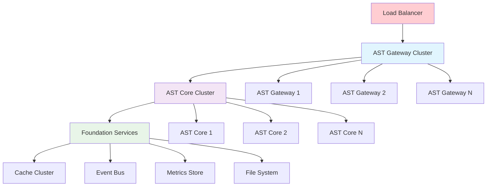
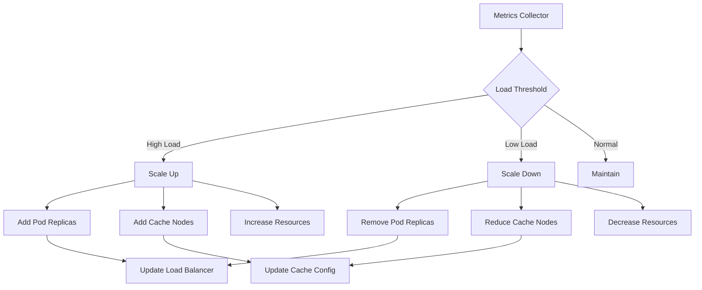
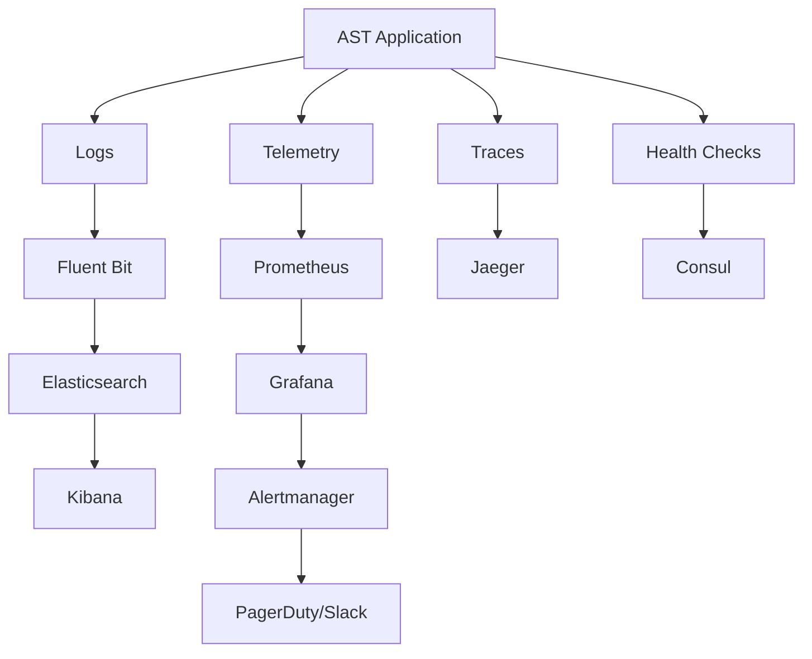
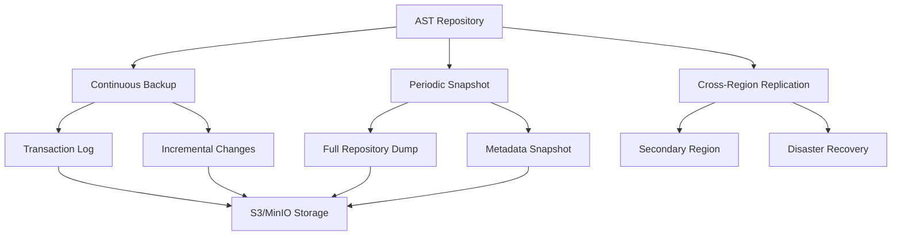

# AST Deployment & Operations Guide

## Executive Summary

This document provides comprehensive guidance for deploying, operating, and maintaining the AST layer in production environments. It covers deployment strategies, monitoring, scaling, backup/recovery, and operational procedures to ensure high availability and performance of the AST system.

## Deployment Architecture



## Container Deployment Strategy

### Docker Configuration

```dockerfile
# AST Layer Dockerfile
FROM elixir:1.15-alpine AS builder

# Install build dependencies
RUN apk add --no-cache \
    git \
    build-base \
    nodejs \
    npm

WORKDIR /app

# Copy mix files
COPY mix.exs mix.lock ./
COPY config config

# Install Elixir dependencies
RUN mix local.hex --force && \
    mix local.rebar --force && \
    mix deps.get

# Copy source code
COPY lib lib
COPY priv priv

# Compile application
RUN mix compile

# Build release
RUN mix release

# Runtime image
FROM alpine:3.18

# Install runtime dependencies
RUN apk add --no-cache \
    bash \
    openssl \
    ncurses-libs \
    libstdc++

# Create application user
RUN adduser -D -s /bin/bash app

WORKDIR /app
USER app

# Copy release from builder
COPY --from=builder --chown=app:app /app/_build/prod/rel/tide_scope_ast ./

# Expose port
EXPOSE 4000

# Health check
HEALTHCHECK --interval=30s --timeout=10s --start-period=60s --retries=3 \
  CMD bin/tide_scope_ast rpc "TideScope.AST.Health.check()"

# Start application
CMD ["bin/tide_scope_ast", "start"]
```

### Kubernetes Deployment

```yaml
# ast-deployment.yaml
apiVersion: apps/v1
kind: Deployment
metadata:
  name: tide-scope-ast
  namespace: tide-scope
  labels:
    app: tide-scope-ast
    version: v1.0.0
spec:
  replicas: 3
  strategy:
    type: RollingUpdate
    rollingUpdate:
      maxUnavailable: 1
      maxSurge: 1
  selector:
    matchLabels:
      app: tide-scope-ast
  template:
    metadata:
      labels:
        app: tide-scope-ast
        version: v1.0.0
    spec:
      containers:
      - name: ast-core
        image: tidescope/ast:v1.0.0
        ports:
        - containerPort: 4000
          name: http
        - containerPort: 4001
          name: metrics
        env:
        - name: POD_NAME
          valueFrom:
            fieldRef:
              fieldPath: metadata.name
        - name: POD_NAMESPACE
          valueFrom:
            fieldRef:
              fieldPath: metadata.namespace
        - name: CLUSTER_NAME
          value: "tide-scope-ast"
        - name: CACHE_NODES
          value: "cache-1:6379,cache-2:6379,cache-3:6379"
        resources:
          requests:
            memory: "512Mi"
            cpu: "250m"
          limits:
            memory: "2Gi"
            cpu: "1000m"
        readinessProbe:
          httpGet:
            path: /health/ready
            port: 4000
          initialDelaySeconds: 30
          periodSeconds: 10
        livenessProbe:
          httpGet:
            path: /health/live
            port: 4000
          initialDelaySeconds: 60
          periodSeconds: 30
        volumeMounts:
        - name: config
          mountPath: /app/config
          readOnly: true
        - name: data
          mountPath: /app/data
      volumes:
      - name: config
        configMap:
          name: ast-config
      - name: data
        persistentVolumeClaim:
          claimName: ast-data
---
apiVersion: v1
kind: Service
metadata:
  name: tide-scope-ast-service
  namespace: tide-scope
spec:
  selector:
    app: tide-scope-ast
  ports:
  - name: http
    port: 80
    targetPort: 4000
  - name: metrics
    port: 4001
    targetPort: 4001
  type: ClusterIP
```

### Configuration Management

```yaml
# ast-configmap.yaml
apiVersion: v1
kind: ConfigMap
metadata:
  name: ast-config
  namespace: tide-scope
data:
  runtime.exs: |
    import Config
    
    # AST Configuration
    config :tide_scope_ast,
      # Cluster configuration
      cluster_name: System.get_env("CLUSTER_NAME", "ast-cluster"),
      node_discovery: :kubernetes,
      
      # Repository configuration
      repository: [
        initial_size: 1000,
        max_size: 50_000,
        gc_threshold: 0.8,
        persistence_interval: 300_000
      ],
      
      # Parser configuration
      parser: [
        max_concurrent_parses: 20,
        parse_timeout: 30_000,
        error_recovery: true
      ],
      
      # Query configuration
      query: [
        default_timeout: 10_000,
        max_results: 1000,
        cache_ttl: 300
      ]
    
    # Telemetry configuration
    config :telemetry_poller,
      measurements: [
        {TideScope.AST.Telemetry, :dispatch_metrics, []}
      ],
      period: 30_000
```

## Scaling Strategies

### Horizontal Scaling



### Auto-scaling Configuration

```yaml
# ast-hpa.yaml
apiVersion: autoscaling/v2
kind: HorizontalPodAutoscaler
metadata:
  name: tide-scope-ast-hpa
  namespace: tide-scope
spec:
  scaleTargetRef:
    apiVersion: apps/v1
    kind: Deployment
    name: tide-scope-ast
  minReplicas: 3
  maxReplicas: 20
  metrics:
  - type: Resource
    resource:
      name: cpu
      target:
        type: Utilization
        averageUtilization: 70
  - type: Resource
    resource:
      name: memory
      target:
        type: Utilization
        averageUtilization: 80
  - type: Pods
    pods:
      metric:
        name: ast_query_response_time
      target:
        type: AverageValue
        averageValue: "500m"
  behavior:
    scaleUp:
      stabilizationWindowSeconds: 300
      policies:
      - type: Pods
        value: 2
        periodSeconds: 60
    scaleDown:
      stabilizationWindowSeconds: 600
      policies:
      - type: Pods
        value: 1
        periodSeconds: 120
```

## Monitoring and Observability

### Monitoring Stack



### Key Metrics Configuration

```elixir
defmodule TideScope.AST.Metrics do
  use TelemetryMetricsPrometheus
  
  @impl true
  def metrics do
    [
      # Application metrics
      counter("tide_scope.ast.requests.total",
        tags: [:endpoint, :method, :status]
      ),
      
      distribution("tide_scope.ast.request.duration",
        unit: {:native, :millisecond},
        tags: [:endpoint, :method]
      ),
      
      gauge("tide_scope.ast.active_connections.count"),
      
      # Repository metrics
      gauge("tide_scope.ast.repository.size",
        tags: [:type]
      ),
      
      gauge("tide_scope.ast.repository.memory_usage",
        unit: :byte
      ),
      
      distribution("tide_scope.ast.parse.duration",
        unit: {:native, :millisecond},
        tags: [:file_type, :size_category]
      ),
      
      # Query metrics
      counter("tide_scope.ast.queries.total",
        tags: [:query_type, :status]
      ),
      
      distribution("tide_scope.ast.query.duration",
        unit: {:native, :millisecond},
        tags: [:query_type]
      ),
      
      # Cache metrics
      counter("tide_scope.ast.cache.hits.total",
        tags: [:cache_level]
      ),
      
      counter("tide_scope.ast.cache.misses.total",
        tags: [:cache_level]
      ),
      
      # Error metrics
      counter("tide_scope.ast.errors.total",
        tags: [:error_type, :severity]
      )
    ]
  end
end
```

### Grafana Dashboard Configuration

```json
{
  "dashboard": {
    "title": "TideScope AST Monitoring",
    "panels": [
      {
        "title": "Request Rate",
        "type": "graph",
        "targets": [
          {
            "expr": "rate(tide_scope_ast_requests_total[5m])",
            "legendFormat": "{{endpoint}}"
          }
        ]
      },
      {
        "title": "Response Time",
        "type": "graph",
        "targets": [
          {
            "expr": "histogram_quantile(0.95, rate(tide_scope_ast_request_duration_bucket[5m]))",
            "legendFormat": "95th percentile"
          },
          {
            "expr": "histogram_quantile(0.50, rate(tide_scope_ast_request_duration_bucket[5m]))",
            "legendFormat": "50th percentile"
          }
        ]
      },
      {
        "title": "Repository Size",
        "type": "singlestat",
        "targets": [
          {
            "expr": "tide_scope_ast_repository_size",
            "legendFormat": "{{type}}"
          }
        ]
      },
      {
        "title": "Error Rate",
        "type": "graph",
        "targets": [
          {
            "expr": "rate(tide_scope_ast_errors_total[5m])",
            "legendFormat": "{{error_type}}"
          }
        ]
      },
      {
        "title": "Cache Hit Rate",
        "type": "graph",
        "targets": [
          {
            "expr": "rate(tide_scope_ast_cache_hits_total[5m]) / (rate(tide_scope_ast_cache_hits_total[5m]) + rate(tide_scope_ast_cache_misses_total[5m]))",
            "legendFormat": "{{cache_level}}"
          }
        ]
      }
    ]
  }
}
```

## Backup and Recovery

### Data Backup Strategy



### Backup Implementation

```elixir
defmodule TideScope.AST.Backup do
  use GenServer
  
  @backup_interval 3_600_000  # 1 hour
  @retention_days 30
  
  def start_link(opts \\ []) do
    GenServer.start_link(__MODULE__, opts, name: __MODULE__)
  end
  
  def create_backup(type \\ :incremental) do
    GenServer.call(__MODULE__, {:create_backup, type}, 60_000)
  end
  
  def restore_from_backup(backup_id) do
    GenServer.call(__MODULE__, {:restore_backup, backup_id}, 300_000)
  end
  
  def init(opts) do
    schedule_backup()
    
    state = %{
      backup_storage: Keyword.get(opts, :storage, :s3),
      backup_bucket: Keyword.get(opts, :bucket, "tidescope-ast-backups"),
      last_backup: nil,
      backup_history: []
    }
    
    {:ok, state}
  end
  
  def handle_info(:scheduled_backup, state) do
    case create_incremental_backup(state) do
      {:ok, backup_info} ->
        Logger.info("Backup completed: #{backup_info.id}")
        new_state = update_backup_history(state, backup_info)
        schedule_backup()
        {:noreply, new_state}
      
      {:error, reason} ->
        Logger.error("Backup failed: #{inspect(reason)}")
        schedule_backup()
        {:noreply, state}
    end
  end
  
  def handle_call({:create_backup, type}, _from, state) do
    result = case type do
      :full -> create_full_backup(state)
      :incremental -> create_incremental_backup(state)
    end
    
    case result do
      {:ok, backup_info} ->
        new_state = update_backup_history(state, backup_info)
        {:reply, {:ok, backup_info}, new_state}
      error ->
        {:reply, error, state}
    end
  end
  
  defp create_full_backup(state) do
    backup_id = generate_backup_id("full")
    
    with {:ok, repository_data} <- export_repository_data(),
         {:ok, metadata} <- export_metadata(),
         {:ok, _} <- upload_backup(backup_id, repository_data, metadata, state) do
      {:ok, %{
        id: backup_id,
        type: :full,
        size: byte_size(repository_data),
        timestamp: DateTime.utc_now()
      }}
    end
  end
  
  defp create_incremental_backup(state) do
    backup_id = generate_backup_id("incremental")
    last_backup_time = get_last_backup_time(state)
    
    with {:ok, changes} <- export_changes_since(last_backup_time),
         {:ok, metadata} <- export_metadata(),
         {:ok, _} <- upload_backup(backup_id, changes, metadata, state) do
      {:ok, %{
        id: backup_id,
        type: :incremental,
        size: byte_size(changes),
        timestamp: DateTime.utc_now(),
        since: last_backup_time
      }}
    end
  end
end
```

### Disaster Recovery Plan

```elixir
defmodule TideScope.AST.DisasterRecovery do
  @moduledoc """
  Disaster recovery procedures for AST layer
  """
  
  def emergency_recovery(backup_id) do
    with {:ok, _} <- validate_backup(backup_id),
         {:ok, _} <- stop_all_services(),
         {:ok, _} <- clear_corrupted_data(),
         {:ok, _} <- restore_from_backup(backup_id),
         {:ok, _} <- validate_restored_data(),
         {:ok, _} <- restart_services() do
      {:ok, :recovery_complete}
    else
      {:error, reason} ->
        Logger.critical("Recovery failed: #{inspect(reason)}")
        {:error, reason}
    end
  end
  
  def failover_to_secondary_region() do
    with {:ok, _} <- update_dns_records(),
         {:ok, _} <- activate_secondary_cluster(),
         {:ok, _} <- sync_latest_changes(),
         {:ok, _} <- validate_secondary_health() do
      {:ok, :failover_complete}
    else
      {:error, reason} ->
        Logger.critical("Failover failed: #{inspect(reason)}")
        {:error, reason}
    end
  end
end
```

## Security Configuration

### Network Security

```yaml
# ast-network-policy.yaml
apiVersion: networking.k8s.io/v1
kind: NetworkPolicy
metadata:
  name: ast-network-policy
  namespace: tide-scope
spec:
  podSelector:
    matchLabels:
      app: tide-scope-ast
  policyTypes:
  - Ingress
  - Egress
  ingress:
  - from:
    - namespaceSelector:
        matchLabels:
          name: tide-scope
    - podSelector:
        matchLabels:
          app: tide-scope-gateway
    ports:
    - protocol: TCP
      port: 4000
  egress:
  - to:
    - namespaceSelector:
        matchLabels:
          name: tide-scope
    - podSelector:
        matchLabels:
          app: tide-scope-foundation
    ports:
    - protocol: TCP
      port: 6379  # Cache
    - protocol: TCP
      port: 5432  # Database
```

### RBAC Configuration

```yaml
# ast-rbac.yaml
apiVersion: v1
kind: ServiceAccount
metadata:
  name: tide-scope-ast
  namespace: tide-scope
---
apiVersion: rbac.authorization.k8s.io/v1
kind: Role
metadata:
  name: tide-scope-ast-role
  namespace: tide-scope
rules:
- apiGroups: [""]
  resources: ["pods", "services", "endpoints"]
  verbs: ["get", "list", "watch"]
- apiGroups: [""]
  resources: ["configmaps"]
  verbs: ["get", "list", "watch"]
---
apiVersion: rbac.authorization.k8s.io/v1
kind: RoleBinding
metadata:
  name: tide-scope-ast-rolebinding
  namespace: tide-scope
subjects:
- kind: ServiceAccount
  name: tide-scope-ast
  namespace: tide-scope
roleRef:
  kind: Role
  name: tide-scope-ast-role
  apiGroup: rbac.authorization.k8s.io
```

## Operational Procedures

### Health Check Implementation

```elixir
defmodule TideScope.AST.Health do
  @doc """
  Comprehensive health check for AST services
  """
  def check() do
    checks = [
      {:repository, check_repository_health()},
      {:parser, check_parser_health()},
      {:query_engine, check_query_engine_health()},
      {:cache, check_cache_health()},
      {:foundation, check_foundation_health()}
    ]
    
    failed_checks = Enum.filter(checks, fn {_name, status} -> status != :ok end)
    
    case failed_checks do
      [] -> 
        {:ok, %{status: :healthy, timestamp: DateTime.utc_now()}}
      failures ->
        {:error, %{
          status: :unhealthy,
          failures: failures,
          timestamp: DateTime.utc_now()
        }}
    end
  end
  
  def check_repository_health() do
    try do
      case TideScope.AST.Repository.stats() do
        {:ok, stats} when stats.memory_usage < 0.9 -> :ok
        {:ok, _} -> {:error, :high_memory_usage}
        {:error, reason} -> {:error, reason}
      end
    catch
      _, _ -> {:error, :repository_unavailable}
    end
  end
  
  def check_parser_health() do
    test_code = "defmodule Test do\nend"
    
    case TideScope.AST.Parser.parse_string(test_code) do
      {:ok, _ast} -> :ok
      {:error, reason} -> {:error, reason}
    end
  end
end
```

### Deployment Checklist

```markdown
## Pre-Deployment Checklist

### Environment Preparation
- [ ] Verify Kubernetes cluster is ready
- [ ] Confirm resource quotas are sufficient
- [ ] Validate network policies are in place
- [ ] Check secrets and ConfigMaps are created

### Application Readiness
- [ ] Application image is built and pushed
- [ ] Configuration files are updated
- [ ] Database migrations are prepared
- [ ] Health checks are implemented

### Dependencies
- [ ] Foundation services are running
- [ ] Cache cluster is available
- [ ] Event bus is operational
- [ ] Monitoring stack is ready

### Safety Measures
- [ ] Backup strategy is tested
- [ ] Rollback plan is documented
- [ ] Alert rules are configured
- [ ] Emergency contacts are notified

## Post-Deployment Verification

### Functional Tests
- [ ] Health checks are passing
- [ ] API endpoints respond correctly
- [ ] WebSocket connections work
- [ ] File parsing is functional

### Performance Tests
- [ ] Response times are within SLA
- [ ] Throughput meets requirements
- [ ] Resource usage is normal
- [ ] Cache hit rates are optimal

### Integration Tests
- [ ] Foundation layer integration works
- [ ] Event propagation is functional
- [ ] Metrics are being collected
- [ ] Logs are being generated
```

## Troubleshooting Guide

### Common Issues and Solutions

```elixir
defmodule TideScope.AST.Troubleshooting do
  @doc """
  Common troubleshooting procedures
  """
  
  def diagnose_high_memory_usage() do
    """
    High Memory Usage Diagnosis:
    
    1. Check repository size:
       TideScope.AST.Repository.stats()
    
    2. Identify large files:
       TideScope.AST.Repository.largest_files(10)
    
    3. Check for memory leaks:
       :recon.proc_count(:memory, 10)
    
    4. Force garbage collection:
       TideScope.AST.Repository.gc()
    """
  end
  
  def diagnose_slow_queries() do
    """
    Slow Query Diagnosis:
    
    1. Check query cache hit rate:
       TideScope.AST.Cache.stats()
    
    2. Identify slow queries:
       TideScope.AST.Query.slow_queries(100)
    
    3. Analyze query patterns:
       TideScope.AST.Query.query_patterns()
    
    4. Optimize query index:
       TideScope.AST.Query.rebuild_index()
    """
  end
  
  def diagnose_parse_failures() do
    """
    Parse Failure Diagnosis:
    
    1. Check error logs:
       TideScope.AST.Logger.recent_errors()
    
    2. Validate file encoding:
       TideScope.AST.Parser.validate_encoding(file_path)
    
    3. Test parser on subset:
       TideScope.AST.Parser.test_parse(sample_code)
    
    4. Check syntax errors:
       TideScope.AST.Parser.syntax_check(file_path)
    """
  end
end
```

This comprehensive deployment and operations guide ensures the AST layer can be reliably deployed, monitored, and maintained in production environments with high availability and performance standards.
