# ElixirScope Foundation Layer - Services Deep Dive

## Overview

The Foundation layer's service architecture represents the heart of ElixirScope's reliability and concurrency model. This document provides an in-depth analysis of the GenServer-based services, their state management patterns, and inter-service communication protocols.

## Table of Contents

1. [Service Architecture Overview](#service-architecture-overview)
2. [ConfigServer Deep Dive](#configserver-deep-dive)
3. [EventStore Deep Dive](#eventstore-deep-dive)
4. [TelemetryService Deep Dive](#telemetryservice-deep-dive)
5. [Inter-Service Communication](#inter-service-communication)
6. [State Management Patterns](#state-management-patterns)
7. [Concurrency Patterns](#concurrency-patterns)

## Service Architecture Overview

### Service Hierarchy Diagram

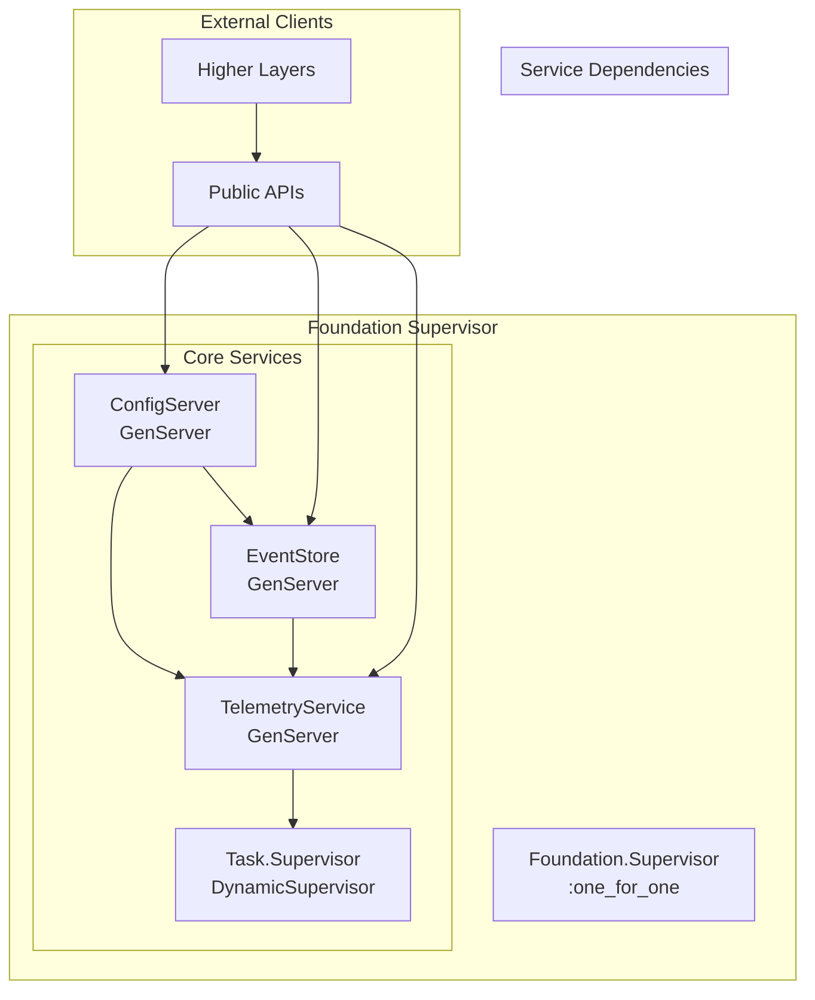

### Service Characteristics Matrix

| Service | Type | Restart Strategy | State Persistence | Concurrency Model |
|---------|------|------------------|-------------------|-------------------|
| ConfigServer | GenServer | :permanent | In-memory + Events | Synchronous reads, Async notifications |
| EventStore | GenServer | :permanent | In-memory buffer | Async writes, Sync queries |
| TelemetryService | GenServer | :permanent | In-memory metrics | Async collection, Periodic aggregation |
| TaskSupervisor | DynamicSupervisor | :permanent | Stateless | Dynamic task spawning |

## ConfigServer Deep Dive

### State Machine Diagram

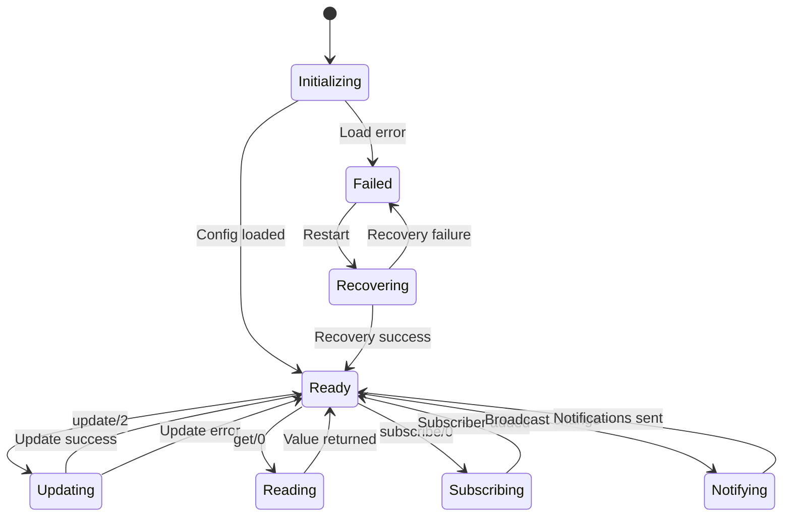

### ConfigServer State Structure

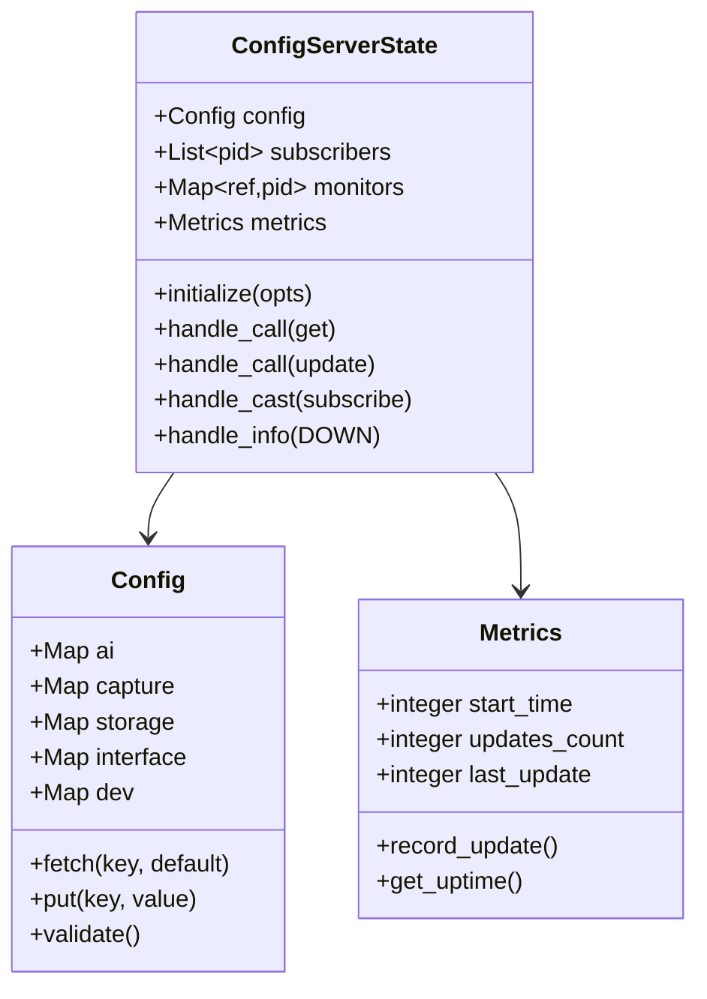

### Configuration Flow Diagram

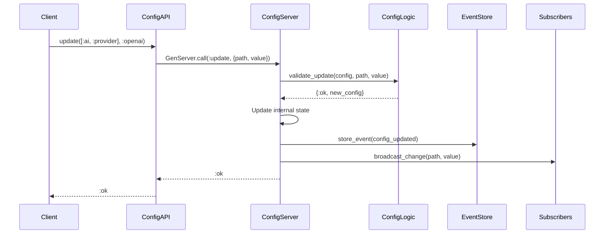

## EventStore Deep Dive

### Event Storage Architecture

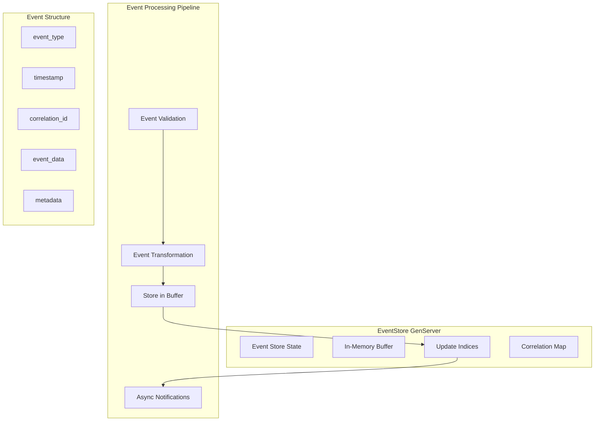

### Event Lifecycle State Machine

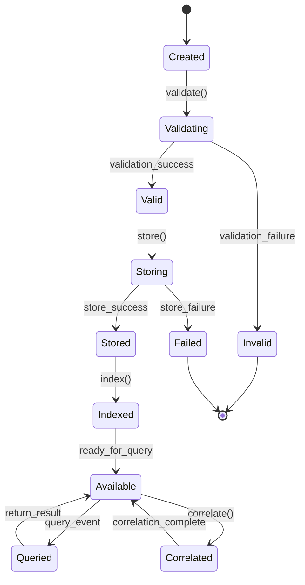

## TelemetryService Deep Dive

### Telemetry Data Flow

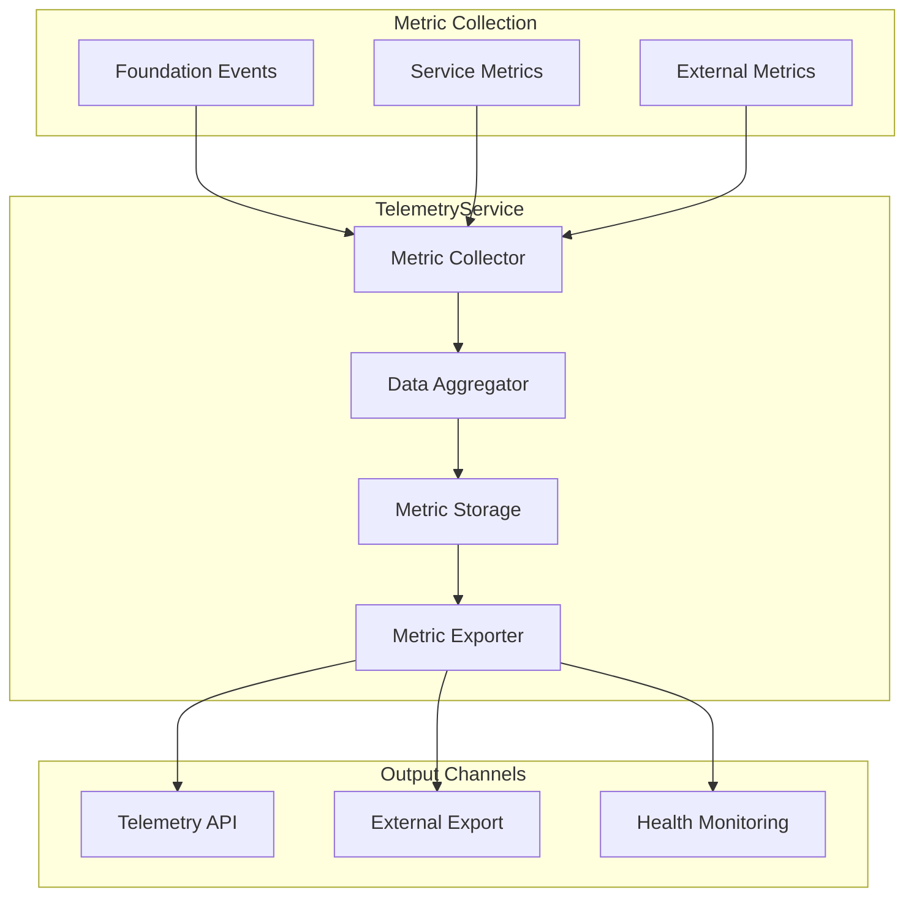

### Metric Aggregation Pipeline

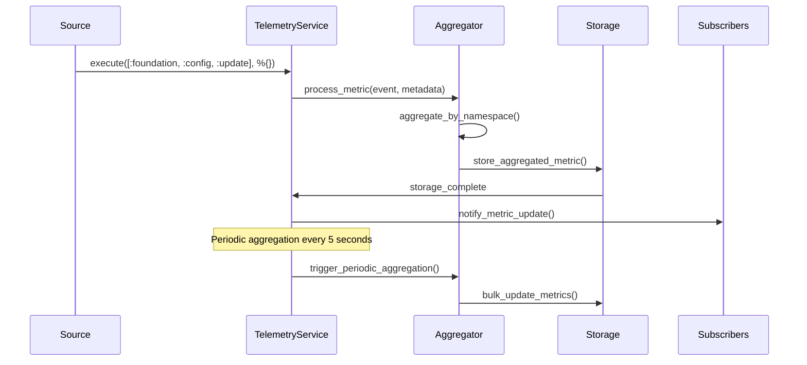

## Inter-Service Communication

### Service Communication Patterns

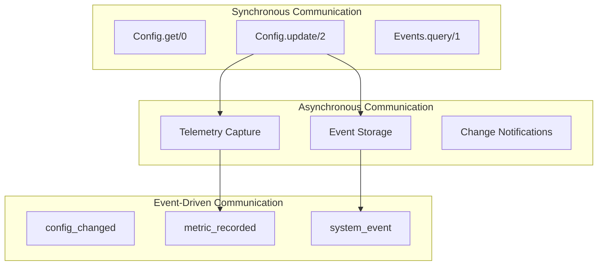

### Cross-Service Dependencies

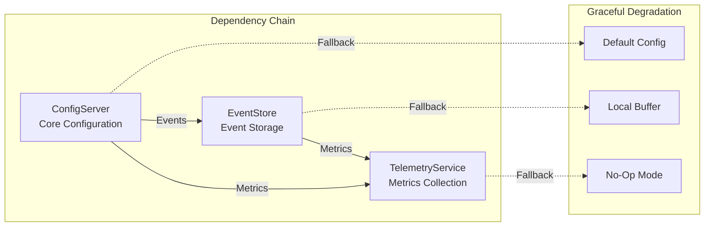

## State Management Patterns

### State Consistency Model

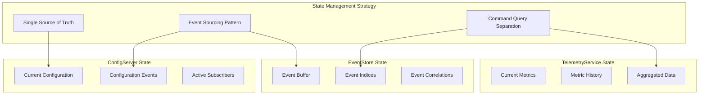

## Concurrency Patterns

### Concurrency Safety Mechanisms

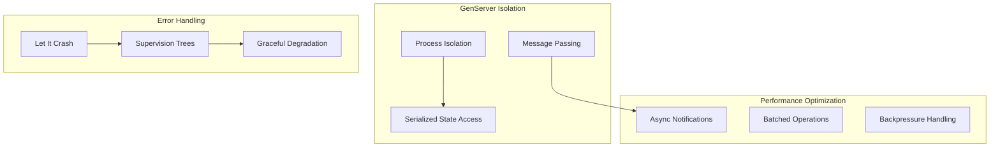

### Performance Characteristics

| Operation | Latency | Throughput | Scalability | Notes |
|-----------|---------|------------|-------------|--------|
| Config.get/0 | ~10-50μs | >10K ops/sec | Linear | Cached in GenServer state |
| Config.update/2 | ~100-500μs | ~1K ops/sec | Limited | Synchronous with validation |
| Events.store/1 | ~50-200μs | >5K ops/sec | Linear | Async with batching |
| Telemetry.execute/3 | ~20-100μs | >8K ops/sec | Linear | Fire-and-forget pattern |

## Best Practices and Recommendations

### Service Design Principles

1. **Single Responsibility**: Each service has a clearly defined purpose
2. **Fail Fast**: Early validation and explicit error handling
3. **Graceful Degradation**: Services continue operating when dependencies fail
4. **Observable Operations**: Comprehensive telemetry and logging
5. **Resource Management**: Proper cleanup and resource boundaries

### Monitoring and Observability

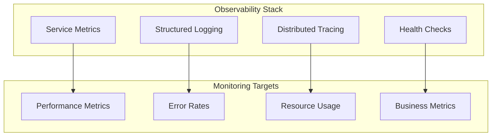

## Conclusion

The Foundation layer's service architecture demonstrates sophisticated application of OTP principles, providing a robust, scalable, and maintainable infrastructure for the ElixirScope platform. The careful balance of synchronous operations for consistency and asynchronous patterns for performance creates a solid foundation for higher-layer components.

Key architectural strengths:
- **Fault Tolerance**: Supervisor trees ensure service recovery
- **Performance**: Optimized for common operations
- **Observability**: Comprehensive metrics and logging
- **Maintainability**: Clear separation of concerns and well-defined interfaces
