# ElixirScope Foundation Layer - Error Handling & Resilience

## Overview

The Foundation layer implements a comprehensive error handling and resilience strategy that embodies the "let it crash" philosophy while providing graceful degradation and robust recovery mechanisms. This document analyzes the error handling architecture, resilience patterns, and fault tolerance strategies.

## Table of Contents

1. [Error Handling Philosophy](#error-handling-philosophy)
2. [Error Type Classification](#error-type-classification)
3. [Error Propagation Patterns](#error-propagation-patterns)
4. [Resilience Mechanisms](#resilience-mechanisms)
5. [Graceful Degradation](#graceful-degradation)
6. [Recovery Strategies](#recovery-strategies)
7. [Error Observability](#error-observability)

## Error Handling Philosophy

### Foundation Error Handling Principles

```mermaid
graph TB
    subgraph "Error Handling Philosophy"
        LetItCrash[Let It Crash]
        ExplicitErrors[Explicit Error Returns]
        FailFast[Fail Fast]
        IsolateFailure[Isolate Failures]
    end
    
    subgraph "Implementation Strategies"
        SupervisionTrees[Supervision Trees]
        ResultTuples[{:ok, result} | {:error, reason}]
        EarlyValidation[Early Validation]
        ProcessIsolation[Process Isolation]
    end
    
    subgraph "Benefits"
        SystemStability[System Stability]
        PredictableFailure[Predictable Failure]
        EasyDebugging[Easy Debugging]
        FaultTolerance[Fault Tolerance]
    end
    
    LetItCrash --> SupervisionTrees
    ExplicitErrors --> ResultTuples
    FailFast --> EarlyValidation
    IsolateFailure --> ProcessIsolation
    
    SupervisionTrees --> SystemStability
    ResultTuples --> PredictableFailure
    EarlyValidation --> EasyDebugging
    ProcessIsolation --> FaultTolerance
```

### Error Handling Layers

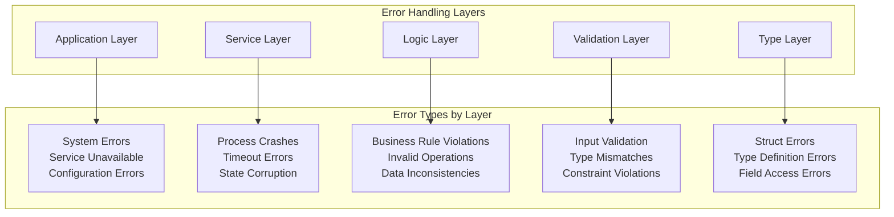

## Error Type Classification

### Foundation Error Taxonomy

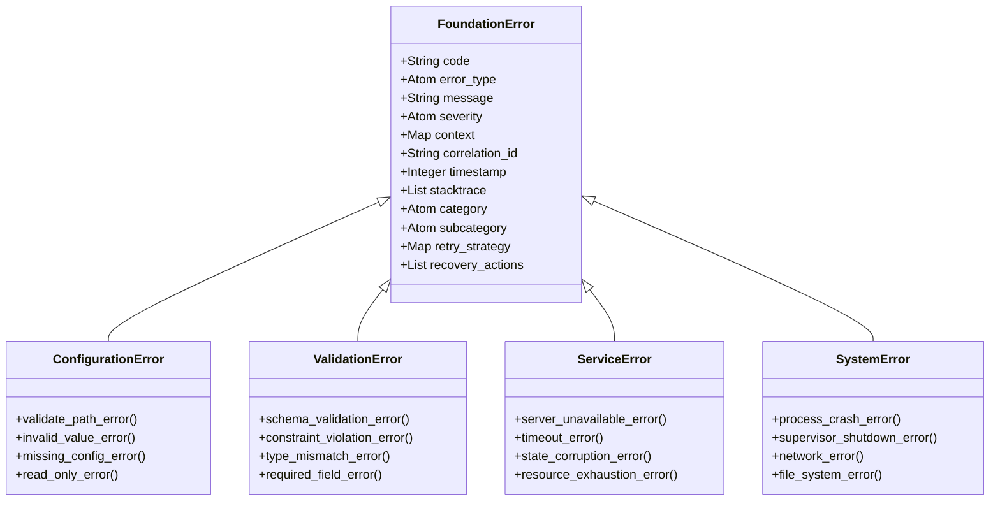

### Error Severity Levels

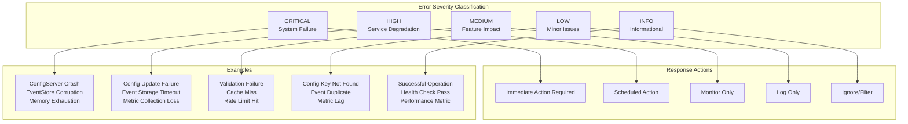

## Error Propagation Patterns

### Error Flow Through Architecture

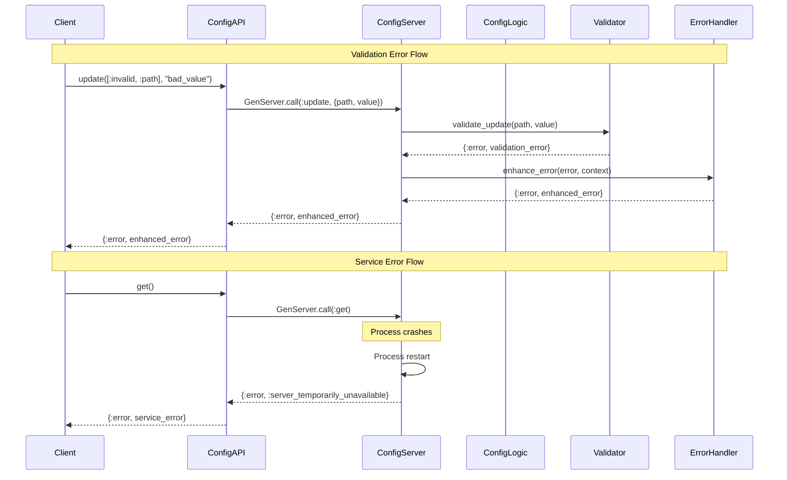

### Error Transformation Pipeline

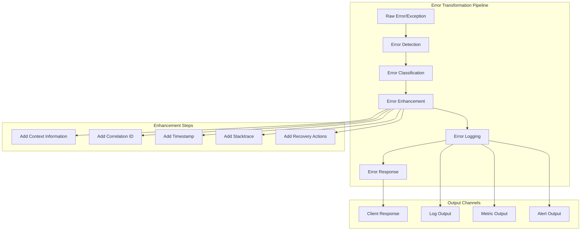

### Error Context Enrichment

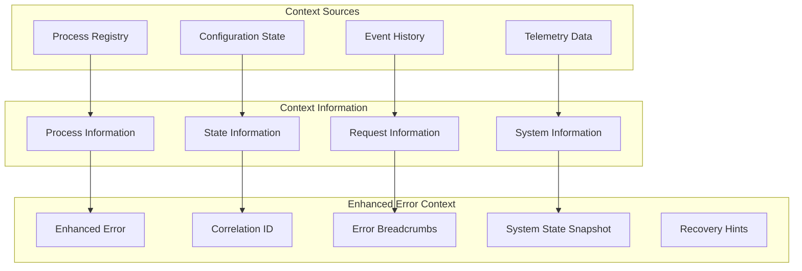

## Resilience Mechanisms

### Supervision Tree Resilience

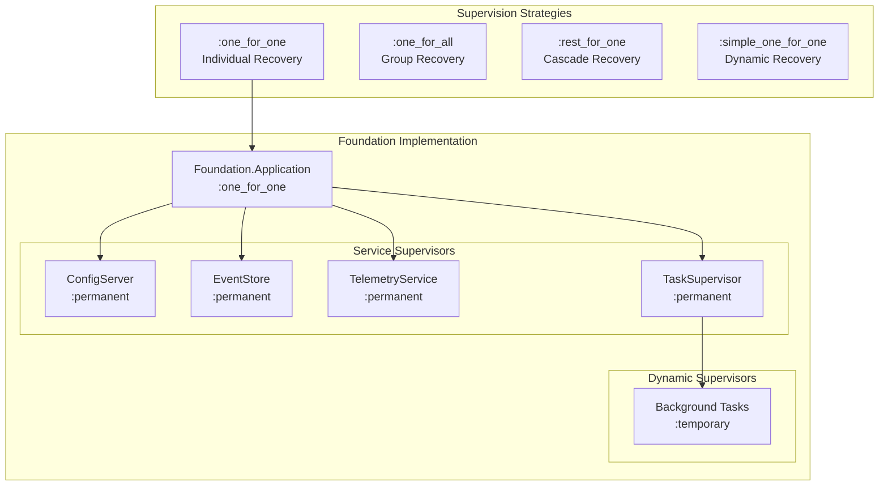

### Circuit Breaker Implementation

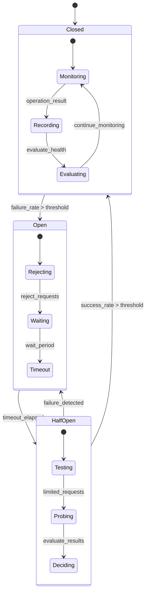

### Retry Strategies

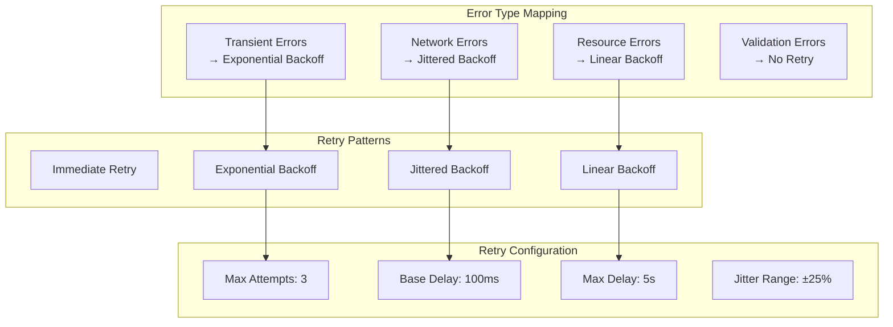

## Graceful Degradation

### Degradation Strategies

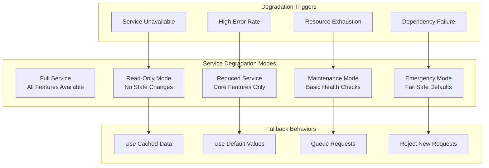

### Foundation Graceful Degradation

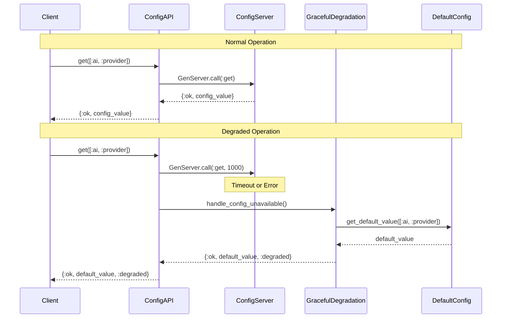

### Health Check Implementation

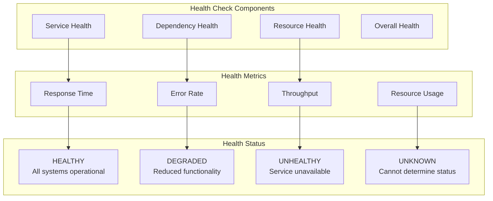

## Recovery Strategies

### Automatic Recovery Mechanisms

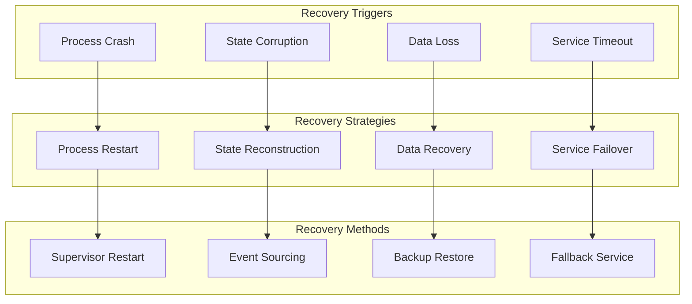

### State Recovery Patterns

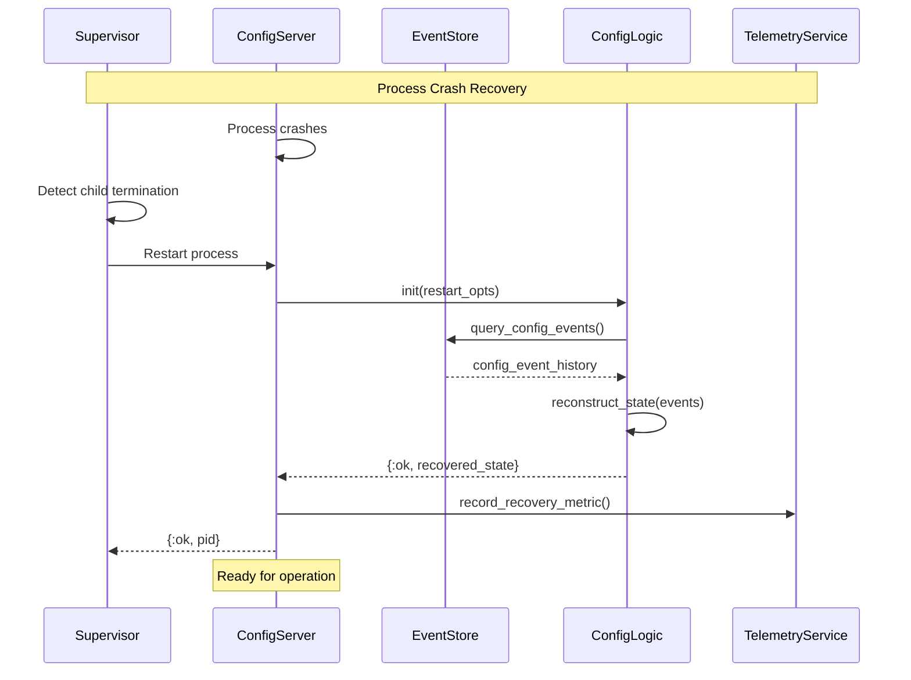

### Data Consistency Recovery

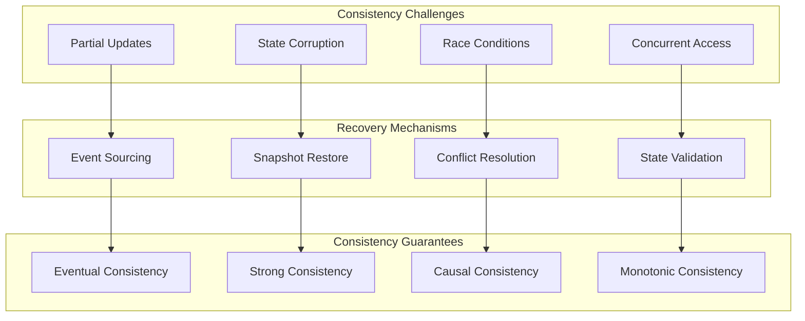

## Error Observability

### Error Monitoring Pipeline

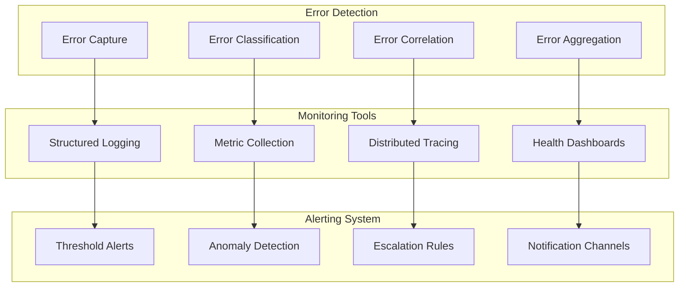

### Error Metrics and KPIs

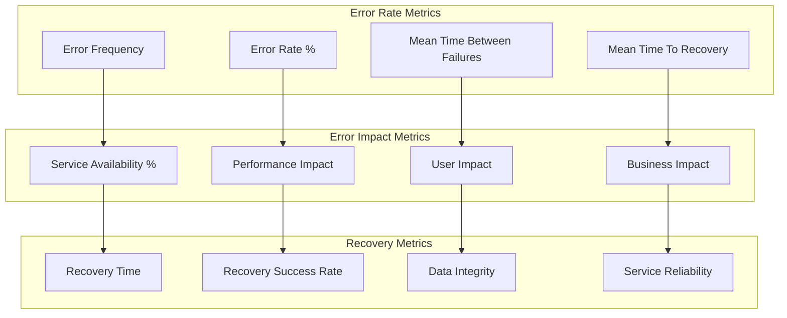

### Distributed Error Correlation

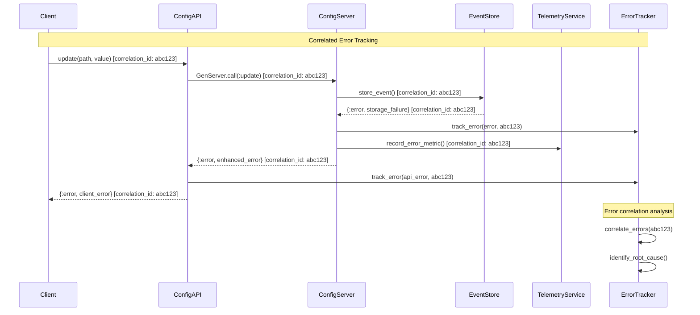

## Best Practices and Guidelines

### Error Handling Best Practices

1. **Always Return Explicit Results**: Use `{:ok, result}` or `{:error, reason}` tuples
2. **Fail Fast**: Validate inputs early and return errors immediately
3. **Provide Context**: Include relevant context information in error messages
4. **Use Appropriate Severity**: Classify errors by their impact and urgency
5. **Enable Recovery**: Provide recovery actions and suggestions when possible

### Resilience Design Patterns

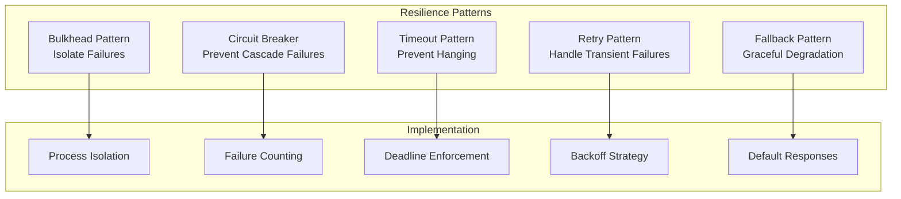

## Conclusion

The Foundation layer's error handling and resilience architecture demonstrates a mature approach to building fault-tolerant systems. Key strengths include:

- **Comprehensive Error Taxonomy**: Clear classification and handling of different error types
- **Graceful Degradation**: System continues operating even when components fail
- **Observable Failures**: Rich error context and correlation for debugging
- **Automatic Recovery**: Robust supervision and recovery mechanisms
- **Performance Under Stress**: Maintained service quality during error conditions

This error handling strategy provides a solid foundation for building reliable, production-ready applications that can gracefully handle failures and recover automatically.
