# ElixirScope Foundation Layer - Data Flow & State Management

## Overview

The Foundation layer implements sophisticated data flow patterns and state management strategies that ensure consistency, performance, and reliability across all services. This document analyzes the data architecture, flow patterns, state management approaches, and data consistency mechanisms.

## Table of Contents

1. [Data Architecture Overview](#data-architecture-overview)
2. [State Management Patterns](#state-management-patterns)
3. [Data Flow Analysis](#data-flow-analysis)
4. [Consistency Models](#consistency-models)
5. [Persistence Strategies](#persistence-strategies)
6. [Performance Optimization](#performance-optimization)
7. [Data Validation & Integrity](#data-validation--integrity)

## Data Architecture Overview

### Data Layer Architecture

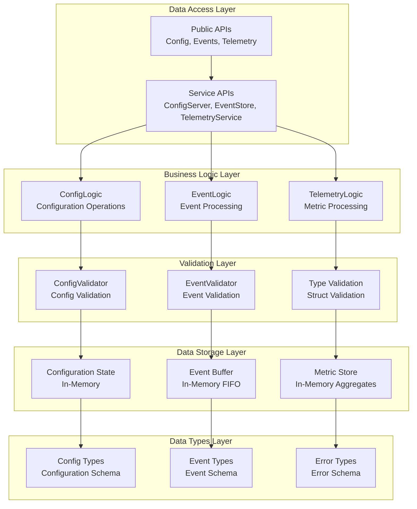

### Data Lifecycle Management

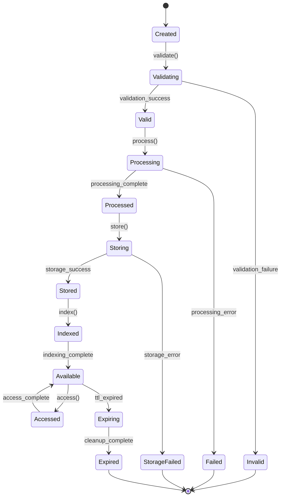

## State Management Patterns

### State Architecture by Service

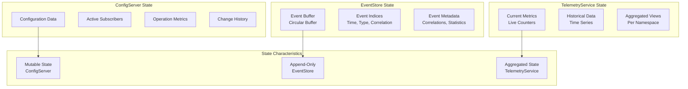

### State Mutation Patterns

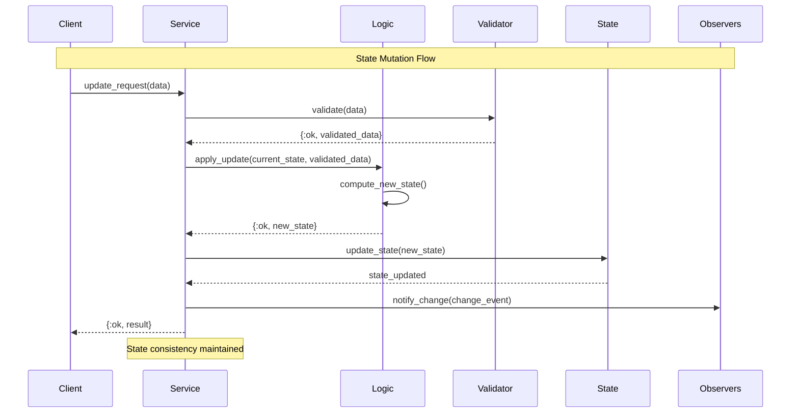

### Immutable Data Patterns

```mermaid
graph TB
    subgraph "Immutable Data Structures"
        ConfigStruct[Config Struct<br/>Immutable Fields]
        EventStruct[Event Struct<br/>Immutable Once Created]
        ErrorStruct[Error Struct<br/>Immutable Context]
    end
    
    subgraph "Update Patterns"
        StructUpdate[Struct Update<br/>%{struct | field: new_value}]
        FunctionalUpdate[Functional Update<br/>update_in/3, put_in/3]
        LensUpdate[Lens-based Update<br/>Deep Path Updates]
    end
    
    subgraph "Benefits"
        ThreadSafety[Thread Safety]
        Predictability[Predictable State]
        EasyTesting[Easy Testing]
        TimeTravel[Time Travel Debugging]
    end
    
    ConfigStruct --> StructUpdate
    EventStruct --> FunctionalUpdate
    ErrorStruct --> LensUpdate
    
    StructUpdate --> ThreadSafety
    FunctionalUpdate --> Predictability
    LensUpdate --> EasyTesting
    ThreadSafety --> TimeTravel
```

## Data Flow Analysis

### Configuration Data Flow

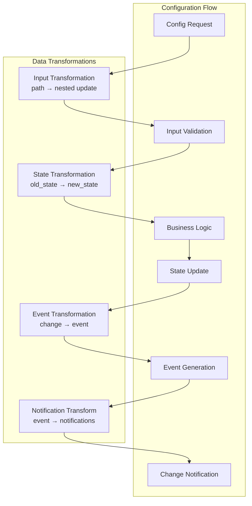

### Event Processing Pipeline

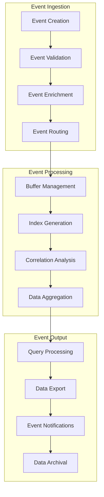

### Telemetry Data Pipeline

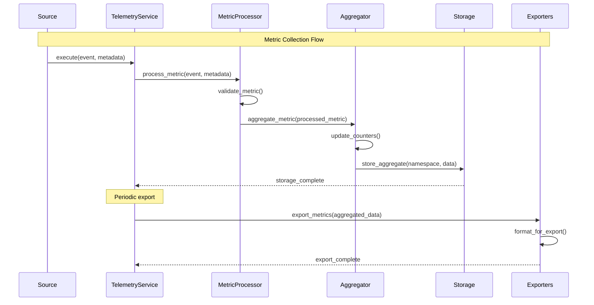

## Consistency Models

### Consistency Guarantees by Service

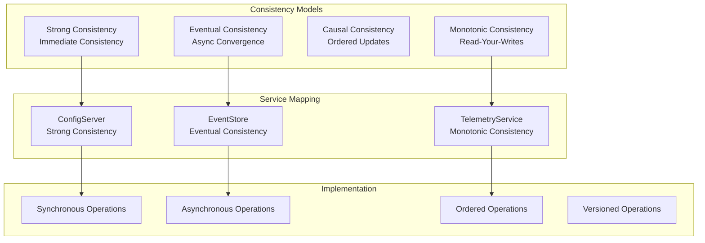

### Conflict Resolution Strategies

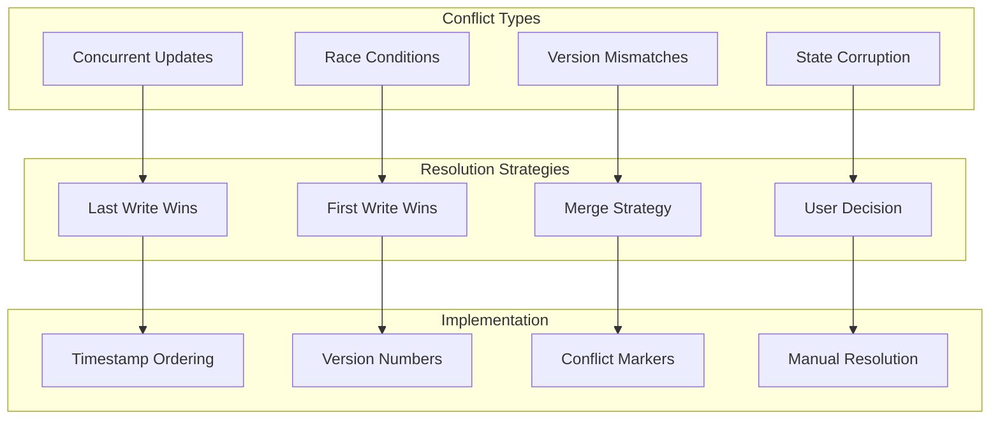

### Data Synchronization Patterns

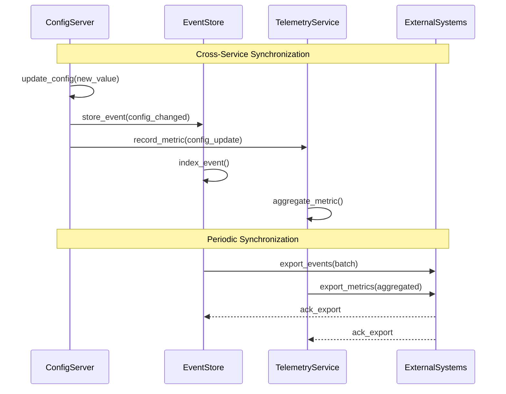

## Persistence Strategies

### Memory-Based Persistence

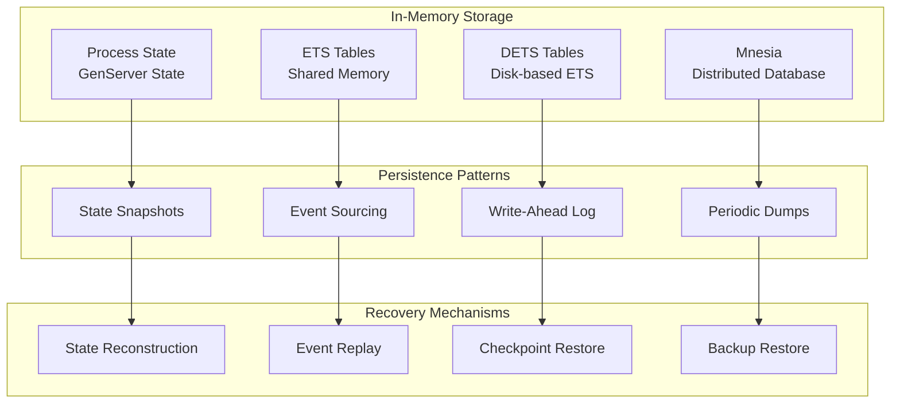

### Data Durability Strategies

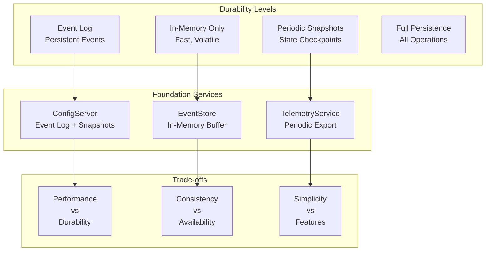

## Performance Optimization

### Caching Strategies

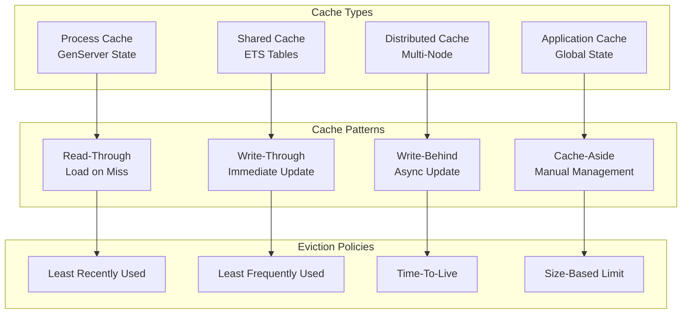

### Data Access Optimization

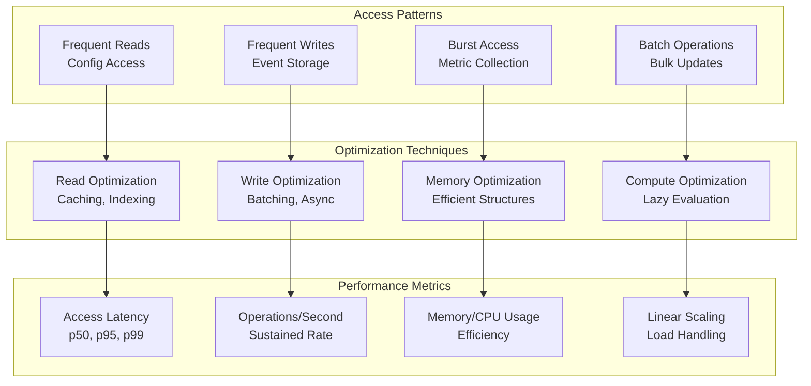

### Memory Management Patterns

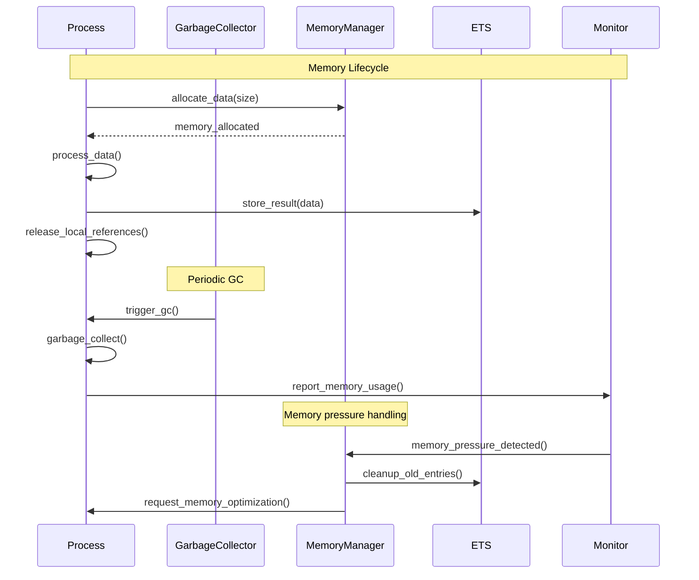

## Data Validation & Integrity

### Validation Pipeline

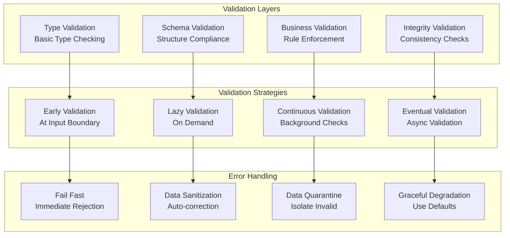

### Data Integrity Mechanisms

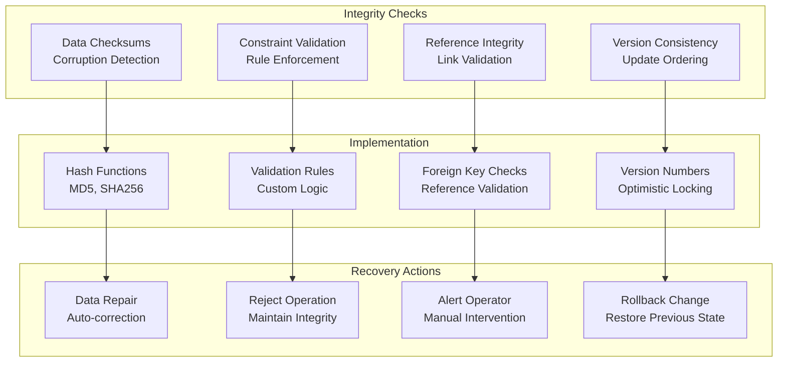

### Data Quality Monitoring

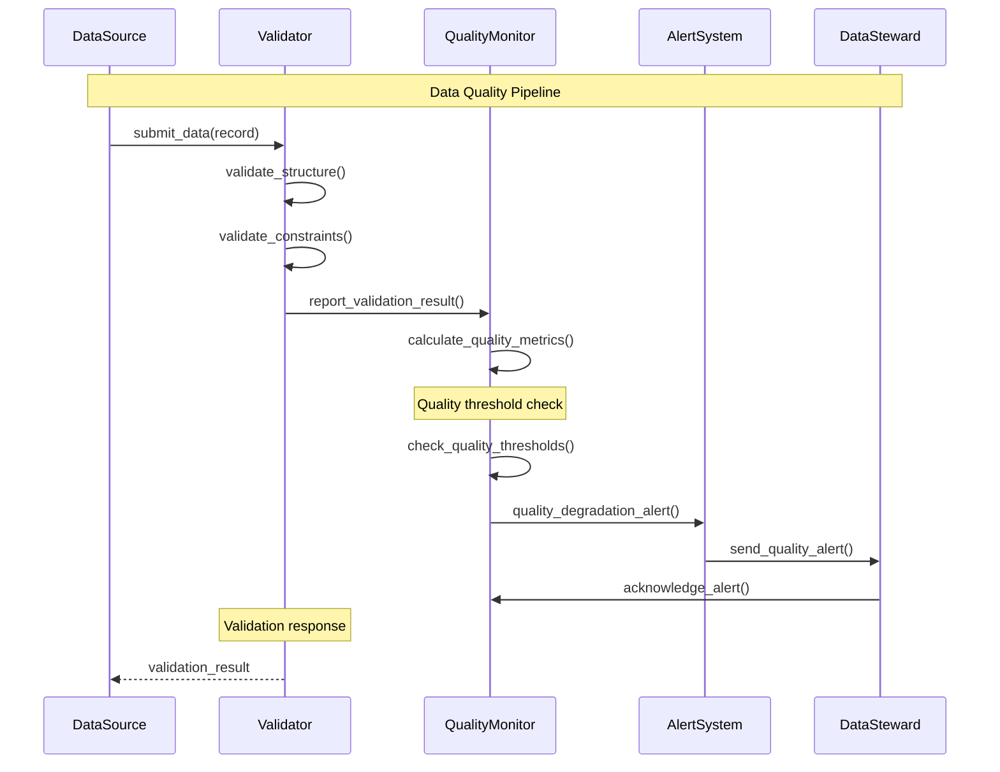

## Performance Benchmarks

### Data Operation Performance

| Operation | Latency (μs) | Throughput (ops/sec) | Memory Usage | Scalability |
|-----------|--------------|---------------------|--------------|-------------|
| Config.get/0 | 10-50 | >10,000 | Low | Linear |
| Config.update/2 | 100-500 | ~1,000 | Medium | Limited |
| Events.store/1 | 50-200 | >5,000 | Medium | Linear |
| Events.query/1 | 200-1000 | ~2,000 | High | Logarithmic |
| Telemetry.execute/3 | 20-100 | >8,000 | Low | Linear |
| Telemetry.get_metrics/0 | 100-300 | ~3,000 | Medium | Constant |

### Memory Usage Patterns

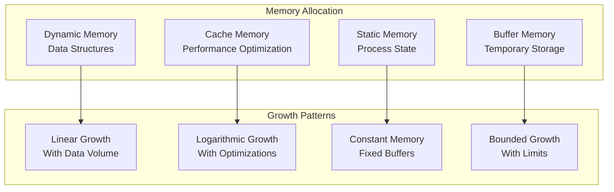

## Best Practices Summary

### Data Design Principles

1. **Immutable First**: Prefer immutable data structures for predictability
2. **Validate Early**: Validate data at system boundaries
3. **Fail Fast**: Reject invalid data immediately
4. **Cache Intelligently**: Cache frequently accessed data
5. **Monitor Continuously**: Track data quality and performance

### Performance Guidelines

1. **Optimize for Read**: Most operations are reads - optimize accordingly
2. **Batch Writes**: Group write operations for efficiency
3. **Use Appropriate Storage**: Match storage strategy to access patterns
4. **Monitor Memory**: Track memory usage and optimize for efficiency
5. **Plan for Scale**: Design for horizontal scaling from the start

## Conclusion

The Foundation layer's data flow and state management architecture provides:

- **Consistent Data Models**: Well-defined types and validation
- **Efficient Data Flow**: Optimized for common access patterns
- **Robust State Management**: Reliable state consistency across services
- **Performance Optimization**: Caching and optimization strategies
- **Data Integrity**: Comprehensive validation and integrity checks

This foundation enables reliable, high-performance data operations that scale with system growth while maintaining consistency and reliability.
