# ElixirScope Foundation Testing Strategies & Quality Assurance

## Overview

This document provides a comprehensive analysis of the testing strategies, quality assurance processes, and validation frameworks implemented in the ElixirScope Foundation layer. The foundation employs a multi-tiered testing approach ensuring enterprise-grade reliability and performance.

## Testing Architecture

### Multi-Tier Testing Strategy

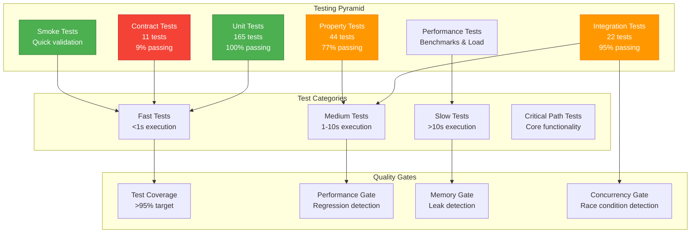

### Test Organization Structure

```mermaid
graph LR
    subgraph "Test Directory Structure"
        TestRoot[test/]
        
        subgraph "Unit Tests"
            UnitFoundation[unit/foundation/]
            UnitTypes[types/]
            UnitLogic[logic/]
            UnitValidation[validation/]
            UnitServices[services/]
            UnitUtils[utils/]
        end
        
        subgraph "Integration Tests"
            IntFoundation[integration/foundation/]
            IntConfigEvents[config_events_integration_test.exs]
            IntTelemetryEvents[telemetry_events_integration_test.exs]
            IntDistributed[distributed_coordination_test.exs]
        end
        
        subgraph "Support Infrastructure"
            Support[support/foundation/]
            Fixtures[fixtures/]
            Factories[factories/]
            Helpers[helpers/]
            Mocks[mocks/]
        end
        
        subgraph "Specialized Tests"
            Property_Tests[property/foundation/]
            Performance_Tests[performance/foundation/]
            Contract_Tests[contract/foundation/]
            Smoke_Tests[smoke/foundation/]
        end
    end
    
    TestRoot --> UnitFoundation
    TestRoot --> IntFoundation
    TestRoot --> Support
    TestRoot --> Property_Tests
    
    UnitFoundation --> UnitTypes
    UnitFoundation --> UnitLogic
    UnitFoundation --> UnitValidation
    UnitFoundation --> UnitServices
    UnitFoundation --> UnitUtils
    
    IntFoundation --> IntConfigEvents
    IntFoundation --> IntTelemetryEvents
    IntFoundation --> IntDistributed
    
    Support --> Fixtures
    Support --> Factories
    Support --> Helpers
    Support --> Mocks
```

## Unit Testing Strategy

### Pure Function Testing

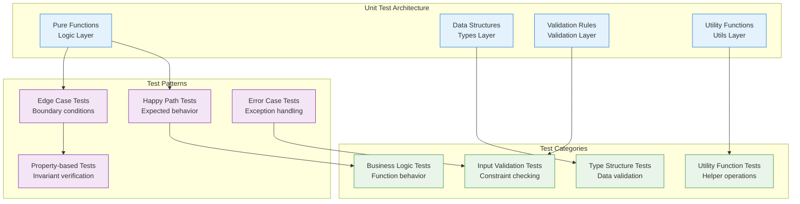

### Service Testing (GenServers)

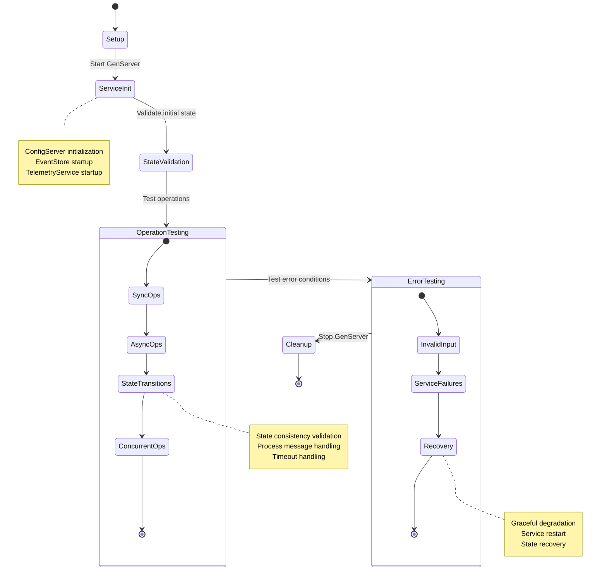

## Integration Testing Strategy

### Cross-Service Communication Testing

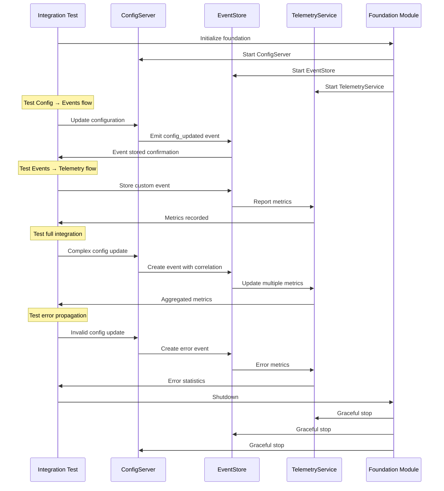

### Service Lifecycle Integration

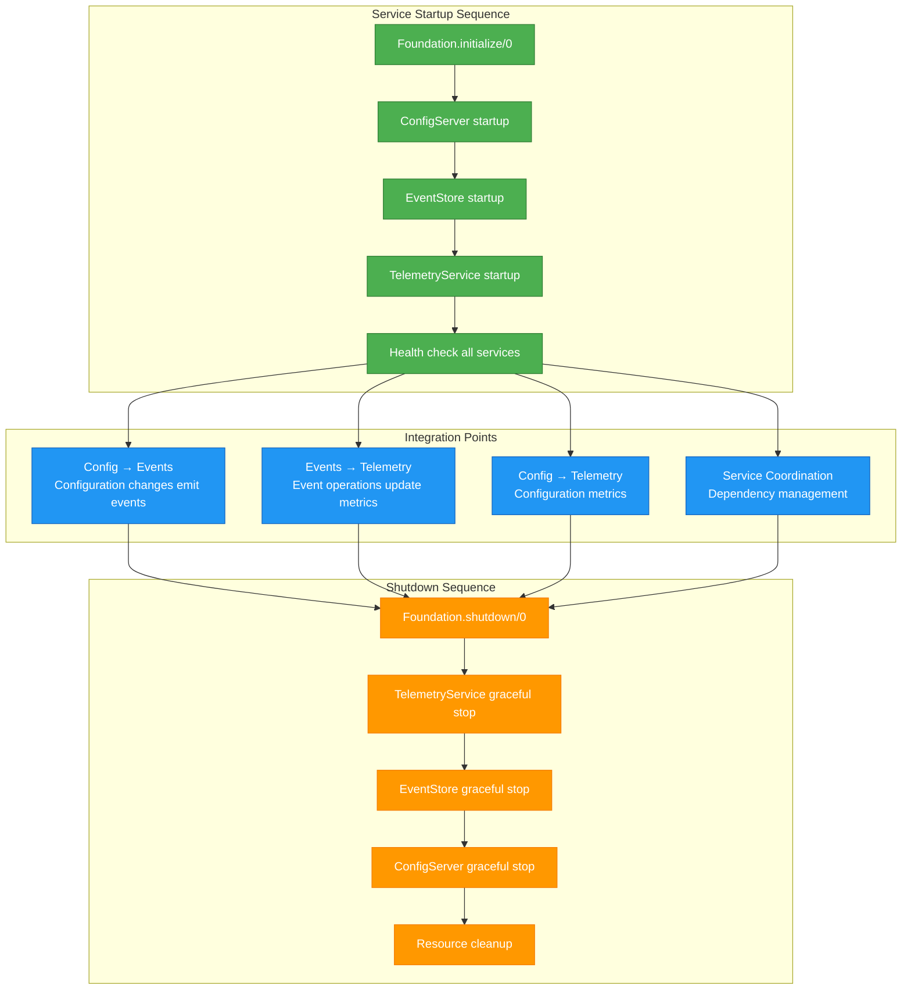

## Property-Based Testing

### Property Testing Architecture

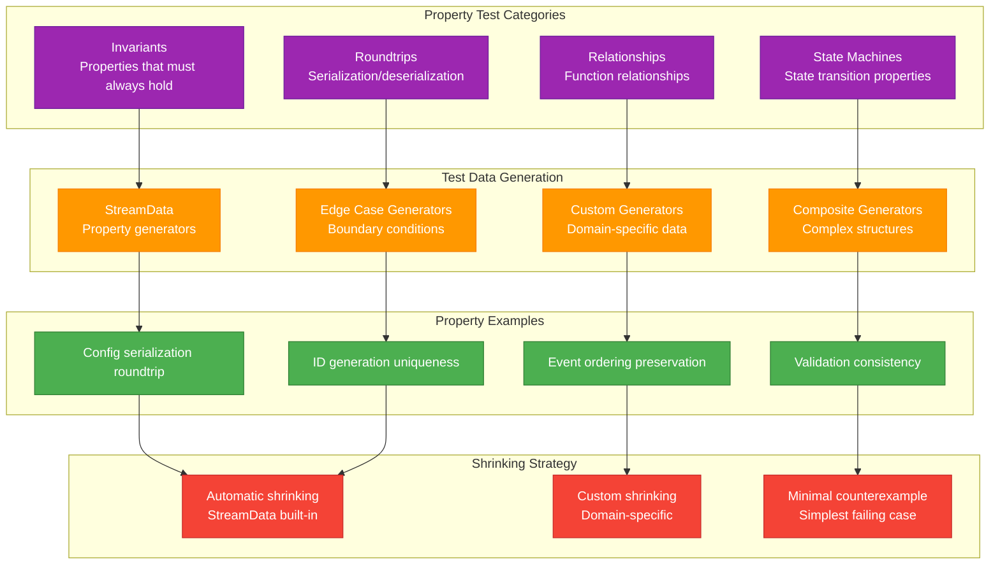

### Property Test Examples

```mermaid
graph LR
    subgraph "Configuration Properties"
        ConfigValid[Config validation<br/>validate(config) → {:ok, config}]
        ConfigUpdate[Config update<br/>update(config, path, value) preserves structure]
        ConfigSerialization[Config serialization<br/>serialize(deserialize(data)) = data]
    end
    
    subgraph "Event Properties"
        EventID[Event ID uniqueness<br/>All generated IDs are unique]
        EventTimestamp[Event timestamp ordering<br/>Events ordered by timestamp]
        EventSerialization[Event serialization<br/>Roundtrip preservation]
    end
    
    subgraph "Utility Properties"
        IDGeneration[ID generation<br/>Always produces unique IDs]
        TimestampMonotonic[Timestamp monotonic<br/>Sequential timestamps increase]
        RetryLogic[Retry logic<br/>Eventually succeeds or exhausts attempts]
    end
    
    subgraph "Service Properties"
        ServiceState[Service state consistency<br/>State transitions are valid]
        ServiceRecovery[Service recovery<br/>Services recover from failures]
        ServiceConcurrency[Service concurrency<br/>Concurrent operations are safe]
    end
    
    classDef config fill:#E3F2FD,stroke:#1976D2
    classDef event fill:#E8F5E8,stroke:#388E3C
    classDef utility fill:#FFF3E0,stroke:#F57C00
    classDef service fill:#F3E5F5,stroke:#7B1FA2
    
    class ConfigValid,ConfigUpdate,ConfigSerialization config
    class EventID,EventTimestamp,EventSerialization event
    class IDGeneration,TimestampMonotonic,RetryLogic utility
    class ServiceState,ServiceRecovery,ServiceConcurrency service
```

## Performance Testing & Benchmarking

### Performance Test Architecture

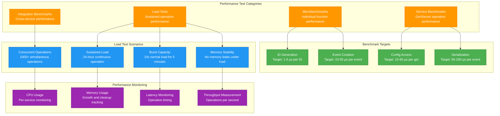

### Performance Validation Pipeline

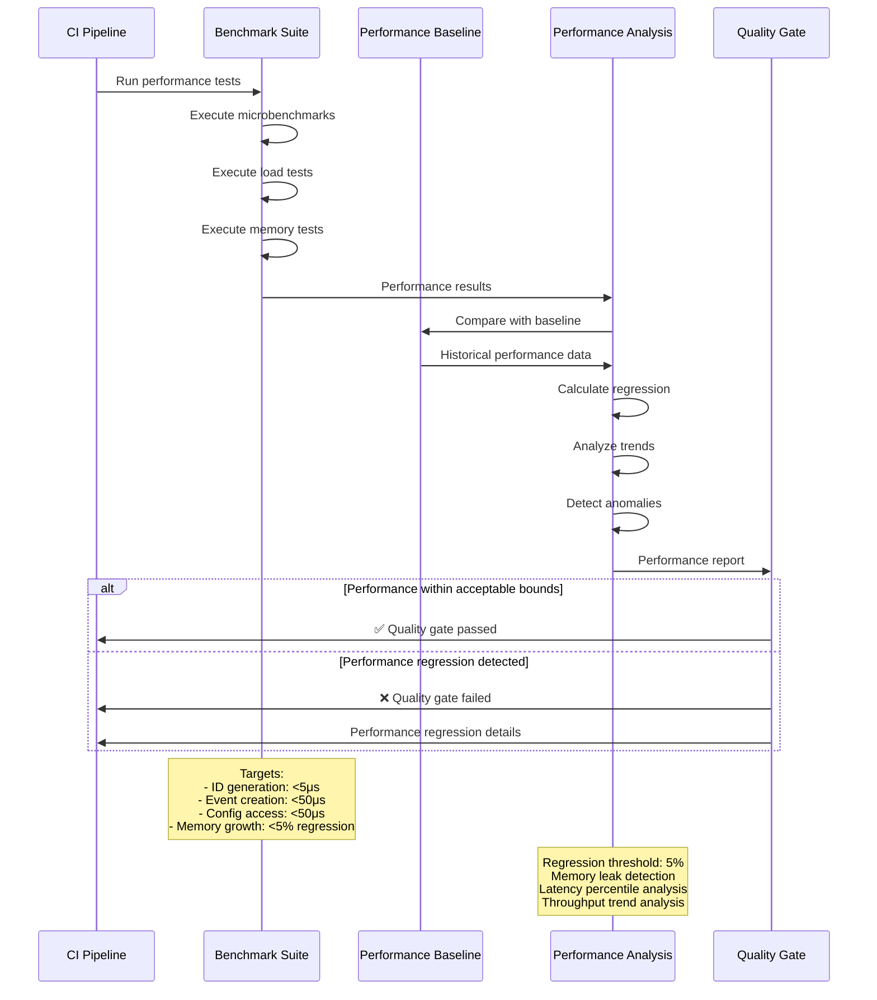

## Contract Testing

### Behavior Contract Validation

```mermaid
graph TB
    subgraph "Contract Test Architecture"
        Behaviors[Behavior Definitions<br/>Formal contracts]
        Implementations[Implementation Modules<br/>Concrete implementations]
        ComplianceTests[Compliance Tests<br/>Contract validation]
        APIConsistency[API Consistency<br/>Interface stability]
    end
    
    subgraph "Contract Categories"
        AccessBehavior[Access Behavior<br/>Configuration access patterns]
        EventBehavior[Event Behavior<br/>Event lifecycle contracts]
        ServiceBehavior[Service Behavior<br/>GenServer contracts]
        UtilityBehavior[Utility Behavior<br/>Pure function contracts]
    end
    
    subgraph "Contract Validation"
        SpecCompliance[Typespec Compliance<br/>Function signatures match]
        BehaviorCompliance[Behavior Compliance<br/>Required callbacks implemented]
        ErrorHandling[Error Handling<br/>Consistent error patterns]
        ReturnValues[Return Values<br/>Consistent return patterns]
    end
    
    subgraph "Contract Enforcement"
        CompileTime[Compile-time Checks<br/>Dialyzer validation]
        Runtime[Runtime Checks<br/>Contract test execution]
        CI[CI Integration<br/>Automated validation]
        Documentation[Documentation<br/>Contract specification]
    end
    
    Behaviors --> AccessBehavior
    Behaviors --> EventBehavior
    Implementations --> ServiceBehavior
    Implementations --> UtilityBehavior
    
    ComplianceTests --> SpecCompliance
    ComplianceTests --> BehaviorCompliance
    APIConsistency --> ErrorHandling
    APIConsistency --> ReturnValues
    
    SpecCompliance --> CompileTime
    BehaviorCompliance --> Runtime
    ErrorHandling --> CI
    ReturnValues --> Documentation
    
    classDef contract fill:#E3F2FD,stroke:#1976D2
    classDef category fill:#E8F5E8,stroke:#388E3C
    classDef validation fill:#FFF3E0,stroke:#F57C00
    classDef enforcement fill:#F3E5F5,stroke:#7B1FA2
    
    class Behaviors,Implementations,ComplianceTests,APIConsistency contract
    class AccessBehavior,EventBehavior,ServiceBehavior,UtilityBehavior category
    class SpecCompliance,BehaviorCompliance,ErrorHandling,ReturnValues validation
    class CompileTime,Runtime,CI,Documentation enforcement
```

## Test Execution & Quality Gates

### Continuous Integration Testing Pipeline

```mermaid
graph LR
    subgraph "Code Changes"
        Commit[Code Commit]
        PR[Pull Request]
    end
    
    subgraph "Quick Validation"
        Compile[Compilation<br/>< 30 seconds]
        Format[Code Formatting<br/>mix format]
        Credo[Static Analysis<br/>mix credo]
        Dialyzer[Type Checking<br/>mix dialyzer]
    end
    
    subgraph "Test Execution"
        Unit[Unit Tests<br/>< 2 minutes]
        Smoke[Smoke Tests<br/>< 1 minute]
        Integration[Integration Tests<br/>< 5 minutes]
        Contract[Contract Tests<br/>< 2 minutes]
    end
    
    subgraph "Quality Gates"
        Coverage[Test Coverage<br/>>95% required]
        Performance[Performance<br/><5% regression]
        Memory[Memory<br/>No leaks detected]
        Security[Security<br/>No vulnerabilities]
    end
    
    subgraph "Deployment Gates"
        Acceptance[Acceptance Tests<br/>End-to-end validation]
        LoadTest[Load Testing<br/>Production-like load]
        Canary[Canary Deployment<br/>Limited rollout]
        Production[Production Deploy<br/>Full rollout]
    end
    
    Commit --> Compile
    PR --> Compile
    
    Compile --> Format
    Format --> Credo
    Credo --> Dialyzer
    
    Dialyzer --> Unit
    Unit --> Smoke
    Smoke --> Integration
    Integration --> Contract
    
    Contract --> Coverage
    Coverage --> Performance
    Performance --> Memory
    Memory --> Security
    
    Security --> Acceptance
    Acceptance --> LoadTest
    LoadTest --> Canary
    Canary --> Production
    
    classDef change fill:#FFC107,stroke:#F57C00
    classDef quick fill:#4CAF50,stroke:#2E7D32,color:#fff
    classDef test fill:#2196F3,stroke:#1565C0,color:#fff
    classDef gate fill:#FF9800,stroke:#F57C00,color:#fff
    classDef deploy fill:#9C27B0,stroke:#6A1B9A,color:#fff
    
    class Commit,PR change
    class Compile,Format,Credo,Dialyzer quick
    class Unit,Smoke,Integration,Contract test
    class Coverage,Performance,Memory,Security gate
    class Acceptance,LoadTest,Canary,Production deploy
```

### Test Tag-Based Execution Strategy

```mermaid
graph TB
    subgraph "Test Tag Categories"
        Unit_Tag[@tag :unit<br/>Fast, isolated tests]
        Integration_Tag[@tag :integration<br/>Cross-component tests]
        Performance_Tag[@tag :performance<br/>Benchmark tests]
        Memory_Tag[@tag :memory<br/>Memory usage tests]
        Slow_Tag[@tag :slow<br/>Long-running tests]
        Contract_Tag[@tag :contract<br/>API contract tests]
    end
    
    subgraph "Execution Contexts"
        Development[Development<br/>Fast feedback]
        CI[Continuous Integration<br/>Comprehensive validation]
        Release[Release Testing<br/>Full test suite]
        Production[Production Monitoring<br/>Health checks]
    end
    
    subgraph "Test Commands"
        DevTest[mix test<br/>Unit tests only]
        CITest[mix test --include integration<br/>CI validation]
        FullTest[mix test --include slow<br/>Complete test suite]
        PerfTest[mix test --include performance<br/>Performance validation]
    end
    
    Unit_Tag --> Development
    Integration_Tag --> CI
    Performance_Tag --> Release
    Memory_Tag --> Release
    Slow_Tag --> Release
    Contract_Tag --> CI
    
    Development --> DevTest
    CI --> CITest
    Release --> FullTest
    Production --> PerfTest
    
    classDef tag fill:#E3F2FD,stroke:#1976D2
    classDef context fill:#E8F5E8,stroke:#388E3C
    classDef command fill:#FFF3E0,stroke:#F57C00
    
    class Unit_Tag,Integration_Tag,Performance_Tag,Memory_Tag,Slow_Tag,Contract_Tag tag
    class Development,CI,Release,Production context
    class DevTest,CITest,FullTest,PerfTest command
```

## Memory & Resource Testing

### Memory Management Testing Strategy

```mermaid
graph TB
    subgraph "Memory Test Categories"
        LeakDetection[Memory Leak Detection<br/>Long-running operations]
        PressureTesting[Memory Pressure Testing<br/>Resource exhaustion scenarios]
        GrowthAnalysis[Memory Growth Analysis<br/>Predictable scaling]
        CleanupValidation[Cleanup Validation<br/>Resource deallocation]
    end
    
    subgraph "Memory Monitoring"
        SystemMemory[System Memory<br/>:erlang.memory()]
        ProcessMemory[Process Memory<br/>Per-GenServer tracking]
        ETSMemory[ETS Memory<br/>Table memory usage]
        GCMetrics[GC Metrics<br/>Garbage collection stats]
    end
    
    subgraph "Resource Validation"
        ProcessCount[Process Count<br/>Process lifecycle tracking]
        FileHandles[File Handles<br/>Resource handle tracking]
        NetworkConnections[Network Connections<br/>Connection pool monitoring]
        TimerTracking[Timer Tracking<br/>Timer resource management]
    end
    
    subgraph "Memory Test Scenarios"
        SustainedLoad[Sustained Load<br/>24-hour operation]
        BurstLoad[Burst Load<br/>Temporary high usage]
        ServiceRestart[Service Restart<br/>Clean state recovery]
        ErrorRecovery[Error Recovery<br/>Cleanup after failures]
    end
    
    LeakDetection --> SystemMemory
    PressureTesting --> ProcessMemory
    GrowthAnalysis --> ETSMemory
    CleanupValidation --> GCMetrics
    
    SystemMemory --> ProcessCount
    ProcessMemory --> FileHandles
    ETSMemory --> NetworkConnections
    GCMetrics --> TimerTracking
    
    ProcessCount --> SustainedLoad
    FileHandles --> BurstLoad
    NetworkConnections --> ServiceRestart
    TimerTracking --> ErrorRecovery
    
    classDef memory fill:#FF9800,stroke:#F57C00,color:#fff
    classDef monitoring fill:#4CAF50,stroke:#2E7D32,color:#fff
    classDef resource fill:#2196F3,stroke:#1565C0,color:#fff
    classDef scenario fill:#9C27B0,stroke:#6A1B9A,color:#fff
    
    class LeakDetection,PressureTesting,GrowthAnalysis,CleanupValidation memory
    class SystemMemory,ProcessMemory,ETSMemory,GCMetrics monitoring
    class ProcessCount,FileHandles,NetworkConnections,TimerTracking resource
    class SustainedLoad,BurstLoad,ServiceRestart,ErrorRecovery scenario
```

## Smoke Testing Framework

### Rapid Validation Pipeline

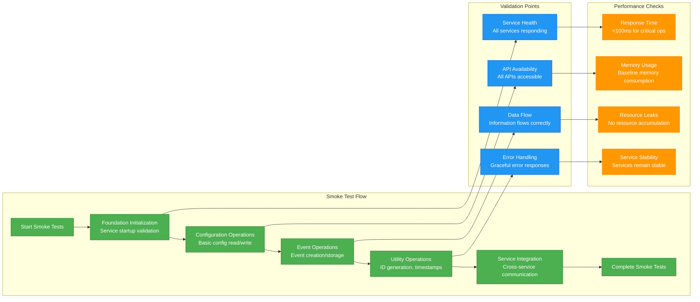

## Test Data Management

### Test Fixture & Factory Strategy

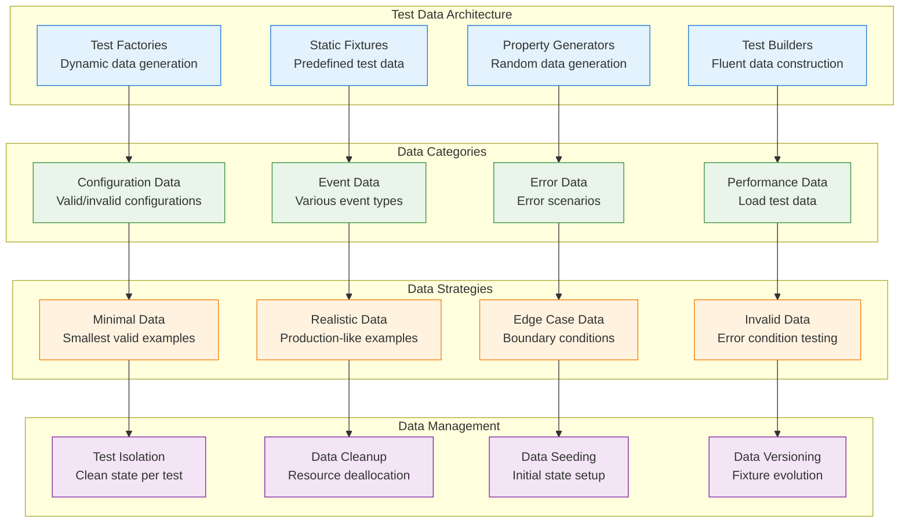

## Quality Metrics & Reporting

### Comprehensive Quality Dashboard

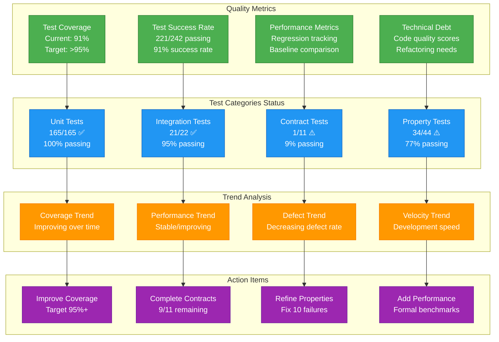

## Testing Best Practices & Guidelines

### Test Development Principles

1. **Test Pyramid Structure**: Maintain appropriate ratio of unit:integration:e2e tests
2. **Fast Feedback Loops**: Prioritize fast-running tests for development workflow
3. **Isolation**: Each test should be independent and not affect others
4. **Deterministic**: Tests should produce consistent results across runs
5. **Maintainable**: Tests should be easy to understand and modify
6. **Comprehensive**: Cover happy paths, edge cases, and error conditions

### Performance Testing Guidelines

1. **Baseline Establishment**: Establish performance baselines for regression detection
2. **Realistic Load**: Use production-like data volumes and access patterns
3. **Resource Monitoring**: Track CPU, memory, and I/O during tests
4. **Scalability Testing**: Validate performance under increasing load
5. **Regression Prevention**: Automatically detect performance regressions

### Quality Gate Enforcement

1. **Coverage Thresholds**: Maintain >95% test coverage for new code
2. **Performance Budgets**: Enforce <5% performance regression tolerance
3. **Memory Leak Detection**: Zero tolerance for memory leaks
4. **Security Validation**: Automated security vulnerability scanning
5. **Code Quality**: Maintain high code quality scores (Credo, Dialyzer)

This comprehensive testing strategy ensures the ElixirScope Foundation layer maintains enterprise-grade quality, performance, and reliability standards while supporting rapid development and continuous improvement.
