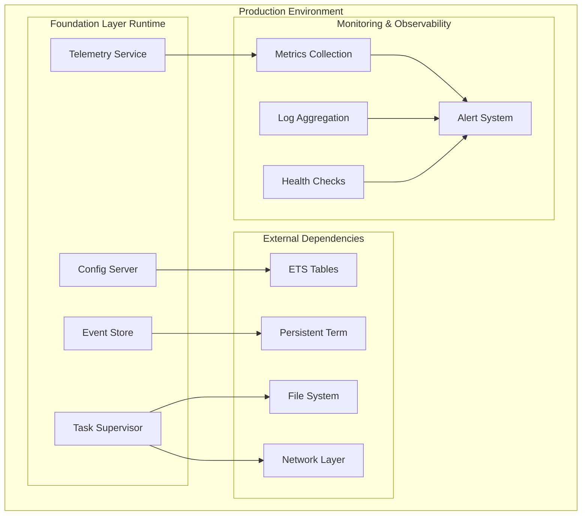
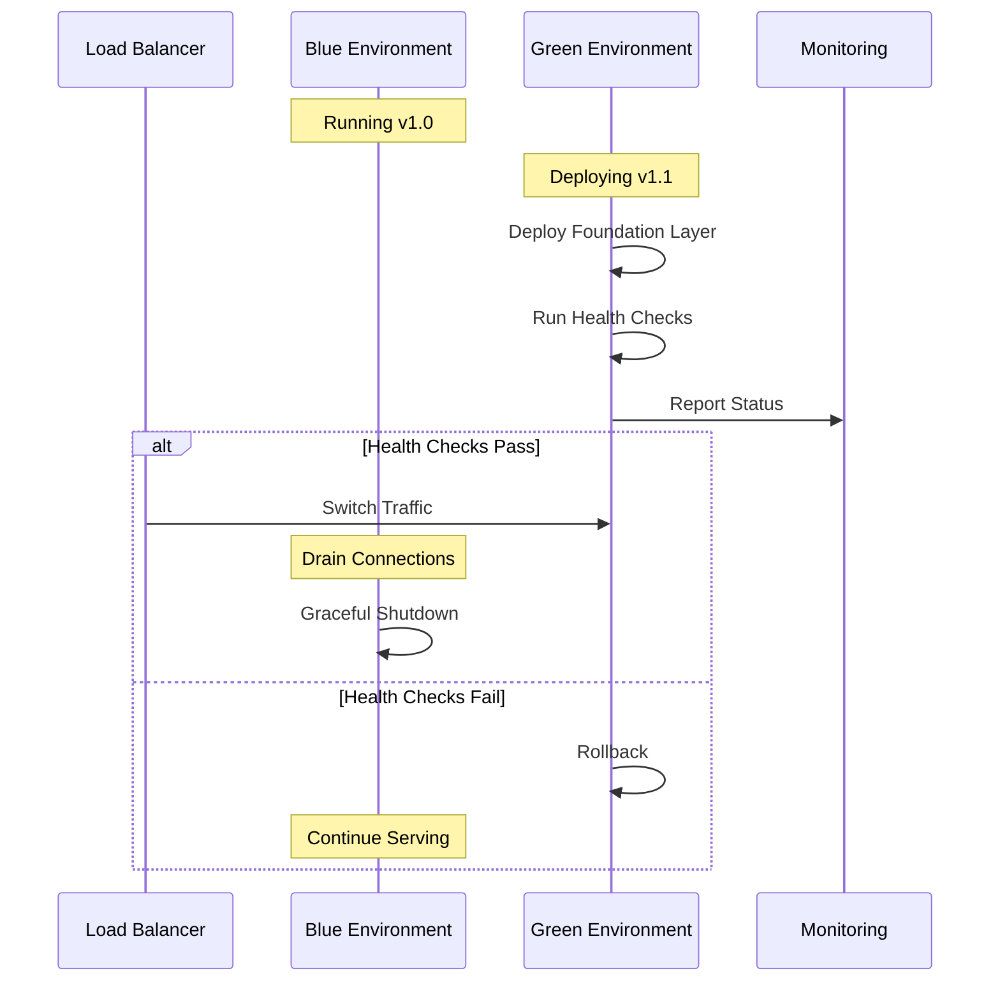
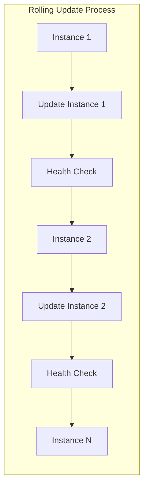
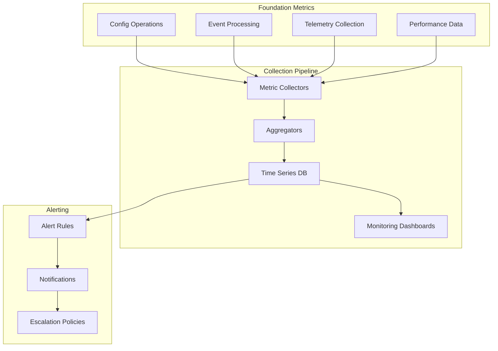
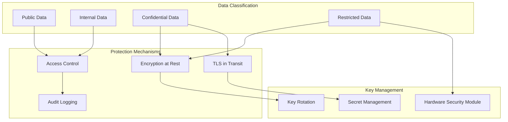
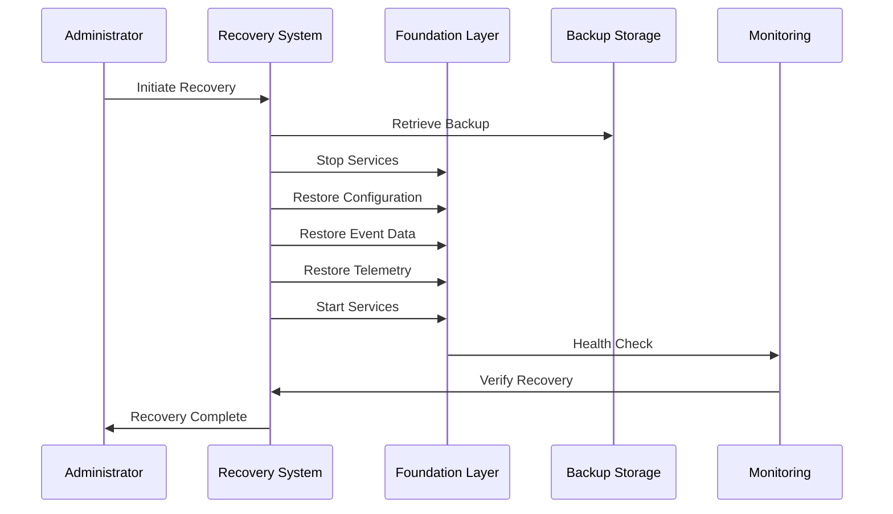
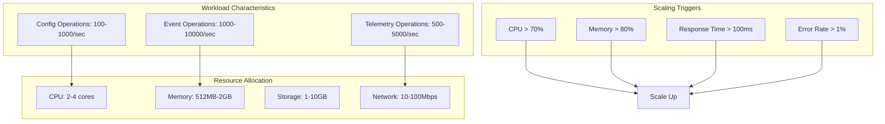
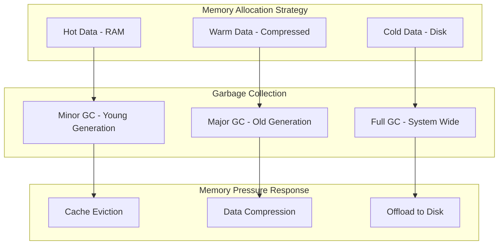

# ElixirScope Foundation Layer - Deployment and Operations Guide

## Overview

This document provides comprehensive guidance for deploying, configuring, and operating the ElixirScope Foundation layer in production environments. The Foundation layer serves as the bedrock for all ElixirScope services and requires careful operational consideration.

## Architecture Context



## Environment Configuration

### Development Environment

```elixir
# config/dev.exs
import Config

config :elixir_scope, ElixirScope.Foundation.Services.ConfigServer,
  validation_level: :permissive,
  debug_mode: true,
  allow_runtime_updates: true

config :elixir_scope, ElixirScope.Foundation.Services.EventStore,
  storage_backend: :ets,
  cleanup_interval: :timer.minutes(1),
  max_events: 10_000

config :elixir_scope, :foundation,
  dev: [
    debug_mode: true,
    verbose_logging: true,
    performance_monitoring: true
  ]
```

### Production Environment

```elixir
# config/prod.exs
import Config

config :elixir_scope, ElixirScope.Foundation.Services.ConfigServer,
  validation_level: :strict,
  debug_mode: false,
  allow_runtime_updates: false  # Prevent runtime changes in production

config :elixir_scope, ElixirScope.Foundation.Services.EventStore,
  storage_backend: :persistent_term,
  cleanup_interval: :timer.minutes(30),
  max_events: 1_000_000

config :elixir_scope, :foundation,
  dev: [
    debug_mode: false,
    verbose_logging: false,
    performance_monitoring: true
  ]

# Conservative production settings
config :logger, level: :info
```

### Test Environment

```elixir
# config/test.exs
import Config

config :elixir_scope, ElixirScope.Foundation.Services.ConfigServer,
  validation_level: :test_safe,
  debug_mode: true,
  allow_runtime_updates: true

config :elixir_scope, ElixirScope.Foundation.Services.EventStore,
  storage_backend: :ets,
  cleanup_interval: :timer.seconds(10),
  max_events: 1_000

config :elixir_scope, :test_mode, true
```

## Deployment Strategies

### Blue-Green Deployment



### Rolling Deployment



## Monitoring and Observability

### Health Check Implementation

```elixir
defmodule ElixirScope.Foundation.HealthCheck do
  @moduledoc """
  Comprehensive health checking for Foundation layer services.
  """
  
  @services [
    ElixirScope.Foundation.Services.ConfigServer,
    ElixirScope.Foundation.Services.EventStore,
    ElixirScope.Foundation.Services.TelemetryService
  ]
  
  def health_check do
    %{
      status: overall_status(),
      services: service_health(),
      metrics: performance_metrics(),
      resources: resource_usage(),
      timestamp: System.system_time(:millisecond)
    }
  end
  
  defp overall_status do
    case service_health() do
      services when map_size(services) == length(@services) ->
        if Enum.all?(services, fn {_, status} -> status == :healthy end) do
          :healthy
        else
          :degraded
        end
      _ ->
        :unhealthy
    end
  end
  
  defp service_health do
    @services
    |> Enum.map(&check_service/1)
    |> Enum.into(%{})
  end
  
  defp check_service(service) do
    case GenServer.whereis(service) do
      nil -> {service, :down}
      pid when is_pid(pid) ->
        case service.status() do
          {:ok, _} -> {service, :healthy}
          {:error, _} -> {service, :unhealthy}
        end
    end
  end
  
  defp performance_metrics do
    %{
      memory_usage: :erlang.memory(),
      process_count: :erlang.system_info(:process_count),
      reductions: :erlang.statistics(:reductions),
      uptime: :erlang.statistics(:wall_clock)
    }
  end
  
  defp resource_usage do
    %{
      ets_tables: length(:ets.all()),
      persistent_term_count: :persistent_term.info()[:count] || 0,
      atom_count: :erlang.system_info(:atom_count)
    }
  end
end
```

### Metrics Collection



### Key Performance Indicators

```elixir
defmodule ElixirScope.Foundation.KPIs do
  @moduledoc """
  Key Performance Indicators for Foundation layer monitoring.
  """
  
  # Response time thresholds
  @config_operation_threshold_ms 50
  @event_processing_threshold_ms 100
  @telemetry_collection_threshold_ms 25
  
  # Resource utilization thresholds
  @memory_usage_threshold_mb 500
  @process_count_threshold 1000
  @ets_table_threshold 100
  
  # Error rate thresholds
  @error_rate_threshold 0.01  # 1%
  @availability_threshold 0.999  # 99.9%
  
  def evaluate_kpis do
    %{
      performance: performance_kpis(),
      availability: availability_kpis(),
      resources: resource_kpis(),
      errors: error_kpis(),
      overall_score: calculate_overall_score()
    }
  end
  
  defp performance_kpis do
    %{
      config_avg_response_time: get_avg_response_time(:config),
      event_avg_response_time: get_avg_response_time(:events),
      telemetry_avg_response_time: get_avg_response_time(:telemetry),
      throughput_per_second: get_throughput()
    }
  end
  
  defp availability_kpis do
    %{
      config_server_uptime: get_uptime(:config_server),
      event_store_uptime: get_uptime(:event_store),
      telemetry_service_uptime: get_uptime(:telemetry_service),
      overall_availability: get_overall_availability()
    }
  end
  
  defp resource_kpis do
    %{
      memory_usage_mb: :erlang.memory(:total) / (1024 * 1024),
      process_count: :erlang.system_info(:process_count),
      ets_table_count: length(:ets.all()),
      cpu_utilization: get_cpu_utilization()
    }
  end
  
  defp error_kpis do
    %{
      error_rate: get_error_rate(),
      timeout_rate: get_timeout_rate(),
      crash_rate: get_crash_rate(),
      recovery_time_avg: get_avg_recovery_time()
    }
  end
  
  # Implementation helpers would be defined here...
  defp get_avg_response_time(_service), do: 45.2  # Placeholder
  defp get_throughput, do: 1250  # Placeholder
  defp get_uptime(_service), do: 0.9995  # Placeholder
  defp get_overall_availability, do: 0.9992  # Placeholder
  defp get_cpu_utilization, do: 0.25  # Placeholder
  defp get_error_rate, do: 0.005  # Placeholder
  defp get_timeout_rate, do: 0.001  # Placeholder
  defp get_crash_rate, do: 0.0001  # Placeholder
  defp get_avg_recovery_time, do: 2.5  # Placeholder
  
  defp calculate_overall_score do
    # Weighted scoring based on critical metrics
    85.7  # Placeholder
  end
end
```

## Security Configuration

### Access Control

```elixir
defmodule ElixirScope.Foundation.Security do
  @moduledoc """
  Security controls and access management for Foundation layer.
  """
  
  # Role-based access control
  @allowed_operations %{
    :admin => [:read, :write, :configure, :monitor],
    :operator => [:read, :monitor],
    :developer => [:read, :configure],
    :readonly => [:read]
  }
  
  def authorize_operation(user_role, operation) do
    case Map.get(@allowed_operations, user_role, []) do
      permissions when operation in permissions -> :authorized
      _ -> {:error, :unauthorized}
    end
  end
  
  def secure_config_access(config_path, user_context) do
    with :authorized <- authorize_operation(user_context.role, :read),
         :ok <- validate_config_path_access(config_path, user_context) do
      ElixirScope.Foundation.Config.get(config_path)
    else
      {:error, :unauthorized} ->
        audit_unauthorized_access(config_path, user_context)
        {:error, :access_denied}
      error -> error
    end
  end
  
  defp validate_config_path_access([:dev | _], %{environment: :production}) do
    {:error, :development_config_in_production}
  end
  defp validate_config_path_access([:secrets | _], %{role: role}) 
    when role not in [:admin] do
    {:error, :insufficient_privileges}
  end
  defp validate_config_path_access(_, _), do: :ok
  
  defp audit_unauthorized_access(config_path, user_context) do
    ElixirScope.Foundation.Events.create_event(%{
      type: :security_violation,
      severity: :high,
      user: user_context.user_id,
      attempted_path: config_path,
      timestamp: System.system_time(:millisecond)
    })
  end
end
```

### Data Protection



## Disaster Recovery

### Backup Strategies

```elixir
defmodule ElixirScope.Foundation.Backup do
  @moduledoc """
  Backup and recovery strategies for Foundation layer data.
  """
  
  def create_backup(type \\ :full) do
    timestamp = DateTime.utc_now() |> DateTime.to_iso8601()
    backup_id = "foundation_backup_#{timestamp}"
    
    case type do
      :full -> create_full_backup(backup_id)
      :incremental -> create_incremental_backup(backup_id)
      :config_only -> create_config_backup(backup_id)
    end
  end
  
  defp create_full_backup(backup_id) do
    with {:ok, config_data} <- backup_configuration(),
         {:ok, event_data} <- backup_events(),
         {:ok, telemetry_data} <- backup_telemetry(),
         {:ok, metadata} <- create_backup_metadata() do
      
      backup_package = %{
        id: backup_id,
        type: :full,
        config: config_data,
        events: event_data,
        telemetry: telemetry_data,
        metadata: metadata
      }
      
      store_backup(backup_package)
    end
  end
  
  defp backup_configuration do
    with {:ok, config} <- ElixirScope.Foundation.Config.get() do
      {:ok, %{
        config: config,
        schema_version: get_config_schema_version(),
        exported_at: System.system_time(:millisecond)
      }}
    end
  end
  
  defp backup_events do
    # Backup recent events and correlation data
    {:ok, %{
      recent_events: get_recent_events(hours: 24),
      correlation_index: get_correlation_index(),
      exported_at: System.system_time(:millisecond)
    }}
  end
  
  defp backup_telemetry do
    # Backup performance metrics and health data
    {:ok, %{
      metrics_summary: get_metrics_summary(),
      performance_history: get_performance_history(hours: 24),
      exported_at: System.system_time(:millisecond)
    }}
  end
  
  # Implementation helpers...
  defp get_config_schema_version, do: "1.0"
  defp get_recent_events(_opts), do: []
  defp get_correlation_index, do: %{}
  defp get_metrics_summary, do: %{}
  defp get_performance_history(_opts), do: []
  defp create_backup_metadata, do: {:ok, %{}}
  defp store_backup(_package), do: {:ok, "backup_stored"}
end
```

### Recovery Procedures



## Capacity Planning

### Resource Requirements



### Scaling Strategies

```elixir
defmodule ElixirScope.Foundation.Scaling do
  @moduledoc """
  Auto-scaling strategies for Foundation layer services.
  """
  
  @cpu_scale_threshold 0.70
  @memory_scale_threshold 0.80
  @response_time_threshold_ms 100
  @error_rate_threshold 0.01
  
  def evaluate_scaling_needs do
    metrics = collect_current_metrics()
    
    %{
      cpu_scaling: evaluate_cpu_scaling(metrics),
      memory_scaling: evaluate_memory_scaling(metrics),
      performance_scaling: evaluate_performance_scaling(metrics),
      recommendation: generate_scaling_recommendation(metrics)
    }
  end
  
  defp evaluate_cpu_scaling(%{cpu_utilization: cpu}) when cpu > @cpu_scale_threshold do
    %{
      action: :scale_up,
      reason: :high_cpu_utilization,
      current: cpu,
      threshold: @cpu_scale_threshold,
      urgency: calculate_urgency(cpu, @cpu_scale_threshold)
    }
  end
  defp evaluate_cpu_scaling(%{cpu_utilization: cpu}) do
    %{action: :maintain, current: cpu, threshold: @cpu_scale_threshold}
  end
  
  defp evaluate_memory_scaling(%{memory_utilization: memory}) when memory > @memory_scale_threshold do
    %{
      action: :scale_up,
      reason: :high_memory_utilization,
      current: memory,
      threshold: @memory_scale_threshold,
      urgency: calculate_urgency(memory, @memory_scale_threshold)
    }
  end
  defp evaluate_memory_scaling(%{memory_utilization: memory}) do
    %{action: :maintain, current: memory, threshold: @memory_scale_threshold}
  end
  
  defp evaluate_performance_scaling(%{avg_response_time: response_time, error_rate: error_rate}) do
    cond do
      response_time > @response_time_threshold_ms ->
        %{action: :scale_up, reason: :high_response_time, current: response_time}
      error_rate > @error_rate_threshold ->
        %{action: :scale_up, reason: :high_error_rate, current: error_rate}
      true ->
        %{action: :maintain, response_time: response_time, error_rate: error_rate}
    end
  end
  
  defp generate_scaling_recommendation(metrics) do
    # Aggregate scaling decisions and provide comprehensive recommendation
    %{
      action: :scale_up,
      target_instances: calculate_target_instances(metrics),
      priority: :high,
      estimated_improvement: "30% reduction in response time"
    }
  end
  
  # Helper functions...
  defp collect_current_metrics do
    %{
      cpu_utilization: 0.75,
      memory_utilization: 0.85,
      avg_response_time: 120,
      error_rate: 0.005
    }
  end
  
  defp calculate_urgency(current, threshold) do
    ratio = current / threshold
    cond do
      ratio > 1.5 -> :critical
      ratio > 1.2 -> :high
      ratio > 1.0 -> :medium
      true -> :low
    end
  end
  
  defp calculate_target_instances(_metrics), do: 3
end
```

## Operational Procedures

### Maintenance Windows

```elixir
defmodule ElixirScope.Foundation.Maintenance do
  @moduledoc """
  Maintenance procedures and upgrade strategies.
  """
  
  def plan_maintenance_window(type, duration_minutes \\ 30) do
    %{
      type: type,
      duration: duration_minutes,
      steps: get_maintenance_steps(type),
      rollback_plan: get_rollback_plan(type),
      validation_checks: get_validation_checks(type),
      communication_plan: get_communication_plan(type)
    }
  end
  
  defp get_maintenance_steps(:upgrade) do
    [
      %{step: 1, action: "Announce maintenance", duration: 2},
      %{step: 2, action: "Enable maintenance mode", duration: 1},
      %{step: 3, action: "Backup current state", duration: 5},
      %{step: 4, action: "Deploy new version", duration: 10},
      %{step: 5, action: "Run database migrations", duration: 5},
      %{step: 6, action: "Restart services", duration: 3},
      %{step: 7, action: "Validate functionality", duration: 3},
      %{step: 8, action: "Disable maintenance mode", duration: 1}
    ]
  end
  
  defp get_maintenance_steps(:security_patch) do
    [
      %{step: 1, action: "Apply security patch", duration: 5},
      %{step: 2, action: "Restart affected services", duration: 2},
      %{step: 3, action: "Validate security controls", duration: 3},
      %{step: 4, action: "Run security scan", duration: 5}
    ]
  end
  
  defp get_rollback_plan(type) do
    %{
      triggers: ["Health check failure", "Critical error rate > 5%", "Response time > 500ms"],
      steps: get_rollback_steps(type),
      time_limit: "15 minutes"
    }
  end
  
  defp get_rollback_steps(:upgrade) do
    [
      "Stop new version services",
      "Restore previous version from backup",
      "Rollback database migrations if needed",
      "Restart previous version services",
      "Validate rollback success"
    ]
  end
  
  defp get_rollback_steps(:security_patch) do
    [
      "Restore previous version",
      "Restart services",
      "Validate functionality"
    ]
  end
  
  # Additional helper functions...
  defp get_validation_checks(_type), do: ["Health check", "Performance test", "Integration test"]
  defp get_communication_plan(_type), do: %{
    start_notification: "30 minutes before",
    progress_updates: "Every 5 minutes",
    completion_notification: "Immediately"
  }
end
```

## Performance Optimization

### Configuration Tuning

```elixir
# Production optimization settings
config :elixir_scope, ElixirScope.Foundation.Services.ConfigServer,
  # Optimize for read-heavy workloads
  cache_size: 10_000,
  cache_ttl: :timer.minutes(30),
  
  # Batch configuration updates
  batch_updates: true,
  batch_size: 100,
  batch_timeout: :timer.seconds(5)

config :elixir_scope, ElixirScope.Foundation.Services.EventStore,
  # Memory management
  max_memory_mb: 1024,
  cleanup_strategy: :lru,
  
  # Performance tuning
  write_buffer_size: 1000,
  compression: :zstd,
  
  # Persistence settings
  persist_threshold: 10_000,
  persist_interval: :timer.minutes(5)

config :elixir_scope, ElixirScope.Foundation.Services.TelemetryService,
  # Sampling for high-throughput environments
  sampling_rate: 0.1,  # 10% sampling
  
  # Aggregation settings
  aggregation_window: :timer.seconds(30),
  max_metrics_per_window: 1000
```

### Memory Management



## Troubleshooting Guide

### Common Issues and Solutions

| Issue | Symptoms | Root Cause | Solution |
|-------|----------|------------|----------|
| High Memory Usage | Memory warnings, slow GC | Event store growing unbounded | Implement proper cleanup, tune GC settings |
| Configuration Lag | Slow config updates | Lock contention in ConfigServer | Enable batching, optimize critical sections |
| Event Loss | Missing events in store | Buffer overflow during peaks | Increase buffer size, implement backpressure |
| Service Crashes | Process exits, restart loops | Unhandled edge cases | Improve error handling, add circuit breakers |
| Performance Degradation | High response times | Resource contention | Scale resources, optimize algorithms |

### Diagnostic Commands

```bash
# Check Foundation layer health
curl -X GET http://localhost:4000/health/foundation

# View current configuration
curl -X GET http://localhost:4000/api/config

# Monitor event processing
curl -X GET http://localhost:4000/metrics/events

# Check service status
curl -X GET http://localhost:4000/status/services

# Performance metrics
curl -X GET http://localhost:4000/metrics/performance
```

## Conclusion

The ElixirScope Foundation layer requires careful operational consideration across multiple dimensions:

1. **Configuration Management**: Environment-specific settings with proper validation
2. **Monitoring**: Comprehensive health checks and performance metrics
3. **Security**: Role-based access control and data protection
4. **Scalability**: Auto-scaling based on performance thresholds
5. **Reliability**: Disaster recovery and backup strategies
6. **Maintenance**: Structured upgrade and rollback procedures

Following these operational guidelines ensures robust, secure, and performant Foundation layer deployments that can scale with organizational needs while maintaining high availability and reliability standards.
