## ElixirScope Foundation: Infrastructure Layer Design Document

**Document Version:** 1.0
**Date:** [Current Date]
**Author:** ElixirScope Engineering (AI Assisted)
**Status:** Proposed Design

**Table of Contents:**
1.  Introduction & Goals
2.  Core Principles
3.  Architectural Overview
    - 3.1. Component Diagram
    - 3.2. Relationship with Existing Registries
4.  Detailed Component Design
    - 4.1. Circuit Breaker Framework (using `Fuse`)
    - 4.2. Rate Limiting Framework (using `Hammer`)
    - 4.3. Connection Pooling Framework (using `Poolboy`)
    - 4.4. Unified Infrastructure Facade (`Infrastructure.ex`)
    - 4.5. Custom Infrastructure Services (Future Scope Preview)
        - 4.5.1. PerformanceMonitor Service
        - 4.5.2. MemoryManager Service
        - 4.5.3. HealthAggregator Service
5.  Configuration Strategy
6.  Telemetry and Observability
7.  Error Handling Strategy
8.  Testing Strategy
9.  Integration with Foundation Services
10. Directory Structure
11. Phased Implementation Roadmap (High-Level)
12. Future Considerations

---

### 1. Introduction & Goals

The ElixirScope Foundation Infrastructure layer aims to provide robust, reusable, and highly configurable patterns for building resilient and performant services within the ElixirScope ecosystem. This layer will offer common infrastructure solutions like circuit breaking, rate limiting, and connection pooling, abstracting away the complexities of their direct implementation while leveraging battle-tested external libraries.

**Primary Goals:**
*   **Enhance Service Resilience:** Protect services from cascading failures and transient issues.
*   **Manage Resource Utilization:** Control access to shared or limited resources effectively.
*   **Improve System Stability:** Prevent system overload and ensure graceful degradation.
*   **Standardize Common Patterns:** Provide consistent APIs for common infrastructure needs.
*   **Enable Observability:** Integrate comprehensive telemetry and monitoring.
*   **Simplify Service Development:** Allow service developers to focus on business logic by abstracting infrastructure concerns.

---

### 2. Core Principles

*   **Leverage OTP:** Build upon OTP principles for supervision, fault tolerance, and concurrency.
*   **Modularity:** Each infrastructure component should be well-defined and loosely coupled.
*   **Configurability:** Components must be highly configurable to adapt to different service needs.
*   **Abstraction:** Provide clean, ElixirScope-specific facades over external libraries.
*   **Testability:** Design for comprehensive unit, integration, and property-based testing.
*   **Observability:** Emit standardized telemetry events for all critical operations and states.
*   **Pragmatism:** Use proven external libraries where they meet requirements to accelerate development and ensure robustness.

---

### 3. Architectural Overview

The Infrastructure Layer sits within `ElixirScope.Foundation` and provides services and utilities that other parts of the Foundation (and higher ElixirScope layers) will consume.

#### 3.1. Component Diagram

```mermaid
graph LR
    %% Define Elixir-inspired color scheme
    classDef elixirNode fill:#6f2b8c,stroke:#4a1e66,stroke-width:2px,color:#fff;
    classDef infraNode fill:#8a4af3,stroke:#4a1e66,stroke-width:2px,color:#fff;
    classDef externalNode fill:#d3c0f9,stroke:#4a1e66,stroke-width:1px,color:#333;
    classDef otpNode fill:#3cb371,stroke:#2e8b57,stroke-width:2px,color:#fff;
    classDef registryNode fill:#ff6347,stroke:#cc2f1e,stroke-width:2px,color:#fff;
    classDef componentNode fill:#1e90ff,stroke:#0d5a9f,stroke-width:2px,color:#fff;

    subgraph ElixirScope.Foundation["🌟&nbsp;ElixirScope.Foundation&nbsp;🌟"]
        A["📜&nbsp;Application Services&nbsp;<br/>&nbsp;(e.g.,&nbsp;ConfigServer,&nbsp;EventStore)"]:::elixirNode
        INF["🔧 Infrastructure Layer <br/> (Unified Facade: Infrastructure.ex)"]:::infraNode

        subgraph INF_COMPONENTS["🛠&nbsp;Infrastructure&nbsp;Components"]
            CB["⚡ Circuit Breaker <br/> (Fuse Wrapper)"]:::componentNode
            RL["⏱ Rate Limiter <br/> (Hammer Wrapper)"]:::componentNode
            CP["🏊 Connection Pool <br/> (Poolboy Wrapper)"]:::componentNode
            PM["📈 PerformanceMonitor <br/> (GenServer)"]:::componentNode
            MM["🧠 MemoryManager <br/> (GenServer)"]:::componentNode
            HA["❤️ HealthAggregator <br/> (GenServer)"]:::componentNode
        end

        SR["📋 ServiceRegistry <br/> (Dynamic Discovery)"]:::registryNode
        PR["🔗 ProcessRegistry <br/> (OTP-Compliant)"]:::registryNode
    end

    %% Service interactions with Infrastructure
    A -->|uses| INF
    INF -->|orchestrates| CB
    INF -->|orchestrates| RL
    INF -->|orchestrates| CP
    INF -->|monitors| PM
    INF -->|manages| MM
    INF -->|aggregates| HA

    %% External library dependencies
    CB -->|wraps| L_Fuse["🔌 Fuse Library"]:::externalNode
    RL -->|wraps| L_Hammer["🔨 Hammer Library"]:::externalNode
    CP -->|wraps| L_Poolboy["🏄 Poolboy Library"]:::externalNode

    %% Service discovery via registries
    PM -->|registers/looks up| SR
    MM -->|registers/looks up| SR
    HA -->|registers/looks up| SR
    A -->|discovers via| SR
    SR -->|backs onto| PR
    PR -->|powered by| L_Registry["📚 Elixir.Registry"]:::externalNode

    %% OTP Supervision for external components
    L_Fuse -->|supervised by| OTP_Sup["🌳 OTP Supervision Tree"]:::otpNode
    L_Poolboy -->|supervised by| OTP_Sup
    L_Hammer -.->|configured via| App_Config["⚙️ Application Config"]:::otpNode

    %% Styling for links
    linkStyle default stroke:#ff6347,stroke-width:2px;
    style ElixirScope.Foundation fill:#3f8191,color:#faf0ff
    style INF_COMPONENTS fill:#6fa1b1
```



#### 3.2. Relationship with Existing Registries

*   **`ProcessRegistry` & `ServiceRegistry`:** These existing modules are foundational. They will *not* be part of the `infrastructure/` subdirectory but will remain at `lib/elixir_scope/foundation/`.
*   **Usage by Infrastructure Components:**
    *   If custom infrastructure services (like `PerformanceMonitor`, `MemoryManager`, `HealthAggregator`) are implemented as GenServers, they will be named and registered using `ServiceRegistry.via_tuple/2`.
    *   `Fuse` instances (which are GenServers) will be named (e.g., `{:global, MyServiceFuse}` or `{:local, MyServiceFuse}`) and supervised. The `Infrastructure.CircuitBreaker` wrapper will know these names or look them up if they are registered dynamically.
    *   `Poolboy` pools are named (e.g., `ElixirScope.DBPool`) and their supervisors are added to the application's supervision tree. The `Infrastructure.ConnectionManager` wrapper will use these names.
    *   `Hammer` is typically configured globally or per-application and doesn't involve named processes in the same way for its core operation, but its supervisor needs to be in the tree.

---

### 4. Detailed Component Design

The infrastructure components will reside in `lib/elixir_scope/foundation/infrastructure/`.

#### 4.1. Circuit Breaker Framework (using `Fuse`)

*   **Module:** `ElixirScope.Foundation.Infrastructure.CircuitBreakerWrapper`
    *   (Naming note: Using `CircuitBreakerWrapper` to clearly distinguish from a custom implementation if ever needed, and to signal its role as a facade over `Fuse`).
*   **Purpose:** Provide a standardized way to protect function calls using `Fuse`.
*   **Core API:**
    *   `start_fuse_instance(fuse_name_atom, fuse_config_opts)`: Helper to create child_spec for `Fuse`, potentially registering the fuse name in `ServiceRegistry` if dynamic discovery of fuse instances is desired (though often fuse names are statically known).
    *   `execute(fuse_name_atom, operation_fun, call_timeout_ms \\ :default)`: Executes `operation_fun` via `:fuse.ask/3`.
    *   `get_status(fuse_name_atom)`: Returns the current state and stats of the named fuse using `:fuse.status/1`.
*   **Supervision:**
    *   Individual `fuse` GenServers will be supervised, typically under the main application supervisor or a dedicated infrastructure supervisor. Each `fuse` is named.
*   **Configuration:**
    *   Fuse configurations (thresholds, timeouts) will be defined in `config.exs` or managed by `ElixirScope.Foundation.ConfigServer` and passed when starting fuse instances.
*   **Error Handling:** Translates `:fuse` error atoms (e.g., `:blown_fuse`, `:call_timeout`) into structured `ElixirScope.Foundation.Types.Error` instances.
*   **Telemetry:** Emits events for fuse state changes (`:closed`, `:open`, `:half_open`), successful calls through fuse, and rejections.
    *   Event Name: `[:elixir_scope, :foundation, :infra, :circuit_breaker, :state_change]`
    *   Event Name: `[:elixir_scope, :foundation, :infra, :circuit_breaker, :call_executed]`
    *   Event Name: `[:elixir_scope, :foundation, :infra, :circuit_breaker, :call_rejected]`
*   **Example Fuse Child Spec in `application.ex`:**
    ```elixir
    children = [
      # ...
      :fuse.child_spec(MyApplication.ExternalAPIFuse,
        strategy: {:refusal_strategy, :return, {:error, :circuit_open}},
        reset_timeout: 30_000, # 30 seconds
        mf_limit: {5, 10_000}  # Max 5 failures in 10 seconds
      ),
      # ...
    ]
    ```

#### 4.2. Rate Limiting Framework (using `Hammer`)

*   **Module:** `ElixirScope.Foundation.Infrastructure.RateLimiter`
*   **Purpose:** Provide a standardized API for rate limiting operations using `Hammer`.
*   **Core API:**
    *   `check_rate(key_identifier_term, rule_name_atom, opts \\ [])`: Checks if an operation identified by `key_identifier_term` (e.g., `{:user_id, 123, :update_profile}`) should be allowed based on the rule `rule_name_atom`.
    *   `get_status(key_identifier_term, rule_name_atom)`: Returns current rate limit status for a key.
*   **Supervision:** `Hammer.Supervisor` must be added to the application's supervision tree.
*   **Configuration:**
    *   `Hammer` backend configured in `config.exs` (`config :hammer, backend: Hammer.Backend.ETS`).
    *   Rate limiting rules (limit, window_ms, algorithm choice if exposing more than one from Hammer) defined in `ElixirScope.Foundation.ConfigServer` or app config, fetched by `rule_name_atom`.
    *   The `RateLimiter` wrapper will construct the final string key for `Hammer` based on `key_identifier_term` and potentially a global prefix/namespace.
*   **Error Handling:** Translates `Hammer`'s `:deny` responses into structured `ElixirScope.Foundation.Types.Error` (e.g., with `retry_after_ms` context).
*   **Telemetry:** Emits events for allowed and denied requests.
    *   Event Name: `[:elixir_scope, :foundation, :infra, :rate_limiter, :request_allowed]`
    *   Event Name: `[:elixir_scope, :foundation, :infra, :rate_limiter, :request_denied]`
*   **Key Construction Example (within wrapper):**
    ```elixir
    defp build_hammer_key({entity_type, entity_id, operation}) do
      "elixir_scope:#{entity_type}:#{entity_id}:#{operation}"
    end
    ```

#### 4.3. Connection Pooling Framework (using `Poolboy`)

*   **Module:** `ElixirScope.Foundation.Infrastructure.ConnectionManager`
*   **Purpose:** Provide a standardized way to manage and use pools of worker processes (connections) via `Poolboy`.
*   **Core API:**
    *   `start_pool(pool_name_atom, poolboy_config_keyword_list, poolboy_worker_args \\ [])`: Helper to create `Poolboy` child_spec. To be used in supervision trees.
    *   `transaction(pool_name_atom, operation_fun_taking_worker_pid, transaction_timeout_ms \\ 5000)`: Executes `operation_fun` with a checked-out worker PID. This is the preferred way to use `Poolboy`.
    *   `get_pool_status(pool_name_atom)`: Returns Poolboy status/stats for the named pool.
*   **Worker Modules:**
    *   For each type of pooled resource (e.g., database connection, HTTP client for a specific API), a dedicated `GenServer` worker module must be created (e.g., `ElixirScope.Foundation.Infrastructure.PoolWorkers.DBWorker`).
    *   These workers implement `start_link/1` (called by Poolboy), `init/1`, and any `handle_call/cast` needed to interact with the resource they manage.
*   **Supervision:**
    *   Each `Poolboy` pool (which is a supervisor itself) is added as a child to the application's supervision tree or a dedicated infrastructure supervisor.
*   **Configuration:** `Poolboy` configurations (`size`, `max_overflow`, `worker_module`, `worker_args`) defined per pool.
*   **Error Handling:**
    *   `transaction/3` can timeout or `Poolboy` can return `:full`. The wrapper translates these into structured `ElixirScope.Foundation.Types.Error`.
    *   Worker `GenServer` errors are handled by `Poolboy` (it will terminate a bad worker and start a new one).
*   **Telemetry:** Emits events for worker checkout, checkin, transaction duration, pool full events, timeouts.
    *   Event Name: `[:elixir_scope, :foundation, :infra, :connection_pool, :transaction_executed]`
    *   Event Name: `[:elixir_scope, :foundation, :infra, :connection_pool, :timeout]`
    *   Event Name: `[:elixir_scope, :foundation, :infra, :connection_pool, :pool_full]`
*   **Example Poolboy Child Spec in `application.ex`:**
    ```elixir
    children = [
      # ...
      :poolboy.child_spec(ElixirScope.DBPool, # Name of the pool
        [ # Poolboy config
          name: {:local, ElixirScope.DBPool},
          worker_module: ElixirScope.Foundation.Infrastructure.PoolWorkers.DBWorker,
          size: 5,
          max_overflow: 2
        ],
        [# Worker args for DBWorker.init/1
          db_url: "my_db_config_string"
        ]
      ),
      # ...
    ]
    ```

#### 4.4. Unified Infrastructure Facade (`Infrastructure.ex`)

*   **Module:** `ElixirScope.Foundation.Infrastructure`
*   **Purpose:** Provide a single, high-level entry point for services to apply combinations of infrastructure protections.
*   **Core API:**
    *   `execute_protected(protection_opts_map, operation_fun)`
        *   `protection_opts_map`: e.g., `%{circuit_breaker: :my_fuse, rate_limit: {:user_updates, current_user_id}, connection_pool: {:db_pool, timeout: 3000}}`
        *   This function will intelligently wrap `operation_fun`:
            1.  Check rate limit (if specified).
            2.  If pooling needed, execute CB-protected operation *within* a pool transaction.
            3.  Else, execute CB-protected operation directly.
            4.  The CB-protected operation is the original `operation_fun`.
    *   `initialize_all_infra_components(namespace, full_infra_config)`: (From your mockup) This function could be responsible for ensuring all `Fuse` instances, `Poolboy` pools are started, `Hammer` is configured, and custom infra services (Stage 4.5) are started.
*   **Logic:** This facade will contain the orchestration logic to apply protections in the correct order and handle combined success/failure states.
*   **Configuration:** Relies on individual components being configured correctly.
*   **Telemetry:** Can emit a summary event for a fully protected call, indicating which protections were active.

#### 4.5. Custom Infrastructure Services (Future Scope from Your Mockups)

These are the more ambitious, ElixirScope-specific services you mocked up. They would be built *after* the core protection patterns (CB, RL, CP using libraries) are in place. They would be GenServers registered via `ServiceRegistry`.

*   **4.5.1. `ElixirScope.Foundation.Infrastructure.PerformanceMonitor`**
    *   **Purpose:** Collect, aggregate, and analyze performance metrics (latency, throughput, error rates) from services and other infrastructure components.
    *   **Features:** Baseline calculation, alerting on deviations.
    *   **Integration:** Other infra components (CB, RL, CP wrappers) and application services would send data to this monitor.

*   **4.5.2. `ElixirScope.Foundation.Infrastructure.MemoryManager`**
    *   **Purpose:** Monitor system and process memory, detect pressure, and trigger cleanup strategies.
    *   **Features:** Pressure level detection, configurable cleanup strategies (implementing a `MemoryCleanup` behaviour).
    *   **Integration:** The `Infrastructure.execute_protected/2` facade could query this service before allowing an operation.

*   **4.5.3. `ElixirScope.Foundation.Infrastructure.HealthAggregator`**
    *   **Purpose:** Aggregate health status from various services, fuses, pools, and other monitors.
    *   **Features:** Provides overall system health score, deep health checks by calling specific health endpoints on services.
    *   **Integration:** `HealthCheck` module (from your mockup) would define how individual checks are performed. `HealthEndpoint` for HTTP exposure.

---

### 5. Configuration Strategy

*   **External Libraries (`Fuse`, `Hammer`, `Poolboy`):**
    *   Basic setup in `config/config.exs` (e.g., Hammer backend).
    *   Supervision details (pool names, worker modules, fuse names, fuse strategies) in `application.ex` or dedicated infrastructure supervisor.
*   **ElixirScope Wrappers & Custom Services:**
    *   Their specific configurations (e.g., rate limit rules, CB thresholds per fuse, PerformanceMonitor aggregation intervals) should be managed by `ElixirScope.Foundation.ConfigServer`. This allows for dynamic runtime updates.
    *   The `initialize_all_infra_components` function in the `Infrastructure` facade would fetch this config to start/configure components.
*   **Default Configuration:** Each infrastructure component wrapper and service should define sensible defaults.

---

### 6. Telemetry and Observability

*   Each infrastructure wrapper (`CircuitBreakerWrapper`, `RateLimiter`, `ConnectionManager`) will be responsible for emitting standardized telemetry events for its operations.
*   Custom infrastructure services (`PerformanceMonitor`, `MemoryManager`, `HealthAggregator`) will emit telemetry about their own state and actions.
*   The `ElixirScope.Foundation.Services.TelemetryService` can be used to attach handlers for these events for logging, metrics aggregation (e.g., sending to Prometheus/StatsD), or custom actions.
*   **Standard Event Prefix:** `[:elixir_scope, :foundation, :infra, :component_name, :action]`
    *   e.g., `[:elixir_scope, :foundation, :infra, :circuit_breaker, :state_change]`
    *   e.g., `[:elixir_scope, :foundation, :infra, :rate_limiter, :denied]`
    *   e.g., `[:elixir_scope, :foundation, :infra, :connection_pool, :checkout_timeout]`
    *   e.g., `[:elixir_scope, :foundation, :infra, :performance_monitor, :alert_triggered]`

---

### 7. Error Handling Strategy

*   Wrappers for external libraries will catch library-specific errors and translate them into structured `ElixirScope.Foundation.Types.Error` instances. This provides a consistent error API for consumers.
*   Custom infrastructure services will use `ElixirScope.Foundation.Error.new/3` for their errors.
*   The unified `Infrastructure.execute_protected/2` facade will clearly define its error results based on which protection failed.

---

### 8. Testing Strategy

*   **Unit Tests:** For each wrapper and custom service, testing its logic in isolation. Mocking interactions with the underlying library or other services.
*   **Integration Tests:**
    *   Testing each infrastructure pattern in an integrated way (e.g., start a service, protect it with a Fuse via the wrapper, test CB behavior).
    *   Testing the `Infrastructure.execute_protected/2` facade with various combinations of protections.
    *   Testing custom infrastructure services' interaction (e.g., `PerformanceMonitor` receiving events).
*   **Property-Based Tests:** For stateful components like circuit breakers and complex rate limiting rules to find edge cases.

---

### 9. Integration with Foundation Services

*   Existing services (`ConfigServer`, `EventStore`, `TelemetryService`) will be refactored to use `ElixirScope.Foundation.Infrastructure.execute_protected/2` for critical operations.
*   Example: `ConfigServer.update/3` could be rate-limited and have circuit breaking if it involves writes to a slow backend.
*   The AOP-like mixins (`ServiceProtection`, `ServiceInstrumentation`) from your mockups can be considered as a way to apply these protections declaratively once the core infrastructure facade is stable.

---

### 10. Directory Structure

```
lib/elixir_scope/foundation/
├── infrastructure/
│   ├── circuit_breaker_wrapper.ex  # Facade over Fuse
│   ├── rate_limiter.ex             # Facade over Hammer
│   ├── connection_manager.ex       # Facade over Poolboy pools
│   ├── pool_workers/               # Dir for Poolboy worker modules
│   │   ├── db_worker.ex
│   │   └── http_client_worker.ex
│   ├── performance_monitor.ex      # Custom GenServer
│   ├── memory_manager.ex           # Custom GenServer
│   ├── memory_cleanup.ex           # Behaviour & strategies for MemoryManager
│   ├── health_check.ex             # Logic for health checks
│   ├── health_aggregator.ex        # Custom GenServer
│   └── infrastructure.ex           # Unified facade for all infra
│
├── process_registry.ex
├── service_registry.ex
├── services/
│   ├── config_server.ex
│   ├── event_store.ex
│   └── telemetry_service.ex
└── ... (config.ex, events.ex, logic/, types/, validation/, etc.)
```

---

### 11. Phased Implementation Roadmap (High-Level)

*(This refers to implementing the Infrastructure Layer itself, not the application stages from previous plans)*

1.  **Phase INFRA-1: Core Protections (Wrappers)**
    *   Implement `CircuitBreakerWrapper` (Fuse).
    *   Implement `RateLimiter` (Hammer).
    *   Implement `ConnectionManager` & example Poolboy workers (NimblePool replaced by Poolboy).
    *   Basic `Infrastructure.ex` facade to call these individually.
    *   Unit tests for wrappers.

2.  **Phase INFRA-2: Custom Monitoring & Health Services**
    *   Implement `PerformanceMonitor` GenServer (basic metric recording and retrieval).
    *   Implement `HealthCheck` logic and `HealthAggregator` GenServer (basic aggregation).
    *   Integrate telemetry from Phase INFRA-1 wrappers into `PerformanceMonitor`.
    *   Unit tests for these services.

3.  **Phase INFRA-3: Advanced Custom Services & Facade Orchestration**
    *   Implement `MemoryManager` GenServer and `MemoryCleanup` strategies.
    *   Enhance `Infrastructure.ex` facade for sophisticated orchestration of protections (`execute_protected`).
    *   Integrate `MemoryManager` pressure checks into the facade.
    *   Add advanced features to `PerformanceMonitor` (baselining, alerts) and `HealthAggregator`.
    *   Comprehensive integration tests for the full facade.

4.  **Phase INFRA-4: AOP Mixins & Service Refactoring**
    *   Develop `ServiceProtection` and `ServiceInstrumentation` macros (if desired).
    *   Refactor existing Foundation services to use the infrastructure layer.
    *   End-to-end testing.

---

### 12. Future Considerations

*   **Distributed Infrastructure:** How would these patterns (especially Hammer with Redis, Fuse, custom services) extend to a multi-node ElixirScope deployment?
*   **Configuration Hot-Reloading:** Ensuring all infrastructure components can reload their configurations dynamically from `ConfigServer`.
*   **Advanced AOP:** More sophisticated ways to apply infrastructure concerns.

---

This detailed design document provides a strong starting point for building out your ambitious and highly integrated Foundation Infrastructure layer, balancing the use of robust external libraries with custom ElixirScope-specific services.