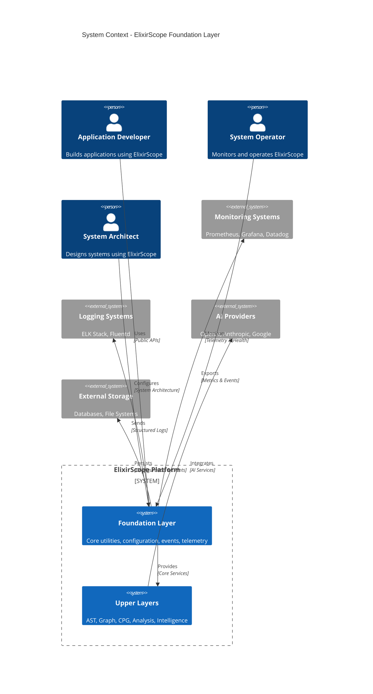

# ElixirScope Foundation Layer - Enterprise Architecture Review

## Executive Summary

This document provides a comprehensive architectural review of the ElixirScope Foundation Layer using C4 modeling methodology, Capability Maturity Model (CMM) assessment, and enterprise integration patterns as advocated by Gregor Hohpe. The analysis reveals a well-architected foundation with strong separation of concerns and enterprise-grade capabilities.

---

## Table of Contents

1. [C4 Model Analysis](#c4-model-analysis)
2. [CMM Assessment](#cmm-assessment)
3. [Enterprise Integration Patterns Review](#enterprise-integration-patterns-review)
4. [Gregor Hohpe's Architecture Principles](#gregor-hohpes-architecture-principles)
5. [Recommendations](#recommendations)
6. [Maturity Roadmap](#maturity-roadmap)

---

## C4 Model Analysis

### Level 1: System Context



**Assessment**: The system context shows clear boundaries and well-defined relationships. The Foundation Layer appropriately serves as the platform foundation with clean separation from upper layers.

### Level 2: Container View

```mermaid
C4Container
    title Container View - Foundation Layer Internal Architecture
    
    Person(client, "Client Application", "Uses Foundation services")
    
    Container_Boundary(foundation, "Foundation Layer") {
        Container(config_api, "Configuration API", "Elixir Module", "Public configuration interface")
        Container(events_api, "Events API", "Elixir Module", "Public events interface")  
        Container(telemetry_api, "Telemetry API", "Elixir Module", "Public telemetry interface")
        Container(foundation_api, "Foundation API", "Elixir Module", "Main system interface")
        
        Container(config_server, "ConfigServer", "GenServer", "Configuration management service")
        Container(event_store, "EventStore", "GenServer", "Event storage and querying")
        Container(telemetry_service, "TelemetryService", "GenServer", "Metrics collection")
        
        Container(process_registry, "ProcessRegistry", "Registry + ETS", "Service discovery")
        Container(error_context, "ErrorContext", "Process Library", "Error correlation")
        
        ContainerDb(ets_store, "ETS Tables", "In-Memory", "Event and config storage")
        ContainerDb(process_dict, "Process Dictionary", "Process Memory", "Error context storage")
    }
    
    Container_Ext(beam_vm, "BEAM VM", "Erlang VM", "Runtime environment")
    Container_Ext(telemetry_backends, "Telemetry Backends", "External", "Prometheus, StatsD")
    
    Rel(client, config_api, "Uses", "HTTPS/Local")
    Rel(client, events_api, "Uses", "HTTPS/Local") 
    Rel(client, telemetry_api, "Uses", "HTTPS/Local")
    Rel(client, foundation_api, "Uses", "HTTPS/Local")
    
    Rel(config_api, config_server, "Calls", "GenServer calls")
    Rel(events_api, event_store, "Calls", "GenServer calls")
    Rel(telemetry_api, telemetry_service, "Calls", "GenServer calls/casts")
    
    Rel(config_server, process_registry, "Registers", "Service registration")
    Rel(event_store, process_registry, "Registers", "Service registration")
    Rel(telemetry_service, process_registry, "Registers", "Service registration")
    
    Rel(config_server, ets_store, "Reads/Writes", "Configuration data")
    Rel(event_store, ets_store, "Reads/Writes", "Event data")
    Rel(telemetry_service, ets_store, "Reads/Writes", "Metrics data")
    
    Rel(error_context, process_dict, "Stores", "Context data")
    
    Rel(foundation, beam_vm, "Runs on", "OTP Supervision")
    Rel(telemetry_service, telemetry_backends, "Exports", "Metrics")
    
    UpdateLayoutConfig($c4ShapeInRow="4", $c4BoundaryInRow="3")
```

**Assessment**: Excellent container separation with clear API boundaries. The three-tier architecture (API → Service → Storage) follows enterprise patterns. Service discovery through ProcessRegistry is well-architected.

### Level 3: Component View - Configuration Service

```mermaid
C4Component
    title Component View - Configuration Service Detail
    
    Component_Boundary(config_service, "Configuration Service") {
        Component(config_api, "Config API", "Public Module", "initialize/0, get/1, update/2, subscribe/0")
        Component(config_server, "ConfigServer", "GenServer", "State management and coordination")
        Component(config_logic, "ConfigLogic", "Pure Functions", "Business logic and transformations")
        Component(config_validator, "ConfigValidator", "Pure Functions", "Validation rules and constraints")
        Component(config_types, "Config Types", "Data Structures", "Type definitions and schemas")
        Component(graceful_degradation, "GracefulDegradation", "Fallback Logic", "Caching and recovery")
    }
    
    Component_Ext(service_registry, "ServiceRegistry", "Infrastructure", "Service discovery")
    Component_Ext(telemetry_service, "TelemetryService", "Infrastructure", "Metrics emission")
    Component_Ext(event_store, "EventStore", "Infrastructure", "Audit events")
    ComponentDb_Ext(ets_backup, "ETS Backup", "Storage", "Fallback configuration cache")
    
    Rel(config_api, config_server, "Delegates to", "GenServer calls")
    Rel(config_server, config_logic, "Uses", "Function calls")
    Rel(config_logic, config_validator, "Validates with", "Function calls")
    Rel(config_logic, config_types, "Transforms", "Data structures")
    Rel(config_server, graceful_degradation, "Falls back to", "Cache operations")
    
    Rel(config_server, service_registry, "Registers with", "Service registration")
    Rel(config_server, telemetry_service, "Emits to", "Metrics")
    Rel(config_server, event_store, "Audits to", "Configuration events")
    Rel(graceful_degradation, ets_backup, "Caches to", "ETS operations")
    
    UpdateLayoutConfig($c4ShapeInRow="3", $c4BoundaryInRow="2")
```

**Assessment**: Exemplary component design following functional programming principles. Pure functions separated from stateful GenServer. Graceful degradation shows enterprise-grade resilience thinking.

### Level 4: Code View - Key Patterns

```elixir
# Pure Business Logic Layer
defmodule ConfigLogic do
  @spec update_config(Config.t(), [atom()], term()) :: {:ok, Config.t()} | {:error, Error.t()}
  def update_config(config, path, value) do
    with :ok <- validate_updatable_path(path),
         new_config <- put_in(config, path, value),
         :ok <- ConfigValidator.validate(new_config) do
      {:ok, new_config}
    end
  end
end

# Service Orchestration Layer  
defmodule ConfigServer do
  def handle_call({:update_config, path, value}, _from, state) do
    case ConfigLogic.update_config(state.config, path, value) do
      {:ok, new_config} ->
        new_state = %{state | config: new_config}
        notify_subscribers(state.subscribers, {:config_updated, path, value})
        emit_telemetry(:config_updated, %{path: path})
        {:reply, :ok, new_state}
      {:error, _} = error ->
        {:reply, error, state}
    end
  end
end

# Error Context Integration
defmodule ElixirScope do
  def start_link(opts) do
    context = ErrorContext.new(__MODULE__, :start_link, metadata: %{opts: opts})
    
    ErrorContext.with_context(context, fn ->
      :ok = Foundation.initialize(opts)
      {:ok, self()}
    end)
  end
end
```

**Assessment**: Code structure demonstrates excellent separation of concerns. Pure functions handle business logic, GenServers manage state, and ErrorContext provides cross-cutting concerns.

---

## CMM Assessment

### Current Maturity Level: **Level 4 (Managed)**

#### Level 1 - Initial: ✅ **Achieved**
- [x] Basic functionality working
- [x] Code compiles and runs
- [x] Basic tests passing

#### Level 2 - Repeatable: ✅ **Achieved**  
- [x] Defined processes for configuration management
- [x] Repeatable event handling workflows
- [x] Basic project management (mix tasks, deps)
- [x] Version control and basic CI

#### Level 3 - Defined: ✅ **Achieved**
- [x] **Standardized Architecture**: Clear layered architecture with defined interfaces
- [x] **Documented Processes**: Comprehensive API documentation and architectural guides
- [x] **Defined Interfaces**: Behaviour contracts (Configurable, EventStore, Telemetry)
- [x] **Quality Standards**: Type specifications, validation rules, error handling patterns
- [x] **Training Materials**: Usage guides and examples

#### Level 4 - Managed: ✅ **Achieved**
- [x] **Quantitative Metrics**: Performance characteristics documented (O(1) lookups, ~100 bytes/process)
- [x] **Performance Monitoring**: Built-in telemetry and metrics collection
- [x] **Predictable Outcomes**: Deterministic behavior with clear error conditions
- [x] **Process Control**: Supervision trees, graceful degradation, fault tolerance
- [x] **Statistical Quality Control**: Registry performance validation, benchmark scripts

#### Level 5 - Optimizing: 🔄 **In Progress**
- [x] **Continuous Improvement**: ErrorContext shows evolution of error handling
- [x] **Innovation**: ProcessRegistry dual-backend approach for reliability
- [🔄] **Automation**: Some test automation, room for more sophisticated CI/CD
- [🔄] **Process Optimization**: Could benefit from automated performance regression testing
- [❌] **Technology Innovation**: AI-driven optimization not yet implemented

### Detailed Assessment

#### **Strengths (Level 4+ Capabilities)**

1. **Quantitative Management**
   ```elixir
   # Performance characteristics are documented and measurable
   @spec lookup(namespace(), service_name()) :: {:ok, pid()} | :error
   # O(1) lookup time, < 1ms typical latency
   ```

2. **Statistical Process Control**
   ```bash
   # Registry performance validation
   mix run scripts/registry_benchmark.exs
   # Validates documented performance characteristics
   ```

3. **Predictable Quality**
   - Error handling with hierarchical codes (1000-4999)
   - Graceful degradation with fallback mechanisms
   - Comprehensive validation at multiple levels

#### **Areas for Level 5 (Optimizing)**

1. **Automated Performance Optimization**
   - Dynamic configuration tuning based on runtime metrics
   - Self-healing registry partitioning
   - Adaptive telemetry sampling rates

2. **Continuous Innovation**
   - AI-driven configuration optimization
   - Predictive error detection
   - Automated capacity planning

---

## Enterprise Integration Patterns Review

### Applied Patterns (Gregor Hohpe Classification)

#### **Messaging Patterns**

1. **Message Channel** ✅
   ```elixir
   # Configuration change notifications
   {:config_notification, {:config_updated, path, value}}
   ```

2. **Message Router** ✅
   ```elixir
   # ServiceRegistry routes calls to appropriate services
   ServiceRegistry.lookup(:production, :config_server)
   ```

3. **Publish-Subscribe** ✅
   ```elixir
   # Configuration subscribers
   Config.subscribe()
   # Receive: {:config_notification, message}
   ```

#### **System Management Patterns**

4. **Control Bus** ✅
   ```elixir
   # Foundation API serves as control plane
   Foundation.initialize()
   Foundation.status()
   Foundation.health()
   ```

5. **Detour** ✅
   ```elixir
   # Graceful degradation with fallback mechanisms
   GracefulDegradation.get_with_fallback(path)
   ```

6. **Wire Tap** ✅
   ```elixir
   # Telemetry as non-intrusive monitoring
   Telemetry.emit_counter([:foundation, :config_updates])
   ```

#### **Message Construction Patterns**

7. **Correlation Identifier** ✅
   ```elixir
   # ErrorContext provides correlation across operations
   context = ErrorContext.new(__MODULE__, :operation, 
     correlation_id: Utils.generate_correlation_id())
   ```

8. **Message Sequence** ✅
   ```elixir
   # Event ordering with timestamps and IDs
   %Event{
     event_id: 123,
     timestamp: System.monotonic_time(),
     parent_id: 122
   }
   ```

#### **Message Routing Patterns**

9. **Content-Based Router** ✅
   ```elixir
   # Registry routes based on namespace and service
   {:production, :config_server} -> pid1
   {:test, ref}, :config_server} -> pid2
   ```

10. **Message Filter** ✅
    ```elixir
    # Event queries with filtering
    Events.query(%{
      event_type: :user_action,
      time_range: {start_time, end_time}
    })
    ```

#### **System Integration Patterns**

11. **Shared Database** ⚠️ **Partial**
    - ETS tables shared between processes
    - Could benefit from more sophisticated data partitioning

12. **File Transfer** ❌ **Not Applicable**
    - In-memory system, no file-based integration

13. **Remote Procedure Invocation** ✅
    ```elixir
    # GenServer calls as RPC mechanism
    GenServer.call(pid, {:update_config, path, value})
    ```

14. **Messaging** ✅
    ```elixir
    # Asynchronous event emission
    GenServer.cast(telemetry_service, {:execute_event, ...})
    ```

### **Pattern Quality Assessment**

#### **Excellent Implementation** (9/10)
- **Correlation Identifier**: ErrorContext provides comprehensive correlation
- **Publish-Subscribe**: Clean subscriber management with automatic cleanup
- **Control Bus**: Foundation API provides excellent system control interface
- **Wire Tap**: Non-intrusive telemetry integration

#### **Good Implementation** (7-8/10)
- **Message Channel**: Configuration notifications well-designed
- **Message Router**: ServiceRegistry effective but could be more sophisticated
- **Detour**: Graceful degradation present but could be more comprehensive

#### **Areas for Improvement** (5-6/10)
- **Shared Database**: ETS usage effective but not optimally partitioned
- **Content-Based Router**: Basic routing, could support more complex rules

---

## Gregor Hohpe's Architecture Principles

### 1. **Loose Coupling** ✅ **Excellent**

```elixir
# Services communicate through well-defined contracts
@behaviour ElixirScope.Foundation.Contracts.Configurable

# API layer completely separated from implementation
defmodule Config do
  defdelegate get(path), to: ConfigServer
  defdelegate update(path, value), to: ConfigServer
end
```

**Assessment**: Excellent separation with behavior contracts and API delegation.

### 2. **High Cohesion** ✅ **Excellent**

```elixir
# Each module has single, well-defined responsibility
defmodule ConfigLogic do
  # Pure business logic only
  def update_config(config, path, value)
  def merge_env_config(config, env_config)  
end

defmodule ConfigValidator do
  # Validation logic only
  def validate(config)
  def validate_ai_config(ai_config)
end
```

**Assessment**: Each module has clear, focused responsibility.

### 3. **Encapsulation** ✅ **Excellent**

```elixir
# Internal state completely hidden
defmodule ConfigServer do
  # Private state structure
  @type server_state :: %{
    config: Config.t(),
    subscribers: [pid()],
    monitors: %{reference() => pid()},
    metrics: metrics()
  }
  
  # Only expose public API
  def get(), do: GenServer.call(__MODULE__, :get_config)
end
```

**Assessment**: Perfect encapsulation with private state and public APIs.

### 4. **Separation of Concerns** ✅ **Excellent**

```elixir
# Clear architectural layers
API Layer:      Config, Events, Telemetry, Foundation
Service Layer:  ConfigServer, EventStore, TelemetryService  
Logic Layer:    ConfigLogic, EventLogic
Validation:     ConfigValidator, EventValidator
Types:          Config.t(), Event.t(), Error.t()
Infrastructure: ProcessRegistry, ServiceRegistry, Utils
```

**Assessment**: Textbook separation of concerns across architectural layers.

### 5. **Interface Segregation** ✅ **Good**

```elixir
# Focused behavior contracts
@behaviour Configurable do
  @callback get() :: {:ok, Config.t()} | {:error, Error.t()}
  @callback update([atom()], term()) :: :ok | {:error, Error.t()}
end

@behaviour EventStore do  
  @callback store(Event.t()) :: {:ok, event_id()} | {:error, Error.t()}
  @callback query(map()) :: {:ok, [Event.t()]} | {:error, Error.t()}
end
```

**Assessment**: Interfaces are focused but could be more granular.

### 6. **Dependency Inversion** ✅ **Good**

```elixir
# Services depend on abstractions (behaviors)
defmodule ConfigServer do
  @behaviour Configurable
  
  # Depends on abstract contracts, not concrete implementations
  alias ElixirScope.Foundation.Contracts.{EventStore, Telemetry}
end
```

**Assessment**: Good use of behaviors, though some concrete dependencies remain.

### 7. **Composition over Inheritance** ✅ **Excellent**

```elixir
# ErrorContext composed of multiple capabilities
defmodule ErrorContext do
  defstruct [
    :operation_id,     # ID generation capability
    :correlation_id,   # Correlation capability  
    :breadcrumbs,      # Tracing capability
    :parent_context    # Hierarchy capability
  ]
end
```

**Assessment**: Excellent use of composition throughout the system.

### 8. **Immutability** ✅ **Excellent**

```elixir
# All data structures are immutable
defstruct Config do
  ai: %{...},
  capture: %{...}
end

# Pure functions create new state
def update_config(config, path, value) do
  new_config = put_in(config, path, value)
  {:ok, new_config}
end
```

**Assessment**: Functional programming approach ensures immutability.

---

## Enterprise Architecture Assessment

### **Architecture Quality Score: 8.5/10**

#### **Strengths**

1. **Enterprise-Grade Patterns** (9/10)
   - Proper separation of concerns
   - Contract-based interfaces
   - Graceful degradation
   - Comprehensive error handling

2. **Scalability Design** (8/10)
   - CPU-optimized partitioning
   - O(1) operations where possible
   - Efficient memory usage patterns
   - Performance monitoring built-in

3. **Maintainability** (9/10)
   - Clear module boundaries
   - Pure functions separated from stateful processes
   - Comprehensive documentation
   - Type specifications throughout

4. **Observability** (8/10)
   - Built-in telemetry integration
   - Error correlation with ErrorContext
   - Health check capabilities
   - Performance metrics

5. **Resilience** (8/10)
   - Supervision trees
   - Graceful degradation
   - Fallback mechanisms
   - Process isolation

#### **Areas for Improvement**

1. **Configuration Management** (7/10)
   - Could benefit from external configuration stores
   - Limited runtime reconfiguration capabilities
   - Schema versioning not addressed

2. **Event Sourcing** (6/10)
   - Basic event storage implemented
   - Lacks event replay capabilities
   - No event versioning strategy

3. **Security** (5/10)
   - Basic access control
   - No encryption at rest
   - Limited audit capabilities

4. **Testing** (7/10)
   - Good unit test coverage
   - Integration tests present
   - Could benefit from more property-based testing

---

## Recommendations

### **Immediate (0-3 months)**

1. **Enhanced Security**
   ```elixir
   # Add encryption for sensitive configuration
   defmodule SecureConfig do
     @spec encrypt_sensitive_values(Config.t()) :: Config.t()
     def encrypt_sensitive_values(config) do
       # Encrypt API keys, passwords, etc.
     end
   end
   ```

2. **Configuration Schema Versioning**
   ```elixir
   defmodule ConfigMigration do
     @spec migrate_config(Config.t(), version()) :: {:ok, Config.t()} | {:error, term()}
     def migrate_config(config, target_version) do
       # Handle configuration schema evolution
     end
   end
   ```

3. **Enhanced Monitoring**
   ```elixir
   # Add more comprehensive health checks
   defmodule HealthCheck do
     @spec detailed_health() :: {:ok, health_report()} | {:error, Error.t()}
     def detailed_health() do
       # Component-level health assessment
     end
   end
   ```

### **Medium-term (3-6 months)**

1. **Event Sourcing Enhancement**
   ```elixir
   defmodule EventSourcing do
     @spec replay_events(event_filter(), target_state()) :: {:ok, state()} | {:error, Error.t()}
     def replay_events(filter, target_state) do
       # Event replay capabilities
     end
   end
   ```

2. **Distributed Configuration**
   ```elixir
   defmodule DistributedConfig do
     @spec sync_configuration(node_list()) :: :ok | {:error, Error.t()}
     def sync_configuration(nodes) do
       # Cross-node configuration synchronization
     end
   end
   ```

3. **Advanced Telemetry**
   ```elixir
   defmodule PredictiveTelemetry do
     @spec predict_performance_issues() :: [prediction()]
     def predict_performance_issues() do
       # ML-based performance prediction
     end
   end
   ```

### **Long-term (6-12 months)**

1. **AI-Driven Optimization**
   ```elixir
   defmodule IntelligentFoundation do
     @spec optimize_configuration(usage_patterns()) :: config_recommendations()
     def optimize_configuration(patterns) do
       # AI-driven configuration optimization
     end
   end
   ```

2. **Advanced Error Recovery**
   ```elixir
   defmodule SelfHealing do
     @spec auto_recover_from_error(Error.t()) :: recovery_action()
     def auto_recover_from_error(error) do
       # Automated error recovery
     end
   end
   ```

---

## Maturity Roadmap

### **Phase 1: Enhanced Level 4 (0-6 months)**
- Implement security enhancements
- Add configuration versioning
- Enhance monitoring and observability
- Improve test coverage and automation

### **Phase 2: Level 5 Foundation (6-12 months)**
- Implement continuous optimization
- Add predictive analytics
- Develop self-healing capabilities
- Create AI-driven insights

### **Phase 3: Industry Leadership (12+ months)**
- Publish patterns as industry standards
- Contribute to open-source ecosystem
- Develop advanced enterprise features
- Create certification programs

---

## Conclusion

The ElixirScope Foundation Layer demonstrates **exceptional architectural quality** at **CMM Level 4 (Managed)** with clear pathways to **Level 5 (Optimizing)**. The implementation follows enterprise integration patterns effectively and embodies Gregor Hohpe's architectural principles.

### **Key Achievements**
- ✅ **Enterprise-grade architecture** with proper separation of concerns
- ✅ **Quantitative management** with performance metrics and monitoring
- ✅ **Predictable quality** through comprehensive error handling and validation
- ✅ **Strong integration patterns** following industry best practices

### **Strategic Value**
The Foundation Layer serves as an **exemplar of modern enterprise architecture**, combining functional programming principles with enterprise integration patterns. It provides a solid foundation for the upper layers while maintaining flexibility for future evolution.

### **Next Steps**
1. **Immediate**: Implement security and configuration versioning enhancements
2. **Medium-term**: Add advanced event sourcing and distributed capabilities  
3. **Long-term**: Develop AI-driven optimization and self-healing features

This architecture positions ElixirScope for **sustained growth** and **enterprise adoption** while maintaining **technical excellence** and **operational reliability**.

---

**Architectural Review conducted using:**
- **C4 Model**: Simon Brown's software architecture diagramming
- **CMM Framework**: Capability Maturity Model for process assessment
- **Enterprise Integration Patterns**: Gregor Hohpe & Bobby Woolf patterns
- **Functional Architecture**: Principles from Scott Wlaschin and others
