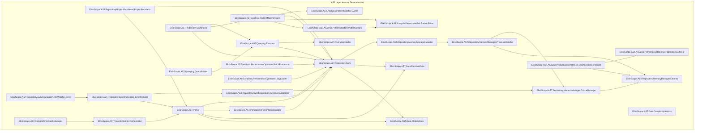
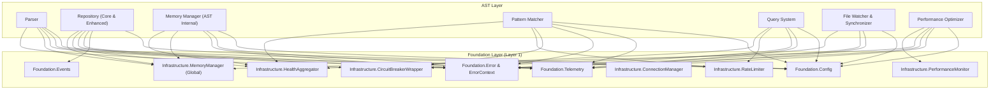

Okay, this is a substantial task that requires synthesizing information from a large number of detailed documents. I will generate the four planning documents outlined in the "Plan: Generating the Staged Test-Driven Prompting Strategy for ElixirScope AST Layer."

Given the volume and detail required for each, I will create them one by one.

First, `PLAN_AST_BLUEPRINT.md`:

```markdown
# PLAN_AST_BLUEPRINT.md - ElixirScope AST Layer Component Blueprint

**Version:** 1.0
**Date:** [Current Date]
**Objective:** To establish a definitive map of all AST layer components, their source file locations, primary responsibilities, OTP roles, and dependencies (internal and external to the Foundation Layer). This document serves as a single source of truth for AST component architecture and interfaces, derived from various `docs/ast/*.md` files, `DEV.md`, and Foundation layer documentation.

**Note on AST_TECH_SPEC.md:** The `AST_TECH_SPEC.md` document, described as "Essential for implementation planning" in `docs/ast/README.md`, was not provided in the context. Details typically found in a technical specification have been inferred from `AST_PRD.md`, `MODULE_INTERFACES_DOCUMENTATION.md`, `DIAGS_AST_EXTENDED.md`, `EST_SCHEMA.md`, and other related documents.

## 1. Component Inventory & OTP Roles

This table inventories AST layer components, mapping them to their file locations (from `DEV.md`), OTP roles (from `docs/ast/SUPERVISION_TREE.md` or inferred), primary responsibilities (from `docs/ast/AST_PRD.md`), and key interfaces (from `docs/ast/MODULE_INTERFACES_DOCUMENTATION.md`).

| Component Area / Specific Component                               | File(s)/Directory (from `DEV.md`)                  | OTP Role (from `SUPERVISION_TREE.md`) | Primary Responsibility (from `AST_PRD.md`, `MODULE_INTERFACES_DOCUMENTATION.md`) | Key Interfaces (Examples from `MODULE_INTERFACES_DOCUMENTATION.md`) |
|-------------------------------------------------------------------|----------------------------------------------------|---------------------------------------|------------------------------------------------------------------------------------|---------------------------------------------------------------------------|
| **Data Structures**                                               | `lib/elixir_scope/ast/data/`                       | Structs/Utility Modules               | Define core AST data representations.                                                | `ModuleData.new/3`, `FunctionData.new/4`, `ComplexityMetrics` fields      |
| `ElixirScope.AST.Data.ModuleData`                                 | `ast/data/module_data.ex`                          | Struct/Module                         | Represents module-level AST data, metadata, and analysis results.                    | `new/3`, `validate/1`, `get_ast/1`                                        |
| `ElixirScope.AST.Data.FunctionData`                               | `ast/data/function_data.ex`                        | Struct/Module                         | Represents function-level AST data, complexity, and patterns.                      | `new/4`, `validate/1`, `get_complexity/1`                                 |
| `ElixirScope.AST.Data.ComplexityMetrics` (implied by PRD/ModuleData) | `ast/data/complexity_metrics.ex` (from `DEV.md`) | Struct/Module                         | Defines and calculates code complexity metrics.                                    | Fields like cyclomatic, cognitive complexity.                             |
| `ElixirScope.AST.Data.ModuleAnalysis` (components)                | `ast/data/module_analysis/` (from `DEV.md`)        | Utility Modules                       | Components for module-level static analysis (e.g., type detection, exports).     | `ASTAnalyzer.analyze_module_type/1`, `ASTAnalyzer.extract_exports/1`      |
| **Repository System**                                             | `lib/elixir_scope/ast/repository/`                 | Supervisors, GenServers, Modules      | Storage, retrieval, and management of AST data; project population; synchronization. |                                                                           |
| `ElixirScope.AST.Repository.Supervisor`                           | `ast/repository/supervisor.ex` (inferred)          | Supervisor                            | Supervises core repository services and memory management.                         | `start_link/1`, `init/1`                                                  |
| `ElixirScope.AST.Repository.Core`                                 | `ast/repository/core.ex`                           | GenServer                             | Core ETS-based storage for AST modules, functions, nodes, and correlations.      | `store_module/2`, `get_module/2`, `correlate_event/3`                     |
| `ElixirScope.AST.Repository.Enhanced`                             | `ast/repository/enhanced.ex`                       | GenServer (likely, or Facade)         | Advanced analytics, cross-module analysis, complex querying over core repository.  | `analyze_project/2`, `find_pattern_matches/3`                             |
| `ElixirScope.AST.Repository.ProjectPopulation.ProjectPopulator`   | `ast/repository/project_populator.ex` (from `DEV.md` path `ast/repository/builder/project_populator.ex`, assuming module rename/refactor) | GenServer/Module | Discovers and analyzes entire project structures, builds dependency graphs.      | `populate_project/2`, `discover_source_files/2`                           |
| `ElixirScope.AST.Repository.Synchronization.FileWatcher.Core`       | `ast/repository/synchronizer.ex` (from `DEV.md` path `ast/cpg/file_watcher.ex`, adapting for AST sync) & `ast/repository/file_watcher/core.ex` (inferred) | GenServer | Monitors file system changes for real-time AST updates.                      | `start_watching/1`, `process_file_event/1`                                |
| `ElixirScope.AST.Repository.Synchronization.Synchronizer`         | `ast/repository/synchronizer.ex` (from `DEV.md` path `ast/cpg/synchronizer.ex`, adapting) | GenServer | Coordinates incremental updates based on file changes, resolves conflicts.       | `sync_file/1`, `apply_incremental_update/1`                               |
| `ElixirScope.AST.Repository.Synchronization.IncrementalUpdater`   | `ast/repository/synchronizer.ex` (from `DEV.md` path `ast/cpg/synchronizer.ex` as part of sync functionality) | Module/GenServer | Handles incremental AST updates, cache invalidation, dependency tracking.    | `process_incremental_update/1`, `analyze_update_dependencies/1`           |
| **Memory Management System** (`within Repository`)                | `lib/elixir_scope/ast/memory_manager/` (from `DEV.md`) | Supervisor, GenServers, Modules   | Monitors and manages memory usage for AST components, pressure response.         |                                                                           |
| `ElixirScope.AST.Repository.MemoryManager.Supervisor`             | `ast/memory_manager/supervisor.ex` (inferred)      | Supervisor (`rest_for_one`)           | Supervises memory management components.                                           | `start_link/1`, `init/1`                                                  |
| `ElixirScope.AST.Repository.MemoryManager.Monitor`                | `ast/memory_manager/monitor.ex` (inferred based on `MODULE_INTERFACES`) | GenServer | Continuously monitors memory, tracks ETS sizes, reports to Foundation.           | `report_memory_usage/0`, `handle_pressure_signal/1`                       |
| `ElixirScope.AST.Repository.MemoryManager.CacheManager`           | `ast/memory_manager/cache_manager.ex` (inferred)   | GenServer                             | Manages AST caches (query, pattern), implements eviction policies (LRU, TTL).    | `get_from_cache/2`, `put_in_cache/3`, `evict_lru_entries/2`               |
| `ElixirScope.AST.Repository.MemoryManager.Cleaner`                | `ast/memory_manager/cleaner.ex` (inferred)         | Module/GenServer (temporary)          | Performs data cleanup tasks based on memory pressure or schedule.                | `cleanup_unused_data/1`, `compress_cold_storage/0`                        |
| `ElixirScope.AST.Repository.MemoryManager.PressureHandler`        | `ast/memory_manager/pressure_handler.ex` (inferred) | GenServer                             | Responds to memory pressure signals, orchestrates cleanup actions.               | `handle_pressure_level/1`, `execute_pressure_actions/1`                   |
| **Parsing System**                                                | `lib/elixir_scope/ast/parser.ex` and `ast/compiler/` | Modules, Supervisor, GenServers     | Parses Elixir source code, enhances AST, extracts instrumentation points.      |                                                                           |
| `ElixirScope.AST.Parsing.Supervisor`                              | `ast/parsing/supervisor.ex` (inferred)             | Supervisor (`one_for_one`)            | Supervises core parsing services.                                                  | `start_link/1`, `init/1`                                                  |
| `ElixirScope.AST.Parser` (Core Parser)                            | `ast/parser.ex`                                    | Module/GenServer                      | Parses Elixir source into AST, assigns node IDs, extracts instrumentation points. | `parse_source/2`, `parse_file/2`, `assign_node_ids/1`                     |
| `ElixirScope.AST.Parsing.InstrumentationMapper`                   | `ast/parser.ex` (part of parser or `ast/compiler/` from `DEV.md`) | Module | Maps AST nodes to runtime instrumentation points, builds correlation index.      | `identify_instrumentation_points/1`, `create_correlation_mapping/1`       |
| `ElixirScope.AST.Parsing.BatchProcessor`                          | `ast/parsing/supervisor.ex` (as a worker type or separate GenServer) | GenServer (transient) / Pool | Handles batch parsing of multiple files.                                       | `parse_files_batch/2` (from `Parser` interface)                           |
| **Pattern Matching System**                                       | `lib/elixir_scope/ast/pattern_matcher/` (from `DEV.md`) & `ast/analysis/pattern_matcher/` | Supervisor, GenServers, Modules | Detects AST, behavioral, and anti-patterns in code.                        |                                                                           |
| `ElixirScope.AST.Analysis.Supervisor`                             | `ast/analysis/supervisor.ex` (inferred)            | Supervisor                            | Supervises Pattern Matcher and Performance Optimizer.                            | `start_link/1`, `init/1`                                                  |
| `ElixirScope.AST.Analysis.PatternMatcher.Supervisor`              | `ast/analysis/pattern_matcher/supervisor.ex` (inferred) | Supervisor (`one_for_one`)        | Supervises pattern matching engine, library, cache, and worker pool.           | `start_link/1`, `init/1`                                                  |
| `ElixirScope.AST.Analysis.PatternMatcher.Core`                    | `ast/pattern_matcher/core.ex` (from `MODULE_INTERFACES`) | GenServer | Core engine for matching AST, behavioral, and anti-patterns with timing.       | `match_ast_pattern_with_timing/2`, `match_behavioral_pattern_with_timing/3` |
| `ElixirScope.AST.Analysis.PatternMatcher.PatternLibrary`          | `ast/pattern_matcher/pattern_library.ex` (from `MODULE_INTERFACES`) | GenServer/Module | Manages pre-defined and custom pattern definitions.                            | `register_pattern/1`, `get_pattern/1`, `list_patterns/0`                  |
| `ElixirScope.AST.Analysis.PatternMatcher.Cache`                   | `ast/pattern_matcher/cache.ex` (from `MODULE_INTERFACES`) | GenServer | Caches pattern analysis results for performance.                               | `warm_pattern_cache/2`, `clear_pattern_cache/1`                           |
| `ElixirScope.AST.Analysis.PatternMatcher.WorkerPool`              | `ast/analysis/pattern_matcher/supervisor.ex` (managed by it) | DynamicSupervisor (`simple_one_for_one`) | Manages temporary worker processes for concurrent pattern analysis.          | (Internal to Supervisor)                                                  |
| `ElixirScope.AST.Analysis.PatternMatcher.Worker`                  | `ast/analysis/pattern_matcher/worker.ex` (inferred) | GenServer (temporary)                 | Performs individual pattern analysis tasks.                                      | (Internal, task-based)                                                    |
| `ElixirScope.AST.Analysis.PatternMatcher.PatternRules`            | `ast/pattern_matcher/pattern_rules.ex` (from `MODULE_INTERFACES`) | Module | Custom pattern rule engine for complex matching logic.                         | `define_rule/1`, `execute_rules/2`                                        |
| **Query System**                                                  | `lib/elixir_scope/ast/query_builder/` (from `DEV.md`) & `ast/querying/` | Supervisor, GenServers, Modules | Provides an API for querying AST data.                                       |                                                                           |
| `ElixirScope.AST.Querying.Supervisor`                             | `ast/querying/supervisor.ex` (inferred)            | Supervisor (`one_for_one`)            | Supervises query executor, cache, and worker pool.                             | `start_link/1`, `init/1`                                                  |
| `ElixirScope.AST.Querying.QueryBuilder`                           | `ast/query_builder/query_builder.ex` (from `MODULE_INTERFACES`, path adapted) | Module | Fluent API for constructing complex AST queries.                               | `new/0`, `from/2`, `select/2`, `where/2`, `execute/2`                     |
| `ElixirScope.AST.Querying.Executor`                               | `ast/querying/executor.ex` (from `MODULE_INTERFACES`) | GenServer/Module | Executes queries against the repository, handles optimization.               | `execute_query/2`, `create_execution_plan/1`                              |
| `ElixirScope.AST.Querying.Cache`                                  | `ast/querying/cache.ex` (from `MODULE_INTERFACES`) | GenServer | Caches query results.                                                          | `cache_query_result/2`, `get_cached_result/1`                             |
| `ElixirScope.AST.Querying.WorkerPool`                             | `ast/querying/supervisor.ex` (managed by it)       | DynamicSupervisor (`simple_one_for_one`) | Manages temporary worker processes for concurrent query execution.         | (Internal to Supervisor)                                                  |
| `ElixirScope.AST.Querying.Worker`                                 | `ast/querying/worker.ex` (inferred)                | GenServer (temporary)                 | Performs individual query execution tasks.                                     | (Internal, task-based)                                                    |
| **Performance Optimization System**                               | `lib/elixir_scope/ast/performance_optimizer/` (from `DEV.md`) & `ast/analysis/performance_optimizer/` | Supervisor, GenServers, Modules | Optimizes AST operations through batching, lazy loading, and scheduling.     |                                                                           |
| `ElixirScope.AST.Analysis.PerformanceOptimizer.Supervisor`        | `ast/analysis/performance_optimizer/supervisor.ex` (inferred) | Supervisor (`one_for_one`) | Supervises performance optimization components.                                | `start_link/1`, `init/1`                                                  |
| `ElixirScope.AST.Analysis.PerformanceOptimizer.BatchProcessor`    | `ast/performance_optimizer/batch_processor.ex` (from `MODULE_INTERFACES`) | GenServer | Manages batch processing of operations for efficiency.                         | `submit_batch/2`, `get_batch_status/1`                                    |
| `ElixirScope.AST.Analysis.PerformanceOptimizer.LazyLoader`        | `ast/performance_optimizer/lazy_loader.ex` (from `MODULE_INTERFACES`) | Module/GenServer | Implements lazy loading for expensive analysis data.                           | `load_on_demand/2`, `pre_load_data/1`                                     |
| `ElixirScope.AST.Analysis.PerformanceOptimizer.OptimizationScheduler` | `ast/performance_optimizer/optimization_scheduler.ex` (from `MODULE_INTERFACES`) | GenServer | Schedules and prioritizes optimization tasks.                                | `schedule_optimization/2`, `get_queue_status/0`                           |
| `ElixirScope.AST.Analysis.PerformanceOptimizer.StatisticsCollector` | `ast/performance_optimizer/statistics_collector.ex` (from `MODULE_INTERFACES`) | GenServer | Collects and analyzes performance statistics.                                | `record_metric/3`, `get_performance_report/0`                             |
| **AST Transformation (Compiler)**                                   | `lib/elixir_scope/ast/compiler/` (from `DEV.md`)     | Modules                               | Transforms AST for instrumentation or optimization.                            | `transform_ast/2`, `inject_instrumentation/2` (from `MODULE_INTERFACES`)  |
| `ElixirScope.AST.Transformation.Orchestrator`                     | `ast/compiler/orchestrator.ex` (from `MODULE_INTERFACES`, path adapted) | Module | Coordinates complex AST transformation pipelines.                              | `orchestrate_transformation/3`, `validate_pipeline/1`                     |
| **Compile-Time Orchestration**                                    | `lib/elixir_scope/ast/compile_time/` (from `DEV.md`) | Modules                               | Manages compile-time AST processing and integration with Elixir compiler.    | `before_compile_hook/1`, `after_compile_hook/1` (from `MODULE_INTERFACES`) |
| `ElixirScope.AST.CompileTime.HookManager`                         | `ast/compile_time/hook_manager.ex` (from `MODULE_INTERFACES`, path adapted) | Module | Manages hooks into the Elixir compilation process.                           | `register_compile_hook/3`, `execute_hooks/2`                              |
| **Task Supervisor**                                               | (part of `ElixirScope.AST.Supervisor`)             | `Task.Supervisor`                     | Manages ad-hoc, temporary tasks within the AST layer.                          | `Task.Supervisor.start_child/3`                                           |

*Note: Some module paths are inferred based on `MODULE_INTERFACES_DOCUMENTATION.md` and standard Elixir project structure if not explicitly detailed in `DEV.md`'s AST section. `DEV.md` also mentions `ast/enhanced/` and `ast/data/module_analysis/` which have been incorporated.*
*The `DEV.md` mentions `ast/repository/core.ex` and `ast/repository/enhanced.ex` which map well. The `ast/repository/builder/` seems to contain project population and analysis logic which has been mapped to `ProjectPopulator` and related analyzers.*
*The `DEV.md` mentions `ast/compiler/` as `(old ast/)` and `ast/compile_time/`. These are mapped to Transformation and Compile-Time Orchestration.*

## 2. Internal AST Layer Dependencies

This section outlines dependencies *within* the AST layer.



**Dependency Table (Selected Examples):**

| Component A                                                 | Depends On (Component B)                                      | Nature of Dependency                                                                 |
|-------------------------------------------------------------|---------------------------------------------------------------|--------------------------------------------------------------------------------------|
| `ElixirScope.AST.Parser`                                    | `ElixirScope.AST.Repository.Core`                             | Stores parsed AST data.                                                              |
| `ElixirScope.AST.Repository.Enhanced`                       | `ElixirScope.AST.Repository.Core`                             | Retrieves data from Core for advanced analysis.                                      |
| `ElixirScope.AST.Repository.Enhanced`                       | `ElixirScope.AST.Analysis.PatternMatcher.Core`                | Invokes pattern matching on AST data.                                                |
| `ElixirScope.AST.Analysis.PatternMatcher.Core`              | `ElixirScope.AST.Repository.Core`                             | Fetches AST data to perform pattern matching.                                        |
| `ElixirScope.AST.Querying.Executor`                         | `ElixirScope.AST.Repository.Core`                             | Executes queries against data stored in the Core Repository.                         |
| `ElixirScope.AST.Repository.MemoryManager.Monitor`          | `ElixirScope.AST.Repository.MemoryManager.PressureHandler`    | Sends memory pressure signals.                                                       |
| `ElixirScope.AST.Repository.Synchronization.Synchronizer`   | `ElixirScope.AST.Parser`                                      | Parses changed files.                                                                |
| `ElixirScope.AST.Repository.Synchronization.FileWatcher.Core` | `ElixirScope.AST.Repository.Synchronization.Synchronizer`   | Sends file change events.                                                            |
| `ElixirScope.AST.Transformation.Orchestrator`               | `ElixirScope.AST.Parser`                                      | Uses parser for initial AST and potentially re-parsing after transformations.      |
| `ElixirScope.AST.Repository.Core`                           | `ElixirScope.AST.Data.ModuleData`, `ElixirScope.AST.Data.FunctionData` | Uses these structs for storing data.                                               |

*(This is a simplified representation; a full dependency matrix would be very large. The Mermaid diagram gives a good visual overview.)*

## 3. External Dependencies (Foundation Layer)

This section details how AST Layer components depend on and integrate with the Foundation Layer.



**Dependency Table (Illustrative):**

| AST Component                                            | Depends On (Foundation Service/Module)                      | Contract Reference (from `AST_FOUNDATION_API_ENHANCED.md` unless noted) | Purpose of Dependency                                                                 |
|----------------------------------------------------------|-------------------------------------------------------------|-------------------------------------------------------------------------|---------------------------------------------------------------------------------------|
| All Major AST GenServers/Modules                         | `Foundation.Config`                                         | Section 1.1, 8                                                          | Reading AST-specific configurations (e.g., parser timeouts, memory thresholds).     |
| All Major AST GenServers/Modules                         | `Foundation.Error`, `Foundation.ErrorContext`               | Section 4                                                               | Standardized error reporting, context propagation.                                  |
| All Major AST GenServers/Modules                         | `Foundation.Telemetry` (via `TelemetryCollector` facade)    | Section 5                                                               | Emitting standardized performance and operational metrics.                            |
| All Major AST GenServers (e.g., `Repository.Core`)       | `Infrastructure.HealthAggregator`                           | Section 2.1, 6                                                          | Registering for health checks, reporting health status.                             |
| `ElixirScope.AST.Repository.MemoryManager.Monitor`       | `Infrastructure.MemoryManager` (Global)                     | Section 2.2, 7, 3.1                                                     | Reporting AST-specific memory usage, responding to global memory pressure signals.  |
| `ElixirScope.AST.Parser` (for large files)               | `Infrastructure.MemoryManager` (Global)                     | Section 7.3                                                             | Requesting memory allocation for large parsing operations.                            |
| `ElixirScope.AST.Querying.Executor` (for complex queries) | `Infrastructure.RateLimiter`                                | Section 3.2, 11.2 (implied)                                             | Applying rate limits to resource-intensive queries.                                   |
| `ElixirScope.AST.Repository.Synchronization.FileWatcher` | `Infrastructure.CircuitBreakerWrapper`                      | Section 3.3                                                             | Protecting file system operations (e.g., parsing changed files).                      |
| `ElixirScope.AST.Parser` (for external fetching)         | `Infrastructure.ConnectionManager` (via `HTTPClient` facade) | Section 11.1                                                            | Managing HTTP connections for fetching remote code/schemas.                             |
| `ElixirScope.AST.Analysis.PerformanceOptimizer`          | `Infrastructure.PerformanceMonitor`                         | Section 2.3                                                             | Contributing performance metrics for global analysis and optimization decisions.    |
| Components performing batch operations                   | `Foundation.Events`                                         | Section 9                                                               | Emitting events for analysis completion, errors, significant state changes.         |

*References to `HTTPClient` and `ResourcePool` in `AST_FOUNDATION_API_ENHANCED.md` (Sections 11.1, 11.2) imply these are facades provided by Foundation, likely built on `Infrastructure.ConnectionManager` and a generic pool manager respectively.*

## 4. Core Data Structures Overview

| Data Structure Name           | Defining Module (`ElixirScope.AST.Data.*`) | Primary Consumers within AST                                                                 | ETS Storage (`EST_SCHEMA.md`)                                                                        | Core Purpose                                                                                             |
|-------------------------------|--------------------------------------------|----------------------------------------------------------------------------------------------|------------------------------------------------------------------------------------------------------|----------------------------------------------------------------------------------------------------------|
| `ModuleData`                  | `ModuleData`                               | `Repository.Core`, `Repository.Enhanced`, `Parser`, `PatternMatcher`, `ProjectPopulator`   | Stored in `:ast_modules` table. Key: `module_name`. Value contains `ModuleData.t()` and metadata.      | Represents a parsed Elixir module, its AST, functions, dependencies, and analysis results.               |
| `FunctionData`                | `FunctionData`                             | `Repository.Core`, `Repository.Enhanced`, `Parser`, `PatternMatcher`                       | Stored in `:ast_functions` table. Key: `{module, function, arity}`. Value contains `FunctionData.t()`. | Represents a parsed function within a module, its AST, complexity, calls, and patterns.                  |
| `ASTNode` (implied)           | (Internal to Parser/Repository)            | `Parser`, `Repository.Core`, `InstrumentationMapper`, `PatternMatcher`                       | Stored in `:ast_nodes` table. Key: `ast_node_id`. Value contains AST fragment and metadata.            | Represents an individual, identifiable node within an AST, used for fine-grained analysis & correlation. |
| `ComplexityMetrics`           | `ComplexityMetrics`                        | `ModuleData`, `FunctionData`, `Analysis Engine`                                              | Often embedded within `ModuleData` or `FunctionData` records, or cached in `:complexity_cache`.      | Encapsulates various code complexity scores (cyclomatic, cognitive, etc.).                             |
| `InstrumentationPoint`        | (Internal to `InstrumentationMapper`)      | `InstrumentationMapper`, `Repository.Core`                                                   | Stored in `:instrumentation_map` or embedded within `ModuleData`/`FunctionData`.                       | Maps AST locations to potential runtime instrumentation points for correlation.                          |
| `CorrelationRecord` (implied) | (Internal to `Repository.Core`)            | `Repository.Core`, `InstrumentationMapper`                                                   | Stored in `:correlation_index` table. Key: `correlation_id`. Value links to `ast_node_id`.             | Links runtime correlation IDs to static AST node IDs.                                                    |
| `PatternMatch` (implied)      | (Internal to `PatternMatcher`)             | `PatternMatcher`, `Repository.Enhanced`                                                      | Cached in `:pattern_cache`. Key: `{module_name, pattern_type, pattern_version}`.                       | Represents a detected code pattern within the AST.                                                       |
| `Query` (from `MIGRATION_INTEGRATION_CO_PRD`) | `Querying.Types` (inferred)              | `QueryBuilder`, `QueryExecutor`                                                              | Not directly stored; represents a query to be executed. Results cached in `:query_cache`.            | Defines the structure for querying AST data.                                                             |

---
```

Next, `PLAN_AST_ROADMAP.md`:

```markdown
# PLAN_AST_ROADMAP.md - ElixirScope AST Layer Staged Implementation Roadmap

**Version:** 1.0
**Date:** [Current Date]
**Objective:** To define a phased approach for prompting the AST layer's implementation, ensuring each phase is manageable, testable, and builds logically on the previous one. This roadmap aligns with the `REQ-*.md` documents.

## Overall Staging Philosophy

The AST layer will be implemented in five distinct phases, as outlined in the `REQ-01` through `REQ-05` documents. This approach allows for incremental development, testing, and integration of core functionalities. Each phase aims to deliver a stable and verifiable set of components.

1.  **Phase 1: Core Repository & Data Structures (`REQ-01-CORE-REPOSITORY.md`)**
    *   **Focus:** Establishing the foundational data storage mechanisms and core data models for AST representation.
    *   **Deliverable:** A functional ETS-based repository capable of storing and retrieving module, function, and AST node data, along with the primary data structure definitions.
2.  **Phase 2: Parsing & Basic Queries (`REQ-02-PARSING-QUERIES.md`)**
    *   **Focus:** Implementing the AST parsing engine, including AST enhancement for instrumentation, and a basic query system.
    *   **Deliverable:** A parser that can process Elixir code into enhanced ASTs and a query engine to retrieve basic information from the repository.
3.  **Phase 3: Pattern Matching Engine (`REQ-03-PATTERN-MATCHING.md`)**
    *   **Focus:** Building the core pattern matching engine and analysis capabilities.
    *   **Deliverable:** An engine capable of detecting AST, behavioral, and anti-patterns, with a manageable pattern library.
4.  **Phase 4: Advanced Features & Optimization (`REQ-04-ADVANCED-FEATURES.md`)**
    *   **Focus:** Implementing advanced analytics, sophisticated memory management, batch project analysis, and performance optimizations.
    *   **Deliverable:** An enhanced repository with deep analytics, a resilient memory management system, and optimized batch processing.
5.  **Phase 5: Incremental Synchronization & Production Readiness (`REQ-05-INCREMENTAL-SYNC.md`)**
    *   **Focus:** Enabling real-time updates through file watching, incremental processing, and final production hardening.
    *   **Deliverable:** A fully synchronized AST layer capable of real-time analysis, ready for production deployment.

---

## Detailed Phase Breakdown

### Phase 1: Core Repository & Data Structures

*   **Goal:** Establish the foundational data storage (ETS tables) and core data models (`ModuleData`, `FunctionData`) for the AST layer.
*   **Source REQ Document:** `docs/ast/REQ-01-CORE-REPOSITORY.md`
*   **Target AST Components (from `PLAN_AST_BLUEPRINT.md`):**
    *   `ElixirScope.AST.Data.ModuleData`
    *   `ElixirScope.AST.Data.FunctionData`
    *   `ElixirScope.AST.Data.SharedDataStructures` (for common types like `ast_node_id`, `correlation_id`)
    *   `ElixirScope.AST.Data.SupportingStructures` (for `InstrumentationPoint` definition)
    *   `ElixirScope.AST.Repository.Core` (GenServer and ETS table management)
    *   `ElixirScope.AST.Repository.Supervisor` (partially, to supervise `Core`)
*   **Key Requirements & Functionalities (from `AST_PRD.md`, `REQ-01`):**
    *   `FR-1.1`: Module Data Storage (ETS, O(1) lookup).
    *   `FR-1.2`: Function Data Storage (ETS, efficient retrieval).
    *   `FR-1.3`: AST Node Mapping (storage for `ast_node_id`, correlation mapping stubs).
    *   `FR-1.4`: Repository Lifecycle Management (GenServer, ETS creation, basic stats, health check stub).
    *   Define `ModuleData.t()` and `FunctionData.t()` structs (as per `AST_PRD.md` Section 3.1 and `MODULE_INTERFACES_DOCUMENTATION.md` Section 5).
    *   Implement ETS table schema as per `docs/ast/EST_SCHEMA.md` for `:ast_modules`, `:ast_functions`, `:ast_nodes`, `:correlation_index`.
*   **Module Interfaces to Implement/Update (from `MODULE_INTERFACES_DOCUMENTATION.md`):**
    *   `ElixirScope.AST.Data.ModuleData`: `new/3` (basic), `validate/1` (basic).
    *   `ElixirScope.AST.Data.FunctionData`: `new/4` (basic), `validate/1` (basic).
    *   `ElixirScope.AST.Repository.Core`: `start_link/1`, `init/1`, `store_module/2`, `get_module/2`, `store_function/2`, `get_function/2`, `store_ast_node/3`, `get_ast_node/2`, `correlate_event/3`, `get_correlation/2`, `health_check/0` (stub), `get_statistics/0` (basic).
*   **Foundation Integration Points (from `AST_FOUNDATION_API_ENHANCED.md`, `CURSOR_COMPLETED_INFRASTRUCTURE.md`):**
    *   Error Handling: All functions return `{:ok, value} | {:error, %Foundation.Error{}}` (Section 4).
    *   Configuration: Read basic repository settings (e.g., ETS options) from `Foundation.Config` (Section 1.1, 8).
    *   Telemetry: Basic telemetry for store/get operations (Section 5).
    *   Health Checks: Implement `HealthCheckable` behaviour stub for `Repository.Core` (Section 2.1, 6).
*   **OTP/Supervision Considerations (from `SUPERVISION_TREE.md`):**
    *   Implement `ElixirScope.AST.Repository.Supervisor` to start `ElixirScope.AST.Repository.Core`.
    *   `Repository.Core` as a GenServer.
*   **"Layer Stability" Plan for This Phase:**
    *   Modules `ModuleData`, `FunctionData`, `Repository.Core` will be compilable.
    *   Tests:
        *   Unit tests for `ModuleData.new/3`, `FunctionData.new/4`.
        *   Unit tests for `Repository.Core` GenServer lifecycle, CRUD operations for modules/functions/nodes, basic correlation.
        *   Contract tests for `Repository.Core` implementing `HealthCheckable` (basic version).
        *   Integration tests for `Repository.Core` storing and retrieving `ModuleData` and `FunctionData`.
*   **Success Metrics for This Phase:**
    *   `ModuleData`, `FunctionData`, `Repository.Core`, `Repository.Supervisor` compile without warnings.
    *   Dialyzer passes for these modules.
    *   All defined unit, integration, and contract tests pass.
    *   ETS tables (`:ast_modules`, `:ast_functions`, `:ast_nodes`, `:correlation_index`) are created and managed by `Repository.Core`.
    *   Core CRUD operations for modules and functions are functional. Basic AST node and correlation storage is possible.
    *   Basic Foundation `Config` reading and `Error` type usage demonstrated.

---

### Phase 2: Parsing & Basic Queries

*   **Goal:** Implement the AST parsing engine, including AST enhancement for instrumentation, and a basic query system capable of retrieving data from the Phase 1 repository.
*   **Source REQ Document:** `docs/ast/REQ-02-PARSING-QUERIES.md`
*   **Target AST Components (from `PLAN_AST_BLUEPRINT.md`):**
    *   `ElixirScope.AST.Parser` (Core Parser)
    *   `ElixirScope.AST.Parsing.InstrumentationMapper`
    *   `ElixirScope.AST.Parsing.Analysis.ASTAnalyzer` (and other analyzers like `ComplexityCalculator`, `DependencyExtractor` from `REQ-02`)
    *   `ElixirScope.AST.Querying.QueryBuilder` (basic API)
    *   `ElixirScope.AST.Querying.Executor` (basic execution)
    *   `ElixirScope.AST.Querying.Types`
    *   `ElixirScope.AST.Querying.Validator`
    *   `ElixirScope.AST.Parsing.Supervisor`
    *   `ElixirScope.AST.Querying.Supervisor` (partially, to supervise Executor/Cache stubs)
*   **Key Requirements & Functionalities (from `AST_PRD.md`, `REQ-02`):**
    *   `FR-2.1`: AST Enhancement with Node IDs.
    *   `FR-2.2`: Instrumentation Point Extraction.
    *   `FR-2.3`: Correlation Index Building (using `Repository.Core` from Phase 1).
    *   `FR-2.4`: Basic Analysis Pipeline (exports, module type, dependencies, basic complexity).
    *   `FR-2.5`: Query Builder Interface (FROM, WHERE, ORDER BY, LIMIT, SELECT).
    *   `FR-2.6`: Query Execution Engine (module & function queries, filtering, ordering, pagination).
    *   `NFR-2.1`: Basic Parsing Performance targets.
    *   `NFR-2.2`: Basic Query Performance targets.
*   **Module Interfaces to Implement/Update (from `MODULE_INTERFACES_DOCUMENTATION.md`):**
    *   `ElixirScope.AST.Parser`: `parse_source/2`, `parse_file/2`, `assign_node_ids/1`, `extract_instrumentation_points/1`, `build_correlation_index/2` (may be part of `InstrumentationMapper`).
    *   `ElixirScope.AST.Parsing.InstrumentationMapper`: `identify_instrumentation_points/1`, `create_correlation_mapping/1`.
    *   `ElixirScope.AST.Parsing.Analysis.ASTAnalyzer`: `analyze_module_type/1`, `extract_exports/1`, `extract_callbacks/1`.
    *   `ElixirScope.AST.Querying.QueryBuilder`: `new/0`, `from/2`, `select/2`, `where/2`, `order_by/3`, `limit/2`, `offset/2`, `execute/2`.
    *   `ElixirScope.AST.Querying.Executor`: `execute_query/2` (internal), `create_execution_plan/1` (basic).
*   **Foundation Integration Points:**
    *   Error Handling: Consistent use of `Foundation.Error`.
    *   Telemetry: Metrics for parsing duration, query execution time (Section 5).
    *   Health Checks: Implement `HealthCheckable` for `Parser` and `QueryExecutor` (stubs).
*   **OTP/Supervision Considerations:**
    *   Implement `ElixirScope.AST.Parsing.Supervisor` for `Parser`.
    *   Implement `ElixirScope.AST.Querying.Supervisor` for `QueryExecutor` and `QueryCache` (cache can be a simple GenServer initially).
*   **"Layer Stability" Plan for This Phase:**
    *   Parsing modules and Querying modules will be compilable and integrated with Phase 1 Repository.
    *   Tests:
        *   Unit tests for `Parser` logic (node ID assignment, instrumentation extraction).
        *   Unit tests for `InstrumentationMapper` logic.
        *   Unit tests for `ASTAnalyzer` functions.
        *   Unit tests for `QueryBuilder` API (constructing valid query structs).
        *   Unit tests for `QueryExecutor` (basic filtering/ordering on mocked repository data).
        *   Integration tests: `Parser` -> `Repository.Core` (storing parsed/enhanced AST). `QueryExecutor` -> `Repository.Core` (retrieving data).
*   **Success Metrics for This Phase:**
    *   Parsing and Querying system modules compile. Dialyzer passes.
    *   All defined tests pass.
    *   Elixir code can be parsed into an enhanced AST, and stored in the repository.
    *   Instrumentation points and correlation data are generated and stored.
    *   Basic queries (filter by module name, function name, complexity) can be executed successfully against the repository.
    *   `REQ-02` functional requirements met.

---

### Phase 3: Pattern Matching Engine

*   **Goal:** Build the core pattern matching engine with capabilities for AST, behavioral, and anti-pattern detection, including a basic pattern library and result caching.
*   **Source REQ Document:** `docs/ast/REQ-03-PATTERN-MATCHING.md`
*   **Target AST Components:**
    *   `ElixirScope.AST.Analysis.PatternMatcher.Core`
    *   `ElixirScope.AST.Analysis.PatternMatcher.Types` (Pattern specs, results)
    *   `ElixirScope.AST.Analysis.PatternMatcher.Validators`
    *   `ElixirScope.AST.Analysis.PatternMatcher.Analyzers` (algorithms for different pattern types)
    *   `ElixirScope.AST.Analysis.PatternMatcher.PatternLibrary`
    *   `ElixirScope.AST.Analysis.PatternMatcher.PatternRules`
    *   `ElixirScope.AST.Analysis.PatternMatcher.Cache`
    *   `ElixirScope.AST.Analysis.PatternMatcher.Stats`
    *   `ElixirScope.AST.Analysis.PatternMatcher.Config`
    *   `ElixirScope.AST.Analysis.Supervisor`
    *   `ElixirScope.AST.Analysis.PatternMatcher.Supervisor` (and its WorkerPool/Worker)
*   **Key Requirements & Functionalities:**
    *   `FR-3.1`: Core Pattern Matching Engine (with timing).
    *   `FR-3.2`: Pattern Type System.
    *   `FR-3.3`: Pattern Library Management (ETS-based, custom pattern registration).
    *   `FR-3.4`: Advanced Pattern Analysis (structural, behavioral, anti-patterns, confidence scoring).
    *   `FR-3.5`: Pattern Result Caching (SHOULD).
    *   `NFR-3.1`: Basic Pattern Matching Performance.
    *   `NFR-3.3`: Basic Analysis Accuracy.
*   **Module Interfaces to Implement/Update:**
    *   `ElixirScope.AST.Analysis.PatternMatcher.Core`: `match_ast_pattern_with_timing/2`, `match_behavioral_pattern_with_timing/3`, `match_anti_pattern_with_timing/3`.
    *   `ElixirScope.AST.Analysis.PatternMatcher.PatternLibrary`: `register_pattern/1`, `get_pattern/1`, `load_standard_patterns/0`.
    *   `ElixirScope.AST.Analysis.PatternMatcher.PatternRules`: `define_rule/1`, `execute_rules/2`.
    *   `ElixirScope.AST.Analysis.PatternMatcher.Cache`: `warm_pattern_cache/2`, `get_pattern_cache_stats/1`.
*   **Foundation Integration Points:**
    *   Error Handling for pattern analysis failures.
    *   Telemetry for pattern matching performance, cache hit/miss rates (Section 5).
    *   Configuration for pattern engine (e.g., confidence thresholds, cache TTL) via `Foundation.Config` (Section 1.1, 8).
    *   Health Checks for `PatternMatcher.Core` (Section 2.1, 6).
*   **OTP/Supervision Considerations:**
    *   Implement `ElixirScope.AST.Analysis.Supervisor`.
    *   Implement `ElixirScope.AST.Analysis.PatternMatcher.Supervisor` managing `Core`, `PatternLibrary`, `Cache`, and a `WorkerPool` (`DynamicSupervisor` for `PatternMatcher.Worker` processes).
*   **"Layer Stability" Plan for This Phase:**
    *   Pattern matching system is functional and integrated with the repository from Phase 1 & 2.
    *   Tests:
        *   Unit tests for pattern specification validation.
        *   Unit tests for core matching algorithms (AST, behavioral, anti-pattern) on sample ASTs.
        *   Unit tests for `PatternLibrary` CRUD operations.
        *   Unit tests for `PatternRules` engine.
        *   Unit tests for `PatternCache` logic.
        *   Integration tests: `PatternMatcher.Core` retrieving data from `Repository.Core` and analyzing it. `PatternMatcher.Cache` being utilized.
        *   Contract tests for `PatternMatcher.Core` if it implements specific behaviours.
*   **Success Metrics for This Phase:**
    *   Pattern Matching system modules compile. Dialyzer passes.
    *   All defined tests pass.
    *   The system can load a basic set of patterns (e.g., simple AST structural patterns, one common GenServer pattern, one anti-pattern like long function).
    *   Pattern matching can be invoked on AST data from the repository, producing results with confidence scores and timing.
    *   Basic pattern result caching is functional.
    *   `REQ-03` functional requirements met.

---

### Phase 4: Advanced Features & Optimization

*   **Goal:** Implement advanced repository analytics, sophisticated memory management for the AST layer (coordinating with Foundation), batch project analysis, and performance optimizations.
*   **Source REQ Document:** `docs/ast/REQ-04-ADVANCED-FEATURES.md`
*   **Target AST Components:**
    *   `ElixirScope.AST.Repository.Enhanced` (significant implementation)
    *   `ElixirScope.AST.Repository.MemoryManager.*` (Monitor, CacheManager, Cleaner, PressureHandler - full implementation and Foundation coordination)
    *   `ElixirScope.AST.Repository.ProjectPopulation.ProjectPopulator` (full batch analysis capabilities)
    *   `ElixirScope.AST.Repository.ProjectPopulation.*Analyzer` (Complexity, Quality, Security)
    *   `ElixirScope.AST.Analysis.PerformanceOptimizer.*` (BatchProcessor, LazyLoader, OptimizationScheduler, StatisticsCollector)
    *   `ElixirScope.AST.Transformation.Orchestrator` (if `FR-4.5` is prioritized)
    *   Relevant Supervisors: `MemoryManager.Supervisor`, `PerformanceOptimizer.Supervisor`.
*   **Key Requirements & Functionalities:**
    *   `FR-4.1`: Enhanced Repository Analytics (complex query optimization, cross-module analysis, historical data).
    *   `FR-4.2`: Memory Management System (LRU cache, pressure detection, GC, compression, Foundation coordination as per `AST_FOUNDATION_API_ENHANCED.md` Section 7).
    *   `FR-4.3`: Batch Project Analysis (recursive discovery, parallel parsing, quality/security analyzers).
    *   `FR-4.4`: Performance Optimization Engine (batch processing, multi-level caching, lazy loading).
    *   `AST_PRD.md` Section 2.3 (Memory Management System) fully implemented.
    *   `AST_PRD.md` Section 2.6 (Performance Optimization System) fully implemented.
*   **Module Interfaces to Implement/Update:**
    *   `ElixirScope.AST.Repository.Enhanced`: `analyze_project/2`, `analyze_module_dependencies/2`, `query_with_optimization/2`.
    *   `ElixirScope.AST.Repository.MemoryManager.Monitor`: Full implementation of `report_memory_usage/0`, `handle_pressure_signal/1` as per `AST_FOUNDATION_API_ENHANCED.md`.
    *   `ElixirScope.AST.Repository.MemoryManager.CacheManager`: `evict_lru_entries/2`, `configure_cache/1`.
    *   `ElixirScope.AST.Repository.MemoryManager.PressureHandler`: `handle_pressure_level/1`.
    *   `ElixirScope.AST.Repository.ProjectPopulation.ProjectPopulator`: `populate_project/2`, `populate_project_async/3`.
    *   `ElixirScope.AST.Analysis.PerformanceOptimizer.BatchProcessor`: `submit_batch/2`.
    *   `ElixirScope.AST.Analysis.PerformanceOptimizer.LazyLoader`: `load_on_demand/2`.
*   **Foundation Integration Points:**
    *   `Infrastructure.MemoryManager` (Global): Full coordination by `AST.Repository.MemoryManager.Monitor` (reporting detailed usage, responding to global signals).
    *   `Foundation.Config`: For configuring memory thresholds, batch sizes, cache TTLs.
    *   `Foundation.Telemetry`: Detailed metrics for memory usage, batch processing performance, cache efficiency (Section 5).
    *   `Infrastructure.CircuitBreakerWrapper`, `Infrastructure.RateLimiter`: For protecting expensive batch operations or external calls during analysis if any.
    *   `Infrastructure.PerformanceMonitor`: AST contributing detailed performance data.
*   **OTP/Supervision Considerations:**
    *   Full implementation of `MemoryManager.Supervisor` and its children.
    *   Full implementation of `PerformanceOptimizer.Supervisor` and its children.
*   **"Layer Stability" Plan for This Phase:**
    *   Advanced features are integrated and stable. AST layer can handle large projects and manage its memory effectively in coordination with Foundation.
    *   Tests:
        *   Unit tests for `Repository.Enhanced` analytical functions.
        *   Unit tests for all `MemoryManager` components (Monitor, CacheManager, Cleaner, PressureHandler), mocking Foundation `MemoryManager` interactions.
        *   Unit tests for `ProjectPopulator` logic (file discovery, batching).
        *   Unit tests for `PerformanceOptimizer` components.
        *   Integration tests: Batch project analysis end-to-end. Memory pressure scenarios demonstrating AST's response and coordination with a mocked Foundation `MemoryManager`. `Repository.Enhanced` querying complex analytics.
        *   Contract tests for `MemoryManager.Monitor` implementing `MemoryReporter`.
*   **Success Metrics for This Phase:**
    *   All relevant modules compile. Dialyzer passes. All tests pass.
    *   Batch project analysis successfully processes a medium-sized mock project.
    *   Memory management system responds to simulated low, medium, high, critical pressure signals from Foundation (mocked) by triggering appropriate local cleanup actions.
    *   `AST.Repository.MemoryManager.Monitor` correctly reports detailed memory usage.
    *   Performance optimization features (e.g., batching) show measurable improvements in test scenarios.
    *   `REQ-04` functional requirements and relevant `AST_PRD.md` sections (2.2, 2.3, 2.6) met.

---

### Phase 5: Incremental Synchronization & Production Readiness

*   **Goal:** Enable real-time updates to the AST repository via file system watching and incremental processing. Finalize all features for production readiness, including robust error handling, comprehensive monitoring, and documentation.
*   **Source REQ Document:** `docs/ast/REQ-05-INCREMENTAL-SYNC.md` (This document is not provided, so I'll infer its scope based on `AST_PRD.md` sections 2.2.2, 4.3, 6, 7 and common requirements for such a phase.)
*   **Target AST Components:**
    *   `ElixirScope.AST.Repository.Synchronization.FileWatcher.Core` (full implementation)
    *   `ElixirScope.AST.Repository.Synchronization.EventHandler` (from `MODULE_INTERFACES_DOCUMENTATION.md`)
    *   `ElixirScope.AST.Repository.Synchronization.Synchronizer` (full implementation)
    *   `ElixirScope.AST.Repository.Synchronization.IncrementalUpdater` (full implementation)
    *   `ElixirScope.AST.Synchronization.Supervisor`
    *   Final hardening and optimization of all previously developed components.
    *   `ElixirScope.AST.CompileTime.HookManager` and `ElixirScope.AST.Transformation.Orchestrator` (if FR-4.5 was included and for full compile-time integration).
*   **Key Requirements & Functionalities (inferred and from `AST_PRD.md`):**
    *   `REQ-SYNC-001` to `REQ-SYNC-005`: Real-time file watching, debouncing, incremental processing, rename/move handling, recovery.
    *   Efficient incremental parsing and analysis of changed files.
    *   Atomic updates to the repository for synchronized changes.
    *   Conflict resolution strategies (if applicable).
    *   Cache invalidation for affected modules/functions.
    *   Updating dependency graphs incrementally.
    *   Robust error handling for file system issues or parsing failures during sync.
    *   `AST_PRD.md` Sections 4.3 (Runtime Correlation - ensure sync updates this), 6 (Reliability & Fault Tolerance), 7 (Monitoring & Observability) fully met.
*   **Module Interfaces to Implement/Update:**
    *   `ElixirScope.AST.Repository.Synchronization.FileWatcher.Core`: `start_watching/1`, `process_file_event/1`.
    *   `ElixirScope.AST.Repository.Synchronization.EventHandler`: `process_file_event/1`, `filter_events/2`.
    *   `ElixirScope.AST.Repository.Synchronization.Synchronizer`: `sync_file/1`, `apply_incremental_update/1`.
    *   `ElixirScope.AST.Repository.Synchronization.IncrementalUpdater`: `process_incremental_update/1`, `smart_cache_invalidation/1`.
*   **Foundation Integration Points:**
    *   `Infrastructure.CircuitBreakerWrapper`: Protecting file system interactions in `FileWatcher`.
    *   `Foundation.Events`: Emitting events for sync operations, file changes, potential conflicts.
    *   `Foundation.Telemetry`: Detailed metrics on sync performance, queue lengths, error rates.
    *   `Foundation.Config`: For configuring watch directories, debounce intervals, sync strategies.
*   **OTP/Supervision Considerations:**
    *   Full implementation of `ElixirScope.AST.Synchronization.Supervisor` (`rest_for_one` for FileWatcher -> Synchronizer -> IncrementalUpdater).
    *   Ensure all components have robust `terminate/2` for graceful shutdown.
*   **"Layer Stability" Plan for This Phase:**
    *   The AST layer is fully functional, capable of initial batch analysis and subsequent real-time incremental updates. The system is stable, performant, and well-monitored.
    *   Tests:
        *   Unit tests for `FileWatcher` event detection and debouncing.
        *   Unit tests for `EventHandler` filtering and validation.
        *   Unit tests for `Synchronizer` logic for create/update/delete/rename.
        *   Unit tests for `IncrementalUpdater` logic (determining scope, applying changes, cache invalidation).
        *   Integration tests: End-to-end file change -> parse -> repository update -> query result change. Handling rapid file changes. Handling file renames/moves.
        *   Stress tests for file synchronization system under high churn.
        *   Full regression test suite for all AST layer functionality.
*   **Success Metrics for This Phase:**
    *   All AST layer modules compile. Dialyzer passes with zero (or documented acceptable) errors.
    *   All unit, integration, contract, and regression tests pass.
    *   File watching detects changes within specified latency (e.g., <500ms).
    *   Incremental updates are processed efficiently (e.g., <1s for typical file change).
    *   Repository remains consistent after sequences of file modifications.
    *   All `AST_PRD.md` requirements are met.
    *   System meets performance targets for parsing, querying, and synchronization.
    *   Monitoring and health checks provide comprehensive visibility into the AST layer's operation.

---
```

Next, `PLAN_AST_TDD.md`:

```markdown
# PLAN_AST_TDD.md - Test-Driven Prompting Strategy for ElixirScope AST Layer

**Version:** 1.0
**Date:** [Current Date]
**Objective:** To create a detailed guide on how to prompt Gemini for test generation *before* code generation for every AST component and feature, aligning with the project's Test-Driven Development (TDD) approach and specific testing requirements from `DEV.md`, `AST_PRD.md`, and `AST_FOUNDATION_API_ENHANCED.md`.

## 1. General TDD Prompting Patterns for Test Generation

When prompting Gemini to generate tests for the AST layer, the following patterns should be used:

*   **Specify Test File and Module:**
    *   "Generate the ExUnit test file `test/unit/elixir_scope/ast/data/module_data_test.exs` for the module `ElixirScope.AST.Data.ModuleData`."
    *   "Ensure the test module is named `ElixirScope.AST.Data.ModuleDataTest` and uses `use ExUnit.Case, async: true` (or `async: false` if stateful/ETS dependent)."
*   **Specify Test Type & Focus:**
    *   **Unit Tests:** "Generate unit tests for the `new/3` function of `ElixirScope.AST.Data.ModuleData`. Cover scenarios such as..."
    *   **Integration Tests:** "Generate integration tests for the interaction between `ElixirScope.AST.Parser` and `ElixirScope.AST.Repository.Core`. The test should verify that a parsed module is correctly stored and retrievable."
    *   **Contract Tests:** "Generate contract tests for `ElixirScope.AST.Repository.Core` to ensure it correctly implements the `ElixirScope.Foundation.HealthCheckable` behaviour as defined in `docs/ast/AST_FOUNDATION_API_ENHANCED.md`."
*   **Describe Scenarios (AAA: Arrange, Act, Assert):**
    *   "For the `store_module/2` function in `ElixirScope.AST.Repository.Core`, generate a unit test that:
        1.  **Arranges** a valid `ModuleData.t()` struct.
        2.  **Acts** by calling `Repository.Core.store_module/2` with a test GenServer PID and the `ModuleData` struct.
        3.  **Asserts** that the function returns `{:ok, :stored}` and that a subsequent `Repository.Core.get_module/2` call retrieves the equivalent `ModuleData`."
*   **Cover Success, Error, and Edge Cases:**
    *   "Include tests for successful operation, common error conditions (e.g., invalid input, record not found), and edge cases (e.g., empty inputs, very large inputs if applicable)." (Reference specific error types from `AST_FOUNDATION_API_ENHANCED.md` if testing interactions with Foundation).
*   **Mocking Dependencies (especially Foundation):**
    *   "When testing `ElixirScope.AST.Repository.MemoryManager.Monitor`'s `handle_pressure_signal/1` function, mock the `TideScope.AST.MemoryManager.Cleaner` module (or specific functions like `emergency_cleanup/0`) to verify it's called with the correct arguments based on the pressure level. Refer to `docs/ast/AST_FOUNDATION_API_ENHANCED.md` (Section 9, Test.FoundationMocks) for examples of mocking Foundation services."
    *   "For testing interaction with `Foundation.Config`, use a mock that implements the `ElixirScope.Foundation.Contracts.Configurable` behaviour. The mock should allow setting predefined return values for specific paths."
*   **Setup and Teardown:**
    *   "Use `setup do ... end` blocks for any necessary test setup, such as starting GenServers or preparing ETS tables. Ensure proper cleanup in `on_exit/1` if needed." (Refer to `DEV.md` testing strategy for ETS table management in tests if specific patterns exist).
*   **Adherence to Testing Structure (`DEV.md`):**
    *   "Organize tests into appropriate `describe` blocks. Test files should be placed in `test/unit/elixir_scope/ast/...`, `test/integration/elixir_scope/ast/...`, or `test/contract/elixir_scope/ast/...` directories."
*   **Referencing Documentation:**
    *   "The `ElixirScope.AST.Data.ModuleData` struct is defined in `docs/ast/AST_PRD.md` Section 3.1.1 and its interface in `docs/ast/MODULE_INTERFACES_DOCUMENTATION.md` Section 5.1."

## 2. Per-Component Test Specification

This section details the test focus for key AST components identified in `PLAN_AST_BLUEPRINT.md`.

---
**(For each component listed in `PLAN_AST_BLUEPRINT.md`, a subsection like the following would be created)**

### Component: `ElixirScope.AST.Data.ModuleData`

*   **Source Files:** `lib/elixir_scope/ast/data/module_data.ex`
*   **Key Functionalities/APIs to Test (from `MODULE_INTERFACES_DOCUMENTATION.md` Section 5.1):**
    *   `new/3`
    *   `from_file/1` (if implemented in this module)
    *   `from_ast/2` (if implemented in this module)
    *   `validate/1`
    *   Field accessors (e.g., `get_module_name/1`, `get_ast/1`)
    *   Update operations (e.g., `update_ast/2`)
*   **Unit Test Focus:**
    *   **`new/3`:**
        *   Scenario: Create with valid `module_name`, `ast`, and `opts`. Assert: `ModuleData.t()` struct is returned with correct fields populated (e.g., `module_name`, `ast`, `source_file` from opts, `compilation_hash` generated, timestamps set).
        *   Scenario: Create with missing required arguments (if any beyond defaults). Assert: appropriate error.
        *   Scenario: Test `opts` handling (e.g., `source_file`, `instrumentation_points`).
    *   **`validate/1`:**
        *   Scenario: Validate a correctly formed `ModuleData.t()`. Assert: `:ok`.
        *   Scenario: Validate a `ModuleData.t()` with an invalid field (e.g., `module_name` not an atom). Assert: `{:error, Error.t()}` with appropriate error type.
        *   Scenario: Validate `ModuleData.t()` with invalid AST. Assert: `{:error, Error.t()}`.
    *   **Field Accessors:**
        *   Scenario: Call `get_module_name/1` on a valid `ModuleData.t()`. Assert: Returns the correct module name.
    *   **Update Operations:**
        *   Scenario: Call `update_ast/2` with a new AST. Assert: Returns a new `ModuleData.t()` with the AST updated and `updated_at` timestamp changed.
*   **Integration Test Focus:** N/A for this struct/module directly unless it has dependencies. Integration would be tested at the `Repository.Core` level.
*   **Contract Test Focus:** N/A for this struct/module unless it implements a specific behaviour.

---

### Component: `ElixirScope.AST.Repository.Core`

*   **Source Files:** `lib/elixir_scope/ast/repository/core.ex`
*   **Key Functionalities/APIs to Test (from `MODULE_INTERFACES_DOCUMENTATION.md` Section 1.1):**
    *   `start_link/1`, `init/1`, `terminate/2` (GenServer lifecycle)
    *   `store_module/2`, `get_module/2`, `update_module/3`, `delete_module/2`, `list_modules/1`
    *   `store_function/2`, `get_function/2`, `update_function/3`, `delete_function/2`, `list_functions/2`
    *   `store_ast_node/3`, `get_ast_node/2`, `delete_ast_node/2`
    *   `correlate_event/3`, `get_correlation/2`, `get_correlations_for_node/2`, `remove_correlation/2`
    *   `health_check/0` (implementation of `HealthCheckable`)
    *   `report_memory_usage/0` (implementation of `MemoryReporter` - for later phases)
*   **Unit Test Focus:**
    *   **GenServer Lifecycle:**
        *   Scenario: `start_link/1` successfully starts the GenServer and ETS tables (as per `EST_SCHEMA.md` for `:ast_modules`, `:ast_functions`, `:ast_nodes`, `:correlation_index`). Assert: PID returned, tables exist.
        *   Scenario: `terminate/2` cleans up ETS tables.
    *   **Module Operations:**
        *   Scenario: `store_module/2` with valid `ModuleData`. Assert: `{:ok, :stored}` (or similar), data in ETS.
        *   Scenario: `get_module/2` for existing module. Assert: `{:ok, ModuleData.t()}`.
        *   Scenario: `get_module/2` for non-existent module. Assert: `{:error, :not_found}` or `{:error, %Error{type: :not_found}}`.
        *   Scenario: `update_module/3` correctly modifies a module.
        *   Scenario: `delete_module/2` removes a module.
        *   Scenario: `list_modules/1` returns list of stored module names.
    *   **Function, AST Node, Correlation Operations:** Similar scenarios as Module Operations.
    *   **Error Handling:**
        *   Scenario: Attempt to store invalid data (e.g., not a `ModuleData.t()`). Assert: `{:error, %Error{type: :validation_failed}}`.
        *   Scenario: Operations on non-existent keys.
*   **Integration Test Focus:**
    *   Interaction with `Foundation.Config` for ETS table options (mocked).
    *   Interaction with `Foundation.Telemetry` for emitting metrics on operations (mocked).
    *   (Later phases) Interaction with `ElixirScope.AST.Repository.MemoryManager.Monitor` for memory reporting.
*   **Contract Test Focus:**
    *   `ElixirScope.Foundation.HealthCheckable` behaviour for `health_check/0`.
    *   (Later phases) `ElixirScope.Foundation.Infrastructure.MemoryReporter` behaviour.

---
**(Similar detailed test specifications would be created for other key components like Parser, InstrumentationMapper, PatternMatcher.Core, QueryExecutor, MemoryManager.Monitor, FileWatcher.Core, Synchronizer, etc., drawing from their respective interfaces and requirements.)**

## 3. Staged Test Rollout (Aligned with `PLAN_AST_ROADMAP.md`)

This section outlines which tests to prioritize for generation in each phase of the `PLAN_AST_ROADMAP.md`.

### Phase 1: Core Repository & Data Structures

*   **Test Files to Generate First:**
    *   `test/unit/elixir_scope/ast/data/module_data_test.exs`
    *   `test/unit/elixir_scope/ast/data/function_data_test.exs`
    *   `test/unit/elixir_scope/ast/repository/core_test.exs`
    *   `test/contract/elixir_scope/ast/repository/core_health_test.exs` (for `HealthCheckable` stub)
    *   `test/integration/elixir_scope/ast/repository/core_storage_test.exs`
*   **Key Test Cases/Scenarios:**
    *   `ModuleDataTest`: `new/3` (valid, basic opts), `validate/1` (valid).
    *   `FunctionDataTest`: `new/4` (valid, basic opts), `validate/1` (valid).
    *   `CoreTest`: GenServer start/stop, ETS table creation. `store_module/2` success, `get_module/2` success & not_found. Similar for functions, AST nodes, and correlations (basic store/get). Error handling for invalid inputs.
    *   `CoreHealthTest`: `health_check/0` returns `{:ok, %{status: :healthy, details: map()}}` (basic stub).
    *   `CoreStorageTest`: Store `ModuleData` -> Get `ModuleData` verifies consistency.
*   **Regression:** N/A.
*   **Error/Edge Cases:** Invalid inputs to `store_*` functions, getting non-existent records.

### Phase 2: Parsing & Basic Queries

*   **Test Files to Generate First:**
    *   `test/unit/elixir_scope/ast/parser_test.exs`
    *   `test/unit/elixir_scope/ast/parsing/instrumentation_mapper_test.exs`
    *   `test/unit/elixir_scope/ast/parsing/analysis/ast_analyzer_test.exs`
    *   `test/unit/elixir_scope/ast/querying/query_builder_test.exs`
    *   `test/unit/elixir_scope/ast/querying/executor_test.exs` (with mocked repository)
    *   `test/integration/elixir_scope/ast/parsing_pipeline_test.exs` (`Parser` -> `Repository.Core`)
    *   `test/integration/elixir_scope/ast/querying_pipeline_test.exs` (`QueryBuilder` -> `Executor` -> `Repository.Core`)
*   **Key Test Cases/Scenarios:**
    *   `ParserTest`: `parse_source/2` with simple Elixir code, verify AST structure, node ID assignment for key constructs (`def`, `|>` etc.).
    *   `InstrumentationMapperTest`: `identify_instrumentation_points/1` on sample enhanced AST, `create_correlation_mapping/1`.
    *   `ASTAnalyzerTest`: `analyze_module_type/1`, `extract_exports/1` for sample modules.
    *   `QueryBuilderTest`: Test each builder function (`from`, `select`, `where`, etc.) ensuring correct query struct generation.
    *   `ExecutorTest`: Test `execute_query/2` with simple queries (select all from modules, filter by name) using a mocked `Repository.Core` that returns predefined ETS-like data.
    *   `ParsingPipelineTest`: Parse a sample Elixir file, verify `ModuleData`, `FunctionData`, `ASTNodeData`, and `CorrelationData` are correctly stored in `Repository.Core`.
    *   `QueryingPipelineTest`: Build a query, execute it, verify results match data previously stored by the parsing pipeline.
*   **Regression:** Re-run all Phase 1 tests.
*   **Error/Edge Cases:** Parsing syntactically incorrect Elixir code. Queries with invalid syntax or for non-existent fields. `InstrumentationMapper` with incomplete AST.

---
**(Similar staged test rollout details would be created for Phases 3, 4, and 5, referencing their respective `REQ-XX.md` documents, `AST_PRD.md` acceptance criteria, and ensuring increasing complexity and integration.)**

This detailed test plan, when used to generate prompts, will ensure that the AST layer is developed with a strong emphasis on quality and correctness from the outset.
```

Finally, `PLAN_AST_CONCERNS.md`:

```markdown
# PLAN_AST_CONCERNS.md - Prompting Plan for AST Layer Cross-Cutting Concerns

**Version:** 1.0
**Date:** [Current Date]
**Objective:** To ensure consistent and correct implementation of cross-cutting concerns (OTP patterns, error handling, logging, Foundation layer integration, telemetry, memory management details) across all AST components through targeted prompting. This plan complements `PLAN_AST_BLUEPRINT.md`, `PLAN_AST_ROADMAP.md`, and `PLAN_AST_TDD.md`.

## 1. OTP & Supervision (`docs/ast/SUPERVISION_TREE.md`)

**General Prompts for OTP Components:**

*   **For Supervisors:**
    *   "Generate the Supervisor module `ElixirScope.AST.Repository.Supervisor` as defined in `docs/ast/SUPERVISION_TREE.md`. It should use a `[:one_for_one]` strategy and supervise `ElixirScope.AST.Repository.Core`, `ElixirScope.AST.Repository.Enhanced`, and `ElixirScope.AST.Repository.MemoryManager.Supervisor`. Ensure `start_link/1` and `init/1` are correctly implemented."
    *   "Include `@moduledoc` explaining its role in the AST supervision tree."
*   **For GenServers:**
    *   "Generate the GenServer module `ElixirScope.AST.Repository.Core`. It should implement `use GenServer` and define `start_link/1` (accepting `opts`, registering with a name like `__MODULE__`), `init/1` (e.g., to initialize ETS tables based on `docs/ast/EST_SCHEMA.md`), `terminate/2` (e.g., for ETS table cleanup), and stubs for `handle_call/3`, `handle_cast/2`, `handle_info/2`."
    *   "The `init/1` function for `ElixirScope.AST.Repository.Core` should create the following ETS tables with options as specified in `docs/ast/EST_SCHEMA.md` Section 5.1: `:ast_modules`, `:ast_functions`, `:ast_nodes`, `:correlation_index`."
*   **For DynamicSupervisors (Worker Pools):**
    *   "For `ElixirScope.AST.Analysis.PatternMatcher.Supervisor`, include a child specification for a `DynamicSupervisor` named `ElixirScope.AST.Analysis.PatternMatcher.WorkerPool` using a `:one_for_one` strategy. This pool will manage `ElixirScope.AST.Analysis.PatternMatcher.Worker` instances."
*   **For Workers (temporary GenServers):**
    *   "Generate the temporary worker module `ElixirScope.AST.Analysis.PatternMatcher.Worker`. It should be a GenServer designed for a single task. Its `init/1` should accept `pattern_analysis_task` and immediately send `self(), :analyze_patterns`. `handle_info(:analyze_patterns, task_state)` should perform the analysis and then return `{:stop, :normal, new_task_state}`."
    *   "Ensure the `child_spec/1` for `ElixirScope.AST.Analysis.PatternMatcher.Worker` specifies `restart: :temporary`."

**Stability & Restart:**

*   When prompting for supervisor `init/1` functions, reiterate the `strategy:` from `SUPERVISION_TREE.md`.
*   For critical `permanent` workers, prompts should emphasize robust state initialization and cleanup in `terminate/2`.

## 2. Error Handling (`docs/ast/AST_FOUNDATION_API_ENHANCED.md`, `docs/ast/FOUNDATION_AST_PROGRAMMATIC_CONTRACT.md`, `docs/ast/AST_PRD.md` Reliability)

**General Prompts for Functions:**

*   "Implement the function `ElixirScope.AST.Repository.Core.get_module/2` (signature: `(pid(), module_name()) :: {:ok, ModuleData.t()} | {:error, Error.t()}`). If the module is not found in ETS, it should return `{:error, %ElixirScope.Foundation.Error{type: :not_found, message: 'Module not found', ...}}`. If an ETS operation fails unexpectedly, wrap the error into a `Foundation.Error` struct with an appropriate `type` like `:repository_error`."
*   "Ensure that all public API functions in `ElixirScope.AST.Parser` return results in the format `{:ok, value}` or `{:error, %ElixirScope.Foundation.Error{}}` as specified in `docs/ast/AST_FOUNDATION_API_ENHANCED.md` Section 4."

**Handling Foundation Infrastructure Errors:**

*   "When `ElixirScope.AST.Querying.Executor` interacts with a (mocked) `Foundation.Infrastructure.RateLimiter` and receives `{:error, %Error{type: :rate_limited}}`, it should transform this into an AST-specific error like `{:error, %Error{type: :query_rate_limited, ...}}`, including `retry_after_ms` in the context, as per `docs/ast/AST_FOUNDATION_API_ENHANCED.md` Section 4.1 and 6 (Query Protection)."
*   "If `ElixirScope.AST.Repository.Synchronization.FileWatcher` receives a `{:error, %Error{type: :circuit_breaker_open}}` from a (mocked) `Foundation.Infrastructure.CircuitBreakerWrapper` when trying to parse a file, it should log a warning and queue the file for later retry, as per `docs/ast/AST_FOUNDATION_API_ENHANCED.md` Section 4.1 and 6 (File System Operations Protection)."

**Graceful Degradation:**

*   "For the `ElixirScope.AST.Parser`'s main parsing function, if a critical dependency (e.g., memory allocation via Foundation MemoryManager) fails, implement a fallback strategy to return a simplified AST stub or a partial parse result, as per `docs/ast/AST_PRD.md` Reliability section `REL-002` and `FOUNDATION_AST_PROGRAMMATIC_CONTRACT.md` Section 12 (Fallback and Degradation Contracts)."

## 3. Logging (`DEV.md` Logging Configuration)

**General Prompts:**

*   "In `ElixirScope.AST.Repository.Core.init/1`, add a `Logger.info/1` message indicating 'AST Repository Core started with Foundation integration'."
*   "When `ElixirScope.AST.Parser.parse_file/2` encounters a syntax error, log a `Logger.warn/2` message including the file path and a summary of the error."
*   "If `ElixirScope.AST.Repository.MemoryManager.PressureHandler` triggers an emergency cleanup, log a `Logger.error/2` message with details about the pressure level and actions taken."
*   "For operations involving external interactions (e.g., `FileWatcher` reading a file), use `Logger.debug/2` to log detailed steps and outcomes for troubleshooting."
*   Contextual information (module, function, relevant IDs like `correlation_id` or `ast_node_id`) should be included in log messages where appropriate.

## 4. Foundation Service Integration (`docs/ast/AST_FOUNDATION_API_ENHANCED.md`, `CURSOR_COMPLETED_INFRASTRUCTURE.md`)

**Generic Prompts (to be applied contextually):**

*   **Configuration:** "The `ElixirScope.AST.Parser` module needs to read its `timeout_ms` setting. Implement this by calling `ElixirScope.Foundation.Config.get([:ast, :parser, :timeout_ms], 30_000)`. Handle potential `{:error, _}` returns from `Config.get/2` by using the default value. Refer to `docs/ast/AST_FOUNDATION_API_ENHANCED.md` Section 1.1 and 8.1."
*   **Events:** "When `ElixirScope.AST.Analysis.PatternMatcher.Core` completes an analysis for a module, it should emit an `:ast_analysis_complete` event using `ElixirScope.Foundation.Events.new_event/3` and `ElixirScope.Foundation.Events.store/1`. The event payload should include `module_name`, `analysis_type`, `duration_ms`, `patterns_found`, and `complexity_score`. Refer to `docs/ast/FOUNDATION_AST_PROGRAMMATIC_CONTRACT.md` Section 9.1."
*   **Telemetry:** Covered in section 5 below.

**Infrastructure Component Integration (examples):**

*   **CircuitBreakerWrapper:** "The `ElixirScope.AST.Repository.Synchronization.FileWatcher.handle_file_change/1` function should wrap the file parsing operation (reading and calling `Parser.parse_content/2`) using `ElixirScope.Foundation.Infrastructure.CircuitBreakerWrapper.execute/3` with the circuit name `:ast_file_parsing_fuse` and a timeout of 5000ms. Refer to `docs/ast/AST_FOUNDATION_API_ENHANCED.md` Section 3.3 and 6."
*   **RateLimiter:** "Before executing a high-complexity query in `ElixirScope.AST.Querying.Executor`, use `ElixirScope.Foundation.Infrastructure.RateLimiter.check_rate/5` with the rule `{:ast_complex_query, client_id}` and parameters `limit: 1, time_window_ms: 60_000`. Refer to `docs/ast/AST_FOUNDATION_API_ENHANCED.md` Section 3.2 and 6."
*   **MemoryManager (Global):** Covered in section 6 below.

## 5. Health Checks & Telemetry (`docs/ast/AST_FOUNDATION_API_ENHANCED.md` Sections 2.1, 2.2, 4, 5; `docs/ast/AST_PRD.md` Section 7)

**Health Check Prompts:**

*   "Implement the `ElixirScope.Foundation.HealthCheckable` behaviour for `ElixirScope.AST.Repository.Core`. The `health_check/0` function should return `{:ok, %{status: :healthy, details: %{ets_tables: count, memory_usage_mb: usage, ...}}}` if ETS tables are accessible and basic stats can be retrieved. If there's an issue, return `{:error, %{status: :critical, reason: ...}}`. Refer to `docs/ast/AST_FOUNDATION_API_ENHANCED.md` Section 2.1 and 6."
*   "In `ElixirScope.AST.Application.start/2` (or equivalent setup module), register `ElixirScope.AST.Repository.Core` as a health check source with `ElixirScope.Foundation.Infrastructure.HealthAggregator.register_health_check_source/3` using the key `:ast_repository_core` and an interval of 30,000ms. Refer to `docs/ast/FOUNDATION_AST_PROGRAMMATIC_CONTRACT.md` Section 2.1."

**Telemetry Prompts:**

*   "When `ElixirScope.AST.Parser.parse_file/2` completes, emit a telemetry event `[:tide_scope, :ast, :parser, :parse_duration]` using `ElixirScope.Foundation.Telemetry.execute/3`. Measurements should include `duration_microseconds`, `file_size_bytes`, and `node_count`. Metadata should include `file_path`, `result (:success|:error)`, and `correlation_id`. Refer to `docs/ast/AST_FOUNDATION_API_ENHANCED.md` Section 5.2."
*   "Instrument the `ElixirScope.AST.Repository.Core.get_module/2` function to emit `[:tide_scope, :ast, :repository, :storage_operation]` with metadata `%{operation: :retrieve, table_name: :ast_modules, success: boolean()}` and measurements `%{operation_duration_microseconds: duration}`."

## 6. Memory Management (`docs/ast/AST_PRD.md` Sec 2.3, `docs/ast/EST_SCHEMA.md`, `docs/ast/DIAGS_AST_EXTENDED.md` Sec 14, `docs/ast/AST_FOUNDATION_API_ENHANCED.md` Sec 7)

**AST-Local Memory Management Prompts:**

*   **ETS Configuration:** "When `ElixirScope.AST.Repository.Core` initializes its ETS tables, ensure `:ast_modules` is created with options `[:set, :public, :named_table, {:read_concurrency, true}, {:write_concurrency, false}, {:decentralized_counters, true}]` as per `docs/ast/EST_SCHEMA.md` Section 5.1."
*   **Cache Eviction:** "For `ElixirScope.AST.Repository.MemoryManager.CacheManager`, implement an LRU eviction strategy for the `:query_cache` table when it exceeds its configured `max_entries` or `max_memory_mb` (obtained from `Foundation.Config`). Refer to `docs/ast/EST_SCHEMA.md` Section 8.1 and `AST_PRD.md` Section 2.3.2."

**Foundation MemoryManager Coordination Prompts:**

*   **MemoryReporter Behaviour:** "Implement the `ElixirScope.Foundation.Infrastructure.MemoryReporter` behaviour for `ElixirScope.AST.Repository.MemoryManager.Monitor`. The `report_memory_usage/0` function must return `{:ok, %{component: :ast_layer, total_bytes: ..., breakdown: %{ets_tables: ..., pattern_caches: ...}, pressure_level: ..., last_cleanup: ...}}`. Refer to `docs/ast/AST_FOUNDATION_API_ENHANCED.md` Section 2.2 and 7.1."
*   **Handle Pressure Signal:** "The `handle_pressure_signal/1` callback in `ElixirScope.AST.Repository.MemoryManager.Monitor` (or `PressureHandler`) must react to `:low, :medium, :high, :critical` signals from Foundation. For `:critical`, it should trigger an emergency AST cleanup (e.g., call a local `emergency_cleanup/0` function). Refer to `docs/ast/AST_FOUNDATION_API_ENHANCED.md` Section 2.2, 7.1 and `AST_PRD.md` Section 2.3.2."
*   **Allocation Requests:** "When `ElixirScope.AST.Parser` needs to parse a large file (e.g., >5MB), it should first call `ElixirScope.Foundation.Infrastructure.MemoryManager.request_allocation/1` with `requester: self(), operation: :ast_large_file_parsing, estimated_size: X_bytes`. If `{:ok, allocation_ref}` is returned, proceed with parsing and call `MemoryManager.report_completion(allocation_ref, :success_or_error)` upon completion. Handle `{:error, :insufficient_memory}` by falling back to a simplified parsing strategy. Refer to `docs/ast/AST_FOUNDATION_API_ENHANCED.md` Section 1.2 and 7.3."

By systematically applying these prompting patterns for cross-cutting concerns during each component's implementation phase, we can ensure consistency, robustness, and adherence to the overall ElixirScope architecture.
```