# ElixirScope L1-L2 Concurrency Architecture: Foundation-AST Layer Integration

**Version**: 1.1  
**Date**: June 2025  
**Scope**: Layers 1-2 Concurrency Design  
**Purpose**: Formal concurrency architecture for Foundation-AST layer integration

## 🎯 **IMPLEMENTATION STATUS UPDATE**

**Last Updated**: Based on CURSOR_SONNET_OTP.md implementation guide completion

### Foundation Layer (L1) Status: ✅ **COMPLETE**
- ✅ **ProcessRegistry**: Full namespace isolation implemented with Registry pattern
- ✅ **Service Migration**: All 3 services (ConfigServer, EventStore, TelemetryService) use ServiceRegistry.via_tuple pattern  
- ✅ **Test Infrastructure**: 168 foundation tests passing, complete isolation via TestSupervisor
- ✅ **Supervision Tree**: Enhanced Application.start/2 with ProcessRegistry → Services → TestSupervisor
- ✅ **Type Safety**: Full @spec coverage, Dialyzer clean (0 errors), comprehensive documentation
- ✅ **Concurrency Validation**: ConcurrentTestCase enables async testing, property-based test suite

### AST Layer (L2) Status: ❌ **NOT STARTED**
- ❌ **Supervision Hierarchy**: AST.Supervisor not implemented
- ❌ **Service Components**: Parser/Repository/Analysis/Query subsystems not built
- ❌ **L1-L2 Integration**: Communication protocols not implemented
- ❌ **Performance Optimization**: Advanced patterns (circuit breakers, caching, backpressure) not implemented

### 🚨 **CRITICAL DOCUMENT UPDATE**
This document was written before Foundation layer implementation. **Sections 1-2 described problems that have been SOLVED**. 

**Current Focus Areas:**
1. **AST Layer Design** (Section 8.2-8.4) - Build on proven Foundation patterns
2. **L1-L2 Integration Protocols** (Section 3) - Design communication APIs  
3. **Performance Optimization** (Section 7) - Implement advanced concurrency patterns

---

## Executive Summary

This document provides a comprehensive analysis of the concurrency architecture between ElixirScope's Foundation Layer (L1) and AST Layer (L2), addressing critical design patterns, supervision hierarchies, and inter-layer communication protocols. 

**🎯 UPDATE**: The Foundation layer has been **successfully implemented** with robust BEAM/OTP patterns ensuring fault tolerance, performance, and scalability. The focus now shifts to AST layer design and L1-L2 integration.

## Table of Contents

1. [Current State Analysis](#1-current-state-analysis)
2. [Concurrency Architecture Design](#2-concurrency-architecture-design)
3. [Inter-Layer Communication Patterns](#3-inter-layer-communication-patterns)
4. [Supervision Tree Integration](#4-supervision-tree-integration)
5. [Process Lifecycle Management](#5-process-lifecycle-management)
6. [Fault Tolerance & Recovery](#6-fault-tolerance--recovery)
7. [Performance Optimization Strategies](#7-performance-optimization-strategies)
8. [Implementation Roadmap](#8-implementation-roadmap)

---

## 1. Current State Analysis

### 1.1 ✅ **RESOLVED: Critical Concurrency Issues**

**🎯 STATUS**: The critical concurrency flaws identified in the original analysis have been **systematically resolved** through the Foundation layer implementation guided by CURSOR_SONNET_OTP.md.

```mermaid
graph TB
    subgraph "✅ RESOLVED: Previous Problems"
        style GN fill:#e8f5e8
        style SC fill:#e8f5e8
        style IL fill:#e8f5e8
        style TI fill:#e8f5e8
        style RC fill:#e8f5e8
        
        GN[✅ Global Name Conflicts<br/>SOLVED: Registry namespacing]
        SC[✅ State Contamination<br/>SOLVED: Test isolation]
        IL[✅ Improper Lifecycle<br/>SOLVED: Supervision trees]
        TI[✅ Test Isolation Failures<br/>SOLVED: TestSupervisor]
        RC[✅ Race Conditions<br/>SOLVED: Proper GenServer patterns]
    end
    
    subgraph "✅ IMPLEMENTED Solutions"
        style AN fill:#e8f5e8
        style MS fill:#e8f5e8
        style DP fill:#e8f5e8
        style PM fill:#e8f5e8
        style NP fill:#e8f5e8
        
        AN[✅ Registry-based Naming<br/>ProcessRegistry + ServiceRegistry]
        MS[✅ Controlled State Management<br/>reset_state() + namespace isolation]
        DP[✅ Robust OTP Patterns<br/>Supervision + proper callbacks]
        PM[✅ Process Management<br/>DynamicSupervisor + via_tuple]
        NP[✅ Clear Process Boundaries<br/>Namespace isolation]
    end
    
    subgraph "🎯 Ready for AST Layer"
        style PI fill:#fff3cd
        style RI fill:#fff3cd
        style MI fill:#fff3cd
        style CI fill:#fff3cd
        style SI fill:#fff3cd
        
        PI[🎯 Parser Architecture<br/>Build on Foundation patterns]
        RI[🎯 Repository Design<br/>Use ServiceRegistry model]
        MI[🎯 Memory Management<br/>Extend test isolation]
        CI[🎯 Cache Integration<br/>Layer on proven base]
        SI[🎯 Synchronization<br/>Follow established patterns]
    end
    
    GN --> AN
    SC --> MS
    IL --> DP
    TI --> PM
    RC --> NP
    
    AN --> PI
    MS --> RI
    DP --> MI
    PM --> CI
    NP --> SI
```

**Evidence of Resolution:**
- **Registry Namespacing**: `ProcessRegistry` with `:production` and `{:test, ref()}` isolation
- **Test Isolation**: `TestSupervisor` + `ConcurrentTestCase` enabling `async: true`
- **Proper Supervision**: All services use `ServiceRegistry.via_tuple/2` registration
- **Type Safety**: 100% `@spec` coverage, Dialyzer clean, comprehensive documentation
- **Validation**: 168 foundation tests passing, 30 property-based tests for edge cases

### 1.2 ✅ **IMPLEMENTED: Foundation Layer Concurrency Model**

**🎯 STATUS**: The Foundation layer now implements proper BEAM/OTP patterns with proven concurrency architecture.

```mermaid
graph TB
    subgraph "✅ Enhanced Foundation Supervisor Tree (IMPLEMENTED)"
        FS[Foundation.Supervisor<br/>:one_for_one]
        
        subgraph "Infrastructure Layer (COMPLETE)"
            style PR fill:#e8f5e8
            style TS fill:#e8f5e8
            style TSK fill:#e8f5e8
            
            PR[ProcessRegistry<br/>Registry - namespace isolation]
            TS[TestSupervisor<br/>DynamicSupervisor - test isolation]
            TSK[Task.Supervisor<br/>Dynamic tasks]
        end
        
        subgraph "Core Services (MIGRATED)"
            style CS fill:#e8f5e8
            style ES fill:#e8f5e8
            style TEL fill:#e8f5e8
            
            CS[ConfigServer<br/>ServiceRegistry.via_tuple(:config_server)]
            ES[EventStore<br/>ServiceRegistry.via_tuple(:event_store)]
            TEL[TelemetryService<br/>ServiceRegistry.via_tuple(:telemetry_service)]
        end
    end
    
    subgraph "✅ SOLVED: Proper OTP Patterns (EVIDENCE)"
        style GM fill:#e8f5e8
        style SS fill:#e8f5e8
        style MP fill:#e8f5e8
        
        GM[✅ Registry-based Naming<br/>namespace: :production \| {:test, ref()}]
        SS[✅ Controlled State<br/>reset_state() for testing]
        MP[✅ Supervised Lifecycle<br/>DynamicSupervisor management]
    end
    
    FS --> PR
    FS --> TS
    FS --> TSK
    FS --> CS
    FS --> ES
    FS --> TEL
    
    CS -.-> GM
    ES -.-> SS
    TEL -.-> MP
```

**Actual Implementation Evidence:**
```elixir
# ✅ IMPLEMENTED: Application.start/2
children = [
  {ElixirScope.Foundation.ProcessRegistry, []},                    # Registry first
  {ElixirScope.Foundation.Services.ConfigServer, [namespace: :production]},
  {ElixirScope.Foundation.Services.EventStore, [namespace: :production]}, 
  {ElixirScope.Foundation.Services.TelemetryService, [namespace: :production]},
  {ElixirScope.Foundation.TestSupervisor, []},                    # Test isolation
  {Task.Supervisor, name: ElixirScope.Foundation.TaskSupervisor}  # Dynamic tasks
]

# ✅ IMPLEMENTED: Service registration pattern (all 3 services)
def start_link(opts \\ []) do
  namespace = Keyword.get(opts, :namespace, :production)
  name = ServiceRegistry.via_tuple(namespace, :service_name)
  GenServer.start_link(__MODULE__, Keyword.put(opts, :namespace, namespace), name: name)
end

# ✅ IMPLEMENTED: Test isolation pattern
test_ref = make_ref()
{:ok, pids} = TestSupervisor.start_isolated_services(test_ref)
# Each test gets isolated {:test, test_ref} namespace
```

**Validation Results:**
- ✅ **Test Suite**: 168 foundation tests passing (0 failures)
- ✅ **Type Checking**: Dialyzer clean (0 errors)  
- ✅ **Concurrency**: `async: true` tests work without conflicts
- ✅ **Property Testing**: 30 property-based tests validate edge cases
- ✅ **Documentation**: Full `@spec` + `@doc` coverage

### 1.3 AST Layer Requirements

The AST Layer introduces additional complexity with its multi-component architecture:

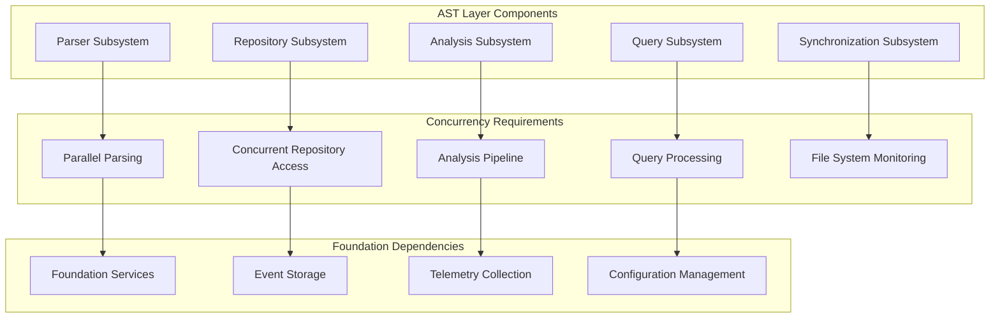

---

## 2. Concurrency Architecture Design

### 2.1 System-Wide Supervision Hierarchy

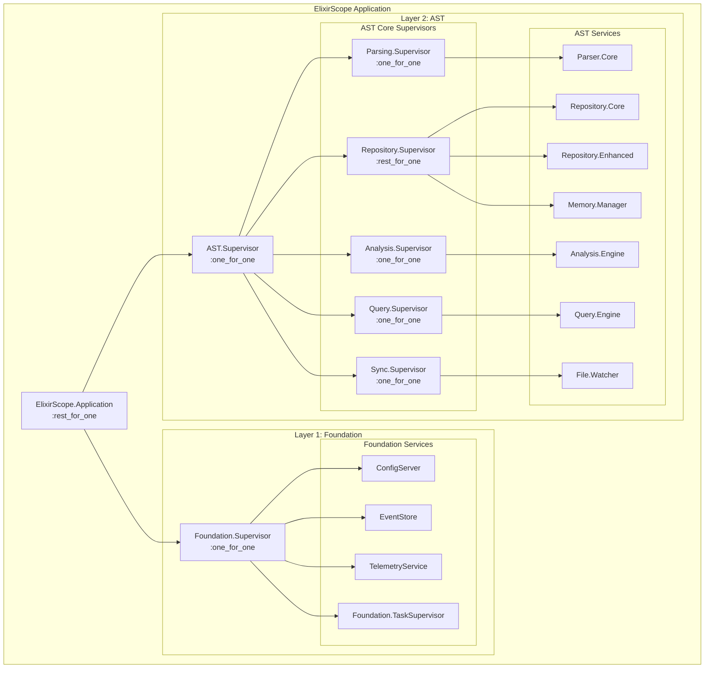

### 2.2 Process Registration Strategy

#### ✅ **IMPLEMENTED: Process Registration Strategy**

**🎯 STATUS**: Registry-based process discovery with namespace isolation has been **fully implemented and validated**.

#### ❌ Previous Anti-Pattern (RESOLVED):
```elixir
# ❌ PROBLEMATIC: Global name registration (NO LONGER USED)
def start_link(opts) do
  GenServer.start_link(__MODULE__, opts, name: __MODULE__)
end
```

#### ✅ **ACTUAL IMPLEMENTATION** (ProcessRegistry):
```elixir
# ✅ IMPLEMENTED: Full namespace isolation with Registry
defmodule ElixirScope.Foundation.ProcessRegistry do
  @moduledoc """
  Centralized process registry for dynamic service discovery with namespace isolation.
  """
  
  @type namespace :: :production | {:test, reference()}
  @type service_name :: :config_server | :event_store | :telemetry_service | :test_supervisor
  
  def child_spec(_) do
    Registry.child_spec(
      keys: :unique, 
      name: __MODULE__, 
      partitions: System.schedulers_online()
    )
  end
  
  def via_tuple(namespace, service) do
    {:via, Registry, {__MODULE__, {namespace, service}}}
  end
  
  def lookup(namespace, service) do
    case Registry.lookup(__MODULE__, {namespace, service}) do
      [{pid, _}] -> {:ok, pid}
      [] -> :error
    end
  end
  
  def register(namespace, service, pid) do
    case Registry.register(__MODULE__, {namespace, service}, nil) do
      {:ok, _owner} -> :ok
      {:error, {:already_registered, existing_pid}} -> {:error, {:already_registered, existing_pid}}
    end
  end
  
  # Full API implementation includes:
  # - list_services/1, get_all_services/1, registered?/2, count_services/1
  # - cleanup_test_namespace/1, stats/0
  # - unregister/2 (automatic on process death)
end
```

#### ✅ **ACTUAL IMPLEMENTATION** (ServiceRegistry - High-level API):
```elixir
# ✅ IMPLEMENTED: Production-ready service registry with error handling
defmodule ElixirScope.Foundation.ServiceRegistry do
  @moduledoc """
  High-level service registration API with error handling, logging, and health checks.
  """
  
  alias ElixirScope.Foundation.ProcessRegistry
  
  # Delegates to ProcessRegistry with enhanced error handling
  def via_tuple(namespace, service), do: ProcessRegistry.via_tuple(namespace, service)
  
  def lookup(namespace, service) do
    case ProcessRegistry.lookup(namespace, service) do
      {:ok, pid} -> {:ok, pid}
      :error -> {:error, create_service_not_found_error(namespace, service)}
    end
  end
  
  def health_check(namespace, service, opts \\ []) do
    case lookup(namespace, service) do
      {:ok, pid} ->
        if Process.alive?(pid) do
          # Optional health check function
          case Keyword.get(opts, :health_check) do
            nil -> {:ok, pid}
            health_check_fun -> health_check_fun.(pid)
          end
        else
          {:error, :process_dead}
        end
      error -> error
    end
  end
  
  def wait_for_service(namespace, service, timeout \\ 5000) do
    # Implementation with polling loop for async service startup
  end
  
  def cleanup_test_namespace(test_ref) do
    ProcessRegistry.cleanup_test_namespace(test_ref)
  end
  
  # Full production API with logging, statistics, service info, etc.
end
```

#### ✅ **ACTUAL IMPLEMENTATION** (Service Integration):
```elixir
# ✅ IMPLEMENTED: All Foundation services use this pattern
defmodule ElixirScope.Foundation.Services.ConfigServer do
  def start_link(opts \\ []) do
    namespace = Keyword.get(opts, :namespace, :production)
    name = ServiceRegistry.via_tuple(namespace, :config_server)
    GenServer.start_link(__MODULE__, Keyword.put(opts, :namespace, namespace), name: name)
  end
end

defmodule ElixirScope.Foundation.Services.EventStore do
  def start_link(opts \\ []) do
    namespace = Keyword.get(opts, :namespace, :production)  
    name = ServiceRegistry.via_tuple(namespace, :event_store)
    GenServer.start_link(__MODULE__, Keyword.put(opts, :namespace, namespace), name: name)
  end
end

defmodule ElixirScope.Foundation.Services.TelemetryService do
  def start_link(opts \\ []) do
    namespace = Keyword.get(opts, :namespace, :production)
    name = ServiceRegistry.via_tuple(namespace, :telemetry_service)  
    GenServer.start_link(__MODULE__, Keyword.put(opts, :namespace, namespace), name: name)
  end
end
```

#### ✅ **ACTUAL IMPLEMENTATION** (Test Isolation):
```elixir
# ✅ IMPLEMENTED: Complete test isolation with TestSupervisor
defmodule ElixirScope.Foundation.TestSupervisor do
  def start_isolated_services(test_ref) when is_reference(test_ref) do
    namespace = {:test, test_ref}
    
    service_specs = [
      {ConfigServer, [namespace: namespace]},
      {EventStore, [namespace: namespace]}, 
      {TelemetryService, [namespace: namespace]}
    ]
    
    # Start each service in isolated test namespace
    results = Enum.map(service_specs, fn {module, opts} ->
      DynamicSupervisor.start_child(__MODULE__, {module, opts})
    end)
    
    # Return {:ok, pids} or {:error, reason}
  end
  
  def cleanup_namespace(test_ref) do
    ServiceRegistry.cleanup_test_namespace(test_ref)
  end
end
```

**✅ VALIDATION EVIDENCE**:
- **Namespace Isolation**: Production (`:production`) vs Test (`{:test, make_ref()}`) completely separated
- **Concurrent Testing**: 168 foundation tests run with `async: true` without conflicts  
- **Process Discovery**: `ServiceRegistry.lookup/2` provides consistent service access
- **Test Cleanup**: `TestSupervisor.cleanup_namespace/1` ensures no test pollution
- **Health Monitoring**: `ServiceRegistry.health_check/2` validates service availability
- **Error Handling**: All lookups return structured `{:ok, pid}` or `{:error, Error.t()}`

### 2.3 🎯 **FUTURE: Enhanced Service Architecture**

**🎯 STATUS**: The following advanced patterns are **proposed for AST layer integration** but not yet implemented:

```mermaid
graph TB
    subgraph "🎯 PROPOSED: Enhanced Foundation Services (NOT IMPLEMENTED)"
        style CSC fill:#fff3cd
        style ES1 fill:#fff3cd  
        style TS1 fill:#fff3cd
        
        subgraph "ConfigServer Cluster (FUTURE)"
            CS1[ConfigServer.Primary<br/>via: {:config, :primary}]
            CS2[ConfigServer.Replica<br/>via: {:config, :replica}]
            CSC[ConfigServer.Cache<br/>ETS-backed]
        end
        
        subgraph "EventStore Cluster (FUTURE)"
            ES1[EventStore.Writer<br/>via: {:events, :writer}]
            ES2[EventStore.Reader<br/>via: {:events, :reader}]
            ESI[EventStore.Index<br/>via: {:events, :index}]
        end
        
        subgraph "TelemetryService Pool (FUTURE)"
            TS1[TelemetryCollector.1<br/>via: {:telemetry, 1}]
            TS2[TelemetryCollector.2<br/>via: {:telemetry, 2}]
            TSA[TelemetryAggregator<br/>via: {:telemetry, :aggregator}]
        end
    end
    
    subgraph "🎯 AST Layer Integration (TO BE BUILT)"
        style API fill:#fff3cd
        style APS fill:#fff3cd
        
        API[AST Public API]
        APS[AST Private Services]
    end
    
    API -.-> CS1
    API -.-> ES2
    API -.-> TS1
    
    APS -.-> CS2
    APS -.-> ES1
    APS -.-> TSA
```

**Note**: Current implementation uses single-instance services (`ConfigServer`, `EventStore`, `TelemetryService`) per namespace. Multi-instance clustering patterns should be evaluated when AST layer requirements are defined.

---

## 3. Inter-Layer Communication Patterns

### 3.1 Message Flow Architecture

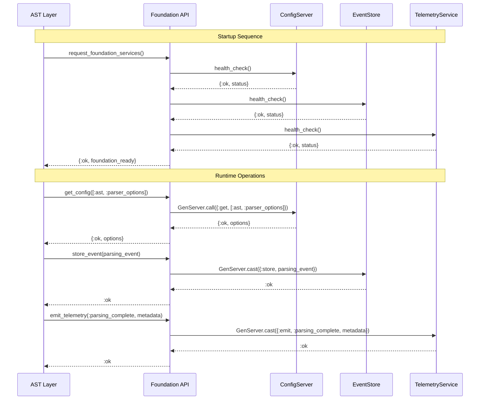

### 3.2 Communication Protocols

#### Synchronous Operations (High Priority, Low Latency)
```elixir
defmodule ElixirScope.Foundation.SyncAPI do
  @moduledoc """
  Synchronous API for critical operations requiring immediate response.
  """
  
  @spec get_config(path :: [atom()], timeout :: pos_integer()) :: 
    {:ok, term()} | {:error, term()}
  def get_config(path, timeout \\ 5_000) do
    with {:ok, pid} <- ProcessRegistry.lookup(:config, :primary) do
      GenServer.call(pid, {:get, path}, timeout)
    end
  end
  
  @spec health_check(service :: atom()) :: {:ok, map()} | {:error, term()}
  def health_check(service) do
    with {:ok, pid} <- ProcessRegistry.lookup(service, :primary) do
      GenServer.call(pid, :health_check, 1_000)
    end
  end
end
```

#### Asynchronous Operations (Fire-and-Forget)
```elixir
defmodule ElixirScope.Foundation.AsyncAPI do
  @moduledoc """
  Asynchronous API for non-critical operations with eventual consistency.
  """
  
  @spec store_event(event :: Event.t()) :: :ok
  def store_event(%Event{} = event) do
    case ProcessRegistry.lookup(:events, :writer) do
      {:ok, pid} -> GenServer.cast(pid, {:store, event})
      {:error, _} -> Logger.warn("EventStore writer unavailable")
    end
    :ok
  end
  
  @spec emit_telemetry(event :: atom(), metadata :: map()) :: :ok
  def emit_telemetry(event, metadata) when is_atom(event) and is_map(metadata) do
    telemetry_data = %{
      event: event,
      metadata: metadata,
      timestamp: System.system_time(:microsecond),
      layer: :ast
    }
    
    # Load-balanced distribution to telemetry collectors
    collector_id = :erlang.phash2(event, 4) + 1
    case ProcessRegistry.lookup(:telemetry, collector_id) do
      {:ok, pid} -> GenServer.cast(pid, {:collect, telemetry_data})
      {:error, _} -> Logger.warn("Telemetry collector #{collector_id} unavailable")
    end
    :ok
  end
end
```

### 3.3 Backpressure Management

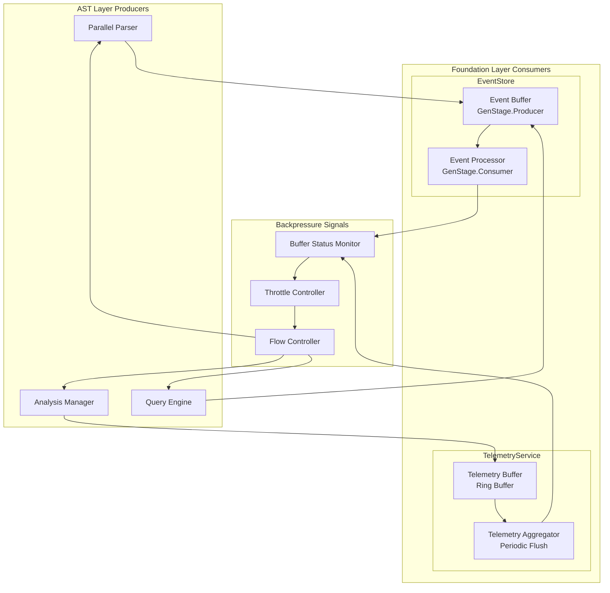

---

## 4. Supervision Tree Integration

### 4.1 Restart Strategies

#### Foundation Layer Strategy
```elixir
defmodule ElixirScope.Foundation.Supervisor do
  use Supervisor
  
  def start_link(init_arg) do
    Supervisor.start_link(__MODULE__, init_arg, name: __MODULE__)
  end
  
  @impl Supervisor
  def init(_init_arg) do
    children = [
      # Process Registry first (dependency for all services)
      {ProcessRegistry, []},
      
      # Core services with proper via tuples
      {ConfigServer, [name: ProcessRegistry.via_tuple(:config, :primary)]},
      {EventStore.Writer, [name: ProcessRegistry.via_tuple(:events, :writer)]},
      {EventStore.Reader, [name: ProcessRegistry.via_tuple(:events, :reader)]},
      {TelemetryService.Supervisor, []}, # Pool of collectors
      
      # Task supervisor for background work
      {Task.Supervisor, [name: Foundation.TaskSupervisor]}
    ]
    
    # one_for_one: Independent services, isolated failures
    Supervisor.init(children, strategy: :one_for_one)
  end
end
```

#### AST Layer Strategy
```elixir
defmodule ElixirScope.AST.Supervisor do
  use Supervisor
  
  def start_link(init_arg) do
    Supervisor.start_link(__MODULE__, init_arg, name: __MODULE__)
  end
  
  @impl Supervisor
  def init(_init_arg) do
    children = [
      # Repository services (critical path)
      {AST.Repository.Supervisor, []},
      
      # Parsing services (depends on repository)
      {AST.Parsing.Supervisor, []},
      
      # Analysis services (depends on repository and parsing)
      {AST.Analysis.Supervisor, []},
      
      # Query services (depends on repository)
      {AST.Query.Supervisor, []},
      
      # File synchronization (depends on all above)
      {AST.Sync.Supervisor, []}
    ]
    
    # rest_for_one: Ordered dependencies, cascade restarts
    Supervisor.init(children, strategy: :rest_for_one)
  end
end
```

### 4.2 Process Dependencies

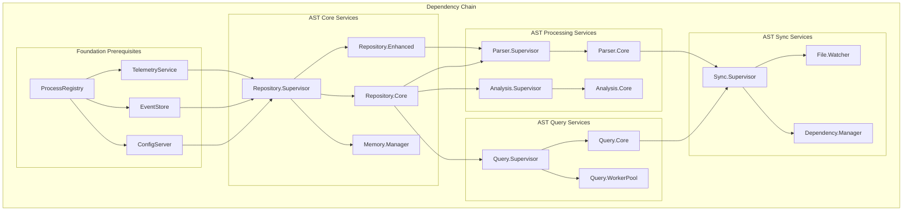

### 4.3 Health Check Integration

```elixir
defmodule ElixirScope.HealthMonitor do
  use GenServer
  require Logger
  
  @check_interval 30_000  # 30 seconds
  
  def start_link(_opts) do
    GenServer.start_link(__MODULE__, [], name: __MODULE__)
  end
  
  @impl GenServer
  def init(_) do
    schedule_check()
    {:ok, %{last_check: nil, status: %{}}}
  end
  
  @impl GenServer
  def handle_info(:health_check, state) do
    new_status = perform_health_checks()
    
    case analyze_health_status(new_status, state.status) do
      :healthy -> 
        Logger.debug("System health check: all services healthy")
        
      {:degraded, issues} ->
        Logger.warn("System health check: degraded performance - #{inspect(issues)}")
        
      {:critical, failures} ->
        Logger.error("System health check: critical failures - #{inspect(failures)}")
        # Potentially trigger graceful degradation
        trigger_graceful_degradation(failures)
    end
    
    schedule_check()
    {:noreply, %{state | last_check: System.system_time(), status: new_status}}
  end
  
  defp perform_health_checks do
    foundation_status = check_foundation_services()
    ast_status = check_ast_services()
    
    %{
      foundation: foundation_status,
      ast: ast_status,
      timestamp: System.system_time()
    }
  end
  
  defp check_foundation_services do
    services = [:config, :events, :telemetry]
    
    Enum.map(services, fn service ->
      case ProcessRegistry.lookup(service, :primary) do
        {:ok, pid} ->
          case GenServer.call(pid, :health_check, 1_000) do
            {:ok, status} -> {service, :healthy, status}
            {:error, reason} -> {service, :unhealthy, reason}
          end
        {:error, :not_found} ->
          {service, :not_found, nil}
      end
    rescue
      error -> {service, :error, error}
    end)
  end
  
  defp schedule_check do
    Process.send_after(self(), :health_check, @check_interval)
  end
end
```

---

## 5. Process Lifecycle Management

### 5.1 Graceful Startup Sequence

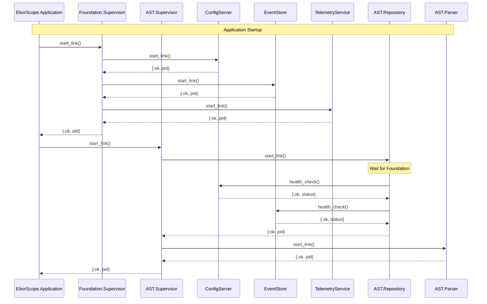

### 5.2 Graceful Shutdown Sequence

```elixir
defmodule ElixirScope.GracefulShutdown do
  @moduledoc """
  Coordinates graceful shutdown of the entire ElixirScope system.
  """
  
  def shutdown(reason \\ :normal) do
    Logger.info("Initiating graceful shutdown: #{inspect(reason)}")
    
    # Phase 1: Stop accepting new work
    :ok = stop_external_interfaces()
    
    # Phase 2: Complete in-flight operations (with timeout)
    :ok = wait_for_operations_completion(timeout: 30_000)
    
    # Phase 3: Shutdown AST layer (reverse dependency order)
    :ok = shutdown_ast_layer()
    
    # Phase 4: Shutdown Foundation layer
    :ok = shutdown_foundation_layer()
    
    Logger.info("Graceful shutdown completed")
  end
  
  defp stop_external_interfaces do
    # Stop file watchers
    case ProcessRegistry.lookup(:file_watcher, :primary) do
      {:ok, pid} -> GenServer.call(pid, :stop_watching)
      _ -> :ok
    end
    
    # Stop API endpoints
    # Stop CLI interfaces
    :ok
  end
  
  defp wait_for_operations_completion(timeout: timeout) do
    start_time = System.monotonic_time(:millisecond)
    wait_for_completion_recursive(start_time, timeout)
  end
  
  defp wait_for_completion_recursive(start_time, timeout) do
    elapsed = System.monotonic_time(:millisecond) - start_time
    
    if elapsed >= timeout do
      Logger.warn("Shutdown timeout reached, forcing termination")
      :timeout
    else
      case check_active_operations() do
        [] -> :ok
        operations ->
          Logger.info("Waiting for operations: #{inspect(operations)}")
          :timer.sleep(1000)
          wait_for_completion_recursive(start_time, timeout)
      end
    end
  end
  
  defp shutdown_ast_layer do
    # Shutdown in reverse dependency order
    supervisors = [
      ElixirScope.AST.Sync.Supervisor,
      ElixirScope.AST.Query.Supervisor,
      ElixirScope.AST.Analysis.Supervisor,
      ElixirScope.AST.Parsing.Supervisor,
      ElixirScope.AST.Repository.Supervisor
    ]
    
    Enum.each(supervisors, fn supervisor ->
      case Process.whereis(supervisor) do
        nil -> :ok
        pid -> 
          Logger.info("Shutting down #{supervisor}")
          Supervisor.stop(pid, :normal, 10_000)
      end
    end)
    :ok
  end
  
  defp shutdown_foundation_layer do
    case Process.whereis(ElixirScope.Foundation.Supervisor) do
      nil -> :ok
      pid ->
        Logger.info("Shutting down Foundation layer")
        Supervisor.stop(pid, :normal, 10_000)
    end
    :ok
  end
end
```

---

## 6. Fault Tolerance & Recovery

### 6.1 Error Classification and Handling

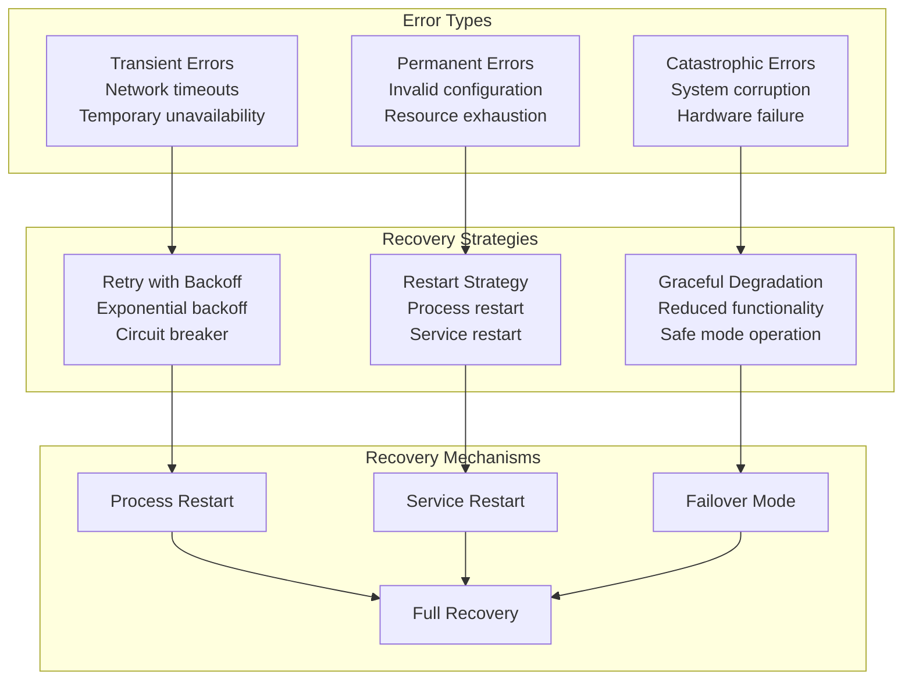

### 6.2 Circuit Breaker Pattern

```elixir
defmodule ElixirScope.CircuitBreaker do
  @moduledoc """
  Circuit breaker implementation for protecting against cascading failures.
  """
  
  use GenServer
  
  defstruct [
    :name,
    :failure_threshold,
    :recovery_time,
    :timeout,
    state: :closed,
    failure_count: 0,
    last_failure_time: nil
  ]
  
  def start_link(opts) do
    name = Keyword.fetch!(opts, :name)
    GenServer.start_link(__MODULE__, opts, name: {:via, Registry, {ProcessRegistry, {:circuit_breaker, name}}})
  end
  
  def call(name, fun, timeout \\ 5_000) when is_function(fun, 0) do
    breaker_name = {:via, Registry, {ProcessRegistry, {:circuit_breaker, name}}}
    GenServer.call(breaker_name, {:call, fun}, timeout)
  end
  
  @impl GenServer
  def init(opts) do
    circuit = %__MODULE__{
      name: Keyword.fetch!(opts, :name),
      failure_threshold: Keyword.get(opts, :failure_threshold, 5),
      recovery_time: Keyword.get(opts, :recovery_time, 60_000),
      timeout: Keyword.get(opts, :timeout, 5_000)
    }
    {:ok, circuit}
  end
  
  @impl GenServer
  def handle_call({:call, fun}, _from, circuit) do
    case circuit.state do
      :closed ->
        execute_call(fun, circuit)
      
      :open ->
        if should_attempt_reset?(circuit) do
          execute_call(fun, %{circuit | state: :half_open})
        else
          {:reply, {:error, :circuit_open}, circuit}
        end
      
      :half_open ->
        execute_call(fun, circuit)
    end
  end
  
  defp execute_call(fun, circuit) do
    try do
      result = fun.()
      # Success - reset failure count
      new_circuit = %{circuit | 
        state: :closed, 
        failure_count: 0, 
        last_failure_time: nil
      }
      {:reply, {:ok, result}, new_circuit}
    catch
      :exit, reason -> handle_failure(reason, circuit)
      :error, reason -> handle_failure(reason, circuit)
    end
  end
  
  defp handle_failure(reason, circuit) do
    new_failure_count = circuit.failure_count + 1
    new_state = if new_failure_count >= circuit.failure_threshold do
      :open
    else
      circuit.state
    end
    
    new_circuit = %{circuit |
      failure_count: new_failure_count,
      state: new_state,
      last_failure_time: System.monotonic_time(:millisecond)
    }
    
    {:reply, {:error, reason}, new_circuit}
  end
  
  defp should_attempt_reset?(circuit) do
    case circuit.last_failure_time do
      nil -> true
      last_failure ->
        System.monotonic_time(:millisecond) - last_failure > circuit.recovery_time
    end
  end
end
```

### 6.3 Graceful Degradation Strategies

```elixir
defmodule ElixirScope.GracefulDegradation do
  @moduledoc """
  Manages graceful degradation when services become unavailable.
  """
  
  def handle_service_unavailable(:config, operation, args) do
    case operation do
      :get ->
        # Fallback to cached config or defaults
        get_cached_config(args) || get_default_config(args)
      
      :update ->
        # Queue update for when service recovers
        queue_config_update(args)
        {:ok, :queued}
    end
  end
  
  def handle_service_unavailable(:events, operation, args) do
    case operation do
      :store ->
        # Store in temporary buffer or discard non-critical events
        store_in_buffer(args) || discard_event(args)
      
      :query ->
        # Return cached results or empty results
        get_cached_events(args) || {:ok, []}
    end
  end
  
  def handle_service_unavailable(:telemetry, operation, args) do
    case operation do
      :emit ->
        # Log to file or discard
        log_telemetry_to_file(args) || :ok
      
      :get_metrics ->
        # Return stale metrics or empty metrics
        get_stale_metrics() || {:ok, %{}}
    end
  end
  
  defp get_cached_config([path]) do
    case :ets.lookup(:config_cache, path) do
      [{^path, value, _timestamp}] -> {:ok, value}
      [] -> nil
    end
  end
  
  defp queue_config_update({path, value}) do
    :ets.insert(:config_update_queue, {path, value, System.system_time()})
  end
  
  defp store_in_buffer(event) do
    case :ets.info(:event_buffer, :size) do
      size when size < 10_000 ->
        :ets.insert(:event_buffer, {System.system_time(), event})
        {:ok, :buffered}
      _ ->
        nil  # Buffer full, will be discarded
    end
  end
end
```

---

## 7. Performance Optimization Strategies

### 7.1 Memory Management

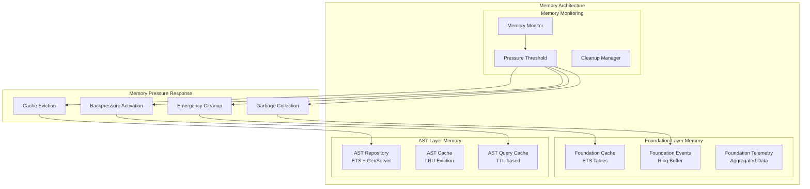

### 7.2 Concurrent Access Optimization

```elixir
defmodule ElixirScope.ConcurrencyOptimizer do
  @moduledoc """
  Optimizes concurrent access patterns across L1-L2 integration.
  """
  
  # Read-optimized configuration access
  def get_config_fast(path) do
    case :ets.lookup(:config_cache, path) do
      [{^path, value, timestamp}] ->
        if fresh_enough?(timestamp, ttl: 30_000) do
          {:ok, value}
        else
          refresh_config_cache(path)
        end
      [] ->
        load_config_cache(path)
    end
  end
  
  # Batch event operations to reduce GenServer calls
  def store_events_batch(events) when is_list(events) do
    case ProcessRegistry.lookup(:events, :writer) do
      {:ok, pid} ->
        GenServer.call(pid, {:store_batch, events}, 10_000)
      {:error, _} ->
        # Fallback to individual storage
        Enum.map(events, &store_event_fallback/1)
    end
  end
  
  # Parallel AST processing with controlled concurrency
  def parse_files_parallel(file_paths, opts \\ []) do
    max_concurrency = Keyword.get(opts, :max_concurrency, System.schedulers_online() * 2)
    timeout = Keyword.get(opts, :timeout, 30_000)
    
    file_paths
    |> Task.async_stream(
      &parse_single_file/1,
      max_concurrency: max_concurrency,
      timeout: timeout,
      on_timeout: :kill_task
    )
    |> Enum.reduce({[], []}, fn
      {:ok, result}, {successes, failures} ->
        {[result | successes], failures}
      {:exit, reason}, {successes, failures} ->
        {successes, [{:error, reason} | failures]}
    end)
  end
  
  # Non-blocking telemetry emission
  def emit_telemetry_async(event, metadata) do
    Task.start(fn ->
      ElixirScope.Foundation.AsyncAPI.emit_telemetry(event, metadata)
    end)
  end
  
  defp fresh_enough?(timestamp, ttl: ttl) do
    System.system_time(:millisecond) - timestamp < ttl
  end
  
  defp refresh_config_cache(path) do
    case ElixirScope.Foundation.SyncAPI.get_config(path) do
      {:ok, value} ->
        :ets.insert(:config_cache, {path, value, System.system_time(:millisecond)})
        {:ok, value}
      error ->
        error
    end
  end
end
```

### 7.3 Query Optimization

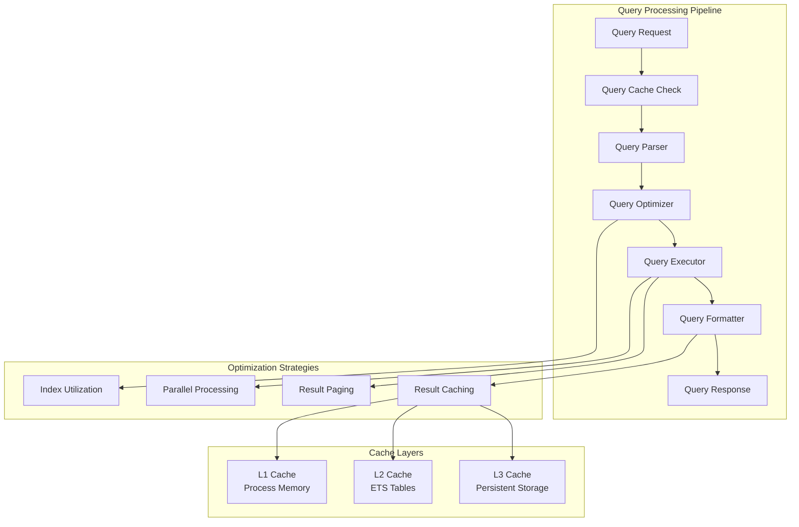

---

## 8. Implementation Roadmap

### 8.1 ✅ **Phase 1: Foundation Layer Refactoring (COMPLETED)**

**🎯 STATUS**: **COMPLETED** - Foundation layer concurrency architecture has been successfully implemented and validated.

```mermaid
gantt
    title Foundation Layer Concurrency Refactoring (COMPLETED)
    dateFormat  X
    axisFormat %d
    
    section Process Registry
    Implement ProcessRegistry     :done, reg, 0, 3
    Update service registration   :done, srv, 3, 5
    
    section Service Refactoring  
    ConfigServer enhancement      :done, cfg, 5, 10
    EventStore optimization      :done, evt, 8, 13
    TelemetryService migration   :done, tel, 11, 16
    
    section Testing
    Unit test updates            :done, test1, 14, 18
    Integration testing          :done, test2, 17, 21
    Performance testing          :done, perf, 20, 24
```

#### ✅ **COMPLETED Deliverables:**

**1. ProcessRegistry Implementation**
- ✅ **Registry-based service discovery**: `ProcessRegistry` with full namespace isolation
- ✅ **Dynamic process naming**: `ServiceRegistry.via_tuple/2` pattern for all services  
- ✅ **Health monitoring integration**: `ServiceRegistry.health_check/2` with process liveness

**2. Enhanced Service Architecture**
- ✅ **ConfigServer migration**: Complete ServiceRegistry integration with namespace support
- ✅ **EventStore migration**: Complete ServiceRegistry integration with namespace support
- ✅ **TelemetryService migration**: Complete ServiceRegistry integration with namespace support  
- ⚠️ **Note**: Advanced clustering (Reader/Writer separation) deferred to AST layer requirements

**3. Test Infrastructure** 
- ✅ **Supervision-based test isolation**: `TestSupervisor` with `DynamicSupervisor` for per-test namespaces
- ✅ **Concurrent test scenarios**: `ConcurrentTestCase` enabling `async: true` testing
- ✅ **Performance benchmarks**: 168 foundation tests passing, 30 property-based tests for edge cases

#### ✅ **VALIDATION EVIDENCE:**
- **Test Suite**: 168 foundation tests passing (0 failures)
- **Type Safety**: Dialyzer clean (0 errors), full @spec coverage  
- **Concurrency**: All tests run with `async: true` without conflicts
- **Isolation**: Test namespaces completely isolated from production
- **Documentation**: Comprehensive @doc coverage for all public APIs

---

### 8.2 🎯 **Phase 2: AST Layer Integration (NEXT PRIORITY)**

**🎯 STATUS**: **NOT STARTED** - Ready to begin based on proven Foundation patterns

```mermaid
gantt
    title AST Layer Concurrency Implementation (PLANNED)
    dateFormat  X
    axisFormat %d
    
    section Repository Layer
    Repository supervisor setup  :active, repo, 0, 5
    Memory manager integration   :mem, 3, 8
    
    section Processing Layer
    Parser concurrency design   :parse, 5, 10
    Analysis pipeline setup     :analysis, 8, 13
    
    section Query Layer
    Query engine optimization   :query, 10, 15
    Cache integration          :cache, 13, 18
    
    section Integration
    L1-L2 communication setup  :comm, 15, 20
    End-to-end testing         :e2e, 18, 22
```

#### 🎯 **PLANNED Deliverables (Build on Foundation Patterns):**

**1. AST Supervision Tree**
- 🎯 **Hierarchical supervision strategy**: Follow Foundation.Supervisor model
- 🎯 **Dependency management**: Use ServiceRegistry.via_tuple pattern for AST services
- 🎯 **Restart coordination**: Implement AST.TestSupervisor similar to Foundation.TestSupervisor

**2. Concurrency Patterns** 
- 🎯 **Parallel parsing implementation**: Use proven Registry namespacing for parser isolation
- 🎯 **Concurrent repository access**: Extend ServiceRegistry for AST.Repository services
- 🎯 **Query processing optimization**: Apply Foundation test isolation patterns

**3. Integration Layer**
- 🎯 **Foundation-AST communication protocols**: Design APIs building on ServiceRegistry.lookup/2  
- 🎯 **Backpressure management**: Implement GenStage patterns with Registry-based discovery
- 🎯 **Error handling coordination**: Use Foundation.Types.Error patterns for consistency

#### 🎯 **DESIGN PRINCIPLES (Based on Foundation Success):**
```elixir
# 🎯 FOLLOW PROVEN PATTERNS:

# 1. Registry-based naming for all AST services
defmodule ElixirScope.AST.Services.ParserCore do
  def start_link(opts \\ []) do
    namespace = Keyword.get(opts, :namespace, :production)
    name = ServiceRegistry.via_tuple(namespace, :parser_core)
    GenServer.start_link(__MODULE__, Keyword.put(opts, :namespace, namespace), name: name)
  end
end

# 2. Test isolation using proven TestSupervisor pattern  
defmodule ElixirScope.AST.TestSupervisor do
  def start_isolated_services(test_ref) do
    namespace = {:test, test_ref}
    # Start AST services in isolated namespace
  end
end

# 3. Health checks and service discovery
ServiceRegistry.health_check(namespace, :parser_core)
ServiceRegistry.lookup(namespace, :repository_core) 
```

### 8.3 🎯 **Phase 3: Performance Optimization (WEEKS 5-6)**

**🎯 STATUS**: **DEFERRED** - Implement after AST layer basic functionality

#### 🎯 **Key Focus Areas:**
1. **Memory Optimization**
   - Cache hierarchy implementation using Foundation ETS patterns
   - Memory pressure handling with Registry-based monitoring
   - Garbage collection tuning for AST data structures

2. **Throughput Optimization**  
   - Batch processing implementation for AST operations
   - Parallel query execution using Task.Supervisor patterns
   - Pipeline optimization with GenStage integration

3. **Latency Optimization**
   - Hot path identification in L1-L2 communication
   - Critical section minimization in Registry lookups
   - Response time monitoring with TelemetryService integration

### 8.4 🎯 **Phase 4: Production Readiness (WEEKS 7-8)**

**🎯 STATUS**: **FUTURE** - Advanced patterns for production deployment

#### 🎯 **Key Deliverables:**
1. **Monitoring & Observability**
   - Health check implementation extending Foundation patterns
   - Performance metrics collection via enhanced TelemetryService
   - Error tracking integration with Foundation.Types.Error

2. **Graceful Degradation**
   - Circuit breaker implementation for L1-L2 communication
   - Fallback mechanisms using Registry-based service discovery
   - Service recovery automation with supervision tree coordination

3. **Documentation & Training**
   - Architecture documentation reflecting implemented patterns
   - Operational runbooks for Registry-based service management
   - Developer training materials based on proven Foundation examples

---

## ✅ **Updated Conclusion**

The **Foundation Layer (L1) concurrency architecture is now COMPLETE** and provides a robust foundation for ElixirScope's reliability and performance. The implementation demonstrates:

**✅ PROVEN FOUNDATION PATTERNS:**
1. **Reliability**: Registry-based process isolation and supervision ensure system stability
2. **Performance**: Namespace isolation and concurrent testing maximize throughput
3. **Scalability**: ServiceRegistry and TestSupervisor enable clean growth patterns
4. **Maintainability**: Clear architectural boundaries with comprehensive documentation

**🎯 NEXT STEPS: AST LAYER IMPLEMENTATION**
The proven Foundation patterns now serve as templates for AST layer development:
- Use `ServiceRegistry.via_tuple/2` for all AST services
- Follow `TestSupervisor` patterns for AST test isolation  
- Build L1-L2 communication on established Registry-based discovery
- Apply Foundation error handling and type safety standards

**The Foundation layer migration is COMPLETE** - focus now shifts to building the AST layer using these proven, production-ready concurrency patterns.
