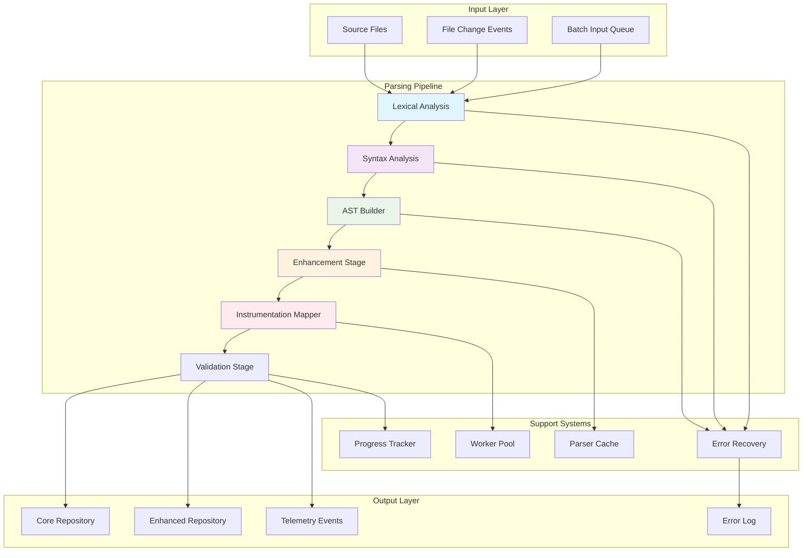
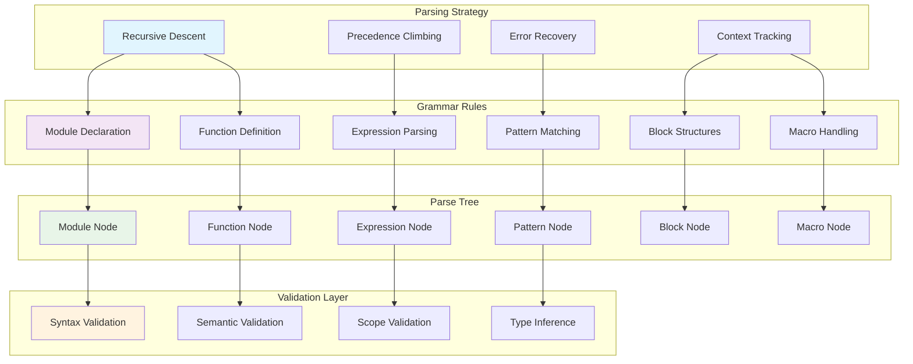
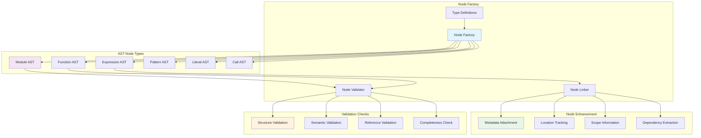
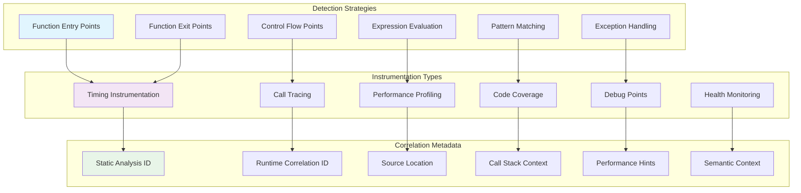
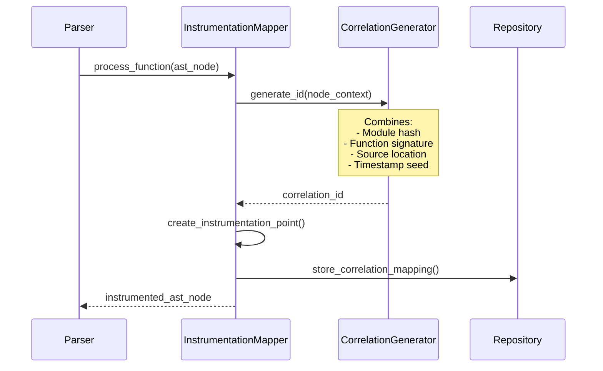
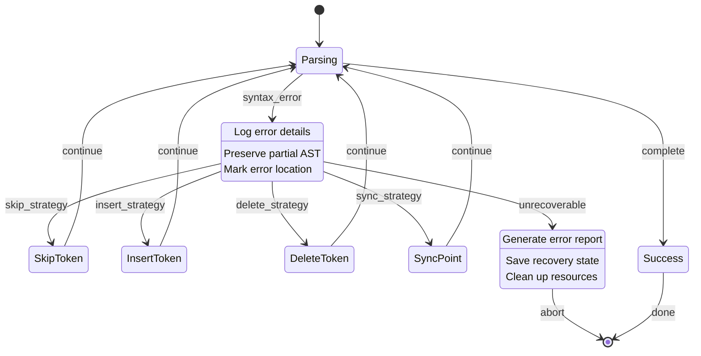
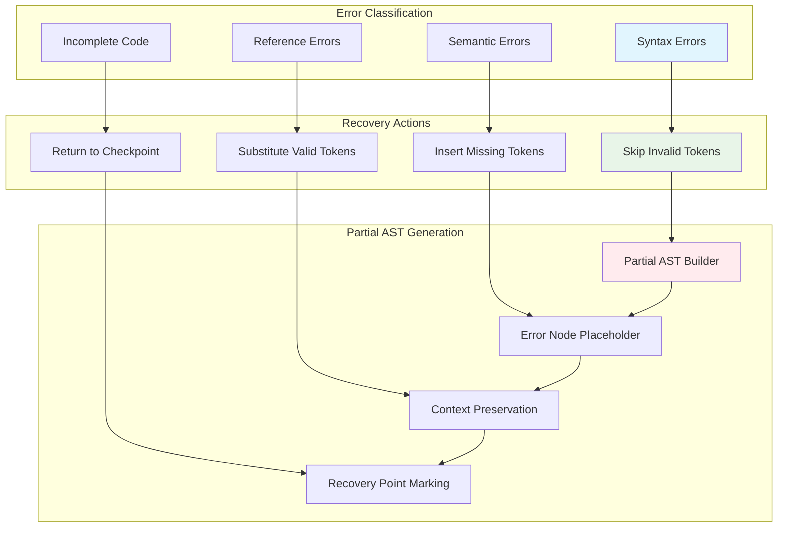
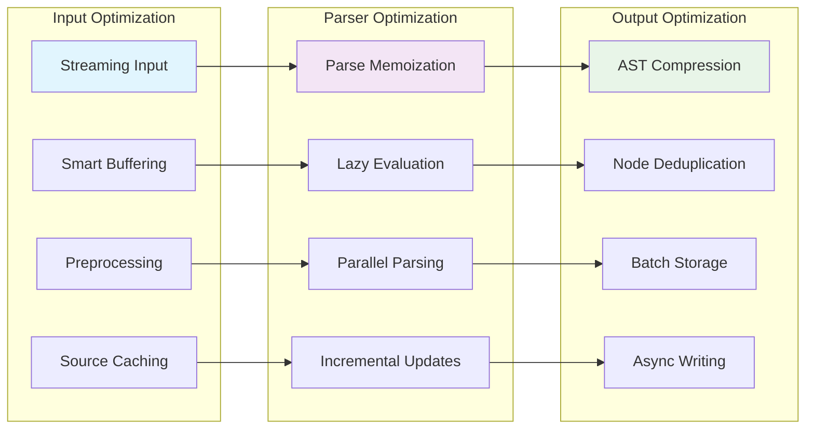
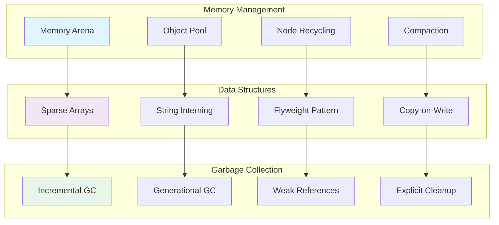
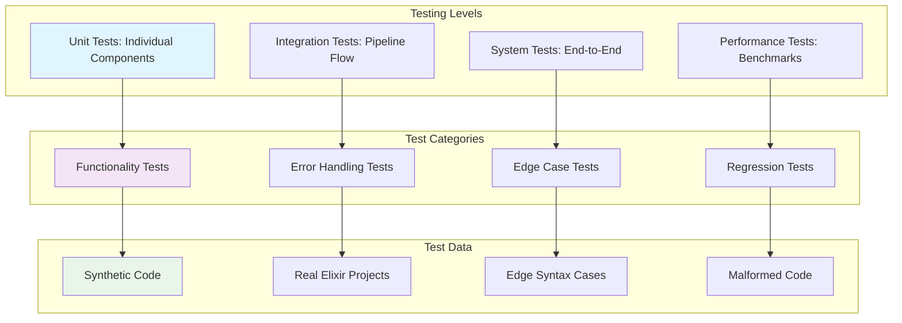

# AST Parsing Pipeline

**Version**: 1.0  
**Date**: June 2025  
**Component**: Parsing Subsystem  
**Purpose**: Detailed parsing architecture and implementation guidance

## Parsing Pipeline Overview

The AST Parsing Pipeline transforms Elixir source code into enhanced AST structures with instrumentation points and correlation metadata. This document details the multi-stage parsing process and architectural decisions.

## Parsing Pipeline Architecture



## Lexical Analysis Engine

### Token Recognition Architecture

```mermaid
graph TB
    subgraph "Lexical Analyzer"
        INPUT[Character Stream]
        SCANNER[Token Scanner]
        CLASSIFIER[Token Classifier]
        VALIDATOR[Token Validator]
        OUTPUT[Token Stream]
    end

    subgraph "Token Types"
        KEYWORDS[Keywords: def, defmodule, if, case]
        OPERATORS[Operators: +, -, *, /, |>, <|]
        LITERALS[Literals: atoms, strings, numbers]
        DELIMITERS[Delimiters: (), [], {}, do/end]
        IDENTIFIERS[Identifiers: variables, functions]
        SPECIAL[Special: @, &, ^, _]
    end

    subgraph "Recognition Patterns"
        REGEX[Regex Patterns]
        FINITE_STATE[Finite State Machine]
        CONTEXT[Context Awareness]
        LOOKAHEAD[Lookahead Buffer]
    end

    INPUT --> SCANNER
    SCANNER --> CLASSIFIER
    CLASSIFIER --> VALIDATOR
    VALIDATOR --> OUTPUT

    SCANNER --> KEYWORDS
    SCANNER --> OPERATORS
    SCANNER --> LITERALS
    SCANNER --> DELIMITERS
    SCANNER --> IDENTIFIERS
    SCANNER --> SPECIAL

    CLASSIFIER --> REGEX
    CLASSIFIER --> FINITE_STATE
    CLASSIFIER --> CONTEXT
    CLASSIFIER --> LOOKAHEAD

    style SCANNER fill:#e1f5fe
    style CLASSIFIER fill:#f3e5f5
    style KEYWORDS fill:#e8f5e8
```

### Token Processing State Machine

```mermaid
stateDiagram-v2
    [*] --> Start
    Start --> Identifier : letter | _
    Start --> Number : digit
    Start --> String : "
    Start --> Atom : :
    Start --> Operator : operator_char
    Start --> Comment : #
    Start --> Whitespace : space | tab | newline

    Identifier --> Identifier : alphanumeric | _
    Identifier --> [*] : delimiter

    Number --> Number : digit | .
    Number --> [*] : delimiter

    String --> String : any_char
    String --> Escape : \
    String --> [*] : "
    Escape --> String : any_char

    Atom --> AtomQuoted : "
    Atom --> AtomUnquoted : letter
    AtomQuoted --> AtomQuoted : any_char
    AtomQuoted --> [*] : "
    AtomUnquoted --> AtomUnquoted : alphanumeric | _
    AtomUnquoted --> [*] : delimiter

    Operator --> Operator : operator_continuation
    Operator --> [*] : non_operator

    Comment --> Comment : any_char
    Comment --> [*] : newline

    Whitespace --> Whitespace : space | tab
    Whitespace --> [*] : non_whitespace
```

## Syntax Analysis Engine

### Parser Architecture



### Expression Parsing with Precedence

```mermaid
graph LR
    subgraph "Operator Precedence Levels"
        LEVEL1[Level 1: |>]
        LEVEL2[Level 2: ||, &&]
        LEVEL3[Level 3: ==, !=, <, >]
        LEVEL4[Level 4: ++, --]
        LEVEL5[Level 5: +, -]
        LEVEL6[Level 6: *, /, div]
        LEVEL7[Level 7: **]
        LEVEL8[Level 8: Unary +, -]
        LEVEL9[Level 9: Function calls]
    end

    subgraph "Parsing Algorithm"
        CLIMB[Precedence Climbing]
        LEFT_ASSOC[Left Associative]
        RIGHT_ASSOC[Right Associative]
        UNARY[Unary Operators]
    end

    LEVEL1 --> LEFT_ASSOC
    LEVEL2 --> LEFT_ASSOC
    LEVEL3 --> LEFT_ASSOC
    LEVEL4 --> RIGHT_ASSOC
    LEVEL5 --> LEFT_ASSOC
    LEVEL6 --> LEFT_ASSOC
    LEVEL7 --> RIGHT_ASSOC
    LEVEL8 --> UNARY
    LEVEL9 --> LEFT_ASSOC

    LEFT_ASSOC --> CLIMB
    RIGHT_ASSOC --> CLIMB
    UNARY --> CLIMB

    style CLIMB fill:#e1f5fe
    style LEVEL1 fill:#ffebee
    style LEVEL9 fill:#e8f5e8
```

## AST Builder Architecture

### Node Creation Pipeline



## Instrumentation Mapper

### Instrumentation Point Detection



### Correlation ID Generation



## Error Recovery and Handling

### Error Recovery Strategies



### Partial Parsing Support



## Performance Optimization

### Parsing Performance Pipeline



### Memory Usage Optimization



## API Specifications

### Parser Interface

```elixir
defmodule ElixirScope.AST.Parser do
  @moduledoc """
  Main parser interface for converting Elixir source code to enhanced AST.
  
  Performance Targets:
  - Small files (<1KB): < 10ms
  - Medium files (1KB-100KB): < 100ms  
  - Large files (>100KB): < 1000ms
  """

  @type parse_options :: %{
    instrumentation: boolean(),
    error_recovery: :strict | :permissive,
    cache_enabled: boolean(),
    correlation_metadata: boolean()
  }

  @spec parse_file(Path.t(), parse_options()) :: 
    {:ok, enhanced_ast()} | {:error, parse_error()}
  @spec parse_string(String.t(), parse_options()) :: 
    {:ok, enhanced_ast()} | {:error, parse_error()}
  @spec parse_batch([Path.t()], parse_options()) :: 
    {:ok, [enhanced_ast()]} | {:error, batch_error()}
end
```

### Instrumentation Mapper Interface

```elixir
defmodule ElixirScope.AST.InstrumentationMapper do
  @moduledoc """
  Maps AST nodes to instrumentation points for runtime correlation.
  """

  @type instrumentation_point :: %{
    id: binary(),
    type: instrumentation_type(),
    location: source_location(),
    metadata: map()
  }

  @spec map_instrumentation(enhanced_ast()) :: 
    {:ok, [instrumentation_point()]} | {:error, term()}
  @spec generate_correlation_id(ast_node(), context()) :: binary()
  @spec extract_performance_hints(ast_node()) :: [performance_hint()]
end
```

## Testing Strategy

### Parser Testing Pyramid



## Implementation Guidelines

### Development Phases

1. **Phase 1**: Basic lexical and syntax analysis
2. **Phase 2**: AST building and validation
3. **Phase 3**: Instrumentation mapping
4. **Phase 4**: Error recovery and optimization
5. **Phase 5**: Performance tuning and caching

### Quality Gates

1. **Code Coverage**: >95% for parser core
2. **Performance**: Meet specified response times
3. **Memory Usage**: <50MB for 10K LOC project
4. **Error Recovery**: Handle 99% of syntax errors gracefully

## Next Steps

1. **Study Pattern Matching**: Review `04_ast_pattern_matching.md`
2. **Examine Query System**: Review `05_ast_query_system.md` 
3. **Implement Lexer**: Start with token recognition
4. **Build Parser**: Implement recursive descent parser
5. **Add Instrumentation**: Integrate correlation mapping
