# AST Pattern Matching System

**Version**: 1.0  
**Date**: June 2025  
**Component**: Analysis Subsystem  
**Purpose**: Pattern recognition and anti-pattern detection architecture

## Pattern Matching Overview

The AST Pattern Matching System provides sophisticated pattern recognition capabilities for detecting code patterns, anti-patterns, best practices violations, and architectural insights across Elixir codebases.

## Pattern Matching Architecture

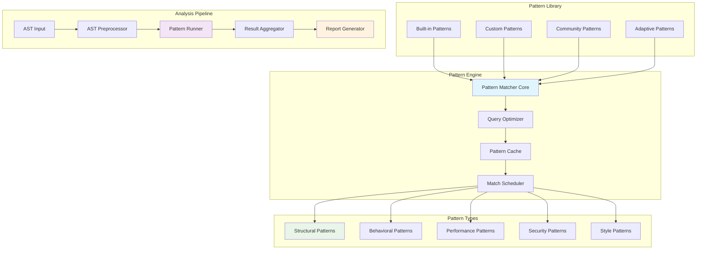

## Pattern Definition Language

### Pattern Specification DSL

```mermaid
graph TB
    subgraph "Pattern DSL Structure"
        PATTERN_DEF[Pattern Definition]
        MATCH_RULES[Match Rules]
        CONSTRAINTS[Constraints]
        ACTIONS[Actions]
    end

    subgraph "Match Rule Types"
        EXACT[Exact Match]
        WILDCARD[Wildcard Match]
        CONDITIONAL[Conditional Match]
        RECURSIVE[Recursive Match]
        CONTEXT[Context-Aware Match]
    end

    subgraph "Constraint Types"
        TYPE_CONST[Type Constraints]
        VALUE_CONST[Value Constraints]
        SCOPE_CONST[Scope Constraints]
        METRIC_CONST[Metric Constraints]
    end

    subgraph "Action Types"
        REPORT[Report Issue]
        SUGGEST[Suggest Improvement]
        METRIC[Update Metrics]
        CORRELATE[Correlate Runtime Data]
    end

    PATTERN_DEF --> MATCH_RULES
    PATTERN_DEF --> CONSTRAINTS
    PATTERN_DEF --> ACTIONS

    MATCH_RULES --> EXACT
    MATCH_RULES --> WILDCARD
    MATCH_RULES --> CONDITIONAL
    MATCH_RULES --> RECURSIVE
    MATCH_RULES --> CONTEXT

    CONSTRAINTS --> TYPE_CONST
    CONSTRAINTS --> VALUE_CONST
    CONSTRAINTS --> SCOPE_CONST
    CONSTRAINTS --> METRIC_CONST

    ACTIONS --> REPORT
    ACTIONS --> SUGGEST
    ACTIONS --> METRIC
    ACTIONS --> CORRELATE

    style PATTERN_DEF fill:#e1f5fe
    style MATCH_RULES fill:#f3e5f5
    style EXACT fill:#e8f5e8
    style REPORT fill:#fff3e0
```

### Pattern Example Structures

```elixir
# Structural Pattern: Long Parameter List Anti-Pattern
%PatternSpec{
  id: :long_parameter_list,
  category: :anti_pattern,
  severity: :warning,
  match_rule: %{
    node_type: :function_def,
    constraints: [
      {:parameter_count, :gt, 5},
      {:parameter_types, :mixed, true}
    ]
  },
  context: %{
    scope: :function,
    check_nested: false
  },
  action: %{
    type: :report,
    message: "Function has too many parameters ({{count}}). Consider using a struct or map.",
    suggestion: :extract_parameter_object
  }
}

# Behavioral Pattern: GenServer State Mutation
%PatternSpec{
  id: :genserver_state_mutation,
  category: :best_practice,
  severity: :info,
  match_rule: %{
    node_type: :function_def,
    function_name: ~r/handle_(call|cast|info)/,
    constraints: [
      {:returns_state, :modified, true},
      {:state_complexity, :gt, 3}
    ]
  },
  context: %{
    module_behavior: :gen_server,
    check_return_paths: true
  },
  action: %{
    type: :correlate,
    runtime_metric: :state_change_frequency
  }
}
```

## Pattern Matching Engine

### Core Matching Algorithm

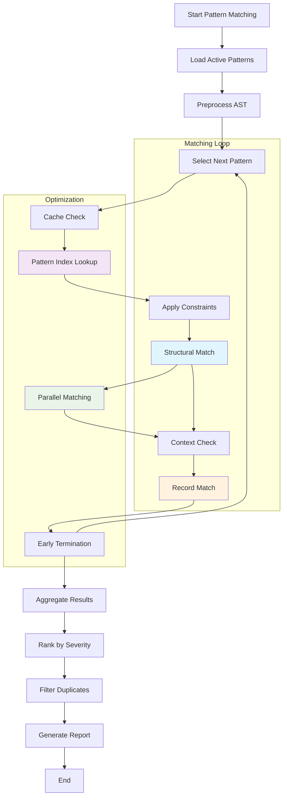

### Pattern Matching State Machine

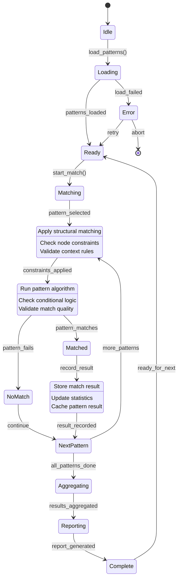

## Pattern Categories and Examples

### Structural Patterns

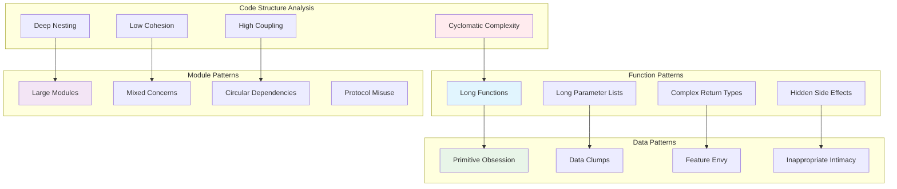

### Behavioral Patterns

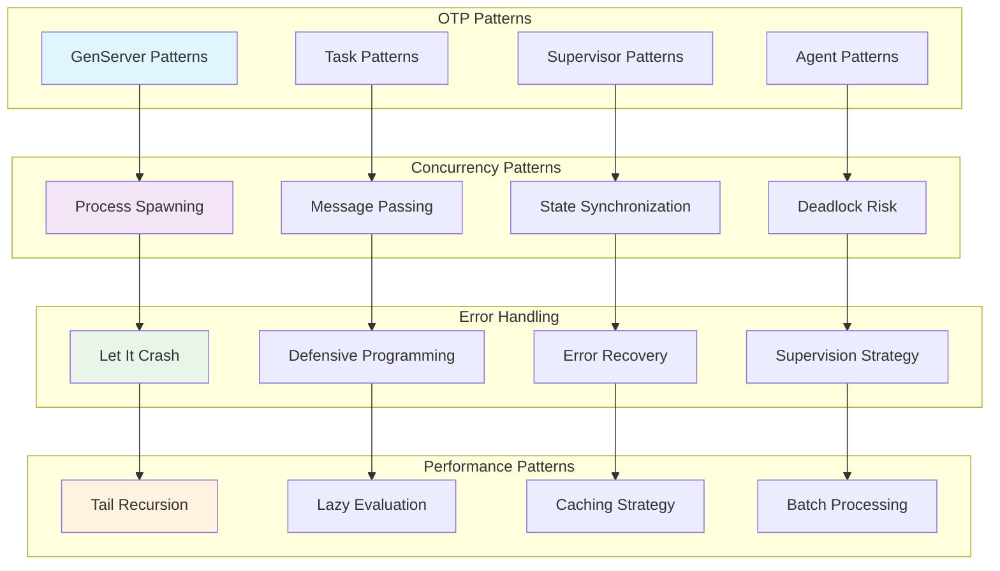

## Performance Pattern Analysis

### Performance Anti-Pattern Detection

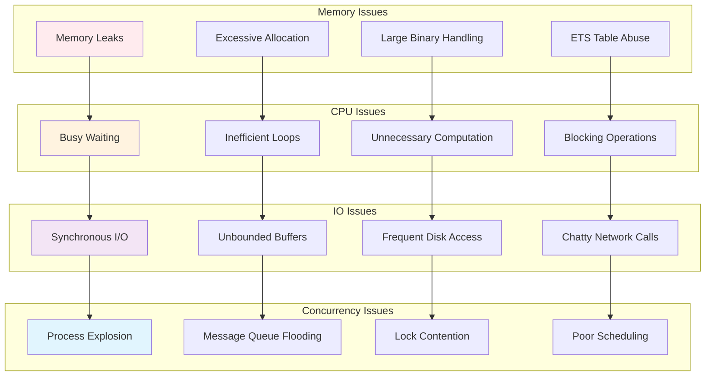

### Performance Optimization Suggestions

```mermaid
flowchart LR
    subgraph "Detection"
        ANTI_PATTERN[Anti-Pattern Detected]
        CONTEXT[Analyze Context]
        IMPACT[Assess Impact]
    end

    subgraph "Analysis"
        ROOT_CAUSE[Root Cause Analysis]
        ALTERNATIVES[Identify Alternatives]
        COST_BENEFIT[Cost-Benefit Analysis]
    end

    subgraph "Recommendation"
        SUGGESTION[Generate Suggestion]
        CODE_EXAMPLE[Provide Code Example]
        MIGRATION[Migration Strategy]
    end

    subgraph "Validation"
        RUNTIME_CHECK[Runtime Validation]
        PERFORMANCE_TEST[Performance Testing]
        MONITOR[Continuous Monitoring]
    end

    ANTI_PATTERN --> CONTEXT
    CONTEXT --> IMPACT
    IMPACT --> ROOT_CAUSE

    ROOT_CAUSE --> ALTERNATIVES
    ALTERNATIVES --> COST_BENEFIT
    COST_BENEFIT --> SUGGESTION

    SUGGESTION --> CODE_EXAMPLE
    CODE_EXAMPLE --> MIGRATION
    MIGRATION --> RUNTIME_CHECK

    RUNTIME_CHECK --> PERFORMANCE_TEST
    PERFORMANCE_TEST --> MONITOR

    style ANTI_PATTERN fill:#ffebee
    style ROOT_CAUSE fill:#e1f5fe
    style SUGGESTION fill:#e8f5e8
    style RUNTIME_CHECK fill:#f3e5f5
```

## Runtime Correlation Integration

### Static-Dynamic Pattern Correlation

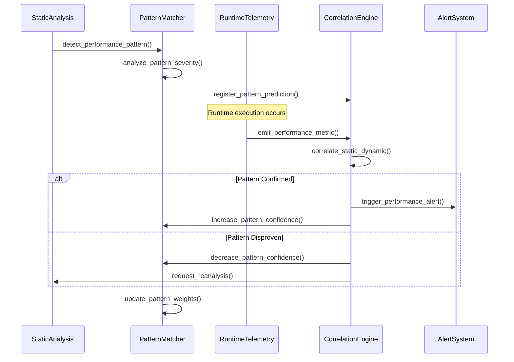

### Adaptive Pattern Learning

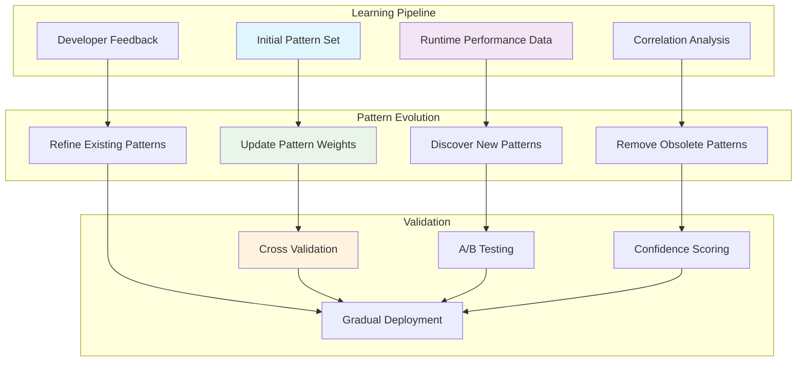

## API Specifications

### Pattern Matcher Interface

```elixir
defmodule ElixirScope.AST.PatternMatcher do
  @moduledoc """
  Core pattern matching engine for AST analysis.
  
  Performance Targets:
  - Simple patterns: < 50ms per 1000 LOC
  - Complex patterns: < 200ms per 1000 LOC
  - Pattern library load: < 100ms
  """

  @type pattern_result :: %{
    pattern_id: atom(),
    severity: :info | :warning | :error | :critical,
    location: source_location(),
    message: String.t(),
    suggestion: String.t() | nil,
    confidence: float(),
    correlation_id: binary() | nil
  }

  @spec match_patterns(enhanced_ast(), [pattern_spec()]) :: 
    {:ok, [pattern_result()]} | {:error, term()}
  @spec load_pattern_library(Path.t()) :: :ok | {:error, term()}
  @spec register_custom_pattern(pattern_spec()) :: :ok | {:error, term()}
  @spec update_pattern_weights(runtime_feedback()) :: :ok
end
```

### Pattern Library Manager

```elixir
defmodule ElixirScope.AST.PatternLibrary do
  @moduledoc """
  Manages pattern definitions and their lifecycle.
  """

  @type pattern_category :: :structural | :behavioral | :performance | 
                           :security | :style | :custom

  @spec list_patterns(pattern_category()) :: [pattern_spec()]
  @spec get_pattern(atom()) :: {:ok, pattern_spec()} | {:error, :not_found}
  @spec validate_pattern(pattern_spec()) :: :ok | {:error, validation_error()}
  @spec compile_pattern(pattern_spec()) :: {:ok, compiled_pattern()} | {:error, term()}
end
```

## Testing Strategy

### Pattern Testing Framework

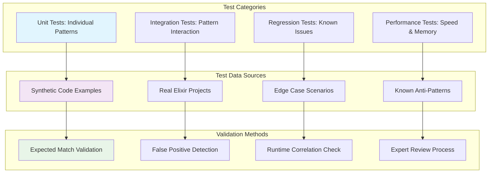

## Implementation Guidelines

### Development Phases

1. **Phase 1**: Core pattern matching engine
2. **Phase 2**: Built-in pattern library
3. **Phase 3**: Custom pattern support
4. **Phase 4**: Runtime correlation
5. **Phase 5**: Adaptive learning

### Quality Metrics

- **Pattern Accuracy**: >95% true positive rate
- **Performance**: <200ms for complex analysis
- **Memory Usage**: <100MB for pattern library
- **False Positives**: <5% across all patterns

## Next Steps

1. **Study Query System**: Review `05_ast_query_system.md`
2. **Examine Synchronization**: Review `06_ast_synchronization.md`
3. **Implement Core Engine**: Build pattern matching foundation
4. **Create Pattern Library**: Develop initial pattern set
5. **Add Runtime Integration**: Connect to telemetry system
