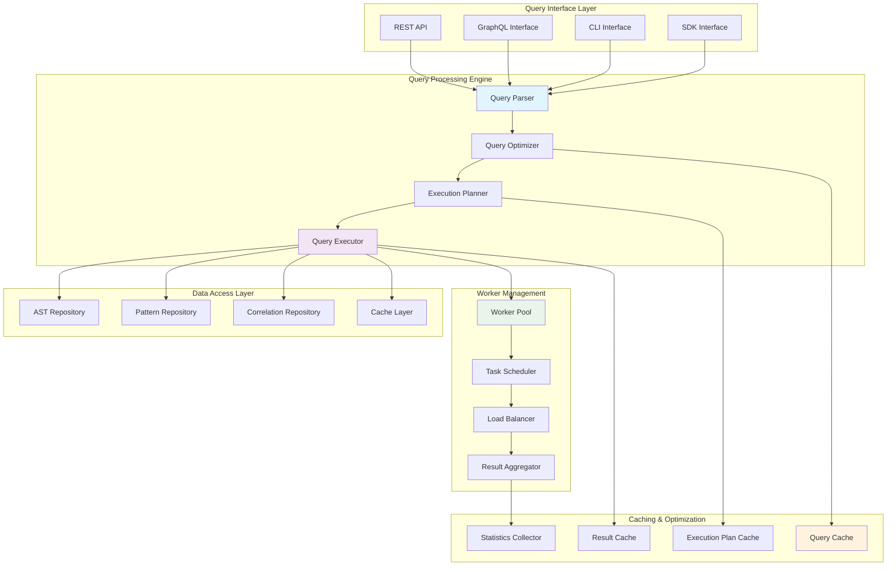
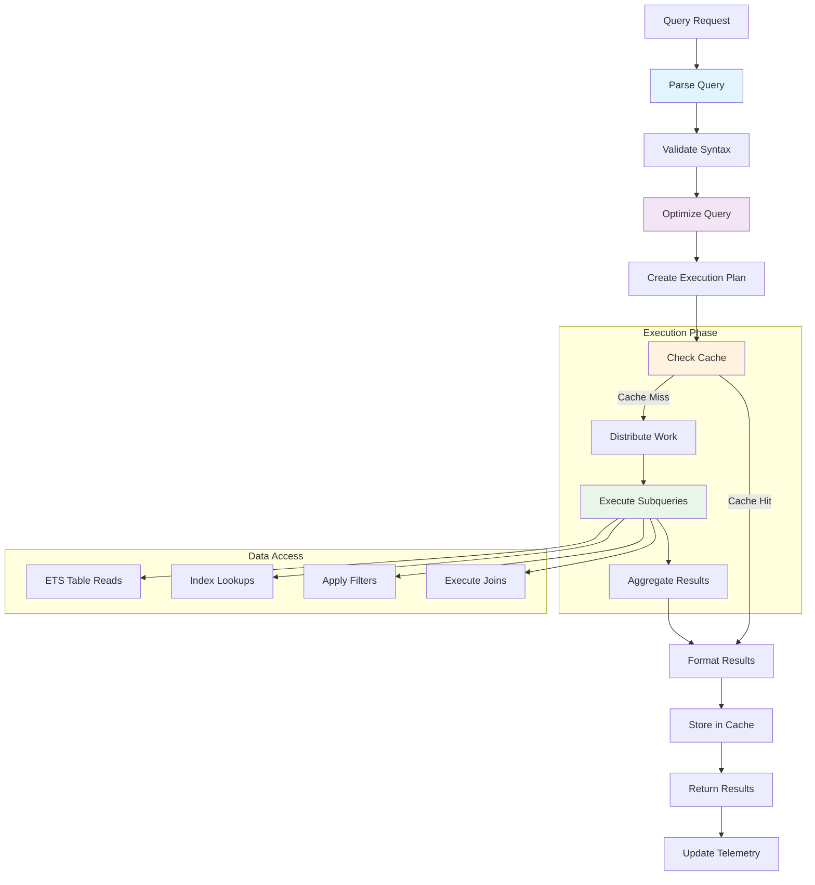
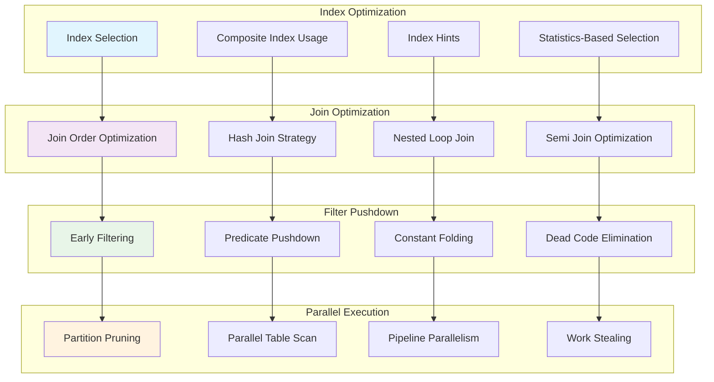
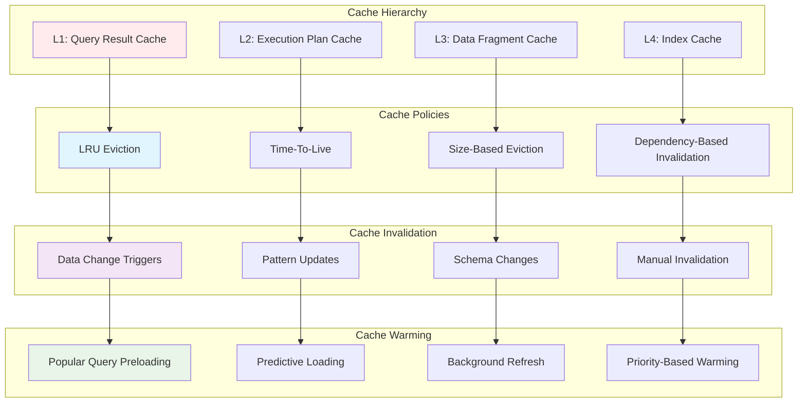
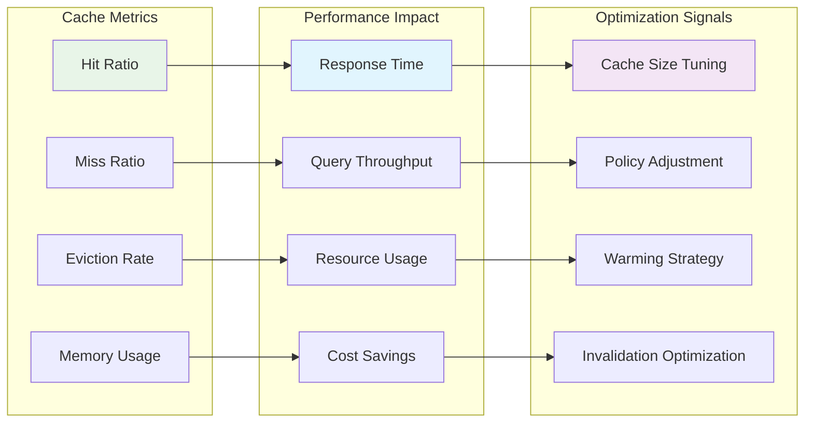
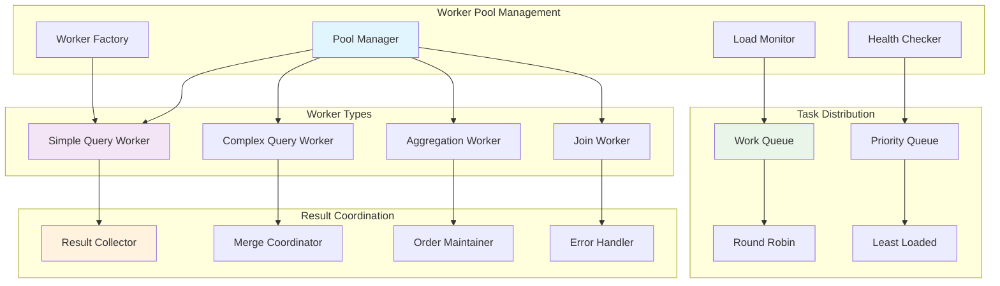
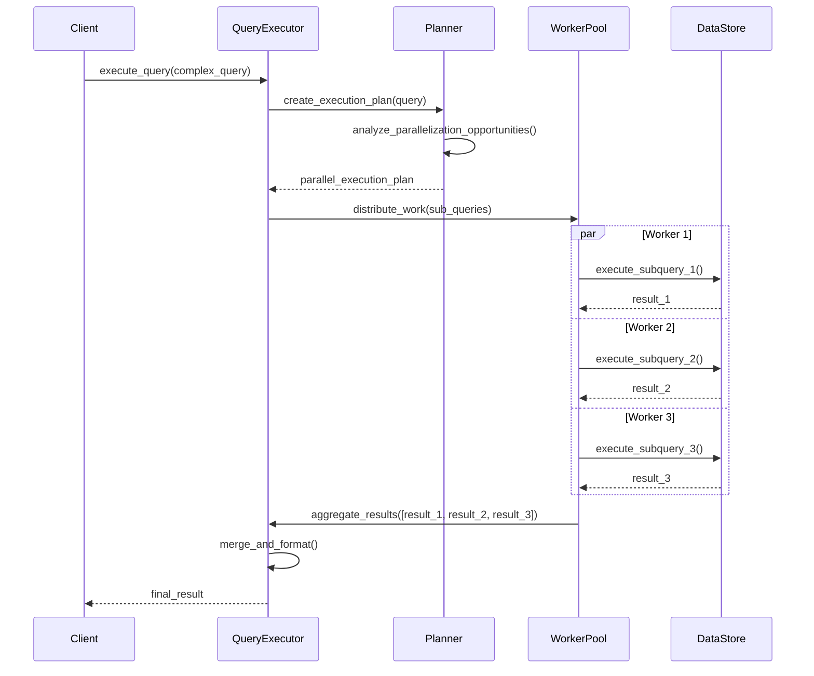
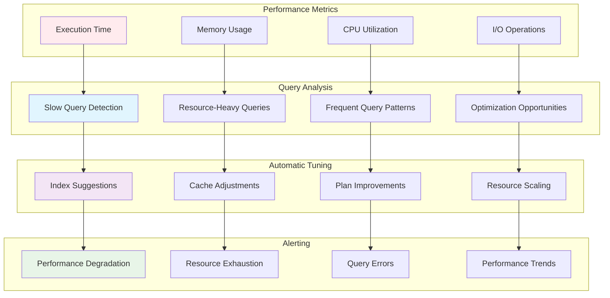
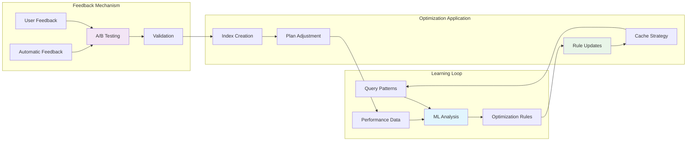
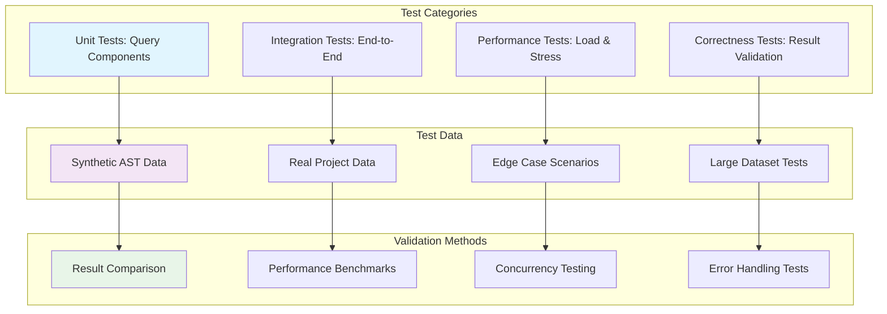

# AST Query System

**Version**: 1.0  
**Date**: June 2025  
**Component**: Query Subsystem  
**Purpose**: Flexible querying interface for AST data with high performance

## Query System Overview

The AST Query System provides a powerful, flexible, and high-performance interface for querying parsed AST data. It supports complex queries, real-time filtering, and efficient result caching with concurrent execution capabilities.

## Query System Architecture



## Query Language Design

### Query DSL Structure

```mermaid
graph TB
    subgraph "Query Components"
        SELECT[SELECT Clause]
        FROM[FROM Clause]
        WHERE[WHERE Clause]
        JOIN[JOIN Clause]
        ORDER[ORDER BY Clause]
        LIMIT[LIMIT Clause]
    end

    subgraph "Data Sources"
        MODULES[modules]
        FUNCTIONS[functions]
        PATTERNS[patterns]
        CORRELATIONS[correlations]
        METRICS[metrics]
    end

    subgraph "Filter Operations"
        EQUALS[equals]
        CONTAINS[contains]
        MATCHES[matches (regex)]
        IN_RANGE[in_range]
        HAS_ATTRIBUTE[has_attribute]
        COMPLEXITY[complexity_gt/lt]
    end

    subgraph "Aggregation Functions"
        COUNT[count()]
        SUM[sum()]
        AVG[avg()]
        MAX[max()]
        MIN[min()]
        GROUP_BY[group_by()]
    end

    SELECT --> MODULES
    FROM --> FUNCTIONS
    WHERE --> PATTERNS
    JOIN --> CORRELATIONS
    ORDER --> METRICS

    WHERE --> EQUALS
    WHERE --> CONTAINS
    WHERE --> MATCHES
    WHERE --> IN_RANGE
    WHERE --> HAS_ATTRIBUTE
    WHERE --> COMPLEXITY

    SELECT --> COUNT
    SELECT --> SUM
    SELECT --> AVG
    SELECT --> MAX
    SELECT --> MIN
    SELECT --> GROUP_BY

    style SELECT fill:#e1f5fe
    style WHERE fill:#f3e5f5
    style EQUALS fill:#e8f5e8
    style COUNT fill:#fff3e0
```

### Query Examples

```elixir
# Example 1: Find all functions with high complexity
%Query{
  select: [:module_name, :function_name, :complexity_score],
  from: :functions,
  where: [
    {:complexity_score, :gt, 10},
    {:module_name, :not_in, ["Test", "TestHelper"]}
  ],
  order_by: [{:complexity_score, :desc}],
  limit: 50
}

# Example 2: Find modules with pattern violations
%Query{
  select: [:module_name, :pattern_violations],
  from: :modules,
  join: [
    {:patterns, :module_name, :module_name}
  ],
  where: [
    {:pattern_violations, :count_gt, 5},
    {:severity, :in, [:warning, :error]}
  ],
  group_by: [:module_name],
  having: [
    {:pattern_violations, :count_gt, 5}
  ]
}

# Example 3: Correlation analysis query
%Query{
  select: [:static_prediction, :runtime_actual, :correlation_strength],
  from: :correlations,
  where: [
    {:event_type, :equals, :performance},
    {:timestamp, :between, {start_time, end_time}},
    {:correlation_strength, :gt, 0.7}
  ],
  aggregations: [
    {:avg_correlation, :avg, :correlation_strength},
    {:prediction_accuracy, :custom, &calculate_accuracy/1}
  ]
}
```

## Query Processing Pipeline

### Query Execution Flow



### Query Optimization Strategies



## Caching Strategy

### Multi-Level Caching Architecture



### Cache Performance Metrics



## Concurrent Query Execution

### Worker Pool Architecture



### Query Parallelization Strategy



## API Specifications

### Query Interface

```elixir
defmodule ElixirScope.AST.Query do
  @moduledoc """
  High-level query interface for AST data.
  
  Performance Targets:
  - Simple queries: < 50ms
  - Complex queries: < 500ms
  - Aggregation queries: < 1000ms
  - Concurrent queries: 100+ QPS
  """

  @type query_options :: %{
    timeout: non_neg_integer(),
    cache_enabled: boolean(),
    parallel_execution: boolean(),
    result_format: :list | :stream | :paginated
  }

  @spec execute(query_spec(), query_options()) :: 
    {:ok, query_result()} | {:error, query_error()}
  @spec execute_async(query_spec(), query_options()) :: 
    {:ok, query_handle()} | {:error, query_error()}
  @spec stream(query_spec(), query_options()) :: 
    Enumerable.t() | {:error, query_error()}
end
```

### Query Builder Interface

```elixir
defmodule ElixirScope.AST.QueryBuilder do
  @moduledoc """
  Fluent interface for building complex queries.
  """

  @spec new() :: QueryBuilder.t()
  @spec select(QueryBuilder.t(), [atom()]) :: QueryBuilder.t()
  @spec from(QueryBuilder.t(), atom()) :: QueryBuilder.t()
  @spec where(QueryBuilder.t(), query_condition()) :: QueryBuilder.t()
  @spec join(QueryBuilder.t(), join_spec()) :: QueryBuilder.t()
  @spec order_by(QueryBuilder.t(), order_spec()) :: QueryBuilder.t()
  @spec limit(QueryBuilder.t(), non_neg_integer()) :: QueryBuilder.t()
  @spec build(QueryBuilder.t()) :: query_spec()

  # Usage example:
  # QueryBuilder.new()
  # |> select([:module_name, :complexity_score])
  # |> from(:functions)
  # |> where({:complexity_score, :gt, 10})
  # |> order_by({:complexity_score, :desc})
  # |> limit(100)
  # |> build()
end
```

### Real-time Query Interface

```elixir
defmodule ElixirScope.AST.LiveQuery do
  @moduledoc """
  Real-time query subscriptions with live updates.
  """

  @type subscription_options :: %{
    refresh_interval: non_neg_integer(),
    auto_refresh: boolean(),
    change_detection: :full | :incremental,
    notification_method: :push | :poll
  }

  @spec subscribe(query_spec(), subscription_options()) :: 
    {:ok, subscription_id()} | {:error, term()}
  @spec unsubscribe(subscription_id()) :: :ok
  @spec get_updates(subscription_id()) :: [query_delta()]
end
```

## Performance Optimization

### Query Performance Monitoring



### Adaptive Query Optimization



## Testing Strategy

### Query Testing Framework



## Implementation Guidelines

### Development Phases

1. **Phase 1**: Basic query parser and executor
2. **Phase 2**: Caching and optimization
3. **Phase 3**: Concurrent execution
4. **Phase 4**: Real-time queries
5. **Phase 5**: Adaptive optimization

### Performance Targets

- **Simple Queries**: < 50ms response time
- **Complex Queries**: < 500ms response time
- **Concurrent Load**: 100+ queries per second
- **Memory Usage**: < 200MB for query engine
- **Cache Hit Rate**: > 80% for frequent queries

## Next Steps

1. **Study Synchronization**: Review `06_ast_synchronization.md`
2. **Examine Performance**: Review `07_ast_performance_optimization.md`
3. **Implement Query Parser**: Build DSL parsing
4. **Create Execution Engine**: Implement query execution
5. **Add Caching Layer**: Implement multi-level caching
