# AST Performance Optimization

**Version**: 1.0  
**Date**: June 2025  
**Component**: Performance Optimization  
**Purpose**: Comprehensive performance analysis and optimization strategies

## Performance Overview

The AST Performance Optimization focuses on achieving exceptional performance across all AST Layer components through intelligent caching, memory management, concurrent processing, and adaptive optimization techniques.

## Performance Architecture

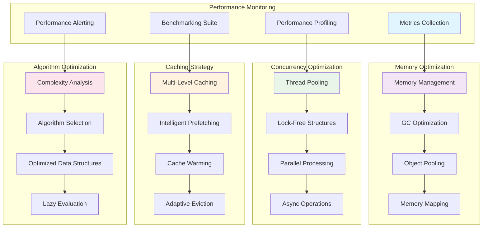

## Memory Optimization Strategies

### Memory Management Architecture

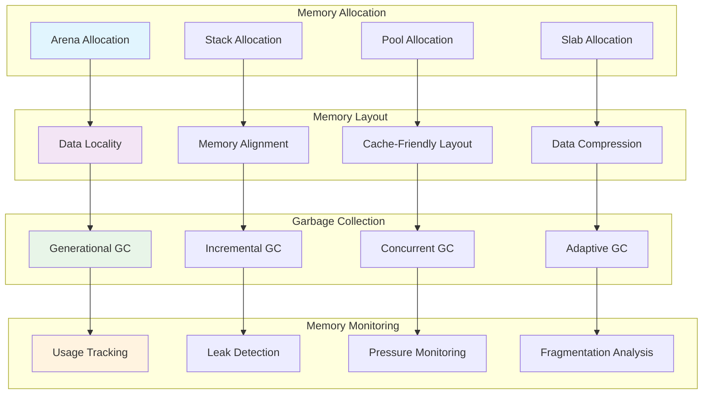

### Memory Pool Management

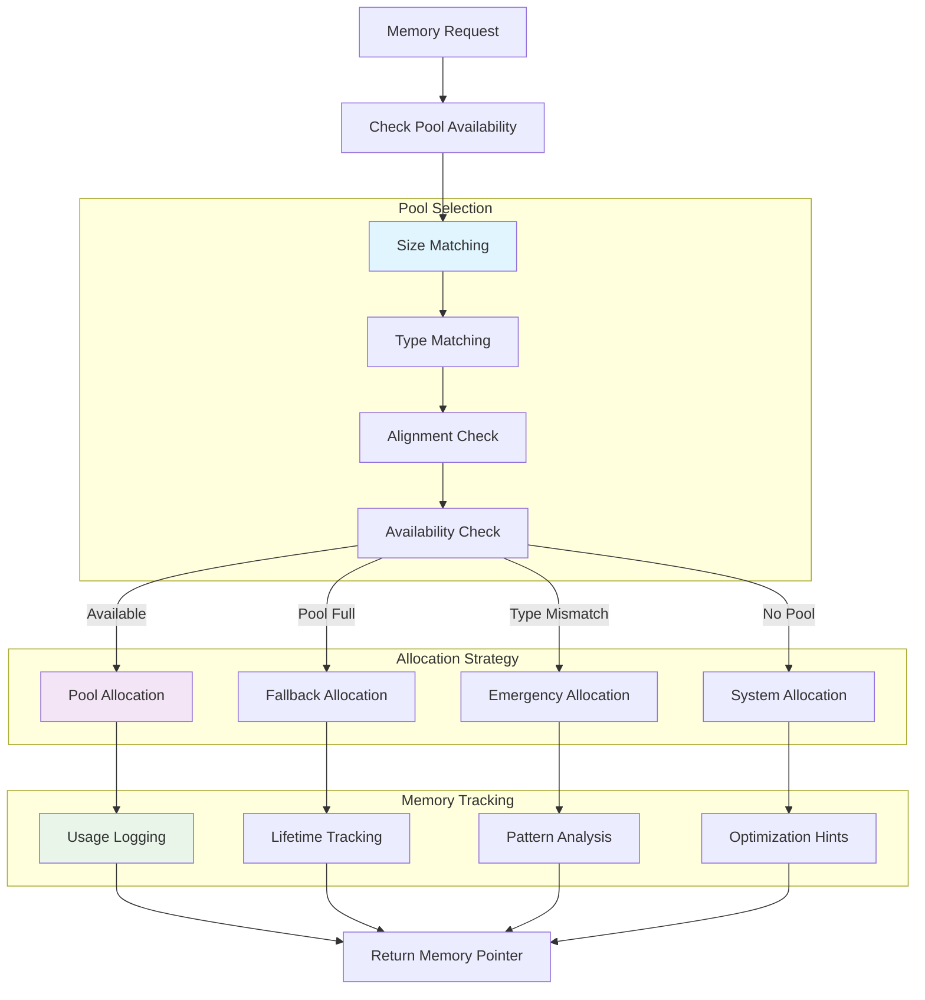

## Concurrency Optimization

### Lock-Free Data Structures

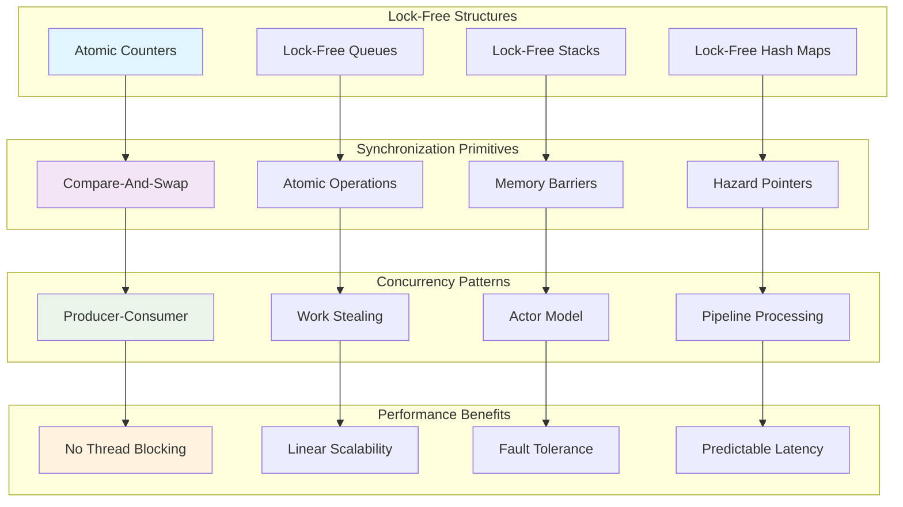

### Worker Pool Optimization

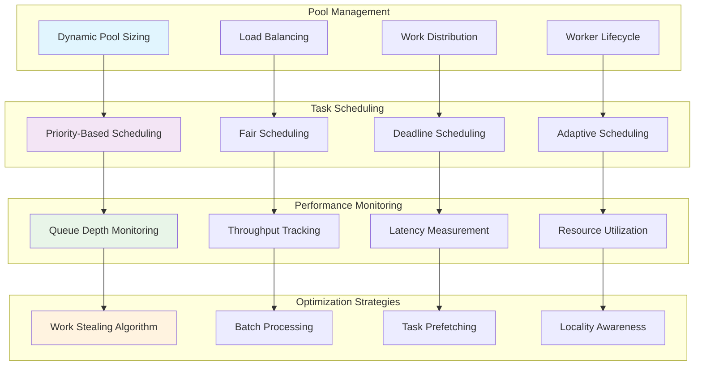

## Caching Optimization

### Intelligent Caching Architecture

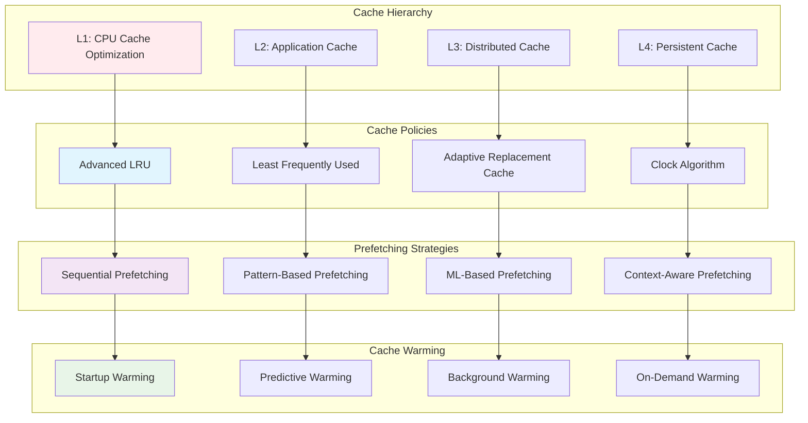

### Cache Performance Optimization

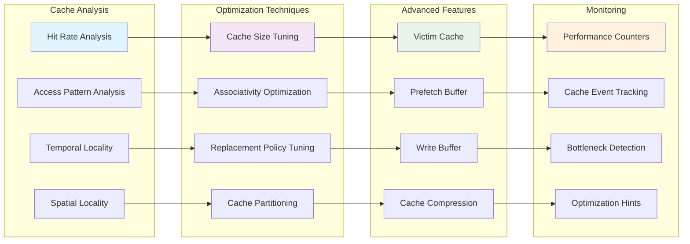

## Algorithm Optimization

### Complexity Analysis and Selection

```mermaid
graph TB
    subgraph "Complexity Classes"
        O_1[O(1) - Constant]
        O_LOG_N[O(log n) - Logarithmic]
        O_N[O(n) - Linear]
        O_N_LOG_N[O(n log n) - Linearithmic]
        O_N2[O(n²) - Quadratic]
    end

    subgraph "Algorithm Categories"
        SEARCH[Search Algorithms]
        SORT[Sorting Algorithms]
        GRAPH[Graph Algorithms]
        STRING[String Algorithms]
        NUMERIC[Numeric Algorithms]
    end

    subgraph "Data Structure Selection"
        ARRAYS[Dynamic Arrays]
        TREES[Balanced Trees]
        HASHES[Hash Tables]
        GRAPHS[Graph Structures]
        SPECIALIZED[Specialized Structures]
    end

    subgraph "Optimization Techniques"
        MEMOIZATION[Memoization]
        DYNAMIC_PROGRAMMING[Dynamic Programming]
        DIVIDE_CONQUER[Divide and Conquer]
        GREEDY[Greedy Algorithms]
        APPROXIMATION[Approximation Algorithms]
    end

    O_1 --> SEARCH
    O_LOG_N --> SORT
    O_N --> GRAPH
    O_N_LOG_N --> STRING
    O_N2 --> NUMERIC

    SEARCH --> ARRAYS
    SORT --> TREES
    GRAPH --> HASHES
    STRING --> GRAPHS
    NUMERIC --> SPECIALIZED

    ARRAYS --> MEMOIZATION
    TREES --> DYNAMIC_PROGRAMMING
    HASHES --> DIVIDE_CONQUER
    GRAPHS --> GREEDY
    SPECIALIZED --> APPROXIMATION

    style O_1 fill:#e8f5e8
    style SEARCH fill:#e1f5fe
    style ARRAYS fill:#f3e5f5
    style MEMOIZATION fill:#fff3e0
```

### Adaptive Algorithm Selection

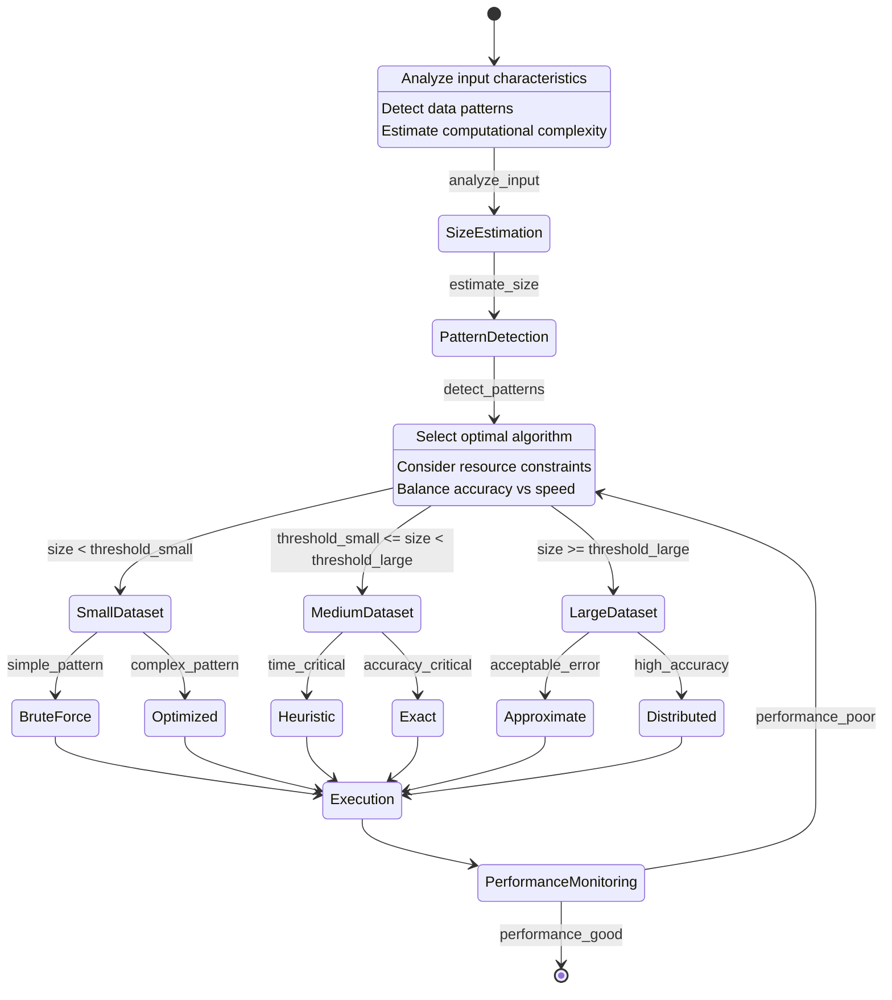

## Performance Monitoring

### Real-time Performance Metrics

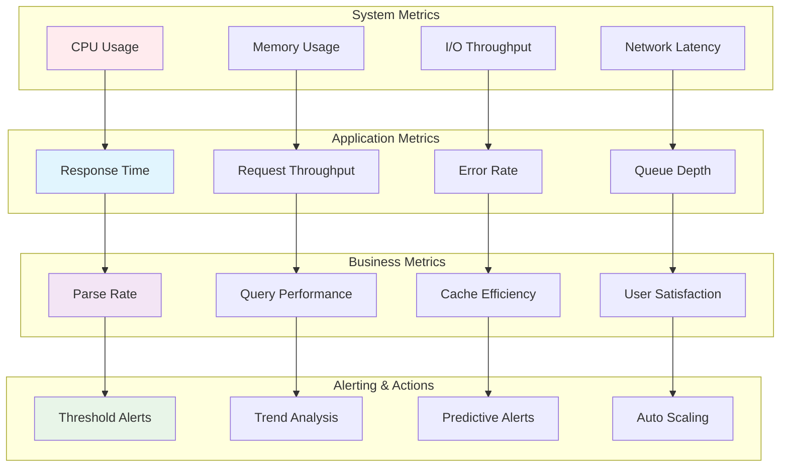

### Performance Profiling Dashboard

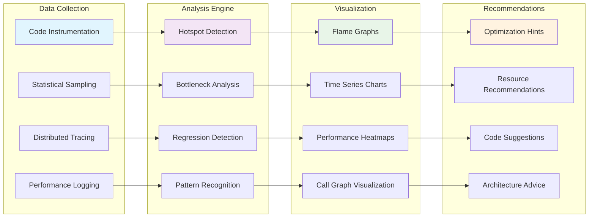

## Adaptive Optimization

### Machine Learning-Based Optimization

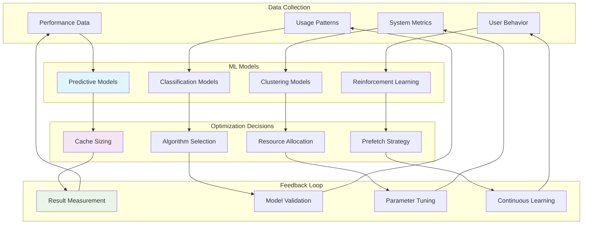

## API Specifications

### Performance Monitor Interface

```elixir
defmodule ElixirScope.AST.PerformanceMonitor do
  @moduledoc """
  Performance monitoring and optimization service.
  
  Targets:
  - Monitoring overhead: < 2% of total CPU
  - Metric collection frequency: 1Hz - 1000Hz configurable
  - Alert response time: < 100ms
  """

  @type metric_type :: :counter | :gauge | :histogram | :summary
  @type performance_metric :: %{
    name: atom(),
    type: metric_type(),
    value: number(),
    timestamp: DateTime.t(),
    tags: map()
  }

  @spec start_monitoring(monitoring_config()) :: :ok | {:error, term()}
  @spec stop_monitoring() :: :ok
  @spec collect_metrics() :: [performance_metric()]
  @spec set_threshold(atom(), number()) :: :ok
  @spec get_performance_report(time_range()) :: performance_report()
end
```

### Optimization Engine Interface

```elixir
defmodule ElixirScope.AST.OptimizationEngine do
  @moduledoc """
  Adaptive optimization engine for automatic performance tuning.
  """

  @type optimization_strategy :: :aggressive | :conservative | :balanced | :custom
  @type optimization_result :: %{
    strategy: optimization_strategy(),
    improvements: [improvement()],
    estimated_gain: float(),
    confidence: float()
  }

  @spec analyze_performance() :: performance_analysis()
  @spec suggest_optimizations() :: [optimization_suggestion()]
  @spec apply_optimization(optimization_suggestion()) :: optimization_result()
  @spec rollback_optimization(optimization_id()) :: :ok | {:error, term()}
end
```

### Cache Manager Interface

```elixir
defmodule ElixirScope.AST.CacheManager do
  @moduledoc """
  Intelligent cache management with adaptive policies.
  """

  @type cache_policy :: :lru | :lfu | :arc | :adaptive
  @type cache_stats :: %{
    hit_rate: float(),
    miss_rate: float(),
    eviction_rate: float(),
    memory_usage: non_neg_integer()
  }

  @spec configure_cache(cache_config()) :: :ok | {:error, term()}
  @spec get_cache_stats() :: cache_stats()
  @spec optimize_cache_policy() :: :ok
  @spec warm_cache(warming_strategy()) :: :ok
  @spec clear_cache(cache_selector()) :: :ok
end
```

## Testing Strategy

### Performance Testing Framework

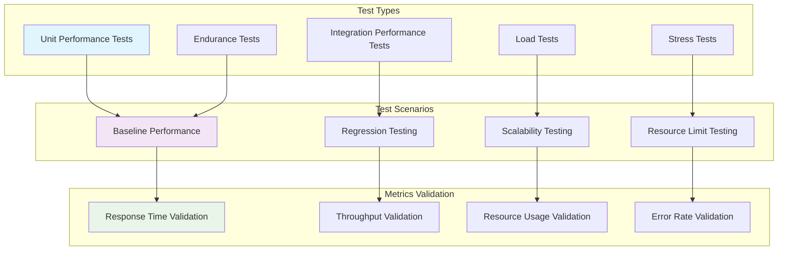

## Implementation Guidelines

### Development Phases

1. **Phase 1**: Basic performance monitoring and metrics
2. **Phase 2**: Memory and concurrency optimization
3. **Phase 3**: Intelligent caching implementation
4. **Phase 4**: Algorithm optimization and selection
5. **Phase 5**: Machine learning-based adaptive optimization

### Performance Targets

- **Memory Usage**: < 500MB for 100K LOC project
- **CPU Usage**: < 20% under normal load
- **Response Time**: 99th percentile < 100ms
- **Throughput**: > 1000 requests/second
- **Cache Hit Rate**: > 85% for frequent queries

## Next Steps

1. **Study Testing Framework**: Review `08_ast_testing_framework.md`
2. **Examine Error Handling**: Review `09_ast_error_handling.md`
3. **Implement Performance Monitoring**: Build metrics collection
4. **Create Optimization Engine**: Implement adaptive optimization
5. **Add Machine Learning**: Integrate ML-based optimization
