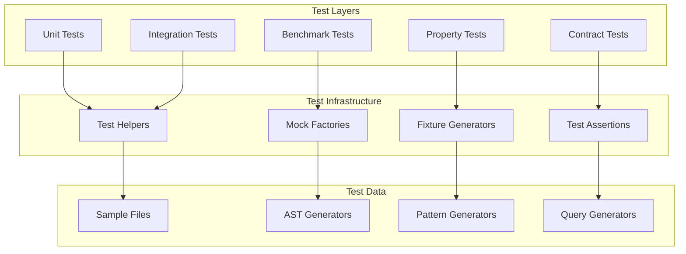
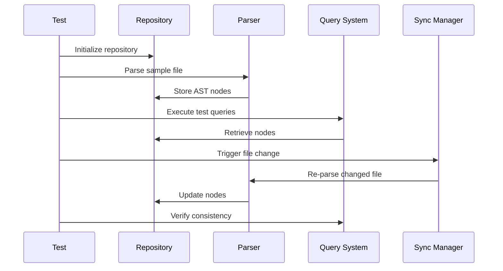

# AST Testing Framework

## Overview

This document outlines the comprehensive testing strategy for the AST layer, including unit tests, integration tests, property-based tests, and performance benchmarks.

## Testing Architecture



## Unit Testing Strategy

### Repository Tests
```elixir
defmodule AST.RepositoryTest do
  use ExUnit.Case
  use ExUnitProperties
  
  alias AST.Repository
  alias AST.Repository.Node
  
  describe "node storage" do
    test "stores and retrieves nodes correctly" do
      repo = Repository.new()
      node = %Node{id: "test-1", type: :function_def, metadata: %{}}
      
      {:ok, repo} = Repository.store_node(repo, node)
      
      assert {:ok, ^node} = Repository.get_node(repo, "test-1")
    end
    
    property "maintains referential integrity" do
      check all nodes <- list_of(node_generator(), min_length: 1, max_length: 100) do
        repo = Repository.new()
        
        # Store all nodes
        repo = Enum.reduce(nodes, repo, fn node, acc ->
          {:ok, acc} = Repository.store_node(acc, node)
          acc
        end)
        
        # Verify all nodes can be retrieved
        Enum.all?(nodes, fn node ->
          {:ok, _} = Repository.get_node(repo, node.id)
        end)
      end
    end
  end
  
  defp node_generator do
    gen all id <- string(:alphanumeric, min_length: 1, max_length: 20),
            type <- member_of([:function_def, :module_def, :call, :variable]),
            line <- positive_integer(),
            column <- positive_integer() do
      %Node{
        id: id,
        type: type,
        metadata: %{line: line, column: column}
      }
    end
  end
end
```

### Parser Tests
```elixir
defmodule AST.ParserTest do
  use ExUnit.Case
  
  alias AST.Parser
  alias AST.Repository.Node
  
  describe "function parsing" do
    test "parses simple function definition" do
      code = """
      def hello(name) do
        "Hello, #{name}!"
      end
      """
      
      {:ok, nodes} = Parser.parse(code)
      
      assert [%Node{type: :function_def} = func_node | _] = nodes
      assert func_node.metadata.name == "hello"
      assert length(func_node.metadata.parameters) == 1
    end
    
    test "handles parsing errors gracefully" do
      invalid_code = "def incomplete_function("
      
      {:error, %Parser.Error{} = error} = Parser.parse(invalid_code)
      
      assert error.type == :syntax_error
      assert error.line > 0
      assert error.column > 0
    end
  end
  
  describe "module parsing" do
    test "parses module with functions" do
      code = """
      defmodule MyModule do
        def func1, do: :ok
        def func2(x), do: x * 2
      end
      """
      
      {:ok, nodes} = Parser.parse(code)
      
      module_node = Enum.find(nodes, &(&1.type == :module_def))
      function_nodes = Enum.filter(nodes, &(&1.type == :function_def))
      
      assert module_node.metadata.name == "MyModule"
      assert length(function_nodes) == 2
    end
  end
end
```

## Integration Testing

### End-to-End Workflow Tests


```elixir
defmodule AST.IntegrationTest do
  use ExUnit.Case
  
  alias AST.{Repository, Parser, Query, SyncManager}
  
  setup do
    {:ok, repo} = Repository.start_link([])
    {:ok, sync} = SyncManager.start_link(repository: repo)
    {:ok, query} = Query.start_link(repository: repo)
    
    %{repository: repo, sync_manager: sync, query_system: query}
  end
  
  test "complete workflow: parse, query, update", context do
    # Initial file parsing
    file_path = "/tmp/test_file.ex"
    initial_content = """
    defmodule TestModule do
      def initial_function, do: :ok
    end
    """
    
    File.write!(file_path, initial_content)
    
    # Parse and store
    {:ok, _} = SyncManager.add_file(context.sync_manager, file_path)
    
    # Wait for parsing
    :timer.sleep(100)
    
    # Query for functions
    {:ok, functions} = Query.execute(
      context.query_system,
      "functions in module TestModule"
    )
    
    assert length(functions) == 1
    assert hd(functions).metadata.name == "initial_function"
    
    # Update file
    updated_content = """
    defmodule TestModule do
      def initial_function, do: :ok
      def new_function(x), do: x + 1
    end
    """
    
    File.write!(file_path, updated_content)
    
    # Wait for re-parsing
    :timer.sleep(100)
    
    # Query again
    {:ok, updated_functions} = Query.execute(
      context.query_system,
      "functions in module TestModule"
    )
    
    assert length(updated_functions) == 2
    
    function_names = Enum.map(updated_functions, & &1.metadata.name)
    assert "initial_function" in function_names
    assert "new_function" in function_names
    
    # Cleanup
    File.rm!(file_path)
  end
end
```

## Property-Based Testing

### AST Invariants
```elixir
defmodule AST.PropertyTest do
  use ExUnit.Case
  use ExUnitProperties
  
  alias AST.{Repository, Parser, Query}
  
  property "parsing and querying are consistent" do
    check all code <- valid_elixir_code_generator() do
      {:ok, repo} = Repository.start_link([])
      {:ok, query} = Query.start_link(repository: repo)
      
      # Parse code
      case Parser.parse(code) do
        {:ok, nodes} ->
          # Store nodes
          Enum.each(nodes, &Repository.store_node(repo, &1))
          
          # Query all nodes
          {:ok, all_nodes} = Query.execute(query, "all nodes")
          
          # Verify consistency
          assert length(all_nodes) == length(nodes)
          
          # Verify node integrity
          Enum.each(all_nodes, fn node ->
            assert is_binary(node.id)
            assert is_atom(node.type)
            assert is_map(node.metadata)
          end)
          
        {:error, _} ->
          # Parsing errors are acceptable for property testing
          :ok
      end
    end
  end
  
  property "repository operations maintain consistency" do
    check all operations <- list_of(repository_operation_generator()) do
      {:ok, repo} = Repository.start_link([])
      
      final_state = Enum.reduce(operations, %{}, fn op, acc ->
        case op do
          {:store, node} ->
            {:ok, _} = Repository.store_node(repo, node)
            Map.put(acc, node.id, node)
            
          {:delete, id} ->
            Repository.delete_node(repo, id)
            Map.delete(acc, id)
            
          {:update, id, changes} ->
            case Repository.get_node(repo, id) do
              {:ok, node} ->
                updated_node = struct(node, changes)
                {:ok, _} = Repository.store_node(repo, updated_node)
                Map.put(acc, id, updated_node)
              {:error, :not_found} ->
                acc
            end
        end
      end)
      
      # Verify final state matches repository
      Enum.each(final_state, fn {id, expected_node} ->
        {:ok, actual_node} = Repository.get_node(repo, id)
        assert actual_node == expected_node
      end)
    end
  end
  
  defp valid_elixir_code_generator do
    one_of([
      simple_function_generator(),
      simple_module_generator(),
      variable_assignment_generator()
    ])
  end
  
  defp simple_function_generator do
    gen all name <- atom(:alphanumeric),
            params <- list_of(atom(:alphanumeric), max_length: 3) do
      param_string = Enum.join(params, ", ")
      "def #{name}(#{param_string}), do: :ok"
    end
  end
  
  defp repository_operation_generator do
    one_of([
      {:store, node_generator()},
      {:delete, string(:alphanumeric, min_length: 1)},
      {:update, string(:alphanumeric, min_length: 1), map_of(atom(:alphanumeric), term())}
    ])
  end
end
```

## Performance Benchmarks

### Benchmark Suite
```elixir
defmodule AST.Benchmarks do
  use Benchee
  
  alias AST.{Repository, Parser, Query}
  
  def run_benchmarks do
    # Repository benchmarks
    repository_benchmarks()
    
    # Parser benchmarks
    parser_benchmarks()
    
    # Query benchmarks
    query_benchmarks()
  end
  
  defp repository_benchmarks do
    {:ok, repo} = Repository.start_link([])
    
    # Generate test data
    small_nodes = generate_nodes(100)
    medium_nodes = generate_nodes(1_000)
    large_nodes = generate_nodes(10_000)
    
    Benchee.run(%{
      "store_100_nodes" => fn -> 
        Enum.each(small_nodes, &Repository.store_node(repo, &1))
      end,
      "store_1k_nodes" => fn -> 
        Enum.each(medium_nodes, &Repository.store_node(repo, &1))
      end,
      "store_10k_nodes" => fn -> 
        Enum.each(large_nodes, &Repository.store_node(repo, &1))
      end
    })
  end
  
  defp parser_benchmarks do
    small_file = generate_elixir_code(10)    # 10 functions
    medium_file = generate_elixir_code(100)  # 100 functions
    large_file = generate_elixir_code(1000)  # 1000 functions
    
    Benchee.run(%{
      "parse_small_file" => fn -> Parser.parse(small_file) end,
      "parse_medium_file" => fn -> Parser.parse(medium_file) end,
      "parse_large_file" => fn -> Parser.parse(large_file) end
    })
  end
  
  defp query_benchmarks do
    {:ok, repo} = Repository.start_link([])
    {:ok, query} = Query.start_link(repository: repo)
    
    # Populate with test data
    nodes = generate_nodes(10_000)
    Enum.each(nodes, &Repository.store_node(repo, &1))
    
    Benchee.run(%{
      "simple_query" => fn -> 
        Query.execute(query, "type = function_def")
      end,
      "complex_query" => fn -> 
        Query.execute(query, "type = function_def AND arity > 2")
      end,
      "pattern_query" => fn -> 
        Query.execute(query, "pattern: def #{name}(#{params}) when #{guard}")
      end
    })
  end
  
  defp generate_nodes(count) do
    Enum.map(1..count, fn i ->
      %Repository.Node{
        id: "node-#{i}",
        type: Enum.random([:function_def, :module_def, :call, :variable]),
        metadata: %{
          line: :rand.uniform(1000),
          column: :rand.uniform(80),
          name: "item_#{i}"
        }
      }
    end)
  end
end
```

## Test Data Management

### Fixture Generation
```elixir
defmodule AST.TestFixtures do
  @moduledoc """
  Generates test fixtures for AST testing
  """
  
  def sample_elixir_files do
    %{
      simple_module: """
      defmodule Simple do
        def hello, do: "world"
      end
      """,
      
      complex_module: """
      defmodule Complex do
        @moduledoc "A complex module"
        
        defstruct [:name, :value]
        
        def new(name, value \\\\ 0) do
          %__MODULE__{name: name, value: value}
        end
        
        def update(%__MODULE__{} = struct, value) when is_integer(value) do
          %{struct | value: value}
        end
        
        defp private_helper(x, y) do
          x + y
        end
      end
      """,
      
      protocol_implementation: """
      defprotocol Drawable do
        def draw(shape)
      end
      
      defimpl Drawable, for: Circle do
        def draw(%Circle{radius: r}) do
          "Circle with radius #{r}"
        end
      end
      """
    }
  end
  
  def expected_ast_structures do
    %{
      simple_module: [
        %{type: :module_def, name: "Simple"},
        %{type: :function_def, name: "hello", arity: 0}
      ],
      
      complex_module: [
        %{type: :module_def, name: "Complex"},
        %{type: :module_attribute, name: :moduledoc},
        %{type: :defstruct, fields: [:name, :value]},
        %{type: :function_def, name: "new", arity: 2},
        %{type: :function_def, name: "update", arity: 2},
        %{type: :function_def, name: "private_helper", arity: 2, visibility: :private}
      ]
    }
  end
end
```

## Test Automation

### CI/CD Integration
```yaml
# .github/workflows/ast_tests.yml
name: AST Tests

on: [push, pull_request]

jobs:
  test:
    runs-on: ubuntu-latest
    
    strategy:
      matrix:
        elixir: ['1.14', '1.15']
        otp: ['24', '25']
    
    steps:
    - uses: actions/checkout@v3
    
    - name: Setup Elixir
      uses: erlef/setup-beam@v1
      with:
        elixir-version: ${{ matrix.elixir }}
        otp-version: ${{ matrix.otp }}
    
    - name: Install dependencies
      run: mix deps.get
    
    - name: Run unit tests
      run: mix test test/ast/unit/
    
    - name: Run integration tests
      run: mix test test/ast/integration/
    
    - name: Run property tests
      run: mix test test/ast/property/ --max-runs 1000
    
    - name: Run benchmarks
      run: mix run -e "AST.Benchmarks.run_benchmarks()"
    
    - name: Generate coverage report
      run: mix coveralls.github
      env:
        GITHUB_TOKEN: ${{ secrets.GITHUB_TOKEN }}
```

## Quality Gates

### Test Coverage Requirements
- Unit tests: 95% line coverage
- Integration tests: 90% feature coverage
- Property tests: Cover all major invariants
- Benchmarks: Performance regression detection

### Test Execution Phases
1. **Fast Tests** (< 1 second): Unit tests, basic integration
2. **Medium Tests** (< 30 seconds): Complex integration, property tests
3. **Slow Tests** (< 5 minutes): Full system tests, benchmarks
4. **Stress Tests** (< 30 minutes): Load testing, memory profiling

## Testing Best Practices

### Code Organization
- One test module per source module
- Group related tests in describe blocks
- Use meaningful test names
- Maintain test data separately

### Test Isolation
- Each test should be independent
- Use setup/teardown for clean state
- Mock external dependencies
- Avoid shared mutable state

### Performance Testing
- Establish baseline metrics
- Monitor for regressions
- Test with realistic data volumes
- Profile memory usage patterns

This testing framework ensures comprehensive coverage of the AST layer with automated quality gates and performance monitoring.
