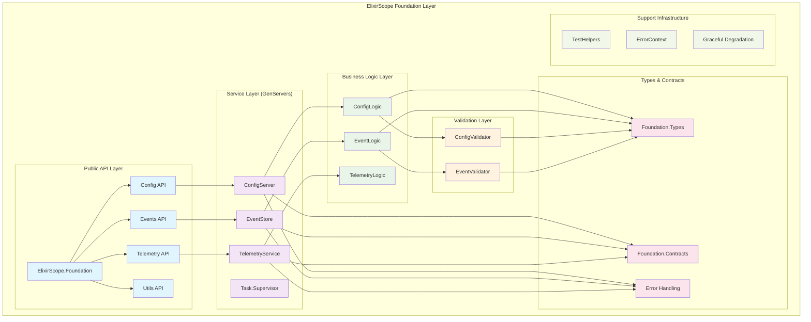
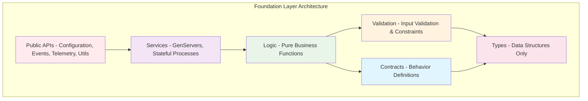
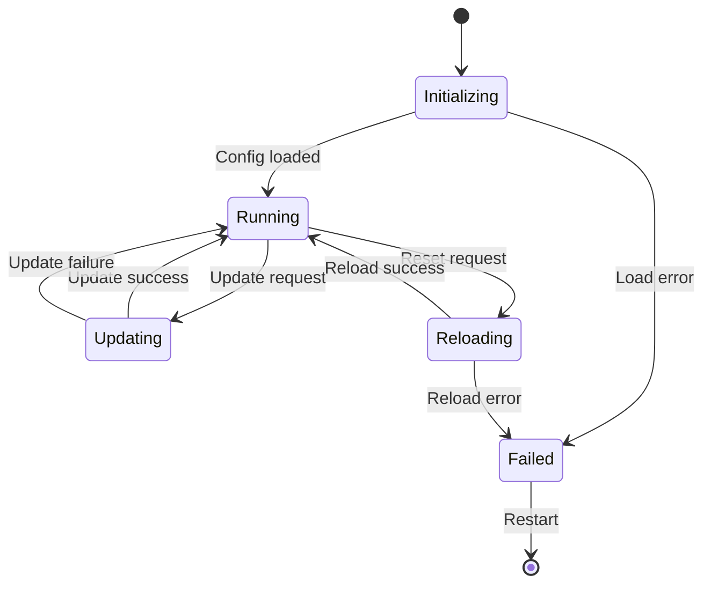
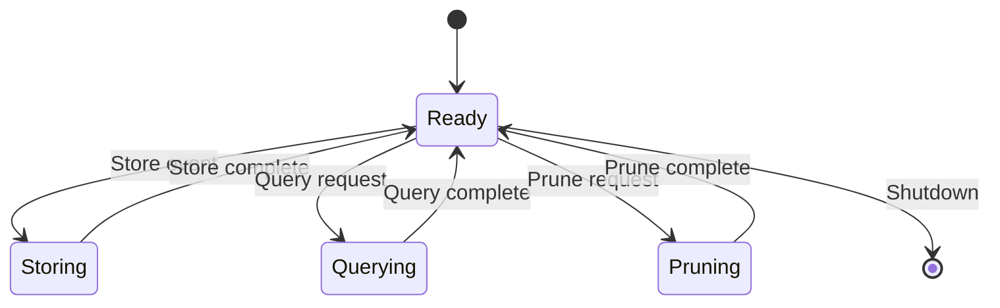
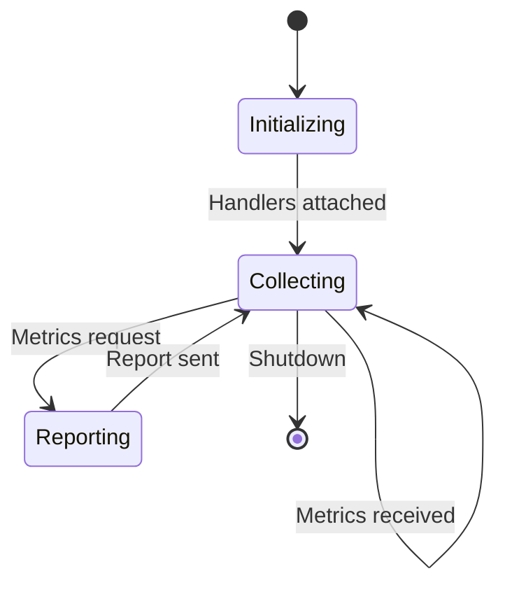
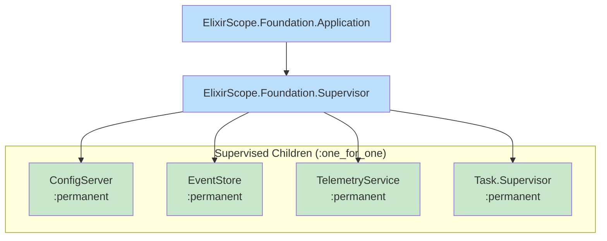
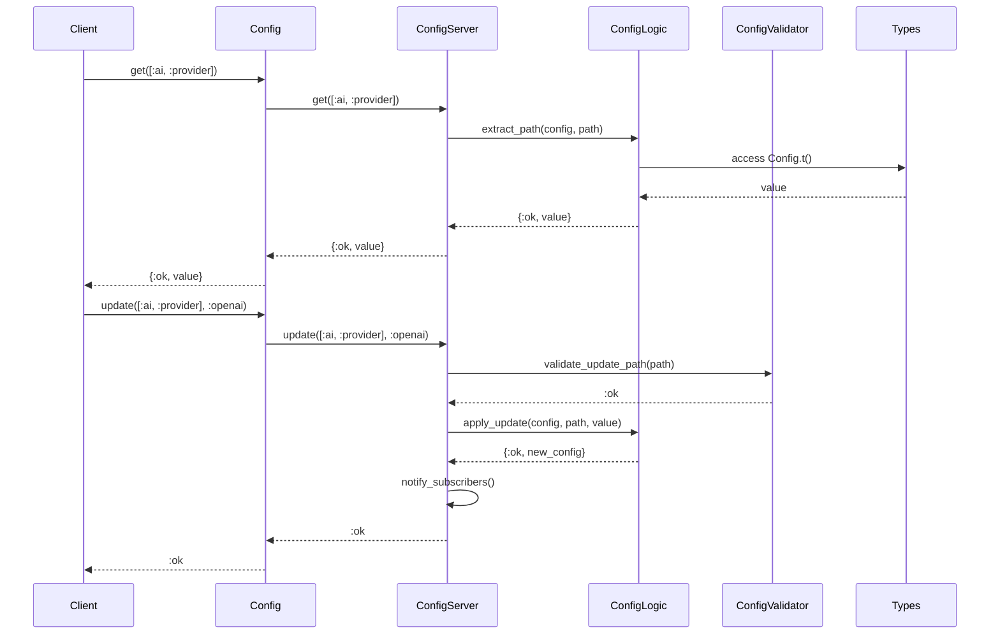
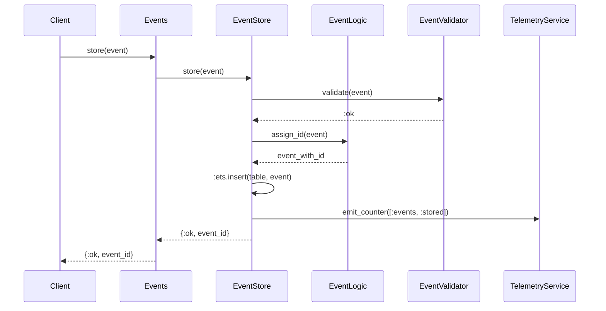
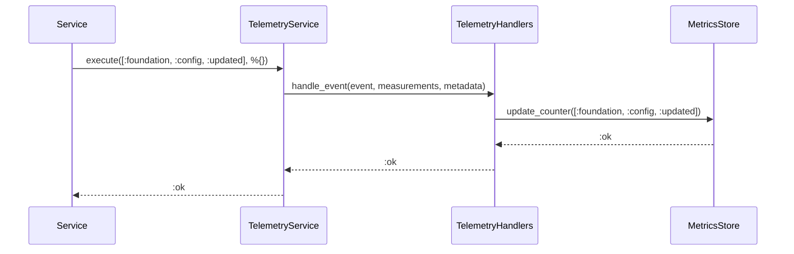
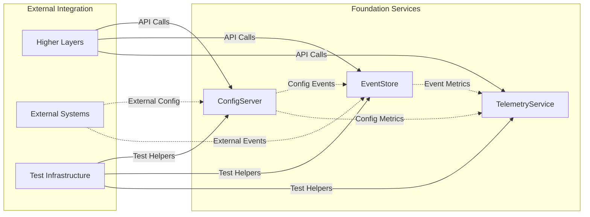

# ElixirScope Foundation Layer - Architecture Overview

## Executive Summary

The ElixirScope Foundation layer represents a sophisticated, enterprise-grade infrastructure implementation built on BEAM/OTP principles. This document provides a comprehensive architectural overview of the Foundation layer's design, patterns, and implementation strategies.

## Table of Contents

1. [System Architecture](#system-architecture)
2. [Layer Design Principles](#layer-design-principles)
3. [Component Overview](#component-overview)
4. [Supervision Strategy](#supervision-strategy)
5. [Data Flow Patterns](#data-flow-patterns)
6. [Integration Points](#integration-points)

## System Architecture

### High-Level Architecture Diagram

## Layer Design Principles

### 1. Layered Architecture with Clear Boundaries

The Foundation layer implements a 6-tier architecture:

### 2. Dependency Flow Rules

**Strict Dependency Direction**: Dependencies only flow downward
- Public APIs → Services → Logic → Validation → Types
- No upward dependencies allowed
- Cross-layer integration through well-defined contracts

### 3. Separation of Concerns

- **Pure Types**: Data structures only, no business logic
- **Business Logic**: Pure functions, easily testable
- **Services**: GenServers and stateful processes
- **Contracts**: Behavior definitions for interface consistency
- **Validation**: Pure validation functions
- **Public APIs**: Thin wrappers over services

## Component Overview

### Core Services

#### ConfigServer

**Responsibilities:**
- Configuration persistence and retrieval
- Runtime configuration updates with validation
- Configuration change notifications
- Subscriber management with process monitoring

#### EventStore

**Responsibilities:**
- Event persistence in ETS tables
- Event querying and retrieval
- Correlation chain management
- Event pruning and lifecycle management

#### TelemetryService

**Responsibilities:**
- Telemetry event collection
- Metrics aggregation and storage
- Performance monitoring
- Handler attachment/detachment

## Supervision Strategy

### Supervision Characteristics

- **Strategy**: `:one_for_one` - Services restart independently
- **Restart Policy**: `:permanent` - Services always restart on failure
- **Initialization Order**: ConfigServer → EventStore → TelemetryService
- **Graceful Shutdown**: Services stop in reverse dependency order

## Data Flow Patterns

### Configuration Flow

### Event Flow

### Telemetry Flow

## Integration Points

### Inter-Service Communication

### Key Integration Patterns

1. **Event-Driven Updates**: Configuration changes trigger events
2. **Metrics Collection**: All operations generate telemetry
3. **Error Propagation**: Structured error handling across layers
4. **Test Integration**: Comprehensive test helper support
5. **External System Integration**: Clean boundaries for external dependencies

## Quality Attributes

### Performance Characteristics
- **ID Generation**: ~1-5 μs per ID
- **Event Creation**: ~10-50 μs per event
- **Configuration Access**: ~10-50 μs per get
- **Serialization**: ~50-200 μs per event

### Reliability Features
- **Fault Isolation**: Service failures don't cascade
- **Graceful Degradation**: Fallback mechanisms for service unavailability
- **Error Recovery**: Automatic restart and recovery patterns
- **Data Consistency**: ETS-based storage with transaction-like semantics

### Observability
- **Comprehensive Telemetry**: All operations instrumented
- **Structured Logging**: Consistent log formats and levels
- **Health Checks**: Service availability and status monitoring
- **Performance Metrics**: Latency, throughput, and resource usage tracking

## Conclusion

The ElixirScope Foundation layer represents a mature, enterprise-ready infrastructure implementation that demonstrates best practices in:

- **Layered Architecture**: Clear separation of concerns and responsibility
- **OTP Design**: Proper supervision, fault tolerance, and process management
- **Type Safety**: Comprehensive type specifications and validation
- **Testing Strategy**: Multi-level testing from unit to integration
- **Performance**: Optimized for high-frequency operations
- **Maintainability**: Clean abstractions and well-defined interfaces

This foundation provides a solid basis for the higher layers of the ElixirScope system while maintaining independence and reusability.
