# ElixirScope Foundation Layer - Concurrency & OTP Patterns

## Overview

The Foundation layer exemplifies sophisticated use of BEAM/OTP concurrency patterns, implementing a robust concurrent architecture that balances performance, fault tolerance, and consistency. This document analyzes the concurrency model, OTP usage patterns, and concurrent system design principles.

## Table of Contentsa

1. [Concurrency Architecture](#concurrency-architecture)
2. [OTP Pattern Usage](#otp-pattern-usage)
3. [Process Management](#process-management)
4. [Message Passing Patterns](#message-passing-patterns)
5. [Fault Tolerance Design](#fault-tolerance-design)
6. [Performance Under Load](#performance-under-load)
7. [Scalability Patterns](#scalability-patterns)

## Concurrency Architecture

### Process Architecture Overview


### Concurrency Characteristics Matrix

| Component | Concurrency Model | Message Pattern | State Management | Isolation Level |
|-----------|------------------|-----------------|------------------|-----------------|
| ConfigServer | Actor Model | Sync Calls + Async Casts | Mutable State | Process-level |
| EventStore | Actor Model | Async Dominant | Append-only Buffer | Process-level |
| TelemetryService | Actor Model | Fire-and-forget | Aggregated State | Process-level |
| TaskSupervisor | Supervision | Dynamic Spawning | Stateless | Child-level |

## OTP Pattern Usage

### GenServer Implementation Patterns


### Supervision Strategy Patterns


### Behavior Implementation Analysis

```mermaid
classDiagram
    class GenServerBehavior {
        +init(args)
        +handle_call(request, from, state)
        +handle_cast(request, state)
        +handle_info(msg, state)
        +terminate(reason, state)
        +code_change(old_vsn, state, extra)
    }
    
    class ConfigServer {
        +init([opts])
        +handle_call(:get, from, state)
        +handle_call({:update, path, value}, from, state)
        +handle_cast({:subscribe, pid}, state)
        +handle_info({:DOWN, ref, :process, pid, reason}, state)
        +handle_info(:cleanup_timeout, state)
    }
    
    class EventStore {
        +init([opts])
        +handle_call({:query, filters}, from, state)
        +handle_cast({:store, event}, state)
        +handle_info(:flush_buffer, state)
        +handle_info(:periodic_cleanup, state)
    }
    
    class TelemetryService {
        +init([opts])
        +handle_call(:get_metrics, from, state)
        +handle_cast({:record_metric, metric}, state)
        +handle_info(:aggregate_metrics, state)
        +handle_info(:export_metrics, state)
    }
    
    GenServerBehavior <|-- ConfigServer
    GenServerBehavior <|-- EventStore
    GenServerBehavior <|-- TelemetryService
```

## Process Management

### Process Lifecycle Management


### Process Registration and Discovery

```mermaid
graph TB
    subgraph "Process Registration"
        LocalReg[Local Registration]
        GlobalReg[Global Registration]
        Registry[Process Registry]
    end
    
    subgraph "Foundation Services"
        ConfigServer[ConfigServer<br/>:elixir_scope_config_server]
        EventStore[EventStore<br/>:elixir_scope_event_store]
        TelemetryService[TelemetryService<br/>:elixir_scope_telemetry]
    end
    
    subgraph "Discovery Patterns"
        ByName[Process.whereis/1]
        ByPid[Direct PID]
        ViaRegistry[{:via, Registry, key}]
    end
    
    LocalReg --> ConfigServer
    LocalReg --> EventStore
    LocalReg --> TelemetryService
    
    ByName --> LocalReg
    ViaRegistry --> Registry
```

## Message Passing Patterns

### Synchronous vs Asynchronous Patterns

```mermaid
graph TB
    subgraph "Synchronous Operations"
        GetConfig[Config.get/0]
        QueryEvents[Events.query/1]
        GetMetrics[Telemetry.get_metrics/0]
        StatusCheck[Service.status/0]
    end
    
    subgraph "Asynchronous Operations"
        UpdateConfig[Config.update/2]
        StoreEvent[Events.store/1]
        RecordMetric[Telemetry.execute/3]
        Notifications[Change Notifications]
    end
    
    subgraph "Performance Characteristics"
        SyncLatency[10-100μs latency]
        AsyncThroughput[>5K ops/sec]
        BackpressureHandling[Backpressure Management]
    end
    
    GetConfig --> SyncLatency
    UpdateConfig --> AsyncThroughput
    StoreEvent --> BackpressureHandling
```



### Message Flow Patterns


### Backpressure Management


## Fault Tolerance Design

### Error Handling Strategies


### Circuit Breaker Pattern


### Supervision Tree Resilience


## Performance Under Load

### Load Testing Scenarios


### Performance Optimization Patterns


## Scalability Patterns

### Horizontal Scaling Considerations


### Multi-Node Architecture Vision


## Best Practices Summary

### Concurrency Design Principles

1. **Actor Model Adherence**: Each service is an isolated actor
2. **Message Immutability**: All messages are immutable data structures
3. **Fail Fast Philosophy**: Early detection and explicit error handling
4. **Resource Boundaries**: Clear resource limits and cleanup
5. **Observable Behavior**: Comprehensive telemetry and logging

### Performance Guidelines

| Operation Type | Recommendation | Implementation |
|----------------|---------------|----------------|
| Read Operations | Use synchronous calls for consistency | GenServer.call/3 |
| Write Operations | Use asynchronous casts for throughput | GenServer.cast/2 |
| Notifications | Use async broadcasting | Process.send/2 |
| Batch Operations | Implement batching for efficiency | Periodic processing |

### Monitoring and Observability


## Conclusion

The Foundation layer's concurrency architecture demonstrates sophisticated understanding and application of BEAM/OTP principles. The design successfully balances:

- **Concurrency**: Efficient use of actor model and message passing
- **Fault Tolerance**: Robust supervision and error handling
- **Performance**: Optimized patterns for high-throughput operations
- **Scalability**: Architecture that supports future horizontal scaling

This foundation provides a solid base for building reliable, concurrent applications on the BEAM virtual machine, serving as an exemplar of OTP best practices in production systems.
