# ElixirScope Foundation - Integration Patterns & Cross-Layer Communication

## Executive Summary

This document explores the integration patterns used by the ElixirScope Foundation layer for cross-layer communication, API design, and interaction with higher-level layers. It covers dependency injection patterns, interface contracts, communication protocols, and integration testing strategies.

## Table of Contents

1. [Integration Architecture](#integration-architecture)
2. [Layer Communication Patterns](#layer-communication-patterns)
3. [Dependency Injection Strategy](#dependency-injection-strategy)
4. [Interface Contracts & Behaviors](#interface-contracts--behaviors)
5. [Cross-Layer Data Flow](#cross-layer-data-flow)
6. [API Evolution & Versioning](#api-evolution--versioning)
7. [Integration Testing](#integration-testing)
8. [Performance Integration](#performance-integration)

---

## Integration Architecture

### Foundation Integration Overview

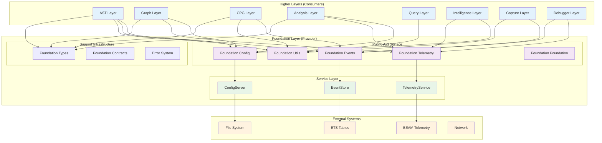

### Integration Principles

1. **Stable API Surface**: Foundation provides unchanging public APIs
2. **Contract-Based Integration**: All interactions through defined behaviors
3. **Loose Coupling**: Higher layers depend on interfaces, not implementations
4. **Graceful Degradation**: Foundation failures don't cascade upward
5. **Observable Integration**: All cross-layer interactions are instrumented

---

## Layer Communication Patterns

### Synchronous API Patterns

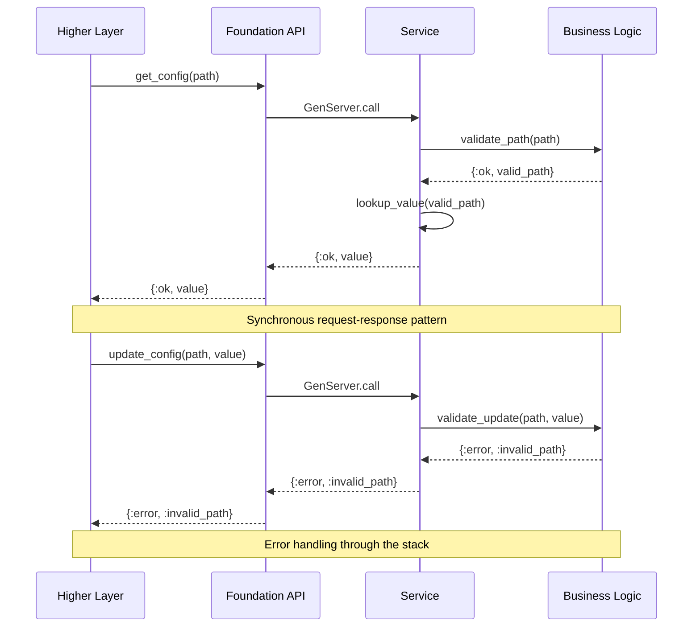

### Asynchronous Event Patterns

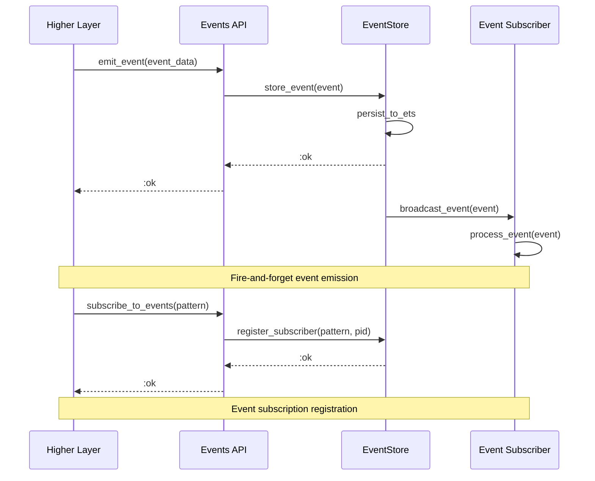

### Telemetry Integration Pattern

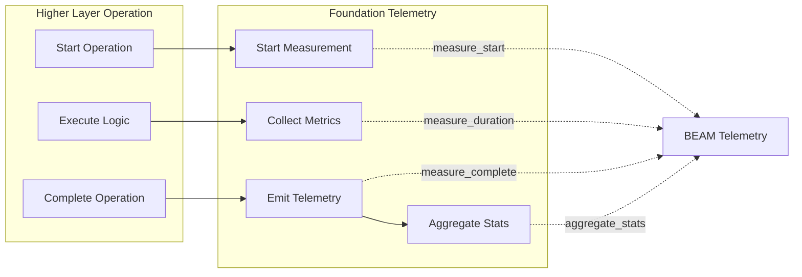

---

## Dependency Injection Strategy

### When Foundation Uses DI

```elixir
# Foundation internal DI for testability
defmodule ElixirScope.Foundation.Services.ConfigServer do
  use GenServer
  
  # DI for external dependencies only
  def start_link(opts \\ []) do
    config = [
      file_system: Keyword.get(opts, :file_system, File),
      time_provider: Keyword.get(opts, :time_provider, :os),
      id_generator: Keyword.get(opts, :id_generator, &UUID.uuid4/0)
    ]
    GenServer.start_link(__MODULE__, config, name: __MODULE__)
  end
  
  # No DI between Foundation modules - direct calls
  def handle_call({:validate_config, config}, _from, state) do
    case ElixirScope.Foundation.Validation.ConfigValidator.validate(config) do
      {:ok, validated} -> {:reply, {:ok, validated}, state}
      error -> {:reply, error, state}
    end
  end
end
```

### When Higher Layers Use DI

```elixir
# Higher layers inject Foundation dependencies
defmodule ElixirScope.AST.ConfigManager do
  # Inject Foundation config dependency
  def get_parsing_config(config_provider \\ ElixirScope.Foundation.Config) do
    with {:ok, config} <- config_provider.get([:ast, :parsing]) do
      transform_for_ast(config)
    end
  end
  
  # Inject Foundation events dependency
  def emit_parsing_event(event_data, events_provider \\ ElixirScope.Foundation.Events) do
    event = events_provider.ast_parsing_complete(event_data)
    events_provider.emit(event)
  end
end

# Test with mock providers
defmodule MockConfig do
  def get(_path), do: {:ok, %{batch_size: 100}}
end

# Test usage
ElixirScope.AST.ConfigManager.get_parsing_config(MockConfig)
```

### DI Pattern Guidelines

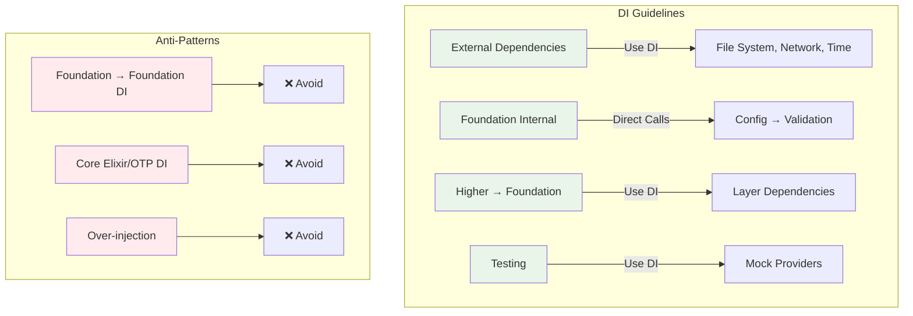

---

## Interface Contracts & Behaviors

### Foundation Public Behaviors

```elixir
# Configuration behavior for higher layers
defmodule ElixirScope.Foundation.Contracts.Configurable do
  @moduledoc """
  Behavior for configuration providers that higher layers can depend on.
  """
  
  @type config_path :: [atom()]
  @type config_value :: term()
  @type config_result :: {:ok, config_value()} | {:error, Error.t()}
  
  @callback get() :: {:ok, Config.t()} | {:error, Error.t()}
  @callback get(config_path()) :: config_value() | nil
  @callback update(config_path(), config_value()) :: :ok | {:error, Error.t()}
  @callback validate(Config.t()) :: :ok | {:error, Error.t()}
end

# Events behavior for higher layers
defmodule ElixirScope.Foundation.Contracts.EventEmitter do
  @moduledoc """
  Behavior for event emission that higher layers can depend on.
  """
  
  @type event_data :: map()
  @type event_pattern :: term()
  
  @callback emit(Event.t()) :: :ok | {:error, Error.t()}
  @callback subscribe(event_pattern(), pid()) :: :ok | {:error, Error.t()}
  @callback unsubscribe(event_pattern(), pid()) :: :ok
end

# Telemetry behavior for higher layers
defmodule ElixirScope.Foundation.Contracts.TelemetryProvider do
  @moduledoc """
  Behavior for telemetry collection that higher layers can depend on.
  """
  
  @type telemetry_event :: [atom()]
  @type telemetry_metadata :: map()
  
  @callback measure(telemetry_event(), telemetry_metadata(), function()) :: term()
  @callback emit(telemetry_event(), telemetry_metadata()) :: :ok
  @callback attach(telemetry_event(), function()) :: :ok | {:error, Error.t()}
end
```

### Cross-Layer Interface Patterns

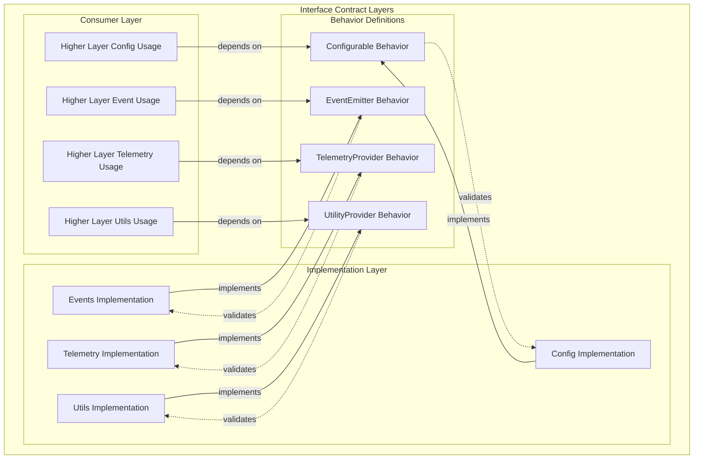

---

## Cross-Layer Data Flow

### Data Transformation Pipeline

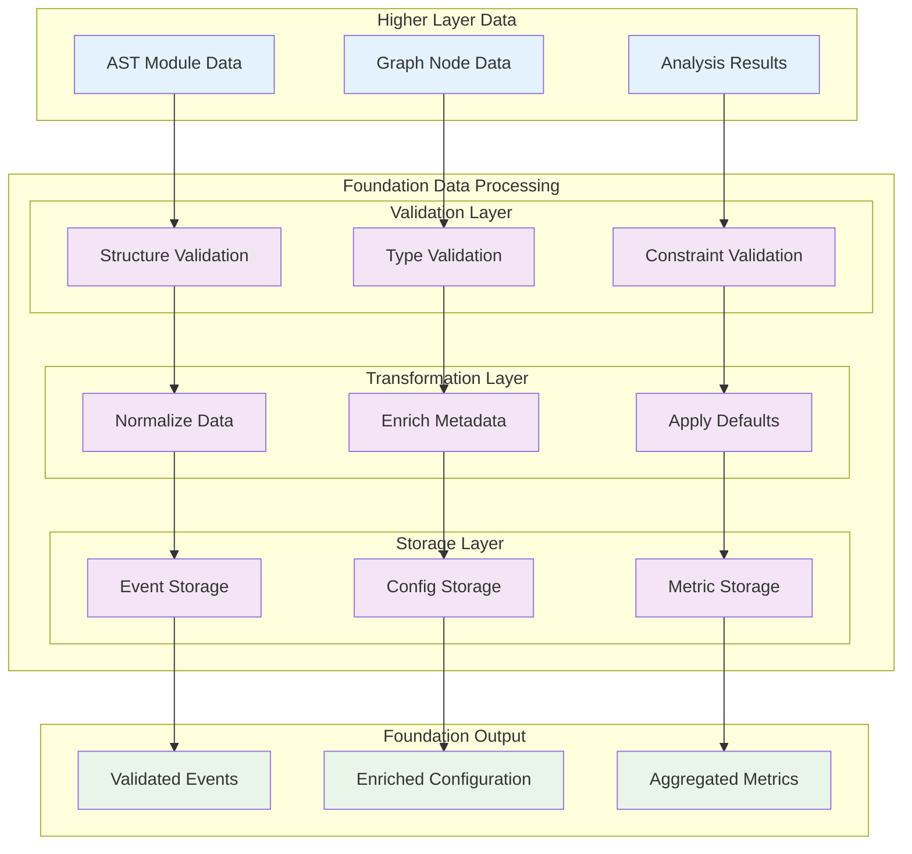

### Event-Driven Integration

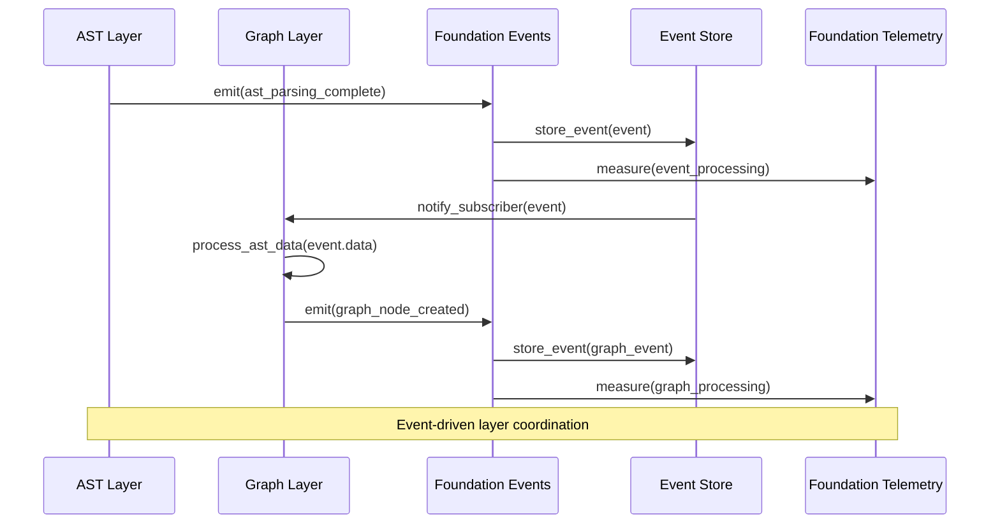

---

## API Evolution & Versioning

### Version Management Strategy

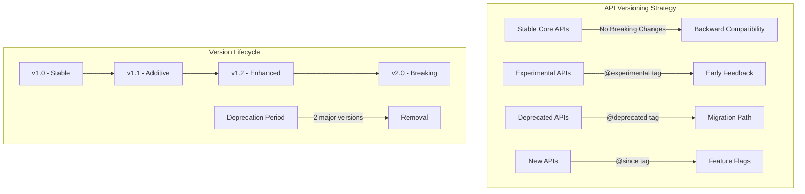

### API Contract Evolution

```elixir
# Version 1.0 - Initial API
defmodule ElixirScope.Foundation.Config do
  @spec get() :: {:ok, Config.t()} | {:error, Error.t()}
  def get(), do: ConfigServer.get_config()
end

# Version 1.1 - Additive enhancement
defmodule ElixirScope.Foundation.Config do
  @spec get() :: {:ok, Config.t()} | {:error, Error.t()}
  def get(), do: ConfigServer.get_config()
  
  @spec get(config_path()) :: config_value() | nil
  @since "1.1.0"
  def get(path), do: ConfigServer.get_config_value(path)
end

# Version 1.2 - Experimental feature
defmodule ElixirScope.Foundation.Config do
  # ... existing functions ...
  
  @spec watch(config_path(), pid()) :: :ok | {:error, Error.t()}
  @since "1.2.0"
  @experimental "Config watching may change in future versions"
  def watch(path, subscriber_pid), do: ConfigServer.watch_config(path, subscriber_pid)
end

# Version 2.0 - Breaking change with migration
defmodule ElixirScope.Foundation.Config do
  @spec get() :: {:ok, Config.t()} | {:error, Error.t()}
  def get(), do: ConfigServer.get_config()
  
  @spec get(config_path()) :: {:ok, config_value()} | {:error, Error.t()}
  @since "2.0.0"
  def get(path) when is_list(path) do
    # Breaking change: now returns {:ok, value} instead of value | nil
    case ConfigServer.get_config_value(path) do
      nil -> {:error, Error.new(:config_not_found, "Path not found: #{inspect(path)}")}
      value -> {:ok, value}
    end
  end
  
  @spec get_value(config_path()) :: config_value() | nil
  @deprecated "Use get/1 instead. Will be removed in v3.0"
  @since "1.1.0"
  def get_value(path), do: ConfigServer.get_config_value(path)
end
```

---

## Integration Testing

### Cross-Layer Integration Test Architecture

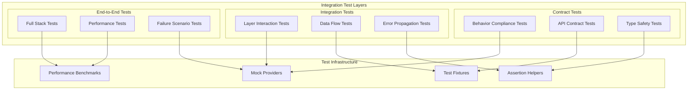

### Contract Testing Patterns

```elixir
# Contract test for Configurable behavior
defmodule ElixirScope.Foundation.ConfigurableContractTest do
  use ExUnit.Case
  
  @behaviour_module ElixirScope.Foundation.Contracts.Configurable
  @implementation_module ElixirScope.Foundation.Config
  
  describe "Configurable behavior compliance" do
    test "get/0 returns valid config struct" do
      assert {:ok, config} = @implementation_module.get()
      assert %ElixirScope.Foundation.Types.Config{} = config
    end
    
    test "get/1 with valid path returns value or nil" do
      result = @implementation_module.get([:ai, :provider])
      assert result != nil or result == nil
    end
    
    test "get/1 with invalid path returns nil" do
      result = @implementation_module.get([:nonexistent, :path])
      assert result == nil
    end
    
    test "update/2 with valid path succeeds" do
      result = @implementation_module.update([:ai, :sampling_rate], 0.5)
      assert result == :ok or match?({:error, _}, result)
    end
  end
end

# Integration test between layers
defmodule ElixirScope.AST.FoundationIntegrationTest do
  use ExUnit.Case
  
  alias ElixirScope.Foundation
  alias ElixirScope.AST.ConfigManager
  
  setup do
    {:ok, _} = Foundation.initialize()
    :ok
  end
  
  test "AST layer can retrieve parsing configuration" do
    assert {:ok, config} = ConfigManager.get_parsing_config()
    assert is_map(config)
    assert Map.has_key?(config, :batch_size)
  end
  
  test "AST layer can emit parsing events" do
    event_data = %{module: TestModule, duration: 100}
    assert :ok = ConfigManager.emit_parsing_event(event_data)
  end
end
```

---

## Performance Integration

### Cross-Layer Performance Monitoring

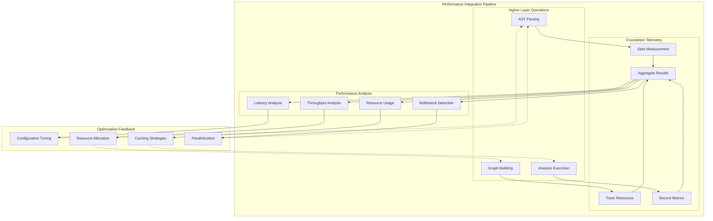

### Performance Contract Specifications

```elixir
# Performance contracts for Foundation APIs
defmodule ElixirScope.Foundation.PerformanceContracts do
  @moduledoc """
  Performance contracts that Foundation APIs must satisfy.
  """
  
  # Configuration performance contracts
  @spec config_get_latency() :: {:ok, :sub_millisecond}
  def config_get_latency, do: {:ok, :sub_millisecond}
  
  @spec config_update_latency() :: {:ok, :single_digit_milliseconds}
  def config_update_latency, do: {:ok, :single_digit_milliseconds}
  
  # Event system performance contracts
  @spec event_emit_latency() :: {:ok, :sub_millisecond}
  def event_emit_latency, do: {:ok, :sub_millisecond}
  
  @spec event_throughput() :: {:ok, :thousands_per_second}
  def event_throughput, do: {:ok, :thousands_per_second}
  
  # Telemetry performance contracts
  @spec telemetry_overhead() :: {:ok, :negligible}
  def telemetry_overhead, do: {:ok, :negligible}
  
  @spec telemetry_accuracy() :: {:ok, :microsecond_precision}
  def telemetry_accuracy, do: {:ok, :microsecond_precision}
end
```

---

## Conclusion

The ElixirScope Foundation layer's integration patterns establish a robust, scalable, and maintainable foundation for cross-layer communication. Through careful application of dependency injection principles, well-defined interface contracts, comprehensive testing strategies, and performance monitoring, the Foundation layer enables reliable integration with higher-level system components while maintaining architectural integrity and operational excellence.

### Key Integration Benefits

1. **Stable Contracts**: Well-defined APIs that higher layers can depend on
2. **Loose Coupling**: Higher layers are isolated from Foundation implementation details
3. **Testable Integration**: Comprehensive testing at all integration points
4. **Performance Transparency**: Observable performance characteristics across layers
5. **Graceful Evolution**: API versioning and migration strategies for system growth

The integration patterns documented here provide the blueprint for building a cohesive, reliable, and performant multi-layer system architecture.
