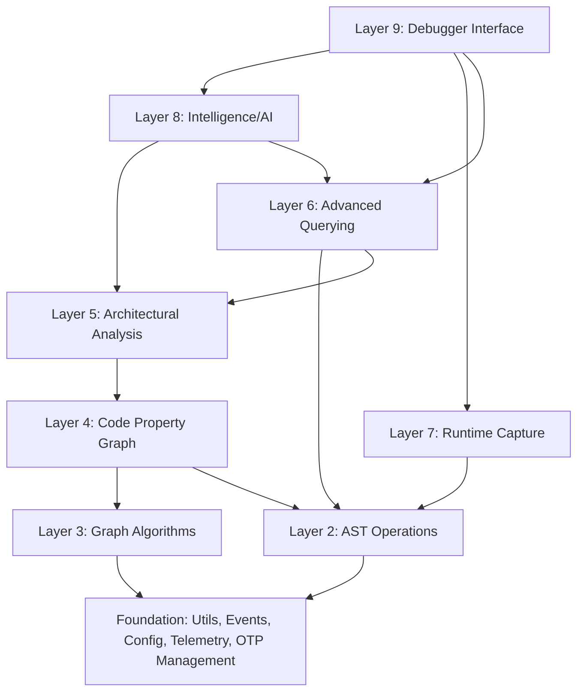

# DEV_.md - ElixirScope System Architecture & Technical Overview

> **Comprehensive System Documentation**  
> This document provides a complete technical overview of ElixirScope's architecture, capabilities, and implementation strategy as of June 2025.

## 🎯 System Vision & Mission

**ElixirScope** is a revolutionary AST-based debugging and code intelligence platform for Elixir applications that combines static analysis, runtime capture, and AI-powered insights to provide unprecedented visibility into code behavior and quality.

### Core Value Propositions

1. **Unified Analysis**: Single platform combining static analysis, runtime behavior, and AI insights
2. **Time-Travel Debugging**: Reconstruct and analyze past execution states
3. **AI-Powered Intelligence**: Leverage multiple AI providers for code insights and recommendations
4. **Graph-Based Analysis**: Advanced graph algorithms for deep code understanding
5. **Real-Time Correlation**: Connect static code structure with runtime behavior
6. **Enterprise-Grade**: Built for production Elixir/OTP applications at scale

## 🏗️ System Architecture Overview

### 9-Layer Architecture

ElixirScope is built on a carefully designed 9-layer architecture that provides separation of concerns while enabling efficient data flow and analysis:



### Layer Responsibilities

#### **Layer 1: Foundation**
- **Core Infrastructure**: OTP application management, configuration, events
- **Distributed Coordination**: Multi-node support and data synchronization
- **Telemetry & Monitoring**: Performance metrics and system health
- **Utilities**: Common functions, data structures, and type definitions

#### **Layer 2: AST Operations**
- **Parsing Engine**: Advanced Elixir AST parsing with error recovery
- **Repository System**: Efficient storage and retrieval of AST data
- **Memory Management**: Optimized memory usage for large codebases
- **Query Builder**: AST-specific querying capabilities
- **Pattern Matching**: Advanced pattern detection in AST structures

#### **Layer 3: Graph Algorithms**
- **Pure Mathematical Functions**: Centrality, pathfinding, connectivity
- **Community Detection**: Module and function relationship analysis
- **Temporal Analysis**: Time-based graph evolution tracking
- **Machine Learning on Graphs**: Graph neural networks for code analysis

#### **Layer 4: Code Property Graph (CPG)**
- **Multi-Graph Integration**: Combines AST, CFG, DFG, and Call Graphs
- **Semantic Analysis**: Deep code understanding and relationship mapping
- **Incremental Updates**: Efficient CPG updates for code changes
- **Cross-Reference Analysis**: Function calls, variable usage, data flow

#### **Layer 5: Architectural Analysis**
- **Pattern Detection**: Design patterns, anti-patterns, code smells
- **Quality Assessment**: Code quality metrics and recommendations
- **Security Analysis**: Vulnerability detection and security patterns
- **Performance Analysis**: Bottleneck identification and optimization suggestions

#### **Layer 6: Advanced Querying**
- **Multi-Dimensional Queries**: Query across AST, CPG, and runtime data
- **Query Optimization**: Intelligent query planning and execution
- **Domain-Specific Languages**: Specialized query languages for different use cases
- **Caching System**: Intelligent result caching for performance

#### **Layer 7: Runtime Capture**
- **Instrumentation**: Non-intrusive runtime data collection
- **Event Correlation**: Real-time correlation of events with static code
- **Temporal Storage**: Efficient storage of time-series execution data
- **Performance Monitoring**: Runtime performance metrics and analysis

#### **Layer 8: Intelligence/AI**
- **Multi-Provider AI**: Support for OpenAI, Anthropic, Google, and others
- **Feature Extraction**: Automated feature extraction from code and runtime data
- **Predictive Models**: Bug prediction, performance prediction, complexity assessment
- **Insight Generation**: AI-powered code insights and recommendations

#### **Layer 9: Debugger Interface**
- **Time-Travel Debugging**: Navigate through past execution states
- **AI-Assisted Debugging**: AI-powered debugging suggestions and explanations
- **Visualization**: Rich visualization of code structure and execution
- **Session Management**: Advanced debugging session management

## 🔄 Data Flow & Processing Pipeline

### Primary Analysis Workflow

```elixir
# Static Analysis Pipeline
Source Code 
  → AST.Parser 
  → AST.Repository 
  → CPG.Builder 
  → Analysis.Patterns 
  → Intelligence.AI 
  → Debugger.Interface

# Runtime Correlation Pipeline
Runtime Events 
  → Capture.Instrumentation 
  → Capture.Correlation 
  → Analysis.Performance 
  → Intelligence.Insights 
  → Debugger.TimeTravel

# Query Processing Pipeline
User Query 
  → Query.Builder 
  → Query.Optimizer 
  → Query.Executor 
  → Results.Formatter 
  → Interface.Display
```

### Cross-Layer Integration Points

- **AST ↔ CPG**: Bidirectional mapping between AST nodes and CPG elements
- **CPG ↔ Analysis**: Analysis results feed back into CPG for enhanced queries
- **Analysis ↔ Intelligence**: AI enhances analysis results with insights
- **Capture ↔ Debugger**: Runtime data enables time-travel debugging
- **Query Layer**: Provides unified access to all data layers

## 🧠 Core Capabilities & Features

### Static Analysis Capabilities

1. **AST-Level Analysis**
   - Complete Elixir syntax support including macros
   - Pattern matching analysis
   - Function dependency tracking
   - Module relationship mapping

2. **Code Property Graph Construction**
   - Control Flow Graph (CFG) generation
   - Data Flow Graph (DFG) analysis
   - Call graph construction
   - Inter-procedural analysis

3. **Pattern Detection**
   - Design pattern recognition
   - Anti-pattern identification
   - Code smell detection
   - Security vulnerability scanning

4. **Quality Assessment**
   - Complexity metrics (cyclomatic, cognitive)
   - Maintainability scoring
   - Technical debt assessment
   - Architectural quality evaluation

### Runtime Analysis Capabilities

1. **Performance Monitoring**
   - Function execution timing
   - Memory usage tracking
   - Process communication analysis
   - Bottleneck identification

2. **Behavioral Analysis**
   - Execution path tracking
   - State change monitoring
   - Error propagation analysis
   - Resource utilization patterns

3. **Correlation Engine**
   - Static-to-runtime mapping
   - Historical trend analysis
   - Anomaly detection
   - Performance regression tracking

### AI-Powered Intelligence

1. **Code Understanding**
   - Natural language code explanations
   - Intent recognition and documentation
   - Refactoring suggestions
   - Best practice recommendations

2. **Predictive Analytics**
   - Bug likelihood prediction
   - Performance bottleneck prediction
   - Code complexity prediction
   - Maintenance effort estimation

3. **Debugging Assistance**
   - Error root cause analysis
   - Fix suggestions and explanations
   - Test case generation
   - Code review automation

### Advanced Querying

1. **Multi-Dimensional Queries**
   - Cross-layer data correlation
   - Temporal query support
   - Pattern-based searching
   - Semantic code search

2. **Domain-Specific Languages**
   - CPG query language
   - Runtime event queries
   - Performance analysis queries
   - Security audit queries

## 🔧 Technical Implementation Strategy

### Architecture Principles

1. **Layer Isolation**: Each layer has clearly defined responsibilities and interfaces
2. **Dependency Direction**: Layers only depend on lower layers, never higher ones
3. **Data Immutability**: All analysis results are immutable for consistency
4. **Event-Driven**: Asynchronous processing with event-driven updates
5. **Fault Tolerance**: OTP supervision trees ensure system resilience

### Performance Optimization

1. **Memory Management**
   - Intelligent caching with LRU eviction
   - Incremental analysis for large codebases
   - Memory-mapped file storage for large datasets
   - Garbage collection optimization

2. **Query Optimization**
   - Query planning and cost estimation
   - Index-based lookups for common patterns
   - Result caching with intelligent invalidation
   - Parallel query execution

3. **AI Integration Optimization**
   - Response caching to minimize API calls
   - Batch processing for multiple requests
   - Fallback strategies for provider failures
   - Rate limiting and backoff mechanisms

### Scalability Design

1. **Horizontal Scaling**
   - Distributed processing capabilities
   - Multi-node coordination
   - Work distribution algorithms
   - Load balancing strategies

2. **Vertical Scaling**
   - Memory-efficient data structures
   - CPU-optimized algorithms
   - I/O optimization for large projects
   - Resource pooling and management

## 🧪 Testing & Quality Assurance

### Comprehensive Testing Strategy

1. **Unit Testing**: Each layer tested in isolation with mocked dependencies
2. **Integration Testing**: Cross-layer functionality and data flow validation
3. **End-to-End Testing**: Complete workflow testing with real-world scenarios
4. **Performance Testing**: Benchmarking and scalability validation
5. **Property Testing**: Mathematical properties and invariant validation
6. **Contract Testing**: API contract compliance and backward compatibility

### Quality Metrics

- **Code Coverage**: Target 90%+ for critical paths
- **Performance Benchmarks**: Sub-second analysis for medium projects
- **Memory Usage**: Efficient memory usage for large codebases
- **API Stability**: Semantic versioning and deprecation policies
- **Documentation Coverage**: Complete API and usage documentation

## 🚀 Deployment & Operations

### Production Deployment

1. **OTP Application**: Standard Elixir/OTP application structure
2. **Configuration Management**: Environment-specific configuration
3. **Monitoring Integration**: Telemetry and observability
4. **Health Checks**: System health monitoring and alerting
5. **Graceful Degradation**: Fallback modes for component failures

### Integration Patterns

1. **Phoenix Integration**: Seamless integration with Phoenix applications
2. **CI/CD Integration**: Automated code analysis in build pipelines
3. **IDE Integration**: Language server protocol support
4. **External Tools**: Integration with external analysis tools

## 🔮 Future Roadmap & Evolution

### Short-Term Goals (Q3-Q4 2025)

1. **Enhanced AI Integration**: More AI providers and improved prompting
2. **Real-Time Analysis**: Live code analysis during development
3. **Advanced Visualization**: Interactive code and execution visualization
4. **Performance Optimization**: Sub-100ms query response times

### Medium-Term Goals (2026)

1. **Multi-Language Support**: Extend beyond Elixir to other BEAM languages
2. **Cloud-Native**: Kubernetes-native deployment and scaling
3. **Advanced ML Models**: Custom ML models for code analysis
4. **Collaborative Features**: Team-based code analysis and sharing

### Long-Term Vision (2027+)

1. **Autonomous Code Analysis**: Self-improving analysis capabilities
2. **Predictive Development**: Proactive issue identification and prevention
3. **Natural Language Interface**: Natural language queries and interactions
4. **Cross-Project Analysis**: Organization-wide code intelligence

## 📊 Key Metrics & Success Criteria

### Technical Metrics
- **Analysis Speed**: < 1 second for projects up to 100k LOC
- **Memory Efficiency**: < 1GB RAM for projects up to 1M LOC
- **Query Performance**: < 100ms for 95% of queries
- **Accuracy**: > 95% accuracy for pattern detection

### Business Metrics
- **Developer Productivity**: 20%+ improvement in debugging time
- **Code Quality**: 30%+ reduction in production bugs
- **Technical Debt**: 25%+ reduction in technical debt accumulation
- **Team Collaboration**: Improved code review efficiency

---

**ElixirScope represents the next generation of code intelligence platforms, combining the power of static analysis, runtime insights, and AI to provide developers with unprecedented visibility into their Elixir applications.**

**Last Updated**: June 2025  
**Version**: 2.0  
**Status**: Active Development
