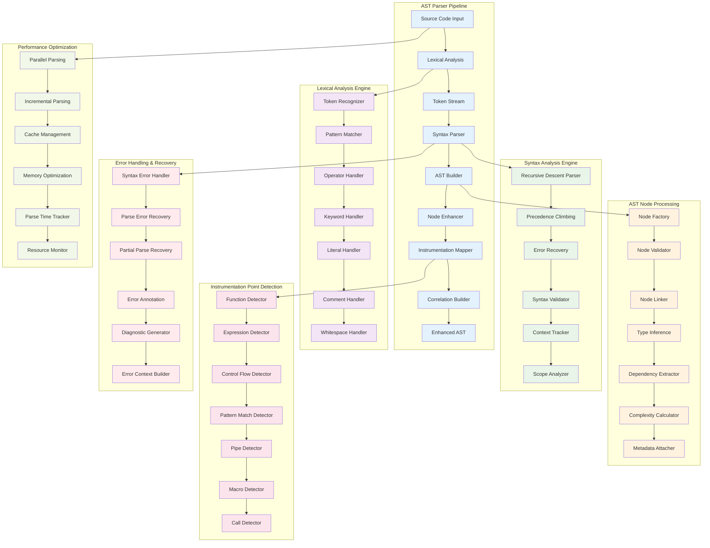
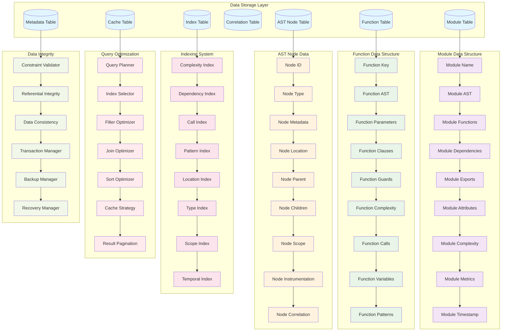
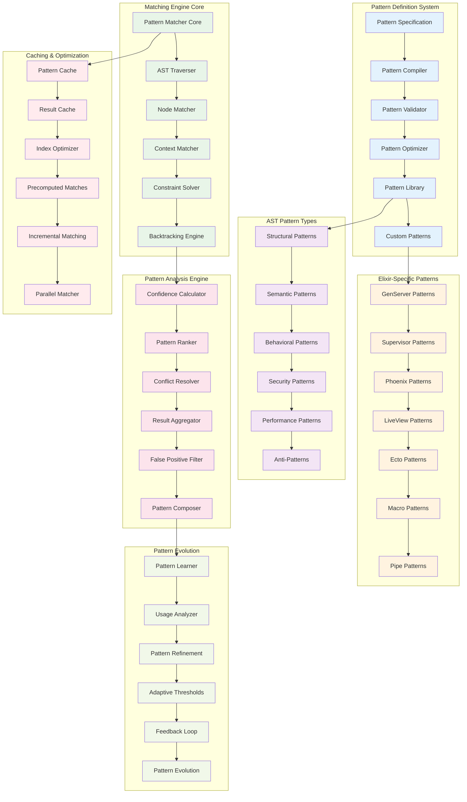

# Extended AST Layer Architecture Diagrams

## 11. AST Parser Deep Architecture



## 12. Enhanced Repository Data Architecture



## 13. AST Transformation and Compilation Pipeline


## 14. AST Memory Management Detailed Architecture

```mermaid
graph TB
    subgraph "Memory Pool Management"
        ASTPool[AST Memory Pool]
        NodePool[Node Memory Pool]
        MetadataPool[Metadata Memory Pool]
        StringPool[String Pool]
        ReferencePool[Reference Pool]
        TempPool[Temporary Pool]
    end

    subgraph "Garbage Collection Strategy"
        GCScheduler[GC Scheduler]
        ReferenceCounter[Reference Counter]
        MarkAndSweep[Mark and Sweep]
        GenerationalGC[Generational GC]
        CompactionEngine[Compaction Engine]
        WeakReferences[Weak References]
    end

    subgraph "Memory Monitoring"
        MemoryProfiler[Memory Profiler]
        AllocationTracker[Allocation Tracker]
        UsageAnalyzer[Usage Analyzer]
        LeakDetector[Leak Detector]
        PressureMonitor[Pressure Monitor]
        ThresholdManager[Threshold Manager]
    end

    subgraph "Optimization Strategies"
        LazyAllocation[Lazy Allocation]
        PoolingStrategy[Pooling Strategy]
        CoWStrategy[Copy-on-Write Strategy]
        CompressionEngine[Compression Engine]
        DeduplicationEngine[Deduplication Engine]
        CacheAlignment[Cache Alignment]
    end

    subgraph "Memory Pressure Response"
        Level1Response[Level 1: Cache Trim]
        Level2Response[Level 2: Pool Compaction]
        Level3Response[Level 3: Data Compression]
        Level4Response[Level 4: Emergency GC]
        Level5Response[Level 5: Data Eviction]
        CriticalResponse[Critical: System Halt]
    end

    subgraph "Data Lifecycle Management"
        AllocationManager[Allocation Manager]
        LifecycleTracker[Lifecycle Tracker]
        AccessPatternAnalyzer[Access Pattern Analyzer]
        EvictionPolicy[Eviction Policy]
        RetentionPolicy[Retention Policy]
        ArchivalManager[Archival Manager]
    end

    subgraph "Performance Metrics"
        AllocationMetrics[Allocation Metrics]
        FragmentationMetrics[Fragmentation Metrics]
        GCMetrics[GC Metrics]
        ThroughputMetrics[Throughput Metrics]
        LatencyMetrics[Latency Metrics]
        EfficiencyMetrics[Efficiency Metrics]
    end

    %% Memory pool connections
    ASTPool --> NodePool
    NodePool --> MetadataPool
    MetadataPool --> StringPool
    StringPool --> ReferencePool
    ReferencePool --> TempPool

    %% GC strategy connections
    GCScheduler --> ReferenceCounter
    ReferenceCounter --> MarkAndSweep
    MarkAndSweep --> GenerationalGC
    GenerationalGC --> CompactionEngine
    CompactionEngine --> WeakReferences

    %% Monitoring connections
    MemoryProfiler --> AllocationTracker
    AllocationTracker --> UsageAnalyzer
    UsageAnalyzer --> LeakDetector
    LeakDetector --> PressureMonitor
    PressureMonitor --> ThresholdManager

    %% Optimization connections
    LazyAllocation --> PoolingStrategy
    PoolingStrategy --> CoWStrategy
    CoWStrategy --> CompressionEngine
    CompressionEngine --> DeduplicationEngine
    DeduplicationEngine --> CacheAlignment

    %% Pressure response connections
    ThresholdManager --> Level1Response
    Level1Response --> Level2Response
    Level2Response --> Level3Response
    Level3Response --> Level4Response
    Level4Response --> Level5Response
    Level5Response --> CriticalResponse

    %% Lifecycle management connections
    AllocationManager --> LifecycleTracker
    LifecycleTracker --> AccessPatternAnalyzer
    AccessPatternAnalyzer --> EvictionPolicy
    EvictionPolicy --> RetentionPolicy
    RetentionPolicy --> ArchivalManager

    %% Metrics connections
    AllocationMetrics --> FragmentationMetrics
    FragmentationMetrics --> GCMetrics
    GCMetrics --> ThroughputMetrics
    ThroughputMetrics --> LatencyMetrics
    LatencyMetrics --> EfficiencyMetrics

    classDef pools fill:#e1f5fe
    classDef gc fill:#f3e5f5
    classDef monitoring fill:#e8f5e8
    classDef optimization fill:#fff3e0
    classDef pressure fill:#fce4ec
    classDef lifecycle fill:#ffebee
    classDef metrics fill:#f1f8e9

    class ASTPool,NodePool,MetadataPool,StringPool,ReferencePool,TempPool pools
    class GCScheduler,ReferenceCounter,MarkAndSweep,GenerationalGC,CompactionEngine,WeakReferences gc
    class MemoryProfiler,AllocationTracker,UsageAnalyzer,LeakDetector,PressureMonitor,ThresholdManager monitoring
    class LazyAllocation,PoolingStrategy,CoWStrategy,CompressionEngine,DeduplicationEngine,CacheAlignment optimization
    class Level1Response,Level2Response,Level3Response,Level4Response,Level5Response,CriticalResponse pressure
    class AllocationManager,LifecycleTracker,AccessPatternAnalyzer,EvictionPolicy,RetentionPolicy,ArchivalManager lifecycle
    class AllocationMetrics,FragmentationMetrics,GCMetrics,ThroughputMetrics,LatencyMetrics,EfficiencyMetrics metrics
```



## 15. AST Pattern Matching Deep Architecture



## 16. AST Query Builder Advanced Architecture

```mermaid
graph LR
    subgraph "Query Input Layer"
        NaturalLanguage[Natural Language Query]
        SQLLike[SQL-like Query]
        DSLQuery[DSL Query]
        GraphicalQuery[Graphical Query Builder]
        APIQuery[API Query]
        SavedQueries[Saved Queries]
    end

    subgraph "Query Parsing & Analysis"
        QueryParser[Query Parser]
        SyntaxAnalyzer[Syntax Analyzer]
        SemanticAnalyzer[Semantic Analyzer]
        IntentDetector[Intent Detector]
        ParameterExtractor[Parameter Extractor]
        QueryValidator[Query Validator]
    end

    subgraph "Query Optimization Engine"
        CostEstimator[Cost Estimator]
        ExecutionPlanner[Execution Planner]
        IndexSelector[Index Selector]
        JoinOptimizer[Join Optimizer]
        FilterPushdown[Filter Pushdown]
        PredicateOptimizer[Predicate Optimizer]
    end

    subgraph "AST-Specific Query Types"
        StructuralQueries[Structural Queries]
        ComplexityQueries[Complexity Queries]
        DependencyQueries[Dependency Queries]
        PatternQueries[Pattern Queries]
        MetricQueries[Metric Queries]
        TemporalQueries[Temporal Queries]
    end

    subgraph "Execution Engine"
        QueryExecutor[Query Executor]
        ParallelExecutor[Parallel Executor]
        StreamingExecutor[Streaming Executor]
        CachedExecutor[Cached Executor]
        IncrementalExecutor[Incremental Executor]
        DistributedExecutor[Distributed Executor]
    end

    subgraph "Result Processing"
        ResultFormatter[Result Formatter]
        DataTransformer[Data Transformer]
        Aggregator[Aggregator]
        Sorter[Sorter]
        Paginator[Paginator]
        Visualizer[Visualizer]
    end

    subgraph "Query Intelligence"
        QuerySuggester[Query Suggester]
        AutoCompletion[Auto Completion]
        QueryOptimizer[Query