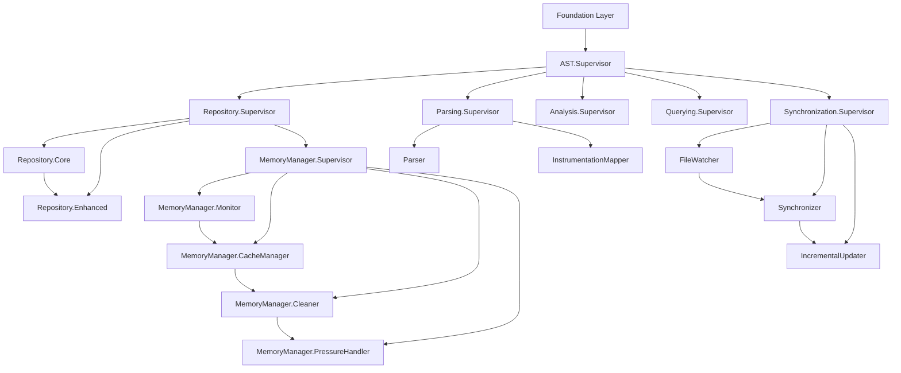

# SUPERVISION_TREE.md - AST Layer OTP Process Architecture

**Version:** 1.0  
**Date:** December 2024  
**Layer:** AST Layer (Layer 2)  
**Status:** Implementation Ready

## Table of Contents

1. [Supervision Tree Overview](#1-supervision-tree-overview)
2. [Root Supervisor](#2-root-supervisor)
3. [Core Service Supervisors](#3-core-service-supervisors)
4. [Worker Process Specifications](#4-worker-process-specifications)
5. [Restart Strategies](#5-restart-strategies)
6. [Process Dependencies](#6-process-dependencies)
7. [Lifecycle Management](#7-lifecycle-management)
8. [Error Recovery Patterns](#8-error-recovery-patterns)

---

## 1. Supervision Tree Overview

### Complete AST Layer Process Hierarchy

```
ElixirScope.AST.Supervisor (one_for_one)
├── ElixirScope.AST.Repository.Supervisor (one_for_one)
│   ├── ElixirScope.AST.Repository.Core (permanent)
│   ├── ElixirScope.AST.Repository.Enhanced (permanent)
│   └── ElixirScope.AST.Repository.MemoryManager.Supervisor (rest_for_one)
│       ├── ElixirScope.AST.Repository.MemoryManager.Monitor (permanent)
│       ├── ElixirScope.AST.Repository.MemoryManager.CacheManager (permanent)
│       ├── ElixirScope.AST.Repository.MemoryManager.Cleaner (temporary)
│       └── ElixirScope.AST.Repository.MemoryManager.PressureHandler (permanent)
├── ElixirScope.AST.Parsing.Supervisor (one_for_one)
│   ├── ElixirScope.AST.Parsing.Parser (permanent)
│   ├── ElixirScope.AST.Parsing.InstrumentationMapper (permanent)
│   └── ElixirScope.AST.Parsing.BatchProcessor (transient)
├── ElixirScope.AST.Analysis.Supervisor (one_for_one)
│   ├── ElixirScope.AST.Analysis.PatternMatcher.Supervisor (one_for_one)
│   │   ├── ElixirScope.AST.Analysis.PatternMatcher.Core (permanent)
│   │   ├── ElixirScope.AST.Analysis.PatternMatcher.PatternLibrary (permanent)
│   │   ├── ElixirScope.AST.Analysis.PatternMatcher.Cache (permanent)
│   │   └── ElixirScope.AST.Analysis.PatternMatcher.WorkerPool (simple_one_for_one)
│   │       └── PatternMatcher.Worker (temporary)
│   └── ElixirScope.AST.Analysis.PerformanceOptimizer.Supervisor (one_for_one)
│       ├── ElixirScope.AST.Analysis.PerformanceOptimizer.BatchProcessor (permanent)
│       ├── ElixirScope.AST.Analysis.PerformanceOptimizer.LazyLoader (permanent)
│       ├── ElixirScope.AST.Analysis.PerformanceOptimizer.OptimizationScheduler (permanent)
│       └── ElixirScope.AST.Analysis.PerformanceOptimizer.StatisticsCollector (permanent)
├── ElixirScope.AST.Querying.Supervisor (one_for_one)
│   ├── ElixirScope.AST.Querying.Executor (permanent)
│   ├── ElixirScope.AST.Querying.Cache (permanent)
│   └── ElixirScope.AST.Querying.WorkerPool (simple_one_for_one)
│       └── Query.Worker (temporary)
├── ElixirScope.AST.Synchronization.Supervisor (rest_for_one)
│   ├── ElixirScope.AST.Synchronization.FileWatcher (permanent)
│   ├── ElixirScope.AST.Synchronization.Synchronizer (permanent)
│   └── ElixirScope.AST.Synchronization.IncrementalUpdater (permanent)
└── ElixirScope.AST.TaskSupervisor (simple_one_for_one)
    └── Task (temporary)
```

### Process Categorization

**Core Services (Permanent)**:
- Repository.Core, Repository.Enhanced
- Parser, InstrumentationMapper
- PatternMatcher.Core, PatternLibrary
- FileWatcher, Synchronizer

**Performance Services (Permanent)**:
- MemoryManager components
- PerformanceOptimizer components
- Query system components

**Worker Pools (Simple One For One)**:
- PatternMatcher workers
- Query execution workers
- General task workers

**Cleanup Services (Temporary/Transient)**:
- MemoryManager.Cleaner
- BatchProcessor workers
- Individual task workers

---

## 2. Root Supervisor

### ElixirScope.AST.Supervisor

```elixir
defmodule ElixirScope.AST.Supervisor do
  @moduledoc """
  Root supervisor for the entire AST Layer.
  
  Uses :one_for_one strategy to isolate failures between major subsystems.
  Each child supervisor manages a cohesive set of related services.
  """
  
  use Supervisor
  
  def start_link(opts) do
    Supervisor.start_link(__MODULE__, opts, name: __MODULE__)
  end
  
  @impl true
  def init(_opts) do
    children = [
      # Repository subsystem - Core data storage and management
      {ElixirScope.AST.Repository.Supervisor, []},
      
      # Parsing subsystem - AST parsing and enhancement
      {ElixirScope.AST.Parsing.Supervisor, []},
      
      # Analysis subsystem - Pattern matching and optimization
      {ElixirScope.AST.Analysis.Supervisor, []},
      
      # Query subsystem - Query execution and caching
      {ElixirScope.AST.Querying.Supervisor, []},
      
      # Synchronization subsystem - File watching and updates
      {ElixirScope.AST.Synchronization.Supervisor, []},
      
      # Task supervisor for ad-hoc tasks
      {Task.Supervisor, name: ElixirScope.AST.TaskSupervisor}
    ]
    
    Supervisor.init(children, strategy: :one_for_one)
  end
end
```

**Restart Strategy**: `:one_for_one`
- **Rationale**: Subsystems are independent; failure in parsing shouldn't affect querying
- **Impact**: Individual subsystem failures don't cascade
- **Recovery**: Failed subsystem restarts independently

---

## 3. Core Service Supervisors

### 3.1 Repository Supervisor

```elixir
defmodule ElixirScope.AST.Repository.Supervisor do
  @moduledoc """
  Supervises core repository services and memory management.
  
  Uses :one_for_one strategy since repository and memory management
  are independent concerns.
  """
  
  use Supervisor
  
  def start_link(opts) do
    Supervisor.start_link(__MODULE__, opts, name: __MODULE__)
  end
  
  @impl true
  def init(_opts) do
    children = [
      # Core repository must start first
      {ElixirScope.AST.Repository.Core, [name: ElixirScope.AST.Repository.Core]},
      
      # Enhanced repository depends on core
      {ElixirScope.AST.Repository.Enhanced, [name: ElixirScope.AST.Repository.Enhanced]},
      
      # Memory management subsystem
      {ElixirScope.AST.Repository.MemoryManager.Supervisor, []}
    ]
    
    Supervisor.init(children, strategy: :one_for_one)
  end
end
```

### 3.2 Memory Manager Supervisor

```elixir
defmodule ElixirScope.AST.Repository.MemoryManager.Supervisor do
  @moduledoc """
  Supervises memory management components.
  
  Uses :rest_for_one strategy because components have dependencies:
  Monitor -> CacheManager -> Cleaner -> PressureHandler
  """
  
  use Supervisor
  
  def start_link(opts) do
    Supervisor.start_link(__MODULE__, opts, name: __MODULE__)
  end
  
  @impl true
  def init(_opts) do
    children = [
      # Monitor must start first - provides memory statistics
      {ElixirScope.AST.Repository.MemoryManager.Monitor, []},
      
      # CacheManager depends on Monitor for statistics
      {ElixirScope.AST.Repository.MemoryManager.CacheManager, []},
      
      # Cleaner is temporary - started on demand
      {ElixirScope.AST.Repository.MemoryManager.Cleaner, []},
      
      # PressureHandler coordinates all components
      {ElixirScope.AST.Repository.MemoryManager.PressureHandler, []}
    ]
    
    Supervisor.init(children, strategy: :rest_for_one)
  end
end
```

### 3.3 Pattern Matcher Supervisor

```elixir
defmodule ElixirScope.AST.Analysis.PatternMatcher.Supervisor do
  @moduledoc """
  Supervises pattern matching engine and worker pool.
  
  Uses :one_for_one for core services and :simple_one_for_one for workers.
  """
  
  use Supervisor
  
  def start_link(opts) do
    Supervisor.start_link(__MODULE__, opts, name: __MODULE__)
  end
  
  @impl true
  def init(_opts) do
    children = [
      # Core pattern matching engine
      {ElixirScope.AST.Analysis.PatternMatcher.Core, []},
      
      # Pattern library storage
      {ElixirScope.AST.Analysis.PatternMatcher.PatternLibrary, []},
      
      # Pattern result cache
      {ElixirScope.AST.Analysis.PatternMatcher.Cache, []},
      
      # Worker pool for concurrent pattern analysis
      {DynamicSupervisor, 
       name: ElixirScope.AST.Analysis.PatternMatcher.WorkerPool,
       strategy: :one_for_one}
    ]
    
    Supervisor.init(children, strategy: :one_for_one)
  end
end
```

### 3.4 Synchronization Supervisor

```elixir
defmodule ElixirScope.AST.Synchronization.Supervisor do
  @moduledoc """
  Supervises file watching and synchronization services.
  
  Uses :rest_for_one strategy because synchronization components
  have strict dependencies: FileWatcher -> Synchronizer -> IncrementalUpdater
  """
  
  use Supervisor
  
  def start_link(opts) do
    Supervisor.start_link(__MODULE__, opts, name: __MODULE__)
  end
  
  @impl true
  def init(_opts) do
    children = [
      # FileWatcher must start first - provides file system events
      {ElixirScope.AST.Synchronization.FileWatcher, []},
      
      # Synchronizer depends on FileWatcher for events
      {ElixirScope.AST.Synchronization.Synchronizer, []},
      
      # IncrementalUpdater depends on Synchronizer for coordination
      {ElixirScope.AST.Synchronization.IncrementalUpdater, []}
    ]
    
    Supervisor.init(children, strategy: :rest_for_one)
  end
end
```

---

## 4. Worker Process Specifications

### 4.1 Core Repository Worker

```elixir
defmodule ElixirScope.AST.Repository.Core do
  @moduledoc """
  Core repository GenServer managing ETS tables and data operations.
  
  Child Spec Configuration:
  - restart: :permanent (critical service)
  - shutdown: 5000ms (graceful ETS cleanup)
  - type: :worker
  """
  
  use GenServer
  
  def child_spec(opts) do
    %{
      id: __MODULE__,
      start: {__MODULE__, :start_link, [opts]},
      restart: :permanent,
      shutdown: 5000,
      type: :worker,
      modules: [__MODULE__]
    }
  end
  
  def start_link(opts) do
    GenServer.start_link(__MODULE__, opts, name: __MODULE__)
  end
  
  @impl true
  def init(_opts) do
    # Initialize ETS tables
    :ets.new(:ast_modules, [:set, :public, :named_table, {:read_concurrency, true}])
    :ets.new(:ast_functions, [:set, :public, :named_table, {:read_concurrency, true}])
    :ets.new(:ast_nodes, [:set, :public, :named_table, {:read_concurrency, true}])
    :ets.new(:correlation_index, [:bag, :public, :named_table, {:read_concurrency, true}])
    
    {:ok, %{}}
  end
  
  @impl true
  def terminate(_reason, _state) do
    # Cleanup ETS tables gracefully
    tables = [:ast_modules, :ast_functions, :ast_nodes, :correlation_index]
    Enum.each(tables, fn table ->
      if :ets.whereis(table) != :undefined do
        :ets.delete(table)
      end
    end)
    :ok
  end
end
```

### 4.2 Pattern Matcher Worker

```elixir
defmodule ElixirScope.AST.Analysis.PatternMatcher.Worker do
  @moduledoc """
  Temporary worker for pattern analysis tasks.
  
  Child Spec Configuration:
  - restart: :temporary (task-based, don't restart)
  - shutdown: 1000ms (quick cleanup)
  - type: :worker
  """
  
  use GenServer
  
  def child_spec(opts) do
    %{
      id: __MODULE__,
      start: {__MODULE__, :start_link, [opts]},
      restart: :temporary,
      shutdown: 1000,
      type: :worker,
      modules: [__MODULE__]
    }
  end
  
  def start_link(opts) do
    GenServer.start_link(__MODULE__, opts)
  end
  
  @impl true
  def init(pattern_analysis_task) do
    # Start pattern analysis immediately
    send(self(), :analyze_patterns)
    {:ok, pattern_analysis_task}
  end
  
  @impl true
  def handle_info(:analyze_patterns, task) do
    # Perform analysis and stop
    result = perform_pattern_analysis(task)
    send(task.reply_to, {:pattern_analysis_complete, result})
    {:stop, :normal, task}
  end
end
```

### 4.3 File Watcher Worker

```elixir
defmodule ElixirScope.AST.Synchronization.FileWatcher do
  @moduledoc """
  File system monitoring GenServer.
  
  Child Spec Configuration:
  - restart: :permanent (critical for real-time updates)
  - shutdown: 2000ms (cleanup file system watchers)
  - type: :worker
  """
  
  use GenServer
  
  def child_spec(opts) do
    %{
      id: __MODULE__,
      start: {__MODULE__, :start_link, [opts]},
      restart: :permanent,
      shutdown: 2000,
      type: :worker,
      modules: [__MODULE__]
    }
  end
  
  def start_link(opts) do
    GenServer.start_link(__MODULE__, opts, name: __MODULE__)
  end
  
  @impl true
  def init(_opts) do
    # Initialize file system watcher
    {:ok, watcher_pid} = FileSystem.start_link(dirs: ["."])
    FileSystem.subscribe(watcher_pid)
    
    {:ok, %{watcher_pid: watcher_pid, debounce_timer: nil}}
  end
  
  @impl true
  def terminate(_reason, %{watcher_pid: watcher_pid}) do
    if Process.alive?(watcher_pid) do
      FileSystem.stop(watcher_pid)
    end
    :ok
  end
end
```

---

## 5. Restart Strategies

### 5.1 Strategy Selection Rationale

| Supervisor | Strategy | Rationale |
|------------|----------|-----------|
| AST.Supervisor | `:one_for_one` | Subsystems are independent |
| Repository.Supervisor | `:one_for_one` | Core and Enhanced repos are independent |
| MemoryManager.Supervisor | `:rest_for_one` | Components have dependencies |
| PatternMatcher.Supervisor | `:one_for_one` | Core services independent, workers isolated |
| Synchronization.Supervisor | `:rest_for_one` | Strict dependency chain |
| WorkerPools | `:simple_one_for_one` | Dynamic worker creation |

### 5.2 Restart Intensity Configuration

```elixir
# High-level supervisors: conservative restart limits
@root_restart_intensity %{
  max_restarts: 3,
  max_seconds: 10
}

# Worker pool supervisors: higher tolerance
@worker_pool_intensity %{
  max_restarts: 10,
  max_seconds: 5
}

# Critical service supervisors: moderate tolerance
@service_restart_intensity %{
  max_restarts: 5,
  max_seconds: 10
}
```

### 5.3 Restart Type Configuration

```elixir
@restart_types %{
  # Critical services - always restart
  repository_core: :permanent,
  repository_enhanced: :permanent,
  pattern_matcher_core: :permanent,
  file_watcher: :permanent,
  
  # Utility services - restart on abnormal exit
  batch_processor: :transient,
  incremental_updater: :transient,
  
  # Workers - don't restart, create new ones
  pattern_worker: :temporary,
  query_worker: :temporary,
  task_worker: :temporary
}
```

---

## 6. Process Dependencies

### 6.1 Startup Dependency Graph



### 6.2 Runtime Dependencies

```elixir
defmodule ElixirScope.AST.Dependencies do
  @moduledoc "Process dependency management and health checking"
  
  @dependencies %{
    repository_enhanced: [:repository_core],
    memory_cache_manager: [:memory_monitor],
    memory_cleaner: [:memory_cache_manager],
    memory_pressure_handler: [:memory_cleaner],
    synchronizer: [:file_watcher, :repository_core],
    incremental_updater: [:synchronizer, :repository_enhanced],
    pattern_matcher_core: [:repository_core, :pattern_library],
    query_executor: [:repository_core]
  }
  
  def check_dependencies(service) do
    required = Map.get(@dependencies, service, [])
    
    Enum.all?(required, fn dep ->
      process_name = service_to_process_name(dep)
      Process.whereis(process_name) != nil
    end)
  end
  
  def wait_for_dependencies(service, timeout \\ 5000) do
    required = Map.get(@dependencies, service, [])
    
    Enum.all?(required, fn dep ->
      wait_for_service(dep, timeout)
    end)
  end
  
  defp wait_for_service(service, timeout) do
    process_name = service_to_process_name(service)
    
    case GenServer.whereis(process_name) do
      nil ->
        Process.sleep(100)
        wait_for_service(service, timeout - 100)
      _pid ->
        true
    end
  end
end
```

---

## 7. Lifecycle Management

### 7.1 Graceful Startup Sequence

```elixir
defmodule ElixirScope.AST.LifecycleManager do
  @moduledoc "Manages AST Layer startup and shutdown"
  
  def start_ast_layer(opts \\ []) do
    with {:ok, _} <- start_repository_subsystem(opts),
         {:ok, _} <- start_parsing_subsystem(opts),
         {:ok, _} <- start_analysis_subsystem(opts),
         {:ok, _} <- start_query_subsystem(opts),
         {:ok, _} <- start_synchronization_subsystem(opts) do
      {:ok, :ast_layer_started}
    else
      {:error, reason} -> {:error, {:startup_failed, reason}}
    end
  end
  
  defp start_repository_subsystem(opts) do
    # Wait for Foundation Layer
    case ElixirScope.Foundation.status() do
      {:ok, :running} ->
        ElixirScope.AST.Repository.Supervisor.start_link(opts)
      {:error, reason} ->
        {:error, {:foundation_not_ready, reason}}
    end
  end
  
  def health_check do
    services = [
      ElixirScope.AST.Repository.Core,
      ElixirScope.AST.Repository.Enhanced,
      ElixirScope.AST.Analysis.PatternMatcher.Core,
      ElixirScope.AST.Synchronization.FileWatcher
    ]
    
    results = Enum.map(services, fn service ->
      {service, Process.whereis(service) != nil}
    end)
    
    all_healthy = Enum.all?(results, fn {_, healthy} -> healthy end)
    
    %{
      status: if(all_healthy, do: :healthy, else: :degraded),
      services: results,
      timestamp: DateTime.utc_now()
    }
  end
end
```

### 7.2 Graceful Shutdown

```elixir
def shutdown_ast_layer(timeout \\ 30_000) do
  # Shutdown in reverse dependency order
  shutdown_steps = [
    {ElixirScope.AST.Synchronization.Supervisor, 5_000},
    {ElixirScope.AST.Querying.Supervisor, 3_000},
    {ElixirScope.AST.Analysis.Supervisor, 5_000},
    {ElixirScope.AST.Parsing.Supervisor, 3_000},
    {ElixirScope.AST.Repository.Supervisor, 10_000}
  ]
  
  Enum.each(shutdown_steps, fn {supervisor, step_timeout} ->
    case Process.whereis(supervisor) do
      nil -> :ok
      pid ->
        Process.exit(pid, :shutdown)
        wait_for_shutdown(pid, step_timeout)
    end
  end)
end

defp wait_for_shutdown(pid, timeout) do
  ref = Process.monitor(pid)
  
  receive do
    {:DOWN, ^ref, :process, ^pid, _reason} -> :ok
  after
    timeout -> 
      Process.exit(pid, :kill)
      :timeout
  end
end
```

---

## 8. Error Recovery Patterns

### 8.1 Repository Failure Recovery

```elixir
defmodule ElixirScope.AST.RecoveryPatterns do
  @moduledoc "Error recovery and resilience patterns"
  
  def handle_repository_failure(reason) do
    case reason do
      :ets_corruption ->
        # Recreate ETS tables and reload from backup
        recreate_ets_tables()
        reload_from_backup()
        
      :memory_exhaustion ->
        # Trigger emergency cleanup
        ElixirScope.AST.Repository.MemoryManager.PressureHandler.emergency_cleanup()
        
      :process_crash ->
        # Repository will be restarted by supervisor
        # Warm up critical data
        warm_up_critical_data()
    end
  end
  
  def handle_file_watcher_failure(reason) do
    case reason do
      :file_system_unavailable ->
        # Fall back to polling mode
        start_polling_mode()
        
      :permission_denied ->
        # Log error and disable file watching
        disable_file_watching()
        
      :too_many_events ->
        # Increase debounce interval
        increase_debounce_interval()
    end
  end
  
  def handle_pattern_matcher_failure(reason) do
    case reason do
      :worker_pool_exhausted ->
        # Scale up worker pool
        scale_up_pattern_workers()
        
      :pattern_library_corruption ->
        # Reload pattern library
        reload_pattern_library()
        
      :analysis_timeout ->
        # Increase analysis timeout
        increase_analysis_timeout()
    end
  end
end
```

### 8.2 Circuit Breaker Pattern

```elixir
defmodule ElixirScope.AST.CircuitBreaker do
  @moduledoc "Circuit breaker for protecting against cascading failures"
  
  use GenServer
  
  @failure_threshold 5
  @recovery_timeout 30_000
  
  defstruct [
    :name,
    :state,          # :closed, :open, :half_open
    :failure_count,
    :last_failure_time,
    :success_count
  ]
  
  def call(name, fun) when is_function(fun, 0) do
    case get_state(name) do
      :closed ->
        execute_with_monitoring(name, fun)
        
      :open ->
        {:error, :circuit_open}
        
      :half_open ->
        execute_recovery_attempt(name, fun)
    end
  end
  
  defp execute_with_monitoring(name, fun) do
    try do
      result = fun.()
      record_success(name)
      {:ok, result}
    rescue
      error ->
        record_failure(name, error)
        {:error, error}
    end
  end
end
```

### 8.3 Bulkhead Pattern

```elixir
defmodule ElixirScope.AST.Bulkhead do
  @moduledoc "Isolate failures using resource pools"
  
  def setup_resource_pools do
    # Separate pools for different operation types
    pools = [
      parsing_pool: [size: 4, max_overflow: 2],
      pattern_analysis_pool: [size: 8, max_overflow: 4],
      query_execution_pool: [size: 6, max_overflow: 3],
      file_watching_pool: [size: 2, max_overflow: 1]
    ]
    
    Enum.each(pools, fn {name, config} ->
      :poolboy.start_link(
        [name: {:local, name}] ++ config,
        []
      )
    end)
  end
  
  def execute_in_pool(pool_name, fun) do
    :poolboy.transaction(pool_name, fn worker ->
      fun.(worker)
    end)
  end
end
```

---

This supervision tree design provides robust fault tolerance, clear dependency management, and efficient resource utilization for the AST Layer while maintaining OTP best practices.