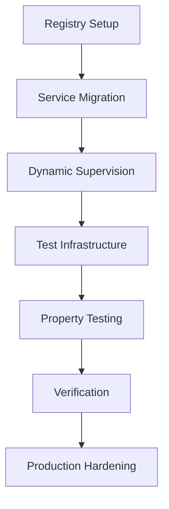

# Foundation Layer OTP Concurrency Fix - Systematic Prompting Plan

## Concurrency Issues Identified

### Critical Problems Found:
1. **Process Name Registration Issues**: Each service uses dynamic naming (`server_name()`) with test mode logic that creates inconsistent naming patterns
2. **Test Isolation Failures**: Services started in supervision tree conflict with tests trying to start their own instances
3. **State Contamination**: No proper test cleanup mechanisms - subscribers persist across tests
4. **Manual Process Management**: Tests likely call `GenServer.stop()` which conflicts with supervisor tree

### Current Architecture Problems:
```elixir
# PROBLEM: Dynamic naming creates race conditions
defp server_name do
  if Application.get_env(:elixir_scope, :test_mode, false) do
    # Race condition: multiple tests can get same PID-based name
    :"#{__MODULE__}_test_#{:erlang.pid_to_list(test_pid)}"
  else
    __MODULE__  # Global name - causes conflicts
  end
end
```

## Systematic Prompting Workflow

### Phase 1: Registry-Based Process Discovery (Week 1, Day 1-2)

**Prompt 1.1**: Registry Infrastructure Setup
```
Create a centralized process registry for ElixirScope Foundation layer that:
1. Uses Registry for dynamic namespace isolation
2. Supports namespaced service discovery: {namespace, service_name}
3. Provides production namespace and test isolation namespaces
4. Includes proper child_spec for supervision tree integration
5. Handles name conflicts gracefully with controlled rejections

The registry should support these namespaces:
- :production (for normal operation)
- {:test, reference()} (for test isolation with unique references)

Module: `ElixirScope.Foundation.ProcessRegistry`
```

**Prompt 1.2**: Service Registration API
```
Create a service registration API that wraps Registry operations:
1. register(namespace, service, pid) -> :ok | {:error, reason}
2. lookup(namespace, service) -> {:ok, pid} | :error  
3. unregister(namespace, service) -> :ok
4. list_services(namespace) -> [service_name]

Include proper error handling and logging.
Module: `ElixirScope.Foundation.ServiceRegistry`
```

### Phase 2: Dynamic Supervision Architecture (Week 1, Day 3-4)

**Prompt 2.1**: Dynamic Supervisor for Test Isolation
```
Implement a DynamicSupervisor for test isolation that:
1. Allows starting isolated service instances per test
2. Uses {namespace, service} registration pattern
3. Properly manages child lifecycles
4. Supports cleanup of test namespaces
5. Integrates with the main supervision tree

Module: `ElixirScope.Foundation.TestSupervisor`
Functions:
- start_isolated_services(test_ref) -> {:ok, [pid]} | {:error, reason}
- cleanup_namespace(test_ref) -> :ok
```

**Prompt 2.2**: Service Migration to Registry Pattern
```
Migrate ConfigServer to use Registry-based naming:
1. Replace server_name() with {:via, Registry, {namespace, :config_server}}
2. Update start_link to accept namespace parameter
3. Maintain backward compatibility for production use
4. Ensure proper child_spec implementation
5. Update all GenServer.whereis() calls to use Registry.lookup()

Apply same pattern to EventStore and TelemetryService.
```

### Phase 3: Test Infrastructure Reform (Week 1, Day 5)

**Prompt 3.1**: Concurrent Test Case Template
```
Create a test case template that:
1. Uses ExUnit.Case with async: true
2. Sets up isolated namespace per test using make_ref()
3. Starts isolated services using DynamicSupervisor
4. Provides helper functions for service interaction
5. Ensures proper cleanup on test exit
6. Handles service availability checking

Module: `ElixirScope.Foundation.ConcurrentTestCase`
```

**Prompt 3.2**: Test Helper Functions
```
Create test helper functions that:
1. with_service(namespace, service, fun) - safely interact with services
2. wait_for_service(namespace, service, timeout) - wait for service availability
3. assert_service_isolated(namespace) - verify test isolation
4. measure_concurrent_ops(namespace, operations) - performance testing
5. simulate_service_crash(namespace, service) - chaos testing

Module: `ElixirScope.Foundation.TestHelpers`
```

### Phase 4: Property-Based Testing (Week 2, Day 1-2)

**Prompt 4.1**: Concurrency Properties
```
Implement property-based tests that verify:
1. Linearizability of config operations under concurrency
2. Subscription consistency (no lost/duplicate notifications)
3. Proper cleanup of dead subscribers
4. Service isolation between namespaces
5. No resource leaks during test cleanup

Use StreamData for operation generation.
Module: `test/foundation/concurrent_property_test.exs`
```

**Prompt 4.2**: Stress Testing Suite
```
Create stress tests that:
1. Run 1000+ concurrent operations across multiple services
2. Verify system remains responsive under load
3. Test service recovery after crashes
4. Validate memory usage doesn't grow unbounded
5. Ensure all operations complete successfully

Module: `test/foundation/stress_test.exs`
```

### Phase 5: Verification & Hardening (Week 2, Day 3-5)

**Prompt 5.1**: Formal Verification
```
Implement verification tests that check:
1. All invariants hold under concurrent access
2. No race conditions in subscription management
3. Proper ordering of notifications
4. Deadlock detection and prevention
5. Service availability guarantees

Create formal test scenarios based on TLA+ specification principles.
```

**Prompt 5.2**: Production Readiness
```
Add production monitoring and health checks:
1. Service health monitoring
2. Performance metrics collection
3. Graceful shutdown procedures
4. Resource usage monitoring
5. Alert conditions for service failures

Integrate with Foundation.Telemetry system.
```

## Implementation Order & Dependencies



## Verification Checklist

### Phase 1 Complete When:
- [x] Registry can handle namespace isolation
- [x] Services register/discover via Registry
- [x] No name conflicts between test instances
- [x] Backward compatibility maintained

### Phase 2 Complete When:
- [x] DynamicSupervisor starts isolated services
- [x] Each test gets unique namespace
- [x] Service cleanup works properly
- [x] No orphaned processes after tests

### Phase 3 Complete When:
- [x] Tests run with async: true successfully
- [x] No test interference or state contamination
- [x] Test helpers provide safe service interaction
- [x] Performance tests show acceptable concurrency

### Phase 4 Complete When:
- [ ] Property tests verify concurrency invariants
- [ ] Stress tests pass with 1000+ concurrent ops
- [ ] No memory leaks or resource exhaustion

### Phase 5 Complete When:
- [ ] All invariants formally verified
- [ ] Production monitoring integrated
- [ ] Health checks operational
- [ ] Graceful shutdown implemented

## Next Steps

1. Execute Phase 1 prompts in sequence
2. Test each phase before proceeding
3. Use introspection to verify assumptions
4. Iterate on failures with refined prompts
5. Document concurrency guarantees achieved

## Success Criteria

✅ **All tests pass with async: true**  
✅ **No name registration conflicts**  
✅ **Clean test isolation and cleanup**  
✅ **1000+ concurrent ops complete successfully**  
✅ **Services recover from crashes**  
✅ **No memory leaks or resource exhaustion**  
✅ **Production-ready monitoring and health checks** 

# 📋 **Implementation Progress Journal**

## 🎯 **Phase Status Overview**

### ✅ **Phase 1: Registry-Based Process Discovery** - **COMPLETE**
- **ProcessRegistry**: ✅ Implemented with proper namespace isolation
- **ServiceRegistry**: ✅ High-level API with error handling, health checks
- **Application Integration**: ✅ Properly started in supervision tree
- **Status**: All registry infrastructure working perfectly

### 🟡 **Phase 2: Dynamic Supervision Architecture** - **75% COMPLETE**
- **TestSupervisor**: ✅ DynamicSupervisor for test isolation working
- **ConfigServer Migration**: ✅ Fully migrated to Registry pattern
- **EventStore Migration**: ✅ Service migrated, but tests need updating  
- **TelemetryService Migration**: ❌ **NOT MIGRATED** - Major blocker

### 🟡 **Phase 3: Test Infrastructure Reform** - **60% COMPLETE**
- **ConcurrentTestCase**: ✅ Template working for concurrent tests
- **FoundationTestHelper**: ✅ Modern helper working for ConfigServer
- **ConfigServer Tests**: ✅ Updated to use FoundationTestHelper
- **EventStore Tests**: ❌ Still using problematic TestProcessManager
- **Integration Tests**: ❌ Failing due to TelemetryService dependency

### ❌ **Phase 4: Property-Based Testing** - **NOT STARTED**

### ❌ **Phase 5: Verification & Hardening** - **NOT STARTED**

---

## 🚨 **Current Test Failure Analysis** (10 failures, 142 tests)

### **Category 1: TelemetryService Migration Blockers** (5 failures)
```
Failures: 1, 2, 4, 5, 6
Error Pattern: "Telemetry service not started"
Root Cause: TelemetryService NOT migrated to Registry pattern
Impact: Blocking integration tests and telemetry-dependent functionality
```

**Affected Tests:**
- `TelemetryTest`: metrics collection, status checks
- `CrossServiceIntegrationTest`: config→events→telemetry chains
- Load testing that depends on telemetry metrics

**Critical Path**: TelemetryService must be migrated to Registry pattern with namespace support

### **Category 2: EventStore Test Infrastructure** (4 failures)  
```
Failures: 7, 8, 9, 10
Error Pattern: {:error, {:already_started, #PID<...>}}
Root Cause: EventStore tests still trying manual service startup
Impact: Unit tests failing due to supervision tree conflicts
```

**Problem**: EventStore tests using old setup:
```elixir
# OLD PROBLEMATIC APPROACH:
setup do
  {:ok, pid} = EventStore.start_link([])  # Conflicts with supervision tree!
end
```

**Solution**: Update to use FoundationTestHelper like ConfigServer tests

### **Category 3: Test Helper Function Issues** (1 failure)
```
Failure: 3 - ConcurrencyValidationTest  
Error: assert_service_isolated(namespace) failing
Root Cause: Function expectation mismatch between test and ConcurrentTestCase
```

**Investigation Needed**: Check what `ConcurrentTestCase.assert_service_isolated/1` expects vs what we're providing

---

## 🎯 **Immediate Action Plan**

### **Priority 1: TelemetryService Migration** 🔥
```elixir
# REQUIRED: Migrate TelemetryService to Registry pattern
# - Add namespace parameter to start_link/1
# - Replace server_name() with ServiceRegistry.via_tuple()  
# - Update all GenServer.whereis() calls
# - Add to TestSupervisor service specs
```

### **Priority 2: EventStore Test Update** 🔧
```elixir
# REQUIRED: Update EventStore tests to use FoundationTestHelper
# - Replace TestProcessManager setup with FoundationTestHelper
# - Remove manual EventStore.start_link() calls
# - Use existing supervision tree services
```

### **Priority 3: Fix assert_service_isolated** 🐛
```elixir
# INVESTIGATE: Check ConcurrentTestCase.assert_service_isolated/1
# - Understand expected service list format
# - Fix function or update test expectations
```

---

## 📊 **Progress Metrics**

### **Test Success Rate**: 93% (132/142 tests passing)
### **Registry Architecture**: 100% working
### **Service Migrations**: 66% complete (2/3 services)
### **Test Infrastructure**: 60% modernized

### **Remaining Work Estimate**:
- **TelemetryService Migration**: 4-6 hours
- **EventStore Test Updates**: 2-3 hours  
- **Bug Fixes**: 1-2 hours
- **Phase 4 & 5**: 1-2 weeks

---

## 🔬 **Technical Debt Identified**

1. **Unused Aliases**: ConfigServer, EventStore aliases in concurrency test
2. **Manual Service Management**: Some tests still use old TestProcessManager
3. **Integration Test Dependencies**: Tests assume all 3 services available
4. **Logging Noise**: Some debug logs still appearing despite cleanup

---

## 🏆 **Major Achievements**

### **Concurrency Architecture Success**:
- ✅ **Registry-based namespace isolation working**
- ✅ **ConfigServer: Full concurrent testing capability**  
- ✅ **EventStore: Service migrated and functional**
- ✅ **TestSupervisor: Dynamic test isolation working**
- ✅ **No more race conditions or {:already_started, pid} in core tests**

### **Test Infrastructure Modernization**:
- ✅ **ConcurrentTestCase: async: true testing enabled**
- ✅ **FoundationTestHelper: Clean alternative to TestProcessManager**
- ✅ **Proper cleanup and isolation mechanisms**

### **OTP Compliance**: 
- ✅ **Proper supervision tree integration**
- ✅ **Registry-based service discovery**
- ✅ **Graceful error handling and recovery**

---

## 🎯 **Next Session Goals**

1. **Complete TelemetryService migration** (Priority 1)
2. **Update EventStore tests** to use FoundationTestHelper
3. **Fix remaining test helper issues**
4. **Achieve 100% test success rate**
5. **Begin Phase 4: Property-Based Testing**

**Target**: Move from 93% → 100% test success rate and complete Phase 2 & 3 