# ElixirScope Foundation Layer - Technical Architecture Diagrams

## 1. Foundation Layer Service Architecture

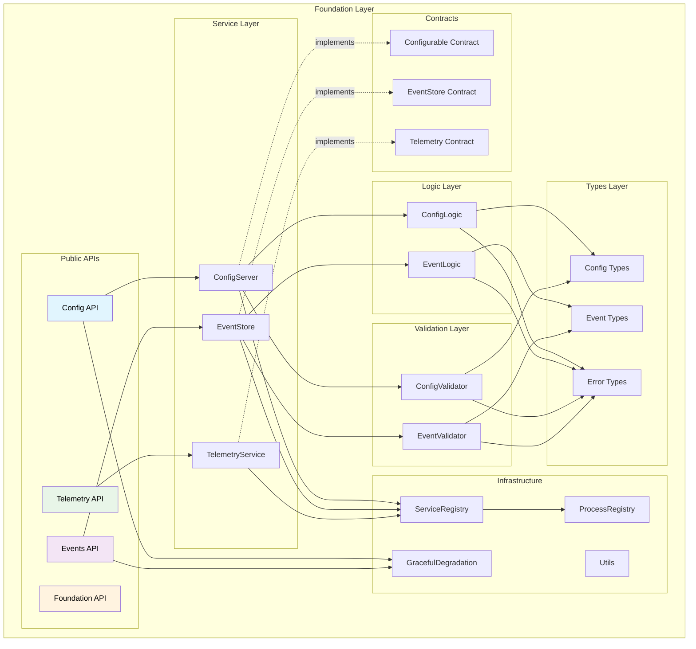

## 2. OTP Supervision Tree

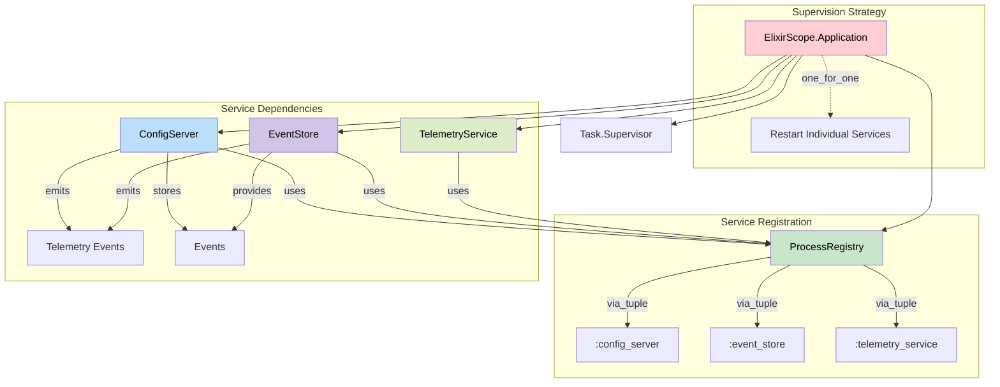

## 3. Service Interaction Flow

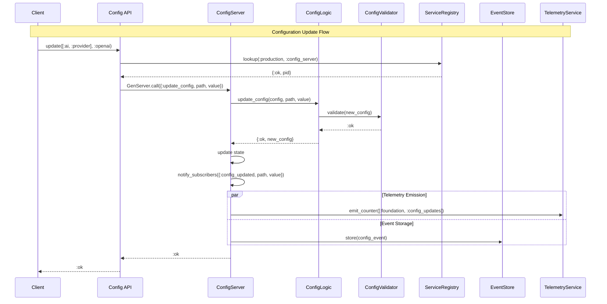

## 4. Event Processing Pipeline

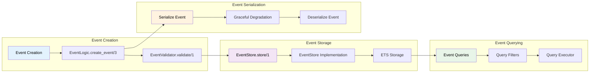

## 5. Configuration Management Flow

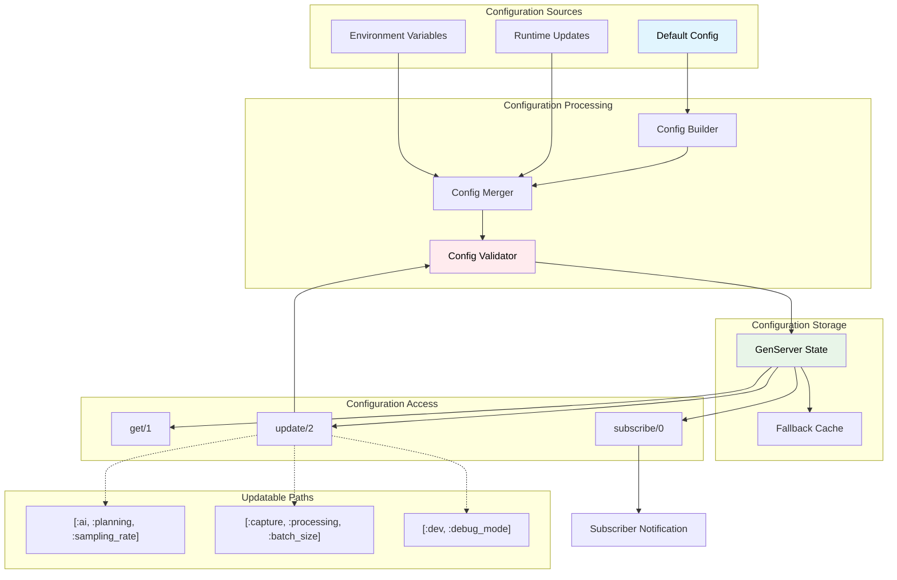

## 6. Registry Architecture & Performance

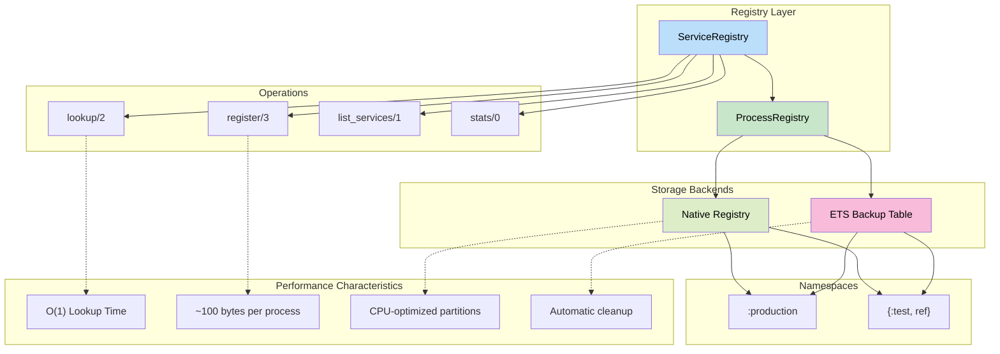

## 7. Error Handling & Context Propagation

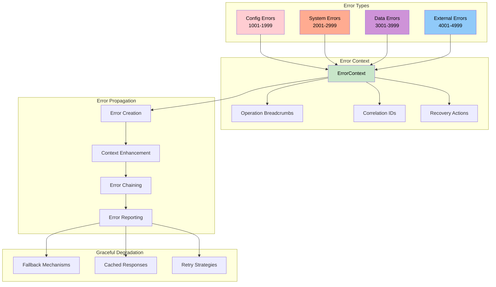

## 8. Telemetry & Metrics Collection

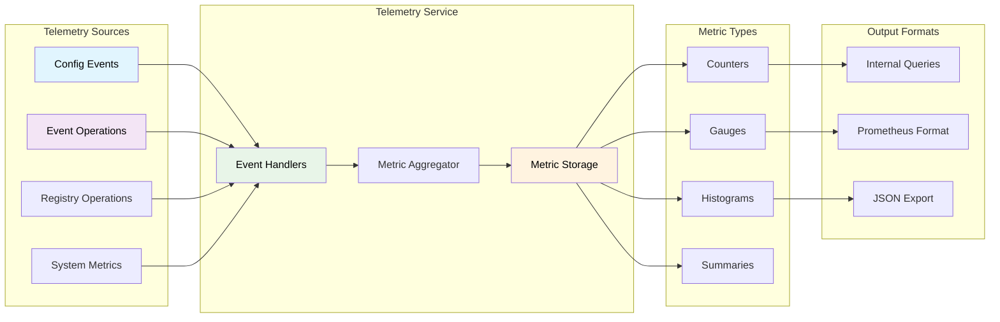

## 9. Service Lifecycle & Health Monitoring

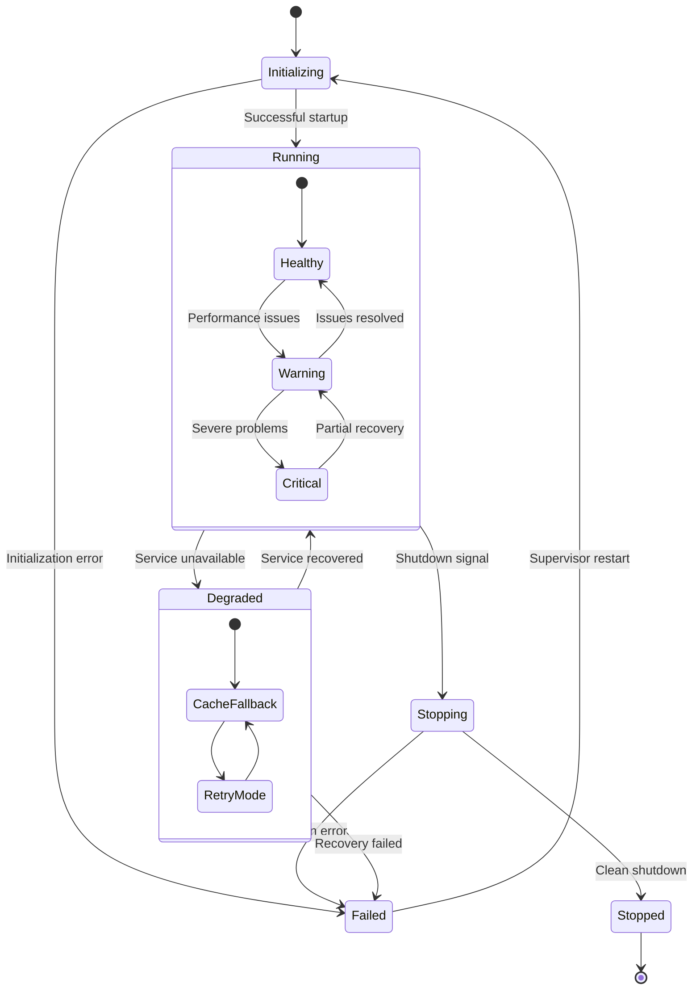

## 10. Data Flow & Message Passing

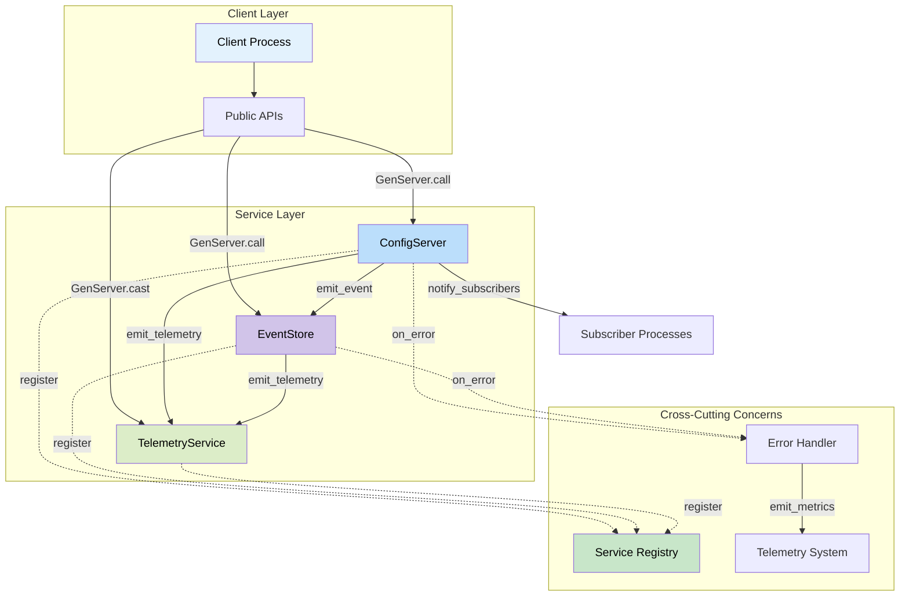

## 11. Testing Architecture

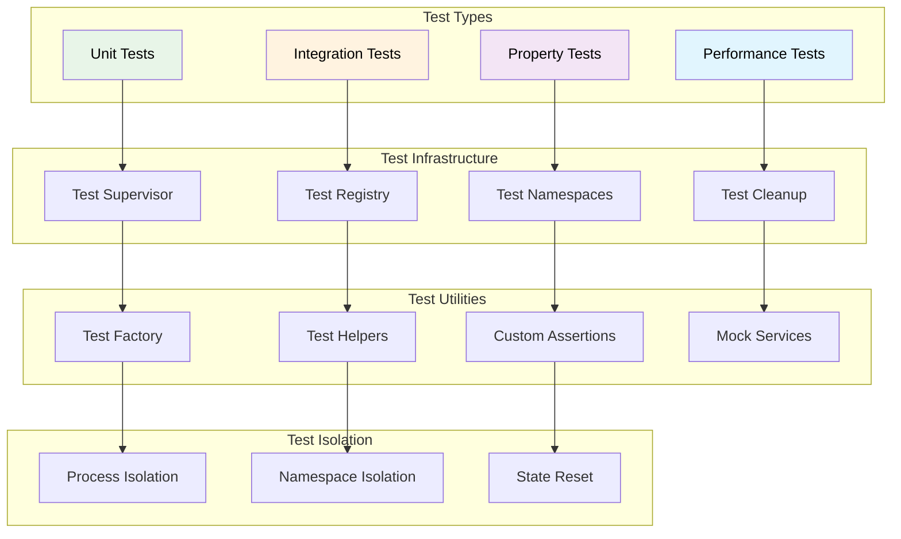

## 12. Configuration Schema & Validation

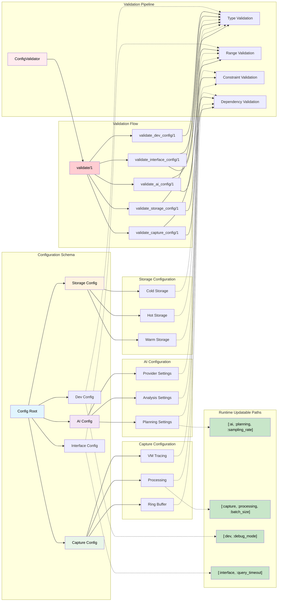

These diagrams provide a comprehensive technical overview of the Foundation layer's internal architecture, showing:

1. **Service Architecture** - How components are organized and interact
2. **OTP Supervision** - Process supervision and lifecycle management
3. **Service Interactions** - Message flows and communication patterns
4. **Event Processing** - Event creation, storage, and querying pipeline
5. **Configuration Management** - Configuration processing and validation
6. **Registry Performance** - Process registration and discovery architecture
7. **Error Handling** - Error propagation and context management
8. **Telemetry Collection** - Metrics gathering and processing
9. **Service Lifecycle** - State transitions and health monitoring
10. **Data Flow** - Message passing between components
11. **Testing Architecture** - Test infrastructure and isolation
12. **Configuration Schema** - Configuration structure and validation

Each diagram focuses on a specific aspect of the Foundation layer, providing the technical detail needed to understand the implementation and design decisions.
