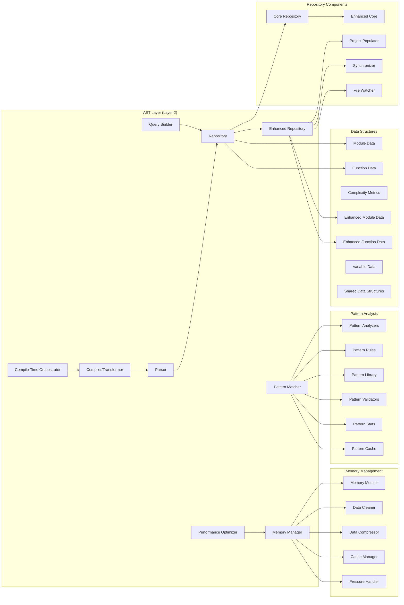
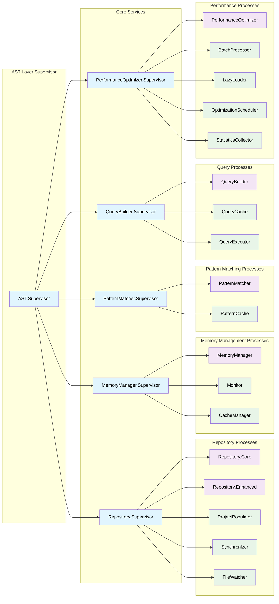
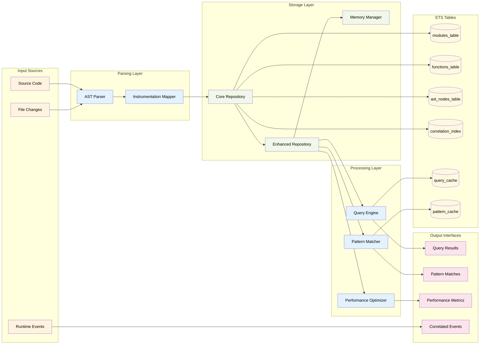
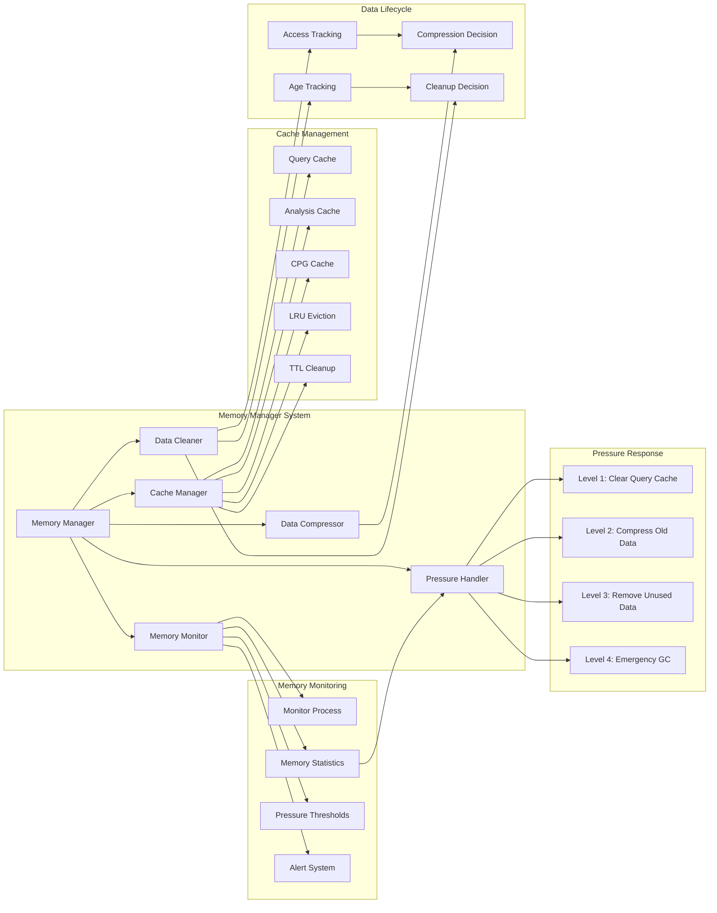
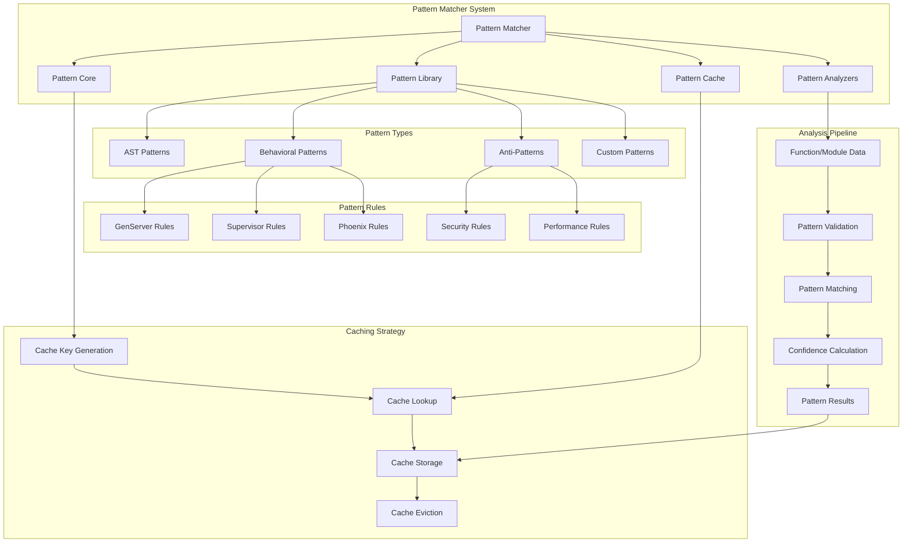
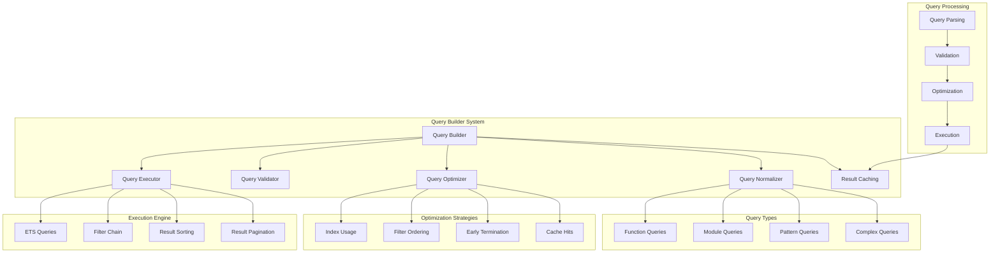
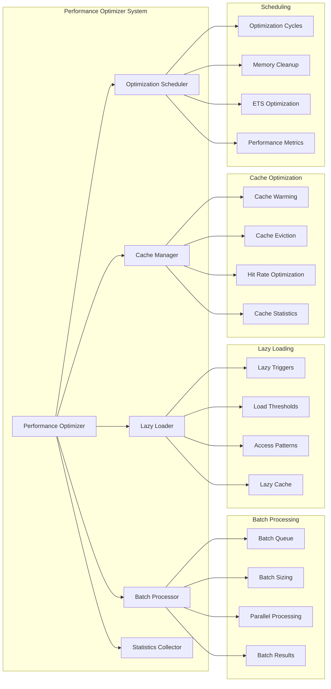
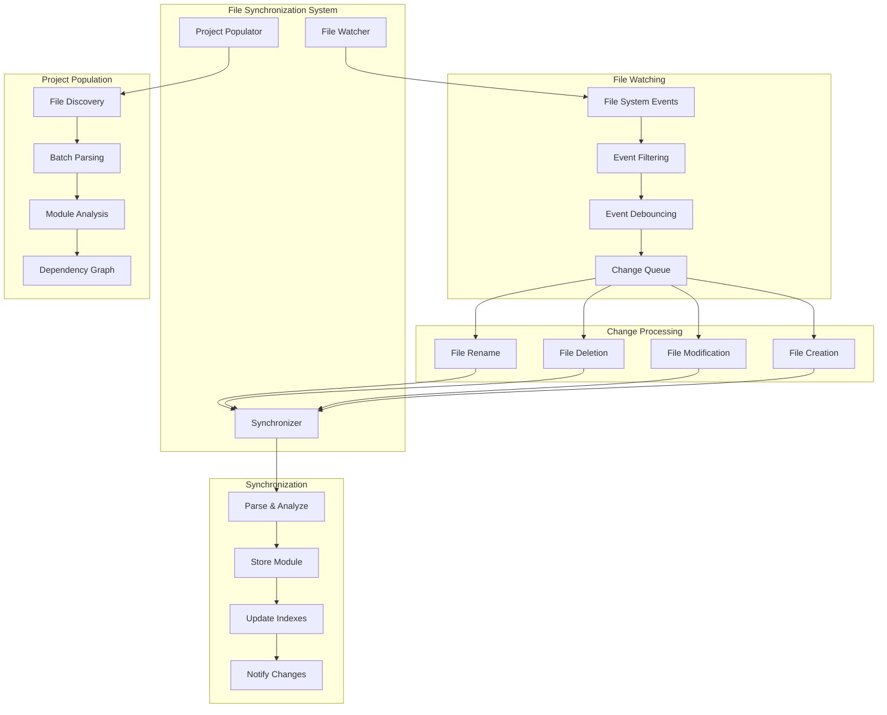
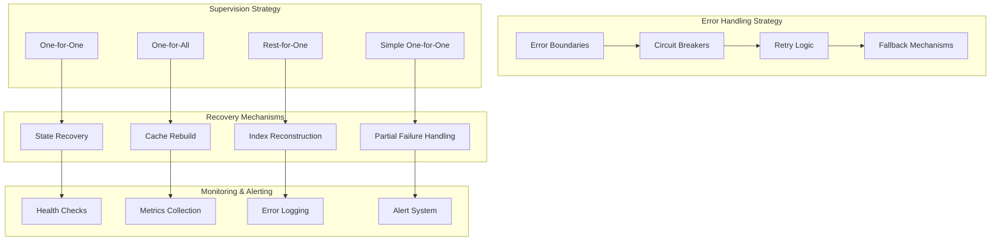

# ElixirScope AST Layer Architecture Diagrams

## 1. AST Layer Component Architecture

## 2. OTP Supervision Tree

## 3. Data Flow Architecture

## 4. Memory Management Architecture

## 5. Pattern Matching Architecture

## 6. Query Engine Architecture

## 7. Performance Optimization Architecture

## 8. File Synchronization Architecture

## 9. Error Handling and Fault Tolerance

## Key Implementation Notes for BEAM/OTP Engineers

### 1. **ETS Table Strategy**
- `:set` tables for unique keys (modules, functions)
- `:bag` tables for one-to-many relationships (indexes)
- `{:read_concurrency, true}` for query-heavy tables
- `{:write_concurrency, true}` for update-heavy tables

### 2. **GenServer Design Patterns**
- Repository uses single GenServer with ETS backend for performance
- Memory Manager coordinates multiple specialized workers
- Pattern Matcher uses worker pool for concurrent analysis

### 3. **Supervision Strategy**
- Repository Supervisor: `:one_for_one` (independent services)
- Memory Manager Supervisor: `:rest_for_one` (dependent cleanup services)
- Performance Optimizer: `:one_for_one` (independent optimization workers)

### 4. **Memory Management**
- ETS memory monitoring with configurable thresholds
- Multi-level pressure response (clear cache → compress → cleanup → GC)
- Access pattern tracking for intelligent cleanup decisions

### 5. **Performance Optimizations**
- Batch processing for bulk operations
- Lazy loading for expensive analysis (CFG/DFG)
- Multi-level caching (query, analysis, CPG)
- Incremental updates vs. full rebuilds

### 6. **Error Handling**
- Circuit breakers for external dependencies
- Graceful degradation when analysis fails
- State recovery after process crashes
- Partial failure handling for batch operations
