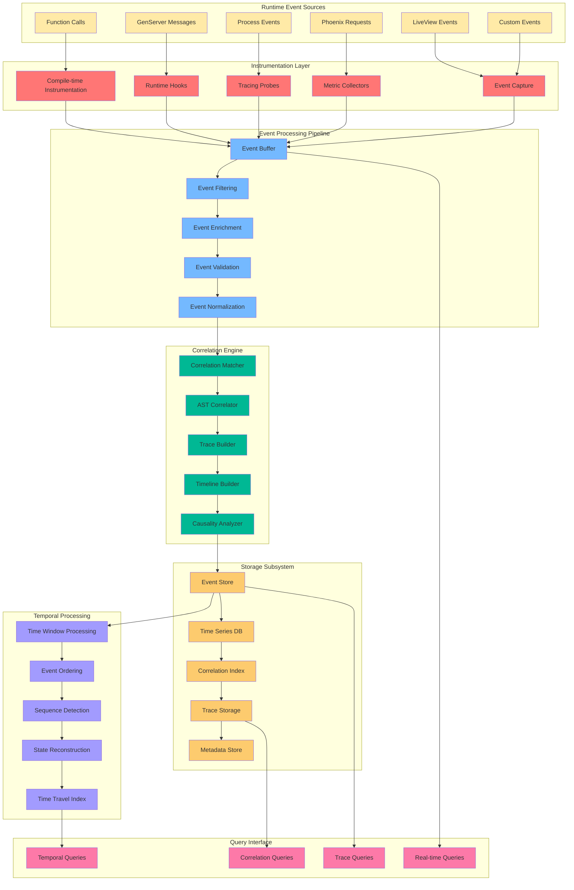
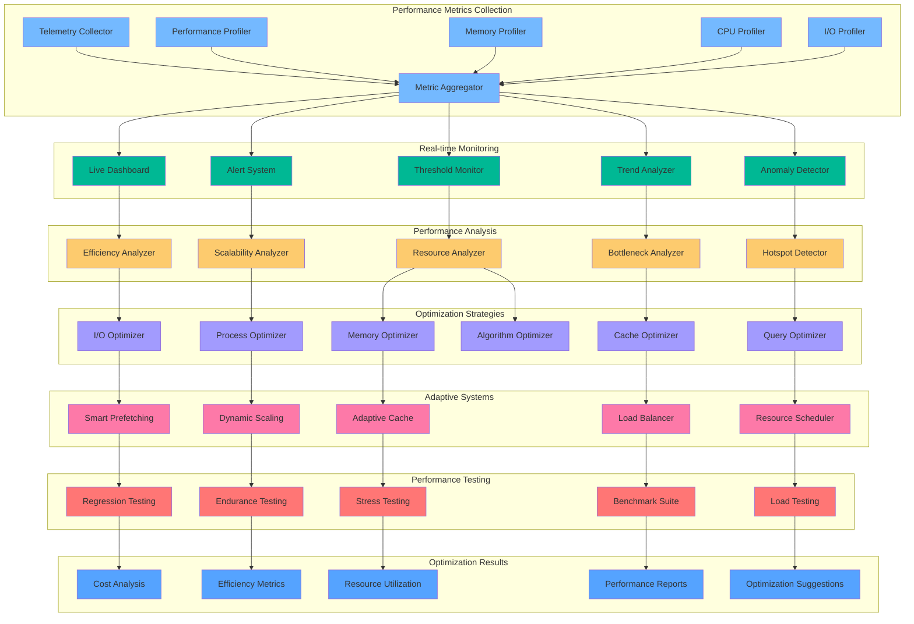

# ElixirScope Complete Architecture Diagrams

## 1. Complete 9-Layer System Architecture

```mermaid
graph TB
    subgraph "Layer 9: Debugger"
        Debug[Debugger Core]
        Interface[User Interface]
        Session[Debug Session]
        TimeTravel[Time Travel]
        Breakpoints[Breakpoints]
        Visualization[Visualization]
        AIAssist[AI Assistant]
    end

    subgraph "Layer 8: Intelligence"
        AI[AI Integration]
        LLM[LLM Client]
        ML[ML Models]
        Features[Feature Extraction]
        Insights[Insight Generation]
        Predictions[Predictions]
        Orchestration[AI Orchestration]
    end

    subgraph "Layer 7: Capture"
        Instrumentation[Instrumentation]
        Correlation[Event Correlation]
        Storage[Event Storage]
        Ingestors[Data Ingestors]
        Temporal[Temporal Handling]
        RuntimeCorr[Runtime Correlator]
    end

    subgraph "Layer 6: Query"
        QueryBuilder[Query Builder]
        QueryExecutor[Query Executor]
        QueryOptimizer[Query Optimizer]
        CPGQueries[CPG Queries]
        AnalysisQueries[Analysis Queries]
        TemporalQueries[Temporal Queries]
        MLQueries[ML Queries]
        DSL[Query DSL]
    end

    subgraph "Layer 5: Analysis"
        Patterns[Pattern Detection]
        Quality[Quality Assessment]
        Metrics[Metrics Calculation]
        Recommendations[Recommendations]
        Architectural[Architectural Analysis]
        Performance[Performance Analysis]
        Security[Security Analysis]
    end

    subgraph "Layer 4: CPG"
        CPGBuilder[CPG Builder]
        CFG[Control Flow Graph]
        DFG[Data Flow Graph]
        CallGraph[Call Graph]
        Semantics[Semantic Analysis]
        CPGOptimization[CPG Optimization]
        FileWatcher[File Watcher]
        Synchronizer[Synchronizer]
    end

    subgraph "Layer 3: Graph"
        Centrality[Centrality Algorithms]
        Pathfinding[Pathfinding]
        Connectivity[Connectivity Analysis]
        Community[Community Detection]
        AdvancedCentrality[Advanced Centrality]
        TemporalAnalysis[Temporal Analysis]
        GraphML[Graph ML]
        DataStructures[Graph Data Structures]
    end

    subgraph "Layer 2: AST"
        Parser[AST Parser]
        Repository[AST Repository]
        Enhanced[Enhanced Repository]
        MemoryManager[Memory Manager]
        PerformanceOptimizer[Performance Optimizer]
        PatternMatcher[Pattern Matcher]
        QueryBuilderAST[AST Query Builder]
        Transformer[AST Transformer]
    end

    subgraph "Layer 1: Foundation"
        Application[OTP Application]
        Config[Configuration]
        Events[Event System]
        Utils[Core Utilities]
        Telemetry[Telemetry]
        Core[Core Management]
        Distributed[Distributed Coordination]
    end

    %% Layer Dependencies (bottom-up)
    Debug --> AI
    Debug --> Capture
    Debug --> QueryBuilder
    
    AI --> QueryBuilder
    AI --> Analysis
    AI --> CPGBuilder
    
    Capture --> Repository
    Capture --> Application
    
    QueryBuilder --> Analysis
    QueryBuilder --> Repository
    QueryBuilder --> Application
    
    Analysis --> CPGBuilder
    Analysis --> Centrality
    Analysis --> Repository
    
    CPGBuilder --> Centrality
    CPGBuilder --> Repository
    CPGBuilder --> Application
    
    Centrality --> Application
    
    Repository --> Application

    classDef debugger fill:#ff6b6b,stroke:#d63031,color:#fff
    classDef intelligence fill:#a29bfe,stroke:#6c5ce7,color:#fff
    classDef capture fill:#fd79a8,stroke:#e84393,color:#fff
    classDef query fill:#fdcb6e,stroke:#e17055,color:#000
    classDef analysis fill:#55a3ff,stroke:#2d3436,color:#fff
    classDef cpg fill:#00b894,stroke:#00a085,color:#fff
    classDef graphh fill:#00cec9,stroke:#00b894,color:#fff
    classDef ast fill:#6c5ce7,stroke:#5f3dc4,color:#fff
    classDef foundation fill:#636e72,stroke:#2d3436,color:#fff

    class Debug,Interface,Session,TimeTravel,Breakpoints,Visualization,AIAssist debugger
    class AI,LLM,ML,Features,Insights,Predictions,Orchestration intelligence
    class Instrumentation,Correlation,Storage,Ingestors,Temporal,RuntimeCorr capture
    class QueryBuilder,QueryExecutor,QueryOptimizer,CPGQueries,AnalysisQueries,TemporalQueries,MLQueries,DSL query
    class Patterns,Quality,Metrics,Recommendations,Architectural,Performance,Security analysis
    class CPGBuilder,CFG,DFG,CallGraph,Semantics,CPGOptimization,FileWatcher,Synchronizer cpg
    class Centrality,Pathfinding,Connectivity,Community,AdvancedCentrality,TemporalAnalysis,GraphML,DataStructures graphh
    class Parser,Repository,Enhanced,MemoryManager,PerformanceOptimizer,PatternMatcher,QueryBuilderAST,Transformer ast
    class Application,Config,Events,Utils,Telemetry,Core,Distributed foundation
```

## 2. Cross-Layer Data Flow Architecture

```mermaid
graph LR
    subgraph "Data Sources"
        Source[Source Code]
        Runtime[Runtime Events]
        User[User Queries]
        Config[Configuration]
    end

    subgraph "Foundation Layer Processing"
        Events[Event Processing]
        Telemetry[Telemetry Collection]
        Utils[Utility Functions]
    end

    subgraph "AST Layer Processing"
        Parse[AST Parsing]
        Store[AST Storage]
        Memory[Memory Management]
    end

    subgraph "Graph Layer Processing"
        GraphBuild[Graph Construction]
        GraphAlgo[Graph Algorithms]
        GraphOpt[Graph Optimization]
    end

    subgraph "CPG Layer Processing"
        CPGBuild[CPG Construction]
        CFGGen[CFG Generation]
        DFGGen[DFG Generation]
        Semantic[Semantic Analysis]
    end

    subgraph "Analysis Layer Processing"
        PatternDet[Pattern Detection]
        QualityAss[Quality Assessment]
        MetricCalc[Metric Calculation]
        Recommend[Recommendations]
    end

    subgraph "Query Layer Processing"
        QueryParse[Query Parsing]
        QueryOpt[Query Optimization]
        QueryExec[Query Execution]
    end

    subgraph "Capture Layer Processing"
        Instrument[Instrumentation]
        Correlate[Event Correlation]
        EventStore[Event Storage]
    end

    subgraph "Intelligence Layer Processing"
        AIProcess[AI Processing]
        MLInfer[ML Inference]
        InsightGen[Insight Generation]
    end

    subgraph "Debugger Layer Processing"
        DebugUI[Debug Interface]
        SessionMgmt[Session Management]
        TimeNav[Time Navigation]
    end

    subgraph "Output"
        DebugResults[Debug Results]
        Insights[AI Insights]
        Reports[Analysis Reports]
        Visualizations[Visualizations]
    end

    %% Data flow connections
    Source --> Parse
    Runtime --> Instrument
    User --> QueryParse
    Config --> Events

    Parse --> Store
    Store --> GraphBuild
    GraphBuild --> GraphAlgo
    GraphAlgo --> CPGBuild

    CPGBuild --> CFGGen
    CPGBuild --> DFGGen
    CFGGen --> Semantic
    DFGGen --> Semantic

    Semantic --> PatternDet
    PatternDet --> QualityAss
    QualityAss --> MetricCalc
    MetricCalc --> Recommend

    QueryParse --> QueryOpt
    QueryOpt --> QueryExec
    QueryExec --> Reports

    Instrument --> Correlate
    Correlate --> EventStore
    EventStore --> AIProcess

    AIProcess --> MLInfer
    MLInfer --> InsightGen
    InsightGen --> Insights

    Recommend --> DebugUI
    EventStore --> SessionMgmt
    SessionMgmt --> TimeNav
    TimeNav --> DebugResults

    Events --> Telemetry
    Telemetry --> Visualizations

    classDef source fill:#ffeaa7
    classDef processing fill:#74b9ff
    classDef output fill:#fd79a8

    class Source,Runtime,User,Config source
    class Parse,Store,Memory,GraphBuild,GraphAlgo,GraphOpt,CPGBuild,CFGGen,DFGGen,Semantic,PatternDet,QualityAss,MetricCalc,Recommend,QueryParse,QueryOpt,QueryExec,Instrument,Correlate,EventStore,AIProcess,MLInfer,InsightGen,DebugUI,SessionMgmt,TimeNav,Events,Telemetry,Utils processing
    class DebugResults,Insights,Reports,Visualizations output
```

## 3. Intelligence Layer AI/ML Architecture

```mermaid
graph TB
    subgraph "AI Provider Ecosystem"
        OpenAI[OpenAI Provider]
        Anthropic[Anthropic Provider]
        Gemini[Gemini Provider]
        Local[Local Models]
        Mock[Mock Provider]
    end

    subgraph "LLM Integration Layer"
        LLMClient[LLM Client]
        ProviderInterface[Provider Interface]
        ResponseParser[Response Parser]
        ConfigMgmt[Config Management]
        RateLimit[Rate Limiting]
        Caching[Response Caching]
    end

    subgraph "Feature Extraction"
        ASTFeatures[AST Features]
        CPGFeatures[CPG Features]
        RuntimeFeatures[Runtime Features]
        MetricFeatures[Metric Features]
        PatternFeatures[Pattern Features]
    end

    subgraph "ML Models"
        ComplexityPredictor[Complexity Predictor]
        BugPredictor[Bug Predictor]
        PerformancePredictor[Performance Predictor]
        PatternClassifier[Pattern Classifier]
        QualityAssessor[Quality Assessor]
        SecurityAnalyzer[Security Analyzer]
    end

    subgraph "Insight Generation"
        CodeInsights[Code Insights]
        ArchInsights[Architectural Insights]
        PerfInsights[Performance Insights]
        SecurityInsights[Security Insights]
        RefactorSuggestions[Refactoring Suggestions]
        OptimizationTips[Optimization Tips]
    end

    subgraph "AI Orchestration"
        TaskScheduler[Task Scheduler]
        ContextManager[Context Manager]
        PromptEngine[Prompt Engine]
        ResponseAggregator[Response Aggregator]
        QualityControl[Quality Control]
    end

    subgraph "Data Sources"
        ASTData[(AST Data)]
        CPGData[(CPG Data)]
        RuntimeData[(Runtime Data)]
        AnalysisData[(Analysis Data)]
        UserContext[(User Context)]
    end

    %% Connections
    OpenAI --> LLMClient
    Anthropic --> LLMClient
    Gemini --> LLMClient
    Local --> LLMClient
    Mock --> LLMClient

    LLMClient --> ProviderInterface
    ProviderInterface --> ResponseParser
    ResponseParser --> ConfigMgmt
    ConfigMgmt --> RateLimit
    RateLimit --> Caching

    ASTData --> ASTFeatures
    CPGData --> CPGFeatures
    RuntimeData --> RuntimeFeatures
    AnalysisData --> MetricFeatures
    UserContext --> PatternFeatures

    ASTFeatures --> ComplexityPredictor
    CPGFeatures --> BugPredictor
    RuntimeFeatures --> PerformancePredictor
    MetricFeatures --> PatternClassifier
    PatternFeatures --> QualityAssessor

    ComplexityPredictor --> CodeInsights
    BugPredictor --> ArchInsights
    PerformancePredictor --> PerfInsights
    PatternClassifier --> SecurityInsights
    QualityAssessor --> RefactorSuggestions
    SecurityAnalyzer --> OptimizationTips

    TaskScheduler --> PromptEngine
    ContextManager --> PromptEngine
    PromptEngine --> LLMClient
    LLMClient --> ResponseAggregator
    ResponseAggregator --> QualityControl

    classDef provider fill:#ff7675
    classDef integration fill:#74b9ff
    classDef extraction fill:#55a3ff
    classDef models fill:#00b894
    classDef insights fill:#fdcb6e
    classDef orchestration fill:#a29bfe
    classDef data fill:#e17055

    class OpenAI,Anthropic,Gemini,Local,Mock provider
    class LLMClient,ProviderInterface,ResponseParser,ConfigMgmt,RateLimit,Caching integration
    class ASTFeatures,CPGFeatures,RuntimeFeatures,MetricFeatures,PatternFeatures extraction
    class ComplexityPredictor,BugPredictor,PerformancePredictor,PatternClassifier,QualityAssessor,SecurityAnalyzer models
    class CodeInsights,ArchInsights,PerfInsights,SecurityInsights,RefactorSuggestions,OptimizationTips insights
    class TaskScheduler,ContextManager,PromptEngine,ResponseAggregator,QualityControl orchestration
    class ASTData,CPGData,RuntimeData,AnalysisData,UserContext data
```

## 4. Capture Layer Runtime Correlation Architecture

## 5. Debugger Layer Complete Interface Architecture

```mermaid
graph TB
    subgraph "User Interface Layer"
        WebUI[Web Interface]
        CLI[Command Line]
        IDE[IDE Integration]
        API[REST API]
        WebSocket[WebSocket API]
    end

    subgraph "Session Management"
        SessionCore[Session Core]
        SessionState[Session State]
        SessionPersistence[Session Persistence]
        SessionSync[Session Sync]
        MultiUser[Multi-user Support]
    end

    subgraph "Breakpoint System"
        BreakpointManager[Breakpoint Manager]
        ConditionalBreakpoints[Conditional Breakpoints]
        DataBreakpoints[Data Breakpoints]
        LineBreakpoints[Line Breakpoints]
        FunctionBreakpoints[Function Breakpoints]
        LogPoints[Log Points]
    end

    subgraph "Time Travel Engine"
        TimeMachine[Time Machine Core]
        StateSnapshots[State Snapshots]
        ExecutionHistory[Execution History]
        ReverseExecution[Reverse Execution]
        StateReconstruction[State Reconstruction]
        HistoryNavigation[History Navigation]
    end

    subgraph "Visualization Engine"
        CallFlow[Call Flow Visualization]
        DataFlow[Data Flow Visualization]
        StateVisualization[State Visualization]
        GraphVisualization[Graph Visualization]
        TimelineVisualization[Timeline Visualization]
        Interactive3D[Interactive 3D Views]
    end

    subgraph "AI Debugging Assistant"
        AICore[AI Assistant Core]
        ErrorExplanation[Error Explanation]
        DebugSuggestions[Debug Suggestions]
        CodeRecommendations[Code Recommendations]
        BugPrediction[Bug Prediction]
        AutomaticRepair[Automatic Repair]
    end

    subgraph "Enhanced Instrumentation"
        SmartInstrumentation[Smart Instrumentation]
        AdaptiveProbes[Adaptive Probes]
        MinimalOverhead[Minimal Overhead]
        SelectiveCapture[Selective Capture]
        DynamicInstrumentation[Dynamic Instrumentation]
    end

    subgraph "Data Integration"
        CaptureIntegration[Capture Integration]
        AnalysisIntegration[Analysis Integration]
        CPGIntegration[CPG Integration]
        IntelligenceIntegration[Intelligence Integration]
        QueryIntegration[Query Integration]
    end

    %% Interface connections
    WebUI --> SessionCore
    CLI --> SessionCore
    IDE --> SessionCore
    API --> SessionCore
    WebSocket --> SessionCore

    %% Session management
    SessionCore --> SessionState
    SessionState --> SessionPersistence
    SessionPersistence --> SessionSync
    SessionSync --> MultiUser

    %% Breakpoint system
    SessionCore --> BreakpointManager
    BreakpointManager --> ConditionalBreakpoints
    BreakpointManager --> DataBreakpoints
    BreakpointManager --> LineBreakpoints
    BreakpointManager --> FunctionBreakpoints
    BreakpointManager --> LogPoints

    %% Time travel
    SessionCore --> TimeMachine
    TimeMachine --> StateSnapshots
    StateSnapshots --> ExecutionHistory
    ExecutionHistory --> ReverseExecution
    ReverseExecution --> StateReconstruction
    StateReconstruction --> HistoryNavigation

    %% Visualization
    SessionCore --> CallFlow
    CallFlow --> DataFlow
    DataFlow --> StateVisualization
    StateVisualization --> GraphVisualization
    GraphVisualization --> TimelineVisualization
    TimelineVisualization --> Interactive3D

    %% AI assistant
    SessionCore --> AICore
    AICore --> ErrorExplanation
    ErrorExplanation --> DebugSuggestions
    DebugSuggestions --> CodeRecommendations
    CodeRecommendations --> BugPrediction
    BugPrediction --> AutomaticRepair

    %% Enhanced instrumentation
    SessionCore --> SmartInstrumentation
    SmartInstrumentation --> AdaptiveProbes
    AdaptiveProbes --> MinimalOverhead
    MinimalOverhead --> SelectiveCapture
    SelectiveCapture --> DynamicInstrumentation

    %% Layer integration
    SessionCore --> CaptureIntegration
    CaptureIntegration --> AnalysisIntegration
    AnalysisIntegration --> CPGIntegration
    CPGIntegration --> IntelligenceIntegration
    IntelligenceIntegration --> QueryIntegration

    classDef interface fill:#ff6b6b
    classDef session fill:#4ecdc4
    classDef breakpoint fill:#45b7d1
    classDef timetravel fill:#96ceb4
    classDef visualization fill:#feca57
    classDef ai fill:#a29bfe
    classDef instrumentation fill:#fd79a8
    classDef integration fill:#636e72

    class WebUI,CLI,IDE,API,WebSocket interface
    class SessionCore,SessionState,SessionPersistence,SessionSync,MultiUser session
    class BreakpointManager,ConditionalBreakpoints,DataBreakpoints,LineBreakpoints,FunctionBreakpoints,LogPoints breakpoint
    class TimeMachine,StateSnapshots,ExecutionHistory,ReverseExecution,StateReconstruction,HistoryNavigation timetravel
    class CallFlow,DataFlow,StateVisualization,GraphVisualization,TimelineVisualization,Interactive3D visualization
    class AICore,ErrorExplanation,DebugSuggestions,CodeRecommendations,BugPrediction,AutomaticRepair ai
    class SmartInstrumentation,AdaptiveProbes,MinimalOverhead,SelectiveCapture,DynamicInstrumentation instrumentation
    class CaptureIntegration,AnalysisIntegration,CPGIntegration,IntelligenceIntegration,QueryIntegration integration
```

## 6. Complete OTP Supervision Architecture

```mermaid
graph TB
    subgraph "ElixirScope Application"
        AppSup[Application Supervisor]
    end

    subgraph "Layer Supervisors"
        FoundationSup[Foundation.Supervisor]
        ASTSup[AST.Supervisor]
        GraphSup[Graph.Supervisor]
        CPGSup[CPG.Supervisor]
        AnalysisSup[Analysis.Supervisor]
        QuerySup[Query.Supervisor]
        CaptureSup[Capture.Supervisor]
        IntelligenceSup[Intelligence.Supervisor]
        DebuggerSup[Debugger.Supervisor]
    end

    subgraph "Foundation Services"
        Config[Config Manager]
        Events[Event Manager]
        Telemetry[Telemetry Supervisor]
        Utils[Utility Services]
    end

    subgraph "AST Services"
        Parser[AST Parser]
        Repository[Repository Core]
        Enhanced[Enhanced Repository]
        MemMgr[Memory Manager]
        PerfOpt[Performance Optimizer]
        PatMat[Pattern Matcher]
        QueryBldAST[AST Query Builder]
    end

    subgraph "Graph Services"
        GraphCore[Graph Core]
        AlgorithmPool[Algorithm Worker Pool]
        GraphCache[Graph Cache]
    end

    subgraph "CPG Services"
        CPGBuilder[CPG Builder]
        CFGGen[CFG Generator]
        DFGGen[DFG Generator]
        CallGraphGen[Call Graph Generator]
        SemanticAnalyzer[Semantic Analyzer]
        CPGOptimizer[CPG Optimizer]
        FileWatcher[File Watcher]
        Synchronizer[Synchronizer]
    end

    subgraph "Analysis Services"
        PatternDetector[Pattern Detector]
        QualityAnalyzer[Quality Analyzer]
        MetricsCalculator[Metrics Calculator]
        RecommendationEngine[Recommendation Engine]
        ArchAnalyzer[Architectural Analyzer]
        PerfAnalyzer[Performance Analyzer]
        SecurityAnalyzer[Security Analyzer]
    end

    subgraph "Query Services"
        QueryCore[Query Core]
        QueryExecutor[Query Executor]
        QueryOptimizer[Query Optimizer]
        QueryCache[Query Cache]
        ExtensionPool[Extension Worker Pool]
    end

    subgraph "Capture Services"
        InstrumentationCore[Instrumentation Core]
        EventCorrelator[Event Correlator]
        EventStorage[Event Storage]
        DataIngestors[Data Ingestors]
        TemporalProcessor[Temporal Processor]
        RuntimeCorrelator[Runtime Correlator]
    end

    subgraph "Intelligence Services"
        AICore[AI Core]
        LLMClient[LLM Client]
        ModelPool[Model Worker Pool]
        FeatureExtractor[Feature Extractor]
        InsightGenerator[Insight Generator]
        PredictionEngine[Prediction Engine]
        Orchestrator[AI Orchestrator]
    end

    subgraph "Debugger Services"
        DebugCore[Debug Core]
        SessionManager[Session Manager]
        BreakpointManager[Breakpoint Manager]
        TimeTravelEngine[Time Travel Engine]
        VisualizationEngine[Visualization Engine]
        AIAssistant[AI Assistant]
        EnhancedInstr[Enhanced Instrumentation]
    end

    %% Application supervision
    AppSup --> FoundationSup
    AppSup --> ASTSup
    AppSup --> GraphSup
    AppSup --> CPGSup
    AppSup --> AnalysisSup
    AppSup --> QuerySup
    AppSup --> CaptureSup
    AppSup --> IntelligenceSup
    AppSup --> DebuggerSup

    %% Foundation supervision
    FoundationSup --> Config
    FoundationSup --> Events
    FoundationSup --> Telemetry
    FoundationSup --> Utils

    %% AST supervision
    ASTSup --> Parser
    ASTSup --> Repository
    ASTSup --> Enhanced
    ASTSup --> MemMgr
    ASTSup --> PerfOpt
    ASTSup --> PatMat
    ASTSup --> QueryBldAST

    %% Graph supervision
    GraphSup --> GraphCore
    GraphSup --> AlgorithmPool
    GraphSup --> GraphCache

    %% CPG supervision
    CPGSup --> CPGBuilder
    CPGSup --> CFGGen
    CPGSup --> DFGGen
    CPGSup --> CallGraphGen
    CPGSup --> SemanticAnalyzer
    CPGSup --> CPGOptimizer
    CPGSup --> FileWatcher
    CPGSup --> Synchronizer

    %% Analysis supervision
    AnalysisSup --> PatternDetector
    AnalysisSup --> QualityAnalyzer
    AnalysisSup --> MetricsCalculator
    AnalysisSup --> RecommendationEngine
    AnalysisSup --> ArchAnalyzer
    AnalysisSup --> PerfAnalyzer
    AnalysisSup --> SecurityAnalyzer

    %% Query supervision
    QuerySup --> QueryCore
    QuerySup --> QueryExecutor
    QuerySup --> QueryOptimizer
    QuerySup --> QueryCache
    QuerySup --> ExtensionPool

    %% Capture supervision
    CaptureSup --> InstrumentationCore
    CaptureSup --> EventCorrelator
    CaptureSup --> EventStorage
    CaptureSup --> DataIngestors
    CaptureSup --> TemporalProcessor
    CaptureSup --> RuntimeCorrelator

    %% Intelligence supervision
    IntelligenceSup --> AICore
    IntelligenceSup --> LLMClient
    IntelligenceSup --> ModelPool
    IntelligenceSup --> FeatureExtractor
    IntelligenceSup --> InsightGenerator
    IntelligenceSup --> PredictionEngine
    IntelligenceSup --> Orchestrator

    %% Debugger supervision
    DebuggerSup --> DebugCore
    DebuggerSup --> SessionManager
    DebuggerSup --> BreakpointManager
    DebuggerSup --> TimeTravelEngine
    DebuggerSup --> VisualizationEngine
    DebuggerSup --> AIAssistant
    DebuggerSup --> EnhancedInstr

    classDef app fill:#2d3436
    classDef supervisor fill:#636e72
    classDef service fill:#74b9ff
    classDef worker fill:#00b894

    class AppSup app
    class FoundationSup,ASTSup,GraphSup,CPGSup,AnalysisSup,QuerySup,CaptureSup,IntelligenceSup,DebuggerSup supervisor
    class Config,Events,Parser,Repository,Enhanced,CPGBuilder,PatternDetector,QueryCore,InstrumentationCore,AICore,DebugCore service
    class Telemetry,Utils,MemMgr,PerfOpt,PatMat,QueryBldAST,GraphCore,AlgorithmPool,GraphCache,CFGGen,DFGGen,CallGraphGen,SemanticAnalyzer,CPGOptimizer,FileWatcher,Synchronizer,QualityAnalyzer,MetricsCalculator,RecommendationEngine,ArchAnalyzer,PerfAnalyzer,SecurityAnalyzer,QueryExecutor,QueryOptimizer,QueryCache,ExtensionPool,EventCorrelator,EventStorage,DataIngestors,TemporalProcessor,RuntimeCorrelator,LLMClient,ModelPool,FeatureExtractor,InsightGenerator,PredictionEngine,Orchestrator,SessionManager,BreakpointManager,TimeTravelEngine,VisualizationEngine,AIAssistant,EnhancedInstr worker
```

## 7. Error Handling and Fault Tolerance Architecture

```mermaid
graph TB
    subgraph "Error Detection Layer"
        ProcessMonitor[Process Monitor]
        HealthChecks[Health Checks]
        PerformanceMonitor[Performance Monitor]
        MemoryMonitor[Memory Monitor]
        ErrorAggregator[Error Aggregator]
    end

    subgraph "Circuit Breaker System"
        AICBreakerAI[AI Provider Circuit Breaker]
        DBBreaker[Database Circuit Breaker]
        ExternalAPIBreaker[External API Circuit Breaker]
        FileSystemBreaker[File System Circuit Breaker]
        NetworkBreaker[Network Circuit Breaker]
    end

    subgraph "Retry Logic"
        ExponentialBackoff[Exponential Backoff]
        JitteredRetry[Jittered Retry]
        RetryQueue[Retry Queue]
        DeadLetterQueue[Dead Letter Queue]
        RetryPolicy[Retry Policy Manager]
    end

    subgraph "Fallback Mechanisms"
        CacheFallback[Cache Fallback]
        MockFallback[Mock Fallback]
        ReducedFunctionality[Reduced Functionality]
        GracefulDegradation[Graceful Degradation]
        EmergencyMode[Emergency Mode]
    end

    subgraph "State Recovery"
        CheckpointManager[Checkpoint Manager]
        StateSnapshot[State Snapshot]
        StateRecovery[State Recovery]
        DataConsistency[Data Consistency Check]
        IncrementalRecovery[Incremental Recovery]
    end

    subgraph "Supervisor Strategies"
        OneForOne[One-for-One Restart]
        OneForAll[One-for-All Restart]
        RestForOne[Rest-for-One Restart]
        SimpleOneForOne[Simple One-for-One]
        DynamicSupervisor[Dynamic Supervisor]
    end

    subgraph "Error Classification"
        TransientErrors[Transient Errors]
        PermanentErrors[Permanent Errors]
        ResourceErrors[Resource Errors]
        ConfigErrors[Configuration Errors]
        UserErrors[User Errors]
        SystemErrors[System Errors]
    end

    subgraph "Recovery Actions"
        ProcessRestart[Process Restart]
        CacheClear[Cache Clear]
        ResourceCleanup[Resource Cleanup]
        ConfigReload[Config Reload]
        UserNotification[User Notification]
        SystemShutdown[System Shutdown]
    end

    %% Error detection flow
    ProcessMonitor --> ErrorAggregator
    HealthChecks --> ErrorAggregator
    PerformanceMonitor --> ErrorAggregator
    MemoryMonitor --> ErrorAggregator

    %% Circuit breaker flow
    ErrorAggregator --> AICBreakerAI
    ErrorAggregator --> DBBreaker
    ErrorAggregator --> ExternalAPIBreaker
    ErrorAggregator --> FileSystemBreaker
    ErrorAggregator --> NetworkBreaker

    %% Retry logic flow
    AICBreakerAI --> ExponentialBackoff
    DBBreaker --> JitteredRetry
    ExternalAPIBreaker --> RetryQueue
    FileSystemBreaker --> DeadLetterQueue
    NetworkBreaker --> RetryPolicy

    %% Fallback mechanisms
    RetryPolicy --> CacheFallback
    DeadLetterQueue --> MockFallback
    RetryQueue --> ReducedFunctionality
    JitteredRetry --> GracefulDegradation
    ExponentialBackoff --> EmergencyMode

    %% State recovery
    EmergencyMode --> CheckpointManager
    CheckpointManager --> StateSnapshot
    StateSnapshot --> StateRecovery
    StateRecovery --> DataConsistency
    DataConsistency --> IncrementalRecovery

    %% Supervisor strategies
    StateRecovery --> OneForOne
    StateRecovery --> OneForAll
    StateRecovery --> RestForOne
    StateRecovery --> SimpleOneForOne
    StateRecovery --> DynamicSupervisor

    %% Error classification
    ErrorAggregator --> TransientErrors
    ErrorAggregator --> PermanentErrors
    ErrorAggregator --> ResourceErrors
    ErrorAggregator --> ConfigErrors
    ErrorAggregator --> UserErrors
    ErrorAggregator --> SystemErrors

    %% Recovery actions
    TransientErrors --> ProcessRestart
    PermanentErrors --> CacheClear
    ResourceErrors --> ResourceCleanup
    ConfigErrors --> ConfigReload
    UserErrors --> UserNotification
    SystemErrors --> SystemShutdown

    classDef detection fill:#ff6b6b
    classDef breaker fill:#4ecdc4
    classDef retry fill:#45b7d1
    classDef fallback fill:#96ceb4
    classDef recovery fill:#feca57
    classDef supervisor fill:#a29bfe
    classDef classification fill:#fd79a8
    classDef actions fill:#636e72

    class ProcessMonitor,HealthChecks,PerformanceMonitor,MemoryMonitor,ErrorAggregator detection
    class AICBreakerAI,DBBreaker,ExternalAPIBreaker,FileSystemBreaker,NetworkBreaker breaker
    class ExponentialBackoff,JitteredRetry,RetryQueue,DeadLetterQueue,RetryPolicy retry
    class CacheFallback,MockFallback,ReducedFunctionality,GracefulDegradation,EmergencyMode fallback
    class CheckpointManager,StateSnapshot,StateRecovery,DataConsistency,IncrementalRecovery recovery
    class OneForOne,OneForAll,RestForOne,SimpleOneForOne,DynamicSupervisor supervisor
    class TransientErrors,PermanentErrors,ResourceErrors,ConfigErrors,UserErrors,SystemErrors classification
    class ProcessRestart,CacheClear,ResourceCleanup,ConfigReload,UserNotification,SystemShutdown actions
```

## 8. Performance Monitoring and Optimization Architecture

## 9. Integration Architecture with External Systems

```mermaid
graph TB
    subgraph "ElixirScope Core"
        CoreSystem[ElixirScope Core]
        APIGateway[API Gateway]
        EventBus[Event Bus]
        ConfigManager[Config Manager]
    end

    subgraph "Phoenix Integration"
        PhoenixLiveView[Phoenix LiveView]
        PhoenixController[Phoenix Controller]
        PhoenixSocket[Phoenix Socket]
        PhoenixTelemetry[Phoenix Telemetry]
        PhoenixPlugs[Phoenix Plugs]
    end

    subgraph "Database Integration"
        EctoIntegration[Ecto Integration]
        PostgreSQL[PostgreSQL]
        ETS[ETS Storage]
        Redis[Redis Cache]
        TimeSeriesDB[Time Series DB]
    end

    subgraph "Testing Framework Integration"
        ExUnit[ExUnit Integration]
        TestHelpers[Test Helpers]
        MockProviders[Mock Providers]
        TestFixtures[Test Fixtures]
        PropertyTesting[Property Testing]
    end

    subgraph "CI/CD Integration"
        GitHubActions[GitHub Actions]
        GitLabCI[GitLab CI]
        Jenkins[Jenkins]
        DockerIntegration[Docker Integration]
        K8sIntegration[Kubernetes Integration]
    end

    subgraph "IDE Integration"
        VSCodeExtension[VS Code Extension]
        IntelliJPlugin[IntelliJ Plugin]
        VimPlugin[Vim Plugin]
        EmacsMode[Emacs Mode]
        LanguageServer[Language Server Protocol]
    end

    subgraph "External Services"
        AI_APIs[AI Provider APIs]
        GitHub_API[GitHub API]
        Metrics_Services[Metrics Services]
        Notification_Services[Notification Services]
        Analytics_Services[Analytics Services]
    end

    subgraph "Data Export/Import"
        JSONExport[JSON Export]
        CSVExport[CSV Export]
        GraphMLExport[GraphML Export]
        ElixirDataImport[Elixir Data Import]
        ExternalDataImport[External Data Import]
    end

    %% Core system connections
    CoreSystem --> APIGateway
    CoreSystem --> EventBus
    CoreSystem --> ConfigManager

    %% Phoenix integration
    APIGateway --> PhoenixLiveView
    APIGateway --> PhoenixController
    EventBus --> PhoenixSocket
    ConfigManager --> PhoenixTelemetry
    APIGateway --> PhoenixPlugs

    %% Database integration
    CoreSystem --> EctoIntegration
    EctoIntegration --> PostgreSQL
    CoreSystem --> ETS
    APIGateway --> Redis
    EventBus --> TimeSeriesDB

    %% Testing integration
    CoreSystem --> ExUnit
    APIGateway --> TestHelpers
    ConfigManager --> MockProviders
    CoreSystem --> TestFixtures
    APIGateway --> PropertyTesting

    %% CI/CD integration
    APIGateway --> GitHubActions
    APIGateway --> GitLabCI
    APIGateway --> Jenkins
    CoreSystem --> DockerIntegration
    CoreSystem --> K8sIntegration

    %% IDE integration
    APIGateway --> VSCodeExtension
    APIGateway --> IntelliJPlugin
    APIGateway --> VimPlugin
    APIGateway --> EmacsMode
    CoreSystem --> LanguageServer

    %% External services
    APIGateway --> AI_APIs
    APIGateway --> GitHub_API
    EventBus --> Metrics_Services
    EventBus --> Notification_Services
    APIGateway --> Analytics_Services

    %% Data export/import
    APIGateway --> JSONExport
    APIGateway --> CSVExport
    APIGateway --> GraphMLExport
    CoreSystem --> ElixirDataImport
    CoreSystem --> ExternalDataImport

    classDef core fill:#2d3436
    classDef phoenix fill:#ff6b6b
    classDef database fill:#74b9ff
    classDef testing fill:#00b894
    classDef cicd fill:#fdcb6e
    classDef ide fill:#a29bfe
    classDef external fill:#fd79a8
    classDef data fill:#55a3ff

    class CoreSystem,APIGateway,EventBus,ConfigManager core
    class PhoenixLiveView,PhoenixController,PhoenixSocket,PhoenixTelemetry,PhoenixPlugs phoenix
    class EctoIntegration,PostgreSQL,ETS,Redis,TimeSeriesDB database
    class ExUnit,TestHelpers,MockProviders,TestFixtures,PropertyTesting testing
    class GitHubActions,GitLabCI,Jenkins,DockerIntegration,K8sIntegration cicd
    class VSCodeExtension,IntelliJPlugin,VimPlugin,EmacsMode,LanguageServer ide
    class AI_APIs,GitHub_API,Metrics_Services,Notification_Services,Analytics_Services external
    class JSONExport,CSVExport,GraphMLExport,ElixirDataImport,ExternalDataImport data
```

## 10. Security and Privacy Architecture

These diagrams complement the AST layer architecture by showing:

1. **Complete System Overview** - How all 9 layers interact with clear dependencies
2. **Cross-Layer Data Flow** - How data moves through the entire system
3. **Intelligence Layer Detail** - AI/ML architecture with provider ecosystem
4. **Capture Layer Detail** - Runtime correlation and event processing
5. **Debugger Layer Detail** - Complete debugging interface with all features
6. **Full OTP Supervision** - Complete supervision tree for all layers
7. **Error Handling** - Comprehensive fault tolerance across all layers
8. **Performance Monitoring** - System-wide performance optimization
9. **External Integration** - How ElixirScope connects to external systems
10. **Security Architecture** - Security and privacy controls across all layers

These diagrams provide a complete picture of how ElixirScope's 9-layer architecture works together to provide advanced code analysis, debugging, and AI-powered insights for Elixir applications.
