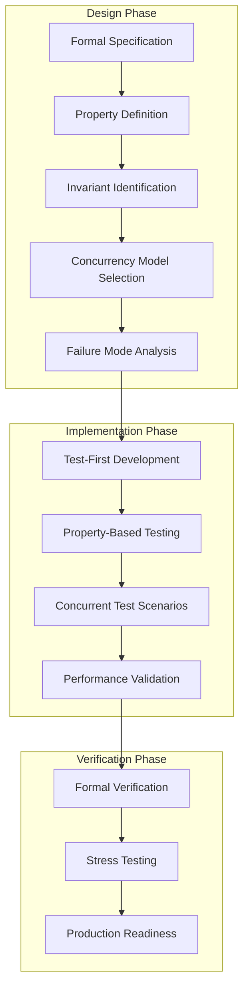
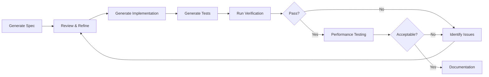
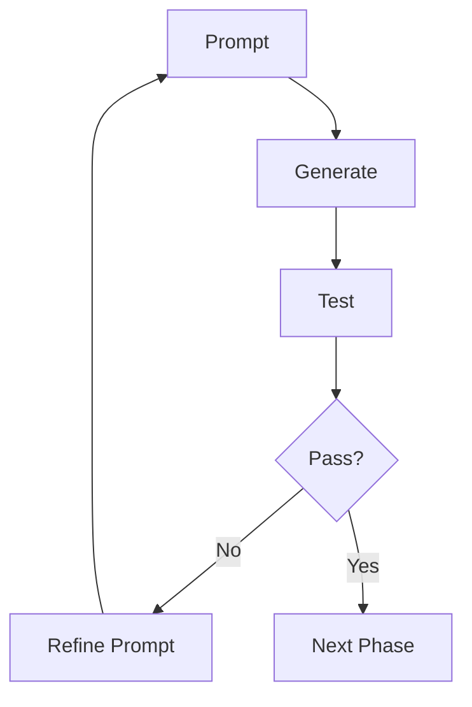

# ElixirScope Foundation Layer: Formal Concurrency Design & Implementation Guide

## Executive Summary

This document provides a systematic approach for implementing robust concurrency in the ElixirScope Foundation layer using AI-assisted development tools (Cursor/Claude). The methodology addresses the critical concurrency failures identified in the reports while establishing a formal verification process.

## Table of Contents

1. [Current State Analysis](#current-state-analysis)
2. [Formal Design Process](#formal-design-process)
3. [Implementation Methodology](#implementation-methodology)
4. [Verification Framework](#verification-framework)
5. [AI Prompting Strategy](#ai-prompting-strategy)
6. [Phase-by-Phase Implementation](#phase-by-phase-implementation)

---

## 1. Current State Analysis

### Critical Concurrency Failures Identified

1. **Global Name Registration Conflicts**
   - All GenServers use `name: __MODULE__`
   - Tests fail with `{:already_started, pid}` errors
   - No process isolation between test runs

2. **State Contamination**
   - Shared mutable state across tests
   - No proper cleanup mechanisms
   - Race conditions in subscription management

3. **Improper Process Lifecycle**
   - Manual `GenServer.stop()` calls conflict with supervisors
   - No coordination between test cleanup and supervision tree
   - Orphaned processes from failed tests

4. **Inadequate Test Infrastructure**
   - Tests manually start services already in supervision tree
   - No test-specific supervision strategies
   - Missing concurrent test scenarios

---

## 2. Formal Design Process

### Design Methodology Framework



### Formal Specification Template

```elixir
# FORMAL SPECIFICATION: Service Concurrency Contract
defmodule ServiceName.Specification do
  @moduledoc """
  Formal specification for ServiceName concurrency behavior.
  
  ## Invariants
  1. At most one instance per name in process registry
  2. State consistency across concurrent operations
  3. Proper cleanup on process termination
  
  ## Properties
  - Linearizability: Operations appear atomic
  - Progress: System makes forward progress
  - Fairness: All requests eventually served
  
  ## Failure Modes
  - Process crash → Supervisor restart
  - Name conflict → Controlled rejection
  - Resource exhaustion → Backpressure
  """
end
```

---

## 3. Implementation Methodology

### Phase 1: Process Registration Reform

```elixir
defmodule Foundation.ProcessRegistry do
  @moduledoc """
  Centralized process registration with namespace isolation.
  """
  
  @type namespace :: :production | :test | {:test, reference()}
  @type service :: :config_server | :event_store | :telemetry_service
  
  @spec register(namespace(), service(), pid()) :: :ok | {:error, {:already_registered, pid()}}
  def register(namespace, service, pid) do
    Registry.register(__MODULE__, {namespace, service}, pid)
  end
  
  @spec lookup(namespace(), service()) :: {:ok, pid()} | :error
  def lookup(namespace, service) do
    case Registry.lookup(__MODULE__, {namespace, service}) do
      [{pid, _}] -> {:ok, pid}
      [] -> :error
    end
  end
end
```

### Phase 2: Supervision Architecture

```elixir
defmodule Foundation.DynamicSupervisor do
  @moduledoc """
  Dynamic supervision for test isolation.
  """
  
  use DynamicSupervisor
  
  def start_link(init_arg) do
    DynamicSupervisor.start_link(__MODULE__, init_arg, name: __MODULE__)
  end
  
  @impl true
  def init(_init_arg) do
    DynamicSupervisor.init(strategy: :one_for_one)
  end
  
  def start_isolated_services(test_ref) do
    children = [
      {ConfigServer, [namespace: {:test, test_ref}]},
      {EventStore, [namespace: {:test, test_ref}]},
      {TelemetryService, [namespace: {:test, test_ref}]}
    ]
    
    for child <- children do
      DynamicSupervisor.start_child(__MODULE__, child)
    end
  end
end
```

### Phase 3: Concurrent Test Infrastructure

```elixir
defmodule Foundation.ConcurrentTestCase do
  @moduledoc """
  Test case template for concurrent testing.
  """
  
  defmacro __using__(_opts) do
    quote do
      use ExUnit.Case, async: true
      
      setup do
        test_ref = make_ref()
        {:ok, pids} = Foundation.DynamicSupervisor.start_isolated_services(test_ref)
        
        on_exit(fn ->
          Enum.each(pids, &DynamicSupervisor.terminate_child(Foundation.DynamicSupervisor, &1))
        end)
        
        {:ok, test_ref: test_ref, namespace: {:test, test_ref}}
      end
      
      def with_service(namespace, service, fun) do
        case Foundation.ProcessRegistry.lookup(namespace, service) do
          {:ok, pid} -> fun.(pid)
          :error -> flunk("Service #{service} not found in namespace #{inspect(namespace)}")
        end
      end
    end
  end
end
```

---

## 4. Verification Framework

### Property-Based Testing Suite

```elixir
defmodule Foundation.Properties do
  use ExUnitProperties
  
  property "concurrent config updates maintain consistency" do
    check all operations <- list_of(config_operation_gen()),
              max_runs: 1000 do
      
      # Start isolated services
      {:ok, namespace} = start_test_services()
      
      # Execute operations concurrently
      tasks = Enum.map(operations, fn op ->
        Task.async(fn -> execute_operation(namespace, op) end)
      end)
      
      results = Task.await_many(tasks)
      
      # Verify consistency
      assert verify_consistency(namespace, operations, results)
    end
  end
  
  defp config_operation_gen do
    gen all path <- path_gen(),
            value <- term_gen(),
            op_type <- member_of([:get, :update]) do
      {op_type, path, value}
    end
  end
end
```

### Concurrent Test Scenarios

```elixir
defmodule Foundation.ConcurrencyTest do
  use Foundation.ConcurrentTestCase
  
  @tag :concurrent
  test "handles 1000 concurrent reads", %{namespace: ns} do
    tasks = for _ <- 1..1000 do
      Task.async(fn ->
        with_service(ns, :config_server, fn pid ->
          GenServer.call(pid, {:get_config_path, [:ai, :provider]})
        end)
      end)
    end
    
    results = Task.await_many(tasks, 5000)
    assert Enum.all?(results, &match?({:ok, _}, &1))
  end
  
  @tag :concurrent
  test "serializes concurrent updates correctly", %{namespace: ns} do
    counter_path = [:test, :counter]
    
    # Initialize counter
    with_service(ns, :config_server, fn pid ->
      GenServer.call(pid, {:update_config, counter_path, 0})
    end)
    
    # Concurrent increments
    tasks = for i <- 1..100 do
      Task.async(fn ->
        with_service(ns, :config_server, fn pid ->
          {:ok, current} = GenServer.call(pid, {:get_config_path, counter_path})
          GenServer.call(pid, {:update_config, counter_path, current + 1})
        end)
      end)
    end
    
    Task.await_many(tasks)
    
    # Verify final state
    with_service(ns, :config_server, fn pid ->
      {:ok, final} = GenServer.call(pid, {:get_config_path, counter_path})
      assert final == 100
    end)
  end
end
```

### Chaos Testing Framework

```elixir
defmodule Foundation.ChaosTest do
  @moduledoc """
  Chaos engineering tests for concurrency robustness.
  """
  
  use Foundation.ConcurrentTestCase
  
  @tag :chaos
  test "survives random process kills", %{namespace: ns} do
    # Start background load
    load_task = Task.async(fn -> generate_load(ns, 10_000) end)
    
    # Random process kills
    for _ <- 1..10 do
      Process.sleep(100)
      with_service(ns, Enum.random([:config_server, :event_store]), fn pid ->
        Process.exit(pid, :kill)
      end)
    end
    
    # Verify system recovers
    Process.sleep(500)
    assert all_services_healthy?(ns)
    
    # Stop load generation
    Task.shutdown(load_task)
  end
end
```

---

## 5. AI Prompting Strategy

### Systematic Prompting Workflow

#### Phase 1: Design Specification

```markdown
PROMPT 1: Formal Specification Generation
"Generate a formal TLA+ or Alloy specification for the ElixirScope Foundation ConfigServer with the following properties:
- Linearizable read/write operations
- Subscription consistency guarantees
- Proper cleanup on subscriber death
- At-most-once update notifications

Include invariants, temporal properties, and failure scenarios."

VERIFICATION: Review generated spec for completeness and correctness.
```

#### Phase 2: Implementation Generation

```markdown
PROMPT 2: OTP-Compliant Implementation
"Implement ConfigServer as an OTP GenServer with:
1. Registry-based process discovery using {:via, Registry, {namespace, :config_server}}
2. Subscription management with automatic cleanup via Process.monitor
3. Linearizable operations using GenServer.call for all state mutations
4. Comprehensive error handling following 'let it crash' philosophy

Include proper child_spec/1 for supervision tree integration."

VERIFICATION: 
- Check all callbacks implemented
- Verify supervision compliance
- Review error handling patterns
```

#### Phase 3: Test Generation

```markdown
PROMPT 3: Concurrent Test Suite
"Generate a comprehensive concurrent test suite for ConfigServer including:
1. Property-based tests for linearizability
2. Concurrent operation scenarios (1000+ concurrent ops)
3. Chaos tests with random failures
4. Performance benchmarks under load
5. Proper test isolation using DynamicSupervisor

Use StreamData for property generation."

VERIFICATION:
- Run tests with async: true
- Check for race conditions
- Verify cleanup procedures
```

### Iterative Refinement Process



---

## 6. Phase-by-Phase Implementation

### Phase 1: Foundation Infrastructure (Week 1)

```elixir
# Day 1-2: Process Registry
defmodule Foundation.Registry do
  def child_spec(_opts) do
    Registry.child_spec(
      keys: :unique,
      name: __MODULE__,
      partitions: System.schedulers_online()
    )
  end
end

# Day 3-4: Dynamic Supervision
defmodule Foundation.ServiceSupervisor do
  use DynamicSupervisor
  
  def start_services(namespace) do
    for {module, opts} <- service_specs(namespace) do
      DynamicSupervisor.start_child(__MODULE__, {module, opts})
    end
  end
end

# Day 5: Test Infrastructure
defmodule Foundation.TestCase do
  defmacro __using__(_) do
    quote do
      use ExUnit.Case, async: true
      import Foundation.TestHelpers
      
      setup :start_isolated_services
      setup :cleanup_on_exit
    end
  end
end
```

### Phase 2: Service Migration (Week 2)

```elixir
# Day 1-2: ConfigServer Migration
defmodule ConfigServer do
  use GenServer
  
  def start_link(opts) do
    namespace = Keyword.get(opts, :namespace, :production)
    name = {:via, Registry, {Foundation.Registry, {namespace, :config_server}}}
    GenServer.start_link(__MODULE__, opts, name: name)
  end
end

# Day 3-4: EventStore Migration
# Similar pattern...

# Day 5: Integration Testing
defmodule Foundation.IntegrationTest do
  use Foundation.TestCase
  
  test "services integrate correctly", %{namespace: ns} do
    # Test cross-service communication
  end
end
```

### Phase 3: Verification & Hardening (Week 3)

```elixir
# Day 1-2: Property-Based Tests
defmodule Foundation.PropertyTest do
  use ExUnitProperties
  
  property "all operations are linearizable" do
    check all ops <- list_of(operation_gen()) do
      assert verify_linearizability(ops)
    end
  end
end

# Day 3-4: Performance Testing
defmodule Foundation.BenchmarkTest do
  use Foundation.TestCase
  
  @tag :benchmark
  test "meets performance targets" do
    results = Benchee.run(%{
      "config_read" => fn -> Config.get([:ai, :provider]) end,
      "event_store" => fn -> Events.store(test_event()) end
    })
    
    assert results["config_read"].average < 100_000  # nanoseconds
  end
end

# Day 5: Documentation & Review
```

### Phase 4: Production Readiness (Week 4)

```elixir
# Monitoring Integration
defmodule Foundation.HealthCheck do
  def check_all_services do
    services = [:config_server, :event_store, :telemetry_service]
    
    Enum.map(services, fn service ->
      {service, check_service_health(service)}
    end)
  end
end

# Graceful Shutdown
defmodule Foundation.Shutdown do
  def graceful_shutdown do
    # 1. Stop accepting new requests
    # 2. Drain existing work
    # 3. Persist state if needed
    # 4. Clean shutdown
  end
end
```

---

## Verification Checklist

### Design Phase
- [ ] Formal specification written and reviewed
- [ ] All invariants identified and documented
- [ ] Failure modes analyzed and documented
- [ ] Concurrency model selected and justified

### Implementation Phase
- [ ] Registry-based process discovery implemented
- [ ] Dynamic supervision for test isolation
- [ ] All services migrated to new architecture
- [ ] Error handling follows OTP principles

### Testing Phase
- [ ] Property-based tests for invariants
- [ ] Concurrent operation tests (1000+ ops)
- [ ] Chaos testing scenarios
- [ ] Performance benchmarks pass targets

### Production Readiness
- [ ] Monitoring and health checks
- [ ] Graceful shutdown procedures
- [ ] Documentation complete
- [ ] Code review completed

---

## Prompting Strategy Summary

### Effective Prompt Patterns

1. **Specification First**
   ```
   "Write a formal specification for [component] that ensures [properties]"
   ```

2. **Implementation with Constraints**
   ```
   "Implement [component] following OTP principles with [specific requirements]"
   ```

3. **Test-Driven Verification**
   ```
   "Generate property-based tests that verify [invariants] under [conditions]"
   ```

4. **Iterative Refinement**
   ```
   "Given this test failure [error], update the implementation to handle [scenario]"
   ```

### Anti-Patterns to Avoid

1. ❌ "Fix this concurrency bug" (too vague)
2. ❌ "Make it thread-safe" (not specific to BEAM)
3. ❌ "Add locks" (wrong mental model for BEAM)
4. ❌ "Implement mutex" (not idiomatic Elixir)

### Verification Loop



---

## Conclusion

This formal approach to concurrency design and implementation provides:

1. **Systematic methodology** for addressing concurrency issues
2. **Formal verification** of correctness properties
3. **Comprehensive testing** including chaos scenarios
4. **Clear prompting strategy** for AI-assisted development
5. **Phased implementation** with verification gates

Following this guide will transform the ElixirScope Foundation layer from its current ad-hoc concurrency model to a formally verified, robust concurrent system suitable for production use.