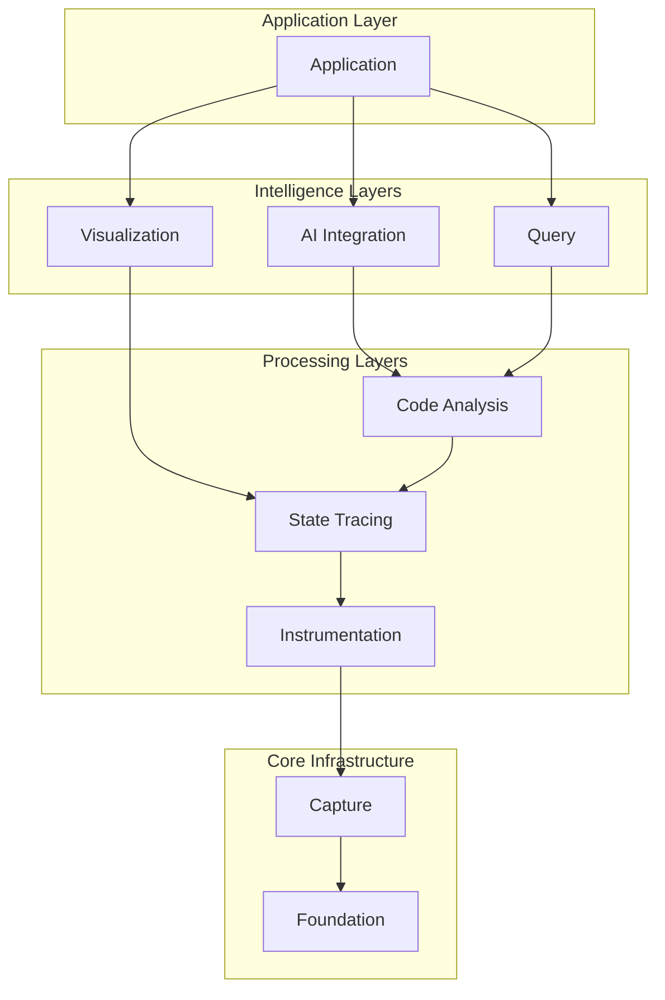
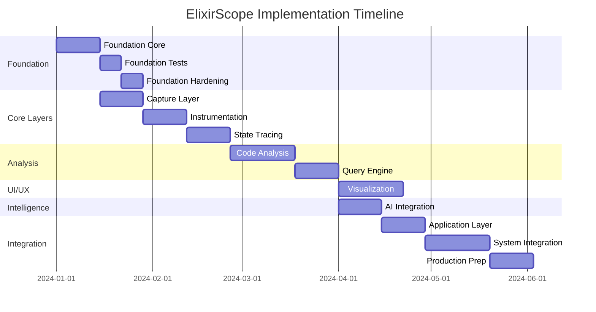

# ElixirScope: Comprehensive System Design & Implementation Document

## Executive Summary

This document provides a formal design and implementation strategy for the complete ElixirScope system, comprising 9 interconnected modules built on BEAM/OTP principles. The methodology emphasizes systematic concurrency design, proper supervision hierarchies, and formal verification across all layers.

## Table of Contents

1. [System Architecture Overview](#1-system-architecture-overview)
2. [Layer-by-Layer Design Specifications](#2-layer-by-layer-design-specifications)
3. [Inter-Layer Communication Protocols](#3-inter-layer-communication-protocols)
4. [Concurrency Architecture Design](#4-concurrency-architecture-design)
5. [Implementation Methodology](#5-implementation-methodology)
6. [Verification Framework](#6-verification-framework)
7. [AI-Assisted Development Strategy](#7-ai-assisted-development-strategy)
8. [Phased Rollout Plan](#8-phased-rollout-plan)

---

## 1. System Architecture Overview

### Layer Hierarchy



### Module Dependency Matrix

| Module | Direct Dependencies | Indirect Dependencies | Concurrency Model |
|--------|--------------------|--------------------|-------------------|
| Foundation | None | None | Actor Model (GenServers) |
| Capture | Foundation | None | Ring Buffer + Flow Control |
| Instrumentation | Capture, Foundation | None | Tracer Process Pool |
| State Tracing | Instrumentation | Capture, Foundation | Event Streaming |
| Code Analysis | State Tracing | All below | Parallel Analysis Workers |
| Query | Code Analysis | All below | Query Engine + Cache |
| Visualization | Query, State Tracing | All below | Reactive Streams |
| AI Integration | Query, Code Analysis | All below | Async Task Processing |
| Application | All | All | Supervision + Coordination |

### System-Wide Invariants

```elixir
defmodule ElixirScope.SystemInvariants do
  @moduledoc """
  System-wide invariants that must hold across all modules.
  """
  
  @invariants [
    # Ordering invariant: Events maintain causal ordering within correlation chains
    {:event_ordering, "∀ e1, e2 : e1.correlation_id = e2.correlation_id ∧ e1.timestamp < e2.timestamp ⟹ e1 ≺ e2"},
    
    # Resource bounds: No module exceeds defined resource limits
    {:resource_bounds, "∀ m ∈ Modules : m.memory_usage ≤ m.max_memory ∧ m.process_count ≤ m.max_processes"},
    
    # Backpressure: Higher layers respect lower layer capacity
    {:backpressure, "∀ l1, l2 : l1 depends_on l2 ⟹ l1.throughput ≤ l2.capacity"},
    
    # Fault isolation: Failure in one module doesn't cascade
    {:fault_isolation, "∀ m1, m2 : m1 ≠ m2 ⟹ failure(m1) ⊭ failure(m2)"}
  ]
end
```

---

## 2. Layer-by-Layer Design Specifications

### 2.1 Foundation Layer (Already Detailed)

```elixir
defmodule Foundation.Specification do
  @moduledoc """
  Foundation provides core infrastructure services.
  """
  
  @services [
    ConfigServer: "Configuration management with hot reload",
    EventStore: "Event persistence and querying",
    TelemetryService: "Metrics collection and aggregation"
  ]
  
  @concurrency_model """
  - Actor Model via GenServers
  - Registry-based process discovery
  - One-for-one supervision
  """
end
```

### 2.2 Capture Layer

```elixir
defmodule Capture.Specification do
  @moduledoc """
  High-performance event capture with backpressure management.
  """
  
  @components %{
    RingBuffer: "Lock-free circular buffer for event batching",
    FlowController: "Adaptive backpressure based on downstream capacity",
    EventSerializer: "Efficient binary serialization",
    BatchProcessor: "Configurable batch aggregation"
  }
  
  @concurrency_design """
  ## Ring Buffer Architecture
  - Multiple producer, single consumer per buffer
  - CPU-local buffers to minimize contention
  - Wait-free writes, lock-free reads
  
  ## Flow Control
  - Token bucket algorithm for rate limiting
  - Adaptive sampling under pressure
  - Graceful degradation modes
  """
  
  @formal_spec """
  RingBuffer invariants:
  - Write pointer always ahead of read pointer
  - No data loss within capacity bounds
  - Ordering preserved within producer
  
  FlowControl properties:
  - Maintains throughput ≤ configured rate
  - Fairness across producers
  - Minimal latency impact
  """
end
```

**Implementation Approach**:

```elixir
defmodule Capture.RingBuffer do
  use GenServer
  
  defstruct [
    :buffer,        # :atomics for lock-free access
    :write_pos,     # :atomics position
    :read_pos,      # :atomics position
    :capacity,
    :stats
  ]
  
  def init(opts) do
    capacity = Keyword.fetch!(opts, :capacity)
    
    state = %__MODULE__{
      buffer: :atomics.new(capacity, signed: false),
      write_pos: :atomics.new(1, signed: false),
      read_pos: :atomics.new(1, signed: false),
      capacity: capacity,
      stats: init_stats()
    }
    
    {:ok, state}
  end
  
  # Lock-free write
  def write(buffer, event) do
    serialized = :erlang.term_to_binary(event)
    size = byte_size(serialized)
    
    # Atomic increment and get position
    pos = :atomics.add_get(buffer.write_pos, 1, size)
    actual_pos = rem(pos, buffer.capacity)
    
    # Write to buffer
    :atomics.put(buffer.buffer, actual_pos, serialized)
    :ok
  end
end
```

### 2.3 Instrumentation Layer

```elixir
defmodule Instrumentation.Specification do
  @moduledoc """
  Dynamic code instrumentation and tracing orchestration.
  """
  
  @components %{
    TracerPool: "Pool of tracer processes for parallel tracing",
    InstrumentationEngine: "AST transformation for injection points",
    TraceController: "Dynamic enable/disable of trace points",
    SamplingStrategy: "Adaptive sampling based on system load"
  }
  
  @concurrency_design """
  ## Tracer Pool Architecture
  - Pool size = CPU cores * 2
  - Work stealing for load balance
  - Dedicated tracers per module under analysis
  
  ## Instrumentation Strategy
  - Copy-on-write for hot code patching
  - Minimal overhead injection points
  - Reversible instrumentation
  """
  
  @performance_requirements %{
    overhead: "< 5% for instrumented code",
    latency: "< 1μs per trace point",
    memory: "< 100MB for trace buffers"
  }
end
```

**Tracer Pool Implementation**:

```elixir
defmodule Instrumentation.TracerPool do
  use Supervisor
  
  def start_link(opts) do
    Supervisor.start_link(__MODULE__, opts, name: __MODULE__)
  end
  
  @impl true
  def init(opts) do
    pool_size = Keyword.get(opts, :pool_size, System.schedulers_online() * 2)
    
    children = for i <- 1..pool_size do
      Supervisor.child_spec(
        {Instrumentation.Tracer, [id: i]},
        id: {Tracer, i}
      )
    end
    
    Supervisor.init(children, strategy: :one_for_one)
  end
  
  def trace(module, function, args) do
    # Hash-based tracer selection for consistency
    tracer_id = :erlang.phash2({module, function}, pool_size()) + 1
    Tracer.trace(tracer_id, module, function, args)
  end
end
```

### 2.4 State Tracing Layer

```elixir
defmodule StateTracing.Specification do
  @moduledoc """
  Process state tracking and correlation analysis.
  """
  
  @components %{
    StateTracker: "Track GenServer state transitions",
    CorrelationEngine: "Build causal event chains",
    StateReplay: "Reconstruct historical state",
    DiffEngine: "Efficient state comparison"
  }
  
  @algorithms %{
    correlation: "Vector clocks for causal ordering",
    diff: "Myers diff algorithm for state changes",
    compression: "Structure sharing for memory efficiency"
  }
  
  @concurrency_design """
  ## Event Streaming Architecture
  - GenStage pipeline for backpressure
  - Parallel correlation analysis
  - Async state reconstruction
  
  ## Memory Management
  - Generational state storage
  - Copy-on-write for state snapshots
  - Automatic old state pruning
  """
end
```

**GenStage Pipeline**:

```elixir
defmodule StateTracing.Pipeline do
  use GenStage
  
  defmodule Producer do
    use GenStage
    
    def handle_demand(demand, state) do
      events = EventStore.fetch_events(demand)
      {:noreply, events, state}
    end
  end
  
  defmodule Correlator do
    use GenStage
    
    def handle_events(events, _from, state) do
      correlated = Enum.map(events, &correlate_event/1)
      {:noreply, correlated, state}
    end
    
    defp correlate_event(event) do
      # Vector clock correlation logic
      CorrelationEngine.correlate(event)
    end
  end
  
  defmodule Consumer do
    use GenStage
    
    def handle_events(events, _from, state) do
      # Store correlated events
      Enum.each(events, &StateStore.store/1)
      {:noreply, [], state}
    end
  end
end
```

### 2.5 Code Analysis Layer

```elixir
defmodule CodeAnalysis.Specification do
  @moduledoc """
  Parallel code analysis and pattern detection.
  """
  
  @components %{
    ASTAnalyzer: "Parallel AST traversal and analysis",
    PatternMatcher: "Detect code patterns and anti-patterns",
    DependencyGraph: "Build and analyze dependency graphs",
    MetricsCalculator: "Compute code metrics (complexity, etc.)"
  }
  
  @parallelization_strategy """
  ## Work Distribution
  - Module-level parallelism
  - Function-level work stealing
  - Incremental analysis caching
  
  ## Analysis Coordination
  - MapReduce for metrics aggregation
  - Distributed pattern matching
  - Concurrent graph algorithms
  """
end
```

**Parallel Analysis Framework**:

```elixir
defmodule CodeAnalysis.ParallelAnalyzer do
  def analyze_codebase(modules) do
    # Partition work across available cores
    partitions = partition_modules(modules, System.schedulers_online())
    
    # Spawn analysis tasks
    tasks = Enum.map(partitions, fn partition ->
      Task.async(fn -> analyze_partition(partition) end)
    end)
    
    # Gather results
    results = Task.await_many(tasks, :infinity)
    
    # Merge analysis results
    merge_results(results)
  end
  
  defp analyze_partition(modules) do
    Enum.map(modules, fn module ->
      %{
        module: module,
        ast: analyze_ast(module),
        metrics: calculate_metrics(module),
        patterns: detect_patterns(module)
      }
    end)
  end
end
```

### 2.6 Query Layer

```elixir
defmodule Query.Specification do
  @moduledoc """
  Distributed query engine with caching.
  """
  
  @components %{
    QueryParser: "Parse ElixirScope Query Language (ESQL)",
    QueryPlanner: "Optimize query execution plans",
    ExecutionEngine: "Parallel query execution",
    CacheManager: "Multi-level query result caching"
  }
  
  @query_language """
  ESQL Examples:
  - MATCH function WHERE complexity > 10
  - TRACE process FROM event_id TO event_id
  - FIND pattern IN module
  """
  
  @optimization_strategies %{
    index_usage: "Use pre-built indices when available",
    parallel_execution: "Distribute query across shards",
    cache_awareness: "Check cache before execution",
    incremental_results: "Stream results as available"
  }
end
```

### 2.7 Visualization Layer

```elixir
defmodule Visualization.Specification do
  @moduledoc """
  Real-time visualization with reactive updates.
  """
  
  @components %{
    DataTransformer: "Transform analysis data for visualization",
    StreamManager: "Manage WebSocket connections",
    RenderEngine: "Server-side rendering coordination",
    UpdateBatcher: "Batch UI updates for efficiency"
  }
  
  @streaming_architecture """
  ## Phoenix Channels Integration
  - Topic-based subscriptions
  - Presence tracking for connected clients
  - Automatic reconnection handling
  
  ## Update Strategies
  - Debounced updates (configurable rate)
  - Delta compression for changes
  - Priority-based update scheduling
  """
end
```

### 2.8 AI Integration Layer

```elixir
defmodule AIIntegration.Specification do
  @moduledoc """
  AI service integration with async processing.
  """
  
  @components %{
    PromptBuilder: "Context-aware prompt construction",
    AIServicePool: "Connection pool for AI services",
    ResponseProcessor: "Parse and validate AI responses",
    ContextManager: "Manage conversation context"
  }
  
  @concurrency_model """
  ## Async Task Processing
  - Task.Supervisor for AI requests
  - Circuit breaker for service failures
  - Request queuing with priorities
  
  ## Resource Management
  - Token budget tracking
  - Rate limiting per service
  - Cost optimization strategies
  """
end
```

### 2.9 Application Layer

```elixir
defmodule Application.Specification do
  @moduledoc """
  Top-level application coordination and lifecycle.
  """
  
  @responsibilities %{
    lifecycle: "Start/stop all services in correct order",
    configuration: "Load and distribute configuration",
    monitoring: "Health checks and metrics aggregation",
    api_gateway: "External API request routing"
  }
  
  @supervision_tree """
  Application.Supervisor (rest_for_one)
  ├── Foundation.Supervisor
  ├── Capture.Supervisor
  ├── Instrumentation.Supervisor
  ├── StateTracing.Supervisor
  ├── CodeAnalysis.Supervisor
  ├── Query.Supervisor
  ├── Visualization.Supervisor
  ├── AIIntegration.Supervisor
  └── API.Endpoint
  """
end
```

---

## 3. Inter-Layer Communication Protocols

### 3.1 Message Contracts

```elixir
defmodule ElixirScope.Protocols do
  @moduledoc """
  Standardized message formats for inter-layer communication.
  """
  
  defmodule Request do
    @enforce_keys [:id, :from_layer, :to_layer, :operation]
    defstruct [
      :id,
      :from_layer,
      :to_layer,
      :operation,
      :params,
      :correlation_id,
      :timeout,
      :priority
    ]
  end
  
  defmodule Response do
    @enforce_keys [:id, :status, :from_layer]
    defstruct [
      :id,
      :status,  # :ok | :error | :partial
      :from_layer,
      :data,
      :error,
      :metadata
    ]
  end
  
  defmodule Event do
    @enforce_keys [:type, :source_layer, :timestamp]
    defstruct [
      :type,
      :source_layer,
      :timestamp,
      :data,
      :correlation_id,
      :causation_id
    ]
  end
end
```

### 3.2 Communication Patterns

```elixir
defmodule ElixirScope.Communication do
  @moduledoc """
  Inter-layer communication patterns and helpers.
  """
  
  @doc """
  Synchronous request with timeout and retry.
  """
  def call(to_layer, operation, params, opts \\ []) do
    request = %Request{
      id: generate_id(),
      from_layer: self_layer(),
      to_layer: to_layer,
      operation: operation,
      params: params,
      timeout: Keyword.get(opts, :timeout, 5000)
    }
    
    with {:ok, pid} <- LayerRegistry.lookup(to_layer),
         {:ok, response} <- GenServer.call(pid, request, request.timeout) do
      handle_response(response)
    else
      {:error, :not_found} -> {:error, :layer_not_available}
      {:error, reason} -> {:error, reason}
    end
  end
  
  @doc """
  Asynchronous cast for fire-and-forget operations.
  """
  def cast(to_layer, operation, params) do
    request = %Request{
      id: generate_id(),
      from_layer: self_layer(),
      to_layer: to_layer,
      operation: operation,
      params: params
    }
    
    with {:ok, pid} <- LayerRegistry.lookup(to_layer) do
      GenServer.cast(pid, request)
    end
  end
  
  @doc """
  Broadcast event to interested layers.
  """
  def broadcast(event) do
    Registry.dispatch(EventRegistry, event.type, fn entries ->
      for {pid, _} <- entries do
        send(pid, {:event, event})
      end
    end)
  end
end
```

### 3.3 Backpressure Protocol

```elixir
defmodule ElixirScope.Backpressure do
  @moduledoc """
  System-wide backpressure coordination.
  """
  
  defmodule Protocol do
    @doc """
    Check if layer can accept more work.
    """
    def can_accept?(layer) do
      GenServer.call(layer, :check_capacity)
    end
    
    @doc """
    Request capacity reservation.
    """
    def reserve_capacity(layer, amount) do
      GenServer.call(layer, {:reserve_capacity, amount})
    end
    
    @doc """
    Release reserved capacity.
    """
    def release_capacity(layer, reservation_id) do
      GenServer.cast(layer, {:release_capacity, reservation_id})
    end
  end
  
  defmodule Monitor do
    @doc """
    Monitor system-wide pressure and coordinate throttling.
    """
    use GenServer
    
    def init(_) do
      schedule_pressure_check()
      {:ok, %{layers: %{}, thresholds: load_thresholds()}}
    end
    
    def handle_info(:check_pressure, state) do
      pressure_levels = measure_all_layers()
      adjustments = calculate_adjustments(pressure_levels, state.thresholds)
      apply_adjustments(adjustments)
      
      schedule_pressure_check()
      {:noreply, %{state | layers: pressure_levels}}
    end
  end
end
```

---

## 4. Concurrency Architecture Design

### 4.1 System-Wide Concurrency Patterns

```elixir
defmodule ElixirScope.ConcurrencyArchitecture do
  @moduledoc """
  System-wide concurrency patterns and guidelines.
  """
  
  @patterns %{
    actor_model: """
    Used by: Foundation, Application
    When: State encapsulation, sequential operations
    Implementation: GenServer, Agent
    """,
    
    pipeline: """
    Used by: Capture, StateTracing, Query
    When: Stream processing, backpressure needed
    Implementation: GenStage, Flow
    """,
    
    worker_pool: """
    Used by: Instrumentation, CodeAnalysis, AI
    When: CPU-bound parallel work
    Implementation: Task.Supervisor, Poolboy
    """,
    
    pub_sub: """
    Used by: Visualization, Events
    When: Multi-consumer broadcasting
    Implementation: Registry, Phoenix.PubSub
    """,
    
    circuit_breaker: """
    Used by: AI Integration, External Services
    When: Fault isolation needed
    Implementation: Custom GenServer
    """
  }
end
```

### 4.2 Supervision Hierarchy

```elixir
defmodule ElixirScope.SupervisionDesign do
  @moduledoc """
  Complete supervision tree design.
  """
  
  def supervision_tree do
    %{
      "ElixirScope.Application" => %{
        strategy: :rest_for_one,
        children: [
          {"Foundation.Supervisor", %{strategy: :one_for_one}},
          {"Capture.Supervisor", %{strategy: :one_for_all}},
          {"Instrumentation.Supervisor", %{strategy: :one_for_one}},
          {"StateTracing.Supervisor", %{strategy: :rest_for_one}},
          {"CodeAnalysis.Supervisor", %{strategy: :one_for_one}},
          {"Query.Supervisor", %{strategy: :one_for_one}},
          {"Visualization.Supervisor", %{strategy: :one_for_one}},
          {"AIIntegration.Supervisor", %{strategy: :one_for_one}},
          {"API.Endpoint", %{strategy: :permanent}}
        ]
      }
    }
  end
  
  @doc """
  Restart strategies by layer.
  """
  def restart_strategies do
    %{
      foundation: "Always restart - critical services",
      capture: "Restart all - ring buffers must sync",
      instrumentation: "Restart individually - independent tracers",
      state_tracing: "Restart in order - pipeline dependencies",
      code_analysis: "Restart individually - stateless workers",
      query: "Restart individually - cache will rebuild",
      visualization: "Restart individually - clients reconnect",
      ai_integration: "Restart individually - async requests",
      application: "Never restart - top-level coordinator"
    }
  end
end
```

### 4.3 Process Registry Architecture

```elixir
defmodule ElixirScope.RegistryArchitecture do
  @moduledoc """
  System-wide process registry design.
  """
  
  def registry_structure do
    %{
      # Layer registry for inter-layer communication
      "ElixirScope.LayerRegistry" => %{
        keys: :unique,
        partitions: 1,
        purpose: "Layer-level service discovery"
      },
      
      # Service registry for intra-layer services
      "ElixirScope.ServiceRegistry" => %{
        keys: :unique,
        partitions: System.schedulers_online(),
        purpose: "Service-level process discovery"
      },
      
      # Event registry for pub/sub
      "ElixirScope.EventRegistry" => %{
        keys: :duplicate,
        partitions: System.schedulers_online(),
        purpose: "Event broadcasting"
      },
      
      # Task registry for work distribution
      "ElixirScope.TaskRegistry" => %{
        keys: :unique,
        partitions: System.schedulers_online() * 2,
        purpose: "Task tracking and distribution"
      }
    }
  end
end
```

---

## 5. Implementation Methodology

### 5.1 Development Phases



### 5.2 Test-Driven Development Process

```elixir
defmodule ElixirScope.TDD do
  @moduledoc """
  Test-driven development methodology.
  """
  
  @test_categories [
    unit: "Individual function behavior",
    integration: "Inter-module communication",
    property: "Invariant verification",
    concurrent: "Concurrency correctness",
    performance: "Throughput and latency",
    chaos: "Failure resilience",
    e2e: "End-to-end scenarios"
  ]
  
  def test_pyramid do
    %{
      unit: "70% - Fast, isolated, comprehensive",
      integration: "20% - Module boundaries",
      e2e: "10% - Critical user paths"
    }
  end
  
  def example_test_suite do
    """
    defmodule Capture.RingBufferTest do
      use ExUnit.Case, async: true
      use ExUnitProperties
      
      # Unit tests
      test "write and read single event" do
        buffer = RingBuffer.new(capacity: 100)
        event = %Event{id: 1, data: "test"}
        
        assert :ok = RingBuffer.write(buffer, event)
        assert {:ok, ^event} = RingBuffer.read(buffer)
      end
      
      # Property tests
      property "no data loss within capacity" do
        check all events <- list_of(event_gen(), max_length: 100),
                  capacity <- integer(10..1000) do
          
          buffer = RingBuffer.new(capacity: capacity)
          written = Enum.take(events, capacity)
          
          Enum.each(written, &RingBuffer.write(buffer, &1))
          read = RingBuffer.read_all(buffer)
          
          assert length(read) == length(written)
          assert read == written
        end
      end
      
      # Concurrent tests
      test "concurrent writes maintain order per producer" do
        buffer = RingBuffer.new(capacity: 10_000)
        
        tasks = for producer <- 1..10 do
          Task.async(fn ->
            for i <- 1..100 do
              event = %Event{id: {producer, i}}
              RingBuffer.write(buffer, event)
            end
          end)
        end
        
        Task.await_many(tasks)
        events = RingBuffer.read_all(buffer)
        
        # Verify per-producer ordering
        for producer <- 1..10 do
          producer_events = 
            events
            |> Enum.filter(fn %{id: {p, _}} -> p == producer end)
            |> Enum.map(fn %{id: {_, i}} -> i end)
          
          assert producer_events == Enum.to_list(1..100)
        end
      end
    end
    """
  end
end
```

### 5.3 Continuous Integration Pipeline

```yaml
# .github/workflows/elixirscope-ci.yml
name: ElixirScope CI

on: [push, pull_request]

jobs:
  test:
    runs-on: ubuntu-latest
    strategy:
      matrix:
        otp: [25.x, 26.x]
        elixir: [1.14.x, 1.15.x]
    
    steps:
    - uses: actions/checkout@v3
    
    - name: Setup Elixir
      uses: erlef/setup-beam@v1
      with:
        otp-version: ${{matrix.otp}}
        elixir-version: ${{matrix.elixir}}
    
    - name: Install Dependencies
      run: |
        mix deps.get
        mix compile --warnings-as-errors
    
    - name: Run Tests
      run: |
        mix test --trace
        mix test.concurrent
        mix test.property --max-runs=1000
    
    - name: Run Dialyzer
      run: mix dialyzer
    
    - name: Check Format
      run: mix format --check-formatted
    
    - name: Run Credo
      run: mix credo --strict
    
    - name: Performance Tests
      run: mix test.performance --tag benchmark
    
    - name: Coverage Report
      run: mix coveralls.github
```

---

## 6. Verification Framework

### 6.1 Formal Verification Strategy

```elixir
defmodule ElixirScope.FormalVerification do
  @moduledoc """
  Formal verification approach using property-based testing.
  """
  
  def verification_levels do
    %{
      level_1: "Type safety via Dialyzer specs",
      level_2: "Property-based testing for invariants",
      level_3: "Model checking for critical paths",
      level_4: "Proof assistants for core algorithms"
    }
  end
  
  def property_categories do
    [
      safety: "Nothing bad happens",
      liveness: "Something good eventually happens",
      fairness: "All requests are eventually served",
      consistency: "System state remains consistent"
    ]
  end
  
  def example_properties do
    """
    # Safety property: No event loss
    property "events are never lost" do
      check all operations <- list_of(operation_gen()) do
        system = System.new()
        final_system = execute_operations(system, operations)
        
        stored_events = get_all_events(final_system)
        submitted_events = extract_submitted_events(operations)
        
        assert MapSet.subset?(
          MapSet.new(submitted_events),
          MapSet.new(stored_events)
        )
      end
    end
    
    # Liveness property: Queries eventually complete
    property "queries complete within timeout" do
      check all query <- query_gen(),
                system <- system_gen() do
        
        task = Task.async(fn -> Query.execute(system, query) end)
        result = Task.yield(task, 5000)
        
        assert result != nil
      end
    end
    
    # Consistency property: Causal ordering maintained
    property "causal ordering is preserved" do
      check all events <- list_of(correlated_event_gen()) do
        stored = EventStore.store_batch(events)
        retrieved = EventStore.get_by_correlation(correlation_id)
        
        assert is_causally